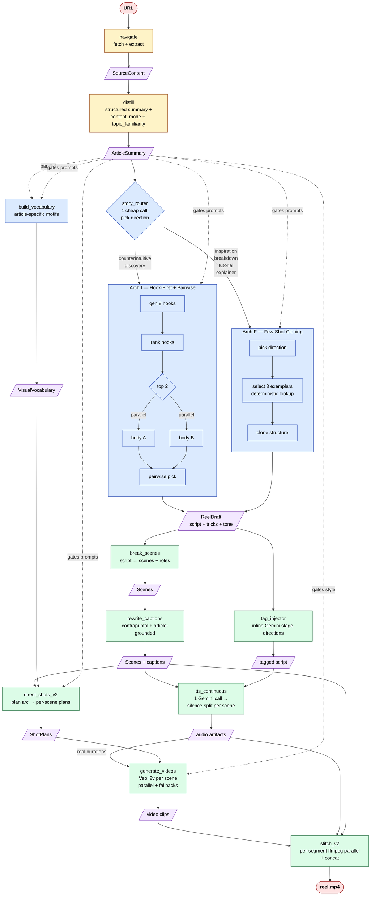

# reel-af — Algorithm

URL → 25-second vertical viral reel, built as a multi-agent system on AgentField.

This doc is the strategic map: what the pipeline does, why each stage exists, and where the parallelism lives. The implementation is in `src/reel_af/pipeline.py` (orchestrator) plus the agents under `src/reel_af/agents/`.

---

## Strategic shape

Three phases, each with a different bet:

1. **Ingest → Understand** — `navigate → distill`. Produce one `ArticleSummary` with two **routing axes** (`content_mode`, `topic_familiarity`) that gate every downstream prompt. The pipeline is content-aware from this point on; everything below switches voice / style / exemplar set based on these axes.

2. **Script** — `story_router` makes one cheap direction-picker call, then dispatches to one of two architectures:
   - **Arch I — Hook-First + Pairwise.** Generate 8 hooks → rank → 2 bodies in parallel → pairwise pick. Wins on counterintuitive / discovery / inspiration content where hook strength is the whole game.
   - **Arch F — Few-Shot Cloning.** Pick direction → pull 3 viral exemplars from the curated library → clone the structure. Wins on genre-bound content (breakdown / tutorial / explainer) where exemplars dominate.

   The router is the cheap intelligence: ~10s of LLM cost to save 60-90s of running the wrong architecture.

3. **Render** — fan-out everything that can be parallelized:
   - `break_scenes` splits the script into scene-sized chunks with on-screen captions.
   - `rewrite_captions` (article-grounded contrapuntal rewrite) **runs in parallel with** `tag_injector` (inline Gemini TTS audio-tag stage directions) — both need only the script.
   - `direct_shots_v2` (per-scene visual planning, motif-grounded) **runs in parallel with** `tts_continuous` (one-shot Gemini TTS over the full tagged script, then silence-split per scene).
   - `generate_videos` does Veo i2v per scene, all in parallel, sized to the real audio durations (estimates under-shoot and cause last-frame freezes).
   - `stitch_v2` renders every clip in parallel ffmpeg processes, then concatenates.

The whole reel produces in ~80-120s wall-time for typical articles.

---

## Mermaid

---

## Strategic notes per stage

### Ingest

**`navigate`** is intentionally NOT a `.harness()` — it's an `aiohttp` fetch + extract. No LLM cost where determinism is cheap.

**`distill`** is `.ai()` with a closed-shape `ArticleSummary` schema. Produces two routing axes downstream prompts switch on:
- `content_mode ∈ {general, scientific}` — scientific mode invokes `SCIENTIFIC_WRITING_GUIDE` (lead-with-result, jargon ok, baseline comparison).
- `topic_familiarity ∈ {hot, obscure}` — obscure mode invokes `OBSCURE_WRITING_GUIDE` (define before judge, plain language register).
- Plus a `jargon_glossary` (closed-shape `JargonEntry` after the OpenAI strict-mode fix in `b9bc69f`).

### Script

**`story_router`** is the meta-prompting bet: spend ~10s of cheap classification to avoid wasting 60-90s on the wrong architecture. The mapping is empirical, not learned — see the comment block in `story_router.py`.

**Arch I** is the more general default. The strategic move is **pairwise > absolute scoring**: when picking between 2 complete scripts, the model is much better at "A beat B because..." than at "this is a 7.4/10". The 8-hook fan-out is the B-architecture's bet that hook quality dominates retention.

**Arch F** trades creativity for genre-fit. The exemplar library (`viral_exemplars.py`) is the curated taste — 9 exemplars per direction, deterministic top-3 selection, clone-structure prompt. Wins on "breakdown" or "tutorial" content where the format IS the value.

**`build_vocabulary`** kicks off in parallel with the router because it only needs `summary` — it's free latency we steal back.

### Render

**Scene breaking + role assignment.** `break_scenes` is one `.ai()` call. Roles (`hook`, `stakes`, `revelation`, `consequence`, `callback`, `body`) are assigned deterministically from scene position, not by the LLM. This is the "no LLM where code suffices" principle — position is mechanical, judgment is for content.

**Captions are contrapuntal.** `rewrite_captions` reads the article summary AND the scene sentence and writes a 1-4 word burned caption that **adds** information (the named entity, the number, the plain-English jargon translation) rather than echoing the voice. This is the highest-leverage retention move per dollar in the pipeline.

**Tag injection precedes TTS.** `tag_injector` adds inline `[excited]`, `[pause]`, `[whispers]` directives that Gemini Flash TTS reads as stage directions (and never speaks aloud). This replaced the prior em-dash + ALL-CAPS pseudo-direction hack.

**Audio-first sizing.** Video generation **waits on** audio durations because Veo's clip-length estimates under-shoot the real spoken duration, producing last-frame freezes during voiceover. `ffprobe` on the per-scene WAV → exact target duration → Veo clip sized to match.

**Veo fan-out + two fallbacks.** Per-scene Veo i2v calls all parallel. Failure ladder:
1. Image generation fails → placeholder still + ken-burns motion.
2. Veo i2v fails (most often: content moderation false-positive) → first frame as still + ken-burns.

Either way, the reel still assembles. No single-shot failure takes down the whole run.

**Stitch is embarrassingly parallel.** Each segment is its own ffmpeg subprocess (each ~1 core). Wall-time collapses from `sum(segments)` to `max(segments)`.

---

## SDK call paths

Every model call goes through AgentField's SDK (see `AGENTFIELD_SDK_ISSUES.md` for the bugs surfaced and now fixed upstream):

| Call            | SDK entry point                               |
|---              |---                                            |
| Chat / structured | `app.ai(...)`                              |
| Image           | `OpenRouterProvider().generate_image(...)`    |
| Video (Veo i2v) | `OpenRouterProvider().generate_video(...)`    |
| Audio (TTS)     | `OpenRouterProvider().generate_audio(...)`    |

Non-model HTTP (article fetching in `navigator.py`) uses `aiohttp` directly — not a provider call, no SDK equivalent.

---

## Parallelism cheat-sheet

What's overlapping at each stage:

| Stage                 | What runs in parallel                                   | Why                                         |
|---                    |---                                                      |---                                          |
| After `distill`       | `route_and_run` ∥ `build_vocabulary`                    | Vocab only needs summary; free latency.     |
| Inside Arch I         | 2 body writers (one per top-ranked hook)                | Independent prompts.                        |
| After Arch I/F        | `break_scenes` ∥ `tag_injector`                         | Both need only the script.                  |
| After scenes + tags   | `direct_shots_v2` ∥ `tts_continuous`                    | Independent past this point.                |
| Inside `direct_shots_v2` | per-scene `_direct_one` calls                        | Each scene plans independently.             |
| Video generation      | N scenes × `gen_shot`                                   | Veo i2v calls are independent.              |
| Stitch                | N ffmpeg per-segment renders                            | Each ffmpeg saturates ~1 core.              |

Total wall-time: typically 80-120s for a 25s reel.
