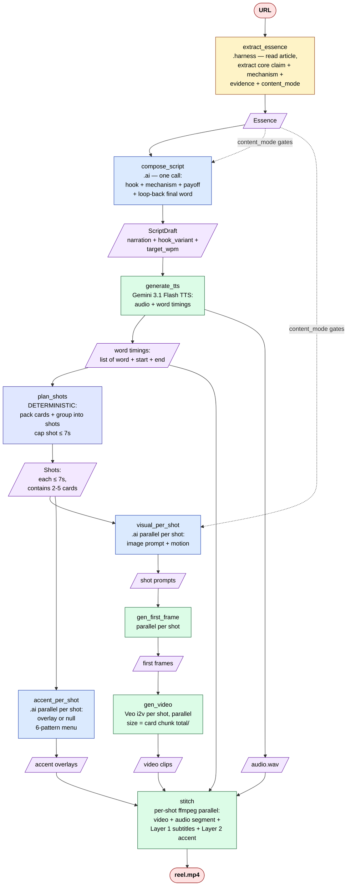

# reel-af v2 — Proposed architecture

A redesign of the URL → 25-second vertical reel pipeline, grounded in the research findings (`docs/RESEARCH.md`) and the hard production constraints (`docs/ALGORITHM.md` documents the current state for comparison).

This document is a design proposal. **Nothing here is built yet.** The proposed code lives in a new `src/reel_af/v2/` tree alongside the existing pipeline so we can run both, A/B them on the same articles, and delete the old code once v2 reaches parity-or-better.

---

## Design constraints

Three hard constraints anchor the design:

### C1. Veo clips top out at 8 seconds.
The current SDK confirms `_VEO_DURATIONS = {4, 6, 8}` (see `src/reel_af/agents/video_gen.py:73`). Any visual unit longer than 8s must be split. Today, scenes happen to be ~3-5s each so this isn't biting — but as we move to a shot-based model that aligns to TTS word timings rather than LLM-decided scenes, the planner must guarantee no shot exceeds 7s of audio (leaving 1s of Veo headroom + safety).

### C2. Subtitles must not overflow the 9:16 safe zone.
TikTok and Reels burn UI on the **bottom 480px** of a 1920px canvas and the **right 120-140px**. Safe burned-text stage is ~840×1280 centered, biased upward. Subtitle wrapping has to be deterministic — bound by char width with known font metrics (Montserrat Bold ~80px = ~25 chars/line), not by word count alone. Cards exceeding 2 lines must be repacked.

### C3. Text, audio, and video timing must be derived from one source of truth.
Today's pipeline derives audio durations from `ffprobe`, derives shot duration from those, derives scene boundaries from a separate `break_scenes` LLM call, and derives captions from yet another LLM call. Four independent timing sources → drift, freezes, off-screen text. **The new design uses TTS word-level timings as the single source** — they drive subtitle cards, shot boundaries, and video clip durations deterministically.

---

## What the research forces us to change

From `docs/RESEARCH.md`, three findings translate directly into architectural moves:

1. **Hook does ~80% of the work.** Drop the router + 2-architecture system. The whole pipeline is one fixed Hook → Mechanism → Payoff → Loop structure, parameterized by a typed `hook_variant` and `content_mode`. Intelligence concentrates on writing one strong hook, not on choosing between architectures.

2. **Verbatim word-by-word subtitles are non-negotiable** (80-85% mute viewing). The current "contrapuntal caption" replaces the dialogue layer — wrong. New design has two stacked text layers: Layer 1 is mechanical verbatim subtitles auto-driven by TTS word timings; Layer 2 is an editorial accent overlay constrained to 6 patterns, nullable per shot.

3. **End abruptly, callback the first line.** Loops drive view counts on YouTube Shorts (rule change Mar 2025). The script-writer must produce a final word that callbacks the hook; verbal CTAs are removed.

---

## The pipeline

Five phases, ~6-10 LLM calls per reel (down from ~20-25).



---

## Phase walkthrough

### Phase 1 — Extract essence (1 `.harness()` call)

`extract_essence(url) → Essence`

A single AgentField harness that:
- Navigates the article (HTTP fetch + content extraction, may need to scroll/follow links for paywalled or multi-page sources).
- Reads enough of the article to identify the **single most surprising or counter-intuitive claim**.
- Pulls the **mechanism** (the WHY behind the claim — 1-2 sentences of explanation).
- Pulls **1-3 evidence pieces** (numbers, names, examples — verbatim from source).
- Classifies `content_mode ∈ {general, scientific}` and `domain` for downstream visual style.

Closed-shape output:

```python
class Essence(BaseModel):
    core_claim: str          # ≤25 words. The hook's raw material.
    mechanism: str           # 1-2 sentences. The why/how.
    evidence: list[str]      # 1-3 verbatim from article.
    content_mode: Literal["general", "scientific"]
    domain: str              # one word
```

Why `.harness()` not `.ai()`: articles vary wildly in length and structure (arXiv preprints can be 30+ pages; blog posts can be 800 words). The harness handles long inputs natively. Per the `.ai()` fallback rule from `code/CLAUDE.md` — if `.ai()` would need a fallback for every long article, it should have been `.harness()` from the start.

**Replaces:** `navigate` + `distill`. Both jobs become one because reading and extracting are the same activity.

### Phase 2 — Compose script (1 `.ai()` call)

`compose_script(essence) → ScriptDraft`

One `.ai()` call producing a fixed Hook → Mechanism → Payoff → Loop structure:

```python
class ScriptDraft(BaseModel):
    hook: str              # 6-10 words, the first spoken line
    hook_variant: Literal["shock_stat", "contrarian",
                          "authority", "curiosity_gap", "listicle"]
    mechanism_lines: list[str]  # 2-3 sentences explaining the why
    payoff_line: str       # 1 sentence. Last word callbacks hook.
    target_wpm: int        # 150 general, 130 scientific
    narration: str         # full concatenated script for TTS

    @field_validator("narration")
    def loop_back_check(cls, v, info):
        # the final word of payoff must echo a keyword from the hook
        ...
```

The prompt is fixed-shape, parameterized by `content_mode`:
- **general** → conversational register, 150 WPM, hook variant menu defaults to `shock_stat` / `contrarian` / `curiosity_gap`
- **scientific** → technical register (uses field jargon freely), 130 WPM, hook variant defaults to `authority` / `shock_stat`, payoff-first structure encouraged

Total word count targeted at **62-70 words (general)** or **50-58 words (scientific)** so the reel lands at ~25s.

The schema's `loop_back_check` validator enforces the close: if the model produces a narration whose payoff doesn't callback the hook, we retry once with that specific feedback. No verbal CTA; the close IS the loop.

**Replaces:** `route_and_run` + `arch_b` (8 hooks + rank + 2 bodies + pick) + `arch_f` (exemplar clone) + `arch_i` (hybrid) + `tag_injector`. Five LLM stages collapse into one.

The audio-tag injection (Gemini TTS stage directions) folds into the same call — the prompt asks for narration `with inline [tags]`. Output is one tagged string.

### Phase 3 — TTS (1 SDK call)

`generate_tts(narration) → (audio_bytes, word_timings)`

Single Gemini 3.1 Flash TTS call via the SDK. Gemini's response payload includes per-word `start_ms` / `end_ms` — we capture and structure them as:

```python
class WordTiming(BaseModel):
    word: str
    start_s: float
    end_s: float
```

If a TTS provider doesn't return per-word timestamps (fallback path), we run a forced-alignment pass with `whisper.cpp` or `aeneas` on the produced WAV. For Gemini today, this fallback isn't needed.

**Replaces:** `tts_continuous` (the silence-detection-based scene splitter goes away — word timings supersede it).

### Phase 4 — Plan shots from word timings (deterministic — NO LLM)

`plan_shots(word_timings, target_wpm) → list[Shot]`

This is the structural cleverness, and it's pure code. Algorithm:

**Step 4a. Pack subtitle cards.** Walk word timings in order, accumulating into a card until any of:
- 5 words reached, OR
- Char-width ≥ 25 chars (Montserrat Bold metrics at ~80px), OR
- Inter-word gap > 200ms (natural breath / pause), OR
- A clause boundary (`,`, `.`, `—`) lies within the next 1 word.

Snap card boundaries to clause boundaries when within 1-word slack. A card produces a `Card`:

```python
class Card(BaseModel):
    text: str           # 2-5 words
    words: list[WordTiming]
    start_s: float
    end_s: float        # snapped to last word's end
    line_count: int     # 1 or 2 lines after wrap
```

**Step 4b. Group cards into shots.** Walk cards in order, accumulating into a shot until any of:
- Shot duration would exceed **7.0s** (Veo cap headroom), OR
- 4 cards accumulated (cap visual density), OR
- A narrative beat boundary (the script writer's `mechanism_lines` boundaries map to natural shot cuts).

Each shot is one Veo clip:

```python
class Shot(BaseModel):
    idx: int
    cards: list[Card]
    start_s: float
    end_s: float
    duration_s: float   # = end_s - start_s, guaranteed ≤ 7.0
    role: Literal["hook", "mechanism", "payoff"]
    veo_duration: Literal[4, 6, 8]   # smallest Veo bucket that fits + 1s safety
```

For a 25s reel this produces **~4-5 shots** containing **~12-15 cards** — exactly the cadence the research recommends (1 cut / 2s, 12-15 visual changes per 25s).

**Replaces:** `break_scenes` (LLM) + `rewrite_captions` (LLM) + audio silence detection + `est_duration_s` heuristics. All four are now one deterministic function over word timings.

### Phase 5 — Visual + accent (parallel `.ai()` per shot)

Two parallel agents per shot:

**`visual_per_shot(shot, essence) → ShotVisual`** — image prompt + motion hint:

```python
class ShotVisual(BaseModel):
    image_prompt: str
    motion_hint: str       # for Veo i2v: "slow_zoom_in", "static", "pan_right", etc.
    visual_anchor: str     # what concrete thing from `essence.evidence` grounds this shot
```

The prompt is fully parameterized:
- The shot's narration text (so visual matches what's spoken)
- `essence.evidence` (so visuals reference real names/numbers/examples)
- `content_mode` — `scientific` uses technical artifacts (charts, microscopy, equations on whiteboards); `general` uses editorial mood imagery
- `shot.role` — `hook` shots get the most arresting visual, `payoff` shots callback the `hook` visually

**`accent_per_shot(shot, essence) → AccentOverlay | None`** — editorial accent text or null:

```python
class AccentOverlay(BaseModel):
    text: str              # 2-6 words
    pattern: Literal["number", "named_entity", "jargon_translation",
                     "hook_title_card", "reaction", "list_marker"]
    position: Literal["lower_third", "upper_third"]
    color: str             # accent color, default brand yellow
```

The prompt enforces the decision rule from `docs/RESEARCH.md`: emit an overlay only when one of the 6 canonical patterns is genuinely warranted (the shot is about a specific number, a named entity, a jargon term being defined, etc.). **Default to `None`** — the prompt explicitly biases toward null because over-cluttering the frame is worse than not adding accent.

Position is opposite to where Layer 1 subtitles land (subtitles upper-center → accent lower-third, and vice versa).

**Replaces:** `build_vocabulary` + `plan_visual_arc` + `direct_shots_v2` + `rewrite_captions`. The vocabulary / arc / direction collapse into one shot-level prompt because they were all serving the same goal — coherent visual style per shot. The accent overlay is the *editorial caption* the current pipeline tried (and failed) to make work as Layer 1 text.

### Phase 6 — Render in parallel

Three parallel fan-outs that mirror the current pipeline (it works; reuse it):

- **Image gen** (1 OpenRouter `generate_image` call per shot, parallel). With our just-landed SDK fix, the `image_config` retry + intermittent-404 retry now handles transient failures.
- **Video gen** (1 Veo i2v call per shot, parallel). Each call sized to `shot.veo_duration` (one of 4/6/8). The first-frame is the image we just generated. The auth-headers fix landed in SDK PR #600, so downloads work.
- **Subtitle rendering** is mechanical and per-card — `ffmpeg drawtext` invocations baked into the per-shot stitch step.

**Per-shot stitch** (one `ffmpeg` per shot, parallel):
- Input: Veo clip (video), audio segment for `shot.start_s` to `shot.end_s` (split from full TTS), word timings within the shot, optional accent overlay.
- Burns Layer 1 subtitles using `drawtext` with per-word fade/highlight driven by word timings. Active word in accent color.
- If `accent overlay` is present, burns it with a separate `drawtext` filter in the opposite third of the frame.
- Output: per-shot MP4.

**Concat:** one final `ffmpeg concat` produces `reel.mp4`. End frame is intentionally **abrupt** (last word lands → cut) to engineer the loop.

**Replaces:** `stitch_v2`. Largely the same shape — per-shot ffmpeg parallel + concat — but the subtitle burn-in moves from "one short caption per scene" to "word-by-word karaoke from TTS timings."

---

## Where the constraints get solved

| Constraint | Where it's enforced |
|---|---|
| **C1. Veo ≤ 8s per clip** | `plan_shots` caps shot duration at 7.0s before grouping; `Shot.veo_duration` is computed as smallest of {4,6,8} ≥ shot_duration + 1.0s safety. No shot can request more than Veo allows. |
| **C2. Subtitle wrap / no overflow** | `pack_cards` measures char-width with known Montserrat Bold metrics, hard-bound at 25 chars/line × 2 lines max. A word longer than 25 chars gets its own card. Position is upper-center safe zone (Y=35% from top); accent is opposite third. |
| **C3. Timing single source of truth** | TTS word timings are the ONLY timing data. Cards derive from them. Shots derive from cards. Veo clip durations derive from shots. ffmpeg subtitle timings derive from word timings. No drift possible because there's only one source. |

---

## Comparison vs current pipeline

| | Current | v2 |
|---|---|---|
| **Total LLM calls per reel** | ~20-25 | ~6-10 |
| **Architectures** | 2 (arch_i, arch_f) + router | 1 fixed structure |
| **Routing axes** | content_mode, topic_familiarity, direction (6 values), arch (2 values) | content_mode only |
| **Hook generation** | 8 candidates → rank → 2 bodies → pairwise | 1 typed-variant generation |
| **Caption strategy** | 1 editorial caption per scene (REPLACES dialogue) | Layer 1 verbatim subtitles (always) + Layer 2 accent (sometimes) |
| **Timing source** | 4 independent (LLM scenes, ffprobe audio, est_duration heuristic, silence detection) | 1 (TTS word timings) |
| **Veo duration sizing** | Per-scene from audio probe | Per-shot from word timings, ≤ 7s guaranteed |
| **Close enforcement** | Implicit in prompts | Schema validator on loop-back keyword |
| **Wall-time target** | 80-120s | 50-80s (estimate, fewer serial LLM calls) |

---

## File layout

```
src/reel_af/v2/
    __init__.py
    models.py                # Essence, ScriptDraft, Card, Shot, ShotVisual,
                             # AccentOverlay, WordTiming
    pipeline.py              # orchestrator — the 6-phase walk

    agents/
        extract.py           # .harness() — Essence
        compose.py           # .ai() — ScriptDraft
        visual.py            # .ai() — ShotVisual per shot
        accent.py            # .ai() — AccentOverlay | None per shot

    planning/
        shot_planner.py      # pack_cards + group_into_shots
        font_metrics.py      # Montserrat Bold char-width table
        safe_zone.py         # 9:16 safe-zone math, position constants

    render/
        tts.py               # Gemini TTS + word timing capture
        images.py            # first-frame gen per shot (SDK)
        video.py             # Veo i2v per shot (SDK)
        stitch.py            # per-shot ffmpeg (drawtext karaoke + accent)
                             # + final concat

    cli.py                   # `reel-af v2 generate URL` for A/B testing
```

The old code at `src/reel_af/agents/` and `src/reel_af/pipeline.py` is untouched until v2 hits parity.

---

## Migration plan

1. **Build v2 in `src/reel_af/v2/`.** No edits to existing code.
2. **Add CLI flag** `reel-af generate URL --algo v2` that routes to the new pipeline.
3. **A/B on the existing test set** (`scripts/run_arxiv_batch.py` and `scripts/run_random3.py`). Compare same-URL outputs side-by-side: hook strength, retention-pattern adherence, subtitle correctness, wall-time, cost.
4. **Promote v2 to default** once it meets/beats the old pipeline on a defined eval set.
5. **Delete `src/reel_af/agents/architectures/`, `arch_*.py`, `story_router.py`, `narrative_architect.py`, `script_*.py`, `hook_critic.py`, `draft_pool.py`, `creator_playbook.py` (most of it), `angle_*.py`, `script_segmenter.py`, `take_picker.py`, `tag_injector.py`, `rewrite_captions`, `build_vocabulary`, `plan_visual_arc`, `direct_shots_v2` (replaced by `visual.py`).** That's ~12 files / ~3500 LOC out of the agents tree, plus tests and scripts that exercise them. Keep `navigator.py`, `tts_continuous.py` (the SDK call shape — repurpose for v2), `video_gen.py` (the SDK wrappers — repurpose), `ffmpeg_stitch_v2.py` (rewrite the subtitle layer; keep the per-segment-parallel skeleton).

---

## Open questions before we build

1. **Hook variant selection.** Today's design has the LLM pick `hook_variant` inside `compose_script`. Alternative: do one extra cheap `.ai()` call upstream to pick variant, then pass it into `compose_script` as a constraint. The latter would force the model to commit to a hook shape before writing — possibly higher quality. Worth one test.

2. **Loop-back keyword extraction.** The schema validator needs to verify the payoff's last few words callback the hook. Naïve match (any hook keyword in last sentence) might be too loose; strict match (exact hook word as final word) might be too tight. Probably: require any noun from the hook to appear in the last clause.

3. **Accent overlay rate.** What % of shots should emit overlays? The research suggests "most don't" — but if every shot emits null, we lose a clear differentiation channel. Should the system have a target rate (e.g. 30-50% of shots) or trust the LLM? Probably trust the LLM but seed with the rate in the prompt.

4. **Karaoke highlight color.** Per-brand, or fixed? Fixed yellow is the Hormozi default and works across articles. A `--brand-color` CLI flag would let runs theme themselves.

5. **Shot-level "yapping" mode.** The yapping research says casual single-talking-head with no cuts can outperform polished cuts. We're generating Veo clips, not talking heads, so this doesn't apply directly. But the script TONE could go casual-yappy vs polished-explainer. Worth a `voice_tone` parameter or trust the writer.

I want sign-off on the overall shape before I write code. Specifically: do you want me to proceed with the 6-phase pipeline as drawn, and should we resolve any of the 5 open questions up front?
