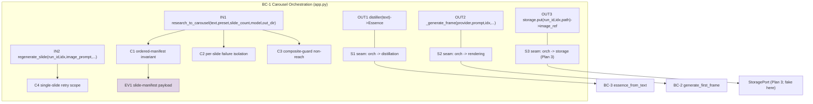
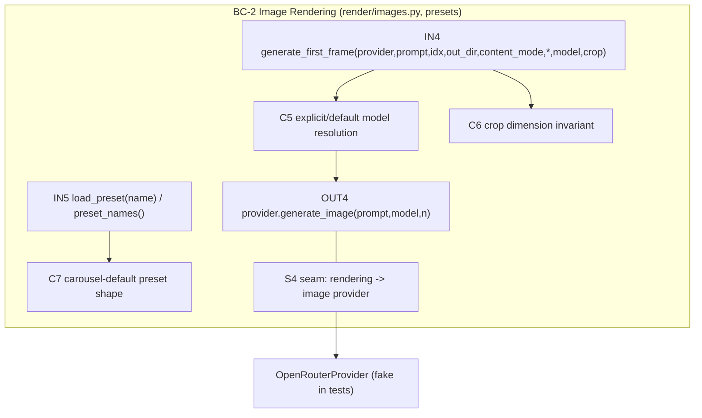
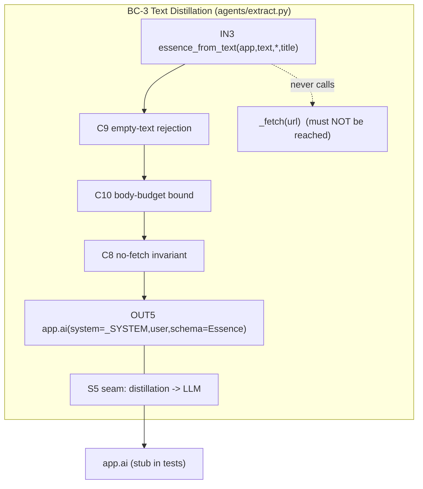

# Carousel Generation Pipeline (Backend Core) — TDD Implementation Plan

> **Plan 1 of 6** for the Carousel Image Pipeline PRD
> (`2026-07-11-prd-carousel-image-pipeline-and-research-handoff.md`).
> **Scope:** PRD §7 **ISC-1 … ISC-16** and the §11 tracker row 1.
> **Seams this plan OWNS (per PRD §11 seam-ownership):** `research_to_carousel`, the
> text→`Essence` seam, the `carousel-default` preset, `generate_first_frame(model=...)`,
> and the new 4:5 crop target. Plans 2 (recreate loop) and 6 (routes/UI) **depend on and
> reference** these; they do not redefine them.
> **Seam this plan CONSUMES (owned by Plan 3):** the `StoragePort` that turns a rendered
> slide file into a fetchable `image_ref`. In these unit tests we inject a **fake
> `StoragePort`** returning a stub ref. The real presigned-URL adapter is Plan 3
> (`2026-07-11-tdd-03-media-serving-storageport.md`); do **not** implement object storage
> here.

## Overview

`reel-af` already has the atomic *prompt → image file* function
`generate_first_frame(provider, image_prompt, idx, out_dir, content_mode) -> Path`
(`src/reel_af/render/images.py:89`), which calls `provider.generate_image(...)` and
center-crops to **9:16 720×1280** (`_crop_to_9x16`, `images.py:60`). It reads its model from
a module-level `IMAGE_MODEL = os.getenv("REEL_AF_IMAGE_MODEL", ...)` **once at import**
(`images.py:23`), so a per-request model tier is impossible today.

This plan builds the carousel backend as a set of **smallest testable behaviors**:

1. **Per-request model** — `generate_first_frame` accepts an explicit `model=` (default
   `REEL_AF_IMAGE_MODEL`), so the HQ recreate path (Plan 2) can pass a premium model without
   editing a module constant. (ISC-1, ISC-2)
2. **4:5 crop target** — a new `_crop_to_4x5` beside `_crop_to_9x16` producing 1080×1350
   portrait, selectable per call so the carousel preset can request it. (ISC-10)
3. **`carousel-default` preset** — a new key in `presets.json` (4:5 1080×1350). (ISC-9)
4. **text→`Essence` seam** — `essence_from_text(app, text) -> Essence` that reuses
   `extract`'s distillation prompt (`agents/extract.py:32` `_SYSTEM`, `:157` `app.ai(...)`)
   **without** calling the URL `_fetch` (`extract.py:44`). Head-truncates over-long text to
   `PROMPT_BODY_CHARS` (not a semantic summary); rejects empty/whitespace. (ISC-13, ISC-14,
   ISC-15, ISC-16)
5. **`research_to_carousel` reasoner** — a `@reel.reasoner()`-registered entry
   (`src/reel_af/app.py:87` router, `:821` `include_router`) that builds an `Essence` from
   text, generates N slides in order, tolerates per-slide failure, and returns an ordered
   slide manifest. Its dispatch is a **new path** — it is NOT routed through
   `_run_composite_reels` and so is NOT subject to the composite overlay guard at
   `app.py:632`. **Because the control plane invokes reasoners with a JSON `input` envelope
   only** (see the curl examples at `app.py:474,694`), its injected deps (`provider`, `storage`,
   `distiller`, `prompt_planner`, `_generate_frame`) arrive as `None` in production; the reasoner
   therefore resolves each `None → real` in-body and gates a missing `OPENROUTER_API_KEY`
   exactly like `topic_to_reel` (`app.py:478`). Tests inject fakes; production wires the real
   ones. (ISC-3 … ISC-8, ISC-11, ISC-12)
6. **`plan_carousel_prompts` (production prompt planner)** — a concrete
   `plan_carousel_prompts(app, essence, count) -> list[str]` that turns an `Essence` into exactly
   `count` ordered, non-empty image prompts via one `app.ai(...)` call. It is the production
   default for the reasoner's injected `prompt_planner`. (`pick_image_moments`/`plan_visuals` do
   NOT fit `(essence,count)->[str]` — see Behavior 9c.) (ISC-4, "prompt-from-text" seam)

Every behavior is exercised through a **deterministic fake image provider**
(`tests/util.py:59` `make_fake_provider(image_data=square_png_bytes(...))`) and a **fake
`StoragePort`**, so no network, model, or object-storage call is made.

## Current State Analysis

### Key Discoveries

- **`generate_first_frame`** — `src/reel_af/render/images.py:89`. Async; calls
  `provider.generate_image(prompt=augmented, model=IMAGE_MODEL, n=1)` at `images.py:107`,
  persists via `_save_image_output` (`images.py:124`), crops via `_crop_to_9x16`
  (`images.py:121`). Frames named `frame-{idx:02d}.jpg` (`images.py:104`); raw is
  `frame-{idx:02d}-raw.png` (`images.py:103`). Style block appended by `_augment`
  (`images.py:54`).
- **`IMAGE_MODEL`** — `images.py:23`, read once at import from `REEL_AF_IMAGE_MODEL`. This is
  the P1 blocker: no per-request tier.
- **`_crop_to_9x16`** — `images.py:60`. Center-crops to a `9/16` ratio and resizes to
  `target_w × (target_w*16//9)` (default 720×1280). The 4:5 crop is a sibling with ratio
  `4/5` and 1080×1350. Note the local-crop rationale (`images.py:66`): the SDK
  `image_config` aspect param 404s, so we always crop locally.
- **Presets** — `render/config/presets.json` (two keys today: `middle-third-dynamic`,
  `horizontal-youtube-lowerthird`), loaded by `load_preset(name)` /`preset_names()`
  (`render/presets.py:31,27`), `@lru_cache`-cached (`presets.py:22`). Keys used:
  `canvas_w`, `canvas_h`, `overlay`, `reel_seconds`, `image_count`. **No `slide_count` key
  exists yet.**
- **Composite overlay guard** — `src/reel_af/app.py:632`: `_run_composite_reels` returns an
  error for any preset whose `overlay` is not `middle_third`/`lower_third`. The PRD is
  explicit (§4 P3, §7 ISC-8): **a carousel needs its OWN dispatch, not this guard.** Our
  `research_to_carousel` never enters `_run_composite_reels`, so a `carousel-default` preset
  (which has no `overlay` at all) is generated successfully.
- **text→`Essence`** — `agents/extract.py`. `extract_essence(app, url)` (`:131`) does
  `_fetch(url)` (`:44`) → `_clean` (`:55`) → `app.ai(system=_SYSTEM, user=..., schema=Essence)`
  (`:157`). The distillation prompt `_SYSTEM` (`:32`) and the `app.ai(...)` call are exactly
  what we reuse; we bypass `_fetch`/`_clean`/`_youtube_body` and feed provided text as the
  body. `PROMPT_BODY_CHARS = 14_000` and `MAX_BODY_CHARS = 50_000` (`extract.py:17,16`) are
  the existing truncation caps.
- **`Essence` model** — `src/reel_af/models.py:36`: `core_claim`, `mechanism`,
  `evidence: list[str]` (min 1), `content_mode`, `domain`. `ConfigDict(extra="forbid")`.
- **Reasoner registration** — router `reel = AgentRouter(prefix="reel", ...)` (`app.py:87`);
  reasoners declared `@reel.reasoner()`; mounted by `app.include_router(reel)` (`app.py:821`).
  Registration is observable via `app_module.reel.reasoners` — a list of
  `{"func","wrapper","path","tags","kwargs","registered"}` dicts appended by the decorator
  (`agentfield/router.py:77-86`, verified in the installed `agentfield` package). Assert with
  `any(r["func"].__name__ == "research_to_carousel" for r in app_module.reel.reasoners)`.
  **NOTE (corrected per review C-3):** `tests/util.py:132` is an out-of-process *config probe*
  (`_PROBE`, reads `app.ai_config.model`) and `tests/test_gates_and_patches.py:22` merely imports
  `reel_af.app` and calls a reasoner directly — **neither inspects the registry.** The registration
  anchor is `router.py:77`, not those tests.
- **Provider / distiller production wiring** — the real image provider is built by
  `_composite_image_provider()` → `OpenRouterProvider()` (`cli.py:310-314`); the real text→`Essence`
  distiller is `essence_from_text(app, text)` bound to the module-level `app = Agent(...)`
  (`app.py:62`), mirroring how `extract_essence(app, url)` (`extract.py:131`) takes `app` first.
  These are the concrete `None → real` defaults the reasoner resolves in-body (Behavior 8b).
- **Output dir** — `Path.cwd()/output/<source>-<run_id>/` (see `topic_to_reel`,
  `app.py:483`; `composite_to_reel`, `app.py:699`). Carousel uses source label `carousel`.

### Test harness

- `pytest` + `pytest-asyncio` (`asyncio_mode=auto`). Focused run:
  `uv run pytest tests/test_carousel.py -q`. Lint: `uv run ruff check`.
- **Deterministic fake image provider** — `tests/util.py:59` `make_fake_provider`. Its
  `generate_image(**kwargs)` (`util.py:86`) records the call on `FakeProvider.calls` and
  returns `[FakeImage(image_data)]`; `FakeImage.save()` (`util.py:53`) writes the exact bytes,
  and `_save_image_output` (`images.py:142`) uses the `.save` path. `square_png_bytes(size,
  color)` (`util.py:40`) is a real PIL-decodable PNG → the crop step is real, deterministic,
  and offline. Existing precedent: `tests/test_image_cutins.py:23`.
- **Injected-fake / injected-runner precedent** — `tests/test_hooks.py:16` (`TextProvider`)
  and `tests/test_ingest.py` (injected `runner`). We follow the same injection style: the
  reasoner accepts an injected `provider` and an injected `storage` (fake `StoragePort`) and
  an injected `distiller` (fake text→`Essence`) so the full chain runs with no I/O.
- New tests live in **`tests/test_carousel.py`**.

## Desired End State

`generate_first_frame(provider, image_prompt, idx, out_dir, content_mode, *, model=None,
crop="9x16")` — same public positional signature as today plus two keyword-only params;
`model=None` defaults to `REEL_AF_IMAGE_MODEL`; `crop="4x5"` produces 1080×1350.
`essence_from_text(app, text) -> Essence` builds an `Essence` from provided text with no URL
fetch. A `carousel-default` preset exists (4:5 1080×1350, `slide_count`). A
`research_to_carousel` reasoner is registered under `reel`, returns an ordered slide manifest
`{run_id, preset, out_dir, slides: [{idx, image_prompt, image_ref, status}]}` (the `out_dir`
lets Plan 2's `regenerate_slide` place retries in the same run dir), is not subject to the
composite overlay guard, marks a failed slide `failed` without aborting the batch, and exposes a
single-slide retry seam that Plan 2 drives. When invoked over the control plane (JSON `input`
only), it resolves its `None` deps to the real `OpenRouterProvider()`/`essence_from_text`/
`plan_carousel_prompts`/`generate_first_frame`/Plan-3 `StoragePort`, and returns the house
`{"error": "OPENROUTER_API_KEY not set in env."}` when the key is absent (mirrors `app.py:478`).

### Observable Behaviors

- Given an explicit `model=`, `generate_first_frame` calls `provider.generate_image(model=<that>)`.
- Given `model` unset, it calls with `REEL_AF_IMAGE_MODEL`.
- Given `crop="4x5"`, the saved frame is 1080×1350; `crop="9x16"` (default) stays 720×1280.
- `research_to_carousel` is registered under the `reel` router and callable.
- Given a control-plane call with **only** domain params (no injected fakes), the reasoner
  resolves each `None` dep to its real implementation; with `OPENROUTER_API_KEY` unset it returns
  `{"error": "OPENROUTER_API_KEY not set in env."}`.
- Given an `Essence` and a count N, `plan_carousel_prompts` returns exactly N non-empty prompts.
- Given a `slide_count` of N, the manifest has slides indexed `0..N-1`, each carrying its
  `image_prompt` and a resolvable `image_ref`, `len(slides) == N`, and the manifest carries
  `out_dir`.
- The carousel path is dispatched without the composite overlay guard rejecting it.
- `carousel-default` exists in `presets.json` and outputs 4:5 1080×1350.
- Given one slide whose image gen raises, that slide is `failed`, siblings succeed, the batch
  is not aborted, and the failed slide is individually retryable.
- Given text (not a URL), an `Essence` is built without `_fetch`; over-long text is
  chunked/summarized first; empty/whitespace text raises a clear error.

## What We're NOT Doing

- **Not** implementing object storage / presigned URLs — that is **Plan 3** (`StoragePort`).
  Here `image_ref` comes from an injected fake `StoragePort`.
- **Not** building the HQ recreate loop, cost guard, or `REEL_AF_IMAGE_MODEL_HQ` selection —
  that is **Plan 2**. We only expose the `model=` parameter and a per-slide retry seam it
  reuses.
- **Not** touching `_run_composite_reels` or the composite overlay guard (`app.py:632`); the
  carousel dispatch is a separate reasoner.
- **Not** building any UI, HTTP route, auth, provenance stamping, or research handoff — Plans
  4/5/6.
- **Not** changing the 9:16 path or its existing tests (`tests/test_image_cutins.py`); the 4:5
  crop is additive.
- **Not** adding real network / model calls in tests.

## Testing Strategy

- **Framework:** `pytest` + `pytest-asyncio` (`asyncio_mode=auto`). New file
  `tests/test_carousel.py`.
- **Unit (LEAF):** every behavior is a same-module or single-seam unit test with an injected
  fake provider / fake `StoragePort` / fake distiller. No async cross-process edge, no
  registration boundary crossed at runtime, no external store.
- **Fakes:** `make_fake_provider(image_data=square_png_bytes(...))` for images;
  `image_error=...` to force a per-slide failure; a local `FakeStoragePort` returning
  `f"stub://{run_id}/{idx}"`; a local fake distiller (or a stub `app` with an async `ai(...)`)
  returning a fixed `Essence` for the reasoner-level tests so no LLM is called.
- **Property (crop):** for the crop behavior, the output image dimensions equal the target for
  **all** input square/rect sizes (`square_png_bytes(256)`, `(512)`, `(1000)`), and the output
  aspect ratio is within one pixel of the declared ratio.
- **Registration:** import `reel_af.app`, assert `research_to_carousel` appears in
  `app_module.reel.reasoners` (list of `{"func",...}` dicts, `router.py:77-86`) via
  `r["func"].__name__` (import-time observation; no server run). This is the REAL registry — not
  the `util.py:132` config probe (review C-3).
- **Production dependency path (Behavior 8b):** call the reasoner with only domain params +
  monkeypatched module singletons (`OpenRouterProvider`, `essence_from_text`, `plan_carousel_prompts`,
  a default `StoragePort`), asserting each `None → real` branch is taken; with `OPENROUTER_API_KEY`
  unset assert the house `{"error": ...}` return. Mirrors how `topic_to_reel` is tested
  (`test_gates_and_patches.py:24`).

## Workflow Closure

**Crop/model/preset/essence behaviors (B1–B7, B10, B12) are LEAF.** The reasoner (B8/B9) carries
ONE production-caller obligation the injected-fake tests alone do NOT discharge: the control-plane
router invokes it with a JSON `input` envelope only (`app.py:474,694`), so the `None → real`
dependency resolution **and** the `OPENROUTER_API_KEY` gate are the production-completeness
anchors and MUST be tested (Behavior 8b), not just the fake-injection path. With those in place the
remaining behaviors are LEAF. Rationale per the Step-2.5 framework (LEAF = same-module, no async
edge, no cross-module/registration boundary reached at runtime):

- **ISC-1, ISC-2, ISC-10** (`generate_first_frame` `model=`, `crop=`): pure same-module
  function in `images.py`. The injected fake provider records the exact `model` kwarg and the
  real crop produces the real pixel dimensions. Input → output is fully observed by a unit test.
- **ISC-9** (`carousel-default` preset): a JSON data assertion via `load_preset("carousel-default")`
  — no process, no async.
- **ISC-13 … ISC-16** (text→`Essence`): `essence_from_text` is a same-module function whose
  only outward call is `app.ai(...)`; the test injects a stub `app` whose `ai` is an async fake
  returning a fixed `Essence`, and asserts `_fetch` was never entered. Input → output observed
  directly. Empty/whitespace rejection is a pure guard.
- **ISC-3 … ISC-8, ISC-11, ISC-12** (`research_to_carousel`): the reasoner is an async function
  called **directly in-process** with injected `provider`, `storage`, and `distiller`. The test
  crosses no HTTP/control-plane edge and starts no worker; `asyncio.gather` over slides is a
  same-event-loop fan-out, not a cross-module async connector. Registration is asserted against the
  real registry (`app_module.reel.reasoners`, `router.py:77`), and the reasoner is invoked directly.
  Its production caller is the control-plane router mounted at `app.include_router(reel)`
  (`app.py:821`) — the same registration path every existing reel reasoner uses; no new
  worker/listener is introduced. **BUT** that router hands the reasoner JSON `input` fields only, so
  the injected deps default to `None`; **Behavior 8b certifies the production-callable path** by
  exercising the `None → real` resolution and the `OPENROUTER_API_KEY` gate. Without 8b the reasoner
  would be registered but not production-callable — so 8b is the production-completeness anchor for
  this slice (it is a same-module, monkeypatched-singleton test — still LEAF, no live I/O).

**No async edge or registration boundary is reached at runtime in any test**, so no injected
clock/driver and no real store are required. The one seam this plan consumes that IS async in
production — turning a slide file into a fetchable URL via `StoragePort` — is **owned and
closure-tested by Plan 3**; here it is a synchronous fake. The real end-to-end "a research text
produces a fetchable carousel in the browser" closure is owned by **Plan 6** (routes + UI),
which composes this pipeline behind an authed route. This is stated so this plan does not imply
production completeness of the fetch path.

---

## Behavior 1: `generate_first_frame` accepts an explicit `model=` (ISC-1)

### Test Specification

**Given** a fake provider and an explicit `model="premium/model-x"`, **when**
`generate_first_frame(...)` runs, **then** the provider's `generate_image` was called with
`model="premium/model-x"`.

**Edge Cases:** `model=""` is treated as unset (falls back to default) — an empty string is
not a valid model id.

**Files touched:** `src/reel_af/render/images.py`, `tests/test_carousel.py`.

### TDD Cycle

#### 🔴 Red: Write Failing Test
**File**: `tests/test_carousel.py`
```python
from pathlib import Path

import pytest
from util import make_fake_provider, square_png_bytes

from reel_af.render.images import generate_first_frame


async def test_generate_first_frame_uses_explicit_model(tmp_path: Path):
    fake = make_fake_provider(image_data=square_png_bytes(256))
    provider = fake()

    await generate_first_frame(
        provider, "a quiet lab bench", 0, tmp_path, model="premium/model-x",
    )

    image_calls = [kw for method, kw in fake.calls if method == "image"]
    assert image_calls and image_calls[0]["model"] == "premium/model-x"
```

#### 🟢 Green: Minimal Implementation
**File**: `src/reel_af/render/images.py`
```python
async def generate_first_frame(
    provider: OpenRouterProvider,
    image_prompt: str,
    idx: int,
    out_dir: Path,
    content_mode: str = "general",
    *,
    model: str | None = None,
    crop: str = "9x16",
) -> Path:
    selected_model = (model or "").strip() or IMAGE_MODEL
    ...
    resp = await provider.generate_image(prompt=augmented, model=selected_model, n=1)
```

#### 🔵 Refactor: Improve Code
**File**: `src/reel_af/render/images.py`
- [ ] **No duplication**: `selected_model = (model or "").strip() or IMAGE_MODEL` is the single
      resolution point; do not repeat the fallback elsewhere.
- [ ] **Reveals intent**: keyword-only `model`/`crop` keep the existing 5 positional args
      backward-compatible with all current call sites (`grep -n generate_first_frame src/`).
- [ ] **Complexity down**: one added local; no new branches beyond the crop dispatch (Behavior 3).
- [ ] **No shallow wrappers**: reuse the existing `provider.generate_image` call; do not add a
      wrapper layer.
- [ ] **Fits existing patterns**: `IMAGE_MODEL` remains the named module default (`images.py:23`),
      matching the "protocol constant stays a constant" convention.

### Success Criteria
**Automated:**
- [ ] Red fails (no `model=` kwarg accepted): `uv run pytest tests/test_carousel.py -q`
- [ ] Green passes: `uv run pytest tests/test_carousel.py -k model -q`
- [ ] Existing 9:16 tests unaffected: `uv run pytest tests/test_image_cutins.py -q`
- [ ] `uv run ruff check src/reel_af/render/images.py tests/test_carousel.py` clean

**Manual:**
- [ ] Passing a premium model id visibly routes to that model in a live run (Plan 2 exercises HQ).

---

## Behavior 2: `generate_first_frame` defaults `model` to `REEL_AF_IMAGE_MODEL` (ISC-2)

### Test Specification

**Given** no `model` argument, **when** `generate_first_frame(...)` runs, **then**
`generate_image` is called with the module `IMAGE_MODEL` (the `REEL_AF_IMAGE_MODEL` value).

**Edge Cases:** an explicit `model=""` or `model="   "` also falls back to the default
(guards against a caller passing an empty UI field).

**Files touched:** `src/reel_af/render/images.py`, `tests/test_carousel.py`.

### TDD Cycle

#### 🔴 Red
**File**: `tests/test_carousel.py`
```python
async def test_generate_first_frame_defaults_to_env_model(tmp_path):
    from reel_af.render import images

    fake = make_fake_provider(image_data=square_png_bytes(256))
    provider = fake()

    await generate_first_frame(provider, "a lab bench", 0, tmp_path)  # no model=

    image_calls = [kw for method, kw in fake.calls if method == "image"]
    assert image_calls[0]["model"] == images.IMAGE_MODEL


@pytest.mark.parametrize("blank", ["", "   "])
async def test_blank_model_falls_back_to_default(tmp_path, blank):
    from reel_af.render import images

    fake = make_fake_provider(image_data=square_png_bytes(256))
    await generate_first_frame(fake(), "x", 0, tmp_path, model=blank)
    assert [kw for m, kw in fake.calls if m == "image"][0]["model"] == images.IMAGE_MODEL
```

#### 🟢 Green
Already satisfied by the Behavior-1 `selected_model = (model or "").strip() or IMAGE_MODEL`.
No new code; this behavior locks the default and the blank-string edge.

#### 🔵 Refactor
- [ ] **No duplication**: assert there is exactly one `IMAGE_MODEL` fallback site.
- [ ] **Reveals intent**: the default is read from the module constant, so operators still tune
      it via `REEL_AF_IMAGE_MODEL` at import — unchanged contract.

### Success Criteria
**Automated:**
- [ ] Default + blank tests pass: `uv run pytest tests/test_carousel.py -k model -q`
- [ ] `uv run ruff check` clean

**Manual:**
- [ ] With `REEL_AF_IMAGE_MODEL` unset, a run uses `openrouter/google/gemini-2.5-flash-image`.

---

## Behavior 3: A 4:5 crop target yields 1080×1350 (ISC-10)

### Test Specification

**Given** `crop="4x5"`, **when** `generate_first_frame(...)` runs, **then** the saved frame is
**1080×1350**. **Given** the default `crop="9x16"`, the frame stays **720×1280**.

**Property:** for square inputs of size 256/512/1000, the 4:5 output is exactly 1080×1350 and
the 9:16 output is exactly 720×1280 (crop is size-independent).

**Edge Cases:** a portrait input taller than 4:5 crops top/bottom; a landscape input crops
left/right — both resize to the exact target (mirrors `_crop_to_9x16`'s two branches,
`images.py:75,79`).

**Files touched:** `src/reel_af/render/images.py`, `tests/test_carousel.py`.

### TDD Cycle

#### 🔴 Red
**File**: `tests/test_carousel.py`
```python
from PIL import Image


@pytest.mark.parametrize("size", [256, 512, 1000])
async def test_carousel_crop_is_4x5_portrait(tmp_path, size):
    fake = make_fake_provider(image_data=square_png_bytes(size))
    path = await generate_first_frame(fake(), "x", 0, tmp_path, crop="4x5")
    with Image.open(path) as im:
        assert im.size == (1080, 1350)


async def test_default_crop_still_9x16(tmp_path):
    fake = make_fake_provider(image_data=square_png_bytes(512))
    path = await generate_first_frame(fake(), "x", 0, tmp_path)
    with Image.open(path) as im:
        assert im.size == (720, 1280)
```

#### 🟢 Green
**File**: `src/reel_af/render/images.py`
```python
def _crop_to_4x5(src: Path, dest: Path, target_w: int = 1080) -> Path:
    """Center-crop to 4:5 Instagram portrait (1080x1350 by default)."""
    return _crop_to_ratio(src, dest, ratio=4 / 5, target_w=target_w, target_h=target_w * 5 // 4)

_CROP_TARGETS = {
    "9x16": _crop_to_9x16,   # 720x1280
    "4x5": _crop_to_4x5,     # 1080x1350
}
# in generate_first_frame:
    cropper = _CROP_TARGETS.get(crop, _crop_to_9x16)
    return cropper(raw_path, final_path)
```

#### 🔵 Refactor
**File**: `src/reel_af/render/images.py`
- [ ] **No duplication (critical):** `_crop_to_9x16` and `_crop_to_4x5` share identical
      center-crop-then-resize logic — extract a private `_crop_to_ratio(src, dest, *, ratio,
      target_w, target_h)` and have both call it. The two branches (`cur_ratio > desired` /
      `< desired`, `images.py:75-82`) live once. This is the most likely LLM duplication and the
      refactor's main job.
- [ ] **Reveals intent:** the `_CROP_TARGETS` dict is a one-jump dispatch keyed by preset string;
      no `if crop == ...` ladder.
- [ ] **Named literals:** `1080`, `1350`, `720`, `1280` derive from `target_w` + ratio, not
      scattered magic numbers.
- [ ] **Fits existing patterns:** keeps the local-crop rationale comment (`images.py:66`) — the
      SDK aspect param still 404s, so all aspects crop locally.

### Success Criteria
**Automated:**
- [ ] Red fails (no `crop=` / no 4:5 target): `uv run pytest tests/test_carousel.py -k crop -q`
- [ ] Green + property (3 sizes) pass
- [ ] 9:16 default preserved; `tests/test_image_cutins.py` still green (asserts `(720,1280)`)
- [ ] No duplication: the crop body appears once (`grep -c "cur_ratio" src/reel_af/render/images.py` == 1)
- [ ] `uv run ruff check` clean

**Manual:**
- [ ] A generated 4:5 slide opens at 1080×1350 in an image viewer.

---

## Behavior 4: A `carousel-default` preset exists and is 4:5 1080×1350 (ISC-9, ISC-10)

### Test Specification

**Given** the preset store, **when** `load_preset("carousel-default")`, **then** it returns a
dict with `canvas_w == 1080`, `canvas_h == 1350`, a `slide_count`, and **no** `overlay` value
in `{"middle_third","lower_third"}` (so it is never mistaken for a composite preset).

**Edge Cases:** `preset_names()` includes `"carousel-default"`; the existing two presets are
untouched.

**Files touched:** `src/reel_af/render/config/presets.json`, `tests/test_carousel.py`.

### TDD Cycle

#### 🔴 Red
**File**: `tests/test_carousel.py`
```python
def test_carousel_default_preset_is_4x5_portrait():
    from reel_af.render.presets import load_preset, preset_names

    assert "carousel-default" in preset_names()
    cfg = load_preset("carousel-default")
    assert (cfg["canvas_w"], cfg["canvas_h"]) == (1080, 1350)
    assert cfg["slide_count"] >= 1
    assert cfg.get("overlay") not in {"middle_third", "lower_third"}
```

#### 🟢 Green
**File**: `src/reel_af/render/config/presets.json`
```json
"carousel-default": {
  "description": "4:5 Instagram portrait image carousel (1080x1350). No video overlay; a set of ordered still slides generated from research/text.",
  "kind": "carousel",
  "canvas_w": 1080,
  "canvas_h": 1350,
  "crop": "4x5",
  "slide_count": 5
}
```

#### 🔵 Refactor
- [ ] **Fits existing patterns:** flat key/value dict like the other presets (`presets.py`
      docstring: "one hop" access). `crop` matches the `_CROP_TARGETS` key from Behavior 3 so
      the reasoner reads `cfg["crop"]` directly — no translation layer.
- [ ] **Named:** `kind: "carousel"` is the discriminator Plan 6 / `index.html #config` reads
      (PRD §6.5). Do not invent a parallel flag.
- [ ] No `overlay` key at all → structurally cannot pass the composite guard's membership check.

### Success Criteria
**Automated:**
- [ ] Preset test passes: `uv run pytest tests/test_carousel.py -k preset -q`
- [ ] `preset_names()` still returns the two originals: `uv run pytest tests/test_carousel.py -q`
- [ ] JSON is valid: `python -c "import json,pathlib; json.loads(pathlib.Path('src/reel_af/render/config/presets.json').read_text())"`

**Manual:** none.

---

## Behavior 5: Text builds an `Essence` without calling `_fetch` (ISC-13, ISC-14)

### Test Specification

**Given** a plain text document (no URL), **when** `essence_from_text(app, text)` runs, **then**
it returns an `Essence` and `agents/extract.py._fetch` was **never** called (no network).

**Edge Cases:** the distillation prompt reused is the existing `_SYSTEM` (`extract.py:32`); the
call goes through `app.ai(..., schema=Essence)` exactly as `extract_essence` does (`extract.py:157`).

**Files touched:** `src/reel_af/agents/extract.py`, `tests/test_carousel.py`.

### TDD Cycle

#### 🔴 Red
**File**: `tests/test_carousel.py`
```python
from reel_af.models import Essence


class _StubApp:
    def __init__(self, essence):
        self._essence = essence
        self.ai_calls = []

    async def ai(self, *, system, user, schema):
        self.ai_calls.append({"system": system, "user": user, "schema": schema})
        return self._essence


async def test_essence_from_text_bypasses_fetch(monkeypatch):
    from reel_af.agents import extract

    async def _boom(url):
        raise AssertionError("_fetch must not be called for text input")

    monkeypatch.setattr(extract, "_fetch", _boom)
    stub_essence = Essence(
        core_claim="Sleep debt compounds.", mechanism="Adenosine accrues.",
        evidence=["8 hours"], content_mode="general", domain="health",
    )
    app = _StubApp(stub_essence)

    result = await extract.essence_from_text(app, "A long research note about sleep ...")

    assert isinstance(result, Essence)
    assert app.ai_calls and app.ai_calls[0]["schema"] is Essence
    assert extract._SYSTEM == app.ai_calls[0]["system"]
```

#### 🟢 Green
**File**: `src/reel_af/agents/extract.py`
```python
async def essence_from_text(app: Any, text: str, *, title: str = "(provided text)") -> Essence:
    """Build an Essence from provided TEXT (no URL fetch), reusing the same
    distillation prompt as extract_essence."""
    body = _prepare_text_body(text)  # strip + validate + chunk/summarize (Behaviors 6, 7)
    user = (
        f"SOURCE\n  url   : (none — provided text)\n  title : {title}\n\n"
        f"FULL BODY (cleaned, truncated to fit context):\n{body[:PROMPT_BODY_CHARS]}"
    )
    return await app.ai(system=_SYSTEM, user=user, schema=Essence)
```

#### 🔵 Refactor
**File**: `src/reel_af/agents/extract.py`
- [ ] **No duplication:** the `user` payload shape mirrors `extract_essence` (`extract.py:150`).
      Extract a shared `_essence_user_prompt(title, final_url, body)` used by BOTH
      `extract_essence` and `essence_from_text` so the prompt shape lives once.
- [ ] **Reveals intent:** `essence_from_text` reads as "text → same distillation, minus fetch."
- [ ] **Fits patterns:** reuses `PROMPT_BODY_CHARS` (`extract.py:17`) and `_SYSTEM` (`:32`); no
      new prompt string is authored.
- [ ] **No shallow wrapper:** the function does real work (validation + chunking via
      Behaviors 6/7), it is not a thin pass-through.

### Success Criteria
**Automated:**
- [ ] Red fails (no `essence_from_text`): `uv run pytest tests/test_carousel.py -k essence -q`
- [ ] Green passes and `_fetch` monkeypatch is never hit
- [ ] `uv run ruff check src/reel_af/agents/extract.py` clean

**Manual:**
- [ ] A pasted research document yields a sensible `Essence` in a live run.

---

## Behavior 6: Empty/whitespace text is rejected with a clear error (ISC-16)

### Test Specification

**Given** `""`, `"   "`, `"\n\t "`, or `None`, **when** `essence_from_text` runs, **then** it
raises a `ValueError` naming the empty-text condition **before** any `app.ai` call.

**Edge Cases:** the guard fires before chunking and before the LLM call, so a stub `app` whose
`ai` would fail is never reached.

**Files touched:** `src/reel_af/agents/extract.py`, `tests/test_carousel.py`.

### TDD Cycle

#### 🔴 Red
**File**: `tests/test_carousel.py`
```python
@pytest.mark.parametrize("bad", ["", "   ", "\n\t ", None])
async def test_essence_from_text_rejects_empty(bad):
    from reel_af.agents import extract

    class _NeverApp:
        async def ai(self, **_):
            raise AssertionError("ai must not be called for empty text")

    with pytest.raises(ValueError, match="text"):
        await extract.essence_from_text(_NeverApp(), bad)
```

#### 🟢 Green
**File**: `src/reel_af/agents/extract.py`
```python
def _prepare_text_body(text: str | None) -> str:
    cleaned = (text or "").strip()
    if not cleaned:
        raise ValueError("essence_from_text: text is empty or whitespace-only")
    return _fit_text_body(cleaned)  # Behavior 7
```

#### 🔵 Refactor
- [ ] **Reveals intent:** validation is the first line of `_prepare_text_body`; `None` and blank
      collapse to one guard via `(text or "").strip()`.
- [ ] **Named message:** the error string names the condition so the UI (Plan 5/6) can surface it.

### Success Criteria
**Automated:**
- [ ] All four empty inputs raise `ValueError`; `ai` never called: `uv run pytest tests/test_carousel.py -k empty -q`
- [ ] `uv run ruff check` clean

**Manual:** none.

---

## Behavior 7: Over-long text is head-truncated to budget before prompt generation (ISC-15)

### Test Specification

**Given** text longer than the prompt budget, **when** `essence_from_text` prepares the body,
**then** the body handed to `app.ai` is bounded (≤ `PROMPT_BODY_CHARS`) and non-empty; a
document under the budget passes through unchanged.

**Property:** for any input length, `len(prepared_body) <= PROMPT_BODY_CHARS` **and** for input
already ≤ budget, `prepared_body == input.strip()` (idempotent under the cap).

**Edge Cases:** exactly-at-budget passes through; far-over-budget is reduced (head-biased
truncation to the cap in the minimal Green; a smarter summarize pass may replace it later, but
the bound is the contract).

**Files touched:** `src/reel_af/agents/extract.py`, `tests/test_carousel.py`.

### TDD Cycle

#### 🔴 Red
**File**: `tests/test_carousel.py`
```python
async def test_long_text_is_bounded_before_prompt():
    from reel_af.agents import extract

    huge = "word " * 20000  # ~100k chars, well over PROMPT_BODY_CHARS
    captured = {}

    class _CapApp:
        async def ai(self, *, system, user, schema):
            captured["user"] = user
            return Essence(core_claim="c", mechanism="m", evidence=["e"],
                           content_mode="general", domain="d")

    await extract.essence_from_text(_CapApp(), huge)
    body = captured["user"].split("truncated to fit context):\n", 1)[1]
    assert 0 < len(body) <= extract.PROMPT_BODY_CHARS


async def test_short_text_passes_through():
    from reel_af.agents import extract
    assert extract._fit_text_body("short note") == "short note"
```

#### 🟢 Green
**File**: `src/reel_af/agents/extract.py`
```python
def _fit_text_body(cleaned: str) -> str:
    """Bound the body to the prompt budget. Head-biased truncation keeps the
    lede (the most hook-worthy material) — mirrors _clean's MAX_BODY_CHARS cap."""
    if len(cleaned) <= PROMPT_BODY_CHARS:
        return cleaned
    return cleaned[:PROMPT_BODY_CHARS]
```

#### 🔵 Refactor
- [ ] **Reveals intent:** name says "fit to budget"; the cap constant is the existing
      `PROMPT_BODY_CHARS` (`extract.py:17`), not a new literal.
- [ ] **Fits patterns:** matches `_clean`'s truncation approach (`extract.py:62`) — head-biased,
      single cap. If a future summarize-then-distill is added, it stays behind this one function
      so the `≤ PROMPT_BODY_CHARS` property holds.
- [ ] **No duplication:** the cap check lives in `_fit_text_body` only.

### Success Criteria
**Automated:**
- [ ] Bound + pass-through tests pass: `uv run pytest tests/test_carousel.py -k "long or through" -q`
- [ ] Property holds across sizes (extend parametrize if desired)
- [ ] `uv run ruff check` clean

**Manual:**
- [ ] A very long pasted document still produces an `Essence` without a context-length error.

---

## Behavior 8: `research_to_carousel` is a registered `@reel.reasoner()` (ISC-3)

### Test Specification

**Given** the imported `reel_af.app` module, **when** the **real** registry
`app_module.reel.reasoners` is inspected, **then** a dict whose `func.__name__` is
`research_to_carousel` is present (the reasoner is registered under the `reel` prefix).

**Edge Cases:** import must not require network or API keys (module import already tolerates
missing keys by deferring to runtime, per `topic_to_reel`'s in-body `OPENROUTER_API_KEY` check,
`app.py:478`).

**Files touched:** `src/reel_af/app.py`, `tests/test_carousel.py`.

### TDD Cycle

#### 🔴 Red
**File**: `tests/test_carousel.py`
```python
def test_research_to_carousel_is_registered():
    import reel_af.app as app_module

    # REAL registry: router.reasoners is a list of {"func","wrapper","path",...}
    # dicts appended by the @reel.reasoner() decorator (agentfield/router.py:77-86).
    names = [r["func"].__name__ for r in app_module.reel.reasoners]
    assert "research_to_carousel" in names
```
> **Correction (review C-3):** the earlier draft cited `tests/util.py:132` /
> `tests/test_gates_and_patches.py:22` as a registration-inspection precedent. Verified false —
> `util.py:132` is a config probe (reads `app.ai_config.model`), and `test_gates_and_patches.py:22`
> just imports and calls a reasoner directly. Neither inspects the registry. The real anchor is
> `router.py:77` (`router.reasoners`), reachable as `app_module.reel.reasoners`.

#### 🟢 Green
**File**: `src/reel_af/app.py`
```python
@reel.reasoner()
async def research_to_carousel(
    text: str,
    preset: str = "carousel-default",
    slide_count: int | None = None,
    model: str | None = None,
    out_dir: str | None = None,
    *,
    # Injection seams: over the control plane these arrive as None (JSON `input`
    # envelope only, app.py:474,694); tests inject fakes. Resolved to real below.
    provider=None,
    storage=None,
    distiller=None,
    prompt_planner=None,
    _generate_frame=None,
) -> dict:
    """Text/research document → ordered image carousel (no video overlay).

    Builds an Essence from the provided TEXT (no URL fetch), plans N image
    prompts, generates each 4:5 slide, and returns an ordered slide manifest.
    Dispatched on its OWN path — NOT via _run_composite_reels — so the
    composite overlay guard (app.py:632) never applies.
    """
    if "OPENROUTER_API_KEY" not in os.environ:
        return {"error": "OPENROUTER_API_KEY not set in env."}
    # None => real production wiring (tests inject fakes). See cli.py:310 and
    # extract_essence(app, url) at extract.py:131 for the concrete real deps.
    provider        = provider        or OpenRouterProvider()
    storage         = storage         or _default_storage_port()          # Plan 3
    distiller       = distiller       or (lambda t: essence_from_text(app, t))
    prompt_planner  = prompt_planner  or (lambda essence, n: plan_carousel_prompts(app, essence, n))
    _generate_frame = _generate_frame or generate_first_frame
    ...
```
> `_default_storage_port()` is a thin, Plan-3-owned factory; **in this plan it is a placeholder
> that Plan 3 replaces with the real presigned-URL adapter.** For this plan's tests the fake
> `StoragePort` is always injected, so the `None` branch is never exercised against real storage
> (Behavior 8b monkeypatches `_default_storage_port` to a fake to prove the branch is taken).

#### 🔵 Refactor
- [ ] **Fits patterns:** signature and docstring mirror `composite_to_reel` (`app.py:680`) /
      `topic_to_reel` (`app.py:463`); the in-body `OPENROUTER_API_KEY` gate matches `app.py:478`;
      `out_dir` defaulting to `output/carousel-<run_id>` matches `app.py:483,699`.
- [ ] **Reveals intent:** the docstring states the guard-bypass invariant explicitly; the
      `None → real` block is a single, comment-anchored resolution point (no scattered defaults).
- [ ] **No shallow wrapper:** the `distiller`/`prompt_planner` lambdas bind the module-level `app`
      (`app.py:62`); they are the production wiring, not indirection.

### Success Criteria
**Automated:**
- [ ] Registration test passes (real registry): `uv run pytest tests/test_carousel.py -k registered -q`
- [ ] `import reel_af.app` succeeds with no API keys set
- [ ] `uv run ruff check src/reel_af/app.py` clean

**Manual:**
- [ ] `POST /api/v1/execute/async/reel-af.reel_research_to_carousel` is callable on a live server
      (verified holistically in Plan 6).

---

## Behavior 8b: A control-plane call resolves real deps and gates a missing key (C-1, API §5)

### Test Specification

**Given** a call with **only** domain params (no injected `provider`/`storage`/`distiller`/
`prompt_planner`/`_generate_frame`) and the module singletons monkeypatched to fakes, **when**
`research_to_carousel(text=..., slide_count=1, out_dir=...)` runs, **then** each `None → real`
branch is taken (the monkeypatched fakes are used) and a valid manifest is returned. **And given**
`OPENROUTER_API_KEY` is unset, **then** the reasoner returns
`{"error": "OPENROUTER_API_KEY not set in env."}` **before** any provider/`app.ai` call — matching
`topic_to_reel` (`app.py:478`) and `article_to_reel` (`test_gates_and_patches.py:24`).

**Why this is the closure anchor:** the control plane invokes the registered reasoner with a JSON
`input` envelope only (`app.py:474,694`), so the injection kwargs are absent → `None`. Without the
in-body resolution a live call hits `None(text)` / `None.put(...)` and 500s. This test is what makes
the reasoner *production-callable*, not merely *registered* — still LEAF (monkeypatched singletons,
no live network).

**Edge Cases:** the key-gate fires first, so with the key unset the fake singletons are never
reached; with the key set, all five `None` branches resolve.

**Files touched:** `src/reel_af/app.py`, `tests/test_carousel.py`.

### TDD Cycle

#### 🔴 Red
**File**: `tests/test_carousel.py`
```python
async def test_missing_api_key_returns_house_error(tmp_path, monkeypatch):
    import reel_af.app as app_module

    monkeypatch.delenv("OPENROUTER_API_KEY", raising=False)
    out = await app_module.research_to_carousel(
        text="doc", slide_count=1, out_dir=str(tmp_path),
    )
    assert out == {"error": "OPENROUTER_API_KEY not set in env."}


async def test_control_plane_call_resolves_real_deps(tmp_path, monkeypatch):
    import reel_af.app as app_module

    monkeypatch.setenv("OPENROUTER_API_KEY", "test-key")
    fake = make_fake_provider(image_data=square_png_bytes(300))
    # Patch the module singletons the None-branches resolve to.
    monkeypatch.setattr(app_module, "OpenRouterProvider", lambda *a, **k: fake())
    monkeypatch.setattr(app_module, "_default_storage_port", lambda: _FakeStoragePort())
    monkeypatch.setattr(app_module, "plan_carousel_prompts",
                        lambda app, essence, n: [f"p{i}" for i in range(n)])
    monkeypatch.setattr(app_module, "essence_from_text", lambda app, t: _fake_distiller(t))

    out = await app_module.research_to_carousel(
        text="doc", slide_count=1, out_dir=str(tmp_path),  # NO injected deps
    )
    assert [s["idx"] for s in out["slides"]] == [0]
    assert out["slides"][0]["status"] == "ok"
    assert out["slides"][0]["image_ref"] == f"stub://{out['run_id']}/0"
```
> `essence_from_text`/`plan_carousel_prompts` are patched at module scope because the `None`
> branch closes over `app` (`app.py:62`); patching the names is enough to redirect the real
> resolution (the lambdas call the module-level names at invocation time).

#### 🟢 Green
No new code beyond Behavior 8's `None → real` block and the key gate; this behavior *asserts*
that block resolves and gates correctly.

#### 🔵 Refactor
- [ ] **Reveals intent:** the two tests document the production edge — one for the gate, one for
      the dep resolution — so a future refactor that drops either fails loudly.
- [ ] **Fits patterns:** the key-gate return string is byte-identical to `app.py:478`.

### Success Criteria
**Automated:**
- [ ] Missing-key test returns the house error: `uv run pytest tests/test_carousel.py -k api_key -q`
- [ ] Dep-resolution test passes with no injected deps: `uv run pytest tests/test_carousel.py -k resolves -q`
- [ ] `uv run ruff check src/reel_af/app.py` clean

**Manual:**
- [ ] A live `POST …reel_research_to_carousel` with the key set returns a manifest, not a 500.

---

## Behavior 9: `research_to_carousel` returns ordered slides `0..N-1`, each with prompt + resolvable `image_ref`; count == input (ISC-4, ISC-5, ISC-6, ISC-7, ISC-8)

### Test Specification

**Given** injected `provider` (fake image), `storage` (fake `StoragePort`), and `distiller`
(text→`Essence` stub) with `slide_count=3`, **when** `research_to_carousel(text, ...,
slide_count=3, provider=..., storage=..., distiller=...)` runs, **then** the manifest has:
`slides` indexed exactly `[0,1,2]` in order; each slide carries the `image_prompt` used to
generate it; each carries an `image_ref` the fake `StoragePort` resolves; and
`len(slides) == 3`. And the call **never** touches `_run_composite_reels` / the overlay guard.

**Edge Cases:** `slide_count=None` falls back to the preset's `slide_count` (ISC-7 via preset);
`slide_count` clamped to ≥1.

**Property:** for `slide_count ∈ {1, 3, 5}`, `[s["idx"] for s in slides] == list(range(n))`.

**Files touched:** `src/reel_af/app.py`, `tests/test_carousel.py` (fake `StoragePort` +
`distiller` injection seams).

### TDD Cycle

#### 🔴 Red
**File**: `tests/test_carousel.py`
```python
class _FakeStoragePort:
    """Stand-in for Plan 3's StoragePort. put(run_id, idx, path) -> fetchable ref."""
    def __init__(self):
        self.saved = []

    async def put(self, *, run_id, idx, path):
        self.saved.append((run_id, idx, path))
        return f"stub://{run_id}/{idx}"


async def _fake_distiller(text):
    from reel_af.models import Essence
    return Essence(core_claim="c", mechanism="m", evidence=["e"],
                   content_mode="general", domain="tech")


@pytest.mark.parametrize("n", [1, 3, 5])
async def test_carousel_returns_ordered_slides(tmp_path, n):
    import reel_af.app as app_module

    fake = make_fake_provider(image_data=square_png_bytes(300))
    storage = _FakeStoragePort()

    out = await app_module.research_to_carousel(
        text="a research doc about batteries",
        slide_count=n,
        out_dir=str(tmp_path),
        provider=fake(),
        storage=storage,
        distiller=_fake_distiller,
        prompt_planner=lambda essence, count: [f"slide prompt {i}" for i in range(count)],
    )

    slides = out["slides"]
    assert [s["idx"] for s in slides] == list(range(n))
    assert all(s["image_prompt"] == f"slide prompt {s['idx']}" for s in slides)
    assert all(s["image_ref"] == f"stub://{out['run_id']}/{s['idx']}" for s in slides)
    assert all(s["status"] == "ok" for s in slides)
    assert len(slides) == n
    assert out["out_dir"] == str(tmp_path)   # manifest carries the run dir (review §Data Models)


async def test_planner_wrong_count_raises(tmp_path):
    import reel_af.app as app_module

    fake = make_fake_provider(image_data=square_png_bytes(300))
    with pytest.raises(ValueError, match="expected 3"):
        await app_module.research_to_carousel(
            text="doc", slide_count=3, out_dir=str(tmp_path),
            provider=fake(), storage=_FakeStoragePort(), distiller=_fake_distiller,
            prompt_planner=lambda e, c: ["only", "two"],  # returns 2, not 3
        )
```
> **Injection note (LEAF seam):** `provider`, `storage`, `distiller`, and `prompt_planner` are
> keyword-only injection points that resolve to the real implementations when `None`
> (`OpenRouterProvider()` per `cli.py:310`, Plan-3 `StoragePort`, `essence_from_text` bound to the
> module `app`, and **`plan_carousel_prompts`** — see Behavior 9c; NOT `pick_image_moments`/
> `plan_visuals`, which do not fit `(essence,count)->[str]`). Tests inject fakes; production wires
> the real ones via the `None → real` block in Behavior 8. This mirrors the injected-`runner`/
> injected-provider precedent (`tests/test_ingest.py`, `tests/test_hooks.py:16`).

#### 🟢 Green
**File**: `src/reel_af/app.py`
```python
cfg = load_preset(preset)
n = max(1, int(slide_count if slide_count is not None else cfg["slide_count"]))
crop = cfg.get("crop", "4x5")
essence = await distiller(text)                       # text -> Essence (no _fetch)
prompts = await _resolve_prompts(prompt_planner, essence, n)   # N ordered image prompts
# Planner post-condition (review §Promises): the planner MUST return exactly n prompts.
# Otherwise prompts[idx] would IndexError *inside* the per-slide try/except (Behavior 10)
# and silently mark a slide `failed`, masking a planner-contract violation.
if len(prompts) != n:
    raise ValueError(
        f"prompt_planner returned {len(prompts)} prompts, expected {n}"
    )
slides = []
for idx in range(n):
    path = await _generate_frame(
        provider, prompts[idx], idx, run_dir, essence.content_mode, model=model, crop=crop,
    )
    ref = await storage.put(run_id=run_id, idx=idx, path=path)
    slides.append({"idx": idx, "image_prompt": prompts[idx], "image_ref": ref, "status": "ok"})
return {"run_id": run_id, "preset": preset, "out_dir": str(run_dir), "slides": slides}
```
`_resolve_prompts` awaits the planner if it is a coroutine and calls it plainly otherwise, so both
the sync test lambda and the async production `plan_carousel_prompts` (Behavior 9c) work through
the same seam. No branch touches `_run_composite_reels`, so the overlay guard (`app.py:632`) is
structurally un-reachable — **ISC-8 satisfied by construction** (asserted negatively in Behavior 11).
The manifest carries `out_dir` (review §Data Models) so Plan 2's `regenerate_slide` can place
retries in the same run directory.

#### 🔵 Refactor
- [ ] **No duplication:** the per-slide generate→store→record triple is the single loop body;
      Behavior 10 wraps it in try/except but keeps one code path.
- [ ] **Reveals intent:** `slides` is built in index order; the manifest keys match PRD §6.3
      (`{run_id, preset, out_dir, slides:[{idx, image_prompt, image_ref, status}]}`) exactly.
- [ ] **Named:** `crop`, `n`, and `cfg` resolved once from the preset (`presets.py:31`) — the
      `load_preset(preset)` call is not repeated; no inline literals.
- [ ] **Planner post-condition:** the `len(prompts) != n` guard is BEFORE the per-slide loop so a
      planner-contract violation surfaces as a `ValueError`, not a swallowed per-slide `failed`
      (review §Promises).
- [ ] **No shallow wrapper:** the reasoner does real orchestration; injection defaults keep the
      production wiring in the signature, not a separate factory.

### Success Criteria
**Automated:**
- [ ] Ordered-slides test passes for n∈{1,3,5}: `uv run pytest tests/test_carousel.py -k ordered -q`
- [ ] Manifest schema matches PRD §6.3 including `out_dir` (keys asserted)
- [ ] Planner returning ≠ n prompts raises `ValueError` (not a silent `failed` slide)
- [ ] `image_ref` resolves via fake `StoragePort`; no real storage imported
- [ ] `uv run ruff check src/reel_af/app.py` clean

**Manual:**
- [ ] Live run produces N ordered slides whose refs the browser can fetch (Plan 3 + Plan 6).

---

## Behavior 9c: `plan_carousel_prompts` turns an `Essence` into exactly N image prompts (C-2, ISC-4)

### Test Specification

**Given** an `Essence` and a count N, **when** `plan_carousel_prompts(app, essence, N)` runs, **then**
it returns a `list[str]` of **exactly N** non-empty prompts, in order, via **one** `app.ai(...)` call
(a stub `app.ai` returns a fixed N-prompt list). This is the production default for the reasoner's
`prompt_planner` — the "prompt-from-text" seam this plan OWNS.

**Why a new function (review C-2):** `pick_image_moments(transcript, provider, config, *, duration_s,
image_count)` (`hooks.py:261`) is transcript+duration-driven (a *video* concept) and
`plan_visuals(beats, essence, spoken_narration)` (`app.py:286`) needs beats + narration — **neither
fits `(essence, count) -> list[str]`.** There is no existing `Essence → N still-image prompts` path,
so this plan defines one rather than mis-adapting a video primitive.

**Edge Cases:** if `app.ai` returns fewer/more than N, `plan_carousel_prompts` normalizes to exactly
N (truncate extras; if short, this is a planner failure surfaced by Behavior 9's `len(prompts) != n`
guard). N=1 returns a single prompt.

**Files touched:** `src/reel_af/app.py` (or `src/reel_af/agents/`), `tests/test_carousel.py`.

### TDD Cycle

#### 🔴 Red
**File**: `tests/test_carousel.py`
```python
async def test_plan_carousel_prompts_returns_exactly_n(monkeypatch):
    import reel_af.app as app_module
    from reel_af.models import Essence

    class _PromptApp:
        async def ai(self, *, system, user, schema):
            return ["prompt A", "prompt B", "prompt C"]

    essence = Essence(core_claim="c", mechanism="m", evidence=["e"],
                      content_mode="general", domain="tech")
    prompts = await app_module.plan_carousel_prompts(_PromptApp(), essence, 3)

    assert len(prompts) == 3
    assert all(isinstance(p, str) and p.strip() for p in prompts)
```

#### 🟢 Green
**File**: `src/reel_af/app.py`
```python
_CAROUSEL_PROMPT_SYSTEM = (
    "You are an image-prompt planner for a still-image carousel. Given the "
    "distilled essence of a document, produce exactly N ordered image prompts "
    "— one per slide — that visually carry the claim/mechanism/evidence. Each "
    "prompt is a self-contained scene description; no text-on-image instructions."
)


async def plan_carousel_prompts(app: Any, essence: Essence, count: int) -> list[str]:
    """Essence -> exactly `count` ordered, non-empty image prompts (one app.ai call).

    The production default for research_to_carousel's prompt_planner. Distinct
    from pick_image_moments / plan_visuals, which are video/beat-driven and do
    not fit (essence, count) -> list[str]."""
    user = (
        f"N = {count}\n"
        f"CORE CLAIM: {essence.core_claim}\n"
        f"MECHANISM: {essence.mechanism}\n"
        f"EVIDENCE: {'; '.join(essence.evidence)}\n"
        f"CONTENT MODE: {essence.content_mode}  DOMAIN: {essence.domain}"
    )
    raw = await app.ai(system=_CAROUSEL_PROMPT_SYSTEM, user=user, schema=list[str])
    prompts = [p.strip() for p in (raw or []) if p and p.strip()]
    return prompts[:count]   # normalize extras; shortfall caught by Behavior 9's guard
```

#### 🔵 Refactor
- [ ] **Reveals intent:** the name and docstring state it is the still-carousel planner and NOT a
      reuse of the video primitives; the `schema=list[str]` mirrors the `app.ai(..., schema=...)`
      shape used by `extract_essence` (`extract.py:157`).
- [ ] **Named:** `_CAROUSEL_PROMPT_SYSTEM` is a single module constant (like `_SYSTEM`,
      `extract.py:32`), not an inline string.
- [ ] **No shallow wrapper:** it does real work (builds the essence-derived user prompt + normalizes
      the count); it is the OWNED prompt-from-text leaf, not a pass-through.

### Success Criteria
**Automated:**
- [ ] Returns exactly N non-empty prompts: `uv run pytest tests/test_carousel.py -k plan_carousel -q`
- [ ] Over-return is truncated to N; short-return is caught by Behavior 9's guard
- [ ] `uv run ruff check src/reel_af/app.py` clean

**Manual:**
- [ ] A live essence yields N sensible, distinct slide prompts (holistic in Plan 6).

---

## Behavior 10: A per-slide failure marks that slide `failed` without aborting the batch (ISC-11)

### Test Specification

**Given** a provider that raises on **exactly one** slide's image generation (others succeed),
**when** `research_to_carousel` runs with `slide_count=3`, **then** the failing slide has
`status == "failed"` (with a captured error and `image_ref is None`), the other two have
`status == "ok"`, and the batch returns a full 3-slide manifest (no exception escapes).

**Edge Cases:** all slides fail → manifest still returns 3 `failed` slides, not an exception;
order preserved.

**Contrast with existing behavior:** `plan_beat_visuals` uses
`return_exceptions=False` (`agents/visual.py:~160`) — one failure kills the batch. The carousel
path deliberately does **not** do that; per-slide isolation is the ISC-11 contract.

**Files touched:** `src/reel_af/app.py`, `tests/test_carousel.py`.

### TDD Cycle

#### 🔴 Red
**File**: `tests/test_carousel.py`
```python
async def test_one_slide_failure_does_not_abort_batch(tmp_path):
    import reel_af.app as app_module
    from reel_af.render.images import generate_first_frame as real_gff

    calls = {"n": 0}

    async def flaky_gff(provider, prompt, idx, out_dir, content_mode="general", **kw):
        calls["n"] += 1
        if idx == 1:
            raise RuntimeError("image model refused slide 1")
        return await real_gff(provider, prompt, idx, out_dir, content_mode, **kw)

    fake = make_fake_provider(image_data=square_png_bytes(300))
    out = await app_module.research_to_carousel(
        text="doc", slide_count=3, out_dir=str(tmp_path),
        provider=fake(), storage=_FakeStoragePort(), distiller=_fake_distiller,
        prompt_planner=lambda e, c: [f"p{i}" for i in range(c)],
        _generate_frame=flaky_gff,   # injected generate-frame seam
    )

    by_idx = {s["idx"]: s for s in out["slides"]}
    assert by_idx[1]["status"] == "failed" and by_idx[1]["image_ref"] is None
    assert by_idx[0]["status"] == "ok" and by_idx[2]["status"] == "ok"
    assert len(out["slides"]) == 3
```

#### 🟢 Green
**File**: `src/reel_af/app.py`
```python
for idx in range(n):
    try:
        path = await _generate_frame(provider, prompts[idx], idx, run_dir,
                                     essence.content_mode, model=model, crop=crop)
        ref = await storage.put(run_id=run_id, idx=idx, path=path)
        slides.append({"idx": idx, "image_prompt": prompts[idx],
                       "image_ref": ref, "status": "ok"})
    except Exception as exc:  # isolate per-slide failure; never abort the batch
        slides.append({"idx": idx, "image_prompt": prompts[idx],
                       "image_ref": None, "status": "failed", "error": str(exc)})
```

#### 🔵 Refactor
- [ ] **Reveals intent:** the try/except is per-iteration; a comment states the ISC-11 contract
      and its deliberate divergence from `plan_beat_visuals`' `return_exceptions=False`.
- [ ] **No duplication:** the ok-record and failed-record share the `idx`/`image_prompt` fields;
      extract a `_slide_record(idx, prompt, ref, status, error=None)` builder so the manifest
      shape is defined once (also used by Behavior 9).
- [ ] **Complexity:** single loop, single branch — not nested; no `asyncio.gather` needed for the
      LEAF path (sequential keeps failure isolation trivial and deterministic for tests). A later
      parallel variant must preserve per-slide isolation.
- [ ] **Named `_generate_frame`:** keyword-only, defaults to the real
      `generate_first_frame`; it exists so Behavior 10/12 and Plan 2 can inject.

### Success Criteria
**Automated:**
- [ ] One-failure test passes; batch returns 3 slides: `uv run pytest tests/test_carousel.py -k failure -q`
- [ ] All-fail variant returns 3 `failed` slides, no exception
- [ ] `uv run ruff check` clean

**Manual:**
- [ ] In a live run, a transient model error on one slide leaves the rest intact and marks the
      bad slide for recreate (Plan 2 / Plan 6).

---

## Behavior 11: Carousel dispatch is NOT blocked by the composite overlay guard (ISC-8)

### Test Specification

**Given** the `carousel-default` preset (which has no `middle_third`/`lower_third` overlay),
**when** `research_to_carousel` runs, **then** it produces a slide manifest and **never**
returns the composite guard's `"is not wired for video intake"` error (`app.py:633`), and
`_run_composite_reels` is never called.

**Edge Cases:** a spy on `_run_composite_reels` asserts zero invocations; the returned dict has
`slides`, not `{"error": ...}`.

**Files touched:** `tests/test_carousel.py` (assertion only; production correctness comes from
Behavior 9's separate dispatch).

### TDD Cycle

#### 🔴 Red
**File**: `tests/test_carousel.py`
```python
async def test_carousel_bypasses_composite_overlay_guard(tmp_path, monkeypatch):
    import reel_af.app as app_module

    called = {"composite": 0}

    def spy(*a, **k):
        called["composite"] += 1
        return {"error": "should never be called"}

    monkeypatch.setattr(app_module, "_run_composite_reels", spy)

    fake = make_fake_provider(image_data=square_png_bytes(300))
    out = await app_module.research_to_carousel(
        text="doc", preset="carousel-default", slide_count=2, out_dir=str(tmp_path),
        provider=fake(), storage=_FakeStoragePort(), distiller=_fake_distiller,
        prompt_planner=lambda e, c: [f"p{i}" for i in range(c)],
    )

    assert called["composite"] == 0
    assert "slides" in out and "error" not in out
    assert "is not wired for video intake" not in str(out)
```

#### 🟢 Green
No new code — this behavior **asserts** the structural separation established in Behavior 8/9
(the carousel reasoner has its own dispatch and never enters `_run_composite_reels`). If the
test fails, it means the implementation wrongly routed through the composite path; fix by
keeping the dispatch separate.

#### 🔵 Refactor
- [ ] **Reveals intent:** this is a regression guard; keep it even though Green adds no code, to
      prevent a future refactor from re-coupling carousel to the overlay guard.

### Success Criteria
**Automated:**
- [ ] Guard-bypass test passes; `_run_composite_reels` spy count == 0: `uv run pytest tests/test_carousel.py -k bypass -q`
- [ ] `uv run ruff check` clean

**Manual:** none.

---

## Behavior 12: A failed slide is individually retryable (ISC-12)

### Test Specification

**Given** a carousel with slide 1 `failed`, **when** the per-slide retry seam
(`regenerate_slide(run_id, idx, prompt, ...)`) is invoked for `idx=1` with a now-working
provider, **then** it regenerates **only** slide 1, returns a slide record with `status ==
"ok"` and a fresh `image_ref`, and does not touch siblings.

> **Ownership boundary:** this plan defines the **retry seam** — a single-slide
> generate→store→record function `regenerate_slide(...)` that reuses `_generate_frame` +
> `storage.put`. **Plan 2** (recreate loop + cost guard, ISC-17–21/A1/53/54) builds the
> HQ-model, note-augmented, cost-guarded recreate ON TOP of this seam and owns the
> "never regenerate siblings" (ISC-A1) closure. Here we only prove a failed slide *can* be
> regenerated in isolation.

**Edge Cases:** retrying an out-of-range `idx` raises `IndexError`/`ValueError`; retrying a slide
that was `ok` is allowed (idempotent replace) and still touches only that index.

**Files touched:** `src/reel_af/app.py`, `tests/test_carousel.py`.

### TDD Cycle

#### 🔴 Red
**File**: `tests/test_carousel.py`
```python
async def test_failed_slide_is_individually_retryable(tmp_path):
    import reel_af.app as app_module

    fake = make_fake_provider(image_data=square_png_bytes(300))
    storage = _FakeStoragePort()

    record = await app_module.regenerate_slide(
        run_id="run123", idx=1, image_prompt="retry prompt for slide 1",
        out_dir=str(tmp_path), provider=fake(), storage=storage,
        content_mode="general", crop="4x5",
    )

    assert record["idx"] == 1
    assert record["status"] == "ok"
    assert record["image_ref"] == "stub://run123/1"
    assert record["image_prompt"] == "retry prompt for slide 1"
    # only slide 1 was stored
    assert [s[1] for s in storage.saved] == [1]
```

#### 🟢 Green
**File**: `src/reel_af/app.py`
```python
async def regenerate_slide(
    *, run_id: str, idx: int, image_prompt: str, out_dir: str,
    provider=None, storage=None, content_mode: str = "general",
    model: str | None = None, crop: str = "4x5",
    _generate_frame=generate_first_frame,
) -> dict:
    """Regenerate exactly ONE slide (used by the recreate loop — Plan 2)."""
    if idx < 0:
        raise ValueError(f"slide idx must be >= 0, got {idx}")
    run_dir = Path(out_dir)
    path = await _generate_frame(provider, image_prompt, idx, run_dir, content_mode,
                                 model=model, crop=crop)
    ref = await storage.put(run_id=run_id, idx=idx, path=path)
    return _slide_record(idx, image_prompt, ref, "ok")
```

#### 🔵 Refactor
- [ ] **No duplication (critical):** `regenerate_slide` and Behavior 9/10's loop body both do
      generate→store→record. Extract a shared `_render_one_slide(provider, storage, run_id, idx,
      prompt, *, model, crop, content_mode, _generate_frame)` returning a slide record; the batch
      loop and `regenerate_slide` both call it. One place produces a slide.
- [ ] **Reveals intent:** name says "regenerate one"; the batch reuses the same primitive.
- [ ] **Fits patterns:** `_slide_record` (from Behavior 10) is the single manifest-shape builder.

### Success Criteria
**Automated:**
- [ ] Single-slide retry test passes; only idx 1 stored: `uv run pytest tests/test_carousel.py -k retryable -q`
- [ ] Out-of-range idx raises
- [ ] No duplication: generate→store→record body appears once
      (`grep -c "storage.put" src/reel_af/app.py` reflects the shared primitive, not copies)
- [ ] `uv run ruff check` clean

**Manual:**
- [ ] A `failed` slide, retried, replaces in place (full UX in Plan 6; HQ model in Plan 2).

---

## Integration & E2E Testing

- **Integration (in-process, offline):** one test calls `research_to_carousel` end to end with a
  fake provider + fake `StoragePort` + real `essence_from_text` driven by a stub `app.ai`,
  asserting the full manifest shape and 4:5 pixel dimensions on the produced files. No network,
  no model, no object storage — proves the chain composes.
- **E2E (owned elsewhere, referenced):** the true browser-fetchable carousel from a research
  document is a **Plan 6** flow (authed route → this pipeline → Plan 3 `StoragePort` → UI). This
  plan's LEAF units are its production-completeness guarantee for the pipeline core; the
  fetch/serve closure is Plan 3's, and the route/UI closure is Plan 6's.

## Order of Implementation

1. `generate_first_frame(model=...)` + default/blank fallback (B1, B2).
2. `_crop_to_ratio` extraction + `_crop_to_4x5` + `_CROP_TARGETS` dispatch (B3).
3. `carousel-default` preset in `presets.json` (B4).
4. `essence_from_text` + `_prepare_text_body`/`_fit_text_body` (empty guard + chunk) (B5, B6, B7).
5. `research_to_carousel` reasoner registration (B8) + `None → real` dep resolution and
   `OPENROUTER_API_KEY` gate (B8b); `plan_carousel_prompts` production planner (B9c);
   ordered-slide manifest with `out_dir` + planner post-condition (B9).
6. Per-slide failure isolation (B10), overlay-guard-bypass regression (B11), `regenerate_slide`
   retry seam (B12).

## References

- **PRD:** `thoughts/searchable/shared/plans/2026-07-11-prd-carousel-image-pipeline-and-research-handoff.md`
  (§4 P1/P2/P3, §6.3, §7 ISC-1…ISC-16, §11 tracker + seam ownership).
- **House-style sibling plan:** `thoughts/searchable/shared/plans/2026-07-10-tdd-video-ingest-youtube-vimeo.md`.
- **Target code:** `src/reel_af/render/images.py:23,60,89,103,104,107,121`;
  `src/reel_af/render/presets.py:22,27,31`; `src/reel_af/render/config/presets.json`;
  `src/reel_af/agents/extract.py:16,17,32,44,55,131,150,157`;
  `src/reel_af/agents/compose.py:217`; `src/reel_af/render/hooks.py:261`;
  `src/reel_af/agents/visual.py:130,144`; `src/reel_af/app.py:62,87,286,462,478,483,613,632,633,680,699,821`;
  `src/reel_af/cli.py:310`; `src/reel_af/models.py:36`;
  `agentfield/router.py:77` (installed pkg — the real reasoner registry).
- **Test patterns:** `tests/util.py:40,53,59,86`; `tests/test_hooks.py:16`;
  `tests/test_image_cutins.py:23`; `tests/test_ingest.py`; `tests/test_gates_and_patches.py:22,24`.
  NOTE: `tests/util.py:132` is a config probe (NOT a registration precedent — review C-3).
- **Depends-on seams:** Plan 3 `StoragePort` (`2026-07-11-tdd-03-media-serving-storageport.md`);
  consumed-by: Plan 2 recreate loop (`2026-07-11-tdd-02-recreate-loop-cost-guard.md`), Plan 6
  routes/UI (`2026-07-11-tdd-06-carousel-review-and-routes.md`).

---

## System Map

Bounded-context map for the carousel-pipeline subsystem this plan builds. Scope is exactly
the seams this plan OWNS (`research_to_carousel`, text→`Essence`, `carousel-default` preset,
`generate_first_frame(model=...)`, the 4:5 crop target) plus the one seam it CONSUMES as a fake
(`StoragePort`, owned by Plan 3). AS-IS reflects the state after this plan's Green code lands;
the **Target (TO-BE)** subsection marks the boundaries Plans 2/3/6 will formalize.

Legend (applied in every diagram):

```
classDef iface fill:#dae8fc,stroke:#6c8ebf;
classDef contract fill:#d5e8d4,stroke:#82b366;
classDef seam fill:#fff2cc,stroke:#d6b656;
classDef gap fill:#f8cecc,stroke:#b85450;
```

Three bounded contexts are inferred from the plan's own module seams:

- **BC-1 Carousel Orchestration** — `research_to_carousel` / `regenerate_slide` / `_render_one_slide`
  in `app.py`. Owns the manifest, per-slide isolation, and the guard-bypass invariant.
- **BC-2 Image Rendering** — `generate_first_frame` + crop targets in `render/images.py` and the
  preset store (`presets.json` / `presets.py`). Owns the atomic prompt→file→crop and preset data.
- **BC-3 Text Distillation** — `essence_from_text` + `_prepare_text_body`/`_fit_text_body` in
  `agents/extract.py`. Owns text→`Essence` without a URL fetch.

Plan 3's **StoragePort** is drawn as an external seam consumed by BC-1 (fake here, real in Plan 3).

### BC-1 — Carousel Orchestration

(a) Boundary diagram



(b) EBNF grammar

```ebnf
IN1  = "research_to_carousel", "(", "text", ",", "preset", ",", "slide_count", ",", "model", ",", "out_dir", ")", "->", EV1 ;
IN2  = "regenerate_slide", "(", "run_id", ",", "idx", ",", "image_prompt", ",", "out_dir", ",", "provider", ",", "storage", ",", "content_mode", ",", "model", ",", "crop", ")", "->", slide_record ;
OUT1 = "distiller", "(", "text", ")", "->", "Essence" ;                 (* injected; defaults to essence_from_text *)
OUT2 = "_generate_frame", "(", "provider", ",", "prompt", ",", "idx", ",", "run_dir", ",", "content_mode", ",", "model", ",", "crop", ")", "->", "Path" ;
OUT3 = "storage", ".", "put", "(", "run_id", ",", "idx", ",", "path", ")", "->", "image_ref" ;
EV1  = "{", "run_id", ",", "preset", ",", "out_dir", ",", "slides", ":", "[", { slide_record }, "]", "}" ;
slide_record = "{", "idx", ",", "image_prompt", ",", "image_ref", ",", "status", [ ",", "error" ], "}" ;
status = "ok" | "failed" ;

C1 = target: EV1.slides ;
     invariant: "[s.idx for s in slides] == list(range(n)) and len(slides) == n" ;
     pre: "n = max(1, slide_count ?? preset.slide_count)" ;
     post: "every slide carries its image_prompt and (ok => resolvable image_ref)" ;
C2 = target: "research_to_carousel batch loop" ;
     invariant: "one slide raising never aborts the batch" ;
     pre: "a per-slide generate/store may raise" ;
     post: "failing slide status=failed, image_ref=None, error set; siblings unaffected; manifest length == n" ;
C3 = target: "research_to_carousel dispatch" ;
     invariant: "_run_composite_reels is never invoked and app.py:633 guard string never returned" ;
     pre: "preset carousel-default has no middle_third/lower_third overlay" ;
     post: "result contains slides, not {error: is not wired for video intake}" ;
C4 = target: "regenerate_slide(idx)" ;
     invariant: "exactly the addressed idx is stored" ;
     pre: "idx >= 0" ;
     post: "storage.saved indices == [idx]; returned record status=ok with fresh image_ref" ;
```

(c) Seam table

| Seam | Crossing interfaces | Event | Contracts |
|------|--------------------|-------|-----------|
| S1 orch→distillation | OUT1 → (BC-3 IN3) | — | C1 (Essence feeds prompt planning) |
| S2 orch→rendering | OUT2 → (BC-2 IN4) | — | C1, C2, C4 |
| S3 orch→storage (Plan 3) | OUT3 → StoragePort | EV1 (image_ref populated) | C1, C4 |

### BC-2 — Image Rendering

(a) Boundary diagram



(b) EBNF grammar

```ebnf
IN4  = "generate_first_frame", "(", "provider", ",", "image_prompt", ",", "idx", ",", "out_dir", ",", "content_mode", ",", "*", ",", "model", ",", "crop", ")", "->", "Path" ;
IN5  = ( "load_preset", "(", "name", ")", "->", preset ) | ( "preset_names", "(", ")", "->", "[", { "name" }, "]" ) ;
OUT4 = "provider", ".", "generate_image", "(", "prompt", ",", "model", ",", "n", ")", "->", "MultimodalResponse" ;
preset = "{", "kind", ",", "canvas_w", ",", "canvas_h", ",", "crop", ",", "slide_count", [ ",", "overlay" ], "}" ;

C5 = target: "generate_first_frame model kwarg" ;
     invariant: "selected_model = (model or '').strip() or IMAGE_MODEL" ;
     pre: "model is None, '', whitespace, or a model id" ;
     post: "OUT4 called with the resolved non-empty model; blank => IMAGE_MODEL" ;
C6 = target: "generate_first_frame crop kwarg" ;
     invariant: "crop='4x5' => 1080x1350; crop='9x16'(default) => 720x1280" ;
     pre: "any square/rect input bytes" ;
     post: "saved frame dimensions == target, size-independent" ;
C7 = target: "presets.json carousel-default" ;
     invariant: "canvas_w=1080, canvas_h=1350, slide_count>=1, kind=carousel" ;
     pre: "load_preset('carousel-default')" ;
     post: "overlay not in {middle_third, lower_third}" ;
```

(c) Seam table

| Seam | Crossing interfaces | Event | Contracts |
|------|--------------------|-------|-----------|
| S4 rendering→provider | OUT4 → provider.generate_image | — | C5 (model kwarg passed through), C6 (crop applied post-response) |

### BC-3 — Text Distillation

(a) Boundary diagram



`_fetch` is drawn with the gap class deliberately: it is a boundary this context must NOT reach
(cross-context reach-around into URL I/O). C8 asserts the negative.

(b) EBNF grammar

```ebnf
IN3  = "essence_from_text", "(", "app", ",", "text", ",", "*", ",", "title", ")", "->", "Essence" ;
OUT5 = "app", ".", "ai", "(", "system", "=", "_SYSTEM", ",", "user", ",", "schema", "=", "Essence", ")", "->", "Essence" ;

C8  = target: "essence_from_text control flow" ;
      invariant: "_fetch / _clean / _youtube_body are never entered for text input" ;
      pre: "text is a provided document, not a URL" ;
      post: "OUT5 called with _SYSTEM; no network performed" ;
C9  = target: "_prepare_text_body(text)" ;
      invariant: "(text or '').strip() empty => ValueError before OUT5" ;
      pre: "text in {None,'','   ','\\n\\t '}" ;
      post: "ValueError naming empty-text; app.ai never called" ;
C10 = target: "_fit_text_body(cleaned)" ;
      invariant: "len(prepared) <= PROMPT_BODY_CHARS" ;
      pre: "cleaned is non-empty; any length" ;
      post: "<= budget passes through unchanged; > budget head-truncated to cap" ;
```

(c) Seam table

| Seam | Crossing interfaces | Event | Contracts |
|------|--------------------|-------|-----------|
| S5 distillation→LLM | OUT5 → app.ai | — | C8 (no-fetch), C10 (bounded body in user prompt) |

### Target (TO-BE)

These boundaries do NOT exist as this plan's code and are drawn only as aspirational:

- **BC-4 Media Serving (Plan 3)** — the real `StoragePort` presigned-URL adapter behind S3. Here
  S3 crosses to a synchronous fake; Plan 3 makes it an async, network-backed context and owns its
  closure test. Until then, S3's production async edge is a provisional boundary (reason: consumed
  seam, not built here).
- **BC-5 Recreate/Cost-Guard (Plan 2)** — HQ-model selection, note augmentation, and the
  "never regenerate siblings" (ISC-A1) closure built ON TOP of IN2/C4. Provisional (reason: this
  plan only proves single-slide isolation, not the guarded HQ loop).
- **BC-6 Routes/UI (Plan 6)** — the authed HTTP route that composes IN1 end-to-end and the browser
  fetch closure. Provisional (reason: no route/UI in this plan).
- **Prompt planner** — `prompt_planner(essence, count)` is injected inside BC-1; its production
  default is the concrete **`plan_carousel_prompts(app, essence, count) -> list[str]`** (Behavior 9c)
  — NOT `pick_image_moments`/`plan_visuals` (video/beat-driven, wrong shape). Promoting it to its own
  dedicated bounded context is aspirational; today it lives beside `research_to_carousel` in `app.py`.

### INDEX

**Context roster:** BC-1 Carousel Orchestration · BC-2 Image Rendering · BC-3 Text Distillation
(AS-IS) · BC-4 Media Serving · BC-5 Recreate/Cost-Guard · BC-6 Routes/UI (TO-BE).

**Context→context map:**

```mermaid
flowchart LR
  BC6[BC-6 Routes/UI\n(TO-BE, Plan 6)]:::gap --> BC1[BC-1 Orchestration]
  BC1 -->|S1| BC3[BC-3 Distillation]
  BC1 -->|S2| BC2[BC-2 Rendering]
  BC1 -->|S3| BC4[BC-4 Media Serving\n(TO-BE, Plan 3)]:::gap
  BC5[BC-5 Recreate/Cost-Guard\n(TO-BE, Plan 2)]:::gap --> BC1
  classDef gap fill:#f8cecc,stroke:#b85450;
```

**Gap/risk register:**

| ID | Gap | Context | Risk | Mitigation |
|----|-----|---------|------|------------|
| G1 | `_fetch` reach-around | BC-3 | Text path accidentally performs network I/O | C8 negative assertion (Behavior 5 monkeypatches `_fetch` to raise) |
| G2 | S3 fake vs real async edge | BC-1↔BC-4 | Fake `StoragePort` hides Plan 3's async/network failure modes | Plan 3 owns the real adapter + closure; S3 labeled provisional |
| G3 | Composite-guard re-coupling | BC-1 | A future refactor routes carousel through `_run_composite_reels` | C3 regression guard (Behavior 11 spies zero invocations) |
| G4 | `IMAGE_MODEL` import-time constant | BC-2 | Per-request tier still bypassable if a caller edits the module constant | C5 makes `model=` the single per-request resolution point |
| G5 | Prompt planner unbounded | BC-1 | Injected/real planner could emit != n prompts | Behavior 9's `len(prompts) != n` guard raises before the loop; `plan_carousel_prompts` (B9c) normalizes extras to N |
| G6 | Reasoner deps arrive `None` over control plane | BC-1 | Registered reasoner is not production-callable (JSON `input` only → `None(text)`) | Behavior 8b: in-body `None → real` resolution + `OPENROUTER_API_KEY` gate, tested with monkeypatched singletons |

**Acceptance self-check (reported):**

- IDs 1:1, no orphans — PASS. Every diagram node (IN1–IN5, OUT1–OUT5, EV1, C1–C10, S1–S5) has
  exactly one grammar entry and vice versa; no grammar entry lacks a node.
- Every C# names its target — PASS (C1 slides, C2 batch loop, C3 dispatch, C4 regenerate_slide,
  C5 model kwarg, C6 crop kwarg, C7 preset, C8 control flow, C9 `_prepare_text_body`,
  C10 `_fit_text_body`).
- Every S# enumerates crossings — PASS (S1–S5 each list interfaces + contracts in their seam table;
  S3 additionally carries EV1).
- Every context has all 3 parts — PASS (BC-1, BC-2, BC-3 each have diagram + EBNF + seam table).
- Gaps use the gap class — PASS (`_fetch` node G1; all TO-BE contexts in the context map).
- Provisional boundaries labeled with a reason — PASS (BC-4/5/6 and S3 each carry an explicit
  reason in the Target subsection / register).

**Totals:** 3 AS-IS bounded contexts, 5 seams (S1–S5), 3 TO-BE contexts, 1 gap node + 6 register rows
(G6 added per review C-1: control-plane deps arrive `None`).

---

## Observability (wide events / OTel)

Principle (Honeycomb): emit ONE wide event (OTel span) per unit of work, with high
dimensionality, so arbitrary 3am questions are answered at query time — not at instrumentation
time. High cardinality (per-run, per-slide, per-org) is an asset: every attribute is a BubbleUp
diffing dimension. Instrument the spans below for the questions this pipeline will actually be
debugged against ("which org's carousels fail?", "does the HQ model slow slide N?", "did the
distillation truncate?"), not for completeness.

**Span topology:** a `carousel.generate` parent span (one per `research_to_carousel` call), with
a `carousel.distill` child (the text→`Essence` seam) and N `carousel.slide.render` children (one
per slide, each in turn the parent of a `carousel.image.generate` provider-call span). The Plan-3
`storage.put` seam emits `carousel.slide.store` under each slide (real span is Plan 3's; here it
is a fake, but the attribute contract is reserved so the trace shape stays stable).

High-cardinality (HC) attributes are flagged; these are the ones worth keeping unsampled because
they power BubbleUp.

### Span: `carousel.generate` (parent — one per unit of work, `research_to_carousel`)

WHO is affected:
- `org_id` **[HC]**, `tenant` **[HC]** — issuing org/tenant (from the request envelope in Plan 6).
- `created_by` / `user_id` **[HC]** — the operator who kicked off the carousel.
- `tier` — subscription/plan tier (drives default-vs-HQ model policy).

WHAT changed / defines the work:
- `carousel.preset` (e.g. `carousel-default`), `carousel.crop` (`4x5`/`9x16`).
- `carousel.image_model` **[HC]** + `carousel.image_model.is_hq` (bool) — the resolved
  `selected_model`; distinguishes default `REEL_AF_IMAGE_MODEL` from a Plan-2 premium tier.
- `carousel.slide_count.requested` vs `carousel.slide_count.effective` — captures the
  `max(1, slide_count ?? preset.slide_count)` clamp (C1).
- `content_mode` (from the Essence), `deployment.version` — build/version for regression diffing.
- `run_id` **[HC]** — correlates the whole trace and the output dir.

WHERE the time/bottleneck/state is:
- `duration_ms` (span duration) — end-to-end orchestration latency.
- `carousel.slides.ok` / `carousel.slides.failed` — outcome tally (drives C2 dashboards).
- `carousel.composite_guard.reached` (bool, expected false) — instruments the C3 invariant so a
  regression that re-couples to `_run_composite_reels` is queryable, not silent.

Outcome/status: `otel.status_code` (OK / ERROR); `error.type` on a total failure (should be rare
since per-slide failures are isolated, not fatal).

### Span: `carousel.slide.render` (child — one per slide, the per-unit BubbleUp row)

- `slide.idx` **[HC-ish, bounded 0..N-1]** — per-slide index; the BubbleUp axis for "which slide".
- `slide.status` (`ok` / `failed`), `slide.image_ref.present` (bool).
- `slide.image_prompt.chars` — prompt length (correlates with provider latency/refusals).
- `slide.duration_ms` — per-slide latency; isolates the slow/bottleneck slide.
- `slide.retry.count` — retries via `regenerate_slide` (0 on first pass; Plan 2 drives >0).
- `error.type` + `error.message` **[HC]** when `status=failed` — the captured per-slide exception
  (C2: sibling isolation means this lives on the child, not the parent).

### Span: `carousel.image.generate` (grandchild — the provider call, `provider.generate_image`)

- `image.model` **[HC]** (the exact `selected_model` passed to OUT4), `image.crop_target`,
  `image.n` (=1).
- `provider.latency_ms` — generation latency (the usual real bottleneck).
- `image.output_dims` (e.g. `1080x1350`) + `image.crop.applied` (bool) — confirms C6 post-crop.
- `image.retry.count`, `provider.http_status` — provider-side retry/failure counters
  (e.g. the local-crop rationale: the SDK aspect param 404s, so aspect is always local).
- `error.type` on provider failure (feeds the parent slide's `failed` status).

### Span: `carousel.distill` (child — the text→`Essence` seam, `essence_from_text`)

- `distill.input.chars` — raw provided-text length.
- `distill.body.chars` + `distill.truncated` (bool) — instruments C10 (`<= PROMPT_BODY_CHARS`);
  answers "did we drop material before distilling?".
- `distill.fetch.bypassed` (bool, expected true) — the C8 no-fetch invariant, made queryable so a
  regression that re-enters `_fetch` shows up in traces.
- `distill.model` **[HC]** (the `app.ai` model), `distill.latency_ms`.
- `distill.rejected_empty` (bool) + `error.type=ValueError` — the C9 empty-text guard as a first-
  class outcome, not a swallowed exception.

### Span: `carousel.slide.store` (child — Plan-3 `StoragePort.put`, reserved shape)

- `store.run_id` **[HC]**, `store.slide_idx`, `store.image_ref` **[HC]**, `store.latency_ms`,
  `error.type`. Emitted for real by Plan 3; the attribute contract is reserved here so the trace
  shape is stable across the fake→real transition (the S3 provisional boundary).

**High-cardinality flags (keep unsampled for BubbleUp):** `org_id`, `tenant`, `user_id`/`created_by`,
`run_id`, `carousel.image_model` / `image.model` / `distill.model`, `image_ref`, per-slide
`error.message`. Cheap-cardinality (safe to aggregate): `carousel.preset`, `carousel.crop`,
`slide.status`, `tier`, `content_mode`, the boolean invariant flags
(`composite_guard.reached`, `fetch.bypassed`, `truncated`).

**The 3am questions these answer:** Which `org_id` + `image_model` combination is producing
`failed` slides? Is `is_hq=true` inflating `slide.duration_ms` on a specific `slide.idx`? Did
`distill.truncated=true` correlate with low-quality carousels for one `tier`? Did any trace show
`composite_guard.reached=true` or `fetch.bypassed=false` after a deploy (`deployment.version`)? —
all answerable by querying the existing wide events, no re-instrumentation.

---

## Review Applied (2026-07-11)

Amendments from `…-REVIEW.md` (all cites re-verified against the working tree / installed
`agentfield` package):

**Critical Issues**
- **C-1 (production dep wiring) — APPLIED.** Behavior 8's `research_to_carousel` Green now adds
  keyword-only injection seams that resolve `None → real` in-body (`OpenRouterProvider()` per
  `cli.py:310`; `essence_from_text` bound to module `app` at `app.py:62`; `plan_carousel_prompts`;
  `generate_first_frame`; Plan-3 `_default_storage_port()`), plus the `OPENROUTER_API_KEY` gate
  (byte-identical to `app.py:478`). **New Behavior 8b** tests both the gate (house `{"error": ...}`)
  and the `None → real` resolution via monkeypatched module singletons. Overview §5, Desired End
  State, Testing Strategy, Workflow Closure, and gap-register **G6** updated to state this is the
  production-completeness anchor (registration ≠ invocability).
- **C-2 (undefined production `prompt_planner`) — APPLIED.** Added **Behavior 9c**: a concrete
  `plan_carousel_prompts(app, essence, count) -> list[str]` (one `app.ai(..., schema=list[str])`
  call, single `_CAROUSEL_PROMPT_SYSTEM` constant, normalizes to exactly N). Documented why
  `pick_image_moments` (`hooks.py:261`) / `plan_visuals` (`app.py:286`) do NOT fit `(essence,count)->[str]`.
  Overview §6, System Map TO-BE, and the Behavior 9 injection note corrected accordingly.
- **C-3 (miscited registration assertion) — APPLIED.** Behavior 8 Red now asserts against the REAL
  registry `app_module.reel.reasoners` (`r["func"].__name__`), verified at `agentfield/router.py:77-86`.
  Removed the false `util.py:132` / `test_gates_and_patches.py:22` precedent (util.py:132 is a config
  probe; test_gates_and_patches.py:22 calls a reasoner directly). Current State Analysis, Testing
  Strategy, and References corrected.

**Suggested Amendments / minors**
- Manifest now carries **`out_dir`** (`{run_id, preset, out_dir, slides}`) so Plan 2's
  `regenerate_slide` can locate the run dir (review §Data Models) — Behavior 9 Green + Red assertion,
  Desired End State, and EV1 grammar updated.
- **Planner post-condition** `len(prompts) == n` guard added BEFORE the per-slide loop, raising
  `ValueError` instead of a silently-`failed` slide (review §Promises) — Behavior 9 Green + a new
  `test_planner_wrong_count_raises`.
- Dropped the "summarize" wording — Overview §4 and Behavior 7 title now say "head-truncate to
  `PROMPT_BODY_CHARS`" to match the honest Green (review §Contracts minor / §API).

**Nothing rejected.** All review items matched the real code; the crop/model/preset/essence
behaviors (B1–B7, B10, B12) were already exemplary and are unchanged.
