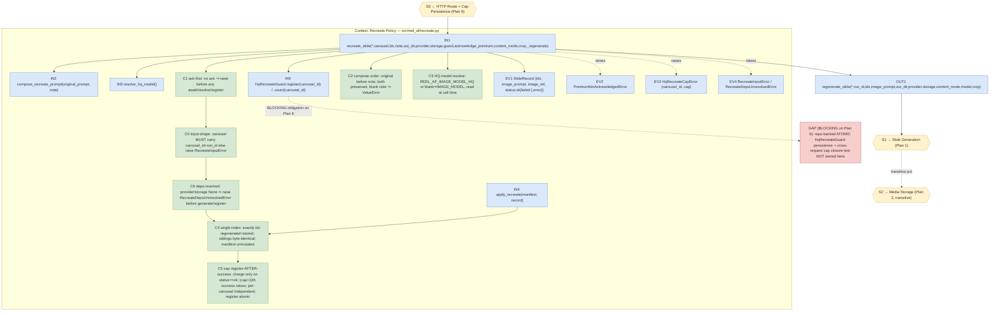
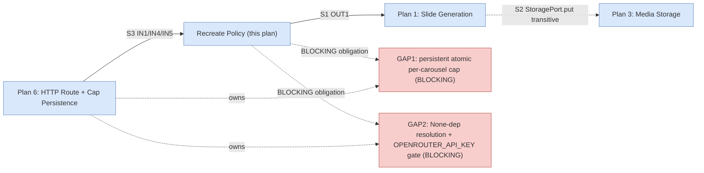

# Recreate Loop + Cost Guard (Backend) — TDD Implementation Plan

> **Plan 2 of 6** for the Carousel Image Pipeline PRD
> (`2026-07-11-prd-carousel-image-pipeline-and-research-handoff.md`).
> **Scope:** PRD §7 **ISC-17, ISC-18, ISC-19, ISC-20, ISC-21, ISC-A1, ISC-53, ISC-54** and the
> §11 tracker row 2. Resolves **OD-5** (soft confirm + configurable cap) on the backend.
> **Seams this plan OWNS:** the pure **recreate function/service** — prompt+note composition, HQ
> model selection (`REEL_AF_IMAGE_MODEL_HQ`), the premium-acknowledgment guard, and the
> per-carousel HQ-regeneration cap counter. Plan 6 mounts and authorizes the HTTP route that
> calls this logic (`POST /api/v1/carousels/{id}/slides/{idx}/recreate`); we own the callable it
> invokes, not the route.
> **Seams this plan CONSUMES (do NOT redefine):**
> - `regenerate_slide(*, run_id, idx, image_prompt, out_dir, provider, storage, content_mode,
>   model, crop, _generate_frame)` — the single-slide generate→store→record retry primitive
>   **owned by Plan 1** (`2026-07-11-tdd-01-carousel-pipeline-backend.md`, Behavior 12). We call
>   it; we do not reimplement generate→store→record.
> - `generate_first_frame(provider, image_prompt, idx, out_dir, content_mode, *, model=None,
>   crop="9x16")` — the `model=`/`crop=` params are **added by Plan 1** (Behaviors 1–3). We only
>   *select* the HQ model id and pass it through.
> - `StoragePort.put(...)` — **owned by Plan 3**; reached only transitively through
>   `regenerate_slide`. In these unit tests it is a fake injected the same way Plan 1 injects it.

## Overview

The carousel review UI (PRD Flow C) lets a user send any single slide back through a
**recreate-with-note** loop that runs on a **higher-quality, more expensive** image model. This
plan builds the pure backend logic behind that loop as a set of smallest testable behaviors,
built entirely on top of Plan 1's `regenerate_slide` primitive:

1. **Accept a note** — the recreate call takes a free-text `note`. (ISC-17)
2. **Compose prompt + note** — the model input is the slide's **original** `image_prompt`
   **plus** the note, in that order, both substrings preserved. (ISC-18)
3. **HQ model select** — the recreate resolves and passes `REEL_AF_IMAGE_MODEL_HQ` (a NEW env,
   sibling to `REEL_AF_IMAGE_MODEL` at `images.py:23`) as the `model=` to `regenerate_slide`.
   (ISC-19)
4. **Replace exactly one slide, order/count preserved** — the recreate returns a replacement for
   the target index only; the caller-visible manifest keeps its order and length. (ISC-20)
5. **Return the new ref** — the recreate returns the fresh `image_ref` for in-place UI update.
   (ISC-21)
6. **Never touch siblings** (anti) — recreate regenerates and stores only the target index; no
   sibling `image_ref` or `image_prompt` changes; storage is written exactly once, for that idx.
   (ISC-A1)
7. **Premium acknowledgment required** — an HQ recreate requires an explicit
   `acknowledge_premium=True`; without it the call is rejected before any generation. (ISC-53)
8. **Configurable per-carousel cap** — a configurable `REEL_AF_HQ_RECREATE_CAP` bounds how many
   HQ recreates one carousel may run; the `(cap+1)`th is rejected with a clear error; the `cap`th
   still succeeds. (ISC-54)

Every behavior is exercised through Plan 1's **deterministic fake image provider**
(`tests/util.py:59` `make_fake_provider`) and a **fake `StoragePort`** (Plan 1's
`_FakeStoragePort` pattern), plus a fake `_regenerate` injection so no network, model, or
object-storage call is made. New tests live in **`tests/test_recreate.py`**.

## Current State Analysis

### Key Discoveries

- **Image model env** — `IMAGE_MODEL = os.getenv("REEL_AF_IMAGE_MODEL",
  "openrouter/google/gemini-2.5-flash-image")` read once at import (`src/reel_af/render/images.py:23`).
  The HQ model is a **new** sibling env `REEL_AF_IMAGE_MODEL_HQ` with **no default fallback to a
  fabricated model id** — if unset it MUST fall back to a defined, testable value (we default it
  to `IMAGE_MODEL` so an operator who has not configured an HQ tier still gets a working, if not
  premium, recreate; the confirm/cap machinery is unaffected). This mirrors the existing
  `getenv(name, default)` convention used throughout `app.py:63-81`.
- **`generate_first_frame(..., *, model=None, crop="9x16")`** — the `model=` keyword is **added by
  Plan 1** (Behaviors 1–3, `images.py`). Plan 1's resolution rule is
  `selected_model = (model or "").strip() or IMAGE_MODEL`, so passing a blank HQ env still yields
  a valid model. We rely on that; we never touch `generate_first_frame` ourselves.
- **`regenerate_slide(...)`** — **added by Plan 1** (Behavior 12, `src/reel_af/app.py`). Signature
  (per Plan 1 Green):
  `async def regenerate_slide(*, run_id, idx, image_prompt, out_dir, provider=None, storage=None,
  content_mode="general", model=None, crop="4x5", _generate_frame=generate_first_frame) -> dict`,
  returning a slide record `{"idx", "image_prompt", "image_ref", "status"}`. It regenerates and
  stores **only** the given `idx`. Our recreate is a thin *policy* layer above it (compose note,
  pick HQ model, enforce confirm + cap) — the generate→store→record mechanics stay in Plan 1.
- **Config-cap env pattern** — the codebase reads tunables via `os.getenv(NAME, default)`
  (`app.py:63-81,836`). The HQ cap is a module-level `HQ_RECREATE_CAP = int(os.getenv(
  "REEL_AF_HQ_RECREATE_CAP", "5"))`, read the same way — configurable, one jump, no literal
  scattered at call sites.
- **No recreate/cost-guard code exists yet** — `grep -rn "regenerate_slide|REEL_AF_IMAGE_MODEL_HQ"
  src/` is empty at the time of writing; both Plan 1's primitive and this plan's policy layer are
  new. This plan does not assume Plan 1 has landed at author time; it targets Plan 1's documented
  seam and is sequenced after it (PRD §9 step 5).
- **Manifest shape** — PRD §6.3: `{run_id, slides: [{idx, image_prompt, image_ref, status}]}`.
  A recreate replaces one slide's record in that list; order = ascending `idx`; length unchanged.

### Where the recreate logic lives

New module **`src/reel_af/recreate.py`** exposing a pure async function
`recreate_slide(...)` plus small helpers (`compose_recreate_prompt`, `resolve_hq_model`,
`HqRecreateGuard`). Keeping it in its own module (not `app.py`) keeps the policy layer testable
without importing the whole reasoner surface, and gives Plan 6's route one obvious import. The
per-carousel cap counter is a small injectable **`HqRecreateGuard`** (a protocol with
`register(carousel_id) -> None` that raises when the cap is exceeded, and `count(carousel_id)`),
so the route (Plan 6) can back it with the real carousel repo while these unit tests use an
in-memory fake.

### Test harness

- `pytest` + `pytest-asyncio` (`asyncio_mode=auto`). Focused run:
  `uv run pytest tests/test_recreate.py -q`. Lint: `uv run ruff check`.
- **Deterministic fake image provider** — `tests/util.py:59` `make_fake_provider(
  image_data=square_png_bytes(...))`; `.calls` records `("image", kwargs)` so we can assert the
  exact `model` and `prompt` the provider received. `image_error=...` forces a failure.
- **Fake `StoragePort`** — Plan 1's `_FakeStoragePort` (async `put(*, run_id, idx, path) ->
  f"stub://{run_id}/{idx}"`, recording `saved`), copied into `tests/test_recreate.py`.
- **Injection style** — mirrors Plan 1 and `tests/test_hooks.py:16` (`TextProvider`) /
  `tests/test_ingest.py` (injected `runner`): `recreate_slide` accepts a keyword-only
  `_regenerate=regenerate_slide` seam so most policy tests inject a spy that records what model +
  prompt the recreate *would* pass to Plan 1's primitive, without running real image generation.
  Two end-to-end tests use the **real** `regenerate_slide` with a fake provider + fake storage to
  prove the composition reaches the provider (ISC-18/ISC-19 model+prompt assertion) and the
  sibling-safety property (ISC-A1).

## Desired End State

`src/reel_af/recreate.py` exposes:

```python
async def recreate_slide(
    *,
    carousel,                 # the current slide manifest {run_id, slides:[...]} or a repo view
    idx: int,
    note: str,
    out_dir: str,
    provider=None,
    storage=None,
    guard: HqRecreateGuard,   # per-carousel HQ cap counter (Plan 6 backs it real)
    acknowledge_premium: bool = False,
    content_mode: str = "general",
    crop: str = "4x5",
    _regenerate=regenerate_slide,     # Plan 1 primitive (injectable seam)
) -> dict:                            # the replaced slide record
    ...
```

**Input precondition (C-input):** `carousel` MUST carry `carousel_id` **and** `run_id`. A manifest
missing `carousel_id` (e.g. a raw PRD §6.3 `{run_id, slides:[...]}` shape) raises a typed
`RecreateInputError`, **not** a bare `KeyError` — the cap can only be charged against a named
carousel. Plan 6's route MUST supply `carousel_id` (its own kwarg or on the manifest). See
Behavior 6 for the guard test.

Behavior contract:

- Rejects when `acknowledge_premium` is not truthy (`PremiumNotAcknowledgedError`) — before any
  generation, model resolution, or cap increment.
- Rejects a `carousel` lacking `carousel_id`/`run_id` with `RecreateInputError` (before any await),
  so the cap is never charged against an unnamed carousel.
- Resolves the model to `REEL_AF_IMAGE_MODEL_HQ` (falling back to `IMAGE_MODEL` when the HQ env is
  unset/blank) and passes it as `model=` to `regenerate_slide`.
- Composes the model prompt as `f"{original_prompt}\n\n{note}"` — original first, note second,
  both preserved.
- Calls `regenerate_slide` for **only** `idx`, obtaining the single replaced slide record
  `{idx, image_prompt, image_ref, status[, error]}` (with `image_prompt` = the composed prompt),
  and does not mutate or regenerate any sibling.
- **Registers the recreate against the carousel's HQ cap AFTER a successful generation**
  (`guard.register(carousel_id)` runs only when `regenerate_slide` returns `status == "ok"`), which
  raises `HqRecreateCapError` on the `(cap+1)`th **successful** recreate for that carousel; the
  `cap`th succeeds. **Only successful premium spend consumes a slot** — a `regenerate_slide` that
  raises, or returns a `status == "failed"` record, does **not** charge the cap (register-after-
  success; see Behavior 6 for the failed-generation cap-accounting test).

### Observable Behaviors

- A `note` is accepted and reaches the composed prompt.
- The composed model prompt contains the original prompt then the note (both substrings, order
  preserved).
- `regenerate_slide` receives `model == REEL_AF_IMAGE_MODEL_HQ` (asserted at the fake provider's
  `.calls`).
- Exactly one slide (the target `idx`) is regenerated and stored; the returned manifest preserves
  order and length; sibling refs/prompts are byte-identical to before.
- The recreate returns the fresh `image_ref`.
- Without `acknowledge_premium`, the call raises and nothing is generated/stored/counted.
- With `provider`/`storage` handed in as `None`, the call raises a typed
  `RecreateDepsUnresolvedError` (no `None.generate_image` crash) and charges no cap.
- A `carousel` missing `carousel_id`/`run_id` raises `RecreateInputError` before any cap charge.
- The `cap`th **successful** HQ recreate on one carousel succeeds; the `(cap+1)`th successful one
  raises a clear cap error; a different carousel has its own independent count.
- A recreate whose HQ generation fails (raises or returns `status == "failed"`) charges no cap slot
  (register-after-success) — only successful premium spend is counted.

## What We're NOT Doing

- **Not** implementing the HTTP route or its auth/tenancy — that is **Plan 6**
  (`POST /api/v1/carousels/{id}/slides/{idx}/recreate`, `identity.resolve`, org-scope guard,
  idempotency). We expose the pure callable + guard protocol Plan 6 mounts and authorizes.
- **Not** building the recreate **UI dialog** (the "this uses a premium model" confirm surface,
  the in-progress state, in-place replace) — that is **Plan 6** UI. ISC-53's *dialog* is
  manual/E2E and verified there; here we enforce the backend precondition (the required
  `acknowledge_premium` param) only. **The confirm dialog itself is manual/E2E, stated explicitly.**
- **Not** implementing `regenerate_slide` / `generate_first_frame(model=,crop=)` / the
  `carousel-default` preset / the text→`Essence` seam — all **Plan 1**. We consume them.
- **Not** implementing `StoragePort` / presigned URLs — **Plan 3**. Reached transitively via
  `regenerate_slide`; a fake here.
- **Not** persisting the cap count across process restarts or wiring it to the carousel repo —
  Plan 6 backs `HqRecreateGuard` with the real `CarouselRepoPort`. Here the guard is an in-memory
  fake; we own its **protocol and semantics**, not its persistence.
- **Not** adding real network/model calls in tests.
- **Not** resolving `None` provider/storage to real implementations or gating `OPENROUTER_API_KEY` —
  that obligation is **handed to Plan 6** (see below). `recreate_slide` passes whatever `provider`/
  `storage` it is handed straight into `regenerate_slide`; it does **not** construct
  `OpenRouterProvider()` or check the key. (It DOES fail cleanly rather than crash on `None` — see
  Behavior 2b.)

## Obligations handed to Plan 6 (BLOCKING for Plan 6)

These are production-closure obligations this policy plan does **not** own but which Plan 6 MUST
discharge before the recreate route is production-complete. They are named here (with the
`app.py`/Plan 1 evidence) so the ownership is explicit, not silently unowned.

1. **Dependency resolution + `OPENROUTER_API_KEY` gate (BLOCKING).** Under the AgentField JSON-`input`
   envelope, injected deps arrive `None` and reasoners resolve them in-body (e.g.
   `OpenRouterProvider()` at `video.py:222`); the key gate lives at the reasoner entrypoints only
   (`app.py:398-399`, `app.py:478-479`: `if "OPENROUTER_API_KEY" not in os.environ: return {"error":
   "OPENROUTER_API_KEY not set in env."}`). Downstream helpers
   (`generate_first_frame`, `provider.generate_image` at `images.py:107-111`) have **no** such guard.
   Plan 6's recreate route MUST therefore resolve `None` provider/storage → real implementations AND
   apply the `OPENROUTER_API_KEY` gate **before** calling `recreate_slide`, exactly as Plan 1
   discharged it in **Behavior 8b / gap G6**. `recreate_slide` itself does **not** resolve deps or
   gate the key — but it DOES fail cleanly (typed `RecreateDepsUnresolvedError`, no `None.generate_
   image` crash) if handed `None` deps with premium acknowledged (Behavior 2b), so a mis-wired route
   surfaces a clear error instead of an `AttributeError`.
2. **Repo-backed, atomic `HqRecreateGuard` + cross-request cap closure (BLOCKING).** The in-memory
   `_MemGuard` here does **not** enforce spend across HTTP requests (each request would otherwise get
   a fresh guard and the cap would never engage — a cost guard that resets every request is not a
   cost guard). Plan 6 MUST back `HqRecreateGuard` with `CarouselRepoPort` so `register`/`count`
   persist, MUST make `register` **atomic** (check-and-increment, so two concurrent recreates on one
   carousel cannot both pass a stale `count < cap` read and exceed the cap), and MUST add a
   cross-request closure test ("a second HTTP recreate sees the incremented count; the `(cap+1)`th is
   rejected"). Until Plan 6 lands, the cap is **tested but not production-closed** (GAP1).

## Testing Strategy

- **Framework:** `pytest` + `pytest-asyncio` (`asyncio_mode=auto`). New file
  `tests/test_recreate.py`.
- **Unit (LEAF):** every behavior is a same-module or single-seam unit test. The policy layer
  (`recreate_slide`) is called **directly in-process** with an injected fake provider / fake
  `StoragePort` / in-memory `HqRecreateGuard`, and (for policy-only assertions) an injected
  `_regenerate` spy. No async cross-process edge, no HTTP route, no registration boundary, no
  external store is crossed at runtime.
- **Fakes:** `make_fake_provider(image_data=square_png_bytes(300))`; a copied `_FakeStoragePort`;
  an in-memory `HqRecreateGuard`; a spy `_regenerate` that records `(idx, model, image_prompt)`
  and returns a canned slide record.
- **Property (compose):** for any `(original, note)` with non-empty note, the composed prompt
  `contains original` **and** `contains note` **and** `index(original) < index(note)` — order and
  substring preservation hold for all inputs (parametrized: unicode, newlines, very long note).
- **Property (cap boundary):** for `cap ∈ {0, 1, 3, 5}`, the first `cap` HQ recreates on a
  carousel succeed and the `(cap+1)`th raises — asserted at exactly `cap` and `cap+1`.
- **Sibling-safety (ISC-A1):** an end-to-end recreate on a 3-slide manifest with the **real**
  `regenerate_slide` + fake provider/storage asserts the two sibling records are `==` their
  pre-recreate values (ref + prompt), and the fake storage recorded a `put` for the target idx
  **only**.

## Workflow Closure

**No BLOCKING closure test applies — every behavior in this plan is LEAF.** Rationale per the
Step-2.5 framework (LEAF = same-module, no async edge, no cross-module/registration boundary
reached at runtime):

- **ISC-17, ISC-18** (accept note / compose prompt+note): `compose_recreate_prompt(original,
  note)` is a pure, synchronous, same-module function. Input → output fully observed by a unit
  test; no store, no async.
- **ISC-19** (HQ model): `resolve_hq_model()` reads an env var; `recreate_slide` passes the result
  as `model=` to the injected `_regenerate`/real `regenerate_slide`, and the fake provider's
  `.calls` records the exact model id. Same-event-loop `await` of an injected function is not a
  cross-module async connector — it is a direct in-process call with a fake at the boundary.
- **ISC-20, ISC-21, ISC-A1** (replace one / return ref / never touch siblings): `recreate_slide`
  is an async function invoked **directly**; it calls `regenerate_slide` for one index and returns
  its record. The sibling-safety assertion reads the manifest before/after in the same test — a
  pure structural observation, no async edge, no separate process populating a read model.
- **ISC-53** (premium ack required): a pure precondition guard at the top of `recreate_slide` —
  raises before any await. Fully observed by a unit test.
- **ISC-54** (per-carousel cap): `HqRecreateGuard.register(carousel_id)` is a synchronous
  in-memory counter here; the boundary at `cap`/`cap+1` is a pure arithmetic assertion. The
  **real** persistence of the count (across requests, backed by the carousel repo) is a
  cross-request read model **owned by Plan 6** — Plan 6 must supply a real `HqRecreateGuard`
  backed by `CarouselRepoPort` and close the "second HTTP recreate sees the incremented count"
  loop through its authed route. That cross-request closure is **explicitly deferred to Plan 6**
  and named here so this plan does not imply production completeness of the persisted cap.

**No async edge or registration boundary is reached at runtime in any test**, so no injected
clock/driver and no real store are required. The one production async seam reached transitively
(slide file → fetchable `image_ref` via `StoragePort`) is **owned and closure-tested by Plan 3**;
here it is a synchronous fake behind `regenerate_slide`. The true end-to-end
"user clicks recreate-with-note → HQ image replaces the slide in the browser, cap enforced across
requests" closure is **owned by Plan 6** (authed route → this policy layer → Plan 1 primitive →
Plan 3 storage → UI). Stated so this plan does not imply production completeness of the route/UI
or the persisted cap.

---

## Behavior 1: Recreate accepts a free-text `note` and composes prompt + note (ISC-17, ISC-18)

### Test Specification

**Given** a slide whose original `image_prompt` is `"a quiet lab bench"` and a free-text
`note="make it night, add neon"`, **when** the composed recreate prompt is built, **then** the
composed prompt **contains** the original prompt **and contains** the note, with the original
appearing **before** the note.

**Property (order + substring preservation):** for any `(original, note)` with a non-empty note —
including unicode, embedded newlines, and a very long note — `original in composed`,
`note in composed`, and `composed.index(original) < composed.index(note)`.

**Edge Cases:** a blank/whitespace `note` is rejected with a clear `ValueError` (a recreate must
carry an actual instruction); the original prompt is never dropped even if the note is long.

**Files touched:** `src/reel_af/recreate.py`, `tests/test_recreate.py`.

### TDD Cycle

#### 🔴 Red: Write Failing Test
**File**: `tests/test_recreate.py`
```python
import pytest

from reel_af.recreate import compose_recreate_prompt


def test_compose_puts_original_then_note():
    composed = compose_recreate_prompt("a quiet lab bench", "make it night, add neon")
    assert "a quiet lab bench" in composed
    assert "make it night, add neon" in composed
    assert composed.index("a quiet lab bench") < composed.index("make it night, add neon")


@pytest.mark.parametrize(
    "original,note",
    [
        ("orig", "note"),
        ("café ☕ scene", "add lumière"),
        ("line one\nline two", "note\nwith newline"),
        ("short", "n " * 5000),
    ],
)
def test_compose_preserves_both_substrings_in_order(original, note):
    composed = compose_recreate_prompt(original, note)
    assert original in composed and note in composed
    assert composed.index(original) < composed.index(note)


@pytest.mark.parametrize("bad", ["", "   ", "\n\t "])
def test_compose_rejects_blank_note(bad):
    with pytest.raises(ValueError, match="note"):
        compose_recreate_prompt("orig", bad)
```

#### 🟢 Green: Minimal Implementation
**File**: `src/reel_af/recreate.py`
```python
def compose_recreate_prompt(original_prompt: str, note: str) -> str:
    """Model input for a recreate = the slide's ORIGINAL prompt + the user's note.

    Order is load-bearing (ISC-18): original first so the note reads as an
    adjustment ON TOP of the established scene, not a replacement.
    """
    cleaned_note = (note or "").strip()
    if not cleaned_note:
        raise ValueError("recreate: note is empty or whitespace-only")
    return f"{original_prompt}\n\n{cleaned_note}"
```

#### 🔵 Refactor: Improve Code
**File**: `src/reel_af/recreate.py`
- [ ] **Reveals intent:** the docstring states the order invariant (ISC-18) so a future edit does
      not silently flip it; the join is a single named function used everywhere a recreate prompt
      is built (no inline `original + note` at call sites).
- [ ] **No duplication:** `compose_recreate_prompt` is the ONLY place prompt+note is assembled;
      `recreate_slide` calls it, never re-concatenates.
- [ ] **Named separator:** the `\n\n` join lives in one function; if the separator changes it
      changes once.
- [ ] **Fits patterns:** blank-input rejection mirrors Plan 1's `essence_from_text` empty-guard
      (`extract.py` `_prepare_text_body`) — `(x or "").strip()` collapses `None`/blank to one guard.

### Success Criteria
**Automated:**
- [ ] Red fails (no `compose_recreate_prompt`): `uv run pytest tests/test_recreate.py -k compose -q`
- [ ] Green + property (4 cases) pass
- [ ] Blank-note rejection passes
- [ ] `uv run ruff check src/reel_af/recreate.py tests/test_recreate.py` clean

**Manual:**
- [ ] A live recreate with a note visibly reflects both the original scene and the note.

---

## Behavior 2: Recreate uses the higher-quality model `REEL_AF_IMAGE_MODEL_HQ` (ISC-19)

### Test Specification

**Given** `REEL_AF_IMAGE_MODEL_HQ` set to `"premium/hq-image-x"` and an acknowledged recreate,
**when** `recreate_slide(...)` runs against the real `regenerate_slide` with a fake provider,
**then** the provider's `generate_image` was called with `model == "premium/hq-image-x"` (the HQ
id, NOT the standard `REEL_AF_IMAGE_MODEL`).

**Edge Cases:** with `REEL_AF_IMAGE_MODEL_HQ` unset/blank, `resolve_hq_model()` falls back to the
standard `IMAGE_MODEL` (a working recreate for operators without a premium tier) — asserted so the
fallback is defined, not a fabricated id.

**Files touched:** `src/reel_af/recreate.py`, `tests/test_recreate.py`.

### TDD Cycle

#### 🔴 Red
**File**: `tests/test_recreate.py`
```python
from pathlib import Path

from util import make_fake_provider, square_png_bytes

from reel_af.recreate import recreate_slide, resolve_hq_model
from reel_af.render import images


class _FakeStoragePort:
    def __init__(self):
        self.saved = []

    async def put(self, *, run_id, idx, path):
        self.saved.append((run_id, idx, path))
        return f"stub://{run_id}/{idx}"


class _MemGuard:
    def __init__(self, cap):
        self.cap = cap
        self.counts = {}

    def register(self, carousel_id):
        n = self.counts.get(carousel_id, 0)
        if n >= self.cap:
            from reel_af.recreate import HqRecreateCapError
            raise HqRecreateCapError(carousel_id, self.cap)
        self.counts[carousel_id] = n + 1

    def count(self, carousel_id):
        return self.counts.get(carousel_id, 0)


def _carousel(run_id="run1", carousel_id="car1"):
    return {
        "carousel_id": carousel_id,
        "run_id": run_id,
        "slides": [
            {"idx": 0, "image_prompt": "p0", "image_ref": "stub://run1/0", "status": "ok"},
            {"idx": 1, "image_prompt": "p1", "image_ref": "stub://run1/1", "status": "ok"},
            {"idx": 2, "image_prompt": "p2", "image_ref": "stub://run1/2", "status": "ok"},
        ],
    }


async def test_recreate_uses_hq_model(tmp_path: Path, monkeypatch):
    monkeypatch.setenv("REEL_AF_IMAGE_MODEL_HQ", "premium/hq-image-x")
    fake = make_fake_provider(image_data=square_png_bytes(300))
    provider = fake()

    await recreate_slide(
        carousel=_carousel(), idx=1, note="brighter",
        out_dir=str(tmp_path), provider=provider, storage=_FakeStoragePort(),
        guard=_MemGuard(cap=5), acknowledge_premium=True,
    )

    image_calls = [kw for m, kw in fake.calls if m == "image"]
    assert image_calls and image_calls[0]["model"] == "premium/hq-image-x"


def test_hq_model_falls_back_to_standard_when_unset(monkeypatch):
    monkeypatch.delenv("REEL_AF_IMAGE_MODEL_HQ", raising=False)
    assert resolve_hq_model() == images.IMAGE_MODEL
```
> **Note:** `resolve_hq_model()` reads the env at call time (not import) so the recreate picks up
> operator config without a restart and so tests can `monkeypatch.setenv` — this deliberately
> differs from `IMAGE_MODEL`'s read-once-at-import, because the HQ tier is a per-call policy, not a
> process-wide default.
> **Crop rationale:** `recreate_slide` defaults `crop="4x5"` (the **carousel** aspect ratio), which
> matches `regenerate_slide`'s `crop="4x5"` default — deliberately NOT the reel `generate_first_frame`
> default of `"9x16"` (Plan 1 line 293). Carousel slides are 4x5; the recreate must not silently
> inherit the reel aspect. Stated so a future edit to either default is a conscious, not incidental, change.

#### 🟢 Green
**File**: `src/reel_af/recreate.py`
```python
import os

from reel_af.app import regenerate_slide
from reel_af.render.images import IMAGE_MODEL


def resolve_hq_model() -> str:
    """The premium image model for recreate. Read at CALL time (per-call policy).

    Falls back to the standard IMAGE_MODEL when REEL_AF_IMAGE_MODEL_HQ is
    unset/blank so a recreate still works without a configured premium tier.
    """
    return (os.getenv("REEL_AF_IMAGE_MODEL_HQ") or "").strip() or IMAGE_MODEL


async def recreate_slide(*, carousel, idx, note, out_dir, provider=None, storage=None,
                         guard, acknowledge_premium=False, content_mode="general",
                         crop="4x5", _regenerate=regenerate_slide) -> dict:
    slide = _find_slide(carousel, idx)                      # Behavior 3
    composed = compose_recreate_prompt(slide["image_prompt"], note)  # Behavior 1
    record = await _regenerate(
        run_id=carousel["run_id"], idx=idx, image_prompt=composed,
        out_dir=out_dir, provider=provider, storage=storage,
        content_mode=content_mode, model=resolve_hq_model(), crop=crop,
    )
    return record
```
> Importing `regenerate_slide` from `reel_af.app` is the Plan-1 seam. If a circular-import
> surfaces during Green (recreate ← app ← ...), move the shared `regenerate_slide` primitive to a
> small module both import (coordinate with Plan 1 owner via agent-mail); do NOT re-implement it
> here.

#### 🔵 Refactor
**File**: `src/reel_af/recreate.py`
- [ ] **No duplication:** `resolve_hq_model()` is the single HQ-model resolution point; the
      `model=` kwarg to `regenerate_slide` is never a literal.
- [ ] **Reveals intent:** name says "resolve HQ model"; the fallback-to-standard comment states
      *why* (operator without premium tier still works).
- [ ] **Fits patterns:** `(os.getenv(...) or "").strip() or DEFAULT` mirrors Plan 1's
      `selected_model` resolution in `generate_first_frame`, so both model-resolution sites read
      the same way.
- [ ] **No shallow wrapper:** `recreate_slide` does real policy work (find slide, compose, resolve
      model, cap — added in later behaviors); it is not a thin pass-through to `regenerate_slide`.

### Success Criteria
**Automated:**
- [ ] Red fails (no HQ model passed): `uv run pytest tests/test_recreate.py -k hq -q`
- [ ] Green passes; provider `.calls` shows the HQ model id
- [ ] Fallback test passes when env unset
- [ ] `uv run ruff check` clean

**Manual:**
- [ ] A live recreate routes to the configured premium model (higher quality visible in output).

---

## Behavior 2b: Recreate fails cleanly (typed error) when handed `None` deps (dep-resolution guard)

### Test Specification

**Given** a premium-acknowledged, in-range recreate but `provider=None` **or** `storage=None`
(the shape injected deps arrive as under the AgentField JSON-`input` envelope — Plan 1 Overview §5),
**when** `recreate_slide(...)` runs, **then** it raises a typed `RecreateDepsUnresolvedError`
**before** any generation, and it does **not** crash with an `AttributeError` on `None.generate_image`
and does **not** consume the cap. This makes a mis-wired route surface the same class of clean error
the rest of the system returns (`app.py:478-479`) instead of an opaque `None` attribute crash.

> **Ownership:** resolving `None → OpenRouterProvider()` / real storage + the `OPENROUTER_API_KEY`
> gate is **Plan 6's** obligation (see "Obligations handed to Plan 6"). This behavior only guarantees
> that if Plan 6 (or any caller) fails to resolve deps, `recreate_slide` fails **cleanly and
> typed**, not with a raw `AttributeError` from deep inside `generate_first_frame` /
> `provider.generate_image` (`images.py:107-111`, which has no `None` guard). The guard runs
> **before** `guard.register`, so a `None`-dep call charges no cap.

**Edge Cases:** `provider=None` and `storage=None` each independently trip the guard; the guard fires
after the ack + bounds checks (so a no-ack call still raises `PremiumNotAcknowledgedError` first) and
before generation and cap registration.

**Files touched:** `src/reel_af/recreate.py`, `tests/test_recreate.py`.

### TDD Cycle

#### 🔴 Red
**File**: `tests/test_recreate.py`
```python
from reel_af.recreate import RecreateDepsUnresolvedError


@pytest.mark.parametrize("provider,storage", [(None, "S"), ("P", None), (None, None)])
async def test_recreate_none_deps_raise_typed_not_attributeerror(tmp_path, provider, storage, monkeypatch):
    monkeypatch.setenv("REEL_AF_IMAGE_MODEL_HQ", "premium/hq-image-x")
    guard = _MemGuard(cap=5)
    fake = make_fake_provider(image_data=square_png_bytes(300))
    prov = fake() if provider == "P" else None
    stor = _FakeStoragePort() if storage == "S" else None

    with pytest.raises(RecreateDepsUnresolvedError):
        await recreate_slide(
            carousel=_carousel(), idx=1, note="x", out_dir=str(tmp_path),
            provider=prov, storage=stor, guard=guard, acknowledge_premium=True,
        )
    assert guard.count("car1") == 0   # a None-dep call charges no cap
```

#### 🟢 Green
**File**: `src/reel_af/recreate.py`
```python
class RecreateDepsUnresolvedError(RuntimeError):
    """provider/storage arrived None — the caller (Plan 6 route) must resolve deps
    and gate OPENROUTER_API_KEY before recreate_slide (see app.py:478-479)."""


# in recreate_slide, AFTER ack + bounds guards, BEFORE compose / regenerate / register:
    if provider is None or storage is None:
        raise RecreateDepsUnresolvedError(
            "recreate: provider/storage is None; the route must resolve deps and gate "
            "OPENROUTER_API_KEY before calling recreate_slide (see app.py:478-479)"
        )
```
> This is a **fail-clean** guard, not a resolver: `recreate_slide` still does NOT construct a real
> provider or check the key — that is Plan 6's job. It only converts the silent `None.generate_image`
> `AttributeError` into a typed error mapped by Plan 6 to the system-standard error body.

#### 🔵 Refactor
**File**: `src/reel_af/recreate.py`
- [ ] **Reveals intent:** the `None`-dep guard sits directly above compose/regenerate/register, so
      "no resolved deps ⇒ no work, no spend" is obvious; a comment cites `app.py:478-479` and names
      Plan 6 as the resolution owner.
- [ ] **Named error:** `RecreateDepsUnresolvedError` is a distinct type Plan 6 maps to the standard
      `{"error": "OPENROUTER_API_KEY not set in env."}`-class response, not an `AttributeError`.
- [ ] **Ordering invariant:** fires after ack + bounds, before compose/regenerate/register — so a
      `None`-dep recreate consumes no cap and generates nothing.

### Success Criteria
**Automated:**
- [ ] Red fails (no guard ⇒ `AttributeError` on `None`): `uv run pytest tests/test_recreate.py -k none_deps -q`
- [ ] Green passes: typed `RecreateDepsUnresolvedError` raised for each `None`-dep combination; no cap consumed
- [ ] `uv run ruff check` clean

**Manual:**
- [ ] A recreate route mounted without dep-resolution returns a clean typed error, not a 500 stack trace.

---

## Behavior 3: Recreate replaces exactly one slide at its index and returns the new ref (ISC-20, ISC-21)

### Test Specification

**Given** a 3-slide manifest and `idx=1`, **when** `recreate_slide(...)` runs, **then** it returns
the replaced slide record for `idx=1` carrying a fresh `image_ref` (from storage) and the composed
`image_prompt`; and when the caller applies that record to the manifest, the manifest keeps its
ascending index order and length 3.

**Edge Cases:** `idx` out of range (`< 0` or `>= len(slides)`) raises a clear `ValueError`/
`IndexError` **before** any generation or cap increment; recreating an already-`ok` slide is
allowed (idempotent replace) and still returns only that index.

**Files touched:** `src/reel_af/recreate.py`, `tests/test_recreate.py`.

### TDD Cycle

#### 🔴 Red
**File**: `tests/test_recreate.py`
```python
async def test_recreate_returns_one_replaced_slide_with_fresh_ref(tmp_path, monkeypatch):
    monkeypatch.setenv("REEL_AF_IMAGE_MODEL_HQ", "premium/hq-image-x")
    storage = _FakeStoragePort()
    fake = make_fake_provider(image_data=square_png_bytes(300))

    record = await recreate_slide(
        carousel=_carousel(run_id="runZ"), idx=1, note="brighter",
        out_dir=str(tmp_path), provider=fake(), storage=storage,
        guard=_MemGuard(cap=5), acknowledge_premium=True,
    )

    assert record["idx"] == 1
    assert record["image_ref"] == "stub://runZ/1"     # fresh ref for in-place UI update
    assert "brighter" in record["image_prompt"] and "p1" in record["image_prompt"]
    assert record["status"] == "ok"
    # only slide 1 was stored
    assert [s[1] for s in storage.saved] == [1]


@pytest.mark.parametrize("bad_idx", [-1, 3, 99])
async def test_recreate_out_of_range_idx_raises(tmp_path, bad_idx, monkeypatch):
    monkeypatch.setenv("REEL_AF_IMAGE_MODEL_HQ", "premium/hq-image-x")
    guard = _MemGuard(cap=5)
    with pytest.raises((ValueError, IndexError)):
        await recreate_slide(
            carousel=_carousel(), idx=bad_idx, note="x", out_dir=str(tmp_path),
            provider=make_fake_provider(image_data=square_png_bytes(300))(),
            storage=_FakeStoragePort(), guard=guard, acknowledge_premium=True,
        )
    assert guard.count("car1") == 0   # no cap consumed on a rejected recreate


def test_apply_recreate_replaces_by_idx_preserving_order_length_and_purity():
    manifest = _carousel(run_id="runA")
    before = copy.deepcopy(manifest["slides"])
    new_record = {"idx": 1, "image_prompt": "p1\n\nbrighter",
                  "image_ref": "stub://runA/1", "status": "ok"}

    out = apply_recreate(manifest, new_record)

    # replaced exactly idx 1; ascending order + length 3 preserved
    assert [s["idx"] for s in out["slides"]] == [0, 1, 2]
    assert len(out["slides"]) == 3
    assert out["slides"][1] == new_record
    assert out["slides"][0]["image_ref"] == before[0]["image_ref"]
    assert out["slides"][2]["image_ref"] == before[2]["image_ref"]
    # purity: the INPUT manifest's slide list is not mutated in place (C4)
    assert manifest["slides"][1] == before[1]


def test_apply_recreate_rejects_out_of_range_record_idx():
    manifest = _carousel()
    with pytest.raises((ValueError, IndexError)):
        apply_recreate(manifest, {"idx": 9, "image_prompt": "x",
                                  "image_ref": "r", "status": "ok"})
```
> `apply_recreate` (IN4) is imported at the top of `tests/test_recreate.py` alongside
> `recreate_slide`; `copy` is already imported for the sibling-safety test (Behavior 4).

#### 🟢 Green
**File**: `src/reel_af/recreate.py`
```python
def _find_slide(carousel, idx: int) -> dict:
    slides = carousel["slides"]
    if idx < 0 or idx >= len(slides):
        raise IndexError(f"recreate: slide idx {idx} out of range 0..{len(slides) - 1}")
    return slides[idx]


def apply_recreate(manifest: dict, record: dict) -> dict:
    """Return a NEW manifest with the slide at record['idx'] replaced by record.

    Replace-by-matching-idx: ascending order and length are invariants of the
    operation (C4), not of the caller. Does NOT mutate the input manifest/list
    (purity), so sibling-safety is structural. Used by tests and Plan 6's route.
    """
    slides = manifest["slides"]
    idx = record["idx"]
    if idx < 0 or idx >= len(slides):
        raise IndexError(f"apply_recreate: record idx {idx} out of range 0..{len(slides) - 1}")
    new_slides = [record if s["idx"] == idx else s for s in slides]
    return {**manifest, "slides": new_slides}
```
`recreate_slide` (from Behavior 2) already returns exactly `regenerate_slide`'s single record for
`idx`; `_find_slide` fixes the out-of-range guard. `apply_recreate` is the single place a manifest
slide is replaced by index (order/length preserved, input unmutated) so Plan 6's route has one
obvious call and the ISC-20 order/length guarantee rides a **tested** helper, not prose.

#### 🔵 Refactor
**File**: `src/reel_af/recreate.py`
- [ ] **Reveals intent:** `_find_slide` centralizes bounds-checking; `recreate_slide` reads as
      "find → compose → guard → regenerate → return one".
- [ ] **No duplication:** `apply_recreate(manifest, record)` is the single place a manifest slide
      is replaced by index (used by tests and by Plan 6's route); no ad-hoc list splicing.
- [ ] **Complexity down:** guard is a single bounds check, not nested conditionals.
- [ ] **Order guarantee stated:** `apply_recreate` replaces in place by matching `idx`, so ascending
      order and length are invariants of the operation, not of the caller.

### Success Criteria
**Automated:**
- [ ] Replace-one + fresh-ref test passes: `uv run pytest tests/test_recreate.py -k replaced -q`
- [ ] Out-of-range idx raises and consumes no cap
- [ ] `apply_recreate` test passes: replaces by idx, preserves order+length, does not mutate input,
      rejects an out-of-range record idx (`uv run pytest tests/test_recreate.py -k apply_recreate -q`)
- [ ] `uv run ruff check` clean

**Manual:**
- [ ] In the review UI (Plan 6), a recreated slide swaps in place; neighbors are visually untouched.

---

## Behavior 4: Recreate never regenerates or reorders sibling slides (ISC-A1, anti)

### Test Specification

**Given** a 3-slide manifest, **when** `recreate_slide(idx=1, ...)` runs end-to-end with the
**real** `regenerate_slide` + fake provider + fake storage, **then** the sibling records at `idx=0`
and `idx=2` are **byte-identical** to their pre-recreate values (same `image_ref`, same
`image_prompt`, same `status`), the storage `put` was invoked for `idx=1` **only**, and the
provider's `generate_image` was called exactly **once**.

**Property:** across `idx ∈ {0, 1, 2}`, recreating one index leaves the other two records
unchanged and stores exactly that one index.

**Edge Cases:** recreating `idx=0` (first) and `idx=2` (last) both leave the remaining two intact —
no off-by-one that touches a neighbor.

**Files touched:** `tests/test_recreate.py` (assertion only; production correctness comes from
Behaviors 2–3 calling `regenerate_slide` for a single idx).

### TDD Cycle

#### 🔴 Red
**File**: `tests/test_recreate.py`
```python
import copy


@pytest.mark.parametrize("target", [0, 1, 2])
async def test_recreate_leaves_siblings_untouched(tmp_path, target, monkeypatch):
    monkeypatch.setenv("REEL_AF_IMAGE_MODEL_HQ", "premium/hq-image-x")
    carousel = _carousel(run_id="runS")
    before = copy.deepcopy(carousel["slides"])
    storage = _FakeStoragePort()
    fake = make_fake_provider(image_data=square_png_bytes(300))

    record = await recreate_slide(
        carousel=carousel, idx=target, note="tweak",
        out_dir=str(tmp_path), provider=fake(), storage=storage,
        guard=_MemGuard(cap=5), acknowledge_premium=True,
    )

    # storage touched the target index only, exactly once
    assert [s[1] for s in storage.saved] == [target]
    # provider generated exactly one image
    assert sum(1 for m, _ in fake.calls if m == "image") == 1
    # siblings unchanged (input manifest not mutated by recreate_slide)
    for i in (0, 1, 2):
        if i != target:
            assert carousel["slides"][i] == before[i]
    assert record["idx"] == target
```

#### 🟢 Green
No new production code — this behavior **asserts** the isolation established by Behaviors 2–3
(`recreate_slide` calls `regenerate_slide` for exactly one `idx` and returns a single record,
never iterating siblings, never mutating the input manifest). If it fails, the recreate wrongly
touched a sibling; fix by keeping the single-index call and returning a record for the caller to
apply (don't mutate `carousel["slides"]` in place).

#### 🔵 Refactor
**File**: `src/reel_af/recreate.py`
- [ ] **Reveals intent:** `recreate_slide` returns a record and does NOT mutate the passed
      `carousel` — purity makes sibling-safety structural. A comment states the ISC-A1 invariant.
- [ ] **Regression guard:** keep this test even though Green adds no code, to prevent a future
      "batch re-render on recreate" refactor from re-touching siblings.

### Success Criteria
**Automated:**
- [ ] Sibling-safety passes for target ∈ {0,1,2}: `uv run pytest tests/test_recreate.py -k siblings -q`
- [ ] Exactly one storage `put` and one image call per recreate
- [ ] `uv run ruff check` clean

**Manual:**
- [ ] Repeated recreates of different slides never alter neighbors in the review UI (Plan 6).

---

## Behavior 5: An HQ recreate requires explicit premium acknowledgment (ISC-53)

### Test Specification

**Given** a recreate request **without** `acknowledge_premium` (default `False`), **when**
`recreate_slide(...)` runs, **then** it raises `PremiumNotAcknowledgedError` **before** any image
generation, storage write, model resolution, or cap increment. **Given** `acknowledge_premium=True`,
the recreate proceeds normally.

**Edge Cases:** a falsy-but-present value (`acknowledge_premium=0`, `""`, `None`) is treated as not
acknowledged; only a truthy explicit value proceeds. The guard fires first, so a would-be-failing
provider/storage is never reached.

> **UI dialog is manual/E2E.** ISC-53's user-facing "this uses a premium model" confirm dialog is
> **owned by Plan 6's UI** and verified manually / by E2E there. This backend behavior enforces
> only the *precondition*: the route (Plan 6) must pass `acknowledge_premium=True` (set when the
> user confirms the dialog); an un-acknowledged call is rejected at this seam.

**Files touched:** `src/reel_af/recreate.py`, `tests/test_recreate.py`.

### TDD Cycle

#### 🔴 Red
**File**: `tests/test_recreate.py`
```python
from reel_af.recreate import PremiumNotAcknowledgedError


@pytest.mark.parametrize("ack", [False, 0, "", None])
async def test_recreate_rejected_without_premium_ack(tmp_path, ack, monkeypatch):
    monkeypatch.setenv("REEL_AF_IMAGE_MODEL_HQ", "premium/hq-image-x")
    storage = _FakeStoragePort()
    fake = make_fake_provider(image_data=square_png_bytes(300))
    guard = _MemGuard(cap=5)

    with pytest.raises(PremiumNotAcknowledgedError):
        await recreate_slide(
            carousel=_carousel(), idx=1, note="x", out_dir=str(tmp_path),
            provider=fake(), storage=storage, guard=guard, acknowledge_premium=ack,
        )

    # nothing generated, stored, or counted
    assert storage.saved == []
    assert not any(m == "image" for m, _ in fake.calls)
    assert guard.count("car1") == 0
```

#### 🟢 Green
**File**: `src/reel_af/recreate.py`
```python
class PremiumNotAcknowledgedError(RuntimeError):
    """Raised when an HQ recreate is requested without an explicit premium acknowledgment."""


# at the TOP of recreate_slide, before any await / model resolution / cap register:
    if not acknowledge_premium:
        raise PremiumNotAcknowledgedError(
            "recreate uses a premium image model; acknowledge_premium=True is required"
        )
```

#### 🔵 Refactor
**File**: `src/reel_af/recreate.py`
- [ ] **Reveals intent:** the guard is the first statement in `recreate_slide`, above the
      bounds-check and compose, so "no ack → no work" is obvious and cheap.
- [ ] **Named error:** `PremiumNotAcknowledgedError` is a distinct type Plan 6 maps to an HTTP 400
      with a clear message; not a bare `ValueError`.
- [ ] **No duplication:** the ack check exists once, at the entry.

### Success Criteria
**Automated:**
- [ ] Rejection passes for all falsy ack values; nothing generated/stored/counted:
      `uv run pytest tests/test_recreate.py -k ack -q`
- [ ] Acknowledged path (other tests) still proceeds
- [ ] `uv run ruff check` clean

**Manual:**
- [ ] The premium-confirm dialog (Plan 6) sets `acknowledge_premium=True` on confirm and blocks
      otherwise — verified in the browser (E2E, Plan 6).

---

## Behavior 6: A configurable per-carousel HQ-regeneration cap bounds spend (ISC-54)

### Test Specification

**Given** a cap of `C` (from `REEL_AF_HQ_RECREATE_CAP`, default 5) and a single carousel, **when**
`C` acknowledged HQ recreates run against it, **then** all `C` succeed; **when** the `(C+1)`th runs,
**then** it raises `HqRecreateCapError` with a clear message naming the cap — **before** any
generation or storage write. A **different** carousel keeps an independent count (its first recreate
still succeeds).

**Property (boundary):** for `cap ∈ {0, 1, 3, 5}`, exactly the first `cap` recreates on one
carousel succeed and the `(cap+1)`th raises — asserted precisely at `cap` and `cap+1`. (`cap=0`
means the very first HQ recreate is rejected.)

**Register-AFTER-success (cap accounting):** `guard.register` runs **only after** `regenerate_slide`
returns a `status == "ok"` record — so **only successful premium spend consumes a slot**. A recreate
whose generation **raises** (provider/storage error) or returns a `status == "failed"` record does
**not** charge the cap. Rationale: the cost guard's promise is "bound premium *spend*"; a failed
generation produced no premium image, so charging it would mis-charge the user for a slide that was
never produced. (Plan 1's standalone `regenerate_slide` **raises** on failure — Plan 1 line 1344's
Green has no try/except — but a caller could still hand back a `status:"failed"` record; register-
after-success is correct for **both** paths.)

**Edge Cases:** a recreate rejected by the ack guard (Behavior 5), the `None`-dep guard (Behavior
2b), or the out-of-range guard (Behavior 3) does **not** consume the cap (register runs only after
those pass **and** after a successful generation). A `carousel` missing `carousel_id` raises
`RecreateInputError` **before** any register (the cap can't be charged against an unnamed carousel).
The cap env is read into a module constant via the `os.getenv(NAME, default)` convention; a test
that needs a different cap injects its own `HqRecreateGuard` (the guard is injected, not read from
env inside `recreate_slide`), so cap policy is testable without env juggling.

**Files touched:** `src/reel_af/recreate.py`, `tests/test_recreate.py`.

### TDD Cycle

#### 🔴 Red
**File**: `tests/test_recreate.py`
```python
from reel_af.recreate import HqRecreateCapError, HQ_RECREATE_CAP


@pytest.mark.parametrize("cap", [0, 1, 3, 5])
async def test_hq_cap_boundary(tmp_path, cap, monkeypatch):
    monkeypatch.setenv("REEL_AF_IMAGE_MODEL_HQ", "premium/hq-image-x")
    guard = _MemGuard(cap=cap)
    fake = make_fake_provider(image_data=square_png_bytes(300))

    async def one():
        return await recreate_slide(
            carousel=_carousel(), idx=1, note="x", out_dir=str(tmp_path),
            provider=fake(), storage=_FakeStoragePort(), guard=guard,
            acknowledge_premium=True,
        )

    for _ in range(cap):          # the first `cap` succeed
        await one()
    with pytest.raises(HqRecreateCapError):   # the (cap+1)th is rejected
        await one()
    assert guard.count("car1") == cap         # rejected call did not increment past cap


async def test_hq_cap_is_per_carousel(tmp_path, monkeypatch):
    monkeypatch.setenv("REEL_AF_IMAGE_MODEL_HQ", "premium/hq-image-x")
    guard = _MemGuard(cap=1)
    fake = make_fake_provider(image_data=square_png_bytes(300))

    await recreate_slide(carousel=_carousel(carousel_id="A", run_id="rA"), idx=0, note="x",
                         out_dir=str(tmp_path), provider=fake(), storage=_FakeStoragePort(),
                         guard=guard, acknowledge_premium=True)
    # carousel A is now at its cap; carousel B still has its own budget
    await recreate_slide(carousel=_carousel(carousel_id="B", run_id="rB"), idx=0, note="x",
                         out_dir=str(tmp_path), provider=fake(), storage=_FakeStoragePort(),
                         guard=guard, acknowledge_premium=True)
    assert guard.count("A") == 1 and guard.count("B") == 1


def test_hq_cap_default_is_configurable():
    # default constant is read from env via getenv(NAME, "5")
    assert isinstance(HQ_RECREATE_CAP, int) and HQ_RECREATE_CAP >= 0


async def test_failed_generation_does_not_consume_cap(tmp_path, monkeypatch):
    """Register-after-success: a regenerate that FAILS charges no premium slot."""
    monkeypatch.setenv("REEL_AF_IMAGE_MODEL_HQ", "premium/hq-image-x")
    guard = _MemGuard(cap=5)

    # Spy _regenerate returns a Plan-1-shaped FAILED record (no raise path).
    async def _fail_regen(**kw):
        return {"idx": kw["idx"], "image_prompt": kw["image_prompt"],
                "image_ref": None, "status": "failed", "error": "provider boom"}

    record = await recreate_slide(
        carousel=_carousel(), idx=1, note="x", out_dir=str(tmp_path),
        provider=make_fake_provider(image_data=square_png_bytes(300))(),
        storage=_FakeStoragePort(), guard=guard, acknowledge_premium=True,
        _regenerate=_fail_regen,
    )
    assert record["status"] == "failed"
    assert guard.count("car1") == 0   # failed HQ generation consumed no cap slot


async def test_raising_generation_does_not_consume_cap(tmp_path, monkeypatch):
    """A regenerate that RAISES (Plan 1's standalone path) also charges no slot."""
    monkeypatch.setenv("REEL_AF_IMAGE_MODEL_HQ", "premium/hq-image-x")
    guard = _MemGuard(cap=5)

    async def _boom_regen(**kw):
        raise RuntimeError("provider boom")

    with pytest.raises(RuntimeError):
        await recreate_slide(
            carousel=_carousel(), idx=1, note="x", out_dir=str(tmp_path),
            provider=make_fake_provider(image_data=square_png_bytes(300))(),
            storage=_FakeStoragePort(), guard=guard, acknowledge_premium=True,
            _regenerate=_boom_regen,
        )
    assert guard.count("car1") == 0   # a raising HQ generation consumed no cap slot


async def test_missing_carousel_id_raises_typed_before_cap(tmp_path, monkeypatch):
    from reel_af.recreate import RecreateInputError
    monkeypatch.setenv("REEL_AF_IMAGE_MODEL_HQ", "premium/hq-image-x")
    manifest = {"run_id": "r", "slides": _carousel()["slides"]}   # no carousel_id (PRD §6.3 shape)
    with pytest.raises(RecreateInputError):
        await recreate_slide(
            carousel=manifest, idx=1, note="x", out_dir=str(tmp_path),
            provider=make_fake_provider(image_data=square_png_bytes(300))(),
            storage=_FakeStoragePort(), guard=_MemGuard(cap=5), acknowledge_premium=True,
        )
```

#### 🟢 Green
**File**: `src/reel_af/recreate.py`
```python
import os
from typing import Protocol

HQ_RECREATE_CAP = int(os.getenv("REEL_AF_HQ_RECREATE_CAP", "5"))


class RecreateInputError(RuntimeError):
    """carousel arg is missing a required key (carousel_id / run_id)."""


class HqRecreateCapError(RuntimeError):
    def __init__(self, carousel_id, cap):
        super().__init__(
            f"carousel {carousel_id} reached its HQ-recreate cap of {cap}; "
            "no further premium recreates allowed"
        )
        self.carousel_id = carousel_id
        self.cap = cap


class HqRecreateGuard(Protocol):
    def register(self, carousel_id: str) -> None: ...   # raises HqRecreateCapError at cap+1
    def count(self, carousel_id: str) -> int: ...        # MUST be atomic in a repo-backed impl


# input-shape guard, at the top of recreate_slide (after ack; before compose/regenerate):
    carousel_id = carousel.get("carousel_id")
    if not carousel_id or not carousel.get("run_id"):
        raise RecreateInputError(
            "recreate: carousel must carry both carousel_id and run_id"
        )

# ... compose, resolve HQ model, call regenerate_slide -> record ...

# cap register runs AFTER a SUCCESSFUL regenerate (register-after-success):
    if record.get("status") == "ok":
        guard.register(carousel_id)     # raises HqRecreateCapError on the (cap+1)th SUCCESS
    return record
```
> **Ordering (definitive):** ack guard → input-shape guard → `None`-dep guard (Behavior 2b) →
> bounds check → compose → resolve HQ model → `regenerate_slide` → **register-after-success** →
> return. `guard.register` charges the cap only on a `status == "ok"` record, so a failed or raising
> generation (and any rejected precondition) consumes no premium slot.
> The **in-memory** `HqRecreateGuard` used by these tests is the fake `_MemGuard`. The **real**
> guard — backed by the carousel repo so the count survives across HTTP requests — is **owned by
> Plan 6** (it wires a repo-backed `HqRecreateGuard` into the authed route). `HQ_RECREATE_CAP` is
> the shared default both use.

#### 🔵 Refactor
**File**: `src/reel_af/recreate.py`
- [ ] **Named constant:** `HQ_RECREATE_CAP` read once via `getenv("REEL_AF_HQ_RECREATE_CAP", "5")`,
      matching the `app.py:63-81` tunable convention — no literal cap at call sites.
- [ ] **Reveals intent:** `HqRecreateGuard` is a tiny protocol (register/count); the cap policy is
      injected, so `recreate_slide` is testable and Plan 6 can back it with real persistence
      without changing this module.
- [ ] **Register-after-success invariant:** `guard.register` runs **after** the ack + input + dep +
      bounds guards **and after** a `status == "ok"` `regenerate_slide` — so only successful premium
      spend consumes budget; a failed/raising generation charges nothing. Stated in a comment and
      asserted by `test_failed_generation_does_not_consume_cap` / `test_raising_generation_...`.
- [ ] **Atomic-register obligation (protocol contract):** the `HqRecreateGuard` protocol docstring
      states that `register` MUST be atomic (check-and-increment) so Plan 6's repo-backed guard
      cannot exceed the cap when two recreates on one carousel race. The in-memory `_MemGuard` is
      single-threaded so the race is moot here; the contract is inherited by Plan 6 (BLOCKING).
- [ ] **No duplication:** the cap error message lives once in `HqRecreateCapError.__init__`.

### Success Criteria
**Automated:**
- [ ] Boundary passes at `cap` and `cap+1` for cap ∈ {0,1,3,5}: `uv run pytest tests/test_recreate.py -k cap -q`
- [ ] Per-carousel independence passes
- [ ] Rejected recreates (ack/None-dep/out-of-range) consume no cap
- [ ] **Failed generation consumes no cap** (`test_failed_generation_does_not_consume_cap`) and a
      **raising** generation consumes no cap (`test_raising_generation_does_not_consume_cap`)
- [ ] Missing `carousel_id` raises `RecreateInputError` before any cap charge
- [ ] `uv run ruff check` clean

**Manual:**
- [ ] With `REEL_AF_HQ_RECREATE_CAP=2`, the 3rd premium recreate on one carousel is blocked with a
      clear error in the UI (Plan 6, cross-request persistence).

---

## Integration & E2E Testing

- **Integration (in-process, offline):** one test drives the **full policy → primitive** chain with
  the real `regenerate_slide` (Plan 1) + a fake provider + fake `StoragePort` + in-memory
  `HqRecreateGuard`: an acknowledged recreate on slide 1 of a 3-slide manifest asserts (a) the
  provider received the HQ model + composed prompt, (b) only slide 1 was stored, (c) siblings are
  unchanged, and (d) the cap incremented once. No network, no model, no object storage — proves the
  recreate policy composes on Plan 1's primitive.
- **E2E (owned elsewhere, referenced):** the true browser flow — user clicks recreate-with-note →
  premium confirm dialog → HQ image replaces the slide in place → cap enforced across requests — is
  a **Plan 6** flow (authed `POST /api/v1/carousels/{id}/slides/{idx}/recreate` → this policy layer
  → Plan 1 primitive → Plan 3 `StoragePort` → UI). This plan's LEAF units are its
  production-completeness guarantee for the recreate *logic*; the route/auth/idempotency closure and
  the persisted-cap cross-request closure are **Plan 6's**; the fetch/serve closure is **Plan 3's**.

## Order of Implementation

1. `compose_recreate_prompt` + blank-note guard (B1).
2. `resolve_hq_model` + `recreate_slide` skeleton calling `regenerate_slide` with the HQ model (B2).
2b. `RecreateDepsUnresolvedError` + `None`-dep fail-clean guard (B2b) — after ack/bounds, before
   compose/regenerate/register.
3. `_find_slide` bounds guard + `apply_recreate` single-index replace (with its own test) + return
   one record (B3).
4. Sibling-safety regression assertion (B4) — no new production code.
5. `PremiumNotAcknowledgedError` + top-of-function ack guard (B5).
6. `HQ_RECREATE_CAP` + `RecreateInputError` (carousel_id/run_id guard) + `HqRecreateCapError` +
   `HqRecreateGuard` protocol (atomic-register contract) + `guard.register` **after a successful
   `regenerate_slide`** (register-after-success); failed/raising generation consumes no cap (B6).

## References

- **PRD:** `thoughts/searchable/shared/plans/2026-07-11-prd-carousel-image-pipeline-and-research-handoff.md`
  (§5 Flow C, §6.3, §6.4 recreate route, §7 ISC-17…ISC-21/A1/53/54, §8 OD-5, §11 tracker row 2 +
  seam ownership).
- **Plan 1 (OWNS the primitive we build on):**
  `thoughts/searchable/shared/plans/2026-07-11-tdd-01-carousel-pipeline-backend.md` — Behavior 12
  `regenerate_slide`, Behaviors 1–3 `generate_first_frame(model=, crop=)`, `_slide_record`.
- **Plan 3 (OWNS `StoragePort`, consumed transitively):**
  `2026-07-11-tdd-03-media-serving-storageport.md`.
- **Plan 6 (OWNS the route + real `HqRecreateGuard` persistence + confirm dialog UI):**
  `2026-07-11-tdd-06-carousel-review-and-routes.md`.
- **House-style sibling plan:** `thoughts/searchable/shared/plans/2026-07-10-tdd-video-ingest-youtube-vimeo.md`.
- **Target code:** `src/reel_af/render/images.py:23` (`IMAGE_MODEL`; new sibling
  `REEL_AF_IMAGE_MODEL_HQ`), `:89` (`generate_first_frame`, `model=` added by Plan 1);
  `src/reel_af/app.py:63-81` (getenv tunable convention), `regenerate_slide` (added by Plan 1).
- **Test patterns:** `tests/util.py:40,53,59,86` (`square_png_bytes`, `make_fake_provider`);
  `tests/test_hooks.py:16` (`TextProvider` injected-fake); Plan 1's `_FakeStoragePort` /
  `_fake_distiller` injection style. New tests: `tests/test_recreate.py`.

---

## System Map

Bounded-context System Map for the recreate-loop + cost-guard slice. **Definitions:** a **Seam
(S#)** is a boundary crossing (a call that leaves one context for another); **IN#** = an inbound
port (a callable this context exposes to others); **OUT#** = an outbound port (a callable this
context reaches out to); **EV#** = a domain event / structured result payload; **C#** = a contract
(an invariant plus pre/postconditions on a *named* target); **Grammar** = EBNF describing the
concrete syntax of each ID.

This plan OWNS exactly one context — **Recreate Policy** (`src/reel_af/recreate.py`). It CONSUMES
two neighbors it does not own: **Slide Generation** (Plan 1, `regenerate_slide` /
`generate_first_frame` / `IMAGE_MODEL`) and **Media Storage** (Plan 3, `StoragePort`, reached only
transitively). It is CONSUMED by one neighbor: **HTTP Route + Cap Persistence** (Plan 6). The map
below draws the OWNED context in full (all three parts) and the two immediate seams to CONSUMED /
CONSUMING contexts.

### Context: Recreate Policy (OWNED — `src/reel_af/recreate.py`)

#### (a) Boundary diagram



The in-memory `HqRecreateGuard` (IN5) is complete for the policy layer, but its **persistent**,
cross-request backing is intentionally out of scope — marked `GAP1` (Plan 6 owns it; §Behavior 6
Green note, plan lines 826-832).

#### (b) EBNF grammar (every diagram ID ↔ exactly one entry)

```ebnf
(* ---- Inbound ports (call syntax) ---- *)
IN1 = "await recreate_slide(" , "carousel=" , manifest , "," , "idx=" , int , "," ,
        "note=" , string , "," , "out_dir=" , path ,
        [ "," , "provider=" , provider ] , [ "," , "storage=" , storage_port ] , "," ,
        "guard=" , hq_guard , [ "," , "acknowledge_premium=" , bool ] ,
        [ "," , "content_mode=" , string ] , [ "," , "crop=" , string ] ,
        [ "," , "_regenerate=" , callable ] , ")" ;   (* -> EV1 | raises EV2 | raises EV3 *)
IN2 = "compose_recreate_prompt(" , original:string , "," , note:string , ")" ;  (* -> string *)
IN3 = "resolve_hq_model()" ;                                                    (* -> model_id *)
IN4 = "apply_recreate(" , manifest , "," , slide_record , ")" ;                 (* -> manifest *)
IN5 = ( "guard.register(" , carousel_id:string , ")" )      (* -> None | raises EV3 *)
    | ( "guard.count(" , carousel_id:string , ")" ) ;       (* -> int *)

(* ---- Outbound port (call syntax) ---- *)
OUT1 = "await _regenerate(" , "run_id=" , string , "," , "idx=" , int , "," ,
         "image_prompt=" , composed:string , "," , "out_dir=" , path , "," ,
         "provider=" , provider , "," , "storage=" , storage_port , "," ,
         "content_mode=" , string , "," , "model=" , model_id , "," , "crop=" , string , ")" ;

(* ---- Events / payload schemas ---- *)
(* EV1 is Plan 1's canonical _slide_record VERBATIM: status enum "ok"|"failed", optional error key *)
EV1 = "{" , "idx:" , int , "," , "image_prompt:" , string , "," ,
             "image_ref:" , string | "None" , "," , "status:" , '"ok"' | '"failed"' ,
             [ "," , "error:" , string ] , "}" ;
EV2 = "PremiumNotAcknowledgedError(" , message:string , ")" ;
EV3 = "HqRecreateCapError(" , "carousel_id=" , string , "," , "cap=" , int , ")" ;
EV4 = ( "RecreateInputError(" , message:string , ")" )
    | ( "RecreateDepsUnresolvedError(" , message:string , ")" ) ;

(* ---- Contracts (invariant + pre/post on a named target) ---- *)
C0 = target:"recreate_slide" ,
     invariant:"carousel is a named carousel (carousel_id and run_id present)" ,
     pre:"carousel missing carousel_id or run_id" ,
     post:"raise EV4.RecreateInputError ; no OUT1, no IN5.register" ;
C1 = target:"recreate_slide" ,
     invariant:"acknowledge_premium truthy is a precondition of all side effects" ,
     pre:"acknowledge_premium falsy" , post:"raise EV2 ; no compose, no OUT1, no IN5.register" ;
C6 = target:"recreate_slide" ,
     invariant:"resolved provider+storage are a precondition of generation (route resolves None)" ,
     pre:"provider is None or storage is None" ,
     post:"raise EV4.RecreateDepsUnresolvedError before OUT1/IN5.register ; no None.generate_image crash" ;
C2 = target:"compose_recreate_prompt" ,
     invariant:"result contains original then note" ,
     pre:"note non-blank" , post:"original in r and note in r and r.index(original)<r.index(note)" ;
     (* pre:"note blank/whitespace" post:"raise ValueError" *)
C3 = target:"resolve_hq_model" ,
     invariant:"returns a defined, non-fabricated model id" ,
     pre:"env read at call time" ,
     post:"REEL_AF_IMAGE_MODEL_HQ if set-and-nonblank else IMAGE_MODEL" ;
C4 = target:"recreate_slide/apply_recreate" ,
     invariant:"exactly one slide changes; siblings byte-identical; input manifest unmutated" ,
     pre:"0 <= idx < len(slides)" ,
     post:"OUT1 called once for idx ; storage.put once for idx ; EV1 for idx ; order+length kept" ;
     (* pre:"idx out of range" post:"raise IndexError/ValueError ; no OUT1 ; no IN5.register" *)
C5 = target:"HqRecreateGuard.register (called AFTER a status==ok regenerate)" ,
     invariant:"per-carousel count independent, monotone up to cap, atomic check-and-increment; only successful HQ spend charges" ,
     pre:"regenerate returned status==ok AND count(carousel_id) < cap" ,
     post:"count becomes count+1 ; record returned" ;
     (* pre:"regenerate status==failed OR raised" post:"no register ; count unchanged" *)
     (* pre:"status==ok AND count(carousel_id) >= cap" post:"raise EV3 ; count unchanged" *)

(* ---- terminals ---- *)
manifest     = "{ run_id, carousel_id, slides:[ slide_record , ... ] }" ;
slide_record = EV1 ;
model_id     = string ; provider = "ImageProvider" ; storage_port = "StoragePort" ;
hq_guard     = "HqRecreateGuard" ; path = string ; int = digit , { digit } ; bool = "True" | "False" ;
```

#### (c) Seam table

| Seam | Direction | Crossing IN#/OUT# | EV# on the wire | C# enforced at crossing |
|---|---|---|---|---|
| **S1** Recreate Policy → Slide Generation (Plan 1) | outbound (owned→consumed) | OUT1 (`regenerate_slide`); depends on `generate_first_frame(model=,crop=)` | EV1 `SlideRecord` returned | C3 (HQ `model=` passed), C4 (single `idx` only) |
| **S2** Slide Generation → Media Storage (Plan 3) | outbound, **transitive** (not called directly here) | `StoragePort.put(run_id, idx, path)` reached inside `regenerate_slide` | `image_ref` string embedded in EV1 | C4 (one `put`, for target idx only) — asserted via fake `.saved` |
| **S3** HTTP Route + Cap Persistence (Plan 6) → Recreate Policy | inbound (consuming→owned) | IN1 (`recreate_slide`), IN4 (`apply_recreate`), IN5 (real `HqRecreateGuard`) | EV2 → HTTP 400, EV3 → HTTP 400/429, EV4 → HTTP 400/500-class, EV1 → JSON body | C0 (route supplies `carousel_id`+`run_id`), C1 (route passes `acknowledge_premium=True` on user confirm), C6 (**route resolves None deps + gates `OPENROUTER_API_KEY` before IN1** — `app.py:478-479`, Plan 1 B8b), C5 (route supplies **repo-backed atomic** guard + cross-request cap closure test — BLOCKING) |

### Target (TO-BE)

The AS-IS above *is* the target for the OWNED Recreate Policy context — this plan's Green delivers
IN1-IN5, OUT1, EV1-EV3, and C1-C5 in full. The TO-BE deltas live at the two seams this context does
**not** own:

- **S3 / GAP1 — persistent atomic cap (Plan 6, BLOCKING).** TO-BE: the in-memory `HqRecreateGuard`
  (IN5) is replaced by a `CarouselRepoPort`-backed, **atomic** guard so `register`/`count` survive
  across HTTP requests and cannot exceed the cap under concurrent recreates; C5's "per-carousel
  count" becomes durable, and the "second HTTP recreate sees the incremented count" closure lands on
  the authed route as a required closure test. Until then GAP1 stands.
- **S3 / GAP2 — dep resolution + key gate (Plan 6, BLOCKING).** TO-BE: the route resolves `None`
  provider/storage → real `OpenRouterProvider()` / storage and gates `OPENROUTER_API_KEY`
  (`app.py:478-479`, Plan 1 B8b) **before** calling IN1. C6 (fail-clean on `None`) is satisfied here;
  the resolution itself is Plan 6's.
- **S3 — confirm dialog (Plan 6 UI).** TO-BE: a "this uses a premium model" dialog sets
  `acknowledge_premium=True` on confirm; C1's precondition is satisfied by real UI, not a test kwarg
  (plan lines 663-666).
- **S1 — HQ tier configured (ops).** TO-BE: `REEL_AF_IMAGE_MODEL_HQ` set to a real premium id so C3
  resolves to a distinct model instead of falling back to `IMAGE_MODEL` (plan lines 347-350).

### INDEX

**Context roster:** (1) **Recreate Policy** — OWNED, this plan. (2) **Slide Generation** — Plan 1
(consumed via S1). (3) **Media Storage** — Plan 3 (consumed transitively via S2). (4) **HTTP Route +
Cap Persistence** — Plan 6 (consumes this via S3).

**Context → context diagram:**



**Gap / risk register:**

| ID | Gap / risk | Where | Owner / disposition |
|---|---|---|---|
| GAP1 | In-memory cap does not persist/serialize across requests; without a repo-backed **atomic** guard the cap never engages in production (a cost guard that resets every request is not a cost guard) | IN5 / S3 | **BLOCKING on Plan 6** — repo-backed atomic `HqRecreateGuard` + cross-request cap closure test (see "Obligations handed to Plan 6") |
| GAP2 | `recreate_slide` does not resolve `None` provider/storage or gate `OPENROUTER_API_KEY`; under the AgentField JSON-`input` envelope deps arrive `None` | C6 / S3 | **BLOCKING on Plan 6** — resolve `None → real` + gate key before IN1 (`app.py:478-479`, Plan 1 B8b). Mitigated here: `recreate_slide` fails **clean/typed** (`RecreateDepsUnresolvedError`, B2b) instead of crashing on `None` |
| R1 | Circular import `recreate ← app ← …` when importing `regenerate_slide` | OUT1 / S1 | Extract shared primitive to a small module; coordinate with Plan 1 (plan 457-460) |
| R2 | HQ tier unset ⇒ C3 falls back to `IMAGE_MODEL`; recreate spends premium budget on a non-premium model | IN3 / S1 | Ops config `REEL_AF_IMAGE_MODEL_HQ` (TO-BE); defined fallback is intentional, not a fabricated id |
| R3 | Confirm dialog is manual/E2E; backend only enforces the `acknowledge_premium` precondition | C1 / S3 | Plan 6 UI + E2E (plan 663-666) |

**Acceptance self-check (reported):**
- IDs 1:1 with grammar, no orphans — **PASS.** Diagram IDs {IN1-IN5, OUT1, EV1-EV4, C0-C6} each map
  to exactly one EBNF entry and vice-versa; GAP1/GAP2/S1/S2/S3 are boundary markers (seams/gaps), not
  grammar productions, and are enumerated in the seam table + register.
- Every C# names its target — **PASS.** C0→`recreate_slide` (input shape), C1→`recreate_slide` (ack),
  C2→`compose_recreate_prompt`, C3→`resolve_hq_model`, C4→`recreate_slide/apply_recreate`,
  C5→`HqRecreateGuard.register` (after-success), C6→`recreate_slide` (deps-resolved).
- Every S# enumerates its crossings — **PASS.** S1 (OUT1, EV1, C3/C4), S2 (`StoragePort.put`, EV1,
  C4), S3 (IN1/IN4/IN5, EV1/EV2/EV3/EV4, C0/C1/C5/C6) in the seam table.
- All three parts per OWNED context — **PASS.** (a) diagram, (b) EBNF, (c) seam table present for
  Recreate Policy; consumed/consuming contexts appear only at their seams (correct — not owned here).
- Gaps use `gap` class — **PASS.** `class GAP1 gap` in both mermaid diagrams; GAP2 (deps/key-gate)
  is a seam-table + register obligation on Plan 6 (S3 / C6), not a separate diagram node.
- Provisional boundaries carry a reason — **PASS.** GAP1 (atomic persisted cap — BLOCKING on Plan 6),
  GAP2 (None-dep resolution + key gate — BLOCKING on Plan 6), S2 (transitive-only), R1-R3 each state
  their rationale in the register.

## Observability (wide events / OTel)

**Honeycomb principle applied:** emit **one wide event (one OTel span) per unit of work**, packed
with high-dimensionality attributes, so questions are answered at **query time** rather than
pre-aggregated into metrics. Every attribute below is a **BubbleUp dimension** — high-cardinality
attributes (org/user/carousel/model ids, note length) are *valuable*, not a cost to avoid, because
they are exactly what isolates a cost blowup to a tenant, a model, or a single carousel. Instrument
for the **3am cost-blowup question**: *"which org/tier/model drove a spike in HQ recreates, and did
the cap fail to stop it?"* — answerable from these spans without a new metric or deploy.

The root span wraps the full policy call (IN1 `recreate_slide`); child spans wrap each seam crossing
(compose, HQ resolve, cap register, the `regenerate_slide`/provider call). One span per operation,
no metric-per-counter — the cap counter rides as a **span attribute**, not a separate gauge.

### Span: `carousel.slide.recreate` (root — one per `recreate_slide` call)

| Facet | Attribute | Notes |
|---|---|---|
| **WHO** | `org_id` 🔥, `created_by` / `user_id` 🔥, `tenant` 🔥, `tier` | high-cardinality; isolates spend to a tenant/tier. Supplied by Plan 6 route context; span opened here. |
| **WHAT changed** | `image.model.id` 🔥, `image.model.is_hq` (bool), `image.model.source` (`env_hq` \| `fallback_standard`), `deployment.version` | **CRUCIAL:** default vs HQ. `is_hq`/`source` distinguishes a real `REEL_AF_IMAGE_MODEL_HQ` from the `IMAGE_MODEL` fallback (C3) — a cost spike on `fallback_standard` means premium budget spent on the wrong tier (R2). |
| **WHAT changed** | `carousel_id` 🔥, `slide.index`, `recreate.note.present` (bool), `recreate.note.length` (int) | note presence/length without logging the note body; `carousel_id`+`slide.index` locate the exact slide. |
| **WHERE / state** | `recreate.latency_ms`, `premium.acknowledged` (bool), `hq_cap.value` (= `HQ_RECREATE_CAP`), `hq_cap.count_before` 🔥, `hq_cap.count_after` 🔥, `hq_cap.remaining` | the cap counter value **vs** `HQ_RECREATE_CAP` is a span attribute (C5); `remaining→0` with `outcome=ok` is the "about to be capped" signal. |
| **WHERE / state** | `siblings.unchanged` (bool assertion), `storage.puts` (int, expect 1), `provider.image_calls` (int, expect 1) | encodes C4 as queryable facts — `storage.puts>1` or `siblings.unchanged=false` flags a sibling-touch regression (Behavior 4). |
| **OUTCOME** | `outcome` (`ok` \| `rejected` \| `error`), `error.type` 🔥, `slide.status` (`ok` \| `failed`) | `outcome=ok` iff the returned record's `slide.status == "ok"`; a `regenerate_slide` record with `status == "failed"` (Plan 1's canonical enum, NOT `"error"`) maps to `outcome=error` with `error.type` from the record's `error` key — **and consumed no cap** (register-after-success). `error.type` ∈ {`PremiumNotAcknowledgedError` (EV2), `HqRecreateCapError` (EV3), `RecreateInputError`/`RecreateDepsUnresolvedError` (EV4), `SlideIndexError`/`ValueError` (bounds), provider/storage error surfaced in the failed record}. `success` = `outcome=ok`. |

🔥 = high-cardinality attribute (a primary BubbleUp axis).

**Rejection short-circuits (C0/C1/C4/C5/C6):** when the ack guard (Behavior 5), the input-shape guard
(`RecreateInputError`), the `None`-dep guard (Behavior 2b, `RecreateDepsUnresolvedError`), the bounds
guard (Behavior 3), or the cap guard (Behavior 6) fires, the root span still closes with
`outcome=rejected` and the matching `error.type`, and **no child generation span opens** —
`storage.puts=0`, `provider.image_calls=0`, `hq_cap.count_after == hq_cap.count_before`. This makes
"cap did its job" a positive, queryable signal (count `error.type=HqRecreateCapError` grouped by
`org_id`) rather than an absence.

**Failed generation does NOT charge the cap (register-after-success):** when `regenerate_slide`
raises or returns a `status == "failed"` record, the root span closes with `outcome=error` but
`hq_cap.count_after == hq_cap.count_before` — the cap is charged only on a `status == "ok"` record.
`hq_cap.count_after == count_before AND outcome=error` is the queryable signature of a mis-charge-
avoided (premium spend NOT counted for a slide that was never produced).

### Child spans (one per seam crossing)

- **`carousel.recreate.compose`** (IN2 / C2) — attrs: `original.length`, `note.length`,
  `composed.length`, `outcome`, `error.type=ValueError` on a blank note. Cheap, synchronous; confirms
  the order invariant without carrying prompt text.
- **`carousel.recreate.resolve_model`** (IN3 / C3) — attrs: `image.model.id` 🔥, `image.model.source`
  (`env_hq`\|`fallback_standard`), `env.present` (bool). The single place `is_hq` is decided — pivot
  here to see fallback-vs-premium split across all recreates.
- **`carousel.recreate.cap_register`** (IN5 / C5, **runs AFTER a `status==ok` regenerate**) — attrs:
  `carousel_id` 🔥, `hq_cap.count_before` 🔥, `hq_cap.count_after`, `hq_cap.value`,
  `gen.status` (`ok` — this span only opens on a successful generation), `outcome`,
  `error.type=HqRecreateCapError`. This is the cost-guard heartbeat: BubbleUp on `outcome=error` here
  answers "which carousels are hitting the cap." Because register-after-success gates this span, a
  failed generation produces **no** `cap_register` span at all — cap charges 1:1 with successful HQ spend.
- **`carousel.slide.regenerate`** (OUT1 / S1 → Plan 1) — attrs: `slide.index`, `image.model.id` 🔥,
  `provider.image_calls`, `storage.puts`, `regenerate.latency_ms`, `outcome`, `error.type`. Owned by
  Plan 1's primitive; the recreate span links to it (span link) so the HQ-model attribute flows the
  whole chain. This is where per-recreate **spend latency** and the actual provider call are observed.

**The 3am query, concretely:** `GROUP BY org_id, tier, image.model.id` over
`carousel.slide.recreate WHERE outcome=ok AND image.model.is_hq=true` in the spike window, then
BubbleUp on `hq_cap.remaining=0` and `error.type=HqRecreateCapError` to confirm whether the cap
engaged or was bypassed — no pre-defined metric needed, because every dimension is already on the
wide event.

---

## Review Applied (2026-07-11)

Amendments from `2026-07-11-tdd-02-recreate-loop-cost-guard-REVIEW.md`, verified against real code
(`app.py:478-479` gate, `images.py:23` `IMAGE_MODEL`) and Plan 1 (`regenerate_slide` Green at Plan 1
line 1344 raises on failure; `_slide_record` status enum `"ok"|"failed"[,error]` at Plan 1 line
1496/1497).

**Critical #1 — dep-resolution + `OPENROUTER_API_KEY` gate ownership (API/Workflow-Closure):**
Added an **"Obligations handed to Plan 6"** subsection assigning `None → real` provider/storage
resolution + the key gate to Plan 6's route (BLOCKING), citing `app.py:478-479` and Plan 1 B8b/G6.
Added **Behavior 2b** with a typed `RecreateDepsUnresolvedError` fail-clean guard (fires after
ack/bounds, before compose/regenerate/register) + a parametrized test proving `None` deps raise a
typed error (no `None.generate_image` `AttributeError`) and charge no cap. Added contract **C6** and
event **EV4** to the System Map; recorded as **GAP2** (BLOCKING on Plan 6) in the risk register and
context diagram.

**Critical #2 — cap accounting on generation failure (Promises):** Chose **register-after-success**
(preferred option). `guard.register` now runs only when `regenerate_slide` returns `status == "ok"`,
so a failed/raising HQ generation consumes no premium slot. Updated Desired End State, Behavior 6
(Test Spec + Green ordering + Refactor + Success Criteria), Order-of-Implementation step 6, and the
Observability outcome/`cap_register` mapping. Added two tests: `test_failed_generation_does_not_
consume_cap` (Plan-1-shaped `status:"failed"` record) and `test_raising_generation_does_not_consume_
cap` (raise path — matches Plan 1's standalone `regenerate_slide`). Rewrote contract **C5** to state
register-after-success + atomic check-and-increment. Added the **atomic-`register`** obligation to
the `HqRecreateGuard` protocol contract (BLOCKING on Plan 6).

**Status-enum alignment (Data Models):** EV1 grammar changed from `status:"ok"|"error"` to Plan 1's
canonical `status:"ok"|"failed"` **with optional `error` key** and `image_ref: string|None`. Fixed
the Observability `outcome` mapping so a `status=="failed"` record maps to span `outcome=error`
(the enum value is `"failed"`, never `"error"`).

**Additional review items applied:**
- **`carousel_id`/`run_id` input precondition (Contracts warning):** added contract **C0** +
  `RecreateInputError` + a test (`test_missing_carousel_id_raises_typed_before_cap`) so a PRD §6.3
  `{run_id, slides}` manifest raises a typed error, not a bare `KeyError`, before any cap charge.
- **`apply_recreate` untested (Interfaces warning):** added a full signature block (returns a NEW
  manifest, replace-by-idx, order/length preserved, input unmutated) + two Red tests
  (`test_apply_recreate_replaces_by_idx_preserving_order_length_and_purity`,
  `test_apply_recreate_rejects_out_of_range_record_idx`) and a Behavior 3 Success-Criteria line.
- **`crop="4x5"` rationale (APIs warning):** added a one-line rationale in Behavior 2 (carousel
  aspect, deliberately not the reel `9x16`).
- **Persisted-cap BLOCKING framing (Workflow-Closure warning):** GAP1 re-marked as a **BLOCKING**
  obligation on Plan 6 (repo-backed atomic guard + cross-request cap closure test) in the diagram,
  seam table, risk register, TO-BE, and self-check — no longer merely "deferred."

**Nothing rejected** — all review items were verified against real code and the Plan 1 contract and
applied. (One clarification recorded in-plan: Plan 1's *standalone* `regenerate_slide` **raises** on
failure rather than returning `status:"failed"` — that failed-record path is Plan 1's *batch*
function — so register-after-success is correct for **both** the raising and failed-record paths;
both are now tested.)

**Net change:** +1 behavior (2b), +6 tests (2 dep-None, 2 cap-on-failure, 2 apply_recreate) +1
input-guard test; +2 contracts (C0, C6), +1 event (EV4), +1 gap (GAP2); C5 and EV1 rewritten;
register moved before→after generation success; Plan-6 obligations made explicit and BLOCKING.
