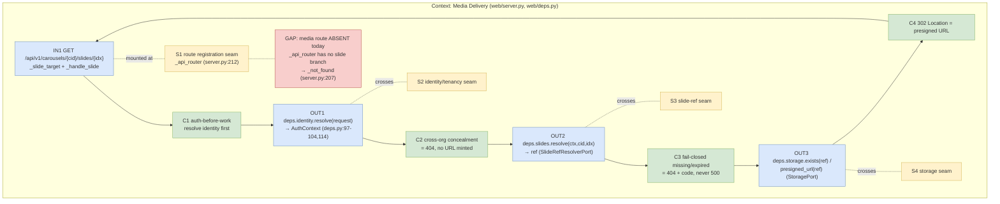
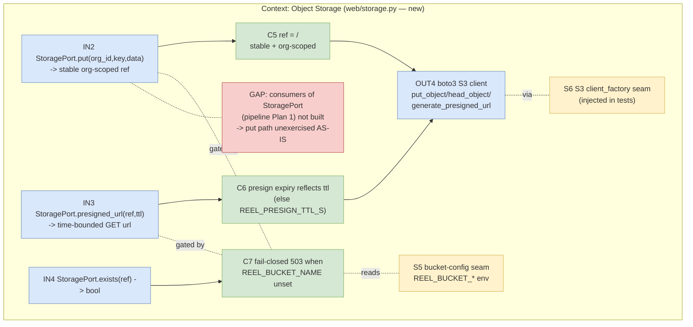
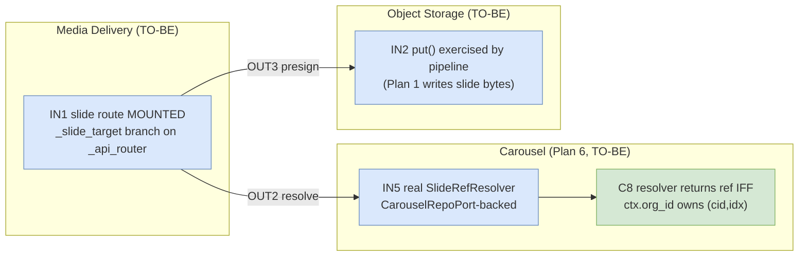
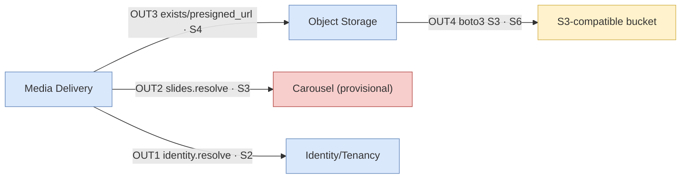

# Media Serving — StoragePort + Object-Storage Adapter (P0) — TDD Implementation Plan

## Overview

This is **Plan 3 of 6** for the carousel-image PRD
(`2026-07-11-prd-carousel-image-pipeline-and-research-handoff.md`), owning the **P0 hard
blocker** (PRD §4) and its acceptance criteria **ISC-46, ISC-47, ISC-48** plus OD-2
(object storage + presigned URLs).

Today generated media is **not browser-fetchable**: `web/server.py:89-102`
`_resolve_result_ref` returns a non-fetchable `cp-execution://<execution_id>/result/video_path`
placeholder when the control-plane result carries no real URL, and there is **no** file/image/
download route mounted on `_api_router` (`web/server.py:212-222`). The carousel viewer and
recreate loop (Plans 1/6) cannot show or replace images until media is servable.

This plan defines three things, in behavior order:

1. A **`StoragePort`** protocol (a typed seam in `web/deps.py`, alongside the existing
   `IdentityProvider` / `ReelJobRepoPort` / `UploadStorePort` / `ControlPlanePort` ports) —
   `put(org_id, key, data) -> ref`, `presigned_url(ref, ttl) -> url`, `exists(ref) -> bool`.
2. An **object-storage adapter** (`web/storage.py`, `ObjectStorage`) that mirrors the existing
   `BucketUploadStore` design (`web/uploads.py:87-146`): `REEL_BUCKET_*` env, lazy boto3 client,
   **org-scoped keys**, presigned GET URLs, fail-closed **503** when `REEL_BUCKET_NAME` is unset.
3. An **authed, org-scoped image-serving route** mounted on `_api_router`
   (`GET /api/v1/carousels/{cid}/slides/{idx}`) that resolves the slide's stored ref, verifies the
   caller's `org_id`, and **302-redirects to a presigned object-storage URL** — the BLOCKING
   workflow-closure behavior (auth + org-scope crossing the route boundary).

Plus a **fake in-memory `StoragePort`** in the web test harness that Plans 1 and 6 also consume in
their unit tests (see **Seam ownership**).

**What this plan does NOT build:** the carousel generation pipeline / `research_to_carousel`
(Plan 1), carousel CRUD routes / `CarouselRepoPort` persistence / the review UI (Plan 6), the
recreate loop (Plan 2), or research handoff (Plan 4). This plan **references** a minimal slide-ref
lookup seam (`SlideRefResolverPort`) whose real implementation is owned by Plan 6; here it is a
port + fake, and the route depends only on the port. See **Seam ownership** and the flag in
**Open Seams**.

## Current State Analysis

### Key Discoveries

- **No media route exists.** `_api_router` (`web/server.py:212-222`) matches exactly three
  shapes: `POST v1/uploads` (`_is_upload`, `server.py:46`), `POST v1/execute/async/<target>`
  (`_submit_target`, `server.py:50`), `GET v1/executions/<id>` (`_poll_id`, `server.py:57`);
  anything else falls to `_not_found()` (`server.py:207`). A new `GET v1/carousels/<cid>/slides/<idx>`
  predicate + handler must be added here.
- **Result refs are non-fetchable today.** `_resolve_result_ref` (`server.py:89-103`) only passes
  through a real URL if the CP result already carries `download_url`/`url`/`object_uri`; otherwise it
  emits `cp-execution://...`. This plan gives the pipeline a real presigned-URL producer so slide
  refs become fetchable (ISC-46).
- **`BucketUploadStore` is the adapter to mirror** (`web/uploads.py:87-146`): `_bucket()` reads
  `REEL_BUCKET_NAME` and raises `SchemaUnavailable` (503) if unset (`uploads.py:109-113`); `_client()`
  lazily builds a boto3 S3 client from `REEL_BUCKET_ENDPOINT` / `REEL_BUCKET_ACCESS_KEY_ID` /
  `REEL_BUCKET_SECRET_ACCESS_KEY` / `REEL_BUCKET_REGION` (`uploads.py:110-121`), injectable via
  `client_factory` for tests; `presign()` calls `generate_presigned_url("get_object", ...)` with
  `ExpiresIn=_presign_ttl_s()` (`uploads.py:138-146`); `_object_key(ctx, filename)` is
  `f"{ctx.org_id}/{uuid4().hex}-{safe}"` (`uploads.py:46-47`) — **org-scoped keys already the house
  convention.** `_presign_ttl_s()` reads `REEL_PRESIGN_TTL_S` (default 3600, `uploads.py:30-31`).
- **Typed-port + fail-closed pattern.** `web/deps.py:110-159` defines `@runtime_checkable`
  `Protocol` ports; `AppDeps` (`deps.py:201-210`) is the container; `default_deps()`
  (`deps.py:213-241`) builds import-safe real adapters (no I/O at construction, B1); `_Unconfigured`
  (`deps.py:185-195`) is the fail-closed placeholder pattern. `SchemaUnavailable`/`NotFound`/
  `Forbidden`/`BadRequest` typed errors carry their HTTP status (`deps.py:52-91`); the app
  error-handler maps them (`server.py:355-357`).
- **Auth/tenancy backbone to reuse (mandatory).** `deps.identity.resolve(request)` yields a
  server-trusted `AuthContext(user_id, org_id, role, supertokens_user_id)` (`deps.py:97-104,114`),
  never from the body. `RoleAccessGuard.authorize_reel_read(ctx, job)` (`deps.py:177-182`) is the
  **concealment precedent**: a foreign-org row raises `NotFound("job not found")` — **404, not 403**
  — so cross-org existence is concealed. The poll handler applies exactly this
  (`server.py:195-204`), and `tests/web/test_poll.py:41-57` asserts the 404/no-CP behavior. Image
  serving must conceal cross-org the same way (ISC-47).
- **`FORBIDDEN_IDENTITY_FIELDS`** (`reel_jobs.py:32-45`) reject client-supplied identity; the image
  GET route carries no body, so this is inherited by not accepting one (no identity input surface).
- **Test harness.** `tests/web/conftest.py` puts `web/` on `sys.path` and provides a fake for every
  port (`FakeIdentity`, `FakeReelJobRepo`, `FakeUploadStore`, `FakeControlPlane`, `FixedClock`) plus
  `make_deps(...)` and `make_ctx(role)`; `ORG_ID`/`USER_ID` are fixed UUIDs. Route tests build a
  client via `server.create_app(deps, enable_supertokens=False).test_client()`
  (`tests/web/test_poll.py:24-25`). Adapter-only tests use an injected fake S3 `client_factory`
  (`tests/web/test_bucket_upload.py:21-44`) — **no boto3/network**. This plan extends `conftest.py`
  with a `FakeStorage` (in-memory) + a `FakeSlideRefResolver`, and threads them through `make_deps`.
- **Closure precedent.** `tests/test_finish_closure.py` is the BLOCKING integration test in this
  repo: real mechanics, fakes only at true boundaries, fail-closed when infra absent (never
  skip-to-green). The image-route closure test follows this shape at the route level.

### Files that will be touched (declared blast radius)

- `web/deps.py` — add `StoragePort` + `SlideRefResolverPort` protocols; add `storage` + `slides` to
  `AppDeps`; wire both in `default_deps()`.
- `web/storage.py` — **new**; `ObjectStorage` adapter (mirrors `BucketUploadStore`).
- `web/server.py` — add a `GET v1/carousels/<cid>/slides/<idx>` route predicate + `_handle_slide`
  handler on `_api_router`.
- `tests/web/conftest.py` — add `FakeStorage`, `FakeSlideRefResolver`; extend `make_deps(...)`.
- `tests/web/test_storage.py` — **new**; adapter unit tests (fake S3 client_factory).
- `tests/web/test_slide_route.py` — **new**; route unit + closure tests (Flask client + fakes).
- `tests/web/integration/test_storage_smoke.py` — **new**; `@pytest.mark.integration` real-bucket
  smoke (not in default run).

## Desired End State

- `StoragePort` is a typed seam in `web/deps.py`; `AppDeps.storage` and `AppDeps.slides` exist and are
  wired by `default_deps()` (fail-closed until `REEL_BUCKET_NAME` / the Plan-6 resolver are configured).
- `ObjectStorage.put(org_id, key, data)` writes an **org-scoped** object and returns a stable
  **org-prefixed ref** (`<org_id>/<key>`, the S3 Key itself — parseable, not opaque; the org prefix is
  a load-bearing invariant callers/observability may read); `.presigned_url(ref, ttl)` returns a
  time-bounded GET URL; `.exists(ref)` reports presence;
  all three raise `SchemaUnavailable` (503) when `REEL_BUCKET_NAME` is unset.
- `GET /api/v1/carousels/<cid>/slides/<idx>` resolves the slide's stored ref via
  `deps.slides.resolve(ctx, cid, idx)`, **conceals cross-org as 404**, returns **404** for a
  missing/expired ref, and otherwise **302-redirects to a presigned URL** the browser fetches.
- A fake in-memory `StoragePort` exists in the harness for Plans 1/6 to reuse.

### Observable Behaviors

- ISC-46 — Given a carousel slide stored via `ObjectStorage.put`, when the browser hits the slide
  route, then it receives a **302** to a presigned object-storage URL that fetches the image bytes.
- ISC-47 — Given a slide owned by org A, when a caller from org B requests it, then the route returns
  **404** (concealed, exactly like reel reads) and **no presigned URL is minted**.
- ISC-48 — Given a slide whose ref is missing or whose object no longer exists (expired/deleted), when
  requested by its owner, then the route **fails closed with 404 + a clear error code**, never a 500
  or a leak of the underlying store error.
- LEAF — `StoragePort.put` returns a **stable** ref (same org+key → same ref; ref round-trips through
  `exists`/`presigned_url`).
- LEAF — `presigned_url(ref, ttl)` builds a URL whose expiry reflects `ttl` (time-bounded).
- LEAF — `ObjectStorage` refuses (**503**) on `put`/`presigned_url`/`exists` when `REEL_BUCKET_*`
  (specifically `REEL_BUCKET_NAME`) is unset (fail-closed).

## What We're NOT Doing

- No filesystem-streaming image route (OD-2 resolved to object storage + presigned URLs; the route
  redirects, it does not stream bytes through the app).
- No carousel generation, `research_to_carousel`, or the text→`Essence` seam (Plan 1).
- No carousel CRUD, carousel persistence table, `CarouselRepoPort`, finalize/cancel, or the review UI
  (Plan 6). This plan consumes a **`SlideRefResolverPort`** whose real implementation Plan 6 provides;
  here it is a port + fake.
- No recreate loop / HQ model / cost guard (Plan 2); no research handoff/provenance (Plan 4).
- No change to SuperTokens config, `FORBIDDEN_IDENTITY_FIELDS`, or the tenancy schema.
- No CDN/signed-cookie scheme; a single presigned GET URL per request is the contract.
- **`put` is last-write-wins on a stable ref** — the same `(org_id, key)` resolves to the same S3
  Key, so a second `put` with different bytes silently overwrites (intended for the slide-recreate
  flow, Plans 2/6). No conflict detection / versioning here.
- **Object lifecycle/expiry and `StoragePort.delete(ref)` are Plan 6.** Nothing in this slice
  deletes or expires objects (presigned-URL expiry ≠ object expiry). ISC-48's "expired/deleted"
  branch is exercised here only via the missing-object path (`FakeStorage(objects={})` + a
  resolvable ref), not via a real lifecycle rule.

## Testing Strategy

- **Framework:** `pytest` + `pytest-asyncio`; focused runs `uv run pytest tests/web/<file> -q`; lint
  `uv run ruff check web/ tests/web/`.
- **Unit — adapter (`test_storage.py`):** inject a **fake S3 `client_factory`** (mirrors
  `tests/web/test_bucket_upload.py:21-44`) — no boto3, no network. Cover put/presign/exists,
  org-scoped keys, stable refs, ttl-bounded URLs, and 503-when-unconfigured.
- **Unit — route (`test_slide_route.py`):** Flask test client + fakes (`FakeStorage`,
  `FakeSlideRefResolver`, `FakeIdentity`) via `make_deps`. Cover happy 302, cross-org 404, missing/
  expired 404, auth-before-work ordering.
- **Closure — route (`test_slide_route.py`, BLOCKING):** the real route → real access check → real
  `ObjectStorage.presigned_url` chain, driven through the production HTTP entrypoint (the mounted
  `/api/*` route), asserting the user-visible `302 Location`. Fakes only at the true boundary (S3
  `client_factory`, and the Plan-6 `SlideRefResolverPort`, both **outside** this slice's map).
- **Integration (`integration/test_storage_smoke.py`, `@pytest.mark.integration`):** a real
  `ObjectStorage` round-trip against a live `REEL_BUCKET_*` bucket. Marked `integration`, **not
  required** in the default run; **fail-closed** (does not skip-to-green) when the bucket is
  configured but unreachable.
- **Mocking/Setup:** fakes for all ports (harness); a fake boto3-shaped S3 client for the adapter;
  `monkeypatch` for `REEL_BUCKET_*` env; `ORG_ID`/`USER_ID` fixed UUIDs from `conftest.py`.

## Workflow Closure

Per §2.5 LEAF/BLOCKING classification. The **image-serving route** is the one BLOCKING behavior: its
user-visible OBSERVABLE (a 302 to a fetchable presigned URL for the *right* org) is reached across a
**cross-module + registration boundary** — the new route mounted on `_api_router` (`server.py:212`),
the `SlideRefResolverPort` (Plan-6 seam), and the `StoragePort` adapter. The three storage-adapter
behaviors and the two `StoragePort` contract behaviors are **LEAF** (same-module, synchronous,
directly observed input→output). Classifications are printed per behavior below.

### Production Operation Chain

`browser GET /api/v1/carousels/{cid}/slides/{idx}` → `create_app` `/api/<path>` route
(`server.py:347-353`) → `_api_router` (`server.py:212`) → `_slide_target` predicate (new) →
`_handle_slide` (new) → `deps.identity.resolve(request)` → `deps.slides.resolve(ctx, cid, idx)`
(org-scoped ref lookup; 404-conceals cross-org) → `deps.storage.exists(ref)` (404 if
missing/expired) → `deps.storage.presigned_url(ref, ttl)` → **`302 Location: <presigned url>`** →
browser GETs bytes from object storage.

### Closure Test: "the carousel owner's browser can fetch a slide image; another org cannot"   [BLOCKING: OBSERVABLE crosses the new `_api_router` registration + `SlideRefResolverPort`/`StoragePort` module boundaries]

- **SOURCE (seed only):** the slide-ref store behind `SlideRefResolverPort` (seed org A owns
  `(cid, idx) -> ref`) and the object store behind `StoragePort` (seed bytes at `ref`). These are the
  source-of-truth inputs the pipeline (Plan 1) will write; the test seeds them directly.
- **TRIGGER (start):** the mounted Flask route `GET /api/v1/carousels/<cid>/slides/<idx>` via the
  test client (`server.create_app(deps, enable_supertokens=False).test_client().get(url)`).
  boundary = `highest_new_connector` — the `_api_router` slide branch this slice adds (`server.py:212`);
  starting at the HTTP entrypoint crosses it.
- **DRIVERS (async edges):** none — the span is fully synchronous (request → resolve → exists →
  presign → redirect). No clock/driver seam required (framework §9: clock demanded IFF span async).
- **OBSERVE (assert via):** the HTTP response — `resp.status_code == 302` and
  `resp.headers["Location"]` is the presigned URL produced by the **real** `ObjectStorage.presigned_url`
  (the production read path the browser follows). For the cross-org case, `resp.status_code == 404`
  with the concealment error code and **`fake_s3.presign_calls == []`** (no URL minted).
- **FORBIDDEN SPAN:** `_handle_slide` internals, `deps.slides.resolve`, `deps.storage.exists`, and
  `ObjectStorage`'s private `_bucket`/`_client` — the test never calls, imports, or mocks any of them;
  it drives only the HTTP entrypoint and reads only the HTTP response. No raw store reads.
- **RED-AT-SEAM proof:** disable the registration — remove the `_slide_target` branch from
  `_api_router` (route falls to `_not_found()` → 404) — the owner-fetch assertion `status_code == 302`
  goes **red**. Re-add the branch → green. Record the transition.
- **DRIVABILITY:** store seam present (always) — `StoragePort` + `SlideRefResolverPort` are injected
  via `AppDeps`, seeded through their fakes; the real `ObjectStorage` uses an injected S3
  `client_factory` (boundary mock). Span is synchronous → no clock/driver seam needed. All required
  seams present → drivable.
- **EXECUTION (must run):** runs in the default `uv run pytest tests/web/test_slide_route.py` run with
  **no external infra** — the object boundary is the injected fake S3 client and the slide-ref boundary
  is `FakeSlideRefResolver`; both are always present, so the closure test **always executes** (never
  `skip`). The real-bucket variant lives in `integration/` behind `@pytest.mark.integration` and
  fails-closed (red) if a configured bucket is unreachable — it never skips-to-green.

---

## Behavior 1: `StoragePort.put` returns a stable, org-scoped ref   [LEAF]

**LEAF reason:** `ObjectStorage.put` and its ref are observed directly from the adapter's return value
in the same module; no async edge, no registration boundary.

### Test Specification

**Given** a configured `ObjectStorage` (fake S3 client), **when** `put(org_id, key, data)` is called,
**then** it writes the bytes under an **org-scoped** object key (`<org_id>/...`) and returns a stable
**org-prefixed** `ref` (= the object key; parseable `<org_id>/<key>`, not opaque) that round-trips
through `exists(ref)` and `presigned_url(ref, ...)`.

**Edge Cases:** same `(org_id, key)` twice yields the same ref (stable/idempotent addressing);
different orgs with the same `key` yield different refs (isolation); `data` accepts both `bytes` and a
path/file-like (mirror `BucketUploadStore.store`'s `upload_fileobj`).

**Property (input has a domain):** for all `(org_id, key)`, `ref = put(org_id, key, data)` implies
`ref` begins with `str(org_id) + "/"` and `exists(ref) is True` — an org never addresses another org's
namespace. Add as a Hypothesis test over random UUID orgs + key strings.

**Files touched:** `web/storage.py`, `web/deps.py`, `tests/web/test_storage.py`.

### 🔴 Red

**File:** `tests/web/test_storage.py`
```python
import uuid
import pytest
from storage import ObjectStorage
from deps import SchemaUnavailable

BUCKET = "reel-media-test"

class FakeS3:
    def __init__(self):
        self.objects: dict[tuple[str, str], bytes] = {}
        self.presign_calls: list = []
    def put_object(self, Bucket, Key, Body):            # noqa: N803
        self.objects[(Bucket, Key)] = Body if isinstance(Body, bytes) else Body.read()
    def head_object(self, Bucket, Key):                 # noqa: N803
        if (Bucket, Key) not in self.objects:
            from botocore.exceptions import ClientError  # boundary lib
            raise ClientError({"Error": {"Code": "404"}}, "HeadObject")
    def generate_presigned_url(self, op, Params, ExpiresIn):  # noqa: N803
        self.presign_calls.append((Params["Key"], ExpiresIn))
        return f"https://s3.example/{Params['Bucket']}/{Params['Key']}?X-Amz-Expires={ExpiresIn}"

def _store(monkeypatch, s3, *, configured=True):
    if configured:
        monkeypatch.setenv("REEL_BUCKET_NAME", BUCKET)
    else:
        monkeypatch.delenv("REEL_BUCKET_NAME", raising=False)
    return ObjectStorage(client_factory=lambda: s3)

def test_put_returns_org_scoped_stable_ref(monkeypatch):
    s3 = FakeS3(); store = _store(monkeypatch, s3)
    org = uuid.uuid4()
    ref = store.put(org, "carousel-1/slide-0.jpg", b"img-bytes")
    assert ref.startswith(f"{org}/")           # org-scoped
    assert store.exists(ref) is True           # round-trips
    assert store.put(org, "carousel-1/slide-0.jpg", b"img-bytes") == ref  # stable

def test_put_isolates_orgs_sharing_a_key(monkeypatch):
    s3 = FakeS3(); store = _store(monkeypatch, s3)
    a, b = uuid.uuid4(), uuid.uuid4()
    assert store.put(a, "c/s.jpg", b"x") != store.put(b, "c/s.jpg", b"x")
```

### 🟢 Green

**File:** `web/storage.py`
```python
"""Object-storage media adapter (P0). Mirrors uploads.BucketUploadStore: REEL_BUCKET_*
env, lazy boto3 client, org-scoped keys, presigned GET URLs, fail-closed 503."""
from __future__ import annotations
import os
from deps import BadRequest, NotFound, SchemaUnavailable

_DEFAULT_PRESIGN_TTL_S = 3600
_MEDIA_KEY_SEP = "/"

def _presign_ttl_s() -> int:
    return int(os.getenv("REEL_PRESIGN_TTL_S", str(_DEFAULT_PRESIGN_TTL_S)))

class ObjectStorage:
    """S3-compatible media store. `client_factory` is injectable for tests (no boto3)."""
    def __init__(self, client_factory=None):
        self._client_factory = client_factory

    def _bucket(self) -> str:
        name = os.getenv("REEL_BUCKET_NAME", "")
        if not name:
            raise SchemaUnavailable("media storage not configured (REEL_BUCKET_NAME)")
        return name

    def _client(self):
        if self._client_factory is not None:
            return self._client_factory()
        import boto3  # lazy: import stays side-effect-free (B1)
        return boto3.client(
            "s3",
            endpoint_url=os.getenv("REEL_BUCKET_ENDPOINT") or None,
            aws_access_key_id=os.getenv("REEL_BUCKET_ACCESS_KEY_ID") or None,
            aws_secret_access_key=os.getenv("REEL_BUCKET_SECRET_ACCESS_KEY") or None,
            region_name=os.getenv("REEL_BUCKET_REGION", "auto"),
        )

    def _ref(self, org_id, key: str) -> str:
        return f"{org_id}{_MEDIA_KEY_SEP}{key.lstrip(_MEDIA_KEY_SEP)}"

    def put(self, org_id, key: str, data) -> str:
        bucket = self._bucket()
        ref = self._ref(org_id, key)
        body = data if isinstance(data, (bytes, bytearray)) else data.read()
        self._client().put_object(Bucket=bucket, Key=ref, Body=body)
        return ref
```

### 🔵 Refactor

- [ ] **No duplication:** `_bucket()`, `_client()`, `_presign_ttl_s()` are lifted verbatim from
  `uploads.BucketUploadStore` conventions — extract the shared 4-env boto3 builder into a small
  `_s3_client_from_env(factory)` helper reused by both stores rather than copy-pasting the client
  block. (LLM copy-paste is the top regression; this removes it.)
- [ ] **Reveals intent:** `_ref` names the org-scoping rule once (`<org_id>/<key>`).
- [ ] **Fits existing patterns:** same `client_factory`/lazy-boto3/`SchemaUnavailable` shape as
  `uploads.py:99-146`; ref format matches `_object_key` org-prefix convention (`uploads.py:46-47`).

### Success Criteria

**Automated:**
- [ ] Red fails (no `storage` module): `uv run pytest tests/web/test_storage.py -q`
- [ ] Green passes: same command
- [ ] Property test green (Hypothesis over random orgs/keys)
- [ ] `uv run ruff check web/storage.py tests/web/test_storage.py` clean
- [ ] No new duplication: shared `_s3_client_from_env` used by both stores (grep confirms one boto3
  client block)

**Manual:**
- [ ] Ref is org-prefixed and stable; orgs sharing a key are isolated

---

## Behavior 2: `presigned_url` builds a time-bounded URL   [LEAF]

**LEAF reason:** the URL and its expiry are read directly off the adapter return value in-module; no
async/registration edge.

### Test Specification

**Given** a stored ref, **when** `presigned_url(ref, ttl)` is called, **then** it returns a GET URL
whose expiry reflects `ttl`; when `ttl` is omitted it uses `REEL_PRESIGN_TTL_S` (default 3600).

**Edge Cases:** explicit `ttl` overrides the env default; `REEL_PRESIGN_TTL_S` override is honored; an
empty/blank ref raises `BadRequest` (mirror `BucketUploadStore.presign` `uploads.py:143-146`, which
uses `code="missing_source"`). This adapter uses `code="missing_ref"` — an **intentional new code**
for the media-ref surface (a media ref is not an upload handle), not a copy error.

**Files touched:** `web/storage.py`, `tests/web/test_storage.py`.

### 🔴 Red

```python
def test_presigned_url_is_time_bounded(monkeypatch):
    s3 = FakeS3(); store = _store(monkeypatch, s3)
    url = store.presigned_url("org/c/s.jpg", ttl=120)
    assert url.endswith("X-Amz-Expires=120")
    assert s3.presign_calls[-1] == ("org/c/s.jpg", 120)

def test_presigned_url_defaults_to_env_ttl(monkeypatch):
    monkeypatch.setenv("REEL_PRESIGN_TTL_S", "900")
    store = _store(monkeypatch, FakeS3())
    assert store.presigned_url("org/c/s.jpg").endswith("X-Amz-Expires=900")

def test_presigned_url_empty_ref_is_400(monkeypatch):
    store = _store(monkeypatch, FakeS3())
    with pytest.raises(BadRequest):
        store.presigned_url("   ")
```

### 🟢 Green

```python
    def presigned_url(self, ref: str, ttl: int | None = None) -> str:
        bucket = self._bucket()
        if not isinstance(ref, str) or not ref.strip():
            raise BadRequest("missing media ref", code="missing_ref")
        expires = ttl if ttl is not None else _presign_ttl_s()
        return self._client().generate_presigned_url(
            "get_object",
            Params={"Bucket": bucket, "Key": ref.strip()},
            ExpiresIn=expires,
        )
```

### 🔵 Refactor

- [ ] **No duplication:** the `generate_presigned_url("get_object", ...)` call is identical to
  `uploads.BucketUploadStore.presign` (`uploads.py:142-146`) — fold both onto the shared client helper;
  keep only the ttl-resolution (`ttl is not None`) here.
- [ ] **Complexity down:** one branch (`ttl is not None`), no nested conditionals.

### Success Criteria

**Automated:**
- [ ] ttl/default/empty-ref tests pass: `uv run pytest tests/web/test_storage.py -k presigned -q`
- [ ] ruff clean

**Manual:**
- [ ] URL expiry visibly reflects the requested ttl

---

## Behavior 3: adapter fails closed (503) when `REEL_BUCKET_*` unset   [LEAF]

**LEAF reason:** the 503 is raised and observed in-module before any I/O; no async/registration edge.

### Test Specification

**Given** `REEL_BUCKET_NAME` is unset, **when** `put` / `presigned_url` / `exists` is called, **then**
each raises `SchemaUnavailable` (503) and touches no client — mirroring
`test_bucket_upload.py:76-85` fail-closed behavior.

**Property:** for all three methods, unset bucket ⇒ `SchemaUnavailable` before the fake client records
any call.

**Files touched:** `web/storage.py`, `tests/web/test_storage.py`.

### 🔴 Red

```python
@pytest.mark.parametrize("call", [
    lambda s: s.put(uuid.uuid4(), "c/s.jpg", b"x"),
    lambda s: s.presigned_url("org/c/s.jpg"),
    lambda s: s.exists("org/c/s.jpg"),
])
def test_unconfigured_is_503(monkeypatch, call):
    s3 = FakeS3(); store = _store(monkeypatch, s3, configured=False)
    with pytest.raises(SchemaUnavailable):
        call(store)
    assert s3.objects == {} and s3.presign_calls == []
```

### 🟢 Green

`put`/`presigned_url`/`exists` each call `self._bucket()` **first** (already true in Behaviors 1–2);
`exists`:
```python
    def exists(self, ref: str) -> bool:
        bucket = self._bucket()
        if not isinstance(ref, str) or not ref.strip():
            return False
        try:
            self._client().head_object(Bucket=bucket, Key=ref.strip())
            return True
        except Exception:            # boundary: any head_object miss/error → absent
            return False
```

### 🔵 Refactor

- [ ] **Reveals intent:** `_bucket()` is the single fail-closed gate; every public method calls it
  first — no scattered `getenv` checks.
- [ ] **No shallow catch leak:** `exists` swallows the boundary `ClientError` into `False` but does
  **not** swallow `SchemaUnavailable` (raised before the client call) — order matters; assert both.

### Success Criteria

**Automated:**
- [ ] All-methods-503 param test passes; no client calls recorded
- [ ] `uv run pytest tests/web/test_storage.py -q` green; ruff clean

**Manual:**
- [ ] With no bucket env, the service denies (503) rather than leaking

---

## Behavior 4: `StoragePort` seam + `AppDeps` wiring   [LEAF]

**LEAF reason:** protocol conformance + container wiring are verified by direct `isinstance`/attribute
assertions in-module; no async/registration edge.

### Test Specification

**Given** the port definitions, **when** `ObjectStorage()` and the `FakeStorage` are checked, **then**
both satisfy `isinstance(x, StoragePort)` (`@runtime_checkable`), and `default_deps()` populates
`AppDeps.storage` (an `ObjectStorage`) and `AppDeps.slides` (fail-closed until Plan 6 wires the real
resolver) without any I/O at construction (B1).

**Files touched:** `web/deps.py`, `tests/web/test_storage.py`, `tests/web/conftest.py`.

### 🔴 Red

```python
from deps import StoragePort, SlideRefResolverPort, default_deps, AppDeps
from storage import ObjectStorage

def test_object_storage_satisfies_port():
    assert isinstance(ObjectStorage(), StoragePort)

def test_default_deps_wires_storage_no_io(monkeypatch):
    monkeypatch.setenv("REEL_BUCKET_NAME", "b")
    deps = default_deps()               # must not connect/network at build
    assert isinstance(deps, AppDeps)
    assert isinstance(deps.storage, StoragePort)
    assert deps.slides is not None      # fail-closed placeholder until Plan 6
```

### 🟢 Green

**File:** `web/deps.py` (additions alongside existing ports)
```python
@runtime_checkable
class StoragePort(Protocol):
    # put: idempotent-addressed — same (org_id, key) always returns the same
    #   org-prefixed ref (`<org_id>/<key>`). last-write-wins on bytes (see NOT-Doing).
    def put(self, org_id, key: str, data) -> str: ...
    # presigned_url: ttl None -> REEL_PRESIGN_TTL_S (default 3600). blank ref -> BadRequest(400).
    def presigned_url(self, ref: str, ttl: int | None = None) -> str: ...
    # exists: True IFF the object is present; boundary errors collapse to False (never raise).
    def exists(self, ref: str) -> bool: ...
    # NOTE: `delete(ref)` is intentionally absent — Plan 6 forward-extension (cleanup).

@runtime_checkable
class SlideRefResolverPort(Protocol):
    # Plan 6 provides the real (carousel-backed) resolver. Returns the stored media
    # ref for (cid, idx) IFF it belongs to ctx.org_id; raises NotFound (404) to
    # conceal cross-org / absent, mirroring RoleAccessGuard.authorize_reel_read.
    def resolve(self, ctx: AuthContext, carousel_id: str, slide_idx: int) -> str: ...
```
Add `storage: StoragePort` and `slides: SlideRefResolverPort` to `AppDeps`; in `default_deps()`:
```python
    from storage import ObjectStorage
    ...
    storage=ObjectStorage(),   # 503 until REEL_BUCKET_NAME configured
    slides=_Unconfigured(SchemaUnavailable, "slide resolver not configured (Plan 6)"),
```

### 🔵 Refactor

- [ ] **Fits existing patterns:** ports use `@runtime_checkable Protocol` like
  `deps.py:110-159`; `_Unconfigured` reuses the established fail-closed placeholder (`deps.py:185-195`)
  — no new placeholder style.
- [ ] **No I/O at construction:** `ObjectStorage()` builds no client (lazy `_client`); assert via the
  no-network test.

### Success Criteria

**Automated:**
- [ ] Port conformance + `default_deps` wiring tests pass
- [ ] `uv run pytest tests/web/test_storage.py -q` green; ruff clean

**Manual:**
- [ ] `AppDeps` has `storage` + `slides`; import of `deps`/`storage` performs no network

---

## Behavior 5: authed, org-scoped image-serving route   [BLOCKING]

**BLOCKING reason:** the user-visible result (a 302 to a fetchable presigned URL for the correct org)
is reached across the new `_api_router` registration and the `SlideRefResolverPort`/`StoragePort`
module boundaries. This is the Closure Test above; the unit tests below are Tier-2 support and cannot
by themselves close ISC-46/47/48.

### Test Specification

**Given** an authenticated caller and a slide owned by their org, **when** `GET
/api/v1/carousels/<cid>/slides/<idx>`, **then** the route returns **302** with `Location` = a presigned
URL (ISC-46). **Given** a slide owned by another org, **then** **404**, concealed, no URL minted
(ISC-47). **Given** a missing/expired ref, **then** **404 + clear error code**, never 500 (ISC-48).

**Edge Cases:** no session → **401** before any resolve/storage call (auth-before-work, mirroring
`test_poll.py:34-39`); non-integer `<idx>` → **404** (unknown route, `_not_found`); the route accepts
**no body** so no `FORBIDDEN_IDENTITY_FIELDS` surface.

**Files touched:** `web/server.py`, `tests/web/test_slide_route.py`, `tests/web/conftest.py`.

### 🔴 Red

**File:** `tests/web/test_slide_route.py`
```python
import uuid
import server
from conftest import ORG_ID, USER_ID, make_ctx, make_deps, FakeIdentity, FakeStorage, FakeSlideRefResolver
from deps import Unauthorized, NotFound

CID = "car_1"
def _url(idx=0): return f"/api/v1/carousels/{CID}/slides/{idx}"
def _client(deps): return server.create_app(deps, enable_supertokens=False).test_client()

def test_owner_fetch_redirects_to_presigned_url():                 # ISC-46
    storage = FakeStorage(objects={"ref-0": b"img"})
    slides = FakeSlideRefResolver({(ORG_ID, CID, 0): "ref-0"})
    deps = make_deps(identity=FakeIdentity(make_ctx()), storage=storage, slides=slides)
    resp = _client(deps).get(_url(0))
    assert resp.status_code == 302
    assert resp.headers["Location"] == storage.presigned_for("ref-0")

def test_cross_org_fetch_is_404_and_mints_no_url():                # ISC-47
    storage = FakeStorage(objects={"ref-0": b"img"})
    slides = FakeSlideRefResolver({(ORG_ID, CID, 0): "ref-0"})     # owned by ORG_ID
    other = make_ctx(); object.__setattr__(other, "org_id", uuid.uuid4())
    deps = make_deps(identity=FakeIdentity(other), storage=storage, slides=slides)
    assert _client(deps).get(_url(0)).status_code == 404
    assert storage.presign_calls == []                              # concealed, nothing minted

def test_missing_or_expired_ref_is_404_not_500():                  # ISC-48
    storage = FakeStorage(objects={})                               # ref resolves but object gone
    slides = FakeSlideRefResolver({(ORG_ID, CID, 0): "ref-gone"})
    deps = make_deps(identity=FakeIdentity(make_ctx()), storage=storage, slides=slides)
    resp = _client(deps).get(_url(0))
    assert resp.status_code == 404
    assert resp.get_json()["code"]  # clear error code, not a bare 500

def test_no_session_is_401_before_storage():
    storage = FakeStorage(objects={"ref-0": b"img"})
    deps = make_deps(identity=FakeIdentity(error=Unauthorized("no session")), storage=storage,
                     slides=FakeSlideRefResolver({(ORG_ID, CID, 0): "ref-0"}))
    assert _client(deps).get(_url(0)).status_code == 401
    assert storage.presign_calls == []
```

**Closure Test (BLOCKING)** — same file, driving the real chain with the real `ObjectStorage`
(fake S3 `client_factory` at the boundary) and asserting the 302 `Location`; plus the red-at-seam
proof (branch removed → owner fetch 404). See **Workflow Closure** for the full derived anchors.

### 🟢 Green

**File:** `web/server.py`
```python
_SLIDE_RE = re.compile(r"^v1/carousels/([^/]+)/slides/(\d+)$")

def _slide_target(method: str, sub: str) -> tuple[str, int] | None:
    if method != "GET":
        return None
    m = _SLIDE_RE.match(sub)
    return (m.group(1), int(m.group(2))) if m else None

def _handle_slide(deps: AppDeps, carousel_id: str, slide_idx: int) -> tuple[Response, int]:
    ctx = deps.identity.resolve(request)                       # 401 / 403 / 503 first
    ref = deps.slides.resolve(ctx, carousel_id, slide_idx)     # 404 conceals cross-org/absent
    if not deps.storage.exists(ref):
        raise NotFound("slide image not found")                # 404, fail-closed (ISC-48)
    url = deps.storage.presigned_url(ref)
    return redirect(url), 302   # single 302: tuple status, matching sibling (Response,int) handlers
```
Wire into `_api_router` **before** `_not_found`:
```python
    slide = _slide_target(method, subpath)
    if slide is not None:
        return _handle_slide(deps, *slide)
```
(`NotFound`/`SchemaUnavailable` map to 404/503 via the existing `HttpError` handler,
`server.py:355-357`.)

### 🔵 Refactor

- [ ] **No duplication:** `_slide_target` follows the exact pure-predicate shape of `_submit_target`/
  `_poll_id` (`server.py:50-61`) — regex at module scope, method guard, no I/O.
- [ ] **Reveals intent:** `_handle_slide` reads top-to-bottom as auth → resolve → exist → presign →
  redirect; concealment lives in `deps.slides.resolve` (Plan 6), not smeared into the handler.
- [ ] **Fits existing patterns:** auth-before-work + typed-error mapping match `_handle_poll`
  (`server.py:195-204`); 404-concealment matches `RoleAccessGuard.authorize_reel_read`
  (`deps.py:177-179`).
- [ ] **No shallow wrapper:** the handler is the real org-scope + fail-closed gate, not a pass-through.

### Success Criteria

**Automated:**
- [ ] Red: unit tests fail (no route) — `uv run pytest tests/web/test_slide_route.py -q`
- [ ] Green: 302 / cross-org-404 / missing-404 / 401-before-storage all pass
- [ ] **Closure test executes** (not skipped) and passes; **red-at-seam** recorded (remove
  `_slide_target` branch → owner fetch red → re-add → green)
- [ ] `uv run pytest tests/web -q` full web suite green (no regression to submit/poll/upload)
- [ ] `uv run ruff check web/server.py tests/web/test_slide_route.py` clean
- [ ] No new duplication: `_slide_target` shares the predicate style; no copied auth block (grep)

**Manual:**
- [ ] In a browser with a valid session, the slide URL 302s and the image renders
- [ ] A cross-org URL shows 404, indistinguishable from a non-existent carousel

---

## Harness additions (support for this plan and Plans 1/6)

**File:** `tests/web/conftest.py` — add and thread through `make_deps(...)`:

```python
class FakeStorage:
    """In-memory StoragePort for unit tests. Plans 1 and 6 reuse this in their tests."""
    def __init__(self, objects: dict | None = None):
        self._objects = dict(objects or {})
        self.presign_calls: list = []
    def put(self, org_id, key, data) -> str:
        ref = f"{org_id}/{key.lstrip('/')}"
        self._objects[ref] = data if isinstance(data, (bytes, bytearray)) else data.read()
        return ref
    def presigned_url(self, ref, ttl=None) -> str:
        self.presign_calls.append((ref, ttl))
        return self.presigned_for(ref)
    def presigned_for(self, ref) -> str:
        return f"https://fake-store/{ref}?sig=test"
    def exists(self, ref) -> bool:
        return ref in self._objects

class FakeSlideRefResolver:
    """Stub SlideRefResolverPort; real impl is Plan 6's carousel-backed resolver."""
    def __init__(self, refs: dict | None = None):     # {(org_id, cid, idx): ref}
        self._refs = dict(refs or {})
    def resolve(self, ctx, carousel_id, slide_idx) -> str:
        ref = self._refs.get((ctx.org_id, carousel_id, slide_idx))
        if ref is None:
            raise NotFound("slide not found")          # conceal cross-org + absent (404)
        return ref
```
`make_deps(..., storage=None, slides=None)` defaults to `FakeStorage()` / a `FakeSlideRefResolver({})`
and passes them into the `AppDeps(...)` container.

**Seam ownership note (avoid cross-plan drift):**
- **This plan (3) defines** `StoragePort`, `ObjectStorage`, `FakeStorage`, the
  `GET .../slides/<idx>` route, and the `SlideRefResolverPort` port + `FakeSlideRefResolver`.
- **Plans 1 and 6 consume `FakeStorage`** in their unit tests (Plan 1: `research_to_carousel` writes
  slide bytes via a `StoragePort`; Plan 6: carousel routes / review UI reference stored refs). They do
  **not** redefine `StoragePort` or re-implement `ObjectStorage`.
- **Plan 6 provides the real `SlideRefResolverPort`** (carousel-backed, `CarouselRepoPort` lookup).
  Until then, `default_deps().slides` is a fail-closed `_Unconfigured` placeholder; the route is
  wired but 503s in prod until Plan 6 lands (documented, not a leak).
- **`StoragePort.delete(ref)` is a deliberate forward-extension owned by Plan 6** (cleanup). Plan 3
  defines only `put`/`presigned_url`/`exists`; Plan 6 *extends*, never *redefines*, the port. Its
  silence here is intentional so Plan 6 does not re-author the surface.
- **Concealment is test-verified now / prod-active at Plan 6.** Because `slides` is `_Unconfigured`
  today, the resolver fails first and **prod returns 503 for every slide request** — before any org
  check — so ISC-47's cross-org **404-concealment cannot be observed in prod yet**. It is verified
  now via `FakeSlideRefResolver` in `test_slide_route.py` and becomes prod-active when Plan 6 wires
  the real resolver. Do not mistake the interim 503 for the concealment path (see the `deny.reason`
  observability dimensions).
- **This plan does not rename `IdentityProvider`** (`deps.py:110`, the one existing non-`Port` port).
  The `…Port` suffix applies to new ports only; the mixed naming predates this slice and is out of
  scope.

## Integration & E2E Testing

- **Integration (`tests/web/integration/test_storage_smoke.py`, `@pytest.mark.integration`):** with a
  real `REEL_BUCKET_*` bucket, `put` a small object, `exists` → True, `presigned_url` → GET the URL →
  bytes match. **Not** in the default run; **fail-closed** (red) if a configured bucket is unreachable
  — never skip-to-green (closure §4 rule 6).
- **E2E (manual, deploy):** on Railway with `REEL_BUCKET_*` set, a real carousel (once Plans 1/6 land)
  renders slides in the browser via 302→presigned; a cross-org URL 404s.

## References

- PRD: `thoughts/searchable/shared/plans/2026-07-11-prd-carousel-image-pipeline-and-research-handoff.md`
  (§4 P0, §7 ISC-46/47/48, OD-2, §11 Plan 3 + Seam ownership)
- House-style plan mirrored:
  `thoughts/searchable/shared/plans/2026-07-10-tdd-video-ingest-youtube-vimeo.md`
- Closure framework: `~/.claude/commands/references/closure-test-framework.md`
- Adapter to mirror: `web/uploads.py:30-31,46-47,87-146` (`BucketUploadStore`)
- Ports + container + fail-closed: `web/deps.py:97-104,110-159,177-182,185-195,201-241`
- Route mounting + non-fetchable placeholder + auth-before-work:
  `web/server.py:46-61,89-103,195-204,207-222,347-357`
- Identity rejection: `web/reel_jobs.py:32-45`
- Test harness + patterns: `tests/web/conftest.py`; `tests/web/test_bucket_upload.py:21-105`;
  `tests/web/test_poll.py:24-57`
- Closure precedent: `tests/test_finish_closure.py`

---

## System Map

Bounded-context System Map for the media-serving slice this plan builds. Definitions:
**Seam (S#)** = a boundary where control/data crosses between contexts;
**IN#/OUT#** = inbound / outbound port on a boundary;
**EV#** = a domain event emitted across a seam (with schema);
**C#** = a contract (invariant + pre/postconditions on a named target);
**Grammar** = EBNF defining the syntax of each interface/event/contract.

Two bounded contexts are in-slice; a third is a *provisional* neighbor:

- **Media Delivery** (AS-IS, owned here) — the authed, org-scoped image-serving route
  (`web/server.py`) and its wiring to the storage + slide-ref ports (`web/deps.py`).
- **Object Storage** (AS-IS, owned here) — the `ObjectStorage` adapter (`web/storage.py`,
  new) behind `StoragePort`, mirroring `BucketUploadStore` (`web/uploads.py:87-146`).
- **Carousel** (`provisional` — reason: not built in this plan; only its outbound seam
  `SlideRefResolverPort` is defined here as a port + fake. The real carousel-backed
  resolver + persistence is owned by Plan 6. Drawn as a `gap` node because in this slice
  it is a fail-closed `_Unconfigured` placeholder in `default_deps()`, `deps.py:185-195`.)

Two boundaries are marked `gap` on the AS-IS maps because they are, by design, incomplete
in this slice: (1) the **SlideRefResolver fail-closed placeholder** (503s in prod until
Plan 6), and (2) the **currently-absent media route** — `_api_router` (`server.py:212-222`)
matches only `uploads`/`execute`/`executions` today; the slide branch does not yet exist,
so all media requests fall to `_not_found()` (`server.py:207`). The **Target (TO-BE)**
subsections show these boundaries closed.

### Context 1 — Media Delivery (AS-IS)

**(a) Boundary diagram**



**(b) EBNF grammar** (each ID ↔ exactly one entry)

```ebnf
(* interfaces *)
IN1   = "GET" , "/api/v1/carousels/" , cid , "/slides/" , idx ;
        (* cid = segment ; idx = digit+ ; matched by _SLIDE_RE, handled by _handle_slide *)
OUT1  = "deps.identity.resolve(" , request , ")" ;      (* -> AuthContext(user_id,org_id,role) *)
OUT2  = "deps.slides.resolve(" , ctx , "," , cid , "," , idx , ")" ;   (* -> ref | raises NotFound *)
OUT3  = "deps.storage.exists(" , ref , ")"
      | "deps.storage.presigned_url(" , ref , ")" ;     (* -> bool | url *)

(* contracts: target named *)
C1 = target IN1 :
     invariant  "identity resolved before any slide/storage call" ;
     pre        "request reaches _handle_slide" ;
     post       "no session -> 401 before OUT2/OUT3 (test_poll.py:34-39 precedent)" ;
C2 = target OUT2 :
     invariant  "a ref is returned IFF it belongs to ctx.org_id" ;
     pre        "ctx.org_id != owner_org OR (cid,idx) absent" ;
     post       "raises NotFound => 404, OUT3 never called, no presign_calls" ;
C3 = target OUT3 :
     invariant  "resolvable ref whose object is gone fails closed" ;
     pre        "exists(ref) is False" ;
     post       "raises NotFound => 404 + error code, never 500/leak" ;
C4 = target IN1 :
     invariant  "success is a redirect, not a byte stream" ;
     pre        "exists(ref) is True" ;
     post       "302 with Location = deps.storage.presigned_url(ref)" ;

(* seams *)
S1 = "_api_router slide branch" , mount , "server.py:212" ;   (* GAP1: absent AS-IS *)
S2 = "identity/tenancy boundary" , "deps.py:97-104,114" ;
S3 = "slide-ref boundary" , "SlideRefResolverPort" ;
S4 = "storage boundary" , "StoragePort / web/storage.py" ;
GAP1 = "no slide predicate on _api_router" , "server.py:207-222" ;
```

**(c) Seam table**

| Seam | Crossing interfaces | Contracts | Notes |
|---|---|---|---|
| **S1** route registration | IN1 (in) | C4 | `server.py:212`. **GAP1**: branch absent AS-IS → `_not_found` (`server.py:207`) |
| **S2** identity/tenancy | OUT1 (out) | C1 | `deps.identity.resolve`; server-trusted `AuthContext`, never from body |
| **S3** slide-ref | OUT2 (out) | C2 | `SlideRefResolverPort.resolve`; 404-conceals cross-org (Plan 6 real impl) |
| **S4** storage | OUT3 (out) | C3, C4 | `StoragePort.exists`/`presigned_url` |

### Context 2 — Object Storage (AS-IS)

**(a) Boundary diagram**



**(b) EBNF grammar**

```ebnf
(* interfaces *)
IN2  = "put(" , org_id , "," , key , "," , data , ")" ;      (* -> ref = <org_id> "/" key *)
IN3  = "presigned_url(" , ref , [ "," , ttl ] , ")" ;        (* -> https url w/ X-Amz-Expires *)
IN4  = "exists(" , ref , ")" ;                                (* -> bool *)
OUT4 = "put_object" | "head_object" | 'generate_presigned_url("get_object",...)' ;
       (* boundary S3 client; injected via client_factory in tests *)

(* contracts: target named *)
C5 = target IN2 :
     invariant  "ref always begins with str(org_id) + '/'" ;
     pre        "REEL_BUCKET_NAME set (else C7)" ;
     post       "same (org_id,key) -> same ref; round-trips via exists/presigned_url" ;
C6 = target IN3 :
     invariant  "presigned URL is time-bounded" ;
     pre        "ref non-empty (else BadRequest 400)" ;
     post       "ExpiresIn = ttl if given else _presign_ttl_s() (default 3600)" ;
C7 = target IN2, IN3, IN4 :
     invariant  "no I/O when unconfigured" ;
     pre        "REEL_BUCKET_NAME unset" ;
     post       "raise SchemaUnavailable(503) before any client call" ;

(* seams *)
S5 = "bucket-config" , "REEL_BUCKET_NAME/ENDPOINT/*_KEY/REGION + REEL_PRESIGN_TTL_S" ;
S6 = "S3 client_factory" , "lazy boto3 (uploads.py:110-121 mirror)" ;
GAP2 = "no StoragePort.put caller AS-IS" , "pipeline = Plan 1" ;
```

**(c) Seam table**

| Seam | Crossing interfaces | Contracts | Notes |
|---|---|---|---|
| **S5** bucket-config | IN2, IN3, IN4 (in) | C7 | `_bucket()` reads `REEL_BUCKET_NAME`; single fail-closed gate |
| **S6** S3 client_factory | OUT4 (out) | C5, C6 | lazy boto3; injected fake S3 in tests (no network) |

*GAP2* is drawn because AS-IS no caller writes via `put` (the pipeline is Plan 1); the
`FakeStorage` in the harness and Plan 1's tests are the only `put` exercisers until then.

### Target (TO-BE)

The TO-BE map closes both `gap` boundaries this slice + Plan 6 remove:



- **Closes GAP1**: IN1's `_slide_target` branch is registered on `_api_router` (this plan's
  Behavior 5) → media requests route instead of 404-ing.
- **Closes the Carousel `gap`**: Plan 6 replaces the `_Unconfigured` placeholder with a real
  `CarouselRepoPort`-backed resolver (new contract **C8**, target IN5), lifting the prod 503.
- **Closes GAP2**: Plan 1's pipeline calls `StoragePort.put`, exercising the write path.

### INDEX

**Context roster**

| Context | Status | Owner | Key files |
|---|---|---|---|
| Media Delivery | AS-IS (this plan) | Plan 3 | `web/server.py`, `web/deps.py` |
| Object Storage | AS-IS (this plan) | Plan 3 | `web/storage.py` (new), mirrors `web/uploads.py:87-146` |
| Carousel | `provisional` (port only) | Plan 6 | `SlideRefResolverPort` (`web/deps.py`); real impl later |

**Context-map diagram (context → context)**



**Gap / risk register**

| Gap | Where | Risk | Resolution |
|---|---|---|---|
| GAP1 media route absent | `_api_router` `server.py:207-222` | media unfetchable (P0 blocker) | This plan Behavior 5 mounts `_slide_target` |
| Carousel `gap` (fail-closed) | `default_deps().slides` `deps.py:185-195` | route 503s in prod until Plan 6 | Plan 6 real resolver (C8); documented, not a leak |
| GAP2 no `put` caller | Object Storage | write path unexercised AS-IS | Plan 1 pipeline calls `StoragePort.put` |
| Cross-org leak risk | S3 (OUT2) | 403-vs-404 divergence would leak existence | C2 enforces 404-concealment (mirrors `deps.py:177-179`) |

**Acceptance self-check** (reported):
- Diagram IDs ↔ grammar entries 1:1 — IN1–IN4, OUT1–OUT4, C1–C7, S1–S6, GAP1–GAP2 each
  resolve to exactly one entry both ways. **Orphans: none.** (C8/IN5/T_* are Target-only,
  scoped to the labeled TO-BE section and not counted against AS-IS 1:1.)
- Every contract names its target: C1→IN1, C2→OUT2, C3→OUT3, C4→IN1, C5→IN2, C6→IN3,
  C7→IN2/IN3/IN4, C8→IN5. Pass.
- Every seam enumerates crossings: S1–S6 tabled with interfaces + contracts. Pass.
- Every context has diagram + grammar + seam table. Pass.
- Every violated/missing boundary marked `gap` (GAP1, GAP2, Carousel node), not prose-only. Pass.
- Provisional boundary (Carousel) labeled with reason. Pass.

---

## Observability (wide events / OTel)

Honeycomb principle applied to this slice: **one wide span per unit of work**, high
dimensionality, questions asked at **query time**, high cardinality (object key, org_id)
is *valuable* not costly, and **every attribute is a BubbleUp dimension**. Instrument for
the 3am question — *"why can't users see carousel images?"* — whose answer lives in the
cross-org-deny (404) and fail-closed dimensions below, not in an aggregate error count.

The unit of work is one `GET /api/v1/carousels/{cid}/slides/{idx}`. That request emits one
root span (`media.serve`) with two storage child spans (`storage.presign`, and — on the
write path Plan 1 drives — `storage.put`). Each span is flat and wide.

### Span: `media.serve` (route span — the production operation chain)

Covers `_handle_slide`: identity.resolve → slides.resolve → storage.exists → presigned_url → 302.

| Group | Attributes |
|---|---|
| **WHO** | `org_id` *(high-card)*, `user_id` / `created_by` *(high-card)*, `requester.role`, `auth.resolved` (bool) |
| **WHAT** | `carousel_id` *(high-card)*, `slide_idx`, `media.ref` *(high-card — the object key)*, `http.route`, `http.method` |
| **WHERE/state** | `identity.latency_ms`, `slide_resolve.latency_ms`, `storage.exists.latency_ms`, `presign.latency_ms`, `storage.backend` (object-storage), `ref.present` (bool), `object.present` (bool), `bucket.configured` (bool — `REEL_BUCKET_NAME` set?), `resolver.configured` (bool — Plan 6 wired vs `_Unconfigured`) |
| **decision** | `deny.reason` ∈ {`none`,`no_session`,`cross_org`,`missing_ref`,`expired_object`,`unconfigured`}, `concealed` (bool — cross-org served as 404), `url_minted` (bool) |
| **outcome** | `http.status_code` ∈ {302,401,404,503}, `error.type`, `error.code`, `duration_ms` |

**3am dimensions to flag (BubbleUp targets):**
- `deny.reason=cross_org` + `concealed=true` + `url_minted=false` — answers *"is org B being
  correctly denied?"* (ISC-47). Cross-org denials look like 404s to the client; only this
  dimension distinguishes an authorization deny from a genuinely absent slide.
- `deny.reason=unconfigured` + `resolver.configured=false` — the **fail-closed 503**: the
  Plan-6 `_Unconfigured` slide resolver (or unset `REEL_BUCKET_NAME`). This is the single
  dimension that answers *"images broke everywhere at once → is a config/env gap the cause?"*
  Filter `bucket.configured=false OR resolver.configured=false` and the 3am mystery resolves.
- `deny.reason ∈ {missing_ref, expired_object}` + `object.present=false` — ISC-48 fail-closed
  404; distinguishes an expired/deleted object from a cross-org deny without leaking either.

**High-cardinality fields (valuable, keep raw):** `org_id`, `media.ref` (object key),
`carousel_id`, `user_id`. GROUP BY `org_id` isolates a single-tenant outage; BubbleUp on
`media.ref` finds a single poisoned/expired object. These are columns, not new time series.

### Span: `storage.presign` (StoragePort.presigned_url child)

| Group | Attributes |
|---|---|
| WHO | `org_id` *(high-card, parsed from the org-prefixed ref `<org_id>/<key>` — a supported read, since the ref is parseable by contract, not opaque)* |
| WHAT | `bucket`, `media.ref` *(high-card, = object key)*, `presign.ttl_s` (resolved ttl), `ttl.source` ∈ {`explicit`,`env_default`} |
| WHERE/state | `presign.latency_ms`, `bucket.configured` (bool) |
| outcome | `presigned` (bool), `error.type` (e.g. `BadRequest` empty-ref, `SchemaUnavailable` unconfigured), `http.status_hint` ∈ {200,400,503} |

Emphasis: `bucket.configured=false → SchemaUnavailable` is the **fail-closed** dimension —
a presign attempt with no bucket must show `error.type=SchemaUnavailable` and never a minted URL.

### Span: `storage.put` (StoragePort.put child — write path, Plan 1 driver)

| Group | Attributes |
|---|---|
| WHO | `org_id` *(high-card)* |
| WHAT | `bucket`, `media.key` (input key), `media.ref` *(high-card — computed `<org_id>/<key>`)*, `body.bytes` (size) |
| WHERE/state | `put.latency_ms`, `storage.backend`, `bucket.configured` (bool), `ref.org_scoped` (bool — ref starts with `<org_id>/`, the C5 invariant) |
| outcome | `stored` (bool), `ref.stable` (bool — idempotent re-put yields same ref), `error.type`, `http.status_hint` ∈ {200,503} |

**Cross-cutting:** trace context links `storage.presign`/`storage.put` to their parent
`media.serve` (or Plan-1 pipeline) span, so a slow presign or an org-scope violation
(`ref.org_scoped=false`) is one trace away from the user-visible outcome — the core analysis
loop (Define → Visualize → Investigate via BubbleUp → Evaluate) runs entirely on these
dimensions with no new deploy.

---

## Review Applied (2026-07-11)

Amendments from `2026-07-11-tdd-03-media-serving-storageport-REVIEW.md` (0 critical · 7 warnings;
"Ready for Implementation — minor revision recommended"). All were clarity/coherence warnings; none
blocked implementation. Changes, per review item:

1. **Contracts ⚠️ — `StoragePort.delete` gap:** Added a Seam-ownership line naming `delete(ref)` as a
   deliberate Plan-6 forward-extension (Plan 6 *extends*, never *redefines* the port), plus a
   `# NOTE:` in the `StoragePort` Protocol. (§Harness Seam-ownership note; Behavior 4 Green.)
2. **Promises ⚠️ — `put` overwrite semantics + object lifecycle:** Added to §What We're NOT Doing —
   `put` is **last-write-wins** on a stable ref; object lifecycle/expiry + `delete` are Plan 6;
   ISC-48's "expired" branch is exercised only via the missing-object path here. Idempotency +
   ttl-default contracts also inlined into the `StoragePort` Protocol docstrings.
3. **Interfaces ⚠️ — redundant double-status redirect:** Behavior 5 Green changed
   `return redirect(url, code=302), 302` → `return redirect(url), 302` (single 302, tuple status,
   matching sibling `(Response, int)` handlers and the `_api_router` annotation).
4. **Interfaces ⚠️ — `IdentityProvider` non-rename:** Seam-ownership note states this plan does not
   rename the one existing non-`Port` port; `…Port` suffix applies to new ports only.
5. **APIs ⚠️ — interim-503 vs concealment framing:** Seam-ownership note now states ISC-47's
   404-concealment is **test-verified now (FakeSlideRefResolver) / prod-active at Plan 6**; until then
   prod 503s on every slide request (resolver `_Unconfigured`, before the org check).
6. **Data Models ⚠️ — "opaque" vs parseable ref:** Reframed "stable opaque ref" → **"org-prefixed
   ref"** (parseable `<org_id>/<key>`, org prefix load-bearing) in Desired End State, Behavior 1, and
   the `storage.presign` observability WHO row — resolving the tension with the `org_id`-from-prefix
   derivation (kept, now consistent).
7. **Minor line-drift / code divergence (non-blocking):** Corrected `_bucket()` citation
   `uploads.py:104-108` → `:109-113`; noted the adapter's `code="missing_ref"` is an intentional new
   error code (vs `BucketUploadStore`'s `missing_source`, `uploads.py:143-146`), not a copy error.

**Not applied / review response:** The BLOCKING image-route closure test (§Workflow Closure,
Behavior 5) was judged sound by the review and is unchanged. No review item was rejected — all seven
were adopted; the redirect fix was resolved to the `redirect(url), 302` form (rather than the bare
`redirect(url, code=302)` alternative) to keep the handler's `(Response, int)` shape aligned with
`_api_router` and `_handle_poll`.
