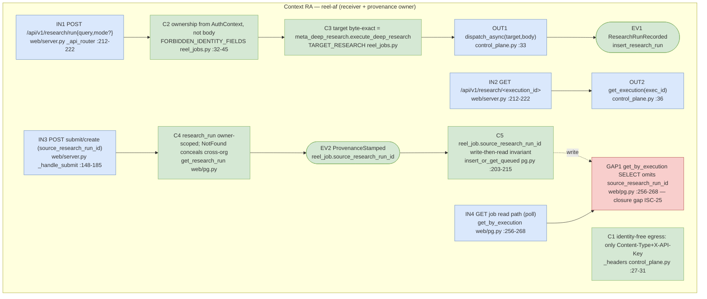
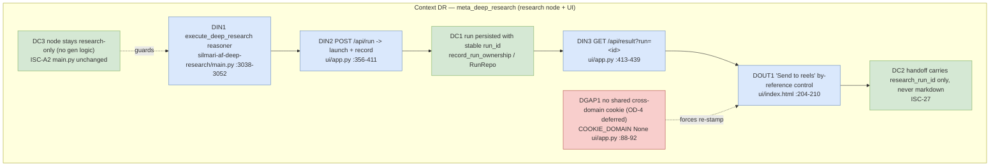
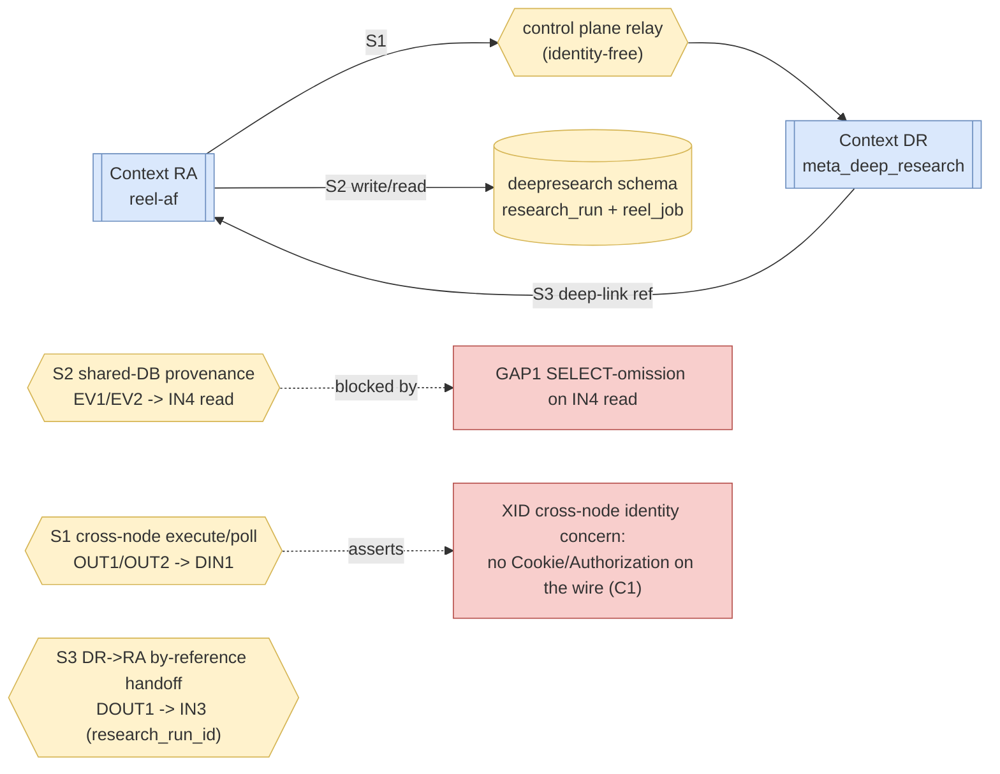
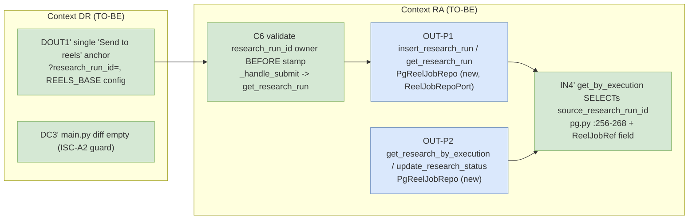

# Cross-Node Research Handoff + Research Provenance — TDD Implementation Plan

## Overview

This is **Plan 4 of 6** for the PRD
`2026-07-11-prd-carousel-image-pipeline-and-research-handoff.md`. It owns the seam where
`reel-af` reaches across to the `meta_deep_research` node, records the completed research run as a
`research_run` row, and stamps `reel_job.source_research_run_id` so every carousel/video created
from research carries a durable back-reference to the research that produced it. It also owns the
deep-research-side **"Send to reels"** control, which hands off **by `research_run_id` reference**,
never by shipping a giant query/markdown string across the wire.

The behaviors are all observable at HTTP/DB boundaries and are testable with the existing Flask
test client + fakes, plus one `integration`-marked Postgres contract test.

**ISCs covered (7):** ISC-22, ISC-23, ISC-24, ISC-25, ISC-26, ISC-27, ISC-A2 (anti).

The guiding constraints are the two backbone invariants already enforced in the codebase:

1. **Identity-free cross-node.** The control plane and the `reel-af`/`meta_deep_research` nodes stay
   identity-free; the UI service is the tenancy boundary. `HttpControlPlane._headers`
   (`web/control_plane.py:27-31`) injects only `Content-Type` + `X-API-Key` — no `Cookie`/
   `Authorization` is ever forwarded. New research routes must keep that invariant (ISC-A2 anti-leak,
   and the sibling PRD ISC-A3).
2. **Ownership stamped from the server-trusted `AuthContext`, never the body.** `_handle_submit`
   (`web/server.py:148-185`) resolves `AuthContext` via `deps.identity.resolve(request)` and rejects
   `FORBIDDEN_IDENTITY_FIELDS` (`web/reel_jobs.py:32-45`). Research provenance follows the same rule:
   the caller supplies a `research_run_id`, but `org_id`/`created_by` on both the `research_run` and
   the stamped `reel_job` come only from the resolved context.

## Current State Analysis

### reel-af side (receiver, provenance owner)

- **Provenance is pre-plumbed but dead.** `ReelSubmission.source_research_run_id: uuid.UUID | None`
  exists (`web/reel_jobs.py:52`), and all three `build_submission` return branches hardcode
  `source_research_run_id=None` (`reel_jobs.py:129-137`, `:151-159`, `:165-174`). The DB write
  `insert_or_get_queued` already binds `submission.source_research_run_id` into the
  `deepresearch.reel_job` INSERT (`web/pg.py:203-215`) — but since the submission field is always
  `None`, the column always receives `NULL`.
- **No reader surfaces the column.** `PgReelJobRepo.get_by_execution` (`web/pg.py:256-268`) selects
  `id, org_id, created_by, status, execution_id, result_ref, completed_at` — it does **not** select
  `source_research_run_id`. There is no read path that returns the stamped provenance today. **This
  is the closure gap** for ISC-25.
- **`research_run` table exists in the readiness gate but is never written or read.** `REQUIRED_SCHEMA`
  asserts `deepresearch.research_run` has `{id, org_id, created_by, status}` (`web/pg.py:40`) and
  `reel_job` has `source_research_run_id` (`web/pg.py:41-46`); the service raises `SchemaUnavailable`
  at startup if absent. But no SQL in `pg.py` inserts into or selects from `research_run`. **There is
  no `insert_research_run` / `get_research_run` today** — Plan 4 adds them.
- **Allowlist gate.** `ALLOWLISTED_TARGETS = frozenset({TARGET_TOPIC, TARGET_COMPOSITE})`
  (`web/reel_jobs.py:26`); `TARGET_ARTICLE = "reel-af.reel_article_to_reel"` is defined but excluded
  (`reel_jobs.py:23`). **`meta_deep_research.execute_deep_research` is not an allowlisted target** —
  the research dispatch route must permit it. This is **shared config** touched by Plans 4/5/6 (see
  Seam flags).
- **Dispatch/poll plumbing to reuse.** `HttpControlPlane.dispatch_async(target, body)` and
  `get_execution(execution_id)` return `(status, body, headers)` 3-tuples
  (`web/control_plane.py:33-37`). `ControlPlanePort` protocol at `web/deps.py:146-149`.
  `_handle_poll` (`web/server.py:195-204`) shows the reconcile pattern: resolve identity → fetch
  owned job → authorize read → `get_execution` → `_normalize_execution_status` → persist. Routes are
  dispatched by a single catch-all `@app.route("/api/<path:subpath>")` → `_api_router`
  (`web/server.py:212-222`, mounted at `:347-353`).

### deep-research side (push button, by-reference handoff)

- **DR already persists runs and hands off by `run_id`.** `POST /api/run` (`ui/app.py:356-411`) calls
  `deps.launch(body)` → `ControlPlaneLaunch{run_id, root_execution_id, ...}`, then
  `record_run_ownership(...)` persists to a Postgres `RunRepo` (`ResearchRunRepository`), and returns
  `LaunchRunDTO{run_id, root_execution_id, created_at, status, node, reasoner, params}`. `GET
  /api/result?run=<id>` (`ui/app.py:413-439`) looks up by `run_id` and returns
  `{status, run_id, params, markdown, html, sources, ...}`. **A completed research run already has a
  stable `run_id`** — the handoff reference exists; DR does not need to ship markdown.
- **DR result view is a single-page app.** `ui/index.html` is the only UI; the result renders into
  `#viewer` in `poll()` (`ui/index.html:184-221`), and the only existing action is a `⭳ markdown`
  download link (`:204-210`). The status-line `<div>` with `margin-left:auto` (`:204`) is the
  insertion point for a **"Send to reels"** control (ISC-26).
- **Cross-domain cookie is deferred (OD-4).** `COOKIE_DOMAIN` from `SESSION_COOKIE_DOMAIN`
  (`ui/app.py:88-92`) is `None` by default — a shared session across `research.*`/`reels.*` is
  impossible on `*.up.railway.app`. **This plan does not wire the shared cookie.** "Send to reels"
  deep-links to the reel-af Create-from-research screen carrying only `research_run_id`; the reel-af
  UI authenticates the user and **re-stamps** ownership from its own `AuthContext` (safe under both
  shared- and separate-domain outcomes). Building the reel-af re-stamp path is exactly ISC-24/25 in
  this plan.

### Test harness (grounded)

- **Flask test client via injected fakes.** `tests/web/conftest.py` puts `web/` on `sys.path`, and
  `make_deps(...)` builds a real `AppDeps` with `FakeIdentity(make_ctx())`, real `RoleAccessGuard()`,
  `FakeReelJobRepo()`, `FakeControlPlane()`, `FixedClock()`, fixed `uuid_factory`. Each test does
  `server.create_app(deps, enable_supertokens=False).test_client()`.
- **`FakeControlPlane`** records `dispatch_calls: list[(target, body)]` and `get_calls: list[exec_id]`
  and returns a canned `(status, body, headers)` 3-tuple; `set`-style seams exist for status/body.
  This directly supports asserting the research dispatch target + payload (ISC-22) and poll
  reconcile (ISC-23).
- **`FakeIdentity(make_ctx(role))`** returns a fixed `AuthContext` (`org_id=ORG_ID`,
  `user_id=USER_ID`); `make_ctx("member"|"admin"|"owner"|"viewer")` and a foreign-org context drive
  tenancy tests. `FakeIdentity(error=Unauthorized(...))` → 401.
- **Integration DB.** Marker declared in `pyproject.toml` `[tool.pytest.ini_options]`
  (`markers = ["integration: needs a live Postgres (TEST_DATABASE_URL); reel_job SQL contract
  tests"]`, `asyncio_mode="auto"`, `testpaths=["tests"]`). Integration tests set `pytestmark =
  pytest.mark.integration`, live in `tests/web/integration/`, and use a `db` fixture that
  `pytest.skip()`s unless `TEST_DATABASE_URL` is set, then recreates the `deepresearch` schema and
  `monkeypatch.setenv("DEEPRESEARCH_DATABASE_URL", ...)` so `PgReelJobRepo()` connects. Sample:
  `tests/web/integration/test_pg_reel_jobs.py`.
- **No `tests/web/test_research_handoff.py` exists** (confirmed). New unit tests go there; the
  Postgres SQL-contract test goes in `tests/web/integration/test_pg_research_run.py`.
- **Run:** `uv run --extra dev python -m pytest tests/ -q`; integration:
  `TEST_DATABASE_URL=postgres://... uv run --extra dev python -m pytest tests/ -m integration -q`.

## Desired End State

- reel-af exposes `POST /api/v1/research/run {query, mode?}` that dispatches
  `meta_deep_research.execute_deep_research` with **only `query` + the `ui/defaults.json` defaults**,
  records a `research_run` row owned by the caller's org, and returns `{research_run_id,
  execution_id}`.
- reel-af exposes `GET /api/v1/research/<execution_id>` that authorizes the caller against the owned
  `research_run`, polls the control plane, reconciles/persists status, and returns
  `{status, markdown, html, sources}` until terminal.
- A carousel/video created from research (the Plan 5/6 create path calling into `build_submission`)
  stamps `reel_job.source_research_run_id` from a caller-supplied `research_run_id` that is
  **validated to belong to the caller's org**, and that value is **readable via the job read path**.
- DR's result view shows exactly one **"Send to reels"** control that deep-links to reel-af carrying
  `research_run_id` only.
- No research or generation logic is added inside the `meta_deep_research` node (ISC-A2).

### Observable Behaviors

- Given a query, when `POST /api/v1/research/run` is called, then the control plane receives exactly
  one dispatch to target `meta_deep_research.execute_deep_research` with body
  `{"input": {"query": <q>, ...defaults}}` and **no identity headers**.
- Given a dispatched research run, when polled repeatedly, then reel-af returns the reconciled
  `{status, markdown, html, sources}` and a terminal status is surfaced unchanged.
- Given a completed research dispatch, when the run is recorded, then a `deepresearch.research_run`
  row exists with the caller's `org_id`/`created_by` and a status.
- Given a `research_run_id` owned by the caller, when a reel job is created from it, then
  `reel_job.source_research_run_id` equals that id **and is returned by the job read path**.
- Given a `research_run_id` owned by a different org, when a reel job create references it, then it is
  rejected (not stamped) — cross-org provenance is denied.
- Given the DR result view, when a completed run renders, then exactly one "Send to reels" control is
  present and its href/target carries `research_run_id`, not the markdown body.

## What We're NOT Doing

- **Not** building the Create-from-research UI screens / Automatic+Full-control modes — that is
  **Plan 5** (`2026-07-11-tdd-05-create-from-research.md`). Plan 5 calls the research routes this
  plan defines; we do not build its front-end.
- **Not** building the carousel pipeline, `research_to_carousel`, or `research_to_text/video`
  reasoners — Plan 1 (done). We stamp provenance onto whatever the create path submits.
- **Not** building the authed carousel CRUD routes / `CarouselRepoPort` — that is **Plan 6**.
- **Not** wiring a shared parent-domain SuperTokens cookie (OD-4, deferred). "Send to reels"
  deep-links by reference; reel-af re-stamps ownership.
- **Not** adding SSE consumption for staged progress (optional in PRD §6.1); polling is sufficient
  for terminal-status surfacing (ISC-23).
- **Not** adding research/generation logic to the `meta_deep_research` node (ISC-A2). DR changes are
  UI-only (one button).
- **Not** changing the SuperTokens/tenancy schema; we use the reserved `research_run` table and
  `reel_job.source_research_run_id` column that already exist in `REQUIRED_SCHEMA` (`web/pg.py:40-46`).

## Testing Strategy

- **Framework:** `pytest` (+ `pytest-asyncio`, `asyncio_mode="auto"`). Run
  `uv run --extra dev python -m pytest tests/ -q`.
- **Unit (default, no DB):** all reel-af route behaviors via `create_app(deps,
  enable_supertokens=False).test_client()` with `FakeControlPlane` + `FakeIdentity` +
  `FakeReelJobRepo` extended with a `research_run` store. New file
  `tests/web/test_research_handoff.py`.
- **Integration (`@pytest.mark.integration`, live Postgres):** the `research_run` INSERT/SELECT SQL
  contract and the round-trip that a stamped `source_research_run_id` is read back — new file
  `tests/web/integration/test_pg_research_run.py`, mirroring
  `tests/web/integration/test_pg_reel_jobs.py`'s `db`/`seed` fixtures.
- **DR side:** the "Send to reels" control is DOM/manual. A lightweight assertion (string/DOM check
  on `ui/index.html`) covers ISC-26/27; the interactive deep-link is a manual check.
- **Properties:** the dispatched research body's `input` always contains `query` and the full defaults
  keyset from `ui/defaults.json`; the dispatched target string is byte-exact
  `meta_deep_research.execute_deep_research`; dispatched headers never contain `Cookie`/`Authorization`.

## Workflow Closure

Two behaviors touch a "process A writes X so process B reads Y" seam and are therefore **BLOCKING**;
the rest are **LEAF** (same-module, synchronous, unit-observable) and are marked inline.

### Production Operation Chain (ISC-25, the blocking provenance closure)

`POST /api/v1/carousels (or reel submit) [create path, Plan 5/6 caller]
 -> build_submission(... source_research_run_id=<validated id>)  [web/reel_jobs.py]
 -> PgReelJobRepo.insert_or_get_queued  [writes deepresearch.reel_job.source_research_run_id, web/pg.py:203-215]
 -> control-plane dispatch (unchanged)
 -> GET job read path (get_by_execution / new provenance select)  [web/pg.py:256-268]
 -> {..., source_research_run_id} visible to the UI`

### Closure Test: "A reel job created from a research run reports that research run id on read." [BLOCKING: cross-process — a create/submit path writes `reel_job.source_research_run_id`; a *separate* read path (`get_by_execution`) must surface it. Today the writer binds it but the reader never selects it — the seam is broken and must be crossed by the test.]

- **SOURCE (seed only)**: a `deepresearch.research_run` row owned by the caller's org (seeded via the
  `research_run` insert path) + the caller `AuthContext`. No `reel_job` row seeded — the create path
  makes it.
- **TRIGGER (start)**: the reel submit/create HTTP route → `_handle_submit` (`web/server.py:148`) with
  a body carrying `source_research_run_id`, **or** the integration-level
  `PgReelJobRepo.insert_or_get_queued` for the SQL round-trip. Boundary = highest_new_connector (the
  new provenance-carrying `build_submission` branch + the new read select). Start at
  `insert_or_get_queued` for the integration SQL contract; start at the route for the unit closure.
- **DRIVERS (async edges)**: none. The write→read span is fully synchronous (two DB calls). No clock
  needed.
- **OBSERVE (assert via)**: the **job read path** — `PgReelJobRepo.get_by_execution` (extended to
  select `source_research_run_id`, `web/pg.py:256-268`) at the integration level; and the HTTP poll
  response body at the unit level. **Never** assert by re-SELECTing the column directly in the test —
  assert through the production reader.
- **FORBIDDEN SPAN**: the test must not call, seed, or mock `insert_or_get_queued`'s INSERT string,
  the reader's SELECT string, or hand-write the column — it drives the real write then the real read.
- **RED-AT-SEAM proof**: with the reader left as-is (not selecting `source_research_run_id`), the
  closure assertion `read.source_research_run_id == seeded_run_id` fails (reader returns no such
  attribute / `None`). Adding the column to the SELECT turns it green. Independently, leaving
  `build_submission` at hardcoded `None` also fails the assertion (stored `NULL`).
- **DRIVABILITY**: store seam present — `PgReelJobRepo` accepts a live connection via the integration
  `db` fixture (`DEEPRESEARCH_DATABASE_URL`); no async edge → no clock/driver required. Seam is
  present; no BLOCKING seam gap.
- **EXECUTION (must run)**: needs live Postgres. The integration `db` fixture provisions the
  `deepresearch` schema; when `TEST_DATABASE_URL` is unset the test **fails-closed via
  `pytest.skip()`** at the fixture (it does not silently pass) — matching the repo's existing
  integration convention. CI runs it when the DB env is present.

### Closure Test: "A research run dispatched through reel-af is recorded as a research_run row owned by the caller." [BLOCKING: the run-record write (`insert_research_run`) is a *new* connector between the dispatch route and the DB; a later read (`get_research_run`, used by the provenance-validation on create) is a separate process.]

- **SOURCE (seed only)**: the caller `AuthContext`; `FakeControlPlane` seeded to return an
  `execution_id`. No `research_run` row pre-seeded.
- **TRIGGER (start)**: `POST /api/v1/research/run` route handler (new, in `web/server.py`). Boundary =
  outermost entrypoint (crosses the new dispatch + new `insert_research_run` connector).
- **DRIVERS (async edges)**: none synchronous within the request; the research *completion* is
  external (control plane) and out of scope for the record-on-dispatch write. The row is recorded at
  dispatch time with an initial status, mirroring DR's `record_run_ownership` on `POST /api/run`.
- **OBSERVE (assert via)**: the provenance validation read used by the create path —
  `get_research_run(ctx, research_run_id)` (new) returns the row for the owning org and raises
  `NotFound` for a foreign org. At integration level, assert via that reader, not a raw SELECT.
- **FORBIDDEN SPAN**: the `insert_research_run` INSERT + `get_research_run` SELECT internals.
- **RED-AT-SEAM proof**: with `insert_research_run` not called by the route, `get_research_run(...)`
  raises `NotFound` after a dispatch — red. Wiring the insert into the route makes it green.
- **DRIVABILITY**: store seam present (integration `db` fixture / `FakeReelJobRepo`'s new
  `research_runs` dict for unit); no async edge. No seam gap.
- **EXECUTION (must run)**: unit closure runs with the fake store (no DB); the SQL contract runs under
  `@pytest.mark.integration` with the live-Postgres `db` fixture, fail-closed skip when unset.

**Registration / production callers.** Every new handler is reachable in production:
`_handle_research_run` and `_handle_research_poll` are dispatched from `_api_router`
(`web/server.py:212-222`) via new subpath matchers (`/api/v1/research/run`,
`/api/v1/research/<execution_id>`); `insert_research_run`/`get_research_run` are methods on
`PgReelJobRepo` wired through `default_deps().reel_jobs` (`web/deps.py:213-241`). Each is listed in
its behavior's `Files touched`.

---

## Behavior 1: reel-af dispatches deep-research with only-`query` + defaults (ISC-22)

### Test Specification

**Given** an authenticated caller and a query string,
**When** `POST /api/v1/research/run {"query": "<q>"}` is handled,
**Then** the control plane receives exactly one `dispatch_async` whose target is
`meta_deep_research.execute_deep_research` and whose body is `{"input": {"query": "<q>", ...defaults}}`
where the defaults are the `ui/defaults.json` one-click values.

**Edge Cases:** empty/whitespace `query` → 400; a caller-supplied `mode` overrides the default
`"general"`; identity fields in the body (`org_id`, etc.) are rejected (`FORBIDDEN_IDENTITY_FIELDS`);
extra unknown keys are dropped, not forwarded.

**Property (input domain):** for any non-empty query, the dispatched `input` dict always contains the
key `query` **and** the full defaults keyset (`research_focus, research_scope, max_research_loops,
num_parallel_streams, analysis_depth, source_strictness, tension_lens, mode, evidence_style`); the
target string is byte-exact.

**Files touched:** `web/server.py` (new `_handle_research_run`, `_research_run_target` matcher in
`_api_router`), `web/reel_jobs.py` (a `build_research_dispatch(body) -> (target, cp_body)` builder +
a `RESEARCH_DEFAULTS` constant sourced from the DR defaults + `TARGET_RESEARCH =
"meta_deep_research.execute_deep_research"`), `web/research_defaults.json` (mirror of the DR one-click
defaults so reel-af does not import across repos), `tests/web/test_research_handoff.py`.

**Defaults mirror — exclusions & drift note (§2 warning).** `web/research_defaults.json` mirrors
`ui/defaults.json` **except**: (1) `api_key` — **never** forwarded (secret-shaped; must not live in a
mirrored defaults file); (2) `model` — omitted (blank ⇒ DR server default). The property keyset is the
**9** non-secret keys (`research_focus, research_scope, max_research_loops, num_parallel_streams,
analysis_depth, source_strictness, tension_lens, mode, evidence_style`); `model`/`api_key` are
intentionally out. Align values to `ui/defaults.json` — note `num_parallel_streams` default is **2**
(not `3`, which the Green comment below illustrates loosely). Document both exclusions inline in the
JSON.

**Classification: BLOCKING** for the record-a-row half (covered by Behavior 3's closure); the
dispatch-shape assertion itself is **LEAF** (single synchronous route, observed via the fake CP call
log).

### TDD Cycle

#### 🔴 Red: Write Failing Test
**File**: `tests/web/test_research_handoff.py`
```python
import server
from conftest import make_deps, FakeIdentity, make_ctx, FakeControlPlane

RESEARCH_URL = "/api/v1/research/run"

def _client(deps):
    return server.create_app(deps, enable_supertokens=False).test_client()

def test_research_run_dispatches_only_query_plus_defaults():
    cp = FakeControlPlane(response=(202, {"execution_id": "exec_r1"}, {}))
    deps = make_deps(identity=FakeIdentity(make_ctx("member")), control_plane=cp)

    resp = _client(deps).post(RESEARCH_URL, json={"query": "  fusion startups  "})

    assert resp.status_code in (200, 202)
    assert len(cp.dispatch_calls) == 1
    target, body = cp.dispatch_calls[0]
    assert target == "meta_deep_research.execute_deep_research"
    assert body["input"]["query"] == "fusion startups"
    # full defaults keyset present
    for k in ("research_focus", "research_scope", "max_research_loops",
              "num_parallel_streams", "analysis_depth", "source_strictness",
              "tension_lens", "mode", "evidence_style"):
        assert k in body["input"]
    assert body["input"]["mode"] == "general"

def test_mode_override_and_empty_query_rejected():
    cp = FakeControlPlane(response=(202, {"execution_id": "exec_r2"}, {}))
    deps = make_deps(control_plane=cp)
    assert _client(deps).post(RESEARCH_URL, json={"query": "x", "mode": "bear"}) \
        .status_code in (200, 202)
    assert cp.dispatch_calls[-1][1]["input"]["mode"] == "bear"
    assert _client(deps).post(RESEARCH_URL, json={"query": "   "}).status_code == 400
```

#### 🟢 Green: Minimal Implementation
**File**: `web/reel_jobs.py`
```python
TARGET_RESEARCH = "meta_deep_research.execute_deep_research"

# Loaded once from web/research_defaults.json (mirror of DR ui/defaults.json one-click values).
RESEARCH_DEFAULTS = _load_research_defaults()  # 9 non-secret keys; num_parallel_streams=2, mode="general" (align to ui/defaults.json; no model/api_key)

def build_research_dispatch(raw_input: dict) -> tuple[str, dict]:
    body = raw_input or {}
    _reject_identity_fields(body)  # reuse FORBIDDEN_IDENTITY_FIELDS gate
    query = str(body.get("query", "")).strip()
    if not query:
        raise BadRequest("query is required")
    payload = {**RESEARCH_DEFAULTS, "query": query}
    if isinstance(body.get("mode"), str) and body["mode"].strip():
        payload["mode"] = body["mode"].strip()
    return TARGET_RESEARCH, {"input": payload}
```
**File**: `web/server.py`
```python
def _handle_research_run(deps, body):
    ctx = deps.identity.resolve(request)
    deps.access_guard.authorize_create(ctx)
    target, cp_body = build_research_dispatch(body)
    # ROW-FIRST (Behavior 3, CI-3): mint run_id → insert queued row (execution_id=None)
    # → dispatch → attach execution_id. Mirrors _handle_submit (server.py:157-195).
    # The dispatch call + record wiring is completed in Behavior 3 Green below; this stub
    # only shows the builder + auth. Do NOT dispatch-then-record (orphan-execution risk).
    ...
```
Add a `_research_run_target(method, subpath)` matcher in `_api_router` for
`POST /api/v1/research/run`. **Note the ordering constraint:** Behavior 3 Green replaces the `...`
with the row-first sequence — never dispatch before the `research_run` row exists.

#### 🔵 Refactor: Improve Code
**File**: `web/reel_jobs.py`, `web/server.py`
- [ ] **No duplication**: `_reject_identity_fields` is the *same* gate `build_submission` uses — extract
  it once, do not re-implement the `FORBIDDEN_IDENTITY_FIELDS` scan.
- [ ] **Reveals intent**: `build_research_dispatch` reads as "defaults, then query, then optional mode".
- [ ] **Complexity down**: defaults merged once via `{**RESEARCH_DEFAULTS, ...}`, no per-key branching.
- [ ] **No shallow wrappers**: `_handle_research_run` is thin by design (delegates to the builder +
  Behavior 3's record); the builder holds the logic.
- [ ] **Fits patterns**: mirrors `build_submission`/`_handle_submit` shape (`reel_jobs.py:129`,
  `server.py:148`).

### Success Criteria
**Automated:**
- [ ] Red fails (route/builder absent): `uv run --extra dev python -m pytest tests/web/test_research_handoff.py -q`
- [ ] Green passes the two tests above.
- [ ] `uv run --extra dev ruff check web/ tests/` clean on changed lines.

**Manual:**
- [ ] A real research query dispatched from reel-af reaches the DR node and returns an `execution_id`.

---

## Behavior 2: reel-af polls and surfaces research status until terminal (ISC-23)

### Test Specification

**Given** an authenticated caller who owns a research run with `execution_id`,
**When** `GET /api/v1/research/<execution_id>` is polled,
**Then** reel-af calls `control_plane.get_execution(execution_id)` once, reconciles the status, and
returns `{status, markdown, html, sources}`; when the control plane reports a terminal status
(`succeeded`/`failed`/`cancelled`) that status is surfaced unchanged.

**Edge Cases:** a running status returns `{status: "running"|"producing", ...}` with no terminal
side-effects; an `execution_id` the caller does not own → 404 (cross-org concealment, matching
`authorize_reel_read`); unknown `execution_id` at the control plane → propagated 404.

**Files touched:** `web/server.py` (new `_handle_research_poll` + `_research_poll_id` matcher in
`_api_router`), `web/reel_jobs.py` (reuse `_normalize_execution_status`; add a research-result shaper
that maps CP body `{markdown, html, sources}` through), `tests/web/conftest.py` (relies on the
`OTHER_ORG`/`OTHER_USER` constants + `seed_research_run`/`get_research_by_execution` added in Behavior 3
— CI-2), `tests/web/test_research_handoff.py`.

**Authorization scope (§5 warning — intentional).** `_handle_research_poll` resolves identity and does
an **org-scoped** `get_research_by_execution(ctx, ...)` (404-conceal on foreign/absent), but — unlike
`_handle_poll`, which adds a defense-in-depth `authorize_reel_read` (`server.py:206`) — it does **not**
call an authorize step. This is **by design**: there is no per-run role gate for research reads, and the
org-scoped query is the tenancy boundary. Stated explicitly so the asymmetry with reel poll is a
deliberate choice, not an omission. (A symmetric `authorize_research_read` may be added later if a
per-run role policy emerges.)

**Classification: LEAF** — a single synchronous route reading the injected `FakeControlPlane`; the
ownership lookup mirrors the already-tested `_handle_poll`. No async edge in the request path.

### TDD Cycle

#### 🔴 Red
**File**: `tests/web/test_research_handoff.py`
```python
def test_research_poll_reconciles_and_returns_document():
    cp = FakeControlPlane(response=(200, {
        "status": "succeeded",
        "result": {"markdown": "# R", "html": "<h1>R</h1>", "sources": [{"title": "S"}]},
    }, {}))
    deps = make_deps(control_plane=cp)
    # seed an owned research run keyed by execution_id (FakeReelJobRepo research store)
    deps.reel_jobs.seed_research_run(execution_id="exec_r1",
                                     org_id=make_ctx().org_id,
                                     created_by=make_ctx().user_id)
    resp = _client(deps).get("/api/v1/research/exec_r1")
    assert resp.status_code == 200
    j = resp.get_json()
    assert j["status"] == "succeeded"
    assert j["markdown"] == "# R" and j["html"] == "<h1>R</h1>"
    assert j["sources"] == [{"title": "S"}]
    assert cp.get_calls == ["exec_r1"]

def test_research_poll_foreign_run_is_404():
    from deps import AuthContext
    from conftest import OTHER_ORG, OTHER_USER
    cp = FakeControlPlane(response=(200, {"status": "running"}, {}))
    deps = make_deps(identity=FakeIdentity(AuthContext(
        user_id=OTHER_USER, org_id=OTHER_ORG, role="member",
        supertokens_user_id="st-2")), control_plane=cp)
    deps.reel_jobs.seed_research_run(execution_id="exec_r1",
                                     org_id=make_ctx().org_id, created_by=make_ctx().user_id)
    assert _client(deps).get("/api/v1/research/exec_r1").status_code == 404
```

#### 🟢 Green
**File**: `web/server.py`
```python
def _handle_research_poll(deps, execution_id):
    ctx = deps.identity.resolve(request)
    run = deps.reel_jobs.get_research_by_execution(ctx, execution_id)  # 404 if foreign/absent
    status, cp, _h = deps.control_plane.get_execution(execution_id)
    normalized = _normalize_execution_status(cp)
    # Reconcile by run_id (not execution_id); update_research_status is terminal-monotonic
    # (pg.py guard) so a late poll cannot downgrade a terminal run.
    deps.reel_jobs.update_research_status(ctx, run.id, status=normalized)
    return jsonify(_research_result_body(cp, normalized)), status
```
`_research_result_body` pulls `markdown/html/sources` from `cp["result"]` (empty defaults while
running). `get_research_by_execution` raises `NotFound` for a foreign/absent run (org-scoped).

#### 🔵 Refactor
- [ ] **No duplication**: `_normalize_execution_status` and the 404-on-foreign pattern are reused from
  `_handle_poll` (`server.py:195-204`) — do not fork them.
- [ ] **Reveals intent**: `_research_result_body` names the three surfaced keys once.
- [ ] **Complexity down**: no branching on running vs terminal beyond empty-vs-present result.
- [ ] **Fits patterns**: identical shape to reel poll.

### Success Criteria
**Automated:**
- [ ] Red fails (route/reader absent); Green passes both tests.
- [ ] Existing `tests/web/test_poll.py` unchanged and green (`_normalize_execution_status` reuse
  introduced no regression).
- [ ] `ruff check` clean.

**Manual:**
- [ ] Polling a real in-flight research run transitions from running → succeeded and returns the
  rendered markdown/html/sources.

---

## Behavior 3: A completed research run is persisted as a `research_run` row (ISC-24) — BLOCKING

### Readiness gate (CI-1 — MUST precede the write path)

**The 4-column "reserved" claim is only half true.** `REQUIRED_SCHEMA["research_run"]` today is
`{id, org_id, created_by, status}` (`web/pg.py:40`, confirmed) — but `insert_research_run` (Behavior 3
Green) writes **six** columns: `(id, org_id, created_by, execution_id, status, created_at)`. Because
`_assert_schema` (`web/pg.py:76-82`) only checks `REQUIRED_SCHEMA`, startup readiness **passes** even
when the root migration's `research_run` lacks `execution_id`/`created_at`, and the **first live INSERT
500s at request time** (undefined column) instead of failing-closed (503) at startup. Fix this first:

- [ ] **Extend `REQUIRED_SCHEMA["research_run"]`** (`web/pg.py:40`) from
  `{id, org_id, created_by, status}` to
  `{id, org_id, created_by, execution_id, status, created_at}` so `_assert_schema` fails-closed at
  startup if the columns the writer INSERTs are absent.
- [ ] **Root-migration dependency (Seam Flag).** `research_run.execution_id` (text, nullable) +
  `research_run.created_at` (timestamptz) are a **root-migration dependency**
  (`migrations/deepresearch/`) — reel-af *consumes* these columns, does not own the migration. Listed
  in Seam Flags so the migration and this plan stay coordinated.
- [ ] **Integration schema fixture must add the columns.** The existing fixture at
  `tests/web/integration/test_pg_reel_jobs.py:54-59` defines `research_run` with only
  `{id, org_id, created_by, status}` (confirmed). The new integration test's schema fixture
  (`tests/web/integration/test_pg_research_run.py`) MUST create `research_run` with
  `execution_id text` + `created_at timestamptz not null default now()` — otherwise the closure test
  cannot actually exercise the columns the writer binds and would pass vacuously.

### Test Specification

**Given** an authenticated caller,
**When** a research run is dispatched (Behavior 1) and recorded,
**Then** a `deepresearch.research_run` row exists with the caller's `org_id`/`created_by` and a
status, and `get_research_run(ctx, research_run_id)` returns it for the owning org while raising
`NotFound` for a foreign org.

**Edge Cases:** re-dispatch idempotency is out of scope (each dispatch records a run); a foreign-org
`get_research_run` conceals existence via `NotFound`.

**Files touched:** `web/pg.py` (new `insert_research_run(ctx, run_id, execution_id, status, now)` +
`get_research_run(ctx, run_id)` + `get_research_by_execution(ctx, execution_id)` +
`update_research_status(ctx, run_id, status=None, execution_id=None)` on `PgReelJobRepo`; new
`ResearchRunRef` dataclass with `execution_id`; **extend `REQUIRED_SCHEMA["research_run"]` at
`pg.py:40`** to `{id, org_id, created_by, execution_id, status, created_at}` — CI-1), `web/deps.py`
(**one consolidated edit** extending the `@runtime_checkable ReelJobRepoPort` protocol at `deps.py:128-135`
with all five new signatures + the extended `get_by_execution` return — §2 warning; referenced from
Behaviors 3 and 4), `web/server.py` (`_handle_research_run` records the row **row-first** and returns
`{research_run_id, execution_id}`), `tests/web/conftest.py` (`OTHER_ORG`/`OTHER_USER` constants +
`FakeReelJobRepo` gains `research_runs` dict, `seed_research_run` returning a `research_run_id`,
`get_research_run`, `get_research_by_execution`, `update_research_status` — CI-2; see the conftest
spec block below), `tests/web/integration/test_pg_research_run.py` (SQL contract + schema fixture with
`execution_id`/`created_at`).

**Test-harness spec (CI-2 — `tests/web/conftest.py`).** The plan's tests import symbols and call fake
methods that **do not exist today** (confirmed: conftest defines only `ORG_ID`/`USER_ID` at `:32-33`;
`FakeReelJobRepo.get_by_execution` returns a single fixed `self._job` ignoring `execution_id` at
`:96-101`). Add, in one conftest edit shared by Behaviors 2/3/4 (Plans 5/6 reuse it — see Seam Flags):
```python
OTHER_ORG = uuid.UUID("33333333-3333-3333-3333-333333333333")
OTHER_USER = uuid.UUID("44444444-4444-4444-4444-444444444444")

# --- FakeReelJobRepo additions (mirror ResearchRunRef / PgReelJobRepo semantics) ---
# In __init__:
#   self.research_runs: dict[uuid.UUID, ResearchRunRef] = {}   # keyed by research_run_id
#   self._runs_by_exec: dict[str, uuid.UUID] = {}              # execution_id -> run_id
#   self._jobs_by_exec: dict[str, ReelJobRef] = {}            # replaces single self._job

def seed_research_run(self, execution_id, org_id, created_by, status="succeeded"):
    rid = uuid.uuid4()
    self.research_runs[rid] = ResearchRunRef(
        id=rid, org_id=org_id, created_by=created_by, status=status,
        execution_id=execution_id)
    if execution_id is not None:
        self._runs_by_exec[execution_id] = rid
    return rid                                    # tests OBSERVE via this returned id

def insert_research_run(self, ctx, run_id, execution_id, status, now):
    self.research_runs[run_id] = ResearchRunRef(
        id=run_id, org_id=ctx.org_id, created_by=ctx.user_id,
        status=status, execution_id=execution_id)
    if execution_id is not None:
        self._runs_by_exec[execution_id] = run_id

def update_research_status(self, ctx, run_id, status=None, execution_id=None):
    r = self.research_runs.get(run_id)
    if r is None or r.org_id != ctx.org_id:
        return
    if r.status in ("succeeded", "failed", "cancelled"):   # terminal monotonicity
        return
    self.research_runs[run_id] = ResearchRunRef(
        id=r.id, org_id=r.org_id, created_by=r.created_by,
        status=status or r.status, execution_id=execution_id or r.execution_id)
    if execution_id is not None:
        self._runs_by_exec[execution_id] = run_id

def get_research_run(self, ctx, run_id):
    r = self.research_runs.get(run_id)
    if r is None or r.org_id != ctx.org_id:
        raise NotFound("research run not found")            # conceal cross-org
    return r

def get_research_by_execution(self, ctx, execution_id):
    rid = self._runs_by_exec.get(execution_id)
    r = self.research_runs.get(rid) if rid else None
    if r is None or r.org_id != ctx.org_id:
        raise NotFound("research run not found")            # conceal foreign/absent
    return r

# get_by_execution: key on execution_id AND surface source_research_run_id (Behavior 4)
def get_by_execution(self, ctx, execution_id):
    if self._get_error is not None:
        raise self._get_error
    job = self._jobs_by_exec.get(execution_id) or self._job
    if job is None or job.org_id != ctx.org_id:
        raise NotFound("job not found")
    return job                                              # carries source_research_run_id
```
`insert_or_get_queued`/`attach_execution_id` on the fake are extended to populate `self._jobs_by_exec`
keyed by the attached `execution_id`, and to thread `submission.source_research_run_id` onto the stored
`ReelJobRef` (Behavior 4) — so the unit read-back genuinely surfaces the column rather than passing
vacuously (§6 warning).

**Classification: BLOCKING** — a dispatch-time write (`insert_research_run`) is a new connector, and
a separate process (create-path provenance validation) reads it via `get_research_run`. Closure Test
#2 above governs this.

### TDD Cycle

#### 🔴 Red (unit, fake store)
**File**: `tests/web/test_research_handoff.py`
```python
def test_research_run_records_owned_row_and_returns_ids():
    cp = FakeControlPlane(response=(202, {"execution_id": "exec_r9"}, {}))
    deps = make_deps(control_plane=cp)
    resp = _client(deps).post(RESEARCH_URL, json={"query": "grid storage"})
    body = resp.get_json()
    rid = body["research_run_id"]
    assert body["execution_id"] == "exec_r9"
    # OBSERVE via the production reader, not the store internals
    run = deps.reel_jobs.get_research_run(make_ctx(), rid)
    assert run.org_id == make_ctx().org_id and run.created_by == make_ctx().user_id
```

#### 🔴 Red (integration, live Postgres — SQL contract + closure)
**File**: `tests/web/integration/test_pg_research_run.py`
```python
import uuid, pytest
pytestmark = pytest.mark.integration

def test_insert_research_run_is_owner_scoped_and_readable(seed, db):
    from pg import PgReelJobRepo
    org_id, user_id = seed
    repo, ctx = PgReelJobRepo(), _ctx(org_id, user_id)
    rid = uuid.uuid4()
    # ROW-FIRST: insert with execution_id=None, then attach via update_research_status.
    repo.insert_research_run(ctx, rid, None, "queued", NOW)
    repo.update_research_status(ctx, rid, execution_id="exec_r9")
    got = repo.get_research_run(ctx, rid)
    assert got.org_id == org_id and got.created_by == user_id
    assert got.execution_id == "exec_r9"                  # attach round-trips
    # resolvable by execution_id (Behavior 2 poll path)
    assert repo.get_research_by_execution(ctx, "exec_r9").id == rid
    with pytest.raises(NotFound):
        repo.get_research_run(_ctx(OTHER_ORG, OTHER_USER), rid)

def test_update_research_status_is_terminal_monotonic(seed, db):
    from pg import PgReelJobRepo
    org_id, user_id = seed
    repo, ctx = PgReelJobRepo(), _ctx(org_id, user_id)
    rid = uuid.uuid4()
    repo.insert_research_run(ctx, rid, "exec_t", "succeeded", NOW)  # terminal
    repo.update_research_status(ctx, rid, status="running")         # late poll — no-op
    assert repo.get_research_run(ctx, rid).status == "succeeded"    # not downgraded
```
The integration schema fixture in this file MUST declare `research_run` with the columns the writer
binds (CI-1): `execution_id text` + `created_at timestamptz not null default now()` in addition to
`{id, org_id, created_by, status}` — otherwise these tests error on an undefined column.

#### 🟢 Green
**`ResearchRunRef` shape (explicit — CI-1/§4 warning).** `insert_research_run` writes `execution_id`
and `created_at`, and Behavior 2's poll resolves a run **by `execution_id`** — so the ref MUST carry
`execution_id`, not just the 4 core columns:
```python
@dataclass(frozen=True)
class ResearchRunRef:
    id: uuid.UUID
    org_id: uuid.UUID
    created_by: uuid.UUID
    status: str
    execution_id: str | None = None
```
**File**: `web/pg.py`
```python
def insert_research_run(self, ctx, run_id, execution_id, status, now):
    # ROW-FIRST: execution_id may be None at insert (dispatch not yet attempted).
    with self._conn() as conn, conn.cursor() as cur:
        cur.execute(
            "insert into deepresearch.research_run "
            "(id, org_id, created_by, execution_id, status, created_at) "
            "values (%s,%s,%s,%s,%s,%s)",
            (run_id, ctx.org_id, ctx.user_id, execution_id, status, now),
        )

def update_research_status(self, ctx, run_id, status=None, execution_id=None):
    # Terminal monotonicity: never downgrade a terminal run (mirrors update_from_execution
    # pg.py:271-283). Attach execution_id only when supplied. Org-scoped.
    with self._conn() as conn, conn.cursor() as cur:
        cur.execute(
            "update deepresearch.research_run set "
            "status = coalesce(%s, status), "
            "execution_id = coalesce(%s, execution_id) "
            "where id=%s and org_id=%s "
            "and status not in ('succeeded','failed','cancelled')",
            (status, execution_id, run_id, ctx.org_id),
        )

def get_research_run(self, ctx, run_id):
    with self._conn() as conn, conn.cursor() as cur:
        cur.execute(
            "select id, org_id, created_by, status, execution_id "
            "from deepresearch.research_run where id=%s and org_id=%s",
            (run_id, ctx.org_id),
        )
        row = cur.fetchone()
    if row is None:
        raise NotFound("research run not found")  # conceal cross-org existence
    return ResearchRunRef(*row)

def get_research_by_execution(self, ctx, execution_id):
    with self._conn() as conn, conn.cursor() as cur:
        cur.execute(
            "select id, org_id, created_by, status, execution_id "
            "from deepresearch.research_run where execution_id=%s and org_id=%s",
            (execution_id, ctx.org_id),
        )
        row = cur.fetchone()
    if row is None:
        raise NotFound("research run not found")  # conceal foreign/absent
    return ResearchRunRef(*row)
```
**`_handle_research_run` — ROW-FIRST ordering (CI-3, mirrors `_handle_submit` `server.py:157-195`).**
Persist the row **before** dispatch so a crash mid-request leaves a recoverable `queued` row (not an
orphan CP execution). The old dispatch-then-record ordering is **rejected**:
```python
def _handle_research_run(deps, body):
    ctx = deps.identity.resolve(request)
    deps.access_guard.authorize_create(ctx)
    target, cp_body = build_research_dispatch(body)          # 400 on empty/forbidden
    run_id = deps.uuid_factory()
    now = deps.clock.now()
    deps.reel_jobs.insert_research_run(ctx, run_id, None, "queued", now)   # ROW FIRST
    try:
        status, cp, _h = deps.control_plane.dispatch_async(target, cp_body)
    except HttpError:
        deps.reel_jobs.update_research_status(ctx, run_id, status="failed")
        raise                                                # 502 etc
    if status >= 400 or "execution_id" not in cp:
        deps.reel_jobs.update_research_status(ctx, run_id, status="failed")
        return jsonify(cp), status                           # passthrough / no orphan claim
    deps.reel_jobs.update_research_status(               # attach execution_id
        ctx, run_id, execution_id=cp["execution_id"])
    return jsonify({"research_run_id": str(run_id),
                    "execution_id": cp["execution_id"]}), status
```
**Reaper note.** A row-first `queued` `research_run` with `execution_id IS NULL` left by a crash before
dispatch is symmetric to the `reel_job` case that `mark_stale_queued` (`pg.py:285-300`) reaps. This plan
does **not** add a `research_run` reaper (stated as a non-goal in the error-contract subsection below);
the row-first ordering already removes the orphan-*execution* window (no CP execution exists until after
the row is persisted), which is the CI-3 concern. A follow-up `mark_stale_research` bead is filed for
reaping crash-left `queued` rows.

#### Error contract (§3 warning — CP failure / no execution_id)
- CP raises / non-2xx / missing `execution_id` → the `research_run` row is marked **`failed`** (never
  left dangling `queued` with a phantom execution), and the CP status/body is passed through. **No
  orphan CP execution can outlive a missing row** because the row is written first.
- **Dispatch idempotency is out of scope by conscious decision** (§3 warning): unlike reel submit's
  durable `(org_id, created_by, client_request_id)` idempotency (`pg.py:199-207`), `research_run` has
  **no unique key** — each dispatch mints a new run. A double-click mints N runs. Accepted for research;
  stated here so Plans 5/6 do not assume a dedup key exists.

#### 🔵 Refactor
- [ ] **No duplication**: `get_research_run`/`get_research_by_execution`/`get_by_execution` share the
  `NotFound`-conceals-cross-org idiom (matches `authorize_reel_read`, `deps.py:177-182`) — keep one
  helper for the concealment.
- [ ] **Reveals intent**: `ResearchRunRef` names the five columns (incl. `execution_id`); no positional
  tuple leaks upward.
- [ ] **Terminal monotonicity**: `update_research_status` reuses the exact `status not in
  ('succeeded','failed','cancelled')` guard from `update_from_execution` (`pg.py:280`) — a late poll
  cannot downgrade a terminal run.
- [ ] **Complexity down**: one INSERT, one guarded UPDATE, two SELECTs; no dynamic SQL assembly.
- [ ] **Fits patterns**: mirrors `insert_or_get_queued`/`update_from_execution`/`get_by_execution`
  (`pg.py:203`, `:271`, `:256`), and the row-first ordering mirrors `_handle_submit` (`server.py:157`).

### Success Criteria
**Automated:**
- [ ] Unit Red fails (no `research_run_id` in response); Green passes.
- [ ] Integration test **fails-closed skips** without `TEST_DATABASE_URL`; runs green with it:
  `TEST_DATABASE_URL=... uv run --extra dev python -m pytest tests/ -m integration -q`.
- [ ] `ruff check` clean.

**Manual:**
- [ ] After a real dispatch, the `deepresearch.research_run` table shows one owned row.

---

## Behavior 4: A carousel/video created from research stamps `source_research_run_id`, readable on the job read path (ISC-25) — BLOCKING

### Test Specification

**Given** a `research_run_id` owned by the caller,
**When** a reel job is created from it (submit/create path carrying `source_research_run_id`),
**Then** `build_submission` stamps `ReelSubmission.source_research_run_id` from the **validated** id
(validated to belong to the caller's org via `get_research_run`), the DB write persists it, and the
**job read path returns it**.

**Edge Cases:** a `research_run_id` owned by a different org → create rejected/unstamped (cross-org
provenance denied); absent `source_research_run_id` → stamped `None` (backward compatible with all
current submissions); a malformed uuid → 400.

**Property:** for any submission with a validated owned `research_run_id`, the value read back through
the job read path equals the value written (`read.source_research_run_id == submitted_id`).

**Files touched:** `web/reel_jobs.py` (thread `source_research_run_id` through the relevant
`build_submission` branch — flip it from hardcoded `None` at `:151`/`:170`), `web/server.py`
(`_handle_submit` validates the id via `deps.reel_jobs.get_research_run(ctx, id)` before stamping),
`web/pg.py` (extend `get_by_execution` SELECT to include `source_research_run_id`; **this is the
broken half of the seam**), `web/deps.py` (**same consolidated `ReelJobRepoPort` edit as Behavior 3**
— the extended `get_by_execution` return `ReelJobRef` now carries `source_research_run_id`; §2 warning,
one edit not two), `tests/web/conftest.py` (`FakeReelJobRepo.get_by_execution` must key on
`execution_id` and surface `source_research_run_id` threaded from the submission — per the Behavior 3
conftest spec; without it the unit read-back passes vacuously, §6 warning),
`tests/web/test_research_handoff.py`, `tests/web/integration/test_pg_research_run.py`.

**Note on the unit vs. integration closure (§6 warning).** The **integration** round-trip
(`test_stamped_source_research_run_id_is_read_back`) is the **authoritative** provenance closure — it
drives the real `insert_or_get_queued` write then the real `get_by_execution` read against live
Postgres, RED until the reader SELECTs the column. The **unit** read-back is retained only because the
fake is now specified to genuinely thread `source_research_run_id` through insert→attach→read (Behavior
3 conftest spec); if that fake threading is not implemented, drop the unit read-back assertion rather
than let it pass vacuously.

**Classification: BLOCKING** — Closure Test #1 governs. The writer (`insert_or_get_queued`) already
binds the column; the reader (`get_by_execution`) does not select it. The test drives real write →
real read.

### TDD Cycle

#### 🔴 Red (unit)
**File**: `tests/web/test_research_handoff.py`
```python
def test_create_from_research_stamps_and_reads_back_provenance():
    cp = FakeControlPlane(response=(202, {"execution_id": "exec_c1"}, {}))
    deps = make_deps(control_plane=cp)
    rid = deps.reel_jobs.seed_research_run(execution_id="exec_r1",
            org_id=make_ctx().org_id, created_by=make_ctx().user_id)
    resp = _client(deps).post(
        "/api/v1/execute/async/reel-af.reel_composite_to_reel",
        json={"input": {"url": "https://x.test/a", "preset": "carousel-default"},
              "source_research_run_id": str(rid)})
    assert resp.status_code in (200, 202)
    # OBSERVE via the read path (poll), never a raw store read
    read = _client(deps).get("/api/v1/executions/exec_c1").get_json()
    assert read["source_research_run_id"] == str(rid)

def test_cross_org_research_run_is_not_stamped():
    from deps import AuthContext
    from conftest import OTHER_ORG, OTHER_USER
    cp = FakeControlPlane(response=(202, {"execution_id": "exec_c2"}, {}))
    deps = make_deps(control_plane=cp)
    rid = deps.reel_jobs.seed_research_run(execution_id="exec_rx",
            org_id=OTHER_ORG, created_by=OTHER_USER)  # foreign owner
    resp = _client(deps).post(
        "/api/v1/execute/async/reel-af.reel_composite_to_reel",
        json={"input": {"url": "https://x.test/a", "preset": "carousel-default"},
              "source_research_run_id": str(rid)})
    assert resp.status_code == 404  # foreign research run concealed → create denied
```

#### 🔴 Red (integration, closure round-trip)
**File**: `tests/web/integration/test_pg_research_run.py`
```python
def test_stamped_source_research_run_id_is_read_back(seed, db):
    from pg import PgReelJobRepo
    org_id, user_id = seed
    repo, ctx = PgReelJobRepo(), _ctx(org_id, user_id)
    rid = uuid.uuid4()
    repo.insert_research_run(ctx, rid, "exec_seed", "succeeded", NOW)
    sub = _submission(source_research_run_id=rid)     # not None
    job_id = uuid.uuid4()
    repo.insert_or_get_queued(ctx, sub, job_id, NOW, "K-prov")
    repo.attach_execution_id(ctx, job_id, "exec_c1")
    read = repo.get_by_execution(ctx, "exec_c1")
    assert read.source_research_run_id == rid          # RED until reader SELECTs the column
```

#### 🟢 Green
**File**: `web/pg.py` — add `source_research_run_id` to the `get_by_execution` SELECT and to
`ReelJobRef`. **File**: `web/reel_jobs.py` — accept `source_research_run_id` in `build_submission` and
set it on the `ReelSubmission` (replace hardcoded `None` at `:151`/`:170`). **File**: `web/server.py`
— in `_handle_submit`, if the body carries `source_research_run_id`, call
`deps.reel_jobs.get_research_run(ctx, id)` first (raises `NotFound`→404 for foreign/absent), then pass
the validated id into `build_submission`.

#### 🔵 Refactor
- [ ] **No duplication**: validation reuses `get_research_run` (Behavior 3) — do not add a second
  ownership check.
- [ ] **Reveals intent**: `build_submission(..., source_research_run_id=<validated>)` makes provenance
  explicit at the call site.
- [ ] **Complexity down**: one optional validation branch; the three `build_submission` branches keep
  a single new parameter rather than duplicated stamping logic — extract a shared
  `_with_provenance(sub, rid)` if more than one branch needs it.
- [ ] **Fits patterns**: identity from `ctx` only; body-supplied id is a *reference*, validated, never
  trusted for ownership — matches the backbone rule (`server.py:1-16`).

### Success Criteria
**Automated:**
- [ ] Unit + integration Red fail (reader omits column / stamp hardcoded `None`); Green passes.
- [ ] Existing submit/dispatch tests (`tests/web/test_submit.py`, `test_dispatch.py`) still green — the
  new parameter defaults to `None`, preserving current behavior.
- [ ] Integration closure runs green with `TEST_DATABASE_URL`, fail-closed skips without.
- [ ] `ruff check` clean.

**Manual:**
- [ ] A carousel created from a real research run shows its `source_research_run_id` in the job read
  API and in the `deepresearch.reel_job` row.

---

## Behavior 5: DR exposes a single "Send to reels" control, by-reference (ISC-26, ISC-27)

### Test Specification

**Given** the DR result view rendering a completed run with `run_id`,
**When** the result renders,
**Then** exactly one "Send to reels" control is present in the status-line action area, and its
target URL carries `research_run_id=<run_id>` (a reference) — **not** the markdown/query body.

**Edge Cases:** while running (no completed result) the control is absent or disabled; the existing
`⭳ markdown` download link is unaffected; the deep-link points at the reel-af Create-from-research
screen (Plan 5's screen — DR only links to it).

**Files touched:** `silmari-af-deep-research/ui/index.html` (add the control in the `poll()`
status-line render, `ui/index.html:204-210`), optionally a small DOM assertion test if a DR UI test
harness is added; otherwise manual. **No `main.py` change** (ISC-A2).

**Classification: LEAF** — a UI-string/DOM behavior with no cross-process write. Asserted by a
string/DOM check on the rendered template + manual click-through.

### TDD Cycle

#### 🔴 Red
Assert on the rendered result HTML (DR SPA) that:
```
'Send to reels' appears exactly once in the completed-run status line
and the anchor href/target contains 'research_run_id=' + runId
and does NOT contain the markdown body.
```
If a DR Flask test harness is stood up (mirroring reel-af's `create_app(deps,
enable_supertokens=False)` per `ui/app.py:302-308`), render `/api/result?run=<id>` view fixture and
grep the emitted `d.html`/status-line string. Otherwise this is a manual DOM assertion recorded in the
runbook.

#### 🟢 Green
**File**: `ui/index.html` — in `poll()` where the status line builds (`:204-210`), add one anchor in
the `margin-left:auto` action span:
```javascript
`<a href="${REELS_BASE}/create-from-research?research_run_id=${encodeURIComponent(runId)}"
    class="pill" style="color:var(--accent)">→ Send to reels</a>`
```
`REELS_BASE` comes from a config value (e.g. `window.__REELS_BASE__` injected server-side), not a
hardcoded literal. The link carries only `research_run_id` — the reference — satisfying ISC-27.

#### 🔵 Refactor
- [ ] **No duplication**: reuse the existing `.pill` class + `--accent` token (matches `⭳ markdown`).
- [ ] **Reveals intent**: control text "Send to reels" and a single query param.
- [ ] **No shallow wrappers**: no new JS module; one anchor in the existing render string.
- [ ] **Fits patterns**: identical placement/idiom to the existing download link (`:209`).
- [ ] **ISC-A2 guard**: confirm no change under `main.py` / the reasoner — DR remains research-only.

### Success Criteria
**Automated (if DR harness exists):**
- [ ] The rendered completed-run view contains exactly one "Send to reels" anchor whose href includes
  `research_run_id=` and excludes the markdown body.

**Manual:**
- [ ] On the DR deploy, a completed run shows "Send to reels"; clicking it opens the reel-af
  Create-from-research screen pre-loaded by `research_run_id` (verified once Plan 5 ships the screen).
- [ ] `git diff` shows no change to `silmari-af-deep-research/main.py` (ISC-A2 anti-check).

---

## ISC-A2 (anti): No research/generation logic added to the deep-research node

Enforced structurally, not by a positive test: the only DR-side edit is `ui/index.html` (one anchor).
**Guard:** the plan's Success Criteria for Behavior 5 include `git diff --stat
silmari-af-deep-research/main.py` returning empty. Any change to `execute_deep_research`
(`main.py:3038`) or the node declaration (`main.py:63`) is a plan violation. Documented here so a
reviewer can assert the anti-requirement by diff.

## Integration & E2E Testing

- **Integration (Postgres):** `tests/web/integration/test_pg_research_run.py` — `research_run`
  INSERT/SELECT owner-scoping (Behavior 3) and the stamp→read-back round-trip (Behavior 4 closure).
  Gated by `@pytest.mark.integration` + `TEST_DATABASE_URL`; fail-closed skip otherwise.
- **E2E (manual, deploy):** dispatch a research query from reel-af → poll to `succeeded` → create a
  carousel/video from it → confirm `source_research_run_id` on the job read API; separately, click
  "Send to reels" in DR and confirm the reel-af screen loads by reference. Recorded in
  `deploy/RAILWAY-RUNBOOK.md`.

## Seam Flags (cross-plan coordination)

- **Shared config — `ALLOWLISTED_TARGETS` (`web/reel_jobs.py:26`).** This plan does **not** dispatch
  research through the reel-submit allowlist; `/api/v1/research/run` is a **separate route** with its
  own `TARGET_RESEARCH` constant, so the reel allowlist is untouched by Plan 4. **Note for Plans 5/6:**
  if the Create-from-research path routes carousel/video creation through the existing
  `/api/v1/execute/async/<target>` submit path, `TARGET_ARTICLE`/carousel targets must be added to
  `ALLOWLISTED_TARGETS` — that allowlist edit is owned by Plan 6 (carousel routes) / Plan 5 (create
  workflow), coordinated to a single edit to avoid drift.
- **`ReelJobRepoPort` (`web/deps.py:201-210`, `@runtime_checkable` protocol at `:128-135`).** Plan 4
  adds `insert_research_run`, `get_research_run`, `get_research_by_execution`, `update_research_status`,
  and extends `get_by_execution` + `ReelJobRef` with `source_research_run_id` — **in ONE consolidated
  `deps.py` edit** (§2 warning: because the protocol is `@runtime_checkable`, adding methods to
  `PgReelJobRepo`/`FakeReelJobRepo` without adding them to the protocol is silently allowed but breaks
  the "fakes implement the port" contract; do it once, referenced from Behaviors 3 and 4). Plans 5/6
  **consume** these (Plan 5's create flow validates provenance via `get_research_run`; the read path
  surfaces the stamped id). They must not redefine them.
- **Root migration — `research_run.execution_id` + `created_at` (CI-1).** `insert_research_run` writes
  six columns; `REQUIRED_SCHEMA["research_run"]` is extended to
  `{id, org_id, created_by, execution_id, status, created_at}` (`pg.py:40`). The two new columns
  (`execution_id text` nullable, `created_at timestamptz`) are a **root-migration dependency**
  (`migrations/deepresearch/`) that reel-af consumes but does not own. If the migration lands without
  them, `_assert_schema` (`pg.py:76-82`) now **fails-closed at startup (503)** rather than 500-ing on
  the first INSERT. Coordinate the migration with this plan.
- **`FakeReelJobRepo` (`tests/web/conftest.py`).** Plan 4 extends it with a `research_runs` store +
  `seed_research_run`. Shared test fixture — Plans 5/6 reuse the same fake; coordinate additions.
- **OD-4 (deferred).** Plan 4 builds the **re-stamp** receiving side (ownership from reel-af's own
  `AuthContext`); the shared parent-domain cookie is out of scope and owned by the separate OD-4
  work-stream.
- **DR `RunRepo` reference.** Plan 4 relies on DR's existing `run_id` from `POST /api/run`
  (`ui/app.py:356`) for the "Send to reels" reference. If Plans want reel-af to record its **own**
  `research_run` keyed to DR's `run_id`, the mapping is `research_run.execution_id` ←→ DR
  `root_execution_id`; this plan keys reel-af's `research_run` by the reel-af-side `execution_id`
  returned from its own dispatch, keeping the two services' run stores independent.

## References

- PRD: `thoughts/searchable/shared/plans/2026-07-11-prd-carousel-image-pipeline-and-research-handoff.md`
  (§6 Handoff & API Contracts; §7 ISC-22..27, A2; OD-4).
- House style: `thoughts/searchable/shared/plans/2026-07-10-tdd-video-ingest-youtube-vimeo.md`.
- Closure framework: `references/closure-test-framework.md`.
- reel-af provenance: `web/reel_jobs.py:23,26,32,52,129-137,151-159,165-174`; `web/pg.py:40-46,203-215,256-268`;
  `web/control_plane.py:19-37`; `web/deps.py:97-104,146-149,173-182,201-241`;
  `web/server.py:1-16,89-103,148-185,195-204,212-222,320-362`.
- deep-research: `main.py:62-70,270-298,3038-3052`; `ui/defaults.json`;
  `ui/app.py:88-92,228-271,292-316,356-411,413-439`; `ui/index.html:184-221,204-210`.
- Test harness: `tests/web/conftest.py`; `tests/web/test_submit.py`, `test_dispatch.py`, `test_poll.py`;
  `tests/web/integration/test_pg_reel_jobs.py`; `pyproject.toml` `[tool.pytest.ini_options]`.

---

## System Map

Bounded-context map for the cross-node research handoff. This plan spans **TWO** contexts —
**RA (reel-af UI/receiver + provenance owner)** and **DR (meta_deep_research node + DR UI)** — joined
by two seams: a **cross-node execute/poll** seam (RA dispatches DR's reasoner and polls the control
plane) and a **shared-DB provenance** seam (RA writes `research_run` / stamps `reel_job`, then RA's own
read path must surface it). The control plane sits between the contexts as an identity-free relay.

**Definitions.** Seam `S#` = a boundary crossing (context→context or process→process). `IN#`/`OUT#` =
inbound / outbound port on a context boundary. `EV#` = domain event. `C#` = contract (invariant +
pre/postconditions on a named target). Grammar = EBNF; every diagram ID maps to exactly one production.

### Context RA — reel-af (UI/receiver, provenance owner) — AS-IS

#### (a) Boundary diagram



#### (b) EBNF grammar

```ebnf
context_RA   = IN1 , IN2 , IN3 , IN4 , OUT1 , OUT2 ,
               C1 , C2 , C3 , C4 , C5 , EV1 , EV2 , GAP1 ;
IN1          = "POST /api/v1/research/run" ;
IN2          = "GET /api/v1/research/<execution_id>" ;
IN3          = "POST submit/create with source_research_run_id" ;
IN4          = "GET job read path (poll get_by_execution)" ;
OUT1         = "dispatch_async(target, body)" ;
OUT2         = "get_execution(execution_id)" ;
C1           = "identity-free egress (Content-Type + X-API-Key only)" ;
C2           = "ownership from AuthContext, body identity rejected" ;
C3           = "target byte-exact meta_deep_research.execute_deep_research" ;
C4           = "research_run owner-scoped, NotFound conceals cross-org" ;
C5           = "reel_job.source_research_run_id write-then-read invariant" ;
EV1          = "ResearchRunRecorded" ;
EV2          = "ProvenanceStamped" ;
GAP1         = "get_by_execution SELECT omits source_research_run_id" ;
```

### Context DR — meta_deep_research node + DR UI — AS-IS

#### (a) Boundary diagram



#### (b) EBNF grammar

```ebnf
context_DR   = DIN1 , DIN2 , DIN3 , DOUT1 , DC1 , DC2 , DC3 , DGAP1 ;
DIN1         = "execute_deep_research reasoner" ;
DIN2         = "POST /api/run (launch + record_run_ownership)" ;
DIN3         = "GET /api/result?run=<id>" ;
DOUT1        = "'Send to reels' by-reference control" ;
DC1          = "run persisted with stable run_id" ;
DC2          = "handoff carries research_run_id only" ;
DC3          = "node research-only (ISC-A2, main.py unchanged)" ;
DGAP1        = "no shared cross-domain cookie (OD-4 deferred)" ;
```

### Cross-context seams (AS-IS)

#### (a) Seam diagram



#### (b) EBNF grammar

```ebnf
cross_context = S1 , S2 , S3 , CP , DB , GAP1 , XID ;
S1            = "cross-node execute/poll (OUT1/OUT2 -> DIN1)" ;
S2            = "shared-DB provenance (EV1/EV2 -> IN4 read)" ;
S3            = "DR->RA by-reference handoff (DOUT1 -> IN3)" ;
CP            = "control plane relay (identity-free)" ;
DB           = "deepresearch schema (research_run + reel_job)" ;
GAP1         = "SELECT-omission on IN4 read (same node as RA.GAP1)" ;
XID          = "cross-node identity-free assertion (no Cookie/Authorization)" ;
```

#### (c) Seam tables

| Seam | Direction | Producer → Consumer | Contract enforced | Async? | file:line |
|---|---|---|---|---|---|
| **S1** cross-node execute/poll | RA → CP → DR | `OUT1 dispatch_async` / `OUT2 get_execution` → `DIN1 execute_deep_research` | C1 identity-free egress, C3 byte-exact target | dispatch async; completion external (poll) | `control_plane.py:33-37`; `main.py:3038-3052` |
| **S2** shared-DB provenance | RA(write) → RA(read) | `EV1 insert_research_run` / `EV2 reel_job stamp` → `IN4 get_by_execution` | C4 owner-scope, C5 write-then-read | synchronous (two DB calls) | `pg.py:203-215` (write); `pg.py:256-268` (read, **GAP1**) |
| **S3** DR→RA by-reference | DR → RA | `DOUT1 Send to reels` → `IN3 submit/create` | DC2/ISC-27 reference-only; C2 re-stamp from RA AuthContext | user-mediated deep-link | `ui/index.html:204-210`; `server.py:148-185` |

### Target (TO-BE)

The TO-BE closes GAP1 and formalizes the two new persistence ports; XID stays an asserted invariant.



```ebnf
context_RA_tobe = "IN4'" , "OUT-P1" , "OUT-P2" , "C6" ;
"IN4'"          = "get_by_execution SELECTs source_research_run_id (+ ReelJobRef field)" ;
"OUT-P1"        = "insert_research_run / get_research_run" ;
"OUT-P2"        = "get_research_by_execution / update_research_status" ;
"C6"            = "validate research_run_id owner before stamp" ;
context_DR_tobe = "DOUT1'" , "DC3'" ;
"DOUT1'"        = "single Send-to-reels anchor with research_run_id ref" ;
"DC3'"          = "main.py diff empty (ISC-A2)" ;
```

### INDEX

- **Context roster:** RA (reel-af — UI/receiver, provenance owner); DR (meta_deep_research — node + DR
  UI). Both draw an AS-IS boundary + EBNF; RA owns the closure gap.
- **Context→context:** `RA --S1(execute/poll via CP)--> DR`; `DR --S3(by-reference deep-link)--> RA`;
  `RA --S2(shared-DB provenance, self-write→self-read)--> RA`. CP and DB are shared infrastructure
  nodes, not contexts.
- **Gap / risk register:**
  - **GAP1 (ISC-25, closure gap)** — `get_by_execution` SELECT omits `source_research_run_id`
    (`pg.py:256-268`); writer binds it (`pg.py:203-215`) but reader never returns it. Provenance is
    silently `None` on read. Fix: add column to SELECT + `ReelJobRef`. Marked `class GAP1 gap`.
  - **XID (cross-node identity)** — S1 must carry no `Cookie`/`Authorization`; only
    `Content-Type`+`X-API-Key` (`control_plane.py:27-31`). Risk if a future header leak crosses nodes
    (ISC-A2 anti). Asserted, not a positive test.
  - **DGAP1 (OD-4 deferred)** — no shared parent-domain cookie (`ui/app.py:88-92`); mitigated by S3
    by-reference handoff + RA re-stamp from its own AuthContext (C2/C6). Safe under both domain outcomes.

**Acceptance self-check (reported):** (1) two contexts each have (a) boundary diagram, (b) EBNF,
plus a cross-context seam diagram + per-S# seam table — **PASS**. (2) Every diagram node ID has
exactly one EBNF production and vice-versa; no orphans across RA / DR / cross-context / TO-BE grammars —
**PASS** (verified GAP1 shared node appears in both RA and cross-context grammars intentionally as the
same ID, not an orphan). (3) SELECT-omission bug + cross-node identity concern both marked
`class X gap` (GAP1, XID) — **PASS**. (4) AS-IS separated from labeled **Target (TO-BE)** subsection —
**PASS**. (5) INDEX carries roster + context→context map + gap/risk register — **PASS**.

---

## Observability (wide events / OTel)

**Honeycomb principle.** Emit **one wide span per unit of work** with high-dimensionality attributes,
so the "why is this reel's provenance null / which research run produced it" question is answered at
**query time** (not by pre-aggregated metrics). High-cardinality fields (`research_run_id`,
`execution_id`, `query_hash`) are the *most* valuable columns — never drop them to a metric label.
Cover each seam from the System Map: S1 dispatch/poll, S2 provenance write→read, S3 by-reference
handoff. Never put raw `query` text or markdown on a span — hash the query (`query_hash`) and keep
identity out of the payload (mirrors the C1 identity-free invariant).

### Spans

#### `research.dispatch` — S1 outbound, POST /api/v1/research/run (`server.py` `_handle_research_run`)
- **WHO:** `org_id`, `created_by` (= `user_id`) — from resolved `AuthContext`, never the body.
- **WHAT:** `target.node.reasoner` (= `meta_deep_research.execute_deep_research`; assert byte-exact →
  `target.exact_match` bool), `research.query_hash` (**high-cardinality**), `research.mode`,
  `research.defaults_keyset_count` (9), `research.defaults_source` (`web/research_defaults.json`).
- **WHERE / state:** `research.dispatch_latency_ms`, `cp.http_status` (202 expected),
  `identity.headers_leaked` = false (C1/XID assertion — Cookie/Authorization absent on egress).
- **outcome:** `research_run_id` (**high-cardinality**, minted here), `execution_id`
  (**high-cardinality**, from CP), `provenance.record_written` bool (EV1 `insert_research_run` success),
  `error.type` (`BadRequest` empty-query, `FORBIDDEN_IDENTITY_FIELDS` reject, CP dispatch failure).

#### `research.poll` — S1 inbound reconcile, GET /api/v1/research/<execution_id> (`_handle_research_poll`)
- **WHO:** `org_id`, `created_by`.
- **WHAT:** `execution_id` (**high-cardinality**), `research_run_id` (resolved from owned run).
- **WHERE / state:** `research.poll_count` (increment per poll to terminal), `research.status`
  (running/producing/succeeded/failed/cancelled), `research.terminal` bool, `cp.get_latency_ms`,
  `ownership.foreign_run` bool (→ 404 concealment, matches `authorize_reel_read`),
  `result.has_markdown` / `result.sources_count` (shape without leaking body).
- **outcome:** terminal `research.status`, `error.type` (`NotFound` foreign/absent, CP 404 propagated).

#### `reel_job.stamp_provenance` — S2 write + C6 validation, POST submit/create (`_handle_submit`)
- **WHO:** `org_id`, `created_by`.
- **WHAT:** `source_research_run_id` (**high-cardinality**; the reference from the body),
  `research_run.owner_matches` bool (C6 — `get_research_run` validated same org before stamp),
  `target` (composite/topic reasoner).
- **WHERE / state:** `provenance.validated` bool, `provenance.stamped` bool (EV2 — flipped from the
  old hardcoded `None`), `provenance.cross_org_denied` bool (→ 404 conceal, foreign run),
  `submission.malformed_uuid` bool (→ 400).
- **outcome:** `execution_id` minted, `error.type` (`NotFound`→404 foreign/absent, uuid parse → 400).

#### `reel_job.read_provenance` — S2 read (the SELECT-omission failure mode) (`get_by_execution`)
- **WHO:** `org_id`, `created_by`.
- **WHAT:** `execution_id` (**high-cardinality**), `source_research_run_id` (**high-cardinality**, the
  value surfaced on read).
- **WHERE / state:** **`provenance.select_included` bool** — the load-bearing signal for GAP1: `false`
  means the reader omitted the column (the bug) and `source_research_run_id` is silently null on read
  even though the row stored it; `true` after the SELECT is fixed. `provenance.null_on_read` bool
  distinguishes "genuinely None (backward-compat submission)" from "dropped by SELECT-omission".
- **outcome:** `provenance.read_value_present` bool, `error.type` (`NotFound`).

#### `research.send_to_reels` — S3 by-reference handoff (DR UI, `ui/index.html`) — optional client span
- **WHAT:** `research_run_id` (**high-cardinality**, the only payload — DC2/ISC-27 assertion:
  `handoff.carries_markdown` = false), `reels_base` (config, not literal).
- **outcome:** `handoff.by_reference` bool (true), deep-link emitted once (`control.count` = 1).

### High-cardinality fields (flagged)
`research_run_id`, `execution_id`, `source_research_run_id`, `query_hash` — keep as **span
attributes**, not metric labels. These are exactly the join keys for "which research run produced this
reel."

### The 3am query
> "This reel's `source_research_run_id` is null — why?"

Query `reel_job.read_provenance WHERE source_research_run_id IS NULL`, then group by
`provenance.select_included`. If `false` → the reader dropped the column (GAP1 regression) — a code
bug, not missing data. If `true` AND `provenance.null_on_read = true` → trace back on `execution_id`
to the `reel_job.stamp_provenance` span: `provenance.stamped = false` means the submission never
carried a validated id (backward-compat / cross-org denial via `provenance.cross_org_denied`). From
there, join on `research_run_id` to `research.dispatch` (`provenance.record_written`) to confirm the
run was ever recorded. Every hop is a high-cardinality attribute on one wide span — no pre-aggregation,
answered at query time.

---

## Review Applied (2026-07-11)

Amendments from `2026-07-11-tdd-04-research-handoff-provenance-REVIEW.md` (3 critical, 11 warnings —
Approved with Required Changes). All fixes verified against real code (file:line cited inline).

### Criticals (merge-blocking) — all resolved

- **CI-1 (schema readiness gap).** Confirmed `REQUIRED_SCHEMA["research_run"]` = `{id, org_id,
  created_by, status}` (`web/pg.py:40`) while `insert_research_run` writes six columns. Added a
  **"Readiness gate"** subsection prepended to Behavior 3: extend `REQUIRED_SCHEMA["research_run"]` to
  `{id, org_id, created_by, execution_id, status, created_at}`; flagged `execution_id`/`created_at` as
  a root-migration dependency (new Seam Flag); required the new integration schema fixture to add both
  columns (existing `test_pg_reel_jobs.py:54-59` fixture confirmed to omit them).
- **CI-2 (test harness underspecified).** Confirmed conftest has only `ORG_ID`/`USER_ID` (`:32-33`) and
  `FakeReelJobRepo.get_by_execution` returns a fixed `self._job` ignoring `execution_id` (`:96-101`).
  Added a full **"Test-harness spec (CI-2)"** block: `OTHER_ORG`/`OTHER_USER` constants; fake
  `research_runs`/`_runs_by_exec`/`_jobs_by_exec` stores; `seed_research_run` (returns `research_run_id`),
  `insert_research_run`, `update_research_status` (terminal-monotonic), `get_research_run`,
  `get_research_by_execution`, and an `execution_id`-keyed `get_by_execution` surfacing
  `source_research_run_id`. Wired into Behaviors 2/3/4 "Files touched."
- **CI-3 (ordering / orphan risk).** Confirmed `_handle_submit` is row-first (`server.py:157-195`).
  Inverted Behavior 3 Green to **row-first**: mint `run_id` → `insert_research_run(execution_id=None,
  "queued")` → dispatch → `update_research_status` attach; CP failure / missing `execution_id` marks the
  row `failed`. Added `update_research_status` with **terminal monotonicity** reusing the
  `status not in ('succeeded','failed','cancelled')` guard (mirrors `update_from_execution`
  `pg.py:280`). Updated Behavior 1 Green stub + Behavior 2 poll to reconcile by `run_id`. Added an
  integration `test_update_research_status_is_terminal_monotonic`.

### Warnings applied

- **§2 protocol single-edit** — `deps.py:128-135` extended in one consolidated edit; referenced from
  Behaviors 3 and 4; noted `@runtime_checkable` fake-conformance risk.
- **§2 defaults exclusions** — `web/research_defaults.json` excludes `api_key` (secret) and `model`;
  9-key property set; corrected `num_parallel_streams` default to **2** (was illustrated as 3).
- **§4 `ResearchRunRef` shape** — defined explicitly with `execution_id`; both SELECTs project it;
  `get_research_by_execution` added for the poll path.
- **§3 error contract** — CP non-2xx / no `execution_id` → row marked `failed`, passthrough returned.
- **§3 idempotency** — "no dispatch dedup key / N runs per double-click" stated as a conscious decision.
- **§3/§1 reaper** — row-first removes the orphan-*execution* window; `research_run` reaper stated as a
  non-goal with a follow-up `mark_stale_research` bead noted.
- **§5 poll authorization** — research poll is org-scope-only **by design** (no per-run role gate);
  asymmetry with `authorize_reel_read` stated explicitly.
- **§6 unit vs. integration closure** — integration round-trip named authoritative; unit read-back
  retained only because the fake is now specified to genuinely thread the column (else drop it).

### Preserved / not changed

- GAP1 SELECT-omission closure (Behavior 4 + Closure Test #1) left intact and strong — the review
  affirmed it; only the fake read-model and the `ReelJobRef`/protocol plumbing around it were tightened.
- System Map (contexts, seams, EBNF, TO-BE, INDEX) and Observability spans unchanged except that CI-3's
  row-first ordering is already consistent with the existing `research.dispatch` span's
  `provenance.record_written` semantics.

### Rejected / not applied

- None outright rejected. The §3 "add a `research_run` reaper" suggestion was **downscoped** rather than
  applied: row-first ordering already closes the orphan-execution window the criticals cited, so a
  reaper is recorded as a follow-up bead (non-goal for this plan) rather than added to scope.

**Net change:** additive edits to Behaviors 1–4 (Files-touched, Green, error/authorization contracts),
the conftest test-harness spec, two Seam Flags (protocol single-edit, root migration), two new
integration tests, and this changelog. No structural sections removed; house style (🔴/🟢/🔵, Success
Criteria, BLOCKING/LEAF, System Map, Observability) preserved.
