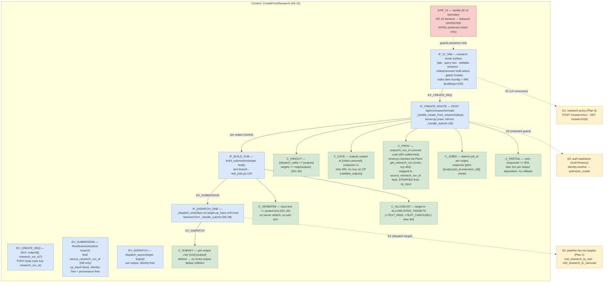
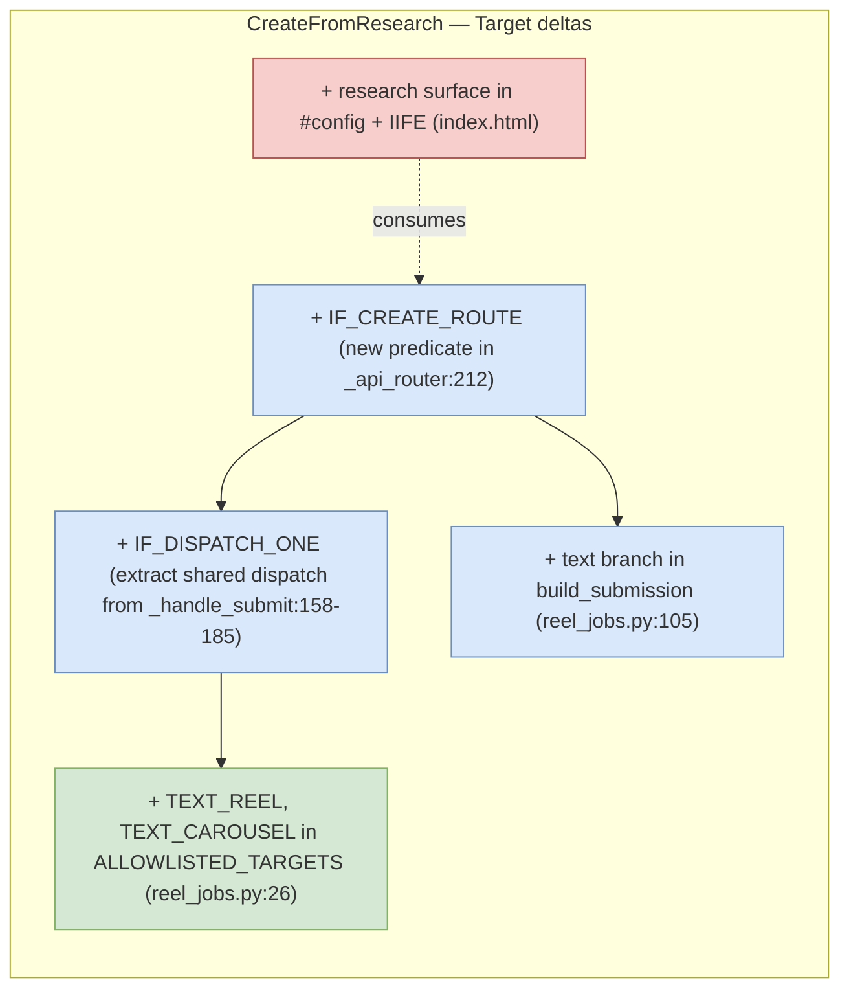
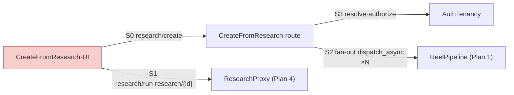

# Create-from-Research Workflow (Routes + UI) — TDD Implementation Plan

> **Plan 5 of 6** for the Carousel Image Pipeline PRD
> (`2026-07-11-prd-carousel-image-pipeline-and-research-handoff.md`).
> **Scope:** PRD §7 **ISC-28 … ISC-36** and the §11 tracker row 5.
> **Seams this plan OWNS (per PRD §11 seam-ownership):** the `reel-af` UI "Create from
> research" mode (the two sub-modes Automatic + Full-control), the query box + single
> create action, the research-document display + editable textarea, the `video | carousel`
> multi-select, the disabled-until-selected Create button, the two-stage progress display,
> AND the server-side **create-from-text fan-out** — one authed route that takes the posted
> (edited) text + a set of selected output types and enqueues a video and/or a carousel
> submission.
> **Seams this plan CONSUMES (do NOT rebuild):**
> - **Plan 4** owns the research proxy: `POST /api/v1/research/run` (dispatch DR),
>   `GET /api/v1/research/{execution_id}` (`{status, markdown, html, sources}`), and the
>   `research_run` provenance row + `source_research_run_id` stamping. Plan 5 *calls* these;
>   it does not implement DR dispatch or provenance.
> - **Plan 1** owns the pipelines: `research_to_carousel(text, ...)` and the video
>   text-input path (`research_to_reel`/`text_to_reel`) plus the text→`Essence` seam. Plan 5
>   *targets* these reasoners via the allowlist; it does not implement generation.
> - **Plan 6** owns the authed carousel routes (`POST /api/v1/carousels`, review UI).
>   Plan 5's fan-out enqueues a carousel by delegating to the same submission builder /
>   `ReelJobRepoPort` used elsewhere; where a `carousel` submission target is needed, Plan 5
>   adds only the **allowlist + submission-shape** for a text/carousel target and references
>   Plan 6/Plan 1 for the rest.

## Harness Reality (read first — governs automated-vs-manual split)

There is **no JavaScript test harness** in this repo. `web/` and `remotion/` `package.json`
carry no vitest/jest/playwright; the UI is a single static Flask-served page
`web/index.html` with one vanilla-JS IIFE (`index.html:384-654`) and an in-file JSON
`#config` (`index.html:12-64`). Therefore:

- **DOM / interaction behaviors are MANUAL/E2E.** Mode selection, query box rendering,
  textarea display + editability, the multi-select toggles, the disabled-Create gate, and
  the two-stage progress rendering cannot be unit-tested here. They are specified under
  **Manual Success Criteria** with an explicit click-path. Where cheap, a **contract test**
  (a Python test asserting the required literal strings exist in `index.html`, mirroring
  `tests/web/test_index_contract.py`) guards against silent regression of the wiring — this
  is a *presence* check, **not** a behavior test.
- **Server seams are AUTOMATED (pytest).** Anywhere a behavior has a server-side seam — a
  route that builds the correct submission from the posted body — THAT is the automated
  test, in `tests/web/test_create_from_research.py`, using the existing fake-port harness
  (`tests/web/conftest.py`: `FakeIdentity`, `FakeReelJobRepo`, `FakeControlPlane`,
  `make_deps`, `_client`).

## Overview

The existing UI has exactly two modes — **DROP FILE** / **FROM URL**
(`index.html:325-328`) — a preset picker, and one **ROLL** button that calls
`buildInput()` (`index.html:503`) → `execute()` (`index.html:562`) →
`POST /api/v1/execute/async/{target}` → `poll()` (`index.html:586`) → `finish()`
(`index.html:613`). This plan adds a **third mode, "Create from research"**, with two
sub-modes:

- **Automatic (OD-3):** a query box + a single create action. On click the UI runs research
  (Plan 4's proxy) and, on completion, **auto-creates BOTH a video and a carousel** from the
  returned document. The automatic path's *server seam* — the create-from-text route
  enqueueing **both** submissions from one call — is the automated test (ISC-30).
- **Full control:** a query box → research → the returned document shown in an **editable
  textarea** → a **video | carousel multi-select** → a **Create** button **disabled until
  ≥1 output is selected**. On Create, the UI POSTs the **current (edited) textarea text** as
  the creation input for each selected output. The route using the posted text **verbatim**
  is the automated test (ISC-35).

The **automated core** is a single new server route/handler — call it the **create-from-text
fan-out** — that receives `{text, outputs:[...], research_run_id?}` (wire key `research_run_id`
per the reconciliation note) and, for each
selected output, builds a submission and dispatches it via the existing
`_handle_submit`/`build_submission`/`control_plane.dispatch_async` chain (`server.py:148`).
This is where "Automatic creates both" and "Create sends the edited text verbatim" become
binary-testable without a browser.

### Cross-plan: wire-key reconciliation (CANONICAL DECISION — Plan 4/5/6 must agree)

> **Review C1(d).** Plan 5 originally used `source_research_run_id` on the API wire while
> Plan 4 (§10, §119, §122) uses **`research_run_id`** on the wire (deep-links carry
> `research_run_id` only) and reserves `source_research_run_id` for the DB **column**
> (`reel_job.source_research_run_id`, `pg.py:212`; `ReelSubmission.source_research_run_id`,
> `reel_jobs.py:54`).
>
> **CANONICAL CHOICE:** the API **wire key is `research_run_id`**; it is coerced/validated and
> **mapped onto the `source_research_run_id` column/field**. This plan uses `research_run_id`
> throughout its request body and tests; `source_research_run_id` appears only as the
> `ReelSubmission`/DB field name. Plan 4 and Plan 6 already speak `research_run_id` on the wire
> — this reconciles all three. Any prior `source_research_run_id`-on-the-body reference in this
> plan is superseded by this note.

### Partial-failure & multi-job response contract (review C2)

> **Review C2.** `_handle_submit`'s single-submission `mark_failed`+`raise` (`server.py:173-181`)
> does **not** compose over a set of outputs. Define it explicitly for the fan-out:
>
> - **Deterministic ordering:** iterate `outputs` in **sorted** order (`sorted(set(outputs))`)
>   so the leg that fails is stable (Python set-iteration order is unspecified — review
>   Promises ⚠️). This also fixes duplicate-output de-dup: `validate_outputs` collapses to a
>   sorted, de-duplicated list.
> - **Response shape:** on success the 2xx body is
>   `{"jobs": [{"output", "job_id", "execution_id"}, ...]}` (one entry per output, sorted).
> - **Partial failure:** if an earlier output enqueues and a later output's CP call fails
>   (`dispatch_error`/`cp_status_{n}`/`no_execution_id`) or `insert_or_get_queued` raises 503
>   mid-fan-out, the route returns **502 ONLY when ZERO outputs enqueued**; otherwise it
>   returns a 2xx whose per-output entry carries the failed leg's disposition
>   (`enqueue.outcome: "cp_error"` / `"no_execution_id"`, mirroring the Observability
>   `outcome = enqueued_partial`). No cross-output rollback — each enqueued row stands (it is a
>   real queued job); the failed leg is reported, not silently dropped.
> - **Guard rejects (400/401/403)** short-circuit before ANY dispatch (whole request rejected,
>   no row, no CP) — these are pre-fan-out and unaffected by partial-failure semantics.

## Current State Analysis

### Key Discoveries

- **Modes tablist** — `index.html:325-328`: two `<button role="tab" data-mode="...">`
  (`file`, `url`). Adding a third `data-mode="research"` tab is the ISC-28 seam. Mode state
  is `state.mode` (read in `buildInput()` `index.html:504-507`, in `roll()`
  `index.html:517-519`).
- **`buildInput()`** — `index.html:503`: branches on `state.preset.kind === "topic"` then
  `state.mode`. A `research` mode needs its own branch producing the create-from-text body.
- **`execute()`** — `index.html:562`: generic `POST /api/v1/execute/async/{target}` with
  `Idempotency-Key` + `{input}`, 409-pending retry loop. Reused as-is for each fan-out
  submission if the UI drives them; **but** OD-3 "both from one click" is cleaner as ONE
  server route that fans out server-side (single automated seam, single idempotency scope).
- **`poll()` / `mapStatus()`** — `index.html:586,609`: maps CP status → a stage in
  `CFG.ui.statusStageByExecutionStatus` (`index.html:56-61`). The two-stage
  (researching → creating) display (ISC-36) needs new stage keys + a research phase before
  the create phase.
- **`#config` presets[]** — `index.html:23-27`: array of `{id,label,sub,ratio,target,kind}`.
  A new `kind:"carousel"` / `kind:"research"` entry + copy strings for the research mode live
  here (the config-driven rule, per project `command-center/ARCHITECTURE.md` §10).
- **`stages[]`** — `index.html:39-46`: the progress track labels. Two-stage progress needs a
  RESEARCH stage (and reuse of existing create stages).
- **Server router** — `server.py:212` `_api_router` dispatches by `_is_upload` /
  `_submit_target` (`_SUBMIT_RE` `server.py:42`) / `_poll_id` (`_POLL_RE` `server.py:43`).
  A new create-from-text route needs a pure predicate + a `_handle_*` following the
  `_handle_submit` shape (`server.py:148`): `identity.resolve` → `authorize_create` →
  build submission(s) → `dispatch_async` → stamp.
- **`build_submission` + allowlist** — `reel_jobs.py:105,26`: `ALLOWLISTED_TARGETS` is
  `{TARGET_TOPIC, TARGET_COMPOSITE}` today; `TARGET_ARTICLE` exists but is **not** allowlisted
  (`reel_jobs.py:23`). A text→video and a text→carousel target must be **added to the
  allowlist** and given a submission shape (text is a first-class input, ISC-35).
- **`source_research_run_id`** — already a `ReelSubmission` field (`reel_jobs.py:54`, a
  `uuid.UUID | None`), always `None` today; bound into the UUID column at `pg.py:212`. Plan 4
  flips it on; Plan 5 maps the **wire key `research_run_id`** onto it (see wire-key note),
  coercing the JSON string → `uuid.UUID` and tenancy-checking via Plan 4's `get_research_run`.
  **Correction (review C1):** it is NOT stripped by `_clean_input` today (`_CP_STRIP`,
  `reel_jobs.py:89`, lacks it), so unless added to `_CP_STRIP` it would leak into `cp_input`
  and be dispatched to the reasoner. Plan 5 **adds `source_research_run_id` + `research_run_id`
  to `_CP_STRIP`** so it rides only on the DB row, never in `cp_input`.
- **Test harness** — `tests/web/conftest.py`: fake ports + `make_deps`; `test_submit.py`
  shows the exact Flask-client assertion style (`repo.inserted`, `cp.dispatch_calls`,
  identity-free dispatched body). `test_index_contract.py` shows the HTML-string contract
  pattern.

### Constraints (must respect)

- **Auth backbone:** every new route calls `deps.identity.resolve(request)` then
  `deps.access_guard.authorize_create(ctx)` (`server.py:149-150`); identity **never** from
  the body (`FORBIDDEN_IDENTITY_FIELDS`, `reel_jobs.py:32`). (This plan's routes inherit
  this; the exhaustive auth ISCs 49-52 are **Plan 6's** — Plan 5 asserts the create-from-text
  route participates, not the full matrix.)
- **Idempotency:** honor the `Idempotency-Key` header pattern (`server.py:157`,
  `_client_request_id` `server.py:67`). Fan-out to two outputs must **not** collide on one
  key — derive a per-output sub-key (e.g. `"{crid}:video"`, `"{crid}:carousel"`) so each is
  independently deduped.
- **Config-driven UI:** all new copy/labels/targets go in `#config` (`index.html:12-64`);
  the `<body>` stays a zero-copy skeleton; CSS reuses the film-house tokens
  (`index.html:66-296`) — no new palette.
- **Provenance id is validated, typed, and tenancy-checked (review C1):** the wire key is
  **`research_run_id`** (align with Plan 4 §10/§119/§122 — see the *Cross-plan: wire-key
  reconciliation* note below). The route coerces it to `uuid.UUID` (400
  `invalid_research_run_id` on malformed) and, **before stamping**, calls Plan 4's
  `get_research_run(ctx, research_run_id)` (Plan 4 §230-232, §517) so a cross-org id is
  rejected (Plan 4 §136 — cross-org provenance is denied via `NotFound`/404). The validated
  id is mapped onto `ReelSubmission.source_research_run_id` (a `uuid.UUID`; `reel_jobs.py:54`
  binds into the UUID column at `pg.py:212`) — it is **NOT** passed under `input`.
- **Provenance id never reaches the reasoner (review C1):** add `source_research_run_id`
  **and** `research_run_id` to `_CP_STRIP` (`reel_jobs.py:89`) so `cp_input` stays free of it
  (`_clean_input` at `reel_jobs.py:92-94` only strips `_CP_STRIP` today). Carry the id only on
  the `ReelSubmission` field for the DB row; the reasoner's `cp_input` is `{"text": text}`.
- **Per-output job_id + multi-job response (review C3):** mint a **distinct** `job_id` per
  output (do NOT reuse one factory result across outputs — under test `uuid_factory` returns
  the constant `FIXED_JOB_ID`, `conftest.py:31,181`, so a shared id collides silently). The
  2xx response body is `{"jobs": [{"output", "job_id", "execution_id"}, ...]}` (sorted by
  `output`), superseding the single-job `payload.setdefault("job_id", ...)` shape of
  `_handle_submit` (`server.py:192`).
- **Text normalization (review Data Models ⚠️):** the route performs **NO trim** beyond the
  non-empty (`text.strip()` truthiness) check — the user's exact bytes are forwarded verbatim
  (ISC-35). This disambiguates the property `input.text == T` for whitespace-padded `T`.

## Desired End State

A `reel-af` user can pick **Create from research**, choose **Automatic** (one click →
research → a video **and** a carousel) or **Full control** (research → editable doc →
`video|carousel` multi-select → Create with the edited text), and see distinct
**researching** then **creating** progress. Server-side, a single create-from-text route
fans the posted (edited) text out to the selected reasoner target(s), preserving
`source_research_run_id`, deduped per output, under the existing auth backbone.

### Observable Behaviors (→ ISC)

- **ISC-28** a "Create from research" tab sits beside DROP FILE / FROM URL. *(Manual + HTML
  contract)*
- **ISC-29** Automatic sub-mode shows a query box + a single create action. *(Manual + HTML
  contract)*
- **ISC-30** Automatic create enqueues **both** a video and a carousel. *(AUTOMATED server
  seam)*
- **ISC-31** Full-control shows the returned research document (from Plan 4's GET). *(Manual)*
- **ISC-32** Full-control shows that research in an **editable `<textarea>`**. *(Manual + HTML
  contract)*
- **ISC-33** a `video | carousel` multi-select is present in full-control. *(Manual + HTML
  contract)*
- **ISC-34** Create is **disabled until ≥1 output type** is selected. *(Manual + HTML
  contract for the disabled-logic wiring)*
- **ISC-35** Create sends the **current edited textarea text** as creation input. *(AUTOMATED
  server seam — route uses posted text verbatim)*
- **ISC-36** researching + creating show **distinct** progress states. *(Manual + a
  status-mapping contract/seam)*

## What We're NOT Doing

- **Not** implementing DR dispatch, the research proxy routes, or provenance stamping — Plan 4.
- **Not** implementing `research_to_carousel`, the text→`Essence` seam, or the carousel
  preset — Plan 1.
- **Not** implementing the carousel review UI, recreate loop, or the full authed carousel
  route matrix — Plan 6.
- **Not** implementing media serving / presigned image URLs — Plan 3.
- **Not** the DR-side "Send to reels" push button — Plan 4/6 scope.
- **Not** building a JS unit-test harness (out of scope; would change repo test posture).

## Testing Strategy

- **Framework:** `pytest`, Flask test client, existing fake ports (`tests/web/conftest.py`).
- **Automated (server seams):** new `tests/web/test_create_from_research.py`.
  - ISC-30 — Automatic fan-out enqueues both a video and a carousel submission (two
    `cp.dispatch_calls`, one per selected output; per-output idempotency sub-keys distinct).
  - ISC-35 — the create-from-text route dispatches the **posted text verbatim** as the
    reasoner input (assert dispatched body carries exactly the posted string, untrimmed of
    user edits beyond the documented normalization).
  - Plus guards: single-output requests dispatch exactly one; empty/no-outputs request →
    400, no row, no CP call; forbidden identity field in body → 400; unauthenticated → 401;
    viewer role → 403; `research_run_id` passthrough preserved on the DB field **and absent
    from `cp_input`**; malformed `research_run_id` → 400; cross-org `research_run_id` → 404;
    unallowlisted output type → 400; distinct per-output `job_id`s (counting `uuid_factory`);
    partial-failure disposition (zero-enqueued → 502, else 2xx per-leg).
- **Contract (Python, HTML-string presence):** extend `test_index_contract.py` **or** add
  cases in the new test file asserting `index.html` contains the research-mode tab, the
  editable `<textarea>`, the `video|carousel` multi-select controls, the disabled-Create
  wiring, and the research stage key. Presence, not behavior.
- **Manual/E2E:** a documented click-path per DOM behavior (below), run against a locally
  served page with Plan 4's research route faked/live.

## Workflow Closure

Per behavior, classify against the closure framework (`references/closure-test-framework.md`).

- **ISC-30 (Automatic enqueues both) — LEAF (automatable seam).** The create-from-text
  route is a **single synchronous handler**: request → build two submissions → two
  `dispatch_async` calls → two rows. There is **no async edge and no cross-process
  read-model** *within Plan 5's slice* (the actual video/carousel generation is Plan 1's
  async pipeline, observed via the existing poll path, and is out of this slice's closure).
  The observable — "two submissions were enqueued" — is asserted directly on the injected
  `FakeReelJobRepo`/`FakeControlPlane` at the route boundary. A unit/route test suffices;
  **not BLOCKING** here. Reason it is not the full end-to-end closure: the OBSERVABLE
  "user sees both a finished video and a finished carousel" crosses Plan 1's async
  generation + Plan 3's media serving — owned and closure-tested there, referenced not
  re-tested here.
- **ISC-35 (edited text used verbatim) — LEAF.** Synchronous, same-module: the route maps
  the posted `text` into the dispatched `{input}` with no async or registration seam.
  Asserted on `cp.dispatch_calls`.
- **ISC-28/29/31/32/33/34/36 — MANUAL (no server seam / DOM-only).** No closure test is
  feasible in this repo's harness (no JS runtime under test). Risk is mitigated by the HTML
  contract presence-checks; the behavioral verification is the documented Manual click-path.
  This is stated as a known limitation, not implied production completeness.

### Production Operation Chain (ISC-30, the one real fan-out chain)

`create-from-research UI click -> POST /api/v1/research/create (text, outputs, research_run_id?) -> _handle_create_from_research -> identity.resolve + authorize_create -> coerce+tenancy-check research_run_id (Plan 4 get_research_run) -> for each output in sorted(outputs): build_submission(target, {input:{text}}, research_run_id=<uuid>) -> per-output job_id + crid '{crid}:{output}' -> reel_jobs.insert_or_get_queued -> control_plane.dispatch_async(target, {input}) [cp_input strips research_run_id] -> attach_execution_id -> collect {output,job_id,execution_id} -> [Plan 1 async generation] -> poll -> visible result`

### Closure Test: "Automatic mode enqueues both a video and a carousel from one request"   [LEAF: synchronous route, no async/registration seam within this slice]
- **SOURCE (seed only):** the POST body `{text, outputs:["video","carousel"], research_run_id?}` (wire key `research_run_id` per the reconciliation note); `FakeIdentity` ctx (server-derived org/user).
- **TRIGGER (start):** the new route handler `_handle_create_from_research(deps)` via the Flask test client `POST /api/v1/research/create` (boundary = outermost entrypoint).
- **DRIVERS (async edges):** none in-slice (fully synchronous); Plan 1's generation async edge is out of this slice's span.
- **OBSERVE (assert via):** `FakeReelJobRepo.inserted` (two rows) + `FakeControlPlane.dispatch_calls` (two, one video-target one carousel-target), identity-free bodies; **distinct `job_id` per output** in the `{"jobs":[...]}` response (needs a counting `uuid_factory` — the default `FIXED_JOB_ID` collides, `conftest.py:31,181`); and **`research_run_id`/`source_research_run_id` ABSENT from each dispatched `input`** (review C3).
- **FORBIDDEN SPAN:** the test must not call Plan 1 reasoners, Plan 3 storage, or Plan 4 DR — only the route + injected fakes.
- **RED-AT-SEAM proof:** with the fan-out disabled (route dispatches only the first output), the "two dispatch_calls" assertion goes red.
- **DRIVABILITY:** store seam present via injected `FakeReelJobRepo` (`make_deps`); no clock/driver needed (synchronous). No missing seam.
- **EXECUTION (must run):** pure pytest + Flask test client; no external infra; fails-closed (red) if the route is absent — never skipped.

---

## Behavior 1: Automatic mode enqueues BOTH a video and a carousel (ISC-30)

### Test Specification
**Given** an authenticated member and a create-from-research request
`{"text": "<research doc>", "outputs": ["video", "carousel"]}`
**When** the request POSTs to the create-from-text fan-out route
**Then** exactly two submissions are enqueued — one to the text→video target, one to the
text→carousel target — each dispatched to the control plane exactly once with an
identity-free `{input}` carrying the text, and each with a **distinct** idempotency sub-key.

**Edge Cases:** one output only → one dispatch; unknown output type → 400 no dispatch;
duplicate output types de-duplicated (`validate_outputs` → sorted, de-duped list); valid
`research_run_id` present → carried on both submissions' **DB field**, absent from both
`cp_input`s; **malformed `research_run_id` (non-UUID) → 400 `invalid_research_run_id`, no row,
no CP**; **cross-org `research_run_id` → 404 (Plan 4 `get_research_run` `NotFound`), no row, no
CP**; forbidden identity field in body → 400 no row no CP; unauthenticated → 401; viewer
role → 403.

**Partial failure (review C2):** outputs iterate in **sorted** order; if a later output's CP
call fails after an earlier one enqueued, the route returns 2xx with the failed leg's
per-output disposition (`enqueue.outcome:"cp_error"`); it returns **502 only if ZERO outputs
enqueued**. No cross-output rollback.

**Property (outputs domain):** for any subset `S ⊆ {video, carousel}` with `|S| ≥ 1`, the
number of `dispatch_calls` equals `|S|`, the set of dispatched targets equals the mapped
targets of `S`, and the `{"jobs":[...]}` response has `|S|` entries with **distinct
`job_id`s** — assert over all three non-empty subsets (`{video}`, `{carousel}`,
`{video,carousel}`).

**Files touched:**
- `web/server.py` (new predicate `_create_from_research_subpath` + `_handle_create_from_research`; extract shared `_dispatch_one`; `_coerce_research_run_id` + `validate_outputs` helpers; register in `_api_router`)
- `web/reel_jobs.py` (add text→video + text→carousel targets to `ALLOWLISTED_TARGETS`; text-input submission shape with `research_run_id` param; **add `source_research_run_id`/`research_run_id` to `_CP_STRIP`**; per-output idempotency sub-key)
- `web/deps.py` (a `research_runs` port exposing `get_research_run(ctx, id)` — impl owned by Plan 4; Plan 5 wires the tenancy call)
- `tests/web/conftest.py` (thread a `uuid_factory` kwarg through `make_deps`; add a `FakeResearchRuns` port with a cross-org `NotFound` case)
- `web/index.html` (`#config` copy/targets only — no behavior)
- `tests/web/test_create_from_research.py` (new)

### TDD Cycle

#### 🔴 Red: Write Failing Test
**File**: `tests/web/test_create_from_research.py`
```python
import server
from conftest import ORG_ID, FakeControlPlane, FakeIdentity, FakeReelJobRepo, make_ctx, make_deps

CREATE_URL = "/api/v1/research/create"

def _client(deps):
    return server.create_app(deps, enable_supertokens=False).test_client()

import itertools

def _counting_uuid_factory():
    # FIXED_JOB_ID (conftest.py:31,181) is constant → per-output job_ids collide silently.
    # Inject a counter so distinct-job_id assertions are meaningful (review C3).
    counter = itertools.count(1)
    return lambda: uuid.UUID(int=next(counter))

def test_automatic_enqueues_both_video_and_carousel():
    repo = FakeReelJobRepo()
    cp = FakeControlPlane(response=(202, {"execution_id": "exec_x"}, {}))
    deps = make_deps(identity=FakeIdentity(make_ctx("member")), reel_jobs=repo,
                     control_plane=cp, uuid_factory=_counting_uuid_factory())
    body = {"text": "research doc body", "outputs": ["video", "carousel"]}

    resp = _client(deps).post(CREATE_URL, json=body)

    assert resp.status_code in (200, 202)
    assert len(repo.inserted) == 2
    targets = {t for (t, _b) in cp.dispatch_calls}
    assert targets == {reel_jobs.TARGET_TEXT_REEL, reel_jobs.TARGET_TEXT_CAROUSEL}
    for _t, dispatched in cp.dispatch_calls:
        assert dispatched["input"]["text"] == "research doc body"  # identity-free, text carried
        # provenance MUST NOT leak into cp_input (review C3):
        assert "research_run_id" not in dispatched["input"]
        assert "source_research_run_id" not in dispatched["input"]
    # distinct per-output job_id in the multi-job response (review C3):
    jobs = resp.get_json()["jobs"]
    assert len({j["job_id"] for j in jobs}) == 2
    assert [j["output"] for j in jobs] == ["carousel", "video"]  # sorted, deterministic
```
> **Note (review C3):** `make_deps` must accept a `uuid_factory` override; `conftest.py:181`
> already sets a default `uuid_factory=lambda: FIXED_JOB_ID`, so thread the kwarg through
> `make_deps` (one-line addition) if it is not already forwarded.

#### 🟢 Green: Minimal Implementation
**File**: `web/server.py`
```python
# predicate mirroring _submit_target; _handle_create_from_research:
#   ctx = deps.identity.resolve(request); deps.access_guard.authorize_create(ctx)
#   body = request.get_json(silent=True)
#   outputs = validate_outputs(body)            # sorted(set(...)); [] → 400 empty; unknown → 400
#   run_id = _coerce_research_run_id(body)      # str→uuid.UUID; malformed → 400 invalid_research_run_id
#   if run_id is not None:
#       deps.research_runs.get_research_run(ctx, run_id)   # Plan 4 tenancy guard; cross-org → 404
#   crid = _client_request_id(deps, body)
#   jobs, enqueued = [], 0
#   for output in outputs:                       # DETERMINISTIC sorted order (review C2)
#       target = TEXT_TARGET_BY_OUTPUT[output]
#       submission = build_submission(target, {"input": {"text": body["text"]}},
#                                     research_run_id=run_id)   # id → ReelSubmission field, NOT input
#       job_id = deps.uuid_factory()             # DISTINCT per output (review C3)
#       sub_crid = f"{crid}:{output}"
#       result = _dispatch_one(deps, ctx, target, submission, job_id, sub_crid, now)
#       jobs.append({"output": output, "job_id": str(job_id),
#                    "execution_id": result.execution_id, "outcome": result.outcome})
#       enqueued += 1 if result.ok else 0
#   if enqueued == 0:                            # partial-failure contract (review C2)
#       raise BadGateway(...) / return the CP error   # 502 only when nothing enqueued
#   return jsonify({"jobs": jobs}), 202
# NOTE: _dispatch_one factors _handle_submit:158-185 (insert→idempotent-return→dispatch→
#       mark_failed→attach) and OWNS the returning-key early-return + attach; the caller owns
#       job_id minting and result collection (review Interfaces ⚠️: split made explicit).
#       Plan 4's get_research_run reached via a new deps.research_runs port (Plan 4 owns the impl).
```
**File**: `web/reel_jobs.py`
```python
TARGET_TEXT_REEL = "reel-af.reel_research_to_reel"       # Plan 1 video-from-text
TARGET_TEXT_CAROUSEL = "reel-af.reel_research_to_carousel"  # Plan 1 carousel-from-text
ALLOWLISTED_TARGETS = frozenset({TARGET_TOPIC, TARGET_COMPOSITE,
                                 TARGET_TEXT_REEL, TARGET_TEXT_CAROUSEL})
TEXT_TARGET_BY_OUTPUT = {"video": TARGET_TEXT_REEL, "carousel": TARGET_TEXT_CAROUSEL}

# _CP_STRIP must exclude provenance from cp_input (review C1):
_CP_STRIP = FORBIDDEN_IDENTITY_FIELDS | {"client_request_id",
                                         "source_research_run_id", "research_run_id"}

# build_submission gains a `research_run_id: uuid.UUID | None = None` param and a text branch
# for the two text targets: validate non-empty text; set the ReelSubmission field
# source_research_run_id=research_run_id (a uuid.UUID, bound at pg.py:212); cp_input={"text": text}
# with provenance STRIPPED via _clean_input/_CP_STRIP → identity-free AND provenance-free.
```

#### 🔵 Refactor: Improve Code
- [ ] **No duplication:** the per-output insert→dispatch→attach loop reuses the *same*
  helper `_handle_submit` extracts today (`server.py:148-185`) — factor the single-submission
  dispatch into a shared `_dispatch_one(deps, ctx, target, cp_input, crid, now)` so
  create-from-research and the existing submit path share it (no copy-paste of the CP
  error/attach logic).
- [ ] **Reveals intent:** `TEXT_TARGET_BY_OUTPUT` names the fan-out; `validate_outputs`
  rejects empties/unknowns in one place.
- [ ] **Complexity down:** the handler is a loop over validated outputs, no nested branching.
- [ ] **No shallow wrappers:** the route is a thin adapter over the shared dispatch helper —
  acceptable because the helper is the deep module (CP error handling hidden).
- [ ] **Fits patterns:** matches `_handle_submit` shape (`server.py:148`) and the
  `build_submission` validation style (`reel_jobs.py:105`).

### Success Criteria
**Automated:**
- [ ] Red first: `pytest tests/web/test_create_from_research.py::test_automatic_enqueues_both_video_and_carousel` fails (route/targets absent).
- [ ] Green: that test passes.
- [ ] Property test over all three non-empty subsets of `{video, carousel}` passes (cardinality, targets, distinct job_ids).
- [ ] Guards pass: single-output, unknown-output 400, unauth 401, viewer 403, forbidden-field 400, `research_run_id` passthrough (on DB field), **malformed `research_run_id` → 400**, **cross-org `research_run_id` → 404**.
- [ ] Distinct per-output idempotency sub-keys asserted (no cross-output dedup collision).
- [ ] **Distinct per-output `job_id`s** asserted via counting `uuid_factory` (review C3).
- [ ] **Provenance absent from `cp_input`:** `research_run_id`/`source_research_run_id` not in any dispatched `input` (review C1/C3).
- [ ] **Multi-job response shape:** 2xx body is `{"jobs":[{output,job_id,execution_id}]}`, sorted by output.
- [ ] **Partial-failure:** later-leg CP failure after an earlier enqueue → 2xx with failed-leg disposition; zero-enqueued → 502.
- [ ] Full suite green: `pytest tests/web/`.
- [ ] No new duplication: `grep` confirms CP error/attach logic exists once (shared `_dispatch_one` helper).

**Manual:**
- [ ] In the served page, Automatic mode's single click produces two tracked jobs.

---

## Behavior 2: Create uses the current (edited) textarea text verbatim (ISC-35)

### Test Specification
**Given** a full-control create request whose `text` differs from the original research
(the user edited it), `{"text": "EDITED body", "outputs": ["carousel"]}`
**When** it POSTs to the create-from-text route
**Then** the control-plane dispatched `{input}` carries **exactly** `"EDITED body"` — the
route uses the posted text verbatim, not a server-refetched or original document.

**Edge Cases:** empty/whitespace-only `text` → 400 (rejected, no dispatch); very long text
passes through (chunking/summarization is Plan 1's pipeline concern, not this route's — the
route forwards the text as-is); `text` missing → 400.

**Property:** for any non-empty `text` string `T`, the dispatched `input["text"] == T`
(identity transform through the route).

**Files touched:**
- `web/server.py` (`_handle_create_from_research` — already added in Behavior 1; assert the text-passthrough branch)
- `web/reel_jobs.py` (`build_submission` text branch — validate non-empty, no mutation of the string)
- `tests/web/test_create_from_research.py`

### TDD Cycle

#### 🔴 Red: Write Failing Test
**File**: `tests/web/test_create_from_research.py`
```python
def test_create_uses_posted_text_verbatim():
    repo = FakeReelJobRepo()
    cp = FakeControlPlane(response=(202, {"execution_id": "e"}, {}))
    deps = make_deps(identity=FakeIdentity(make_ctx("member")), reel_jobs=repo, control_plane=cp)

    resp = _client(deps).post(CREATE_URL, json={"text": "EDITED body", "outputs": ["carousel"]})

    assert resp.status_code in (200, 202)
    _t, dispatched = cp.dispatch_calls[0]
    assert dispatched["input"]["text"] == "EDITED body"

def test_empty_text_is_400_no_dispatch():
    repo, cp = FakeReelJobRepo(), FakeControlPlane()
    deps = make_deps(identity=FakeIdentity(make_ctx("member")), reel_jobs=repo, control_plane=cp)
    resp = _client(deps).post(CREATE_URL, json={"text": "   ", "outputs": ["carousel"]})
    assert resp.status_code == 400
    assert repo.inserted == [] and cp.dispatch_calls == []
```

#### 🟢 Green: Minimal Implementation
**File**: `web/reel_jobs.py`
```python
# in the text branch of build_submission:
text = raw_input.get("text")
if not isinstance(text, str) or not text.strip():
    raise BadRequest("text must be a non-empty string", code="invalid_text")
# forward verbatim: NO trim beyond the non-empty check — the user's exact bytes are
# preserved (ISC-35; review normalization note). _clean_input strips _CP_STRIP, which now
# includes source_research_run_id/research_run_id → provenance stays out of cp_input (review C1):
cp_input = {**_clean_input(raw_input), "text": text}
```

#### 🔵 Refactor: Improve Code
- [ ] **No duplication:** text-emptiness validation shares the topic-emptiness style
  (`reel_jobs.py:126-127`) — reuse a small `_require_nonempty(value, field, code)` helper.
- [ ] **Reveals intent:** the comment records *why* text is not trimmed into `cp_input`
  (verbatim-edit contract, ISC-35).
- [ ] **Complexity down:** one branch, no nesting.
- [ ] **No shallow wrappers:** validation helper is shared, not a per-field wrapper.
- [ ] **Fits patterns:** mirrors existing `invalid_topic`/`invalid_preset` error codes.

### Success Criteria
**Automated:**
- [ ] Red first: verbatim + empty-text tests fail before the text branch exists.
- [ ] Green: both pass.
- [ ] Property: dispatched `input["text"] == T` for sampled non-empty `T`.
- [ ] `pytest tests/web/` green.

**Manual:**
- [ ] Editing the textarea then clicking Create sends the edited body (observe dispatched job / CP log).

---

## Behavior 3: UI wiring for the research mode (ISC-28/29/31/32/33/34/36)

> **All DOM/interaction — MANUAL/E2E.** Guarded by a Python HTML-contract presence test so
> the wiring cannot silently vanish. No JS behavior is unit-tested (no JS harness).

### HTML Contract (AUTOMATED presence-check, not behavior)
**File**: `tests/web/test_create_from_research.py` (or extend `test_index_contract.py`)
```python
from pathlib import Path
INDEX = Path(__file__).resolve().parents[2] / "web" / "index.html"

def test_index_has_research_mode_wiring():
    html = INDEX.read_text(encoding="utf-8")
    assert 'data-mode="research"' in html                 # ISC-28 third tab
    assert 'id="researchQuery"' in html                   # ISC-29 query box
    assert 'id="researchDoc"' in html                     # ISC-31/32 editable doc
    assert '<textarea' in html                            # ISC-32 editable, not read-only div
    assert 'data-output="video"' in html                  # ISC-33 multi-select
    assert 'data-output="carousel"' in html               # ISC-33 multi-select
    assert 'id="createFromResearch"' in html              # ISC-34 gated Create button
    assert '"research"' in html                            # ISC-36 research stage key in #config stages
```

### #config additions (config-driven; index.html:12-64)
```jsonc
// presets[]: add a research entry (kind drives buildInput's research branch)
{ "id": "research", "label": "FROM RESEARCH", "sub": "query → doc → cut", "kind": "research",
  "createPath": "/api/v1/research/run", "resultPath": "/api/v1/research/{id}",
  "createFromTextPath": "/api/v1/research/create" }
// copy: research mode labels (query placeholder, automatic/full-control labels, create label)
// stages[]: prepend { "key": "research", "label": "RESEARCH", "note": "reading the field" }
//           so ISC-36 shows a distinct researching phase before the create stages.
// ui.statusStageByExecutionStatus: research-phase CP statuses map to "research"
```

### Manual Success Criteria (E2E click-paths — the real behavioral verification)
Run against the served page (`server:app`) with Plan 4's `/api/v1/research/*` live or faked.

- [ ] **ISC-28:** a **Create from research** tab appears beside DROP FILE / FROM URL;
  clicking it activates the research surface and deactivates file/url.
- [ ] **ISC-29:** in **Automatic**, a query box and a single create action are visible; no
  multi-select is shown; one click starts research then auto-creates.
- [ ] **ISC-31:** in **Full control**, after research completes the returned document renders
  in the UI (markdown/html from Plan 4's `GET /api/v1/research/{id}`).
- [ ] **ISC-32:** that document appears inside an **editable `<textarea>`**; typed edits
  persist in the field.
- [ ] **ISC-33:** a **video | carousel** multi-select is present in full-control; both can be
  toggled independently.
- [ ] **ISC-34:** the **Create** button is **disabled** with zero outputs selected and
  **enables** once ≥1 is selected; deselecting back to zero disables it again.
- [ ] **ISC-36:** during a run the progress track shows a **RESEARCH** phase, then a distinct
  **CREATE/RENDER** phase — the two stages are visually separate.
- [ ] **ISC-45 (reuse, cross-ref Plan 6):** the research surface uses existing film-house CSS
  tokens/components — no new palette introduced.

### Files touched
- `web/index.html` (`#config` presets/copy/stages/status-map + the research-surface DOM:
  tab, query box, editable `<textarea id="researchDoc">`, `data-output` toggles, gated
  `#createFromResearch` button; the IIFE research branch in `buildInput`/mode handling +
  the disabled-until-selected gate + two-stage progress).
- `tests/web/test_create_from_research.py` (HTML contract presence test).

---

## Integration & E2E Testing

- **Integration (automated):** create-from-research route + real `build_submission` +
  fake CP/repo — assert fan-out cardinality, targets, idempotency sub-keys, and
  `source_research_run_id` passthrough (Behaviors 1-2). This is the load-bearing coverage.
- **E2E (manual):** full click-path — pick research mode → Automatic (one click → both jobs)
  and Full-control (research → edit doc → toggle outputs → gated Create → two-stage
  progress). Requires Plan 4's research routes and Plan 1's reasoners live; documented as the
  release check, not CI.

## Automated-vs-Manual Split (summary)

- **Automated (pytest, `tests/web/test_create_from_research.py`):** ISC-30 (fan-out enqueues
  both, **distinct job_ids**, **no provenance leak in `cp_input`**, multi-job response,
  partial-failure disposition), ISC-35 (verbatim edited text), plus the guard matrix (auth,
  forbidden fields, empty/unknown outputs, single-output, `research_run_id` passthrough on the
  DB field, **malformed `research_run_id` → 400**, **cross-org → 404**) and the HTML-contract
  presence checks for the DOM wiring.
- **Manual/E2E:** ISC-28, ISC-29, ISC-31, ISC-32, ISC-33, ISC-34, ISC-36 (all DOM/interaction
  — no JS harness in repo).

## Seam Flags / Notes

- **ALLOWLISTED_TARGETS additions (this plan):** add `reel-af.reel_research_to_reel`
  (text→video) and `reel-af.reel_research_to_carousel` (text→carousel) to
  `reel_jobs.py:26`. These target **Plan 1's** reasoners; Plan 5 owns only the allowlist +
  submission-shape, not the reasoners.
- **New route:** `POST /api/v1/research/create` (create-from-text fan-out) — owned here.
  Distinct from Plan 4's `/api/v1/research/run` (DR dispatch) and `/api/v1/research/{id}`
  (DR result), which this plan **consumes**.
- **Idempotency sub-keys:** fan-out derives per-output sub-keys from one client key so a
  double-click dedups per output — flag for Plan 6 to keep consistent if it adds a direct
  carousel-create entry.
- **Provenance passthrough (`research_run_id` → `source_research_run_id`):** the **wire key is
  `research_run_id`** (canonical per the wire-key reconciliation note; aligns Plan 4/5/6). Plan 5
  coerces it to `uuid.UUID` (400 on malformed), calls **Plan 4's `get_research_run(ctx, id)`**
  ownership guard before stamping (cross-org → 404, per Plan 4 §136), maps it onto
  `ReelSubmission.source_research_run_id`, and **strips it from `cp_input`** via `_CP_STRIP`
  (`reel_jobs.py:89`) so the reasoner never sees it. Authoritative provenance/stamping semantics
  remain Plan 4's; Plan 5 owns coercion + the tenancy-guard call on **this** route.
- **Auth ISCs 49-52** (full identity/org matrix) are **Plan 6's**; Plan 5's route inherits
  the `identity.resolve` + `authorize_create` guard and is tested only for participation.
- **Dependency ordering:** Plan 5 route tests are green against fakes today, but the live
  UI E2E requires **Plan 4** (research proxy) and **Plan 1** (text reasoners) merged.

## References
- PRD: `thoughts/searchable/shared/plans/2026-07-11-prd-carousel-image-pipeline-and-research-handoff.md` (§5 Flows A/B, §7 ISC-28..36, OD-3).
- Plan 1: `2026-07-11-tdd-01-carousel-pipeline-backend.md` (`research_to_carousel`, text→`Essence`, text targets).
- Plan 4: `2026-07-11-tdd-04-research-handoff-provenance.md` (research proxy routes + provenance) — *pending at authoring time; reference on merge.*
- Plan 6: `2026-07-11-tdd-06-carousel-review-and-routes.md` (authed carousel routes, review UI, auth matrix).
- UI: `web/index.html:12-64` (#config), `:23-27` (presets), `:39-46` (stages), `:56-61` (status map), `:325-328` (modes), `:503` (buildInput), `:562` (execute), `:586` (poll), `:609` (mapStatus), `:613` (finish), `:66-296` (CSS tokens).
- Server: `web/server.py:42-61` (route predicates), `:148` (_handle_submit), `:195` (_handle_poll), `:212` (_api_router).
- Domain: `web/reel_jobs.py:23,26` (targets/allowlist), `:54` (source_research_run_id), `:105` (build_submission), `:32` (forbidden identity fields).
- Tests: `tests/web/conftest.py` (fakes + make_deps), `tests/web/test_submit.py` (assertion style), `tests/web/test_index_contract.py` (HTML-contract pattern).

---

## System Map

> Bounded-context System Map for the create-from-research slice. **Definitions.**
> **Seam S#** = a boundary crossing (control passes from one context to another).
> **IN# / OUT#** = an inbound / outbound port on a context boundary.
> **EV# / evt** = a domain event (a payload that crosses a seam).
> **C#** = a contract: a named invariant with pre/postconditions on a stated target.
> **Grammar** = EBNF; every diagram node ID has exactly one grammar entry and vice-versa.
> Node ID prefixes: `IF`=interface/port, `EV`=event/payload, `C`=contract, `S`=seam,
> `GAP`=untested/ad-hoc boundary. This slice owns **one** context — **CreateFromResearch**
> (the fan-out route + its vanilla-JS surface) — and touches three neighbors it does **not**
> own: **ResearchProxy** (Plan 4), **ReelPipeline** (Plan 1, video+carousel reasoners), and
> **AuthTenancy** (the identity/authorize backbone shared by every route, `server.py:148-150`).

### Context roster

| Context | Owns (this plan) | Seams to | Source of truth |
|---|---|---|---|
| **CreateFromResearch** | `POST /api/v1/research/create` fan-out route + `_handle_create_from_research`; `TEXT_TARGET_BY_OUTPUT` + allowlist/submission-shape; the research-mode UI surface (tab, query box, editable `<textarea>`, `video\|carousel` multi-select, gated Create, two-stage progress) | ResearchProxy, ReelPipeline, AuthTenancy | this plan; `server.py`, `reel_jobs.py`, `index.html` |
| **ResearchProxy** (Plan 4) | `POST /api/v1/research/run`, `GET /api/v1/research/{id}`, `research_run` provenance + `source_research_run_id` | CreateFromResearch (consumed) | `2026-07-11-tdd-04-…` |
| **ReelPipeline** (Plan 1) | `reel_research_to_reel` (text→video), `reel_research_to_carousel` (text→carousel), text→`Essence` | CreateFromResearch (targeted via allowlist) | `2026-07-11-tdd-01-…` |
| **AuthTenancy** | `identity.resolve` → `authorize_create`; `FORBIDDEN_IDENTITY_FIELDS`; idempotency | CreateFromResearch (inherited) | `server.py:148`, `reel_jobs.py:32` |

### CreateFromResearch — (a) boundary diagram



### CreateFromResearch — (b) EBNF grammar (one entry per diagram ID; no orphans)

```ebnf
(* interfaces — call syntax *)
IF_UI_TAB       = "render_research_surface", "(", "state", ")" ;   (* index.html IIFE, buildInput():503 *)
IF_CREATE_ROUTE = "_handle_create_from_research", "(", "deps", ")" ;(* server.py, mirrors _handle_submit:148 *)
IF_BUILD_SUB    = "build_submission", "(", "target", ",", "body", ")" ; (* reel_jobs.py:105 text branch *)
IF_DISPATCH_ONE = "_dispatch_one", "(", "deps", ",", "ctx", ",", "target", ",", "cp_input", ",", "crid", ",", "now", ")" ;

(* events — payload schema *)
EV_CREATE_REQ   = "{", '"text"', ":", string, ",",
                  '"outputs"', ":", "[", output, { ",", output }, "]",
                  [ ",", '"research_run_id"', ":", (uuid | "null") ], "}" ;  (* wire key = research_run_id *)
output          = '"video"' | '"carousel"' ;
EV_SUBMISSION   = "ReelSubmission", "(", "target", ",",
                  "source_research_run_id=", (uuid | "null"),      (* DB field; NOT in cp_input *)
                  ",", "cp_input=", "{", '"text"', ":", string, "}", ")" ;  (* provenance-free *)
EV_DISPATCH     = "dispatch_async", "(", "target", ",", "{", '"input"', ":", cp_input, "}", ")" ;
cp_input        = "{", '"text"', ":", string, "}" ;                 (* identity-free *)

(* contracts — invariant : pre => post, on target *)
C_FANOUT    = "on", IF_CREATE_ROUTE, ":",
              "pre", "(", "|outputs|", ">=", "1", ")",
              "=>", "post", "(", "|dispatch_calls|", "==", "|outputs|",
              "AND", "targets", "==", "map", "(", "outputs", ")", ")" ;
C_VERBATIM  = "on", IF_BUILD_SUB, ":",
              "pre", "(", "text", "non-empty", ")",
              "=>", "post", "(", "dispatched.input.text", "==", "posted.text", ")" ;
C_SUBKEY    = "on", IF_DISPATCH_ONE, ":",
              "pre", "(", "crid", ",", "output", ")",
              "=>", "post", "(", "sub_crid", "==", '"{crid}:{output}"', "AND", "distinct-per-output", ")" ;
C_GATE      = "on", IF_CREATE_ROUTE, ":",
              "pre", "(", "outputs", "subset-of", "{video,carousel}", "AND", "|outputs|", ">=", "1", ")",
              "=>", "else", "(", "400", "AND", "no-row", "AND", "no-CP", ")" ;
C_ALLOWLIST = "on", IF_BUILD_SUB, ":",
              "pre", "(", "target", "in", "ALLOWLISTED_TARGETS", ")",
              "=>", "else", "(", "400", "unsupported_target", ")" ;
C_PROV      = "on", IF_CREATE_ROUTE, ":",
              "pre", "(", "research_run_id", "present", ")",
              "=>", "post", "(", "uuid-coerced", "(", "else", "400", ")",
              "AND", "get_research_run", "(", "ctx", ",", "id", ")", "(", "cross-org", "404", ")",
              "AND", "on", "source_research_run_id", "field", "AND", "not-in", "cp_input", ")" ;
C_JOBID     = "on", IF_CREATE_ROUTE, ":",
              "pre", "(", "|outputs|", ">=", "1", ")",
              "=>", "post", "(", "distinct", "job_id", "per", "output",
              "AND", "response", "==", "{jobs:[{output,job_id,execution_id}]}", "sorted", ")" ;
C_PARTIAL   = "on", IF_CREATE_ROUTE, ":",
              "pre", "(", "enqueued", "==", "0", ")", "=>", "(", "502", ")", ",",
              "else", "(", "2xx", "per-output-disposition", "AND", "no-rollback", ")" ;

(* gap — untested boundary *)
GAP_UI      = "vanilla-JS UI", ":", "no-JS-harness", "=>", "presence-check-only", "(", "no-behavior-test", ")" ;

(* cross-context seams *)
IF_S_RESEARCH = "S1", ":", "POST /api/v1/research/run", "|", "GET /api/v1/research/{id}" ; (* Plan 4 *)
IF_S_PIPE     = "S2", ":", "reel-af.reel_research_to_reel", "|", "reel-af.reel_research_to_carousel" ; (* Plan 1 *)
IF_S_AUTH     = "S3", ":", "identity.resolve", "->", "authorize_create" ;  (* server.py:149-150 *)
```

### CreateFromResearch — (c) seam table

| S# | From → To | Trigger / call | Payload (event) | Contract enforced | Failure modes | Tested by |
|---|---|---|---|---|---|---|
| **S0** | UI surface → create route | user Create click → `POST /api/v1/research/create` | `EV_CREATE_REQ` | `C_GATE`, `C_ALLOWLIST` | empty outputs→400; unknown output→400; forbidden identity field→400 | `test_create_from_research.py` (route) + `GAP_UI` presence-check for the click wiring |
| **S1** | UI surface → ResearchProxy (Plan 4) | `POST /research/run` then `GET /research/{id}` | `{status,markdown,html,sources}` | (Plan 4's) | research pending / DR failure → UI stall (manual E2E only) | **Plan 4** + manual E2E (`GAP_UI`) |
| **S2** | create route → ReelPipeline fan-out (Plan 1) | per output (sorted): `_dispatch_one` → `dispatch_async(target,…)` | `EV_DISPATCH` | `C_FANOUT`, `C_SUBKEY`, `C_VERBATIM`, `C_JOBID`, `C_PARTIAL`, `C_PROV` (strip) | CP 4xx/5xx → `mark_failed`; no `execution_id` → BadGateway(502); zero-enqueued → 502 else per-leg 2xx | `test_create_from_research.py` (cardinality, verbatim, sub-keys, distinct job_ids, no provenance leak, partial-failure) |
| **S3** | create route → AuthTenancy | `identity.resolve` → `authorize_create` (`server.py:149-150`) | `AuthContext` (server-derived) | identity never from body (`FORBIDDEN_IDENTITY_FIELDS`) | unauth→401; viewer→403; store down→503 | `test_create_from_research.py` (participation only; full matrix = Plan 6) |

### CreateFromResearch — **Target (TO-BE)**

The AS-IS diagram already reflects the target route + UI. The TO-BE deltas (what the plan
*introduces* vs. the current `_handle_submit`-only server) are:



- **Untested UI boundary (`GAP_UI`, `T_UI`):** the vanilla-JS surface has **no JS harness** —
  behavior is verified only by the Python HTML presence-check + manual E2E click-path. Marked
  `class … gap`.
- **Ad-hoc reach-around:** the edited textarea text lives client-side and is POSTed verbatim
  with **no server round-trip to re-fetch** the research doc — the server trusts the posted
  text (guarded by `C_VERBATIM`). This is intentional but is the one place UI state is
  authoritative over server state; flagged in the gap register.

### INDEX

- **Context roster:** CreateFromResearch (owned) · ResearchProxy (Plan 4) · ReelPipeline
  (Plan 1) · AuthTenancy (shared) — table above.
- **Context → context diagram:**



- **Gap / risk register:**
  - `GAP_UI` — vanilla-JS UI boundary untested (no JS harness): mode toggle, disabled-Create
    gate, two-stage progress, editable textarea persistence. *Mitigation:* HTML presence-check
    + manual E2E. *Residual risk:* silent behavioral regression that keeps the literals.
  - `RISK-DEP` — live UI E2E blocked until **Plan 4** (research proxy) and **Plan 1** (text
    reasoners) merge; route tests are green against fakes today. **Plan 5's tenancy guard
    depends on Plan 4's `get_research_run(ctx, id)`** (Plan 4 §230-232, §517) — until Plan 4
    lands, Plan 5 tests inject a `FakeResearchRuns` port; the cross-org `NotFound` case is
    Plan-4-owned semantics exercised through Plan 5's route.
  - `RISK-SUBKEY` — if Plan 6 adds a direct carousel-create entry it must reuse the
    `{crid}:{output}` sub-key scheme or double-click dedup will diverge.
  - `RISK-VERBATIM` — server trusts client-posted (edited) text with no re-fetch; a tampered
    body dispatches whatever text is posted (auth-gated, but no content provenance re-check).
    Note: the **`research_run_id`** (not the text) IS tenancy-checked now via Plan 4's
    `get_research_run` (`C_PROV`) — cross-org provenance is denied; only the free-text body
    remains client-authoritative.
  - `RESOLVED-PROV` (review C1) — `research_run_id` is coerced to `uuid.UUID` (400 on
    malformed), tenancy-checked (cross-org → 404), mapped to the `source_research_run_id` DB
    field, and stripped from `cp_input` via `_CP_STRIP`. Depends on Plan 4's `get_research_run`
    port existing (`RISK-DEP`).
  - `RESOLVED-JOBID` (review C3) — distinct `job_id` per output + `{jobs:[...]}` response;
    tests inject a counting `uuid_factory` (default `FIXED_JOB_ID` collides).
  - `RESOLVED-PARTIAL` (review C2) — sorted iteration + per-output disposition; zero-enqueued
    → 502, else 2xx, no rollback.

**Acceptance self-check (grammar ↔ diagram ↔ seams):**
- [x] Every diagram node ID (`IF_UI_TAB`, `IF_CREATE_ROUTE`, `IF_BUILD_SUB`, `IF_DISPATCH_ONE`,
  `EV_CREATE_REQ`, `EV_SUBMISSION`, `EV_DISPATCH`, `C_FANOUT`, `C_VERBATIM`, `C_SUBKEY`,
  `C_GATE`, `C_ALLOWLIST`, `C_PROV`, `C_JOBID`, `C_PARTIAL`, `GAP_UI`, `IF_S_RESEARCH`,
  `IF_S_PIPE`, `IF_S_AUTH`) has exactly one EBNF entry — **no orphans**.
- [x] Every EBNF entry maps back to a rendered node — **no dangling grammar**.
- [x] Interfaces are call-syntax; events are payload-schema; contracts state invariant + pre/post
  on a named target.
- [x] AS-IS and **Target (TO-BE)** are separate labeled subsections.
- [x] Untested vanilla-JS boundary + ad-hoc reach-around both marked `class … gap`.
- [x] Seam table covers UI→create-route (S0), UI→research (S1), create-route→pipeline fan-out
  (S2), create-route→auth (S3). **Self-check PASS.**

---

## Observability (wide events / OTel)

> **Honeycomb principle:** emit **one wide span per unit of work**, densely annotated so any
> question is answerable at query time. High cardinality is a feature, not a cost — every
> attribute below is a **BubbleUp dimension** for slicing "why did create do nothing / only
> one output at 3am." Prefer a fat `create_from_research` parent span with a `reel.enqueue`
> child **per output** over scattered logs. Each span carries WHO / WHAT / WHERE-state /
> OUTCOME so a single trace answers "user clicked Create — what happened to each output?".

### Span: `create_from_research` (parent — one per POST /api/v1/research/create)

| Group | Attribute | Notes |
|---|---|---|
| **WHO** | `org_id`, `created_by` (=`user_id`) | server-derived from `AuthContext` (`server.py:149`); **never** from body |
| **WHAT** | `mode` = `automatic` \| `full_control` | drives fan-out expectation |
| | `outputs.selected` = e.g. `["video","carousel"]`, `outputs.count` | the requested set + size |
| | `research_run_id` (wire) / `source_research_run_id` (field) | **high-cardinality** — provenance link to Plan 4 run; `research_run_id.valid` (bool, coercion) + `research_run_id.tenancy` = `owned` \| `cross_org` |
| | `text.len`, `text.sha256` | length + hash of the (possibly edited) posted text; **high-cardinality**; hash proves verbatim without logging content |
| | `text.edited` (bool, full-control only) | whether posted text ≠ original research doc |
| **WHERE/state** | `fanout.enqueued` = count of `dispatch_async` that succeeded | the load-bearing "did both run?" number |
| | `timing.research_ms`, `timing.create_ms` | both stages (researching + creating) on one span |
| | `guard.outcome` = `ok` \| `auth_401` \| `forbidden_403` \| `forbidden_field` \| `empty_outputs` \| `unknown_output` \| `invalid_research_run_id` \| `cross_org_run_id` | the guard-matrix result as one enum dimension |
| | `error.type` | exception class / CP failure reason (`dispatch_error`, `cp_status_{n}`, `no_execution_id`) |
| **OUTCOME** | `outcome` = `enqueued_all` \| `enqueued_partial` \| `rejected` \| `error` | terminal disposition |
| | `http.status_code` | 200/202 vs 400/401/403/502/503 |

### Child span: `reel.enqueue` (one per selected output)

| Group | Attribute | Notes |
|---|---|---|
| **WHAT** | `output.type` = `video` \| `carousel` | which leg of the fan-out |
| | `target` = `reel-af.reel_research_to_reel` \| `reel-af.reel_research_to_carousel` | dispatched target |
| | `idempotency.sub_key` = `"{crid}:{output}"` | **high-cardinality**; proves per-output dedup, no cross-output collision (`C_SUBKEY`) |
| | `client_request_id` (crid) | **high-cardinality**; parent idempotency scope |
| **WHERE/state** | `dispatch.duration_ms`, `job_id`, `execution_id` | per-output enqueue timing + IDs (`execution_id` **high-cardinality**) |
| | `dedup.returning` (bool) | true when `insert_or_get_queued` returned an existing row (no second CP dispatch) |
| **OUTCOME** | `enqueue.outcome` = `dispatched` \| `deduped` \| `cp_error` \| `no_execution_id` | per-output disposition |

### High-cardinality dimensions (flagged — the valuable slices)

`source_research_run_id` · `text.sha256` · `client_request_id` (crid) · `idempotency.sub_key`
(`{crid}:video`, `{crid}:carousel`) · `execution_id` · `job_id`. These are exactly the
fields that make BubbleUp useful — never drop them to reduce cardinality.

### Instrument for the 3am questions

- **"User clicked Create and nothing happened."** Query `create_from_research` where
  `fanout.enqueued = 0`. `guard.outcome` immediately says why: `empty_outputs` (ISC-34 gate
  fired), `auth_401`/`forbidden_403` (session/role), `forbidden_field` (tainted body), or
  `error` with `error.type` (CP down / 503). No log-grepping.
- **"Only one output ran (video came out, carousel didn't)."** On the parent, `outcome =
  enqueued_partial` and `outputs.count = 2` but `fanout.enqueued = 1`. Drill to the two
  `reel.enqueue` children: the failed leg carries `enqueue.outcome = cp_error` +
  `error.type`, or `deduped` (a stale `{crid}:carousel` sub-key collided). The child span
  isolates *which* target failed and why — the fan-out contract (`C_FANOUT`) becomes an
  observable, not just a test assertion.
- **"Did Create send the edited text?"** Compare `text.sha256` on the span against the
  research-run doc hash (Plan 4) — proves `C_VERBATIM` in production without logging content.
- **Two-stage timing:** `timing.research_ms` vs `timing.create_ms` on one span answers
  "which stage is slow" (mirrors the ISC-36 researching→creating UI split server-side).

### OTel notes

- Span names: **`create_from_research`** (parent, at `_handle_create_from_research`) and
  **`reel.enqueue`** (child, in the shared `_dispatch_one` helper — so the existing
  `_handle_submit` path gets the same child span for free, one instrumentation point).
- Set attributes as the handler learns them (dotted keys above), not as free-text logs — each
  becomes a queryable dimension. Record `error.type` + `guard.outcome` on the **span**, and use
  span status `ERROR` only for true failures (5xx / uncaught), not client-rejects (4xx are
  `guard.outcome`, span status `OK`).
- The UI boundary (`GAP_UI`) is **not** server-observable — the "click → nothing" case is only
  visible once the request reaches `create_from_research`; a UI that never POSTs (disabled-gate
  bug) leaves no span. That blind spot is why the HTML presence-check + manual E2E remain the
  UI's only verification.

---

## Review Applied (2026-07-11)

Amendments from `2026-07-11-tdd-05-create-from-research-REVIEW.md` (verdict: *Approve with
Required Amendments* — 3 critical, 9 warnings; Data Models ❌). All items verified against real
code before applying.

### Criticals

- **C1 — `source_research_run_id` handling (Data Models ❌).** Verified `_CP_STRIP`
  (`reel_jobs.py:89`) does NOT strip it, `pg.py:212` binds `submission.source_research_run_id`
  to a UUID column, and Plan 4 exposes `get_research_run(ctx, id)` (Plan 4 §230-232, §517) with
  cross-org `NotFound`. Applied: (a) coerce wire JSON string → `uuid.UUID` (400
  `invalid_research_run_id`); (b) add `source_research_run_id` **and** `research_run_id` to
  `_CP_STRIP` so it never reaches the reasoner `cp_input`; (c) call Plan 4's `get_research_run`
  tenancy guard before stamping (cross-org → 404); (d) **CROSS-PLAN wire-key reconciliation** —
  added a dedicated note fixing the canonical convention: **`research_run_id` on the API wire →
  mapped to the `source_research_run_id` DB column/field**, matching Plan 4 (§10/§119/§122) and
  Plan 6. Applied throughout body, tests, EBNF, seam table, observability. Added contract
  `C_PROV` (diagram + grammar).
- **C2 — Partial-failure + multi-job response contract.** Added an explicit contract:
  **sorted** (`sorted(set(outputs))`) deterministic iteration; response
  `{"jobs":[{output,job_id,execution_id}]}`; **502 only when ZERO outputs enqueued**, else 2xx
  with per-output disposition and no cross-output rollback (each enqueued row is a real queued
  job). Noted this supersedes `_handle_submit`'s single-submission `mark_failed`+`raise`
  (`server.py:173-181`) which does not compose over a set. Added contract `C_PARTIAL`.
- **C3 — Strengthen ISC-30 assertions.** Verified `uuid_factory` default is constant
  `FIXED_JOB_ID` (`conftest.py:31,181`) → silent job_id collision. Applied: inject a counting
  `uuid_factory` in the Red test; assert **distinct `job_id`s** in the `{"jobs":[...]}` response;
  assert `research_run_id`/`source_research_run_id` **ABSENT** from every dispatched `input`;
  assert sorted output order. Flagged `make_deps` needs a one-line `uuid_factory` kwarg
  (currently hard-codes it, `conftest.py:181`). Added contract `C_JOBID`.

### Warnings applied

- **Text normalization boundary:** documented "NO trim beyond non-empty check; exact bytes
  forwarded" (ISC-35) — disambiguates `input.text == T` for whitespace-padded `T`.
- **`_dispatch_one` responsibility split:** specified caller owns `job_id` minting + result
  collection; helper owns idempotent early-return + dispatch + `mark_failed` + attach.
- **Duplicate-output de-dup:** stated `validate_outputs` → sorted, de-duplicated list.
- **503-mid-fan-out:** folded into the partial-failure contract (zero-enqueued → 502).
- **Property-subset count corrected:** review said "four non-empty subsets" of `{video,
  carousel}`; there are **three** — corrected to three (`{video}`, `{carousel}`,
  `{video,carousel}`).

### Rejected / partially deferred

- None rejected. The `get_research_run` tenancy call **depends on Plan 4** shipping that port;
  until then Plan 5 tests inject a `FakeResearchRuns` (cross-org `NotFound` case is Plan-4-owned
  semantics exercised through Plan 5's route). Flagged as `RISK-DEP` (not a rejection).

### Net change

Additive only. New contracts `C_PROV`/`C_JOBID`/`C_PARTIAL` (diagram + EBNF + seam table +
self-check). New/strengthened tests: distinct job_ids, no-provenance-leak, multi-job response,
malformed-`research_run_id` 400, cross-org 404, partial-failure disposition. New files touched:
`web/deps.py` (research_runs port wiring), `tests/web/conftest.py` (`uuid_factory` kwarg +
`FakeResearchRuns`). The 7 UI behaviors remain honestly MANUAL/E2E; LEAF fan-out closure, System
Map, and Observability sections preserved and extended.
