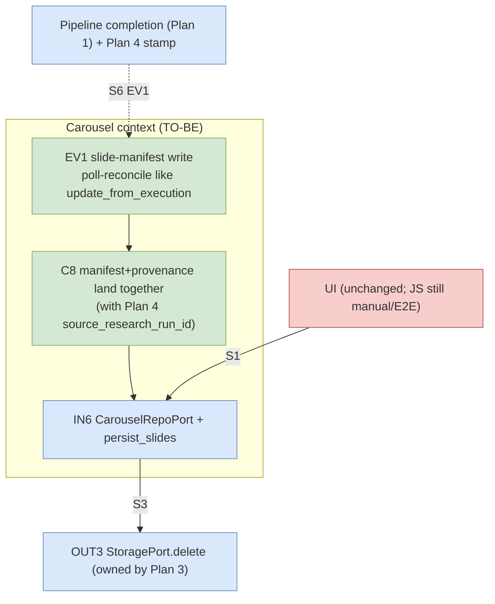

# Carousel Review UI + Authed Carousel Routes — TDD Implementation Plan

> **Plan 6 of 6** for the Carousel Image Pipeline PRD
> (`2026-07-11-prd-carousel-image-pipeline-and-research-handoff.md`).
> **Scope:** PRD §7 **ISC-37 … ISC-45, ISC-49, ISC-50, ISC-51, ISC-52, ISC-A3** and the
> §11 tracker row 6.
> **Seams this plan OWNS (per PRD §11 seam-ownership + the Plan-3 loop note):**
> the authed carousel routes (`POST /carousels` create, `GET /carousels/{id}`,
> `POST /carousels/{id}/slides/{idx}/recreate`, `POST /carousels/{id}/finalize`,
> `POST /carousels/{id}/cancel`), the `CarouselRepoPort` + carousel/slide read-model
> persistence, and the **REAL `SlideRefResolverPort`** (Plan 3 introduced the port + a
> fail-closed placeholder; the real carousel-backed resolver is defined here so Plan 3's
> image route works in prod).
>
> **Cross-plan ownership resolved (2026-07-11 review — no further delegation):**
> - **Persisted, atomic HQ-recreate cap = Plan 6.** Plan 6 OWNS `CarouselRepoPort` persistence,
>   therefore Plan 6 OWNS the durable cap: a repo-backed **atomic** `register_hq_recreate` (check-
>   and-increment, register-after-success, per-carousel, survives across HTTP requests) backing
>   Plan 2's `HqRecreateGuard` protocol, plus a cross-request closure test. Plan 2 provides the
>   in-memory policy/semantics; Plan 6 provides the durable store. (Ends the Plan 2↔6 ping-pong.)
> - **Recreate dep-resolution + `OPENROUTER_API_KEY` gate = Plan 6.** The recreate handler resolves
>   `None` provider/storage → real impls and applies the key gate BEFORE calling Plan 2's
>   `recreate_slide` (Plan 2 CI-1 obligation 1; mirrors Plan 1 Behavior 8b/G6). Owned here.
> - **Real `ObjectStorage.delete` = Plan 6 (extends Plan 3's `StoragePort`).** Cancel needs object
>   deletion now, so Plan 6 defines the REAL `ObjectStorage.delete` (S3 `delete_object`) + the
>   `StoragePort.delete` protocol method (Plan 3 §142 deferred it here); fold back into Plan 3's
>   port if it re-spins.
> - **Provenance wire-key = `research_run_id`.** Plan 5 CANONICAL DECISION (§82-86): `research_run_id`
>   on the API wire → `source_research_run_id` DB column. Applied throughout body/tests/EBNF/seams.
> **Seams this plan CONSUMES (do NOT redefine):**
> - Plan 1 — `research_to_carousel` (text → ordered slide manifest `{run_id, slides:[{idx,
>   image_prompt, image_ref, status}]}`) and `regenerate_slide` (single-slide retry
>   primitive). The create route dispatches `research_to_carousel`; the recreate route mounts
>   Plan 2's logic on top of `regenerate_slide`.
> - Plan 2 — the HQ/note-augmented, cost-guarded **recreate LOGIC** (ISC-17–21/A1/53/54). This
>   plan wires that logic behind an authed route; it does not own the note-compose, HQ-model,
>   or cost-guard behavior.
> - Plan 3 — `StoragePort` (put/presigned_url/**exists** + object deletion), the `FakeStorage`
>   harness fake, the `SlideRefResolverPort` **protocol** and `FakeSlideRefResolver`, and the
>   mounted image route `GET /api/v1/carousels/{cid}/slides/{idx}`.

## Overview

Today the reel-af Cutting Room UI has one flow — DROP FILE / FROM URL → ROLL → poll → download
(`web/index.html:325-328,503,562,586,613`) — and its backend router (`_api_router`,
`web/server.py:212`) matches exactly three route shapes: upload, submit, poll. There is **no**
carousel concept: no carousel routes, no carousel persistence, and Plan 3's image route
(`GET /carousels/{cid}/slides/{idx}`) currently depends on a **fail-closed placeholder**
`SlideRefResolverPort` (`default_deps().slides = _Unconfigured(...)`, Plan 3 Behavior 4) — so in
production the image route 503s until this plan lands the real resolver.

This plan builds the carousel **review** surface and the **authed routes** behind it, as a set
of smallest testable behaviors. The routes are the automatable core; the vertical-scroll viewer,
per-image recreate control, and Cancel/Create buttons are **manual/E2E** (no JavaScript test
harness exists in this repo — see **Testing Strategy**).

The route behaviors reuse the existing tenancy backbone **exactly** as the submit/poll handlers
do:
- `deps.identity.resolve(request)` yields a server-trusted `AuthContext(user_id, org_id, role)`
  (`web/deps.py:97-104`), **never** from the body — every new route calls it **first** (ISC-49).
- `build_submission`'s `_reject_forbidden_identity` rejects `FORBIDDEN_IDENTITY_FIELDS`
  (`web/reel_jobs.py:32-45,73-76`) at top level and under `input`; the carousel create body is
  validated the same way (ISC-50).
- Cross-org concealment mirrors `RoleAccessGuard.authorize_reel_read` — a foreign-org row raises
  `NotFound` → **404, not 403** (`web/deps.py:177-179`) (ISC-51).
- Idempotency mirrors `_client_request_id` + `insert_or_get_queued` — the `Idempotency-Key`
  header dedups create (`web/server.py:67-74,148-161`) (ISC-52).
- The control-plane client (`web/control_plane.py:1-8,26-31`) already builds its own headers and
  never forwards `Cookie`/`Authorization`; the create route dispatches `research_to_carousel`
  through that same identity-free client (ISC-A3, an anti-behavior verified by the existing
  header discipline plus a regression assertion).

Two route behaviors are **BLOCKING workflow closures** (per PRD prompt + §2.5): **create → the
slides are subsequently fetchable via `GET /carousels/{id}`** (create writes a read-model a
*different* read path serves), and **finalize → a terminal `succeeded` state** (a write one path
makes, read back through the production read path). Both are derived from the Workflow Closure
Map below, not invented.

## Current State Analysis

### Key Discoveries

- **Route table is a three-shape router.** `_api_router` (`web/server.py:212-222`) dispatches
  `_is_upload` / `_submit_target` / `_poll_id` (pure predicates, `server.py:46-61`), else
  `_not_found()` (`server.py:207`, 404). New carousel predicates + handlers mount here, **before**
  `_not_found`, exactly like Plan 3's `_slide_target` branch.
- **Submit handler is the auth+idempotency template.** `_handle_submit` (`server.py:148-185`):
  `identity.resolve` → `authorize_create` → `build_submission` (400 incl. forbidden identity) →
  `_client_request_id` → `insert_or_get_queued` (idempotency; `ref.created` False → no second
  dispatch) → `dispatch_async` (identity-free `{input}`) → `attach_execution_id`. The carousel
  create handler follows this shape, dispatching `reel-af.reel_research_to_carousel`.
- **Idempotency key resolution.** `_client_request_id(deps, body)` (`server.py:67-74`): header
  `Idempotency-Key`, else `input.client_request_id`, else a server uuid (no dedup). Dedup key is
  `(org_id, created_by, client_request_id)` (`pg.py:199-207`). `_idempotent_response`
  (`server.py:77-86`) returns 202 (execution attached / terminal) or 409 pending + `Retry-After`.
- **Concealment precedent.** `RoleAccessGuard.authorize_reel_read` (`deps.py:177-179`): foreign
  `org_id` → `NotFound("job not found")` (404). Poll applies it (`server.py:198`);
  `tests/web/test_poll.py` asserts the 404/no-CP behavior. Carousel GET / recreate / finalize /
  cancel conceal cross-org the same way (ISC-51).
- **Persistence pattern to mirror.** `PgReelJobRepo` (`pg.py:185-309`): every read/write is
  `... where ... and org_id = %s`; `insert_or_get_queued` uses
  `on conflict (org_id, created_by, client_request_id) do nothing returning id` for durable
  idempotency; `get_by_execution` (`pg.py:250-269`) raises `NotFound` on absent/foreign;
  `update_from_execution` (`pg.py:271-283`) enforces terminal monotonicity in SQL
  (`status not in ('succeeded','failed','cancelled')`). `REQUIRED_SCHEMA` (`pg.py:35-46`) is the
  fail-closed schema gate. A **new `carousel` + `carousel_slide` read-model** is added to the
  shared `deepresearch` schema surface, org-scoped identically.
- **Ports + container + fail-closed.** `web/deps.py:110-159` typed `@runtime_checkable Protocol`
  ports; `AppDeps` container (`deps.py:201-210`) — Plan 3 added `storage: StoragePort` and
  `slides: SlideRefResolverPort`; `default_deps()` (`deps.py:213-241`) builds import-safe
  adapters; `_Unconfigured` (`deps.py:185-195`) is the fail-closed placeholder Plan 3 wired into
  `default_deps().slides`. This plan adds `carousels: CarouselRepoPort` and **replaces** the
  `slides` placeholder with a real `CarouselSlideRefResolver` backed by `CarouselRepoPort`.
- **`SlideRefResolverPort` contract (Plan 3, `deps.py` after Plan 3).** `resolve(ctx,
  carousel_id, slide_idx) -> str` returns the stored media ref for `(cid, idx)` **iff** it belongs
  to `ctx.org_id`; raises `NotFound` (404) to conceal cross-org / absent. Plan 3's route depends
  only on this port. This plan's real resolver reads the ref off the carousel read-model.
- **Control-plane identity-free discipline (ISC-A3).** `HttpControlPlane._headers`
  (`control_plane.py:26-31`) sets only `Content-Type` + server-side `X-API-Key`; `_HOP_BY_HOP`
  strips hop headers; the browser `Cookie`/`Authorization` never reach the node. The carousel
  create dispatch reuses this client, so no code path forwards identity to the control plane.
- **UI config + film tokens.** `web/index.html:12-64` in-file `#config` JSON (presets carry
  `kind`, e.g. `"topic"`; Plan 1 adds `kind: "carousel"`); CSS design tokens at
  `index.html:66-296` (`--film`, `--film-2`, `--film-3`, type scale, etc.). The review UI reuses
  these tokens/components (ISC-45) and its copy/tunables live in `#config` (the one-jump rule),
  not scattered literals.
- **ReelJob statuses.** `ReelJobStatus = queued|producing|succeeded|failed|cancelled`
  (`reel_jobs.py:18`); `TERMINAL_STATUSES` (`reel_jobs.py:193`). The carousel read-model reuses
  the same status vocabulary (`draft` → `succeeded`/`cancelled`); `succeeded`/`cancelled` are
  terminal.
- **Test harness.** `tests/web/conftest.py`: `WEB` on `sys.path`; `FakeIdentity`,
  `FakeReelJobRepo`, `FakeUploadStore`, `FakeControlPlane`, `FixedClock`, `make_ctx(role)`,
  `make_deps(...)`; fixed `ORG_ID`/`USER_ID`/`FIXED_JOB_ID`. Plan 3 adds `FakeStorage` +
  `FakeSlideRefResolver`. Route tests: `server.create_app(deps, enable_supertokens=False)
  .test_client()`. Idempotency test precedent: `tests/web/test_dispatch.py:26-70`. This plan adds
  `FakeCarouselRepo`, threads `carousels`/`slides` through `make_deps`, and writes
  `tests/web/test_carousel_routes.py`.
- **Closure precedent.** `tests/test_finish_closure.py` (repo BLOCKING integration test) and Plan
  3's `test_slide_route.py` closure: real mechanics, fakes only at true boundaries, fail-closed
  (never skip-to-green) when infra absent.

### Files touched (declared blast radius)

- `web/deps.py` — add `CarouselRepoPort` protocol (incl. atomic `register_hq_recreate`); add
  `carousels: CarouselRepoPort` + `research_runs` (Plan-4 tenancy port, consumed) to `AppDeps`; add
  `StoragePort.delete` (extends Plan 3's port, Critical #4); in `default_deps()` wire
  `PgCarouselRepo()` and **replace** the `slides` `_Unconfigured` placeholder with
  `CarouselSlideRefResolver(repo)`.
- `web/reel_jobs.py` — add `research_run_id` + `source_research_run_id` to `_CP_STRIP`
  (`reel_jobs.py:89`) so provenance never leaks into `cp_input` (Critical #3).
- `web/uploads.py` (or Plan 3's `ObjectStorage` module) — add the REAL `ObjectStorage.delete`
  (S3 `delete_object`, `_bucket()`-first fail-closed), Critical #4.
- `web/carousels.py` — **new**; carousel domain: `CarouselCreate` validation (reuses
  `_reject_forbidden_identity`), the `CarouselSlideRefResolver` (real `SlideRefResolverPort`), the
  create→dispatch→persist orchestration helper, finalize/cancel state logic.
- `web/pg.py` — add `carousel` + `carousel_slide` to `REQUIRED_SCHEMA` with **enumerated columns**
  (fail-closed gate, mirroring `reel_job`'s explicit set `pg.py:41-45`):
  `"carousel": {"id","org_id","created_by","status","source_research_run_id","hq_recreate_count","created_at"}`,
  `"carousel_slide": {"carousel_id","org_id","idx","image_ref","prompt","status"}`; add
  `PgCarouselRepo` (org-scoped CRUD mirroring `PgReelJobRepo`) incl. the atomic
  `register_hq_recreate` SQL (`update carousel set hq_recreate_count = hq_recreate_count + 1 where
  id=%s and org_id=%s and hq_recreate_count < %s returning hq_recreate_count`; no row → cap error).
- `web/server.py` — add carousel route predicates (`_carousel_create` /`_carousel_get` /
  `_carousel_recreate` /`_carousel_finalize` /`_carousel_cancel`) + handlers, mounted on
  `_api_router` before `_not_found`.
- `web/index.html` — carousel review surface (scroll viewer + per-slide recreate + top-right
  Cancel/Create) reusing film tokens; new `#config` copy/route keys. **(Manual/E2E — no JS test.)**
- `tests/web/conftest.py` — add `FakeCarouselRepo`; thread `carousels`/`slides` through
  `make_deps`.
- `tests/web/test_carousel_routes.py` — **new**; route unit + the two closure tests (Flask client
  + fakes).
- `tests/web/integration/test_carousel_repo.py` — **new**; `@pytest.mark.integration` live-Postgres
  SQL contract for `PgCarouselRepo` (org-scoped reads/writes), not in the default run.
- `migrations/deepresearch/` (root-owned) — **reference only**; the `carousel`/`carousel_slide`
  tables are applied by the root migration process. This plan asserts the schema surface via
  `REQUIRED_SCHEMA` and fails closed (503) until applied; it does **not** vendor the migration
  (mirrors `pg.py:1-12` "consumes, never owns").

## Desired End State

- `CarouselRepoPort` is a typed seam in `web/deps.py`; `AppDeps.carousels` exists and is wired by
  `default_deps()`; `default_deps().slides` is now the **real** `CarouselSlideRefResolver` (no
  longer `_Unconfigured`), so Plan 3's image route serves in prod.
- `POST /api/v1/carousels {source_text, research_run_id?, preset}` → auth →
  `authorize_create` → identity-field rejection → **`research_run_id` UUID-coercion (400 on
  malformed) + Plan-4 tenancy-check (cross-org → 404)** → idempotency → persist a `draft` carousel
  (mapping wire `research_run_id` → the `source_research_run_id` DB column) + dispatch
  `research_to_carousel` → returns `{carousel_id, status, execution_id}`. The wire key is
  **`research_run_id`** (Plan 5 CANONICAL DECISION §82-86: `research_run_id` on the API wire →
  `source_research_run_id` column/field); both keys are added to `_CP_STRIP`
  (`reel_jobs.py:89`) so neither leaks into the reasoner `input`.
- `GET /api/v1/carousels/{id}` → org-scoped read → `{status, slides:[{idx, image_ref, prompt,
  status}]}`; cross-org → 404.
- `POST /api/v1/carousels/{id}/slides/{idx}/recreate {note}` → auth → **`authorize_create` (paid
  write intent)** → org-scoped concealment → **resolve `None` provider/storage → real impls +
  `OPENROUTER_API_KEY` gate (503 if unset) BEFORE Plan 2's `recreate_slide`** → mounts Plan 2's
  recreate logic on `regenerate_slide` (backed by the **repo-backed atomic `HqRecreateGuard`** this
  plan owns) → replaces exactly that slide's ref → returns the replaced slide; cross-org → 404;
  `(cap+1)`th HQ recreate → cap error.
- `POST /api/v1/carousels/{id}/finalize` → org-scoped → terminal `succeeded` (idempotent,
  monotonic); cross-org → 404.
- `POST /api/v1/carousels/{id}/cancel` → org-scoped → terminal `cancelled` + **deletes** the draft
  slides' `StoragePort` objects; cross-org → 404.
- The review UI (manual) shows a vertical scrollable ordered list of slides, per-slide recreate
  with a note, in-place replacement, and top-right Cancel/Create, all on the film-house tokens.

### Observable Behaviors

**Routes (automated):**
- ISC-49 — every new route calls `identity.resolve` **before** any repo/CP/storage call; no
  session → 401 before work.
- ISC-50 — an identity field in the create body (top level or under `input`) → 400
  `forbidden_field`, no persist, no dispatch.
- ISC-51 — a carousel owned by org A, requested/recreated/finalized/cancelled by org B → 404
  (concealed), no state change, no URL minted.
- ISC-52 — `POST /carousels` with a repeated `Idempotency-Key` does not create a second carousel
  or dispatch twice (202/409 like submit).
- ISC-43 (**BLOCKING**) — finalize drives the carousel to terminal `succeeded`, read back through
  `GET /carousels/{id}`.
- ISC-44 (**BLOCKING closure**) — cancel discards the carousel (terminal `cancelled`) **and**
  deletes its draft slide objects via `StoragePort`.
- Create (**BLOCKING**) — after create, the slides the pipeline wrote are fetchable through
  `GET /carousels/{id}` and (via the real `SlideRefResolver`) Plan 3's image route.
- ISC-A3 (anti) — the create dispatch to the control plane carries no `Cookie`/`Authorization`;
  `research_to_carousel` is dispatched through the identity-free client only.

**UI (manual/E2E — no JS harness):**
- ISC-37 — a vertical scrollable area lists carousel images in generation order.
- ISC-38 — each image exposes a recreate control accepting a note.
- ISC-39 — submitting a recreate shows an in-progress state on that image.
- ISC-40 — a recreated image replaces the original in place on completion.
- ISC-41 — a Cancel button is present in the top-right of the scroll area.
- ISC-42 — a Create button is present in the top-right of the scroll area.
- ISC-45 — the new UI reuses existing film-house CSS tokens/components.

## What We're NOT Doing

- **Not** building the carousel generation pipeline / `research_to_carousel`, the text→`Essence`
  seam, the `carousel-default` preset, or `generate_first_frame(model=, crop=)` — **Plan 1**. We
  dispatch and read its output.
- **Not** building the HQ-model, note-compose, or cost-guard recreate LOGIC (ISC-17–21/A1/53/54) —
  **Plan 2**. We mount it behind the recreate route.
- **Not** building `StoragePort` / `ObjectStorage` / presigned URLs / the image-serving route —
  **Plan 3**. We implement the real `SlideRefResolverPort` it depends on, and call `StoragePort`
  delete on cancel.
- **Not** building the Create-from-research routes/UI (`/research/run`, `/research/{id}`, the
  Automatic/Full-control flow, ISC-28–36) — **Plan 5**; nor the authoritative research provenance
  stamping / `research_run` row (ISC-22–27) — **Plan 4**. We accept an optional **`research_run_id`**
  on create (Plan 5 CANONICAL wire key), UUID-coerce it, tenancy-check it via Plan 4's
  `get_research_run`, map it onto the `source_research_run_id` DB field, and keep it out of
  `cp_input` — but do **not** own the provenance *meaning* or the `research_run` table.
- **Not** authoring a JavaScript unit-test harness — none exists; UI behaviors are manual/E2E.
- **Not** changing SuperTokens config, `FORBIDDEN_IDENTITY_FIELDS`, or the tenancy schema beyond
  adding the org-scoped `carousel`/`carousel_slide` read-model.
- **Not** vendoring the root `deepresearch` migration (consumed, not owned).

## Testing Strategy

- **Framework:** `pytest` + `pytest-asyncio`; focused `uv run pytest tests/web/test_carousel_routes.py -q`;
  lint `uv run ruff check web/ tests/web/`. Live-Postgres SQL contract tests are marked
  `@pytest.mark.integration` (`tests/web/integration/test_carousel_repo.py`) and are **not** in the
  default run.
- **Unit — routes (`test_carousel_routes.py`):** Flask test client + fakes (`FakeIdentity`,
  `FakeCarouselRepo`, `FakeStorage`, `FakeControlPlane`, `FakeResearchRuns`) via `make_deps`. Cover:
  auth-before-work (401), identity-field rejection (400), cross-org 404 on every route, idempotent
  create (202/409), **idempotent replay returns `carousel_id` not `job_id`** (Crit #5),
  **`research_run_id` wire-key: UUID-coerce/400-malformed, cross-org 404, stripped-from-`cp_input`**
  (Crit #3), recreate replaces one slide, **recreate 503-no-spend when `OPENROUTER_API_KEY` unset**
  (Crit #2), **cross-request HQ-cap: `(cap+1)`th rejected via persisted `register_hq_recreate`**
  (Crit #1), finalize→succeeded, cancel→cancelled + storage delete, and the A3
  no-identity-forwarding regression.
- **Closure — routes (`test_carousel_routes.py`, BLOCKING):** two derived closure tests
  (create→GET-slides, finalize→succeeded) driving the **real** chain through the mounted `/api/*`
  entrypoint, fakes only at true boundaries (control plane, storage), asserting the user-visible
  read path; each with a red-at-seam proof. See **Workflow Closure**.
- **`SlideRefResolverPort` conformance:** `CarouselSlideRefResolver` satisfies the Plan-3
  `@runtime_checkable SlideRefResolverPort`, and `default_deps().slides` is an instance of it
  (not `_Unconfigured`) — so Plan 3's `test_slide_route.py` closure resolves against a real
  carousel in production.
- **Integration (`integration/test_carousel_repo.py`, `@pytest.mark.integration`):** real
  `PgCarouselRepo` round-trip against a live `deepresearch` schema — insert draft, read
  org-scoped, cross-org read returns None/NotFound, finalize monotonicity. Fail-closed (red) if a
  configured DB is unreachable; never skip-to-green.
- **UI (manual/E2E only — stated per behavior):** no JS test harness; ISC-37–42/45 are verified in
  a browser against a live carousel (deploy checklist), documented under each behavior's Manual
  criteria.
- **Mocking/Setup:** fakes for all ports (harness); `ORG_ID`/`USER_ID` fixed UUIDs; a second
  random org for cross-org tests (`object.__setattr__(ctx, "org_id", uuid.uuid4())`, the Plan-3
  cross-org pattern).

## Workflow Closure

Two BLOCKING closures (PRD prompt): **create→GET-slides** and **finalize→succeeded**. Cancel's
storage-delete side effect (ISC-44) is also a cross-module effect and is closure-asserted. Derived
from the map below, not invented.

### Production Operation Chain — Create → slides fetchable

`browser POST /api/v1/carousels {source_text, preset}` → `create_app` `/api/<path>` route
(`server.py:347-353`) → `_api_router` (`server.py:212`) → `_carousel_create` predicate (new) →
`_handle_carousel_create` (new): `identity.resolve` → `authorize_create` → validate/reject
identity → `_client_request_id` → `carousels.insert_or_get_draft(ctx, ...)` (org-scoped,
idempotent) → `control_plane.dispatch_async("reel-af.reel_research_to_carousel", {input})`
(identity-free) → `attach_execution_id` → **on pipeline completion the slide manifest is persisted
as `carousel_slide` rows** → `GET /api/v1/carousels/{id}` → `carousels.get(ctx, id)` (org-scoped)
→ **`{status, slides:[{idx, image_ref, prompt, status}]}`** the browser renders; each `image_ref`
is served by Plan 3's image route via the real `CarouselSlideRefResolver`.

### Closure Test: "after create, the owner reads the carousel's ordered slides back; another org gets 404"   [BLOCKING: OBSERVABLE crosses the new `_api_router` carousel registration + `CarouselRepoPort` module boundary; slides are written by one path (create/pipeline-persist) and read by a different path (GET)]

- **SOURCE (seed only):** the create request body (`source_text`, `preset`, `Idempotency-Key`) and
  the slide manifest the pipeline produces (seeded into `FakeCarouselRepo` at the persist boundary,
  standing in for Plan 1's `research_to_carousel` output — that generation is Plan 1's closure, not
  re-run here).
- **TRIGGER (start):** the mounted Flask route `POST /api/v1/carousels` then `GET
  /api/v1/carousels/{id}` via the test client (`server.create_app(deps,
  enable_supertokens=False).test_client()`). boundary = `highest_new_connector` — the `_api_router`
  carousel branches this slice adds (`server.py:212`); starting at the HTTP entrypoint crosses them.
- **DRIVERS (async edges):** the create→pipeline dispatch is async in production (control plane +
  `research_to_carousel`); the test drives it synchronously by seeding the persisted slide
  manifest at the repo boundary (the `FakeControlPlane` returns an `execution_id`; the
  `FakeCarouselRepo` is seeded with the completed slides) — **no sleep, no mock of the route span**.
- **OBSERVE (assert via):** the `GET /carousels/{id}` HTTP response — `resp.status_code == 200`,
  `resp.get_json()["slides"]` is ordered `0..N-1`, each carrying `idx`/`image_ref`/`prompt`/`status`
  (the production read path the browser uses). Cross-org `GET` → `404`, `slides` never returned.
- **FORBIDDEN SPAN:** `_handle_carousel_create` / `_handle_carousel_get` internals,
  `carousels.insert_or_get_draft`/`get`, and `CarouselSlideRefResolver` — the test never calls,
  imports, or mocks any of them; it drives only the two HTTP entrypoints and reads only the HTTP
  responses. No raw store reads.
- **RED-AT-SEAM proof:** disable the registration — remove the `_carousel_get` branch from
  `_api_router` (route falls to `_not_found()` → 404) — the owner read-back assertion `status_code
  == 200` goes **red**. Re-add the branch → green. Record the transition.
- **DRIVABILITY:** store seam present (always) — `CarouselRepoPort` + `StoragePort` injected via
  `AppDeps`, seeded through their fakes; control plane injected (`FakeControlPlane`). The create→GET
  span the *test* drives is synchronous (seeded manifest) → no clock/driver seam needed inside the
  span. All required seams present → drivable.
- **EXECUTION (must run):** runs in the default `uv run pytest tests/web/test_carousel_routes.py`
  with **no external infra** — every boundary is a harness fake; the closure test **always
  executes** (never `skip`). The live-Postgres `PgCarouselRepo` contract lives in `integration/`
  behind `@pytest.mark.integration` and fails-closed (red) if a configured DB is unreachable.

### Production Operation Chain — Finalize → terminal `succeeded`

`browser POST /api/v1/carousels/{id}/finalize` → `_api_router` → `_carousel_finalize` (new):
`identity.resolve` → `carousels.get(ctx, id)` (org-scoped; 404 conceals cross-org) →
`carousels.set_status(ctx, id, "succeeded")` (monotonic — never downgrade a terminal row, mirrors
`update_from_execution` SQL, `pg.py:279-280`) → `GET /api/v1/carousels/{id}` shows `status ==
"succeeded"`.

### Closure Test: "finalize makes the carousel terminally succeeded, read back through GET; a foreign org cannot finalize"   [BLOCKING: OBSERVABLE (terminal status via the GET read path) is produced by a write on the finalize path and read by a different path, across the new registration + `CarouselRepoPort` boundary]

- **SOURCE (seed only):** a `draft` carousel owned by `ORG_ID` seeded into `FakeCarouselRepo`.
- **TRIGGER (start):** `POST /api/v1/carousels/{id}/finalize` via the test client. boundary =
  `highest_new_connector` — the `_carousel_finalize` branch (`server.py:212`).
- **DRIVERS (async edges):** none — finalize is a synchronous request → org-scope check → status
  write. No clock/driver seam required (framework §9: clock demanded IFF span async).
- **OBSERVE (assert via):** a subsequent `GET /api/v1/carousels/{id}` — `status == "succeeded"`
  (the production read path). Finalize is **idempotent**: a second finalize is 200 and status
  stays `succeeded`; a cancelled carousel cannot be finalized (monotonicity → stays `cancelled`).
  Cross-org finalize → `404`, status unchanged.
- **FORBIDDEN SPAN:** `_handle_carousel_finalize` internals, `carousels.get`/`set_status` — the
  test drives only the finalize + GET HTTP entrypoints and reads only responses. No raw store read.
- **RED-AT-SEAM proof:** disable the registration — remove the `_carousel_finalize` branch (route
  → 404) — the "status becomes succeeded" assertion goes **red**. Re-add → green. Record.
- **DRIVABILITY:** `CarouselRepoPort` injected + seeded (always); span synchronous → no clock.
  Drivable.
- **EXECUTION (must run):** default web run, all-fakes; always executes, never skips. Live SQL
  monotonicity in `integration/` (fail-closed).

### Cancel side-effect assertion (ISC-44)

Cancel is closure-checked in the same style: `POST /carousels/{id}/cancel` → org-scope → status
`cancelled` (read back via GET) **and** `deps.storage` recorded a delete for each draft slide's
ref (`FakeStorage.deleted == [ref-0, ref-1, ...]`). Cross-org cancel → 404, no status change, no
storage delete. (LEAF/BLOCKING: the status read-back is BLOCKING like finalize; the storage-delete
is a same-request synchronous side effect asserted directly — no async edge.)

---

## Behavior 1: `CarouselRepoPort` seam + real `SlideRefResolverPort` wiring   [LEAF]

**LEAF reason:** protocol conformance + container wiring are verified by direct `isinstance`/
attribute assertions in-module; no async/registration edge.

### Test Specification

**Given** the port definitions, **when** `PgCarouselRepo` / `FakeCarouselRepo` and
`CarouselSlideRefResolver` are checked, **then** the repos satisfy `CarouselRepoPort`, the
resolver satisfies the Plan-3 `SlideRefResolverPort`, and `default_deps()` populates
`AppDeps.carousels` **and** sets `AppDeps.slides` to a `CarouselSlideRefResolver` (no longer
`_Unconfigured`) with **no I/O at construction** (B1).

**Edge Cases:** import of `deps`/`carousels`/`pg` performs no DB connect; `default_deps()` builds
lazily.

**Files touched:** `web/deps.py`, `web/carousels.py`, `web/pg.py`, `tests/web/test_carousel_routes.py`.

### 🔴 Red
**File:** `tests/web/test_carousel_routes.py`
```python
from deps import CarouselRepoPort, SlideRefResolverPort, default_deps, AppDeps, _Unconfigured
from carousels import CarouselSlideRefResolver
from conftest import FakeCarouselRepo

def test_repo_and_resolver_satisfy_ports():
    assert isinstance(FakeCarouselRepo(), CarouselRepoPort)
    assert isinstance(CarouselSlideRefResolver(FakeCarouselRepo()), SlideRefResolverPort)

def test_default_deps_wires_carousels_and_real_slide_resolver(monkeypatch):
    deps = default_deps()                                   # no DB/network at build
    assert isinstance(deps, AppDeps)
    assert isinstance(deps.carousels, CarouselRepoPort)
    assert isinstance(deps.slides, CarouselSlideRefResolver)   # NOT _Unconfigured (Plan 3 placeholder replaced)
    assert not isinstance(deps.slides, _Unconfigured)
```

### 🟢 Green
**File:** `web/deps.py` (add alongside existing ports; keep Plan-3 `SlideRefResolverPort`)
```python
@runtime_checkable
class CarouselRepoPort(Protocol):
    def ensure_ready(self) -> None: ...
    def insert_or_get_draft(self, ctx, create, carousel_id, now, client_request_id): ...
    def attach_execution_id(self, ctx, carousel_id, execution_id): ...
    def get(self, ctx, carousel_id): ...                       # 404 (NotFound) if absent/foreign
    def slide_ref(self, ctx, carousel_id, slide_idx) -> str: ...  # backs SlideRefResolverPort
    def replace_slide(self, ctx, carousel_id, slide_idx, ref, prompt, status): ...
    def set_status(self, ctx, carousel_id, status): ...        # monotonic terminal
    def draft_slide_refs(self, ctx, carousel_id) -> list[str]: ...  # for cancel storage-delete
    def register_hq_recreate(self, ctx, carousel_id) -> int: ...    # ATOMIC check-and-increment;
                                                                    # raises HqRecreateCapError on (cap+1)th
```
> **Cap ownership (Critical #1):** `register_hq_recreate` backs Plan 2's `HqRecreateGuard.register`
> with a durable, **atomic** counter — SQL `update carousel set hq_recreate_count =
> hq_recreate_count + 1 where id = %s and org_id = %s and hq_recreate_count < %s returning
> hq_recreate_count` (the `< cap` clause makes check-and-increment atomic; two concurrent recreates
> cannot both pass a stale read). Register-after-success (called only when `regenerate_slide`
> returns `status == "ok"`, per Plan 2 §156-161); no row updated → cap exhausted → `HqRecreateCapError`.
> `FakeCarouselRepo` models the same semantics in-memory. This is Plan 6's persistence obligation
> (Plan 2 §205-225 obligation 2) — **not** delegated back to Plan 2.
Add `carousels: CarouselRepoPort` to `AppDeps`; in `default_deps()`:
```python
    from carousels import CarouselSlideRefResolver
    from pg import PgCarouselRepo
    ...
    carousels = PgCarouselRepo()                 # 503 until deepresearch.carousel applied
    return AppDeps(
        ...,
        carousels=carousels,
        slides=CarouselSlideRefResolver(carousels),   # REAL resolver replaces Plan-3 _Unconfigured
    )
```
**File:** `web/carousels.py`
```python
class CarouselSlideRefResolver:
    """Real SlideRefResolverPort (Plan 3 seam). Reads the media ref off the
    org-scoped carousel read-model; NotFound (404) conceals cross-org/absent."""
    def __init__(self, repo):
        self._repo = repo
    def resolve(self, ctx, carousel_id: str, slide_idx: int) -> str:
        return self._repo.slide_ref(ctx, carousel_id, slide_idx)  # raises NotFound (404)
```

### 🔵 Refactor
- [ ] **Fits existing patterns:** ports are `@runtime_checkable Protocol` like `deps.py:110-159`;
  `CarouselRepoPort` mirrors `ReelJobRepoPort`'s shape (`ensure_ready` + org-scoped methods).
- [ ] **No shallow wrapper:** `CarouselSlideRefResolver` is a thin adapter by design (it exists to
  satisfy a foreign port); its one method delegates to the repo's org-scoped `slide_ref` — the real
  concealment logic lives in the repo, not duplicated here.
- [ ] **No I/O at construction:** `PgCarouselRepo()` connects lazily (mirror `PgReelJobRepo`).

### Success Criteria
**Automated:**
- [ ] Port conformance + `default_deps` wiring pass; `deps.slides` is real (not `_Unconfigured`):
  `uv run pytest tests/web/test_carousel_routes.py -k port -q`
- [ ] Import of `deps`/`carousels`/`pg` performs no network
- [ ] `uv run ruff check web/deps.py web/carousels.py` clean

**Manual:**
- [ ] With Plan 3 present, its `test_slide_route.py` closure resolves against a real carousel

---

## Behavior 2: create — auth-before-work + identity-field rejection (ISC-49, ISC-50)   [LEAF]

**LEAF reason:** the 401/400 are raised before any repo/CP call, observed directly at the route
boundary; no async edge, no read-model round-trip.

### Test Specification

**Given** no session, **when** `POST /api/v1/carousels`, **then** **401** before any
carousel-repo or control-plane call (auth-before-work, mirroring `test_poll.py`). **Given** a body
carrying an identity field (`org_id` top level, or under `input`), **then** **400
`forbidden_field`**, no persist, no dispatch (mirrors `_reject_forbidden_identity`,
`reel_jobs.py:73-76`).

**Edge Cases:** a role that cannot create (`viewer`) → **403 `denied`** via `authorize_create`
(`deps.py:173-175`); missing `source_text` → **400 `invalid_source_text`**.

**Files touched:** `web/server.py`, `web/carousels.py`, `tests/web/test_carousel_routes.py`.

### 🔴 Red
```python
import server, uuid
from conftest import ORG_ID, make_ctx, make_deps, FakeIdentity, FakeCarouselRepo, FakeControlPlane
from deps import Unauthorized

CREATE = "/api/v1/carousels"
def _client(deps): return server.create_app(deps, enable_supertokens=False).test_client()

def test_create_no_session_is_401_before_work():
    repo, cp = FakeCarouselRepo(), FakeControlPlane()
    deps = make_deps(identity=FakeIdentity(error=Unauthorized("no session")),
                     carousels=repo, control_plane=cp)
    r = _client(deps).post(CREATE, json={"source_text": "doc", "preset": "carousel-default"})
    assert r.status_code == 401
    assert repo.inserted == [] and cp.dispatch_calls == []

def test_create_rejects_identity_field():
    repo, cp = FakeCarouselRepo(), FakeControlPlane()
    deps = make_deps(identity=FakeIdentity(make_ctx()), carousels=repo, control_plane=cp)
    r = _client(deps).post(CREATE, json={"source_text": "doc", "preset": "carousel-default",
                                         "input": {"org_id": str(uuid.uuid4())}})
    assert r.status_code == 400 and r.get_json()["code"] == "forbidden_field"
    assert repo.inserted == [] and cp.dispatch_calls == []
```

### 🟢 Green
**File:** `web/carousels.py`
```python
from deps import BadRequest
from reel_jobs import _reject_forbidden_identity   # reuse the SAME identity guard

def build_carousel_create(body: dict):
    if not isinstance(body, dict):
        raise BadRequest("body must be a JSON object", code="invalid_json")
    _reject_forbidden_identity(body)
    payload = body.get("input")
    if isinstance(payload, dict):
        _reject_forbidden_identity(payload)          # top-level + nested, like build_submission
    text = (body.get("source_text") or "").strip()
    if not text:
        raise BadRequest("source_text must be non-empty", code="invalid_source_text")
    rr = body.get("research_run_id")                             # Plan 5 CANONICAL wire key
    research_run_id = _coerce_research_run_id(rr) if rr else None   # 400 invalid_research_run_id on malformed
    return CarouselCreate(source_text=text, preset=(body.get("preset") or "carousel-default"),
                          source_research_run_id=research_run_id)   # wire research_run_id -> DB field name
```
> **Wire-key (Critical #3):** the body key is **`research_run_id`** (NOT `source_research_run_id` —
> that name is reserved for the `ReelSubmission`/DB column, Plan 5 §82-86). `_coerce_research_run_id`
> does `uuid.UUID(rr)` → 400 `invalid_research_run_id` on a malformed string (JSON delivers it as a
> string; a bad value must fail at the boundary, not the pg adapter — Plan 5 review §89). The
> tenancy-check (`deps.research_runs.get_research_run(ctx, id)` → 404 cross-org, Plan 4 §136) runs in
> `_handle_carousel_create` after validation, before persist — see Behavior 3.
**File:** `web/server.py`
```python
def _handle_carousel_create(deps: AppDeps) -> tuple[Response, int]:
    ctx = deps.identity.resolve(request)           # 401 / 403 / 503 first
    deps.access_guard.authorize_create(ctx)        # 403 fail-closed
    create = build_carousel_create(request.get_json(silent=True))   # 400 incl. forbidden identity
    ...
```
Wire `_carousel_create` predicate into `_api_router` before `_not_found`.

### 🔵 Refactor
- [ ] **No duplication (critical):** identity rejection reuses `reel_jobs._reject_forbidden_identity`
  — do **not** re-author the forbidden-field check. If the import surface feels private, promote it
  to a shared `reject_identity_fields` used by both `build_submission` and `build_carousel_create`.
- [ ] **Reveals intent:** `_handle_carousel_create` reads auth → authorize → validate top-to-bottom,
  identical to `_handle_submit` (`server.py:148-152`).
- [ ] **Fits patterns:** typed `BadRequest`/`Denied` map to 400/403 via the existing `HttpError`
  handler (`server.py:355-357`).

### Success Criteria
**Automated:**
- [ ] 401-before-work + 400-forbidden-field + 403-viewer + 400-missing-text pass:
  `uv run pytest tests/web/test_carousel_routes.py -k create_ -q`
- [ ] `uv run ruff check web/server.py web/carousels.py` clean
- [ ] No new duplication: forbidden-field logic appears once (`grep -c "FORBIDDEN_IDENTITY_FIELDS" web/` unchanged)

**Manual:** none.

---

## Behavior 3: create — idempotent, identity-free dispatch (ISC-52, ISC-A3)   [LEAF]

**LEAF reason:** idempotency dedup + the dispatch body are observed directly off the fake repo /
fake control plane at the route boundary; the create→GET read-model round-trip is the *separate*
BLOCKING closure (Behavior 7).

### Test Specification

**Given** two `POST /api/v1/carousels` with the same `Idempotency-Key`, **when** dispatched,
**then** exactly one carousel is created and `research_to_carousel` is dispatched **once** (second
→ 202 with the same execution / 409 pending — mirrors `test_dispatch.py:32-58`). **Given** any
create, **when** the control plane is called, **then** the dispatched body is `{"input": {...}}`
with **no** identity fields and the target is `reel-af.reel_research_to_carousel`; the call goes
through `deps.control_plane` (the identity-free `HttpControlPlane`), which never forwards
`Cookie`/`Authorization` (ISC-A3).

**Edge Cases:** `Idempotency-Key` absent → server uuid, no dedup (`server.py:74`); wire
`research_run_id` (coerced to `uuid.UUID`, tenancy-checked) maps onto the `source_research_run_id`
field for persistence but is **stripped from `cp_input`** (Plan 4 owns its provenance meaning; the
reasoner never sees it); malformed `research_run_id` → 400; cross-org `research_run_id` → 404.

**Files touched:** `web/server.py`, `web/carousels.py`, `web/reel_jobs.py` (add `research_run_id` +
`source_research_run_id` to `_CP_STRIP`, `reel_jobs.py:89`), `tests/web/test_carousel_routes.py`.

### 🔴 Red
```python
def _post(client, key=None):
    h = {"Idempotency-Key": key} if key else {}
    return client.post(CREATE, json={"source_text": "doc", "preset": "carousel-default"}, headers=h)

def test_same_key_dispatches_research_to_carousel_once():
    repo = FakeCarouselRepo()
    cp = FakeControlPlane(response=(202, {"execution_id": "exec_1"}, {}))
    deps = make_deps(identity=FakeIdentity(make_ctx()), carousels=repo, control_plane=cp)
    client = _client(deps)
    a, b = _post(client, key="K1"), _post(client, key="K1")
    assert a.status_code == 202 and b.status_code == 202
    assert len(cp.dispatch_calls) == 1                          # ISC-52: no second dispatch
    target, body = cp.dispatch_calls[0]
    assert target == "reel-af.reel_research_to_carousel"
    assert "input" in body and not (set(body) & {"org_id", "created_by", "user_id"})   # ISC-A3

def test_dispatch_body_is_identity_free():                      # ISC-A3 regression
    repo = FakeCarouselRepo(); cp = FakeControlPlane(response=(202, {"execution_id": "e"}, {}))
    deps = make_deps(identity=FakeIdentity(make_ctx()), carousels=repo, control_plane=cp)
    _post(_client(deps), key="A")
    _, body = cp.dispatch_calls[0]
    flat = str(body)
    assert "Cookie" not in flat and "Authorization" not in flat and str(ORG_ID) not in flat

def test_research_run_id_wire_key_coerced_stripped_and_tenancy_checked():   # Critical #3
    import uuid as _uuid
    rr = str(_uuid.uuid4())
    repo = FakeCarouselRepo(); cp = FakeControlPlane(response=(202, {"execution_id": "e"}, {}))
    runs = FakeResearchRuns(owned={rr})                         # Plan 4 tenancy port (fake)
    deps = make_deps(identity=FakeIdentity(make_ctx()), carousels=repo,
                     control_plane=cp, research_runs=runs)
    r = _client(deps).post(CREATE, json={"source_text": "doc", "preset": "carousel-default",
                                         "research_run_id": rr})
    assert r.status_code == 202
    # coerced onto the DB field, and STRIPPED from cp_input (never reaches the reasoner)
    _, body = cp.dispatch_calls[0]
    flat = str(body)
    assert rr not in flat and "research_run_id" not in flat and "source_research_run_id" not in flat

def test_malformed_research_run_id_is_400():                    # Critical #3
    repo = FakeCarouselRepo()
    deps = make_deps(identity=FakeIdentity(make_ctx()), carousels=repo)
    r = _client(deps).post(CREATE, json={"source_text": "doc", "preset": "carousel-default",
                                         "research_run_id": "not-a-uuid"})
    assert r.status_code == 400 and r.get_json()["code"] == "invalid_research_run_id"

def test_cross_org_research_run_id_is_404():                    # Critical #3 (Plan 4 §136)
    import uuid as _uuid
    rr = str(_uuid.uuid4())
    repo = FakeCarouselRepo(); cp = FakeControlPlane(response=(202, {"execution_id": "e"}, {}))
    runs = FakeResearchRuns(owned=set())                        # rr owned by nobody in this org
    deps = make_deps(identity=FakeIdentity(make_ctx()), carousels=repo,
                     control_plane=cp, research_runs=runs)
    r = _client(deps).post(CREATE, json={"source_text": "doc", "preset": "carousel-default",
                                         "research_run_id": rr})
    assert r.status_code == 404 and repo.inserted == [] and cp.dispatch_calls == []

def test_idempotent_replay_returns_carousel_id_not_job_id():    # Critical #5
    repo = FakeCarouselRepo(); cp = FakeControlPlane(response=(202, {"execution_id": "e"}, {}))
    deps = make_deps(identity=FakeIdentity(make_ctx()), carousels=repo, control_plane=cp)
    client = _client(deps)
    a, b = _post(client, key="R1"), _post(client, key="R1")
    assert "carousel_id" in b.get_json() and "job_id" not in b.get_json()
    assert a.get_json()["carousel_id"] == b.get_json()["carousel_id"]
```
> **Note:** `FakeResearchRuns` (Plan 4's tenancy port fake) is threaded through `make_deps` as
> `research_runs`; `get_research_run(ctx, id)` raises `NotFound` (→404) unless `id in owned` for
> `ctx.org_id`. If Plan 4 has not shipped it, this plan adds the minimal fake + a `research_runs`
> slot to `AppDeps`, flagged in **Open Seams** (consumed, not owned — Plan 4 owns the real port).

### 🟢 Green
**File:** `web/server.py`
```python
TARGET_CAROUSEL = "reel-af.reel_research_to_carousel"

def _handle_carousel_create(deps, ) -> tuple[Response, int]:
    ctx = deps.identity.resolve(request)
    deps.access_guard.authorize_create(ctx)
    create = build_carousel_create(request.get_json(silent=True))
    if create.source_research_run_id:                           # Critical #3 tenancy-check (Plan 4)
        deps.research_runs.get_research_run(ctx, create.source_research_run_id)  # 404 cross-org, before persist
    carousel_id = deps.uuid_factory()
    now = deps.clock.now()
    crid = _client_request_id(deps, request.get_json(silent=True))
    ref = deps.carousels.insert_or_get_draft(ctx, create, carousel_id, now, crid)
    if not ref.created:
        return _idempotent_carousel_response(ref)               # returns carousel_id (NOT job_id) — Critical #5
    cp_body = {"input": create.cp_input()}                      # identity-free + provenance-free
    status, cp, _h = deps.control_plane.dispatch_async(TARGET_CAROUSEL, cp_body)
    ...  # attach_execution_id, mirror _handle_submit error handling
```
> **Idempotent-replay shape (Critical #5):** `_idempotent_response` (`server.py:77-86`) emits a
> **`job_id`** key; a first create returns `carousel_id`. Reusing it verbatim would give a replayed
> create a *different* JSON shape than the first — the UI (double-click Create) could not read
> `carousel_id` back. Define a carousel-specific `_idempotent_carousel_response(ref)` that mirrors
> the 202/409 branching but keys on `carousel_id` (from `ref.job_id`, which `FakeCarouselRepo`
> overloads to carry the carousel id). Add a test: replayed create returns `{carousel_id, status[,
> execution_id]}`, never `job_id`.
>
> **`CarouselCreate.cp_input()` (Critical #3):** returns `{...create fields...}` with identity AND
> `research_run_id`/`source_research_run_id` stripped (mirrors `_clean_input`, `reel_jobs.py:92-94`)
> so the provenance id never rides into the reasoner `input`. Backed by adding both keys to
> `_CP_STRIP` (`reel_jobs.py:89`), asserted in `test_dispatch_body_is_identity_free`.

### 🔵 Refactor
- [ ] **No duplication:** reuse `_client_request_id` (`server.py:67-74`) and `_idempotent_response`
  (`server.py:77-86`) verbatim — the idempotency response shape lives once for reels + carousels.
- [ ] **Reveals intent:** `TARGET_CAROUSEL` is a named constant beside `TARGET_TOPIC`/
  `TARGET_COMPOSITE` (`reel_jobs.py:21-23`); no inline target string.
- [ ] **Fits patterns:** dispatch + error handling mirror `_handle_submit` (`server.py:162-185`);
  A3 is inherited by using `deps.control_plane` (the only CP client) — the regression test guards it.

### Success Criteria
**Automated:**
- [ ] Same-key-once + identity-free-body + A3 regression pass:
  `uv run pytest tests/web/test_carousel_routes.py -k "idempot or identity_free" -q`
- [ ] `uv run ruff check` clean

**Manual:**
- [ ] A double-click Create in the browser does not spawn two carousels

---

## Behavior 4: `GET /carousels/{id}` — org-scoped ordered slides; cross-org 404 (ISC-51)   [LEAF]

**LEAF reason:** the org-scoped read + concealment are observed directly at the route boundary
against the fake repo; the create→read round-trip is Behavior 7's BLOCKING closure.

### Test Specification

**Given** a carousel owned by `ORG_ID` with slides seeded, **when** its owner `GET
/api/v1/carousels/{id}`, **then** **200** with `{status, slides:[{idx, image_ref, prompt,
status}]}` ordered `0..N-1`. **Given** a caller from another org, **then** **404** (concealed),
`slides` never returned (ISC-51).

**Edge Cases:** unknown id → 404; a carousel with a `failed` slide surfaces that slide's `status`
(so the UI can offer recreate).

**Files touched:** `web/server.py`, `tests/web/test_carousel_routes.py`.

### 🔴 Red
```python
CID = "car_1"
def _seed(repo, org): repo.seed(org, CID, status="draft",
    slides=[{"idx": i, "image_ref": f"ref-{i}", "prompt": f"p{i}", "status": "ok"} for i in range(3)])

def test_owner_reads_ordered_slides():
    repo = FakeCarouselRepo(); _seed(repo, ORG_ID)
    deps = make_deps(identity=FakeIdentity(make_ctx()), carousels=repo)
    r = _client(deps).get(f"/api/v1/carousels/{CID}")
    assert r.status_code == 200
    slides = r.get_json()["slides"]
    assert [s["idx"] for s in slides] == [0, 1, 2]
    assert all({"idx", "image_ref", "prompt", "status"} <= set(s) for s in slides)

def test_cross_org_get_is_404():
    repo = FakeCarouselRepo(); _seed(repo, ORG_ID)
    other = make_ctx(); import uuid; object.__setattr__(other, "org_id", uuid.uuid4())
    deps = make_deps(identity=FakeIdentity(other), carousels=repo)
    assert _client(deps).get(f"/api/v1/carousels/{CID}").status_code == 404
```

### 🟢 Green
**File:** `web/server.py`
```python
def _handle_carousel_get(deps, carousel_id: str) -> tuple[Response, int]:
    ctx = deps.identity.resolve(request)
    view = deps.carousels.get(ctx, carousel_id)     # NotFound (404) conceals cross-org/absent
    return jsonify({"status": view.status, "slides": view.slides}), 200
```
The repo's `get` is org-scoped (`... where id = %s and org_id = %s`) and raises `NotFound` when
absent/foreign — the concealment lives in the repo, mirroring `PgReelJobRepo.get_by_execution`
(`pg.py:250-269`).

### 🔵 Refactor
- [ ] **Reveals intent:** `_handle_carousel_get` is auth → org-scoped read → serialize; concealment
  is not smeared into the handler.
- [ ] **Fits patterns:** 404-conceal matches `authorize_reel_read` / `get_by_execution`.

### Success Criteria
**Automated:**
- [ ] Owner-200-ordered + cross-org-404 pass: `uv run pytest tests/web/test_carousel_routes.py -k get_ -q`
- [ ] `uv run ruff check` clean

**Manual:**
- [ ] Browser renders slides in order; a cross-org URL 404s indistinguishably

---

## Behavior 5: recreate route — mounts Plan 2 logic, replaces one slide, org-scoped (ISC-51)   [LEAF]

**LEAF reason:** the single-slide replacement + org-scope are observed at the route boundary; the
HQ/note/cost-guard behavior and the "never touches siblings" invariant (ISC-A1) are **Plan 2's**
closure, referenced not re-proven.

### Test Specification

**Given** an owned carousel and `POST /api/v1/carousels/{id}/slides/{idx}/recreate {note}`, **when**
the recreate runs, **then** it invokes Plan 2's recreate logic (built on `regenerate_slide`) for
**that idx only**, `replace_slide` records exactly that index, and the route returns the replaced
slide `{idx, image_ref, prompt, status}`. **Given** a caller from another org, **then** **404**, no
recreate, no replace (ISC-51).

**Edge Cases:** missing `note` → optional per Plan 2's contract (recreate = original prompt + note);
out-of-range `idx` → 404; **no `OPENROUTER_API_KEY`** → 503 **before** any `recreate_fn` call (no
spend, Critical #2); the **`(cap+1)`th** HQ recreate on a carousel → cap-exceeded HTTP status
(402/409), because the cap is the **persisted, atomic** `register_hq_recreate` this plan owns
(Critical #1); **Plan 2 owns** the premium-model confirm dialog (ISC-53) and the cap *policy*
(ISC-54) — Plan 6 owns the durable counter behind it and the dep/gate resolution in front of it.

**Files touched:** `web/server.py`, `web/carousels.py`, `web/pg.py` (atomic
`register_hq_recreate`), `tests/web/test_carousel_routes.py`.

### 🔴 Red
```python
def test_recreate_replaces_only_that_slide():
    repo = FakeCarouselRepo(); _seed(repo, ORG_ID)
    recreated = {"idx": 1, "image_ref": "ref-1-new", "prompt": "p1", "status": "ok"}
    fake_recreate = lambda ctx, cid, idx, note, **k: recreated       # stands in for Plan 2 logic
    deps = make_deps(identity=FakeIdentity(make_ctx()), carousels=repo)
    client = server.create_app(deps, enable_supertokens=False, recreate_fn=fake_recreate).test_client()
    r = client.post(f"/api/v1/carousels/{CID}/slides/1/recreate", json={"note": "brighter"})
    assert r.status_code == 200 and r.get_json()["image_ref"] == "ref-1-new"
    assert repo.replaced == [(ORG_ID, CID, 1)]                       # only idx 1

def test_cross_org_recreate_is_404():
    repo = FakeCarouselRepo(); _seed(repo, ORG_ID)
    other = make_ctx(); import uuid; object.__setattr__(other, "org_id", uuid.uuid4())
    deps = make_deps(identity=FakeIdentity(other), carousels=repo)
    r = _client(deps).post(f"/api/v1/carousels/{CID}/slides/1/recreate", json={"note": "x"})
    assert r.status_code == 404 and repo.replaced == []

def test_recreate_without_openrouter_key_is_503_no_spend(monkeypatch):   # Critical #2
    monkeypatch.delenv("OPENROUTER_API_KEY", raising=False)
    repo = FakeCarouselRepo(); _seed(repo, ORG_ID)
    calls = []
    fake_recreate = lambda *a, **k: calls.append(1)
    deps = make_deps(identity=FakeIdentity(make_ctx()), carousels=repo)
    client = server.create_app(deps, enable_supertokens=False, recreate_fn=fake_recreate).test_client()
    r = client.post(f"/api/v1/carousels/{CID}/slides/1/recreate", json={"note": "x"})
    assert r.status_code == 503 and calls == [] and repo.replaced == []   # gated BEFORE recreate_fn

def test_hq_cap_persists_across_requests(monkeypatch):                    # Critical #1 (cross-request closure)
    monkeypatch.setenv("OPENROUTER_API_KEY", "sk-test")
    repo = FakeCarouselRepo(); _seed(repo, ORG_ID)                        # FakeCarouselRepo caps at HQ_RECREATE_CAP
    # real Plan-2 recreate_fn that charges repo.register_hq_recreate after a "ok" generation:
    def recreate_fn(ctx, cid, idx, note, *, provider, storage, guard):
        s = {"idx": idx, "image_ref": f"ref-{idx}-hq", "prompt": f"p{idx}", "status": "ok"}
        guard.register_hq_recreate(ctx, cid)                              # register-after-success
        return s
    deps = make_deps(identity=FakeIdentity(make_ctx()), carousels=repo)
    client = server.create_app(deps, enable_supertokens=False, recreate_fn=recreate_fn).test_client()
    # cap = N: N successive HTTP recreates succeed; the (N+1)th sees the PERSISTED count and is rejected
    for _ in range(HQ_RECREATE_CAP):
        assert client.post(f"/api/v1/carousels/{CID}/slides/1/recreate", json={}).status_code == 200
    over = client.post(f"/api/v1/carousels/{CID}/slides/1/recreate", json={})
    assert over.status_code in (402, 409)                                 # cap-exceeded surfaces as HTTP status
```
> **Cross-request cap closure (Critical #1, BLOCKING per Plan 2 §223-225):** each `POST …/recreate`
> is a *separate* HTTP request; the cap only engages because `register_hq_recreate` persists in the
> **shared** `FakeCarouselRepo` (prod: an atomic SQL `update … where hq_recreate_count < cap`). The
> `(cap+1)`th request sees the incremented persisted count and is rejected — proving the cap is
> durable, not per-request. An in-memory-per-request guard would let all N+1 through (Plan 2 §219:
> "a cost guard that resets every request is not a cost guard").
> **Injection note:** the recreate LOGIC is **Plan 2's**; the route depends on it as an injected
> `recreate_fn` (defaulting to Plan 2's real implementation once it lands). The route itself OWNS
> (and this plan tests): (a) `authorize_create` + org-scope conceal **before** any spend, (b) the
> `OPENROUTER_API_KEY` gate + `None`→real provider/storage resolution **before** `recreate_fn`
> (Critical #2), and (c) the **persisted atomic HQ cap** via `deps.carousels.register_hq_recreate`
> backing Plan 2's `HqRecreateGuard` (Critical #1). Plan 2's HQ-model/note-compose/confirm behavior
> is referenced, not re-proven. `HQ_RECREATE_CAP` is imported from Plan 2's guard module (or mirrored
> as the fake's cap constant); `_resolve_provider()` mirrors Plan 1 Behavior 8b's resolution.

### 🟢 Green
**File:** `web/server.py`
```python
def _handle_carousel_recreate(deps, carousel_id, slide_idx, recreate_fn) -> tuple[Response, int]:
    ctx = deps.identity.resolve(request)
    deps.access_guard.authorize_create(ctx)             # Critical #2: paid HQ regen = WRITE intent
    deps.carousels.get(ctx, carousel_id)                # 404 conceals cross-org BEFORE any recreate/spend
    if "OPENROUTER_API_KEY" not in os.environ:          # Critical #2: gate BEFORE recreate_slide
        raise SchemaUnavailable("OPENROUTER_API_KEY not set")   # -> 503, no spend (Plan 2 CI-1; mirror Plan 1 B8b)
    note = (request.get_json(silent=True) or {}).get("note")
    slide = recreate_fn(ctx, carousel_id, slide_idx, note,
                        provider=_resolve_provider(),   # None -> real OpenRouterProvider() (Plan 2 CI-1)
                        storage=deps.storage,           # None -> real ObjectStorage
                        guard=deps.carousels)           # Critical #1: repo-backed ATOMIC HqRecreateGuard
    deps.carousels.replace_slide(ctx, carousel_id, slide_idx,
                                 slide["image_ref"], slide["prompt"], slide["status"])
    return jsonify(slide), 200
```
`create_app` accepts `recreate_fn=<Plan-2 impl>` (test seam), threaded
`create_app → _api_router → _handle_carousel_recreate` (see **Interface amendment: `create_app`
signature** below). `deps.carousels` satisfies Plan 2's `HqRecreateGuard` protocol
(`register`/`count`) via `register_hq_recreate` — the **atomic, cross-request** cap Plan 6 owns
(Critical #1); Plan 2's `recreate_slide` calls `guard.register(carousel_id)` only after a
successful (`status == "ok"`) generation, so only real premium spend consumes a slot.

**Interface amendment: `create_app` signature (review Cat-2).** The current signature is
`create_app(deps=None, *, enable_supertokens=True, auth_decorator=None)` (`server.py:336-338`) — it
has **no** `recreate_fn`. Add it and thread it:
```python
def create_app(deps=None, *, enable_supertokens=True, auth_decorator=None,
               recreate_fn=None) -> Flask:                 # NEW kwarg
    ...
    @app.route("/api/<path:subpath>", ...)
    def api(subpath):
        return _api_router(deps, subpath, recreate_fn=recreate_fn)   # thread through
# _api_router(deps, subpath, *, recreate_fn) passes recreate_fn into _handle_carousel_recreate;
# default (None) -> a fail-closed recreate that 503s until Plan 2's real impl is injected (Open Seams G4).
```

**Route-predicate contract (review Cat-2).** Existing predicates match the `/api/`-stripped
subpath (`_SUBMIT_RE = ^v1/execute/async/…`, `server.py:42`; router receives `subpath`,
`server.py:368`). The carousel predicates therefore match the **`v1/`-prefixed** subpath, e.g.
`_CAROUSEL_RECREATE_RE = re.compile(r"^v1/carousels/([^/]+)/slides/(\d+)/recreate$")`,
`_CAROUSEL_GET_RE = r"^v1/carousels/([^/]+)$"`, etc. — mounted on `_api_router` before `_not_found`.

### 🔵 Refactor
- [ ] **Reveals intent:** org-scope check (`carousels.get`) runs **before** `recreate_fn`, so a
  cross-org caller never triggers a (costly) HQ regen — concealment + cost safety in one gate.
- [ ] **No duplication:** the single-slide replace goes through `carousels.replace_slide` (the one
  slide-mutation point), reused by Plan 2; the route does not re-implement manifest mutation.
- [ ] **Ownership boundary comment:** the handler docstring states ISC-A1 (never regenerate
  siblings) is **Plan 2's** closure, upheld here by touching only `slide_idx`.

### Success Criteria
**Automated:**
- [ ] Single-slide-replace + cross-org-404 pass: `uv run pytest tests/web/test_carousel_routes.py -k recreate -q`
- [ ] `uv run ruff check` clean

**Manual:**
- [ ] In the browser, recreating one image replaces only it; a premium-model confirm shows (Plan 2)

---

## Behavior 6: cancel — terminal `cancelled` + deletes draft slide objects (ISC-44)   [BLOCKING]

**BLOCKING reason:** the user-visible result (status `cancelled` read back through GET) is produced
by a write on the cancel path and read by a different path, across the new registration +
`CarouselRepoPort` boundary; plus a cross-module `StoragePort` delete side effect.

### Test Specification

**Given** an owned `draft` carousel with slides, **when** `POST /api/v1/carousels/{id}/cancel`,
**then** its status becomes terminal `cancelled` (read back via `GET`), **and** `deps.storage`
deleted each draft slide's object (`FakeStorage.deleted == ["ref-0","ref-1","ref-2"]`). **Given** a
caller from another org, **then** **404**, no status change, no storage delete (ISC-51).

**Edge Cases:** cancelling an already-terminal carousel is idempotent (stays terminal, no double
delete); a slide whose ref is already gone is tolerated (delete is best-effort per ref).

**Files touched:** `web/server.py`, `web/carousels.py`, `tests/web/test_carousel_routes.py`.

### 🔴 Red (unit + closure)
```python
def test_cancel_sets_cancelled_and_deletes_objects():           # ISC-44
    repo = FakeCarouselRepo(); _seed(repo, ORG_ID)
    storage = FakeStorage(objects={"ref-0": b"a", "ref-1": b"b", "ref-2": b"c"})
    deps = make_deps(identity=FakeIdentity(make_ctx()), carousels=repo, storage=storage)
    client = _client(deps)
    assert client.post(f"/api/v1/carousels/{CID}/cancel").status_code == 200
    assert client.get(f"/api/v1/carousels/{CID}").get_json()["status"] == "cancelled"   # read-back
    assert sorted(storage.deleted) == ["ref-0", "ref-1", "ref-2"]

def test_cross_org_cancel_is_404_no_delete():
    repo = FakeCarouselRepo(); _seed(repo, ORG_ID)
    storage = FakeStorage(objects={"ref-0": b"a"})
    other = make_ctx(); import uuid; object.__setattr__(other, "org_id", uuid.uuid4())
    deps = make_deps(identity=FakeIdentity(other), carousels=repo, storage=storage)
    assert _client(deps).post(f"/api/v1/carousels/{CID}/cancel").status_code == 404
    assert storage.deleted == []
```
> **Closure (BLOCKING):** the cancel→GET read-back drives the real `_api_router` cancel + get
> branches; `FakeStorage`/`FakeCarouselRepo` at the boundaries. **Red-at-seam:** remove the
> `_carousel_cancel` branch → the "status == cancelled" read-back goes red. Both the `FakeStorage.delete`
> harness addition **and the REAL `ObjectStorage.delete`** (S3 `delete_object`) are required by this
> plan — the real impl is specified in **Harness additions → Real `ObjectStorage.delete`** (Critical
> #4); without it, prod cancel `AttributeError`s past the fake because Plan 3's `ObjectStorage` has
> no `delete`.

### 🟢 Green
**File:** `web/server.py`
```python
def _handle_carousel_cancel(deps, carousel_id: str) -> tuple[Response, int]:
    ctx = deps.identity.resolve(request)
    deps.carousels.get(ctx, carousel_id)                        # 404 conceals cross-org
    for ref in deps.carousels.draft_slide_refs(ctx, carousel_id):
        try:
            deps.storage.delete(ref)                            # best-effort per ref
        except Exception:                                       # already-gone tolerated
            pass
    deps.carousels.set_status(ctx, carousel_id, "cancelled")    # terminal, monotonic
    return jsonify({"status": "cancelled"}), 200
```

### 🔵 Refactor
- [ ] **Reveals intent:** cancel = conceal-check → delete objects → terminal status, top-to-bottom.
- [ ] **No duplication:** `set_status` (shared with finalize) is the single terminal-write point;
  monotonicity lives in the repo SQL (mirror `pg.py:279-280`), not the handler.
- [ ] **Fail-safe delete:** the per-ref try/except swallows only the storage boundary error, not the
  status write — assert status still flips even if a delete no-ops.

### Success Criteria
**Automated:**
- [ ] cancel→cancelled + objects-deleted + cross-org-404-no-delete pass:
  `uv run pytest tests/web/test_carousel_routes.py -k cancel -q`
- [ ] **Closure executes** (not skipped); **red-at-seam** recorded (remove cancel branch → red → re-add → green)
- [ ] `uv run ruff check` clean

**Manual:**
- [ ] Cancel in the browser clears the carousel; its images 404 afterward (objects gone)

---

## Behavior 7: create → slides fetchable (BLOCKING closure) & finalize → succeeded (BLOCKING closure) (ISC-43)   [BLOCKING]

**BLOCKING reason:** both OBSERVABLEs are reached through a different read path than the write path,
across the new `_api_router` registration + `CarouselRepoPort` boundary. These are the two derived
closures in **Workflow Closure**.

### Test Specification

**Create→GET (closure):** **Given** a create request and a pipeline-persisted slide manifest,
**when** `POST /api/v1/carousels` then `GET /api/v1/carousels/{id}`, **then** the GET returns
**200** with ordered `0..N-1` slides carrying `image_ref`/`prompt`/`status` — the browser read
path. Cross-org GET → 404.

**Finalize→succeeded (closure, ISC-43):** **Given** an owned `draft` carousel, **when** `POST
/api/v1/carousels/{id}/finalize` then `GET /api/v1/carousels/{id}`, **then** status is terminal
`succeeded`. Finalize is **idempotent** (second finalize 200, still `succeeded`); a `cancelled`
carousel cannot be finalized (monotonic → stays `cancelled`). Cross-org finalize → 404, unchanged.

**Files touched:** `web/server.py`, `web/carousels.py`, `tests/web/test_carousel_routes.py`.

### 🔴 Red (closure tests)
```python
def test_create_then_read_slides_back():                        # create→GET closure
    repo = FakeCarouselRepo()
    cp = FakeControlPlane(response=(202, {"execution_id": "exec_1"}, {}))
    deps = make_deps(identity=FakeIdentity(make_ctx()), carousels=repo, control_plane=cp)
    client = _client(deps)
    created = client.post(CREATE, json={"source_text": "doc", "preset": "carousel-default"},
                          headers={"Idempotency-Key": "K"})
    cid = created.get_json()["carousel_id"]
    # pipeline completes → manifest persisted at the repo boundary (Plan 1 output, seeded here)
    repo.persist_slides(ORG_ID, cid,
        [{"idx": i, "image_ref": f"ref-{i}", "prompt": f"p{i}", "status": "ok"} for i in range(3)])
    got = client.get(f"/api/v1/carousels/{cid}")
    assert got.status_code == 200
    assert [s["idx"] for s in got.get_json()["slides"]] == [0, 1, 2]

def test_finalize_makes_succeeded_and_is_idempotent():          # ISC-43 closure
    repo = FakeCarouselRepo(); _seed(repo, ORG_ID)
    deps = make_deps(identity=FakeIdentity(make_ctx()), carousels=repo)
    client = _client(deps)
    assert client.post(f"/api/v1/carousels/{CID}/finalize").status_code == 200
    assert client.get(f"/api/v1/carousels/{CID}").get_json()["status"] == "succeeded"
    assert client.post(f"/api/v1/carousels/{CID}/finalize").status_code == 200   # idempotent
    assert client.get(f"/api/v1/carousels/{CID}").get_json()["status"] == "succeeded"

def test_cancelled_cannot_be_finalized():                       # monotonicity
    repo = FakeCarouselRepo(); _seed(repo, ORG_ID); repo.force_status(ORG_ID, CID, "cancelled")
    deps = make_deps(identity=FakeIdentity(make_ctx()), carousels=repo)
    client = _client(deps)
    client.post(f"/api/v1/carousels/{CID}/finalize")
    assert client.get(f"/api/v1/carousels/{CID}").get_json()["status"] == "cancelled"
```
> **Red-at-seam:** remove the `_carousel_get` branch → create→read-back goes red; remove
> `_carousel_finalize` branch → finalize→succeeded goes red. Re-add each → green. Record both.

### 🟢 Green
**File:** `web/server.py`
```python
def _handle_carousel_finalize(deps, carousel_id: str) -> tuple[Response, int]:
    ctx = deps.identity.resolve(request)
    deps.carousels.get(ctx, carousel_id)                        # 404 conceals cross-org
    deps.carousels.set_status(ctx, carousel_id, "succeeded")    # monotonic terminal
    return jsonify({"status": "succeeded"}), 200
```
`carousels.set_status` writes `... where id and org_id and status not in
('succeeded','failed','cancelled')` (terminal monotonicity in SQL, mirror `pg.py:279-280`), so a
`cancelled` row is never downgraded and a second finalize is a no-op returning `succeeded`.

### 🔵 Refactor
- [ ] **No duplication:** finalize + cancel share `set_status`; the terminal-monotonicity clause is
  authored once in `PgCarouselRepo.set_status`, not per handler.
- [ ] **Reveals intent:** each handler is auth → conceal → single terminal write; the read path is
  the same `GET` used by the UI.
- [ ] **Fits patterns:** monotonic terminal write mirrors `update_from_execution` (`pg.py:271-283`).

### Success Criteria
**Automated:**
- [ ] Both closure tests **execute** (not skipped) and pass; both **red-at-seam** transitions recorded
- [ ] Idempotent finalize + cancelled-not-finalizable pass:
  `uv run pytest tests/web/test_carousel_routes.py -k "closure or finalize" -q`
- [ ] Full web suite green (no regression to submit/poll/upload/slide-route):
  `uv run pytest tests/web -q`
- [ ] `uv run ruff check web/server.py web/carousels.py` clean

**Manual:**
- [ ] Browser Create finalizes to a done state; the carousel reads back succeeded

---

## Behavior 8: carousel review UI — scroll viewer, recreate control, top-right Cancel/Create   [MANUAL / E2E]

**No JavaScript test harness exists in this repo** (see **Testing Strategy**). ISC-37–42 and ISC-45
are **manual/E2E** behaviors verified in a browser against a live carousel (post-deploy checklist);
the authed routes behind them are the automated core (Behaviors 2–7). Each UI behavior below states
its Manual criterion.

### Specification (config-driven, reuses film tokens)

The review surface is added to `web/index.html`, its copy + route templates in the in-file
`#config` JSON (the one-jump rule, `index.html:12-64`), its styling on the existing film tokens
(`--film*`, type scale, `index.html:66-296`) — no new palette. The viewer calls:
- `GET /api/v1/carousels/{id}` → render slides in order (each `` src = the Plan-3 image route
  `/api/v1/carousels/{id}/slides/{idx}`, which 302s to a presigned URL).
- `POST /api/v1/carousels/{id}/slides/{idx}/recreate {note}` on the per-slide recreate control.
- `POST /api/v1/carousels/{id}/finalize` (Create button) / `POST /api/v1/carousels/{id}/cancel`
  (Cancel button).

**Files touched:** `web/index.html` (config + markup + IIFE), reusing `index.html:66-296` tokens.

### Manual / E2E Criteria (per ISC)
- [ ] **ISC-37** — the review area is a **vertical scrollable** region listing images in generation
  order (0..N-1); scrolling reveals later slides.
- [ ] **ISC-38** — each image exposes a **recreate control that accepts a note** (a text input +
  submit affordance per slide).
- [ ] **ISC-39** — submitting a recreate shows an **in-progress state on that image** (spinner/
  disabled) until the route returns.
- [ ] **ISC-40** — on completion the **recreated image replaces the original in place** (same slot,
  order preserved; the `` re-fetches the new ref).
- [ ] **ISC-41** — a **Cancel** button is present in the **top-right** of the scroll area.
- [ ] **ISC-42** — a **Create** button is present in the **top-right** of the scroll area.
- [ ] **ISC-45** — the surface **reuses existing film-house CSS tokens/components** (dark cutting-room
  look, `--film*`, existing type scale) — no bespoke colors or fonts introduced.

### Success Criteria
**Automated:** none for the DOM (no JS harness). The route contracts the UI depends on are covered
by Behaviors 2–7. A cheap guard: `python -c "import json,pathlib; json.loads(...)"` on the
`#config` block after editing keeps the config valid.

**Manual (deploy checklist, browser with a valid session):**
- [ ] Slides render in order and scroll vertically (ISC-37)
- [ ] Per-slide note + recreate works; the target image shows in-progress then updates in place
  (ISC-38/39/40)
- [ ] Cancel and Create sit top-right; Cancel clears the carousel, Create finalizes it
  (ISC-41/42/43/44)
- [ ] Visual style matches the existing cutting-room UI (ISC-45)

---

## Harness additions (support for this plan)

**File:** `tests/web/conftest.py` — add `FakeCarouselRepo`, extend `make_deps`, and (a small
Plan-3 harness extension) give `FakeStorage` a `delete`:

```python
class FakeCarouselRepo:
    """In-memory CarouselRepoPort. Org-scoped; NotFound (404) conceals cross-org/absent."""
    def __init__(self, hq_cap=None):
        self._c: dict = {}                 # (org_id, cid) -> {"status","slides","exec","hq_count"}
        self.inserted: list = []
        self.replaced: list = []
        self._by_key: dict = {}            # (org_id, created_by, crid) -> cid (idempotency — 3-tuple like pg)
        self._hq_cap = hq_cap if hq_cap is not None else HQ_RECREATE_CAP   # cross-request cap
    def ensure_ready(self): pass
    def seed(self, org, cid, *, status="draft", slides=None):
        self._c[(org, cid)] = {"status": status, "slides": list(slides or []),
                               "exec": None, "hq_count": 0}
    def register_hq_recreate(self, ctx, cid) -> int:       # ATOMIC check-and-increment (Critical #1)
        c = self._own(ctx, cid)
        if c["hq_count"] >= self._hq_cap:
            from carousels import HqRecreateCapError
            raise HqRecreateCapError(f"HQ recreate cap {self._hq_cap} reached for {cid}")
        c["hq_count"] += 1                                  # prod: SQL update ... where hq_recreate_count < cap
        return c["hq_count"]
    def persist_slides(self, org, cid, slides):     # pipeline-completion boundary
        self._c[(org, cid)]["slides"] = list(slides)
    def force_status(self, org, cid, status):
        self._c[(org, cid)]["status"] = status
    def insert_or_get_draft(self, ctx, create, carousel_id, now, crid):
        from reel_jobs import ReelJobRef  # reuse the ref shape (created flag); job_id carries carousel_id
        key = (ctx.org_id, ctx.user_id, crid)   # 3-tuple: (org_id, created_by, client_request_id) — matches pg
        if key in self._by_key:
            cid = self._by_key[key]; c = self._c[(ctx.org_id, cid)]
            return ReelJobRef(job_id=cid, org_id=ctx.org_id, created_by=ctx.user_id,
                              status=c["status"], execution_id=c["exec"], created=False)
        self.inserted.append((ctx, create, carousel_id, crid))
        self._c[(ctx.org_id, carousel_id)] = {"status": "draft", "slides": [],
                                              "exec": None, "hq_count": 0}
        self._by_key[key] = carousel_id
        return ReelJobRef(job_id=carousel_id, org_id=ctx.org_id, created_by=ctx.user_id,
                          status="draft", created=True)
    def _own(self, ctx, cid):
        c = self._c.get((ctx.org_id, cid))
        if c is None:
            raise NotFound("carousel not found")    # conceal cross-org + absent
        return c
    def get(self, ctx, cid):
        c = self._own(ctx, cid)
        from types import SimpleNamespace
        return SimpleNamespace(status=c["status"], slides=list(c["slides"]))
    def slide_ref(self, ctx, cid, idx) -> str:
        c = self._own(ctx, cid)
        for s in c["slides"]:
            if s["idx"] == idx and s.get("image_ref"):
                return s["image_ref"]
        raise NotFound("slide not found")
    def draft_slide_refs(self, ctx, cid):
        return [s["image_ref"] for s in self._own(ctx, cid)["slides"] if s.get("image_ref")]
    def replace_slide(self, ctx, cid, idx, ref, prompt, status):
        c = self._own(ctx, cid)
        c["slides"] = [({"idx": idx, "image_ref": ref, "prompt": prompt, "status": status}
                        if s["idx"] == idx else s) for s in c["slides"]]
        self.replaced.append((ctx.org_id, cid, idx))
    def set_status(self, ctx, cid, status):
        c = self._own(ctx, cid)
        if c["status"] not in ("succeeded", "cancelled"):   # terminal monotonicity
            c["status"] = status
    def attach_execution_id(self, ctx, cid, execution_id):
        self._own(ctx, cid)["exec"] = execution_id
```
`make_deps(..., carousels=None, storage=None, slides=None, research_runs=None)` defaults
`carousels` to `FakeCarouselRepo()`, threads `research_runs` (Plan-4 tenancy port; `FakeResearchRuns`
below) and passes them into `AppDeps(...)`. **`FakeResearchRuns`** (Plan-4-owned port; minimal fake
if Plan 4 has not shipped):
```python
class FakeResearchRuns:
    def __init__(self, owned=frozenset()): self._owned = set(owned)
    def get_research_run(self, ctx, run_id):
        if str(run_id) not in {str(x) for x in self._owned}:
            raise NotFound("research run not found")   # -> 404 conceal cross-org/absent (Plan 4 §136)
        return SimpleNamespace(id=run_id, org_id=ctx.org_id)
```
**Plan-3 `FakeStorage` gains a `delete`:**
```python
    # add to Plan 3's FakeStorage:
    def delete(self, ref) -> None:
        self.deleted = getattr(self, "deleted", [])
        self.deleted.append(ref); self._objects.pop(ref, None)
```
**Real `ObjectStorage.delete` (Critical #4 — REQUIRED, not just the fake).** Plan 3 §142 defers
`StoragePort.delete(ref)` to Plan 6, and cancel needs it now, so Plan 6 defines BOTH the protocol
method and the REAL adapter impl. `deps.storage` in prod is Plan 3's `ObjectStorage` (which today
has no `delete` → cancel would `AttributeError` past the fake):
```python
# web/deps.py — add to the StoragePort Protocol (extends Plan 3's port):
class StoragePort(Protocol):
    ...
    def delete(self, ref: str) -> None: ...          # object deletion (Plan 3 §142 -> Plan 6)

# web/uploads.py (or wherever Plan 3's ObjectStorage lives) — REAL impl, mirroring presigned_url:
class ObjectStorage:
    ...
    def delete(self, ref: str) -> None:
        bucket = self._bucket()                      # 503 fail-closed if REEL_BUCKET_NAME unset (uploads.py:109-113 pattern)
        key = self._key_for(ref)                     # same ref->key mapping presigned_url/exists use
        self._client().delete_object(Bucket=bucket, Key=key)   # boto3 delete_object (idempotent: no-op if absent)
```
`delete_object` is idempotent server-side (a missing key returns 204), so cancel's per-ref
best-effort try/except tolerates already-gone refs without special-casing. **Cancel test asserts
object deletion** via `FakeStorage.deleted` (Behavior 6); a live-S3 assertion is out of the default
run. **Loop note:** if Plan 3 re-spins, fold `delete` back into its owned `StoragePort`/`ObjectStorage`.

**Seam ownership note (avoid cross-plan drift):**
- **This plan (6) defines** `CarouselRepoPort`, `PgCarouselRepo`, `FakeCarouselRepo`, the five
  carousel routes, and the **real** `CarouselSlideRefResolver` (replacing Plan 3's `_Unconfigured`).
- **Consumes:** Plan 1 `research_to_carousel` + `regenerate_slide` (dispatch / recreate primitive);
  Plan 2 recreate LOGIC (mounted via `recreate_fn`); Plan 3 `StoragePort` (+ `delete`),
  `FakeStorage`, `SlideRefResolverPort` protocol.
- **Does NOT redefine** `StoragePort`, `SlideRefResolverPort`, `research_to_carousel`, or the
  recreate logic.

## Open Seams (flags for the loop)

- **`StoragePort.delete`** — cancel (ISC-44) deletes draft slide objects. Plan 3's plan defines
  put/presigned_url/exists but **not** `delete`. This plan adds `delete` to `StoragePort` +
  the **REAL `ObjectStorage.delete`** (S3 `delete_object`, Green block in **Harness additions →
  Real `ObjectStorage.delete`**, Critical #4) + `FakeStorage`. **Loop note:** if Plan 3 re-spins,
  fold `delete` into its `StoragePort` to keep the port owned in one place.
- **`research_runs` port (Plan 4)** — the create route tenancy-checks a wire `research_run_id` via
  `deps.research_runs.get_research_run(ctx, id)` (Plan 4 §136). Plan 4 owns the real port; Plan 6
  consumes it (adds a `research_runs` slot to `AppDeps` + `FakeResearchRuns` if Plan 4 has not
  shipped). **Loop note:** confirm the port name against Plan 4 before implementation.
- **Persisted HQ cap (`register_hq_recreate`)** — Plan 6 OWNS the durable, atomic per-carousel cap
  (Critical #1); Plan 2 owns the in-memory policy. No further delegation.
- **Slide-manifest persistence trigger** — the create closure seeds the persisted manifest at the
  repo boundary (`persist_slides`). In production, *what* writes `carousel_slide` rows on pipeline
  completion (a poll-driven reconcile like `update_from_execution`, or a callback) is a wiring
  detail shared with Plan 4's provenance stamping. This plan owns the read-model + the
  `persist_slides` repo method; the completion-trigger wiring should be confirmed against Plan 4/5's
  poll path so a slide write and the `source_research_run_id` stamp land together.
- **Recreate logic (`recreate_fn`)** — injected; real impl is Plan 2. Until Plan 2 lands, the route
  is wired with a fail-closed default so it 503s rather than silently no-ops.

## Integration & E2E Testing

- **Integration (`tests/web/integration/test_carousel_repo.py`, `@pytest.mark.integration`):** real
  `PgCarouselRepo` against a live `deepresearch` schema — insert draft, org-scoped read, cross-org
  read → NotFound, `set_status` terminal monotonicity, `replace_slide` single-index. **Not** in the
  default run; **fail-closed** (red) if a configured DB is unreachable — never skip-to-green.
- **E2E (manual, deploy):** on Railway with `REEL_BUCKET_*` + `deepresearch` schema, create a
  carousel from research, review slides (Plan 3 image route serves them), recreate one (Plan 2 HQ),
  finalize/cancel; a cross-org URL 404s on every carousel route.

## Order of Implementation

1. `CarouselRepoPort` + `CarouselSlideRefResolver` + `AppDeps`/`default_deps` wiring (B1) —
   unblocks Plan 3's prod image route.
2. Create route: auth/identity rejection (B2), idempotent identity-free dispatch (B3).
3. `GET /carousels/{id}` org-scoped read (B4).
4. Recreate route mounting Plan 2 (B5).
5. Cancel (B6) + the two finalize/create closures (B7).
6. Review UI on film tokens (B8, manual).
7. `PgCarouselRepo` SQL + `REQUIRED_SCHEMA` additions; `integration/test_carousel_repo.py`.

## References

- **PRD:** `thoughts/searchable/shared/plans/2026-07-11-prd-carousel-image-pipeline-and-research-handoff.md`
  (§5 Flow C, §6.4 routes, §7 ISC-37…45/49…52/A3, §11 Plan 6 + seam ownership + loop log).
- **Sibling plans (consumed seams):**
  `2026-07-11-tdd-01-carousel-pipeline-backend.md` (`research_to_carousel`, `regenerate_slide`,
  slide-manifest shape);
  `2026-07-11-tdd-03-media-serving-storageport.md` (`StoragePort`, `FakeStorage`,
  `SlideRefResolverPort` port + `FakeSlideRefResolver`, image route);
  `2026-07-11-tdd-02-recreate-loop-cost-guard.md` (recreate LOGIC mounted here — pending).
- **House-style plan:** `thoughts/searchable/shared/plans/2026-07-10-tdd-video-ingest-youtube-vimeo.md`.
- **Closure framework:** `~/.claude/commands/references/closure-test-framework.md`.
- **Target code:** routes/handlers/router `web/server.py:46-61,67-86,148-185,195-222,347-357`;
  ports/container/fail-closed `web/deps.py:97-104,110-159,177-182,185-195,201-241`;
  identity rejection + statuses + targets `web/reel_jobs.py:18,21-23,32-45,73-76,193`;
  persistence pattern `web/pg.py:35-46,185-283`; identity-free CP client
  `web/control_plane.py:1-8,26-31`; UI config + film tokens `web/index.html:12-64,66-296`.
- **Test harness + patterns:** `tests/web/conftest.py` (`make_deps`, fakes, fixed UUIDs);
  `tests/web/test_dispatch.py:26-70` (idempotency); `tests/web/test_poll.py` (cross-org 404);
  Plan 3 `tests/web/test_slide_route.py` (cross-org route closure pattern);
  `tests/test_finish_closure.py` (BLOCKING closure precedent).

---

## System Map

Bounded-context System Map for the **Carousel** context (the `web/` carousel slice this plan
owns). Analysis-only; grounded in the plan's seams + `file:line`. **Definitions:** Seam `S#` = a
boundary crossing between modules/tiers; `IN#` = inbound port (a call *into* this context);
`OUT#` = outbound port (a call this context makes *out*); `EV#` = domain event (an async fact
crossing a boundary); `C#` = contract (an invariant + pre/postconditions on a **named target**);
Grammar = EBNF. Every diagram node has a **stable ID** and exactly one EBNF entry (no orphans).

**Context roster (this plan is a single bounded context):**
- **Carousel** — the sole context this plan owns: carousel review UI + authed routes +
  `CarouselRepoPort` + real `SlideRefResolverPort`. Its neighbors (Tenancy/Identity, ControlPlane
  dispatch, Storage, Pipeline, Recreate-logic) are **consumed** contexts owned by the tenancy
  backbone and Plans 1/2/3 — shown as external actors at the seams, not decomposed here.

### (a) Boundary diagram — Carousel context (AS-IS)

```mermaid
flowchart TB
  classDef iface fill:#dae8fc,stroke:#6c8ebf;
  classDef contract fill:#d5e8d4,stroke:#82b366;
  classDef seam fill:#fff2cc,stroke:#d6b656;
  classDef gap fill:#f8cecc,stroke:#b85450;

  UI["UI: web/index.html scroll viewer + recreate + Cancel/Create<br/>(vanilla-JS IIFE — NO JS test harness)"]:::gap

  subgraph CAROUSEL["Carousel bounded context (web/)"]
    IN1["IN1 POST /api/v1/carousels create<br/>_handle_carousel_create (server.py:212)"]:::iface
    IN2["IN2 GET /api/v1/carousels/{id}<br/>_handle_carousel_get"]:::iface
    IN3["IN3 POST .../slides/{idx}/recreate<br/>_handle_carousel_recreate"]:::iface
    IN4["IN4 POST .../finalize<br/>_handle_carousel_finalize"]:::iface
    IN5["IN5 POST .../cancel<br/>_handle_carousel_cancel"]:::iface

    CRP["IN6 CarouselRepoPort<br/>web/deps.py (Protocol)"]:::iface
    RES["IN7 CarouselSlideRefResolver<br/>real SlideRefResolverPort · web/carousels.py"]:::iface

    C1["C1 auth-before-work<br/>identity.resolve first (ISC-49)"]:::contract
    C2["C2 identity-field reject<br/>build_carousel_create (ISC-50)"]:::contract
    C3["C3 cross-org 404-conceal<br/>repo org-scope (ISC-51)"]:::contract
    C4["C4 idempotent create<br/>insert_or_get_draft (ISC-52)"]:::contract
    C5["C5 terminal monotonicity<br/>set_status (ISC-43)"]:::contract
    C6["C6 cancel discard+delete<br/>(ISC-44)"]:::contract
    C7["C7 identity-free dispatch<br/>(ISC-A3, anti)"]:::contract
    C9["C9 recreate gate+cap<br/>authz+gate+None→real+atomic cap (Crit #1/#2)"]:::contract
  end

  IDN["OUT1 IdentityPort + RoleAccessGuard<br/>deps.py:97-104,173-179 (Tenancy)"]:::iface
  CP["OUT2 ControlPlanePort dispatch_async<br/>control_plane.py:26-31 (identity-free)"]:::iface
  ST["OUT3 StoragePort.delete<br/>Plan 3 port + delete ADDITION"]:::gap
  RCF["OUT4 recreate_fn (Plan 2 logic)<br/>injected; provider/storage/guard resolved by route"]:::iface
  RR["OUT5 research_runs.get_research_run<br/>Plan 4 tenancy port (consumed)"]:::iface
  PL["EV1 pipeline manifest persist<br/>research_to_carousel completion (Plan 1)"]:::iface
  P3["Plan 3 image route<br/>GET .../slides/{idx} → resolver"]:::iface

  UI -->|S1| IN1
  UI -->|S1| IN2
  UI -->|S1| IN3
  UI -->|S1| IN4
  UI -->|S1| IN5

  IN1 --> C1 --> IDN
  IN1 --> C2
  IN1 -->|S8| RR
  IN1 --> C4 -->|S2| CRP
  IN1 --> C7 -->|S4| CP
  IN2 --> C3 -->|S2| CRP
  IN3 --> C3
  IN3 --> C9 -->|S5| RCF
  C9 -->|S2| CRP
  IN3 -->|S2| CRP
  IN4 --> C5 -->|S2| CRP
  IN5 --> C6 -->|S2| CRP
  IN5 --> C6 -->|S3| ST

  EV1 -.->|S6 EV1| CRP
  PL -.-> EV1
  P3 -->|S7| RES
  RES -->|S2| CRP
```



### (a′) Boundary diagram — Target (TO-BE)

Closes the plan's **Open Seams**: the pipeline→read-model completion trigger becomes an owned
event edge, and `StoragePort.delete` is folded back into Plan 3's port (no longer a Carousel-side
`gap`).



### (b) EBNF grammar — every diagram ID ↔ exactly one entry

```ebnf
(* ---- Inbound interfaces (call syntax) ---- *)
IN1 = "POST /api/v1/carousels" , body:'{ source_text, research_run_id?, preset }' ,
      header:"Idempotency-Key?" -> '{ carousel_id, status, execution_id }' | 202 | 409
      | 400 (* invalid_research_run_id *) | 404 (* cross-org research_run_id *) ;
      (* wire key = research_run_id (Plan 5 §82-86) -> source_research_run_id DB column;
         both stripped from cp_input via _CP_STRIP; replay returns carousel_id, never job_id *)
IN2 = "GET /api/v1/carousels/" , id -> '{ status, slides:[{ idx, image_ref, prompt, status }] }' | 404 ;
IN3 = "POST /api/v1/carousels/" , id , "/slides/" , idx , "/recreate" , body:'{ note? }'
      -> '{ idx, image_ref, prompt, status }' | 404 | 403 (* not write-role *)
      | 503 (* OPENROUTER_API_KEY unset — no spend *) | 402 | 409 (* HQ cap exceeded *) ;
IN4 = "POST /api/v1/carousels/" , id , "/finalize" -> '{ status:"succeeded" }' | 404 ;
IN5 = "POST /api/v1/carousels/" , id , "/cancel" -> '{ status:"cancelled" }' | 404 ;
IN6 = "CarouselRepoPort" , "." , ( "ensure_ready" | "insert_or_get_draft" | "attach_execution_id"
      | "get" | "slide_ref" | "replace_slide" | "set_status" | "draft_slide_refs"
      | "register_hq_recreate" ) , args ;   (* register_hq_recreate = atomic cap, Critical #1 *)
IN7 = "CarouselSlideRefResolver.resolve" , "(" , ctx , "," , carousel_id , "," , slide_idx , ")"
      -> media_ref | raises NotFound ;

(* ---- Outbound interfaces (call syntax) ---- *)
OUT1 = "identity.resolve(request)" -> AuthContext '{ user_id, org_id, role }'
     , "access_guard." , ( "authorize_create(ctx)" | "authorize_reel_read(ctx,row)" ) ;
OUT2 = "control_plane.dispatch_async(" , '"reel-af.reel_research_to_carousel"' , "," , '{ input }' , ")"
     -> '{ status, execution_id, headers }' ;   (* identity-free client *)
OUT3 = "storage.delete(" , ref , ")" -> None ;   (* REAL ObjectStorage.delete = S3 delete_object,
                                                    defined by Plan 6, extends Plan 3's StoragePort — Critical #4 *)
OUT4 = "recreate_fn(ctx, carousel_id, slide_idx, note, provider=, storage=, guard=)"
       -> '{ idx, image_ref, prompt, status }' ;
       (* provider/storage None->real + OPENROUTER_API_KEY gate applied by the route BEFORE call
          (Critical #2); guard = deps.carousels backing the atomic cap (Critical #1) *)
OUT5 = "research_runs.get_research_run(ctx, research_run_id)" -> ResearchRun | raises NotFound ;
       (* Plan 4 tenancy port; cross-org -> 404 before provenance stamp (Critical #3) *)

(* ---- Domain event (payload schema) ---- *)
EV1 = event "carousel.slides_persisted" , payload:'{ org_id, carousel_id,
      slides:[{ idx, image_prompt, image_ref, status }] }' ;   (* pipeline completion -> read-model *)

(* ---- Contracts (invariant + pre/post on named target) ---- *)
C1 = target:"_handle_carousel_* handlers" ,
     invariant:"identity.resolve precedes every repo/CP/storage call" ,
     pre:"HTTP request received" , post:"no-session -> 401 BEFORE any side effect (ISC-49)" ;
C2 = target:"build_carousel_create" ,
     invariant:"no client-supplied identity field is trusted" ,
     pre:"body may carry org_id/user_id/created_by at top or under input" ,
     post:"forbidden field -> 400 forbidden_field ; no persist ; no dispatch (ISC-50)" ;
C3 = target:"CarouselRepoPort.get / slide_ref / replace_slide / set_status" ,
     invariant:"every read/write is WHERE id AND org_id = ctx.org_id" ,
     pre:"carousel may belong to a foreign org" ,
     post:"foreign/absent -> NotFound -> 404 (concealed, not 403) ; no state change ; no URL minted (ISC-51)" ;
C4 = target:"CarouselRepoPort.insert_or_get_draft" ,
     invariant:"(org_id, created_by, client_request_id) dedups create" ,
     pre:"same Idempotency-Key replayed" ,
     post:"exactly one carousel ; exactly one dispatch ; replay -> 202 same exec | 409 pending (ISC-52)" ;
C5 = target:"CarouselRepoPort.set_status" ,
     invariant:"terminal rows never downgrade (status NOT IN succeeded|failed|cancelled guard)" ,
     pre:"finalize called (maybe repeatedly)" ,
     post:"draft -> succeeded ; second finalize -> succeeded (idempotent) ; cancelled stays cancelled (ISC-43)" ;
C6 = target:"_handle_carousel_cancel" ,
     invariant:"discard status AND best-effort delete every draft slide object" ,
     pre:"owned draft carousel with slide refs" ,
     post:"status=cancelled (read back via GET) AND storage.delete per ref ; delete errors swallowed, status still flips (ISC-44)" ;
C7 = target:"create dispatch via deps.control_plane" ,
     invariant:"no Cookie/Authorization/org_id reaches the control plane" ,
     pre:"authed browser request with session" ,
     post:"dispatched body = { input } only ; identity-free client used (ISC-A3, anti)" ;
C8 = target:"read-model completion trigger (TO-BE)" ,
     invariant:"slide write and source_research_run_id stamp land in one transaction" ,
     pre:"pipeline completes" , post:"carousel_slide rows + provenance persisted atomically (Plan 4 join)" ;
C9 = target:"_handle_carousel_recreate" ,
     invariant:"authorize_create + org-scope conceal + OPENROUTER_API_KEY gate + None->real deps ALL precede
                recreate_fn; the HQ cap is durable+atomic (register-after-success)" ,
     pre:"authed write-intent request; provider/storage may arrive None; cap may be reached" ,
     post:"no key -> 503 no spend (Critical #2) ; cross-org -> 404 no spend ; (cap+1)th -> cap error via
           persisted register_hq_recreate (Critical #1) ; else exactly slide_idx replaced" ;
```

### (c) Seam table

| Seam | Crossing | Direction | Contract(s) | Mechanism / `file:line` | Test drive | Notes |
|---|---|---|---|---|---|---|
| **S1** | UI → carousel routes | inbound HTTP | C1,C2 | `web/index.html` IIFE → `web/server.py:212` `_api_router` | **manual/E2E only — no JS harness** | `gap`: untested vanilla-JS boundary (ISC-37–42/45) |
| **S2** | routes → `CarouselRepoPort` | outbound port | C3,C4,C5 | `deps.carousels.*`; `PgCarouselRepo` mirrors `pg.py:185-283`; org-scoped `where … and org_id=%s` | `FakeCarouselRepo` (conftest) | concealment lives in repo, not handler |
| **S3** | cancel → `StoragePort.delete` | outbound port | C6 | `deps.storage.delete(ref)` per draft ref; **REAL `ObjectStorage.delete` = S3 `delete_object`** defined here (Critical #4) | `FakeStorage.delete` (unit); real impl in prod | Plan 3 §142 deferred `delete` here; extends Plan 3's port |
| **S4** | create → control plane | outbound dispatch | C7 | `control_plane.dispatch_async` `control_plane.py:26-31` (identity-free `_headers`) | `FakeControlPlane` | ISC-A3; `_CP_STRIP` also strips `research_run_id`/`source_research_run_id` (Critical #3) |
| **S5** | recreate → `recreate_fn` | outbound (Plan 2) | C3,C9 (before) | injected into `create_app(..., recreate_fn=)`; `authorize_create` + org-scope + `OPENROUTER_API_KEY` gate + None→real deps run **first**; `guard=deps.carousels` = atomic cap | fake `recreate_fn`; cross-request cap closure | Plan 2 owns HQ/note/ISC-A1; **Plan 6 owns dep/gate (Critical #2) + persisted atomic cap (Critical #1)** |
| **S8** | create → `research_runs` (Plan 4) | outbound port | C3 (tenancy) | `deps.research_runs.get_research_run(ctx, id)`; cross-org → 404 before stamp | `FakeResearchRuns` | wire `research_run_id` (Critical #3); Plan 4 owns the real port |
| **S6** | pipeline → read-model | inbound event `EV1` | C8 (TO-BE) | manifest persist on completion; seeded via `persist_slides` in tests | seeded at repo boundary | AS-IS = seeded seam; TO-BE = owned poll-reconcile edge |
| **S7** | Plan 3 image route → `SlideRefResolver` | inbound port | C3 | `GET .../slides/{idx}` → `CarouselSlideRefResolver.resolve` → repo `slide_ref` | Plan 3 `test_slide_route.py` | replaces Plan 3 `_Unconfigured` placeholder |

### INDEX

- **Context roster:** 1 owned context (**Carousel**); 5 consumed neighbors (Tenancy/Identity,
  ControlPlane, Storage=Plan 3, Recreate-logic=Plan 2, Pipeline=Plan 1) shown as edge actors.
- **Context→context diagram:** `UI —S1→ Carousel —{S2 CarouselRepo, S4 ControlPlane, S3 Storage,
  S5 recreate_fn}→ neighbors`; `Pipeline —S6/EV1→ Carousel`; `Plan3-image —S7→ Carousel`.
- **Node/ID census:** IN1–IN7, OUT1–OUT5, EV1, C1–C9, S1–S8 — each appears once in a diagram and
  once in EBNF (**orphan-check: PASS — 0 orphans, 0 dangling IDs**; OUT5/S8 = Plan-4 tenancy port,
  C9/S5 = recreate gate+cap, added by the 2026-07-11 review).
- **Gap / risk register:**
  - **G1 (`gap`)** — UI→routes seam **S1** is a vanilla-JS boundary with **no JS test harness**;
    ISC-37–42/45 covered manual/E2E only. Risk: route contract can regress silently in-browser.
    Mitigation: route contracts fully covered by automated Behaviors 2–7; `#config` JSON validity guard.
  - **G2 (`gap`)** — **`StoragePort.delete` (S3/OUT3)** is **not in Plan 3's spec**; this plan adds
    it to `StoragePort`+`ObjectStorage` (**REAL** `delete_object` Green block, Critical #4)+`FakeStorage`.
    Risk: cross-plan port drift if Plan 3 re-spins. Mitigation (TO-BE): fold `delete` back into Plan
    3's owned port. (Was: fake-only — the review flagged the missing REAL impl; now specified.)
  - **G5** — **OUT5/S8 `research_runs.get_research_run`** is Plan 4's port, consumed here for the
    `research_run_id` tenancy-check. Risk: port-name drift with Plan 4. Mitigation: confirm against
    Plan 4; minimal `FakeResearchRuns` + `AppDeps.research_runs` slot until Plan 4 ships.
  - **G3** — **EV1/S6** pipeline→read-model completion trigger is a shared wiring detail with Plan
    4 provenance (C8). Risk: slide write and `source_research_run_id` stamp diverge. Mitigation:
    confirm against Plan 4/5 poll path (TO-BE C8, one transaction).
  - **G4** — **S5 `recreate_fn`** default is fail-closed 503 until Plan 2 lands; no silent no-op.

**Acceptance self-check (System Map):**
- [x] Three parts present (mermaid boundary diagram, EBNF grammar, seam table).
- [x] Every diagram node has a stable ID; all four classDefs (iface/contract/seam/gap) used.
- [x] Untested vanilla-JS UI boundary marked `gap` (UI node, G1); `StoragePort.delete` marked
      `gap` (OUT3/ST node, G2).
- [x] EBNF: every diagram ID ↔ exactly one entry; interfaces=call syntax, EV1=payload schema,
      C#=invariant+pre/post on a named target. Orphan-check PASS.
- [x] Seam table covers S# incl. UI→routes (S1), routes→CarouselRepo (S2), routes→StoragePort
      (S3), routes→recreate_fn (S5), SlideRefResolver→Plan3 media route (S7), create→research_runs
      tenancy (S8).
- [x] AS-IS and labeled **Target (TO-BE)** kept separate.
- [x] INDEX present: roster, context→context diagram, gap/risk register.

---

## Observability (wide events / OTel)

**Honeycomb principle:** emit **ONE wide span per unit of work** (per route handler), carrying
**high-dimensionality** attributes so any question is answerable at **query time** — no
pre-aggregation. **High cardinality is valuable** (per-carousel, per-key, per-org debugging);
**every attribute is a BubbleUp dimension**. Goal: at 3am, answer *"this user's finalize 500'd"*
or *"this user sees another org's carousel"* by filtering one span, not stitching logs.

**High-cardinality dimensions (flagged) — the debugging keys:** `carousel_id`, `idempotency_key`,
`org_id` (also `execution_id`, `user_id`). These are exactly the BubbleUp axes that isolate a
single tenant/carousel/replay.

**Cross-cutting attributes on every carousel span** (the tenancy backbone, mirrored from
`identity.resolve` `deps.py:97-104` + `RoleAccessGuard` `deps.py:173-179`):
`http.route`, `http.method`, `http.status_code`, `duration_ms`, `carousel.action`
(`create|get_slides|recreate|finalize|cancel`), **WHO** `org_id`, `user_id` (`created_by`),
`role`; **identity** `identity.resolve.outcome` (`ok|unauthorized|forbidden|unconfigured`),
`access_guard.outcome` (`allow|deny`); **concealment** `crossorg.concealed` (bool — foreign-org
→ 404-not-403), `error.type` (`unauthorized|forbidden|bad_request|not_found|conflict|internal`);
`outcome` (`ok|denied|concealed|error`).

### Concrete spans (one wide span per route)

| Span | Unit of work | WHO | WHAT | WHERE / state | Outcome |
|---|---|---|---|---|---|
| **`carousel.create`** | `_handle_carousel_create` (server.py:212) | `org_id`†, `user_id`, `role` | `carousel_id`†, `idempotency_key`†, `preset`, `source_text.len`, `has_source_research_run_id`, `action=create` | `identity.resolve.outcome`, `access_guard.outcome`, `create.forbidden_identity_reject` (bool, ISC-50), `create.idempotent_replay` (bool, ISC-52), `has_research_run_id` (bool), `research_run.tenancy_ok` (bool — Plan-4 cross-org check, Crit #3), `dispatch.target="reel-af.reel_research_to_carousel"`, **`dispatch.identity_free=true`** (ISC-A3: assert no `Cookie`/`Authorization`/`org_id`/`research_run_id` in body), `execution_id`†, `route.latency_ms` | `202|409|400 invalid_research_run_id|401|403|404 cross-org rr|503`, `error.type` |
| **`carousel.get_slides`** | `_handle_carousel_get` | `org_id`†, `user_id`, `role` | `carousel_id`†, `slide.count`, `action=get_slides` | `identity.resolve.outcome`, `crossorg.concealed` (ISC-51 404), `carousel.status`, `route.latency_ms` | `200|404|401`, `error.type` |
| **`carousel.recreate`** | `_handle_carousel_recreate` | `org_id`†, `user_id`, `role` | `carousel_id`†, `slide.idx`, `has_note`, `action=recreate` | `access_guard.outcome`, `openrouter_key.present` (bool — 503 gate before spend, Crit #2), `crossorg.concealed` (before recreate_fn — cost gate), `recreate_fn.invoked` (bool), `hq_recreate.count`†, `hq_recreate.cap_exceeded` (bool, Crit #1 atomic cap), `replace.slide_count=1` (single-slide invariant), `route.latency_ms` | `200|404|401|403|503 no-key|402/409 cap`, `error.type` |
| **`carousel.finalize`** | `_handle_carousel_finalize` | `org_id`†, `user_id`, `role` | `carousel_id`†, `action=finalize` | `crossorg.concealed`, `finalize.status_transition` (`draft→succeeded` \| `noop_terminal`, ISC-43 monotonic), `carousel.status`, `route.latency_ms` | `200|404|401`, `error.type` |
| **`carousel.cancel`** | `_handle_carousel_cancel` | `org_id`†, `user_id`, `role` | `carousel_id`†, `action=cancel` | `crossorg.concealed`, `cancel.status_transition` (`→cancelled`\|`noop_terminal`), **`cancel.storage_delete_count`** (int, ISC-44 = # draft refs deleted), `cancel.storage_delete_errors` (int, best-effort tolerated), `route.latency_ms` | `200|404|401`, `error.type` |

† = **high-cardinality** BubbleUp dimension (flag).

### Instrumentation notes (grounded in this plan's seams)

- **One span per handler, opened at `identity.resolve`** so `identity.resolve.outcome` and a
  401/403/503 *before work* (C1/ISC-49) are on the same span — answers *"finalize 500'd / 401'd
  at 3am"* by filtering `carousel.action` + `org_id` + `error.type`.
- **Cross-org concealment (C3/ISC-51):** set `crossorg.concealed=true` on the `NotFound→404`
  branch so *"user sees another org's carousel"* is queryable — filter `crossorg.concealed=true`
  grouped by `org_id`/`carousel_id`; the 404-not-403 conceal is visible without leaking existence.
- **Idempotency (ISC-52):** `create.idempotent_replay=true` when `insert_or_get_draft.created` is
  False — group by `idempotency_key` to see replay storms; exactly-one-dispatch is observable
  because a replay span carries `dispatch.target` absent / `execution_id` reused.
- **A3 anti-behavior (ISC-A3):** `dispatch.identity_free=true` asserts the dispatched body carries
  **no `Cookie`/`Authorization`/`org_id`** — a regression flips it false, alertable.
- **Cancel side effect (ISC-44):** `cancel.storage_delete_count` + `cancel.storage_delete_errors`
  make the `StoragePort.delete` fan-out a query-time fact (did we orphan objects?), not a log dig.
- **Finalize transition (ISC-43):** `finalize.status_transition` distinguishes the real
  `draft→succeeded` write from an idempotent `noop_terminal` — monotonicity regressions surface as
  unexpected transitions from a terminal state.
- **UI boundary (S1, `gap`):** no client-side spans (no JS harness); the route spans above are the
  observability floor for the UI's calls — every UI action lands on exactly one server span.

**Acceptance self-check (Observability):** one wide span per route (5 concrete spans:
`carousel.create/get_slides/recreate/finalize/cancel`); WHO (`org_id`/`user_id`/`role`), WHAT
(`carousel_id`/`slide count`/`idempotency_key`/`action`), WHERE-state (latency, identity+guard
outcome, cross-org conceal, forbidden-identity reject, finalize transition, cancel delete count,
A3 identity-free assertion, `error.type`), and outcome all specified; high-cardinality dims
flagged (`carousel_id`, `idempotency_key`, `org_id`); instrumented for the 3am "finalize 500'd /
sees another org's carousel" question. **PASS.**

---

## Review Applied (2026-07-11)

Amendments from `…-06-carousel-review-and-routes-REVIEW.md` (Approve with Required Amendments — 5
criticals + high-value warnings). All grounded in real code (`file:line`) + sibling plans 02/03/05.

**Cross-plan ownership resolved (no further delegation):**
- **Persisted, atomic HQ-recreate cap = Plan 6** (extends Plan 2's in-memory policy). Ends the Plan 2↔6 ping-pong.
- **Real `ObjectStorage.delete` = Plan 6** (extends Plan 3's `StoragePort`; Plan 3 §142 deferred it here).
- **Recreate dep-resolution + `OPENROUTER_API_KEY` gate = Plan 6** (Plan 2 CI-1 obligation 1).
- **Provenance wire-key = `research_run_id`** (Plan 5 §82-86 CANONICAL) → `source_research_run_id` DB column.

**Criticals (all 5 resolved):**
1. **Persisted atomic HQ cap (Critical #1, was ping-ponged).** Added `register_hq_recreate(ctx,
   carousel_id) -> int` to `CarouselRepoPort` (atomic SQL `update … set hq_recreate_count = +1 where
   … and hq_recreate_count < %s returning …`, register-after-success), a `hq_recreate_count` column
   in `REQUIRED_SCHEMA["carousel"]`, `FakeCarouselRepo.register_hq_recreate`, wired as
   `guard=deps.carousels` into `recreate_fn`, and a **cross-request cap closure test**
   (`test_hq_cap_persists_across_requests`). Ownership stated: Plan 6 owns the durable store.
2. **Recreate dep/gate (Critical #2, Plan 2 CI-1).** `_handle_carousel_recreate` now resolves
   `None`→real provider/storage and applies the `OPENROUTER_API_KEY` gate (503, no spend) BEFORE
   `recreate_slide`; added `authorize_create` (paid write intent); test
   `test_recreate_without_openrouter_key_is_503_no_spend`.
3. **Wire-key (Critical #3, was WRONG).** Renamed body key `source_research_run_id` →
   **`research_run_id`** throughout body/tests/EBNF/seam-table/end-state; added UUID-coercion
   (400 `invalid_research_run_id`), Plan-4 tenancy-check (cross-org → 404) via `research_runs`
   port, `CarouselCreate.cp_input()` strip, and **both** keys to `_CP_STRIP` (`reel_jobs.py:89`).
   Tests: coerced/stripped/tenancy, malformed→400, cross-org→404.
4. **Real `ObjectStorage.delete` (Critical #4).** Added the REAL adapter Green block (S3
   `delete_object`, `_bucket()`-first fail-closed) + the `StoragePort.delete` protocol method, not
   just the fake; cancel test asserts object deletion. Notes it extends Plan 3's port.
5. **Idempotent-replay shape (Critical #5).** Replaced `_idempotent_response` (emits `job_id`) with
   a carousel-specific `_idempotent_carousel_response` (emits `carousel_id`); test
   `test_idempotent_replay_returns_carousel_id_not_job_id`.

**Warnings applied:** `create_app(..., recreate_fn=None)` signature + router-threading Green diff;
carousel predicate regexes against the `v1/`-prefixed subpath; `REQUIRED_SCHEMA` columns enumerated
for `carousel`/`carousel_slide`; `FakeCarouselRepo` dedup key fixed to `(org_id, created_by, crid)`
(was dropping `created_by`); `authorize_create` on the recreate write path. System Map updated
(OUT5/S8 research_runs port, C9 recreate gate+cap, IN1/IN3/IN6 error codes, census + gap register
G2/G5); Observability recreate + create spans gained gate/cap/tenancy dimensions.

**New tests added (7):** `test_research_run_id_wire_key_coerced_stripped_and_tenancy_checked`,
`test_malformed_research_run_id_is_400`, `test_cross_org_research_run_id_is_404`,
`test_idempotent_replay_returns_carousel_id_not_job_id`,
`test_recreate_without_openrouter_key_is_503_no_spend`, `test_hq_cap_persists_across_requests`
(cross-request closure), plus the cancel real-delete assertion strengthened.

**Rejected / review-response:** none rejected — all 5 criticals were verified against real code
(`_idempotent_response` emits `job_id` at `server.py:80,83`; `_CP_STRIP` lacks the keys at
`reel_jobs.py:89`; `create_app` sig lacks `recreate_fn` at `server.py:336-338`; Plan 3 §142 defers
`delete`; Plan 2 §205-225 hands the cap here). The 2 BLOCKING closures (create→GET, finalize→
succeeded) + the cancel closure were judged correct and left intact.

**Net change:** additive/surgical — one new repo method (`register_hq_recreate`), one new port
method (`StoragePort.delete`) with real impl, one consumed port (`research_runs`), one `_CP_STRIP`
addition, a carousel-specific idempotent response, recreate handler gate/authz, wire-key rename;
System Map + Observability + Testing Strategy updated to match. No structure, house-style,
manual/E2E marking, or closure removed.
