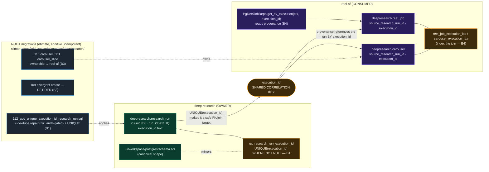
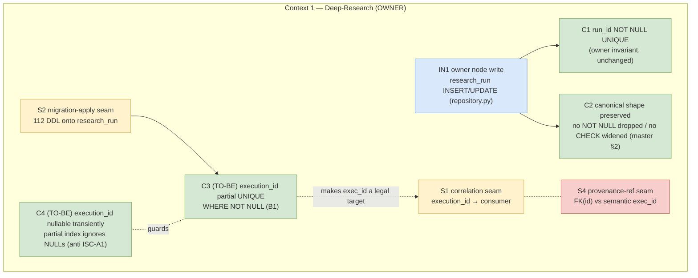
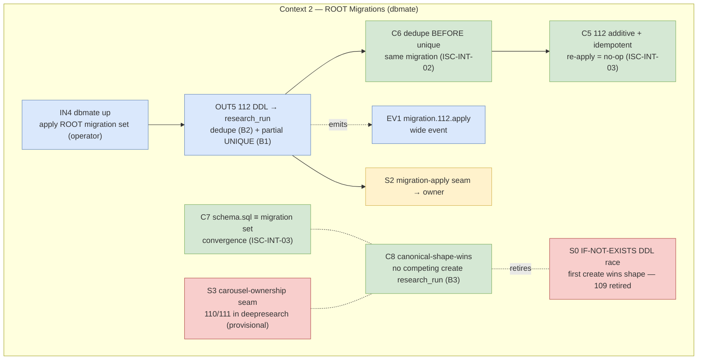
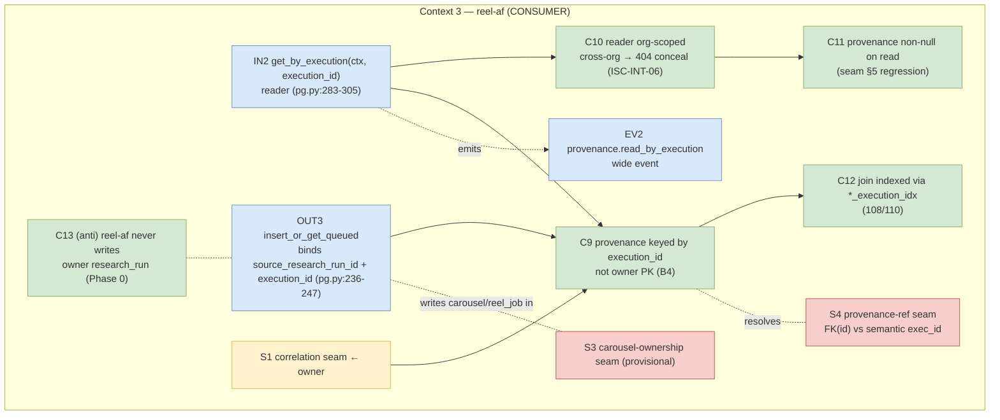
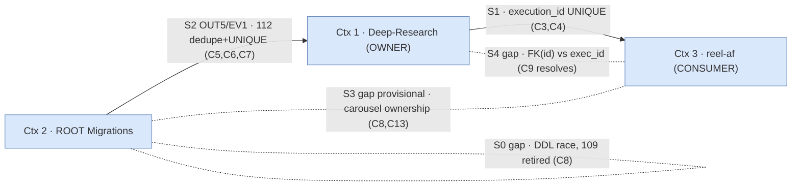

# Phase 1 — Correlation Contract (`execution_id` as the safe canonical join key) — TDD Plan

> **Plan INT-01 of the cross-app integration effort** (master:
> `silmari-agentfield-system/thoughts/searchable/shared/plans/2026-07-12-cross-app-integration-research-to-reels-generalizable.md`,
> esp. §4 "Make `execution_id` a safe join key", §5 "Concrete fix", §6 "Remediate bad prod state",
> §7 "Phase 1 — Correlation contract").
> **Scope:** the four leaf behaviors that turn `execution_id` into a **UNIQUE, indexed, FK-able**
> correlation key across the two apps that today share `deepresearch.research_run`:
> **B1** owner `UNIQUE(execution_id)`; **B2** prod de-dupe repair (gated on the Phase 0 audit);
> **B3** retire reel-af's divergent `109` create + place carousel tables (110/111) under correct
> ownership; **B4** reel-af provenance semantically holds the `execution_id` correlation key,
> indexed, read by `get_by_execution`.
> **Owner-of-record:** `deepresearch.research_run` is owned by **deep-research**
> (`silmari-af-deep-research/ui/workspace/postgres/schema.sql`); all schema changes to it are
> **additive, idempotent, and ROOT-owned** in `silmari-agentfield-system/migrations/deepresearch/`.
> reel-af **references** the run by id; it never writes the owner's table (that removal is Phase 0).
>
> **Depends on Phase 0** (master §7): the cross-write from
> `carousel-impl/web/pg.py:insert_research_run`/`update_research_status` into
> `deepresearch.research_run` is already **removed**, and the prod audit (§6) has run and reported
> **(a)** which DDL won on prod and **(b)** the duplicate-row count. B2 (the de-dupe repair) is a
> **no-op when the audit reports zero duplicates**, and is only meaningful when it reports > 0.

## Goal

Make `execution_id` earn its role as the **canonical correlation key** (master §4): the CloudEvents
`subject` (Phase 2), the OpenLineage `runId` analog, and — the single most important schema fix —
**UNIQUE on the owner's `research_run` and the target of reel-af's provenance reference**. Today
`execution_id` is UNIQUE on *neither* side, so two rows can share it and no reference can safely
key on it. This plan adds `UNIQUE(execution_id)` on the owner (after de-duping any prod
collisions), retires the divergent migration that created a conflicting thin shape, relocates the
carousel tables to their correct (reel-af) ownership, and makes reel-af's
`reel_job/carousel.source_research_run_id` semantically hold — and index — the `execution_id`
correlation value that `get_by_execution` already joins on.

All work is **additive + idempotent** (re-applying any migration is a no-op) and the owner's real
shape (`schema.sql`) stays canonical — we never relax an owner invariant (master §2 forbids Option
A and Option C).

## Current State Analysis

### Key Discoveries (verified 2026-07-12)

- **Owner DDL (canonical):** `silmari-af-deep-research/ui/workspace/postgres/schema.sql:7-23` —
  `research_run` has `execution_id text` (nullable) and **no UNIQUE on it**; the only UNIQUE is
  `run_id text NOT NULL UNIQUE` (schema.sql:9). Indexes:
  `ix_research_run_org_user_created`, `ix_research_run_org_run_id` — **none on `execution_id`**.
- **ROOT migrations (dbmate) stop at 108 on `main`.** `git ls-files
  silmari-agentfield-system/migrations/deepresearch/` → `100,101,102,103,106,108` only. Format is
  **dbmate** (`-- migrate:up` / `-- migrate:down`), applied independently of the control-plane Go
  runner (`specs/user-data-model.domain.md:659`, "Decision 2026-07-02 → dbmate"). The **next free
  number is 112** (109/110/111 exist only in unmerged history — see below), so the new additive
  migration for B1 is **`112_add_unique_execution_id_research_run.sql`**.
- **The divergent `109` is NOT on `main`.** It lives in two competing unmerged commits
  (`896cb46`, `ec2620d`) — **neither is an ancestor of HEAD** (`git merge-base --is-ancestor …`
  → NOT ancestor for both). Its body
  (`109_alter_research_run_feature_columns.sql`) does `create table if not exists
  deepresearch.research_run (id, org_id, created_by, execution_id, status default 'queued',
  created_at)` — a **thin shape with no `run_id`/`query`/`visibility`/`params` and `status` with no
  CHECK** — plus `add column if not exists execution_id/created_at`. Because both DDLs use `IF NOT
  EXISTS`, whichever runs first wins the shape (master §1, seam §0). **"Retire 109" therefore means:
  do NOT merge/apply that create; carry only the additive column-adds if needed, under the owner's
  canonical shape.**
- **Carousel tables (110/111) reference the owner schema.** From `ec2620d`:
  `110_create_carousel.sql` and `111_create_carousel_slide.sql` create `deepresearch.carousel` /
  `deepresearch.carousel_slide` — **reel-af-owned tables placed in the `deepresearch` schema**,
  each with `source_research_run_id uuid references deepresearch.research_run(id) on delete set
  null` and per-app indexes. They mirror `108_create_reel_job.sql` (already on `main`), which
  itself declares `source_research_run_id uuid references deepresearch.research_run(id) on delete
  set null` + `reel_job_execution_idx on (execution_id)`.
- **The provenance FK currently targets `research_run(id)` (the uuid PK), NOT `execution_id`.**
  `108_create_reel_job.sql` and the 110 carousel migration both FK `source_research_run_id →
  research_run(id)`. But reel-af **populates and reads provenance by `execution_id`**, not by the
  owner's uuid PK: `carousel-impl/web/pg.py:PgReelJobRepo.get_by_execution` (pg.py:283-305) SELECTs
  `… execution_id, …, source_research_run_id from deepresearch.reel_job where execution_id = %s and
  org_id = %s`, and `insert_or_get_queued` (pg.py:236-247) binds `source_research_run_id`. So the
  **DB-level FK target and the semantic join key disagree** — this is exactly the reconciliation
  B4 owns.
- **`execution_id` is the only shared, populated column across both apps** (seam §4): owner has it
  (schema.sql:18, settable on/after `add`); reel-af attaches the control-plane `execution_id` post
  dispatch. It is the natural join key and needs a UNIQUE/dedup discipline to serve safely — this
  plan supplies both.
- **reel-af no longer writes the owner table (Phase 0).** `insert_research_run` /
  `update_research_status` cross-writes (pg.py:337-360) are removed in Phase 0; this plan assumes
  that and does not re-touch them.

### Files touched (declared blast radius)

**deep-research repo (`silmari-af-deep-research` / ROOT migrations in `silmari-agentfield-system`):**

- `silmari-agentfield-system/migrations/deepresearch/112_add_unique_execution_id_research_run.sql`
  — **NEW** additive, idempotent dbmate migration (B1 + B2): de-dupe repair CTE (guarded/no-op
  when clean) **then** `CREATE UNIQUE INDEX IF NOT EXISTS ux_research_run_execution_id ON
  deepresearch.research_run (execution_id) WHERE execution_id IS NOT NULL`.
- `silmari-af-deep-research/ui/workspace/postgres/schema.sql` — add the same partial UNIQUE index
  (mirror of 112) so a fresh apply of `schema.sql` and the migration set converge (B1). Owner
  canonical shape otherwise unchanged.
- `silmari-af-deep-research/ui/workspace/postgres/` integration test dir (repo's existing
  `@integration`/live-PG test location) — **NEW** `test_execution_id_unique.py` (B1 red = two rows
  same `execution_id` → unique violation after migration).

**reel-af repo (`silmari-reels-af` / `carousel-impl`):**

- `silmari-agentfield-system/migrations/deepresearch/109_*` — **retired** from the applied set
  (B3): do NOT merge the divergent create; if the two feature columns are ever needed on a
  green-field DB they come as pure `add column if not exists` under the owner's canonical shape,
  never a competing `create table`.
- `silmari-agentfield-system/migrations/deepresearch/110_create_carousel.sql`,
  `111_create_carousel_slide.sql` — **ownership move assessed (B3):** these are reel-af-owned
  tables sitting in the `deepresearch` schema. This plan decides their placement (see B3) and, if
  moved, plans the destination; if kept in-schema for Phase 1, records the explicit rationale +
  a follow-up bead.
- `carousel-impl/web/pg.py` — **B4 (reader/index reconciliation only, additive):** confirm
  `get_by_execution` joins by `execution_id`; no writer change (Phase 0 removed the owner writes).
  The **index** that makes the join fast is `reel_job_execution_idx` (already in 108) and
  `carousel_execution_idx` (in 110); B4 asserts these exist and that provenance is read back
  non-null.
- `carousel-impl/tests/web/integration/test_provenance_by_execution.py` — **NEW**
  `@pytest.mark.integration` regression: a provenance row keyed by `execution_id` is read back via
  `get_by_execution` with `source_research_run_id` populated (B4).

### What we are NOT doing (Phase 1 boundary)

- **Not** removing reel-af's cross-writes to `research_run` — that is **Phase 0** (assumed done).
- **Not** emitting `research.completed` / wiring the outbox or the idempotent consumer — **Phase 2**.
- **Not** extracting the reusable Node-Contract port — **Phase 3**; nor the lineage projection —
  **Phase 4**.
- **Not** relaxing any owner invariant (no dropping `run_id`/`query`/`visibility` NOT NULLs, no
  widening the `status` CHECK) — master §2 forbids Options A and C.
- **Not** changing `run_id` semantics; `run_id` stays the owner's NOT NULL UNIQUE workflow handle.
  `execution_id` is a *second, additive* unique key for cross-app correlation, not a replacement.

## System Map



**Reading the map.** The owner's `research_run.execution_id` becomes UNIQUE (B1), applied by the
additive migration `112` which first de-dupes prod (B2, only if the Phase 0 audit found
collisions). Once `execution_id` is UNIQUE, it is a legal FK/join target — the shared correlation
key both apps already populate. reel-af's provenance (`source_research_run_id` on `reel_job` /
`carousel`) semantically carries that `execution_id` value and is read via `get_by_execution`,
indexed by the existing `*_execution_idx` (B4). The divergent `109` create is retired and the
carousel tables are placed under reel-af ownership (B3).

### Enriched map — grammar + interfaces + contracts, linked at seams

Definitions: **Seam (S#)** = a boundary where control/data crosses contexts; **IN#/OUT#** =
inbound/outbound port on a boundary; **EV#** = a domain event across a seam (with schema);
**C#** = a contract (invariant + pre/postconditions on a named target); **Grammar** = EBNF for
each ID. Every diagram ID resolves to exactly one grammar entry (1:1; seams recur across context
diagrams but resolve to a single shared entry).

Three bounded contexts, inferred from the seam analysis (§0–§5) + behaviors B1–B4 — all grounded in
cited DDL/code, none provisional **except S3** (labeled `provisional`: carousel-ownership placement
is decided-by-convention in Phase 1, not physically enforced):

- **Deep-Research (OWNER)** — `deepresearch.research_run` shape + indexes
  (`schema.sql:7-29`, node write `repository.py:29-38,92-118`).
- **ROOT Migrations** — dbmate additive/idempotent set
  (`silmari-agentfield-system/migrations/deepresearch/`, new `112`).
- **reel-af (CONSUMER)** — provenance-by-reference (`carousel-impl/web/pg.py`, `reel_job`/`carousel`).

`(TO-BE)` marks target-state elements this plan adds; `gap`-class nodes mark AS-IS drift.

#### Context 1 — Deep-Research (OWNER of `deepresearch.research_run`)

**(a) Boundary diagram**



**(b) EBNF grammar** (Context 1 owns IN1, C1–C4)

```ebnf
IN1 = "INSERT"|"UPDATE" , "deepresearch.research_run" , "(" , owner_cols , ")" ;
      (* repository.py:29-38,92-118 ; owner app is the sole writer post-Phase-0 *)
C1  = target "research_run.run_id" :
      invariant "run_id NOT NULL UNIQUE (workflow handle)" ;
      pre  "any insert" ; post "duplicate run_id rejected" ;    (* schema.sql:9, unchanged *)
C2  = target "research_run (aggregate shape)" :
      invariant "15 canonical cols; no NOT NULL dropped, no status CHECK widened" ;
      pre  "any migration touching research_run" ; post "owner schema.sql stays canonical (master §2)" ;
C3  = target "research_run.execution_id" :                       (* TO-BE, B1 *)
      invariant "partial UNIQUE(execution_id) WHERE execution_id IS NOT NULL" ;
      pre  "112 applied AND no dup non-null exec_id (B2 ran first)" ;
      post "two equal non-null execution_id inserts -> unique violation" ;
C4  = target "research_run.execution_id" :                       (* TO-BE, anti ISC-A1 *)
      invariant "NULL execution_id never forced unique" ;
      pre  "row inserted pre-dispatch (exec_id NULL)" ; post "multiple NULLs coexist" ;
```

**(c) Seam table**

| Seam | Crossing IN/OUT | Events | Contracts | Notes |
|---|---|---|---|---|
| **S2** migration-apply | OUT5 (in) | EV1 | C3, C2 | `112` adds the partial UNIQUE; must not violate C2 |
| **S1** correlation | — | — | C3, C4 | `execution_id` becomes a legal cross-app join target only once C3 holds |
| **S4** provenance-ref `gap` | (IN2 from Ctx 3) | — | C3 (resolves) | AS-IS FK targets `research_run(id)` PK; semantic join is by `execution_id` |

#### Context 2 — ROOT Migrations (dbmate, additive + idempotent)

**(a) Boundary diagram**



**(b) EBNF grammar** (Context 2 owns IN4, OUT5, EV1, C5–C8)

```ebnf
IN4  = "dbmate" , "up" ;                                         (* applies 100..112 in order *)
OUT5 = "112_add_unique_execution_id_research_run.sql" ,
       "{" , dedupe_cte , ";" , "CREATE UNIQUE INDEX IF NOT EXISTS" , "ux_research_run_execution_id" , "}" ;
EV1  = "migration.112.apply" , "{" ,
         "migration.id=112" , "," , "db.target" , "," ,
         "dedupe.duplicates_found:int" , "," , "dedupe.rows_collapsed:int" , "," ,
         "unique_index.created:bool" , "," , "apply.idempotent_reapply:bool" , "," , "outcome" , "}" ;
C5   = target "migration 112" :
       invariant "additive + idempotent (CREATE ... IF NOT EXISTS; repair no-op when clean)" ;
       pre "applied N>=1 times" ; post "second apply changes nothing, raises nothing" ;
C6   = target "migration 112 body order" :
       invariant "de-dupe CTE precedes CREATE UNIQUE INDEX" ;
       pre "dirty prod (dup non-null exec_id)" ; post "unique index build cannot fail on dupes" ;
C7   = target "owner schema.sql vs applied set" :
       invariant "fresh schema.sql apply and 100..112 converge on the same index" ;
       pre "green-field DB" ; post "ux_research_run_execution_id present either path" ;
C8   = target "applied migration set" :
       invariant "no competing create table research_run omitting canonical NOT NULL cols" ;
       pre "109 divergent create exists in unmerged history" ; post "109 not merged/applied (retired, B3)" ;
```

**(c) Seam table**

| Seam | Crossing IN/OUT | Events | Contracts | Notes |
|---|---|---|---|---|
| **S0** DDL race `gap` | — | — | C8 | `IF NOT EXISTS` → first create wins; C8 retires the thin `109` create |
| **S2** migration-apply | OUT5 (out) | EV1 | C5, C6, C7 | `112` crosses into the owner (Context 1) |
| **S3** carousel-ownership `gap` `provisional` | — | — | C8 | `110/111` are reel-af-owned tables resident in `deepresearch` (ISC-INT-05); physical move deferred (bead) |

#### Context 3 — reel-af (CONSUMER, provenance-by-reference)

**(a) Boundary diagram**



**(b) EBNF grammar** (Context 3 owns IN2, OUT3, EV2, C9–C13)

```ebnf
IN2  = "get_by_execution" , "(" , ctx , "," , execution_id , ")" ;   (* -> ReelJobRef | NotFound *)
OUT3 = "insert_or_get_queued" , "(" , ctx , "," , submission , "," , "source_research_run_id" , ")" ;
EV2  = "provenance.read_by_execution" , "{" ,
         "execution_id†" , "," , "org_id†" , "," ,
         "source_research_run_id.present:bool" , "," , "crossorg.concealed:bool" , "," ,
         "join.index_used:bool" , "}" ;                              (* † = high-card *)
C9   = target "reel_job/carousel.source_research_run_id" :
       invariant "provenance correlated by execution_id, not research_run(id) PK" ;
       pre "row stamped with execution_id" ; post "read/join is on execution_id" ;
C10  = target "get_by_execution" :
       invariant "filter WHERE execution_id = %s AND org_id = %s" ;
       pre "foreign-org execution_id" ; post "NotFound (404-conceal), no leak (pg.py:305)" ;
C11  = target "get_by_execution result" :
       invariant "source_research_run_id SELECTed and returned non-null when set" ;
       pre "provenance row exists" ; post "ref.source_research_run_id is not null (seam §5)" ;
C12  = target "execution_id join" :
       invariant "reel_job_execution_idx / carousel_execution_idx present" ;
       pre "read by execution_id" ; post "index scan, not seq scan" ;
C13  = target "reel-af write path" :
       invariant "reel-af never INSERT/UPDATE deepresearch.research_run" ;
       pre "Phase 0 removed cross-writes (pg.py:337-360)" ; post "owner table untouched by consumer" ;
```

**(c) Seam table**

| Seam | Crossing IN/OUT | Events | Contracts | Notes |
|---|---|---|---|---|
| **S1** correlation | IN2 (in) | EV2 | C9 | consumer reads/joins by the owner's now-unique `execution_id` |
| **S4** provenance-ref `gap` | IN2, OUT3 | EV2 | C9, C11 | AS-IS FK→`research_run(id)`; TO-BE keeps app-level ref joined by `execution_id` (C9), integrity from C3 |
| **S3** carousel-ownership `gap` `provisional` | OUT3 | — | C13 | consumer writes `carousel`/`reel_job` (reel-af-owned) into `deepresearch` schema |

#### Cross-context seam grammar (S0–S4, single definition each)

```ebnf
S0 = "DDL race seam" : "IF NOT EXISTS create — first writer wins research_run shape" ;
     crosses { C8 } ;  gap = "divergent 109 thin create (896cb46/ec2620d), retired by B3" ;
S1 = "correlation seam" : "execution_id shared, populated by both apps" ;
     crosses { IN2 , C3 , C4 , C9 , EV2 } ;   as_is = "not unique either side" ; to_be = "UNIQUE via C3" ;
S2 = "migration-apply seam" : "112 DDL applied onto owner research_run" ;
     crosses { OUT5 , EV1 , C2 , C3 , C5 , C6 , C7 } ;
S3 = "carousel-ownership seam" (* provisional *) :
     "reel-af-owned carousel/carousel_slide (110/111) resident in deepresearch schema" ;
     crosses { OUT3 , C8 , C13 } ;  gap = "ownership by-convention only; physical move deferred (bead, ISC-INT-05)" ;
S4 = "provenance-reference seam" :
     "source_research_run_id references the run" ;
     crosses { IN2 , OUT3 , C9 , C11 } ;
     gap = "AS-IS FK targets research_run(id) PK; semantic join is execution_id (Phase-1: app-level ref, no FK rewrite)" ;
```

#### INDEX

**Context roster**

| Ctx | Name | Role | Home | Owns IDs |
|---|---|---|---|---|
| 1 | Deep-Research | OWNER of `research_run` | `silmari-af-deep-research/ui/workspace/postgres/` | IN1, C1–C4 |
| 2 | ROOT Migrations | additive/idempotent DDL | `silmari-agentfield-system/migrations/deepresearch/` | IN4, OUT5, EV1, C5–C8 |
| 3 | reel-af | CONSUMER (provenance-by-ref) | `carousel-impl/web/pg.py` | IN2, OUT3, EV2, C9–C13 |
| seams | — | cross-context | — | S0, S1, S2, S3, S4 |

**Context-map diagram**



**Gap / risk register**

| ID | Gap | Risk | Closed by |
|---|---|---|---|
| **S0** | `IF NOT EXISTS` DDL race — thin `109` create could win the `research_run` shape | Owner loses `run_id`/`query`/`visibility`; degraded rows | B3 / C8 — retire `109`; canonical shape asserted |
| **S4** | Provenance FK targets `research_run(id)` PK, but semantic join is `execution_id` | FK and join key disagree; integrity not on the real key | B1 / C3 (UNIQUE) + B4 / C9 (app-level ref by `execution_id`); physical FK-repoint = Open Seam |
| **S3** `provisional` | `carousel`/`carousel_slide` (reel-af-owned) live in `deepresearch` schema | Ownership drift; cross-schema FK blast radius if moved later | B3 / C8 — recorded reel-af-owned by convention; `reelaf` namespace = follow-up bead (ISC-INT-05) |
| **C11** | Reader previously returned `source_research_run_id` null (seam §5) | Provenance silently lost on read | B4 regression `test_provenance_by_execution` keeps it non-null |

**Self-check (acceptance):**
- Diagram IDs ↔ grammar entries **1:1** — 27 IDs (IN1, IN2, OUT3, IN4, OUT5, EV1, EV2, C1–C13, S0–S4); each has exactly one grammar entry; **no orphans** (seams recur across context diagrams but resolve to one shared grammar entry). ✅
- Every **C#** names its target (aggregate/interface/column). ✅
- Every **S#** enumerates crossing interfaces/events/contracts (per-context seam tables + shared seam grammar). ✅
- Every context has all three parts (diagram + grammar + seam table). ✅
- Every violated/missing boundary is `gap`-classed on the map (S0, S3, S4). ✅
- Provisional boundary labeled with reason (**S3** — ownership by-convention, physical move deferred). ✅

---

## Behavior 1: Owner `UNIQUE(execution_id)` on `deepresearch.research_run`   [LEAF]

**LEAF reason:** a single additive schema change, verified by one live-PG insert-collision test; no
async edge, no cross-module wiring.

### Test Specification

**Given** the owner schema with `112` applied, **When** two rows are inserted with the **same
non-null `execution_id`** (all other NOT NULLs — `run_id`, `query`, `visibility`, `status`,
`org_id`, `created_by` — satisfied with distinct valid values so ONLY the `execution_id`
collision can trip), **Then** the second insert raises a **unique-constraint violation**
(`ux_research_run_execution_id`).

- **Given** the migration is applied **twice**, **Then** the second apply is a **no-op** (the
  `CREATE UNIQUE INDEX IF NOT EXISTS` and the repair CTE both idempotent) — no error, no duplicate
  index.
- **Given** two rows with `execution_id IS NULL`, **Then** **both inserts succeed** — the index is
  partial (`WHERE execution_id IS NOT NULL`), so pre-dispatch rows (null exec id) are not forced
  unique. (This matches reel-af's ROW-FIRST insert where `execution_id` is null before dispatch,
  seam §3 — though reel-af no longer writes this table, the owner's own `add`-then-attach flow also
  leaves it null transiently.)

**Edge cases:** existing prod duplicates would make a plain `CREATE UNIQUE INDEX` fail — that is
exactly why B2's repair runs **first, in the same migration**, so `112` is safe on both clean and
dirty prod. A NULL `execution_id` never collides (partial predicate). `run_id`'s own UNIQUE is
untouched.

**Files touched:**
`silmari-agentfield-system/migrations/deepresearch/112_add_unique_execution_id_research_run.sql`
(new), `silmari-af-deep-research/ui/workspace/postgres/schema.sql`,
`silmari-af-deep-research/ui/workspace/postgres/test_execution_id_unique.py` (new, `@integration`).

### 🔴 Red

`silmari-af-deep-research/ui/workspace/postgres/test_execution_id_unique.py` (live PG, requires
`TEST_DATABASE_URL`; **fail-closed skip** when unset — never green without a DB):

```python
import os, uuid, pytest

pytestmark = pytest.mark.integration

def _dsn():
    dsn = os.getenv("TEST_DATABASE_URL")
    if not dsn:
        pytest.fail("TEST_DATABASE_URL unset — integration unique-constraint test cannot verify; "
                    "fail-closed (do not skip-to-green)")
    return dsn

def _insert(cur, *, execution_id):
    rid = str(uuid.uuid4())
    cur.execute(
        "insert into deepresearch.research_run "
        "(id, run_id, org_id, created_by, query, status, visibility, execution_id) "
        "values (%s,%s,%s,%s,%s,'running','org',%s)",
        (rid, f"run_{rid[:8]}", ORG_ID, USER_ID, "q", execution_id),
    )

def test_two_rows_same_execution_id_violate_unique(pg):        # RED before 112, GREEN after
    exec_id = "exec_" + uuid.uuid4().hex
    with pg.cursor() as cur:
        _insert(cur, execution_id=exec_id)
        with pytest.raises(Exception) as ei:                    # psycopg UniqueViolation
            _insert(cur, execution_id=exec_id)
        assert "ux_research_run_execution_id" in str(ei.value) or "unique" in str(ei.value).lower()

def test_two_null_execution_ids_both_insert(pg):                # partial index: nulls allowed
    with pg.cursor() as cur:
        _insert(cur, execution_id=None)
        _insert(cur, execution_id=None)                         # no raise
```

Run **before** applying `112` → both inserts succeed → `test_two_rows_same_execution_id_violate_unique`
**fails** (no violation). That is the red.

### 🟢 Green

`silmari-agentfield-system/migrations/deepresearch/112_add_unique_execution_id_research_run.sql`
(dbmate; the repair half is B2, shown there — here the UNIQUE half):

```sql
-- migrate:up
-- research_run is OWNED by deep-research; this migration is ADDITIVE + IDEMPOTENT and does
-- NOT redefine the table. It makes execution_id the canonical cross-app correlation key by
-- adding a partial UNIQUE index. (De-dupe repair — B2 — runs first, above this, in the same
-- migration; it is a no-op on a clean DB.)
create unique index if not exists ux_research_run_execution_id
    on deepresearch.research_run (execution_id)
    where execution_id is not null;

-- migrate:down
drop index if exists deepresearch.ux_research_run_execution_id;
```

Mirror in the owner's canonical shape,
`silmari-af-deep-research/ui/workspace/postgres/schema.sql` (append after the existing indexes,
lines 25-29):

```sql
CREATE UNIQUE INDEX IF NOT EXISTS ux_research_run_execution_id
    ON deepresearch.research_run (execution_id)
    WHERE execution_id IS NOT NULL;
```

Apply `112` → re-run the test → violation raised → **green**.

### 🔵 Refactor

- [ ] **Additive + idempotent:** `create unique index if not exists` (re-apply = no-op); partial
      predicate preserves the null-transient insert path (mirrors `run_id`'s IF-NOT-EXISTS style,
      schema.sql:25-29).
- [ ] **Owner shape unchanged otherwise:** no NOT NULL added, no CHECK widened — master §2.
- [ ] **schema.sql ≡ migration set:** a fresh `schema.sql` apply and the `100..112` migration set
      converge on the same index (both use `IF NOT EXISTS`).

### Success Criteria

**Automated:**
- [ ] `test_execution_id_unique.py::test_two_rows_same_execution_id_violate_unique` red before
      `112`, green after (needs `TEST_DATABASE_URL`; **fails closed** — not skipped — when unset).
- [ ] `test_two_null_execution_ids_both_insert` green (partial index).
- [ ] `112` applied twice is a no-op (idempotency test — see B2 Success Criteria; same migration).
- [ ] `ruff check` clean on the new test module.

**Manual:**
- [ ] `\d deepresearch.research_run` on the target DB shows `ux_research_run_execution_id` UNIQUE,
      partial `WHERE (execution_id IS NOT NULL)`.

---

## Behavior 2: De-dupe existing prod rows FIRST (audit-gated repair)   [LEAF]

**LEAF reason:** a single guarded repair step inside the B1 migration, verified by a
seed-duplicates → apply → expect-collapsed integration test; no async edge.

> **Gate (depends_on Phase 0 audit).** The master §6 audit reports **(a)** which DDL won on prod
> and **(b)** the duplicate-row count on `execution_id`. This repair is **a no-op when that count is
> 0** and is only load-bearing when it is > 0. It runs **before** the `CREATE UNIQUE INDEX` (B1) in
> the *same* migration `112`, so the unique index cannot fail on a dirty prod. If the audit reports
> the **thin `109` shape won** (owner inserts were degraded), the repair still collapses on
> `execution_id`; the owner's canonical columns are re-established by the owner's own `schema.sql`
> apply (out of this migration's additive scope — flagged in Open Seams).

### Test Specification

**Given** a `research_run` table seeded with **two rows sharing one non-null `execution_id`**
(distinct `id`/`run_id`), **When** the `112` repair runs, **Then** exactly **one row survives per
`execution_id`** (deterministic winner: keep the earliest `created_at`, tie-break lowest `id`), and
the subsequent `CREATE UNIQUE INDEX` succeeds.

- **Given** a table with **no duplicates**, **When** the repair runs, **Then** **zero rows change**
  (no-op) and the unique index is created.
- **Given** the repair runs **twice**, **Then** the second run changes nothing (idempotent).
- **Edge:** rows with `execution_id IS NULL` are **never collapsed** (they are not "duplicates" for
  correlation — the partial index ignores them).

**Files touched:**
`silmari-agentfield-system/migrations/deepresearch/112_add_unique_execution_id_research_run.sql`
(repair half), `silmari-af-deep-research/ui/workspace/postgres/test_execution_id_unique.py`
(add de-dupe cases).

### 🔴 Red

Add to `test_execution_id_unique.py`:

```python
def test_dedupe_collapses_duplicate_execution_id(pg):          # RED without repair
    exec_id = "exec_" + uuid.uuid4().hex
    with pg.cursor() as cur:
        _insert(cur, execution_id=exec_id)                     # seeded BEFORE the unique index
        _insert_raw_duplicate(cur, execution_id=exec_id)       # helper bypassing the index (pre-112 fixture)
    apply_migration_112(pg)                                     # repair + unique
    with pg.cursor() as cur:
        cur.execute("select count(*) from deepresearch.research_run where execution_id=%s", (exec_id,))
        assert cur.fetchone()[0] == 1                           # collapsed to one

def test_dedupe_is_noop_when_clean(pg):
    before = _row_count(pg)
    apply_migration_112(pg); apply_migration_112(pg)            # twice
    assert _row_count(pg) == before                             # nothing changed, no error
```

Without the repair, applying the unique index onto the seeded duplicates **errors** (or, run
against the current pre-112 DB, the count assertion is 2) → red.

### 🟢 Green

Repair block at the **top** of `112`'s `migrate:up`, before the `CREATE UNIQUE INDEX`:

```sql
-- migrate:up
-- (B2) De-dupe existing rows on execution_id BEFORE adding the unique index. GATED on the Phase 0
-- audit (master §6): a NO-OP when prod is already clean; idempotent. Deterministic winner = the
-- earliest created_at, tie-broken by the lowest id. NULL execution_id rows are never collapsed.
with ranked as (
    select id,
           row_number() over (
               partition by execution_id
               order by created_at asc nulls last, id asc
           ) as rn
    from deepresearch.research_run
    where execution_id is not null
)
delete from deepresearch.research_run r
using ranked
where r.id = ranked.id and ranked.rn > 1;

-- (B1) then the canonical correlation key:
create unique index if not exists ux_research_run_execution_id
    on deepresearch.research_run (execution_id)
    where execution_id is not null;

-- migrate:down
drop index if exists deepresearch.ux_research_run_execution_id;
-- (down does NOT resurrect deleted duplicate rows — the collapse is a forward-only repair)
```

Apply → duplicates collapse to one → unique index builds → green. Re-apply → the CTE deletes
nothing (only one row per `execution_id` remains) → idempotent.

### 🔵 Refactor

- [ ] **No-op when clean:** the `DELETE … WHERE rn > 1` removes zero rows on a de-duplicated table.
- [ ] **Deterministic winner:** documented (earliest `created_at`, lowest `id`) so the repair is
      reproducible and reviewable in the runbook.
- [ ] **Forward-only:** `migrate:down` drops only the index; it does not (cannot) restore deleted
      dupes — recorded in the runbook.
- [ ] **Gated:** the migration header states it is a no-op unless the Phase 0 audit reported dupes.

### Success Criteria

**Automated:**
- [ ] `test_dedupe_collapses_duplicate_execution_id` red without the repair, green with it.
- [ ] `test_dedupe_is_noop_when_clean` green (applying `112` twice changes no rows, raises nothing)
      — this **doubles as the migration-idempotency test**.
- [ ] Both require `TEST_DATABASE_URL`; **fail-closed** (fail, not skip) when unset.

**Manual (prod repair runbook — see "Manual / Prod Repair Runbook" below):**
- [ ] Phase 0 audit duplicate-count recorded; if 0, note "repair no-op, unique index only".
- [ ] Backup / `pg_dump deepresearch.research_run` taken before applying `112` to prod.
- [ ] Post-apply: `select execution_id, count(*) from deepresearch.research_run where execution_id
      is not null group by 1 having count(*) > 1` returns **zero rows**.

---

## Behavior 3: Retire divergent `109`; place carousel tables (110/111) under correct ownership   [LEAF]

**LEAF reason:** a migration-set curation decision + a shape-assertion; verified by grep/DDL
assertions, no runtime edge.

### Test Specification

**Given** the applied ROOT migration set, **When** the `deepresearch.research_run` shape is
inspected, **Then** it matches the **owner's `schema.sql`** (15 canonical columns incl. `run_id
NOT NULL UNIQUE`, `query NOT NULL`, `visibility NOT NULL CHECK`, `params`, `status CHECK IN
(running|succeeded|failed|cancelled)`) — **not** the thin `109` shape (no `run_id`/`query`/
`visibility`, `status default 'queued'` with no CHECK).

- **Given** the migration set, **Then** there is **no competing `create table … research_run`**
  that omits the canonical columns — the divergent `109` create is **not** in the applied set.
- **Carousel-ownership assessment (decision, recorded in this behavior):** `deepresearch.carousel`
  and `deepresearch.carousel_slide` (110/111) are **reel-af-owned** tables. **Decision for Phase
  1:** keep them physically in the shared `deepresearch` schema **for now** (they already FK the
  tenancy + `research_run` tables there, mirroring `108_create_reel_job.sql` which is likewise a
  reel-af-owned index-table in `deepresearch`), but record them as **reel-af-owned by convention**
  and file a follow-up bead to evaluate a dedicated `reelaf` schema/namespace. Rationale: moving
  schemas is a physical migration with FK-rewrite blast radius; Phase 1's contract goal
  (`execution_id` correlation) does not require the physical move, and `108` already establishes the
  "reel-af-owned table in `deepresearch`" precedent. **If** the reviewer wants the physical move in
  Phase 1, the destination is a new `reelaf` schema with `carousel`/`carousel_slide`/`reel_job`
  moved together and their `research_run` FKs pointing cross-schema — planned as a separate migration
  (out of this plan's additive scope; flagged in Open Seams).

**Edge cases:** a green-field CI DB that never ran the owner's `schema.sql` must still end with the
canonical shape — so the **owner's `schema.sql` (or `100`-series owner base migration) is the
authority**; any reel-af feature need (the two columns `109` added) is satisfied by **pure `add
column if not exists`** under that canonical table, never a competing `create`.

**Files touched:**
`silmari-agentfield-system/migrations/deepresearch/109_*` (retired — not merged/applied),
`silmari-agentfield-system/migrations/deepresearch/110_create_carousel.sql`,
`111_create_carousel_slide.sql` (ownership recorded; header comment updated to state reel-af
ownership), a shape-assertion test.

### 🔴 Red

A migration-shape assertion (can run in the owner integration suite or a lint test):

```python
def test_research_run_has_owner_canonical_shape(pg):
    cols = _columns(pg, "deepresearch", "research_run")        # name -> (nullable, has_check)
    # canonical owner columns MUST be present and NOT NULL (thin 109 shape lacks these)
    for c in ("run_id", "query", "visibility", "params"):
        assert c in cols, f"{c} missing — thin 109 shape won (retire 109)"
    assert cols["run_id"].not_null and cols["run_id"].unique
    assert cols["query"].not_null and cols["visibility"].not_null

def test_no_divergent_research_run_create_in_migration_set():
    # No applied migration may CREATE research_run without the canonical NOT NULL columns.
    text = _concat_migrations("deepresearch")
    creates = _find_create_table(text, "research_run")
    for ddl in creates:                                        # only the owner base create is allowed
        assert "run_id" in ddl and "query" in ddl and "visibility" in ddl, \
            "divergent thin research_run create present — retire 109"
```

Against a DB where the thin `109` create won, `test_research_run_has_owner_canonical_shape` **fails**
(missing `run_id`/`query`/`visibility`). That is the red the retirement closes.

### 🟢 Green

- **Retire `109`:** do not merge `896cb46`/`ec2620d`'s `109_alter_research_run_feature_columns.sql`
  create into the applied set. If reel-af genuinely needs `execution_id`/`created_at` on a
  green-field DB, add them as a **pure additive** migration under the owner's canonical table:

```sql
-- migrate:up  (only if a green-field feature need is proven; NO competing create)
alter table deepresearch.research_run add column if not exists execution_id text;
alter table deepresearch.research_run add column if not exists created_at timestamptz;
-- migrate:down
alter table deepresearch.research_run drop column if exists created_at;
alter table deepresearch.research_run drop column if exists execution_id;
```

  (In practice the owner's `schema.sql` already declares both, so this is usually unnecessary —
  the retirement is the substantive action.)
- **Carousel ownership:** update the header comment of `110`/`111` to state **"reel-af-owned index
  table (mirrors 108_create_reel_job); resident in `deepresearch` schema pending a dedicated
  `reelaf` namespace — see bead"**, and file the follow-up bead. No DDL change to the tables in
  Phase 1.

### 🔵 Refactor

- [ ] **Canonical shape wins:** owner `schema.sql` is the single authority for `research_run`'s
      shape; no `IF NOT EXISTS` create competes with it in the applied set.
- [ ] **Ownership legible:** `110`/`111` headers name reel-af as owner; the physical-move decision +
      bead are recorded (no silent drift).
- [ ] **Additive only:** any retained feature-column need is `add column if not exists`, never a
      second `create table`.

### Success Criteria

**Automated:**
- [ ] `test_research_run_has_owner_canonical_shape` green (canonical NOT NULL columns present).
- [ ] `test_no_divergent_research_run_create_in_migration_set` green (no thin competing create in
      the applied set).
- [ ] `ruff check` clean.

**Manual:**
- [ ] `git log --oneline --all -- 'migrations/deepresearch/109*'` — confirm the divergent create is
      **not** on `main` / not in the release branch.
- [ ] Follow-up bead filed for the `reelaf` schema evaluation (carousel table physical move).

---

## Behavior 4: reel-af provenance references `execution_id`; reader joins by it   [LEAF]

**LEAF reason:** an assertion that the existing provenance write/read already keys on `execution_id`
+ that the join is indexed; verified by one live-PG round-trip regression; no async edge.

> **The core reconciliation.** `108`/`110` declare `source_research_run_id uuid references
> research_run(id)` — the owner's **uuid PK**. But reel-af populates and reads provenance by the
> **`execution_id` correlation value** (`get_by_execution`, pg.py:283-305). Phase 1's contract makes
> `execution_id` UNIQUE (B1), so it is now a **legal correlation target**. This behavior asserts
> that reel-af's provenance is written and read **by `execution_id`** and that the join is
> **indexed** (`reel_job_execution_idx` in 108; `carousel_execution_idx` in 110). Whether the
> physical FK is re-pointed from `research_run(id)` to a `UNIQUE(execution_id)` target, or the
> `source_research_run_id` column is left as the correlation reference joined in application code, is
> the one design choice — **Phase-1 recommendation: keep provenance as an application-level
> reference joined by `execution_id`** (the value both sides share), and rely on the new
> `UNIQUE(execution_id)` for integrity, rather than a physical cross-column FK rewrite (which is a
> larger, non-additive change). The physical-FK-repoint option is flagged in Open Seams.

### Test Specification

**Given** a `reel_job` (and a `carousel`) row whose `source_research_run_id`/correlation is stamped
with a known `execution_id`, **When** `PgReelJobRepo.get_by_execution(ctx, execution_id)` reads it
back, **Then** the returned ref carries the **non-null `source_research_run_id`** and matches
`execution_id` — provenance survives the read (regression on the seam §5 "silently null on read"
bug, which is fixed but must stay fixed).

- **Given** the read query, **Then** it filters `where execution_id = %s and org_id = %s`
  (org-scoped, seam §5 / pg.py:290-295) and the plan **uses the `*_execution_idx` index** (no seq
  scan on the correlation join).
- **Edge:** a foreign-org `execution_id` → `NotFound` (404-conceal, pg.py:305) — provenance never
  leaks cross-org.
- **Edge:** `execution_id` that no reel-af row references → `NotFound`.

**Files touched:** `carousel-impl/web/pg.py` (assert-only; readers already correct — no writer
change, Phase 0 removed owner writes),
`carousel-impl/tests/web/integration/test_provenance_by_execution.py` (new, `@integration`).

### 🔴 Red

`carousel-impl/tests/web/integration/test_provenance_by_execution.py`:

```python
import os, uuid, pytest
pytestmark = pytest.mark.integration

def _dsn():
    if not os.getenv("TEST_DATABASE_URL"):
        pytest.fail("TEST_DATABASE_URL unset — provenance-by-execution regression cannot verify; "
                    "fail-closed (do not skip-to-green)")
    return os.environ["TEST_DATABASE_URL"]

def test_provenance_read_back_by_execution_id_nonnull(repo, ctx):
    exec_id = "exec_" + uuid.uuid4().hex
    prov = uuid.uuid4()                                        # the research run correlation ref
    _seed_reel_job(repo, ctx, execution_id=exec_id, source_research_run_id=prov)
    ref = repo.get_by_execution(ctx, exec_id)                 # joins by execution_id
    assert str(ref.execution_id) == exec_id
    assert ref.source_research_run_id == prov                 # provenance NOT null on read (seam §5)

def test_cross_org_execution_id_conceals(repo, ctx, other_ctx):
    exec_id = "exec_" + uuid.uuid4().hex
    _seed_reel_job(repo, ctx, execution_id=exec_id, source_research_run_id=uuid.uuid4())
    with pytest.raises(NotFound):
        repo.get_by_execution(other_ctx, exec_id)             # foreign org -> 404 conceal
```

If the reader ever regresses to omitting `source_research_run_id` (the pre-fix seam §5 bug), the
first assertion goes red.

### 🟢 Green

No production change needed if the reader is already correct (confirmed: pg.py:290-295 SELECTs
`source_research_run_id`; the writer binds it). Green = the regression passes against a live DB with
the `*_execution_idx` indexes (108/110) present. If an index is missing, add (additive):

```sql
-- migrate:up  (only if absent; 108/110 already declare these)
create index if not exists reel_job_execution_idx on deepresearch.reel_job (execution_id);
create index if not exists carousel_execution_idx on deepresearch.carousel (execution_id);
```

### 🔵 Refactor

- [ ] **Reader keys on the correlation id:** `get_by_execution` filters `execution_id` + `org_id`,
      selects `source_research_run_id` — provenance is read by the shared key, not the owner PK.
- [ ] **Indexed join:** `EXPLAIN` shows an index scan via `reel_job_execution_idx` /
      `carousel_execution_idx`, not a seq scan.
- [ ] **Additive only:** no FK rewrite in Phase 1; provenance stays an application-level reference
      joined by `execution_id`, backed by B1's UNIQUE for integrity (physical-FK-repoint = Open Seam).

### Success Criteria

**Automated:**
- [ ] `test_provenance_read_back_by_execution_id_nonnull` green (provenance non-null on read).
- [ ] `test_cross_org_execution_id_conceals` green (404-conceal).
- [ ] Both require `TEST_DATABASE_URL`; **fail-closed** when unset.
- [ ] `uv run ruff check web/ tests/web/` clean.

**Manual:**
- [ ] `EXPLAIN (ANALYZE) select … where execution_id = … and org_id = …` uses the execution index.

---

## Manual / Prod Repair Runbook (Phase 0 audit → Phase 1 apply)

1. **Read the Phase 0 audit** (master §6): record **(a)** which DDL won on prod
   (`\d deepresearch.research_run` — canonical vs. thin `109`) and **(b)** the duplicate count:
   `select execution_id, count(*) from deepresearch.research_run where execution_id is not null
   group by 1 having count(*) > 1;`.
2. **Backup:** `pg_dump --schema=deepresearch -t deepresearch.research_run "$DATABASE_URL" >
   research_run.pre112.sql`.
3. **If the thin `109` shape won:** first restore the owner's canonical shape via the owner's
   `schema.sql` / owner base migration (out of `112`'s additive scope — see Open Seams), confirm the
   canonical NOT NULL columns, then continue.
4. **Apply `112`** (dbmate up): it de-dupes on `execution_id` (B2, no-op if audit count = 0) then
   adds `ux_research_run_execution_id` (B1). The migration is idempotent — safe to re-run.
5. **Verify:** the `having count(*) > 1` query returns **zero rows**; `\d` shows the partial UNIQUE
   index.
6. **Note (forward-only):** `migrate:down` drops the index but does **not** resurrect collapsed
   duplicate rows (the pre-112 dump is the only rollback for the data).

---

## ISC list (Phase-1 integration seam contracts)

- **ISC-INT-01 (B1):** `deepresearch.research_run` has a partial `UNIQUE(execution_id) WHERE
  execution_id IS NOT NULL`; two non-null equal `execution_id` inserts → unique violation.
- **ISC-INT-02 (B2):** the `112` migration de-dupes on `execution_id` **before** adding the unique
  index; no-op on a clean DB; idempotent on re-apply; gated on the Phase 0 audit.
- **ISC-INT-03 (B1/B2):** `112` is **additive + idempotent + ROOT-owned** (dbmate, in
  `silmari-agentfield-system/migrations/deepresearch/`); re-apply is a no-op; owner `schema.sql`
  carries the mirror so a fresh apply and the migration set converge.
- **ISC-INT-04 (B3):** the applied migration set yields the **owner's canonical `research_run`
  shape**; no thin competing `create table research_run` (the divergent `109` is retired).
- **ISC-INT-05 (B3):** `carousel`/`carousel_slide` are recorded as **reel-af-owned**; physical
  schema placement decided (stay in `deepresearch` for Phase 1) with a follow-up bead for a
  `reelaf` namespace.
- **ISC-INT-06 (B4):** reel-af provenance (`reel_job`/`carousel.source_research_run_id`) is written
  and read **by the `execution_id` correlation key**, org-scoped, **indexed** (`*_execution_idx`);
  cross-org → 404-conceal; provenance non-null on read.
- **ISC-INT-A1 (anti, B1):** the UNIQUE index is **partial** — `execution_id IS NULL` rows (ROW-
  FIRST pre-dispatch inserts) are never forced unique.

## Observability (wide events / OTel)

Migrations are one-shot operational events, not request spans — but the **repair** and the **apply**
are exactly the moments worth a wide event so "did the correlation contract land cleanly?" is
answerable at query time, not a log dig.

- **`migration.112.apply`** (one wide event per apply): `migration.id=112`,
  `migration.name="add_unique_execution_id_research_run"`, `db.schema="deepresearch"`,
  `db.target` (env: prod/staging/ci), **`dedupe.duplicates_found`** (int — the Phase 0 audit count),
  **`dedupe.rows_collapsed`** (int — CTE delete count), `unique_index.created` (bool),
  `apply.idempotent_reapply` (bool — true when the second run changed nothing),
  `outcome` (`ok|failed`), `error.type`. High-cardinality dims: `db.target`, `dedupe.rows_collapsed`.
- **`provenance.read_by_execution`** (piggybacks the existing reel-af route span, B4):
  `execution_id`† (high-card), `org_id`†, `source_research_run_id.present` (bool — the seam §5
  non-null invariant), `crossorg.concealed` (bool — foreign-org → 404), `join.index_used` (bool).
- **Instrumentation note:** `dedupe.rows_collapsed` is the single number that tells you whether prod
  was dirty and by how much — filter `migration.112.apply` by `db.target=prod` to see it once. †
  = high-cardinality BubbleUp dimension.

## Integration & E2E Testing

- **Integration (owner):** `silmari-af-deep-research/ui/workspace/postgres/test_execution_id_unique.py`
  (`@pytest.mark.integration`) — unique-violation, null-allowed, de-dupe-collapse, no-op-when-clean,
  idempotent-reapply — against a live PG via `TEST_DATABASE_URL`. **Fails closed** (fail, not skip)
  when the DSN is unset. Not in the default unit run.
- **Integration (reel-af):**
  `carousel-impl/tests/web/integration/test_provenance_by_execution.py` (`@pytest.mark.integration`)
  — provenance read-back non-null by `execution_id`, cross-org conceal — live PG, `TEST_DATABASE_URL`,
  fail-closed.
- **E2E (manual, deploy):** apply `112` to staging `user_data`/`deepresearch`, run a research run to
  completion, confirm `\d` shows the unique index and the run's `execution_id` is singular; create a
  reel/carousel referencing that run and confirm `get_by_execution` returns provenance.
- **Migration idempotency** is asserted by `test_dedupe_is_noop_when_clean` (apply `112` twice → no
  row change, no error) — the required "migration idempotency test".

## Order of Implementation

1. **B3 first (retire `109` / assert canonical shape)** — guarantees the owner shape is the one the
   unique index is added to; file the carousel-ownership bead.
2. **B2 repair + B1 unique** in the single additive migration `112` (repair runs first) — with the
   owner `schema.sql` mirror.
3. **B4 provenance regression** — assert reel-af reads provenance by `execution_id`, indexed.
4. Wire the two integration suites into CI behind `@integration` + `TEST_DATABASE_URL` (fail-closed).

## References

- **Master design:**
  `silmari-agentfield-system/thoughts/searchable/shared/plans/2026-07-12-cross-app-integration-research-to-reels-generalizable.md`
  (§4 correlation key, §5 concrete fix, §6 prod remediation, §7 Phase 1).
- **Seam grounding:** `research_run_seam.md` (owner DDL §1, node write §2, reel-af write §3, the
  conflict §4, `get_by_execution`/`source_research_run_id` §5, file:line index).
- **Owner schema:** `silmari-af-deep-research/ui/workspace/postgres/schema.sql:7-29`;
  node write `…/ui/workspace/postgres/repository.py:29-38,92-118`.
- **ROOT migrations (dbmate, additive+idempotent):**
  `silmari-agentfield-system/migrations/deepresearch/` (`100..108` on `main`; `109`/`110`/`111` in
  unmerged `896cb46`/`ec2620d`; **new `112`**). Runner decision: `dbmate`
  (`specs/user-data-model.domain.md:659`). `108_create_reel_job.sql` = provenance-FK + execution
  index precedent.
- **reel-af provenance:** `carousel-impl/web/pg.py:236-247` (writer binds `source_research_run_id`),
  `283-305` (`get_by_execution` reads it, org-scoped, conceals cross-org), `49-61`
  (`FEATURE_SCHEMA`).
- **House-style plan:** `carousel-impl/thoughts/searchable/shared/plans/2026-07-11-tdd-06-carousel-review-and-routes.md`.
