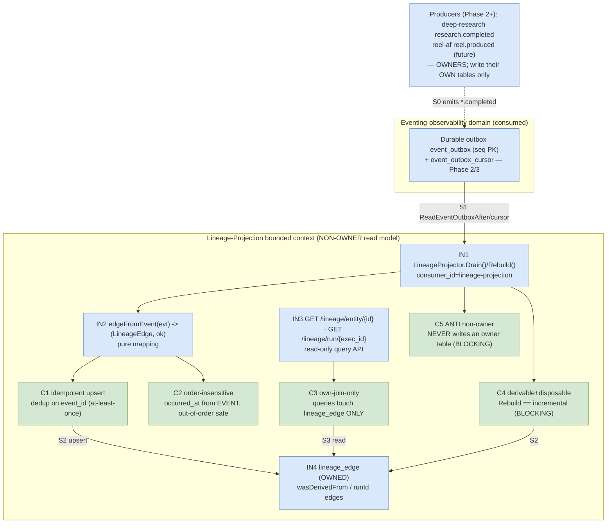
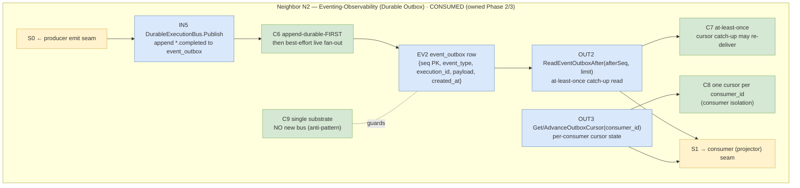
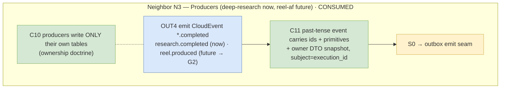
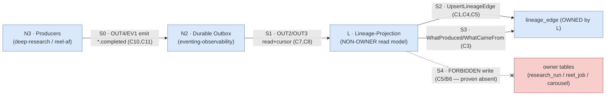

# Cross-App Lineage Projection — TDD Implementation Plan

> **Phase 4 of the cross-app integration plan**
> (`silmari-agentfield-system/thoughts/searchable/shared/plans/2026-07-12-cross-app-integration-research-to-reels-generalizable.md`,
> §7 Phase 4, §8 provenance sources).
>
> **⚠️ THIS PHASE IS OPTIONAL UPSIDE.** It is a dashboard / query surface, **never** part of any
> app's critical path. It **depends on Phase 2** (deep-research emitting `research.completed` into
> the durable outbox in a CloudEvents envelope) already existing, and it **reuses Phase 3's
> consumer port** (the idempotent `OutboxConsumer` + cursor idiom). If Phase 2 has not shipped,
> this plan does not start — there is nothing to project. Master §7: *"a dashboard, never an
> owner. Pure upside; no coupling."*
>
> **Seams this plan OWNS (per meta-repo ARCHITECTURE.md ownership doctrine):**
> its OWN schema — the `lineage` read-model tables (`lineage_edge`, `lineage_projection_cursor`) —
> the **projector** that consumes `*.completed` events and upserts edges, and the **read-only query
> API** (`what_produced` / `what_came_from`). This is a **CQRS read model / projection**
> (ARCHITECTURE.md:375-376, 394-410): it *reads* across domains by consuming their past-tense
> events and *joins ONLY its own projection tables*.
>
> **ANTI (load-bearing — the whole point):** this projection **NEVER writes any owner's tables,
> files, or indexes** (`deepresearch.research_run`, reel-af `reel_job`/`carousel`, …) and **NEVER
> becomes the owner** of a lineage fact. It stores derivation *edges by id/reference only*, exactly
> like the master's R1/R4. A read model may join across domains but "does not become an owner"
> (ARCHITECTURE.md:375-376). Enforced by a dedicated anti-behavior + a schema-access guard (Behavior 6).
>
> **Seams this plan CONSUMES (do NOT redefine):**
> - **Phase 2** — the `research.completed` event on the durable outbox: CloudEvents envelope
>   `{id, source, type=com.silmari.research.completed, subject=<execution_id>,
>   data={run_id, status, title, result_ref, research_prompt, research_document_id}}`
>   (master §3, §5.3). The projector consumes this; it does not own the emission.
> - **Phase 3** — the reusable **`OutboxConsumer` port** + **cursor** discipline
>   (`event_outbox_cursor(consumer_id PK, last_seq)`, `ReadEventOutboxAfter(afterSeq, limit)`,
>   at-least-once catch-up — grounding doc §3, §4). The projector registers a NEW `consumer_id`
>   (`"lineage-projection"`) and reuses the same read/advance primitives; it adds no new bus.

## Goal

Stand up an **optional, non-owner CQRS read model** that answers, across every app:

- **Forward:** *"given a reel/carousel, what research produced it?"* → `what_produced(entity_id)`.
- **Reverse:** *"given a research run, what reels/carousels came from it?"* → `what_came_from(run_id)`.

…by subscribing to `*.completed` domain events on the durable outbox and idempotently upserting
**derivation edges** into its OWN `lineage_edge` table. The edge is modeled directly on external
canon — we **mirror, we do not invent**:

- **OpenLineage object model** (Job / Run / Dataset; a stable **`runId`** minted at run start that
  travels with output) — https://openlineage.io/docs/spec/object-model/ .
- **W3C PROV** (Entity / Activity / Agent; **`wasDerivedFrom`** links a derived Entity to its
  source, **`wasGeneratedBy`** links an Entity to the Activity that produced it) —
  https://www.w3.org/TR/prov-dm/ .

The recorded edge is exactly: **downstream Entity (`reel`/`carousel`) `wasDerivedFrom` an upstream
Activity (`research_run`)**, keyed by **`execution_id`** — the system's canonical correlation id and
the OpenLineage-`runId` analog (master §4). Marquez is the reference implementation this mirrors
(https://marquezproject.ai/) — *a projection over lineage events, owned by no producer*.

## Current State Analysis

### Key Discoveries

- **The durable outbox exists and is the ONLY sanctioned event substrate** (grounding §1, §3).
  `event_outbox` (seq BIGSERIAL PK, event_type, execution_id, workflow_id, agent_node_id, payload
  JSON, created_at) + `event_outbox_cursor(consumer_id PK, last_seq)`; publisher = append-durable-
  FIRST then best-effort live fan-out; `ReadEventOutboxAfter(afterSeq, limit)` gives at-least-once
  cursor catch-up. **Do NOT spin up a new global bus / singleton — explicit anti-pattern**
  (grounding §1, §4). The projector is a NEW consumer on the EXISTING outbox.
- **Consumer idiom is package-local minimal interfaces + one cursor per `consumer_id`** (grounding
  §4): "define minimal package-local interfaces in the consuming package" satisfied by
  `*LocalStorage` via type assertion. The lineage projector defines its own `lineage.OutboxReader`
  interface (a subset: `ReadEventOutboxAfter`, `GetOutboxCursor`, `AdvanceOutboxCursor`) satisfied
  by the same `StorageProvider` — it invents no storage seam.
- **Ownership is absolute** (grounding §2, §5; ARCHITECTURE.md:100-102, 356-357): *"No context
  writes another context's tables… Only the owner writes its storage."* Read models "may join
  across domains but do not become owners" (ARCHITECTURE.md:375-376). This projection therefore
  gets its OWN `lineage` schema and touches no owner table — the single most important constraint
  in this plan.
- **`execution_id` is the canonical correlation key** (master §4): UNIQUE on the owner side
  (Phase 1), the CloudEvents `subject`, the OpenLineage-`runId` analog. The lineage edge keys the
  upstream Activity by exactly this id — it is the join column, minted upstream, carried in the event.
- **Events carry ids + primitives + owner DTO snapshots, never mutable foreign aggregates**
  (grounding §2; ARCHITECTURE.md:325-326). The projector stores only the small snapshot fields the
  event carries (`title`, `research_prompt`, `result_ref`, `research_document_id`) — thin index/
  label columns, never the research body. It fetches nothing by SQL from `deepresearch.*`.
- **Handlers must be idempotent + replay-safe** (grounding §3; ARCHITECTURE.md:327). At-least-once
  delivery ⇒ the projector dedups on the CloudEvents `id` and does an **idempotent upsert** keyed on
  `(downstream_entity_id, upstream_run_id, job)` — reprocessing the same event is a no-op.
- **The reverse direction needs a second `*.completed` producer to be interesting.** Forward
  (`what_produced`) works with just `research.completed` today. The reverse (`what_came_from`)
  becomes richly populated once reel-af emits its own `reel.produced` / `carousel.produced`
  `*.completed` event carrying `source_research_run_id`. Master §3 event vocabulary already lists
  `ReelProduced`. **This plan's projector is written to consume ANY `*.completed`** (a generic
  envelope matcher), so future producers plug in with zero projector changes — the "works for any
  app" payoff, applied to lineage.

### Files touched (declared blast radius)

Modular monolith Go layout under `silmari-agentfield-system/agentfield/control-plane` (mirrors the
outbox impl's `internal/storage` + `internal/events` split, grounding §3).

- `internal/storage/lineage_edge.go` — **new**; the `LineageEdge` GORM model + org-scoped upsert/
  query SQL (`UpsertLineageEdge`, `LineageEdgesByDownstream`, `LineageEdgesByUpstreamRun`), plus the
  projection cursor helpers if not folded into the shared cursor table (see Behavior 5).
- `internal/storage/migrations/0XX_create_lineage_edge.sql` — **new**; `lineage_edge` +
  (if separate) `lineage_projection_cursor`. **Its OWN `lineage` schema** — NOT `deepresearch`,
  NOT any reel-af schema. Mirrors migration `034` (outbox) as the pattern.
- `internal/lineage/projector.go` — **new**; `LineageProjector`: reads new outbox rows for
  `consumer_id="lineage-projection"`, matches `*.completed` envelopes, maps to `LineageEdge`,
  idempotent-upserts, advances the cursor. Defines package-local `lineage.OutboxReader` interface
  (grounding §4 idiom). **Never imports any owner package's write path.**
- `internal/lineage/envelope.go` — **new**; the CloudEvents `*.completed` → `LineageEdge` mapping
  (pure function `edgeFromEvent(evt) (LineageEdge, ok)`; unknown/malformed → `ok=false`, skip).
- `internal/lineage/query.go` — **new**; the read-only query service (`WhatProduced(entityID)`,
  `WhatCameFrom(runID)`) — joins ONLY `lineage_edge`; a compile/lint guard forbids owner-table imports.
- `internal/api/lineage_handlers.go` — **new**; read-only HTTP handlers
  `GET /lineage/entity/{id}` and `GET /lineage/run/{execution_id}` (optional dashboard surface).
- `internal/lineage/rebuild.go` — **new**; `Rebuild()` — truncate `lineage_edge`, reset the
  `lineage-projection` cursor to 0, re-drain the outbox from seq 0 (at-least-once, idempotent upsert).
- `specs/eventing-observability.domain.md` (or a new `specs/lineage-projection.domain.md`) —
  **update**; register the new read model, its consumer_id, and the `*.completed` subscription
  (ARCHITECTURE.md doctrine: update the spec before adding a table/event/capability).
- `internal/lineage/projector_test.go`, `envelope_test.go`, `query_test.go`, `rebuild_test.go` —
  **new**; unit + closure tests (all in-memory / SQLite-local; Postgres parity behind an env gate).

### Desired End State

- A `lineage_edge` table exists in a **`lineage`-owned** schema storing derivation edges
  `(downstream_entity_id, downstream_type, upstream_run_id, upstream_type, job, occurred_at,
  event_id, title?, research_prompt?, result_ref?, research_document_id?)`.
- A `LineageProjector` runs as a NEW outbox consumer (`consumer_id="lineage-projection"`),
  idempotently upserting one edge per distinct `*.completed` event, advancing its own cursor.
- `WhatProduced(entity_id)` returns the upstream research run(s) for a reel/carousel;
  `WhatCameFrom(execution_id)` returns downstream reels/carousels for a research run. Both join
  ONLY `lineage_edge`.
- Duplicate events (at-least-once) and out-of-order events converge to the SAME projection state
  (idempotent upsert; occurred_at from the event, not wall clock).
- `Rebuild()` drops the projection, resets the cursor to 0, and reconstructs an identical
  projection from the outbox — proving the read model is derivable, disposable, never authoritative.
- A **compile-time / lint guard** proves `internal/lineage/*` imports no owner write path and its
  SQL references no owner table (the ANTI, mechanized).

### Observable Behaviors

- **B1** — the `lineage_edge` schema + `LineageEdge` model exist in the `lineage`-owned schema; the
  migration creates them; no owner table is referenced.
- **B2** — `edgeFromEvent` maps a `research.completed` CloudEvent to a `wasDerivedFrom` edge keyed by
  `execution_id`; a non-`*.completed` or malformed envelope → skipped (`ok=false`), no edge.
- **B3** — the projector consumes new outbox rows for its cursor and upserts one edge per event;
  a **duplicate** event (same CloudEvents `id`) is a no-op (idempotent); **out-of-order** events
  converge to the same state (occurred_at from event).
- **B4** — `WhatProduced(entity_id)` (forward) and `WhatCameFrom(run_id)` (reverse) return the
  correct edges, joining ONLY `lineage_edge`; unknown id → empty, never error; **read-only**.
- **B5** — **rebuild-from-scratch (BLOCKING closure):** drop the projection + reset cursor →
  `Rebuild()` re-drains the outbox → the projection is byte-identical to the incrementally-built one.
- **B6 (ANTI, BLOCKING)** — the projection **never writes an owner table and never becomes an
  owner**: mechanized guard — `internal/lineage/*` imports no owner write package; its SQL touches
  only `lineage_*`; the projector has no code path that INSERT/UPDATE/DELETEs `deepresearch.*` or
  reel-af tables.
- **B7** — read-only query API: `GET /lineage/entity/{id}` / `GET /lineage/run/{execution_id}`
  return the edges as JSON; POST/PUT/DELETE are not routed (read model exposes no writes).

## What We're NOT Doing

- **Not** emitting any event — Phase 2 (deep-research) owns `research.completed`; a future reel-af
  Phase owns `reel.produced`. This plan only **consumes** `*.completed`.
- **Not** writing, migrating, de-duping, or constraining any owner table (`deepresearch.research_run`,
  reel-af `reel_job`/`carousel`) — that is Phase 0/1. This projection reads events, owns only `lineage_*`.
- **Not** replacing the app-local provenance (reel-af `source_research_run_id`, master R4). That FK
  stays the app's own truth; this is an *additional, optional, cross-app* view — not a substitute.
- **Not** introducing a new bus, broker (Kafka/NATS), or projection framework (Marquez the service).
  We mirror Marquez's *model*, on the EXISTING durable outbox (grounding §4 anti-pattern: no new bus).
- **Not** a full OpenLineage/PROV serialization surface — we store the minimal edge needed for the
  two queries; the OL/PROV mapping is documented for schema fidelity, not fully re-implemented.
- **Not** making anything depend on this projection — it is read-only upside; if it is down or
  empty, no app is affected.

## Testing Strategy

- **Framework:** Go `testing` + table tests, mirroring the outbox impl. Focused run:
  `go test ./internal/lineage/... ./internal/storage/ -run Lineage -count=1`; build-tag guarded
  Postgres parity behind `POSTGRES_TEST_URL` (grounding §3 parity note); default run is SQLite-local.
- **Unit — envelope (`envelope_test.go`):** `edgeFromEvent` over a table of CloudEvents:
  valid `research.completed` → correct `wasDerivedFrom` edge; non-completed type → skip; missing
  `subject`/`data.run_id` → skip (fail-safe, no partial edge). Pure function, no I/O.
- **Unit — projector (`projector_test.go`):** in-memory `StorageProvider` (SQLite) seeded with
  outbox rows; assert one edge per distinct event, cursor advance, **duplicate = no-op**,
  **out-of-order = same final state**. Fakes only at the storage seam (the real `LocalStorage`).
- **Unit — query (`query_test.go`):** seed `lineage_edge`; `WhatProduced`/`WhatCameFrom` return the
  right rows; unknown id → empty; a query that would need an owner table is impossible by
  construction (join is `lineage_edge` only) — asserted by the guard test, not a mock.
- **Closure — rebuild (`rebuild_test.go`, BLOCKING):** build the projection incrementally from a
  seeded outbox, snapshot it; drop + reset cursor; `Rebuild()`; assert the rebuilt projection
  **equals** the snapshot. Red-at-seam: skip the cursor reset in `Rebuild()` → the re-drain reads
  nothing → rebuilt projection empty → assertion red; restore reset → green.
- **Anti (`guard` test, BLOCKING):** a test that greps/asserts `internal/lineage/*` imports contain
  no owner write package and the package's SQL string constants match only `^lineage_`; plus a
  runtime assertion that the projector, driven over a full outbox, issues zero writes outside
  `lineage_*` (a recording `StorageProvider` wrapper counts writes per table).
- **Integration (`@postgres` build tag):** real Postgres `lineage_edge` upsert idempotency +
  the two queries against a live `lineage` schema; fail-closed (red) if `POSTGRES_TEST_URL` set but
  unreachable — never skip-to-green.
- **Mocking/Setup:** the outbox + cursor use the REAL `LocalStorage` (SQLite) — the storage seam is
  not mocked; only the *upstream event producers* are simulated by seeding `event_outbox` rows
  (standing in for Phase 2's emission, which is Phase 2's closure, not re-run here).

## Workflow Closure

One BLOCKING closure: **rebuild-from-scratch** (B5) — the projection is written by one path
(incremental projector) and reconstructed by a different path (`Rebuild()` re-draining the outbox),
and the two must be identical. This is the load-bearing proof that the read model is *derivable and
disposable* (CQRS: the projection is never the source of truth — the outbox is). Derived from the
master's "projection can be dropped and rebuilt from the outbox cursor" (§7 Phase 4), not invented.

### Production Operation Chain — event → edge → query, and drop → rebuild → identical

`deep-research emits research.completed` (Phase 2) → `DurableExecutionBus.Publish` appends to
`event_outbox` (seq N) → `LineageProjector.Drain()` reads rows after its cursor
(`ReadEventOutboxAfter(last_seq, limit)`) → `edgeFromEvent` maps each `*.completed` → `LineageEdge`
→ `UpsertLineageEdge` (idempotent on `(downstream_entity_id, upstream_run_id, job)`) →
`AdvanceOutboxCursor("lineage-projection", N)` → `WhatCameFrom(execution_id)` /
`WhatProduced(entity_id)` read `lineage_edge` → the dashboard/API renders the derivation.
**Rebuild path:** `Rebuild()` → truncate `lineage_edge` + `AdvanceOutboxCursor(..., 0)` (reset) →
re-`Drain()` from seq 0 → identical projection (at-least-once + idempotent upsert make re-drain safe).

### Closure Test: "the incrementally-built projection and the rebuilt-from-outbox projection are identical"   [BLOCKING: OBSERVABLE (the full edge set via the query path) is produced by one path (incremental Drain) and reconstructed by a different path (Rebuild's full re-drain) across the projector ↔ outbox-cursor boundary]

- **SOURCE (seed only):** a set of CloudEvents `*.completed` rows seeded into `event_outbox`
  (standing in for Phase 2's emission — that emission is Phase 2's closure, not re-run here),
  including at least one **duplicate** (same CloudEvents `id`, higher seq) and one **out-of-order**
  pair (later-occurred event at a lower seq).
- **TRIGGER (start):** `projector.Drain()` to steady state → snapshot `WhatCameFrom`/`WhatProduced`
  for every run/entity; then `projector.Rebuild()`; then re-snapshot via the SAME query methods.
  boundary = the projector↔cursor↔`lineage_edge` seam this plan owns.
- **DRIVERS (async edges):** none inside the test — `Drain()`/`Rebuild()` are synchronous over the
  seeded outbox; no sleep, no wall-clock (occurred_at is read from the event payload, so out-of-
  order is deterministic).
- **OBSERVE (assert via):** the **query API** (`WhatProduced`/`WhatCameFrom`) — the rebuilt result
  set **equals** the incremental snapshot for every id (order-independent set equality); the
  duplicate produced exactly ONE edge in both; the out-of-order pair produced the SAME edge in both.
- **FORBIDDEN SPAN:** the test never reads `lineage_edge` by raw SQL, never calls `UpsertLineageEdge`
  directly, never inspects projector internals — it drives `Drain`/`Rebuild` and reads only the two
  query methods (the production read path).
- **RED-AT-SEAM proof:** remove the cursor reset from `Rebuild()` (`AdvanceOutboxCursor(...,0)`) →
  the re-drain sees an already-advanced cursor, reads zero rows, rebuilt projection is empty →
  set-equality assertion goes **red**. Restore the reset → green. Record the transition.
- **DRIVABILITY:** storage seam present (real `LocalStorage`/SQLite, seeded outbox); the whole span
  is synchronous → no clock/driver seam needed. Drivable.
- **EXECUTION (must run):** default `go test ./internal/lineage/...` with **no external infra**
  (SQLite-local outbox + projection); the closure **always executes** (never skips). Live-Postgres
  parity lives behind the `@postgres` tag and fails-closed if `POSTGRES_TEST_URL` is unreachable.

---

## Behavior 1: `lineage_edge` schema + model in the lineage-owned schema   [LEAF]

**LEAF reason:** table/model existence + the ANTI (no owner table referenced) are verified by
direct migration + model assertions in-module; no async/consumer edge.

### Test Specification

**Given** the migration, **when** applied to a fresh DB, **then** `lineage_edge` exists with the
edge columns and its unique key `(downstream_entity_id, upstream_run_id, job)`; the CloudEvents
`event_id` column carries a UNIQUE index (dedup key); and **no owner table** (`research_run`,
`reel_job`, `carousel`) is created or altered by this migration (B1).

**Edge Cases:** re-applying the migration is idempotent; the projection cursor row for
`consumer_id="lineage-projection"` is absent until first drain (starts at 0 by convention).

**Files touched:** `internal/storage/lineage_edge.go`, `internal/storage/migrations/0XX_create_lineage_edge.sql`.

### 🔴 Red
**File:** `internal/storage/lineage_edge_test.go`
```go
func TestLineageEdgeSchemaExistsAndTouchesNoOwnerTable(t *testing.T) {
    db := freshLocalStorage(t) // applies migrations, SQLite-local
    assert.True(t, db.HasTable("lineage_edge"))
    // ANTI: this migration creates ONLY lineage_* — never an owner table
    assert.False(t, migrationCreatesTable(t, "0XX_create_lineage_edge.sql", "research_run"))
    assert.False(t, migrationCreatesTable(t, "0XX_create_lineage_edge.sql", "reel_job"))
    assert.False(t, migrationCreatesTable(t, "0XX_create_lineage_edge.sql", "carousel"))
    // unique dedup key on the CloudEvents id
    assert.True(t, db.HasUniqueIndex("lineage_edge", "event_id"))
}
```

### 🟢 Green
**File:** `internal/storage/lineage_edge.go`
```go
// LineageEdge = one PROV wasDerivedFrom / OpenLineage runId edge.
// downstream Entity (reel|carousel) wasDerivedFrom upstream Activity (research_run),
// keyed by execution_id. NON-OWNER: this is a projection row, never an owner aggregate.
type LineageEdge struct {
    ID                  int64  `gorm:"primaryKey;autoIncrement"`
    EventID             string `gorm:"uniqueIndex"`          // CloudEvents id — dedup / idempotency key
    DownstreamEntityID  string `gorm:"index:ux_edge,unique"` // reel/carousel id (PROV Entity)
    DownstreamType      string // "reel" | "carousel"
    UpstreamRunID       string `gorm:"index:ux_edge,unique"` // execution_id (OpenLineage runId / PROV Activity)
    UpstreamType        string // "research_run"
    Job                 string `gorm:"index:ux_edge,unique"` // OpenLineage Job / PROV Activity name, e.g. "research_to_carousel"
    OccurredAt          time.Time                            // from the EVENT, not wall clock
    // thin snapshot labels (event-carried primitives; NEVER the mutable research body):
    Title               string
    ResearchPrompt      string
    ResultRef           string
    ResearchDocumentID  string
}
```
Migration `0XX_create_lineage_edge.sql`: `CREATE TABLE lineage_edge (...)` in the **`lineage`**
schema with `UNIQUE(downstream_entity_id, upstream_run_id, job)` + `UNIQUE(event_id)`; optional
`lineage_projection_cursor` (see Behavior 5). Mirrors migration `034`. **Zero owner-table DDL.**

### 🔵 Refactor
- [ ] **Fits patterns:** model + migration mirror the outbox `event_outbox` (grounding §3); GORM
  autoincrement PK, explicit indexes.
- [ ] **Naming mirrors canon:** field names map 1:1 to OpenLineage (`runId`→`UpstreamRunID`,
  `Job`) and PROV (`wasDerivedFrom` = the edge itself; `OccurredAt` = generation time) — documented
  inline so the schema is auditable against the external spec.
- [ ] **No owner leakage:** the model has no FK to any owner table; ids are opaque strings (R1).

### Success Criteria
**Automated:**
- [ ] Schema + unique keys present; migration touches no owner table:
  `go test ./internal/storage/ -run LineageEdgeSchema -count=1`
- [ ] `go vet ./internal/storage/` clean

**Manual:** none.

---

## Behavior 2: `edgeFromEvent` — CloudEvents `*.completed` → `wasDerivedFrom` edge   [LEAF]

**LEAF reason:** a pure mapping function verified over a table of envelopes; no I/O, no consumer edge.

### Test Specification

**Given** a `research.completed` CloudEvent
(`type=com.silmari.research.completed`, `subject=<execution_id>`,
`data={run_id, status, title, result_ref, research_prompt, research_document_id}`), **when**
`edgeFromEvent` runs, **then** it returns `ok=true` and a `LineageEdge` with
`UpstreamRunID=execution_id` (the `subject`), `UpstreamType="research_run"`, `Job` from the event
(the OpenLineage Job), `OccurredAt` from the event time, and the snapshot labels copied. **Given**
a non-`*.completed` type OR a malformed envelope (missing `subject` or `data.run_id`), **then**
`ok=false`, no edge (fail-safe: never a partial edge) (B2).

**Edge Cases:** a future `reel.produced` `*.completed` carrying `source_research_run_id` maps to
the SAME edge shape with `DownstreamType="reel"` (reverse-direction population) — the matcher is
generic over `*.completed`, so new producers need no projector change; unknown `type` prefix that
still ends `.completed` but lacks the derivation fields → `ok=false`.

**Files touched:** `internal/lineage/envelope.go`, `internal/lineage/envelope_test.go`.

### 🔴 Red
**File:** `internal/lineage/envelope_test.go`
```go
func TestEdgeFromResearchCompleted(t *testing.T) {
    evt := cloudEvent("com.silmari.research.completed", "exec-42",
        map[string]any{"run_id": "run-x", "status": "succeeded", "title": "T",
            "research_prompt": "P", "result_ref": "ref-1", "research_document_id": "doc-9"})
    e, ok := edgeFromEvent(evt)
    assert.True(t, ok)
    assert.Equal(t, "exec-42", e.UpstreamRunID)      // subject == execution_id (OpenLineage runId)
    assert.Equal(t, "research_run", e.UpstreamType)
    assert.Equal(t, "P", e.ResearchPrompt)           // snapshot label copied, not the body
}
func TestNonCompletedAndMalformedAreSkipped(t *testing.T) {
    _, ok1 := edgeFromEvent(cloudEvent("com.silmari.research.started", "e", nil))
    _, ok2 := edgeFromEvent(cloudEvent("com.silmari.research.completed", "", map[string]any{}))
    assert.False(t, ok1); assert.False(t, ok2)       // fail-safe: no partial edge
}
```

### 🟢 Green
**File:** `internal/lineage/envelope.go`
```go
// edgeFromEvent maps ANY *.completed CloudEvent carrying derivation fields to a LineageEdge.
// Generic over the type suffix so future producers (reel.produced, carousel.produced) plug in
// with zero projector change. NEVER touches an owner table — pure in-memory mapping.
func edgeFromEvent(evt CloudEvent) (LineageEdge, bool) {
    if !strings.HasSuffix(evt.Type, ".completed") { return LineageEdge{}, false }
    if evt.Subject == "" { return LineageEdge{}, false } // execution_id required
    d := evt.Data
    runID, _ := d["run_id"].(string)
    if runID == "" { return LineageEdge{}, false }
    return LineageEdge{
        EventID: evt.ID, OccurredAt: evt.Time,
        UpstreamRunID: evt.Subject, UpstreamType: "research_run",
        DownstreamEntityID: downstreamID(evt), DownstreamType: downstreamType(evt),
        Job: jobFromEvent(evt), // OpenLineage Job / PROV Activity name
        Title: str(d["title"]), ResearchPrompt: str(d["research_prompt"]),
        ResultRef: str(d["result_ref"]), ResearchDocumentID: str(d["research_document_id"]),
    }, true
}
```

### 🔵 Refactor
- [ ] **Pure + total:** returns `(edge, ok)`, never panics on malformed input; every skip path tested.
- [ ] **Generic matcher:** `.completed` suffix + required-fields check — no per-producer branch;
  documents the "any app plugs in" property at the lineage layer.
- [ ] **Canon fidelity:** inline comment maps each field to OpenLineage/PROV so the mapping is auditable.

### Success Criteria
**Automated:**
- [ ] Valid map + all skip paths pass: `go test ./internal/lineage/ -run EdgeFrom -count=1`

**Manual:** none.

---

## Behavior 3: projector — idempotent upsert, duplicate & out-of-order safe   [LEAF]

**LEAF reason:** upsert dedup + cursor advance are observed directly off the real (SQLite) store at
the drain boundary; the full drop→rebuild round-trip is Behavior 5's BLOCKING closure.

### Test Specification

**Given** `event_outbox` seeded with `research.completed` rows (including a **duplicate** — same
CloudEvents `id`, higher seq — and an **out-of-order** pair — later-`OccurredAt` event at a lower
seq), **when** `projector.Drain()` runs, **then** exactly ONE edge exists per distinct event
(`event_id` unique + upsert on `(downstream_entity_id, upstream_run_id, job)`), the cursor advances
to the max seq consumed, and re-`Drain()` (no new rows) is a no-op (B3).

**Edge Cases:** a non-`*.completed` outbox row is skipped and the cursor still advances past it
(so it isn't re-read forever); a malformed `*.completed` is skipped, cursor advances, a counter
`lineage_events_skipped_total` increments (observability, not silent drop).

**Files touched:** `internal/lineage/projector.go`, `internal/storage/lineage_edge.go` (`UpsertLineageEdge`),
`internal/lineage/projector_test.go`.

### 🔴 Red
**File:** `internal/lineage/projector_test.go`
```go
func TestDrainIsIdempotentAndOrderInsensitive(t *testing.T) {
    st := freshLocalStorage(t)
    seedOutbox(st, // seq order deliberately != occurred order; dup id at the end
        ev("id-1", "com.silmari.research.completed", "exec-1", occ(2)),
        ev("id-2", "com.silmari.research.completed", "exec-2", occ(1)), // out-of-order
        ev("id-1", "com.silmari.research.completed", "exec-1", occ(2)), // DUPLICATE id
    )
    p := NewLineageProjector(st)
    require.NoError(t, p.Drain())
    edges := allEdges(st)
    assert.Len(t, edges, 2)                       // dup collapsed → one edge per distinct event
    assert.NoError(t, p.Drain())                  // re-drain: no new rows, no-op
    assert.Len(t, allEdges(st), 2)
    assert.Equal(t, cursorSeq(st, "lineage-projection"), maxSeq(st)) // advanced fully
}
```

### 🟢 Green
**File:** `internal/lineage/projector.go`
```go
type OutboxReader interface { // package-local minimal interface (grounding §4 idiom)
    ReadEventOutboxAfter(afterSeq int64, limit int) ([]OutboxRow, error)
    GetOutboxCursor(consumerID string) (int64, error)
    AdvanceOutboxCursor(consumerID string, seq int64) error
    UpsertLineageEdge(e LineageEdge) error // idempotent: ON CONFLICT (event_id) DO NOTHING
}
const lineageConsumerID = "lineage-projection"

func (p *LineageProjector) Drain() error {
    cur, _ := p.store.GetOutboxCursor(lineageConsumerID)
    for {
        rows, err := p.store.ReadEventOutboxAfter(cur, p.batch)
        if err != nil { return err }
        if len(rows) == 0 { return nil }
        for _, r := range rows {
            if e, ok := edgeFromEvent(decode(r.Payload)); ok {
                if err := p.store.UpsertLineageEdge(e); err != nil { return err } // idempotent
            } else { p.metrics.Inc("lineage_events_skipped_total") }
            cur = r.Seq
            if err := p.store.AdvanceOutboxCursor(lineageConsumerID, cur); err != nil { return err }
        }
    }
}
```
`UpsertLineageEdge` = `INSERT ... ON CONFLICT (event_id) DO NOTHING` (dedup on CloudEvents id) —
at-least-once + out-of-order safe because the edge is fully determined by the event, never by
arrival order.

### 🔵 Refactor
- [ ] **Reuses Phase 3 seam:** `OutboxReader` is a subset of the existing `StorageProvider`
  satisfied by `*LocalStorage` via type assertion (grounding §4) — NO new bus, NO new cursor table
  unless Behavior 5 chooses a separate projection cursor.
- [ ] **Idempotent + replay-safe:** dedup on `event_id`; cursor advances even for skipped rows
  (no infinite re-read); occurred_at from event (order-insensitive) — matches ARCHITECTURE.md:327.
- [ ] **Loud skips:** malformed/unknown → counter increment, never a silent drop.

### Success Criteria
**Automated:**
- [ ] Idempotent + out-of-order + cursor-advance pass:
  `go test ./internal/lineage/ -run Drain -count=1`
- [ ] Re-drain is a no-op; skip counter increments on malformed

**Manual:** none.

---

## Behavior 4: query API — forward `WhatProduced` + reverse `WhatCameFrom`, read-only, own-join-only   [LEAF]

**LEAF reason:** the two reads are observed directly off a seeded `lineage_edge`; the join is
`lineage_edge`-only by construction — no async, no owner table.

### Test Specification

**Given** `lineage_edge` seeded with edges, **when** `WhatProduced(entity_id)` (forward) runs,
**then** it returns the upstream research run(s) for that reel/carousel; **when**
`WhatCameFrom(execution_id)` (reverse) runs, **then** it returns the downstream reels/carousels for
that run. Both **join ONLY `lineage_edge`**; an unknown id → empty slice (never error); both are
**read-only** (no write path exists) (B4).

**Edge Cases:** an entity derived from multiple runs → all upstreams returned; a run feeding
multiple reels → all downstreams returned; querying a run with no downstream yet (forward-only
population, before reel-af emits) → empty reverse result, not an error.

**Files touched:** `internal/lineage/query.go`, `internal/lineage/query_test.go`.

### 🔴 Red
**File:** `internal/lineage/query_test.go`
```go
func TestForwardAndReverseJoinOnlyLineage(t *testing.T) {
    st := freshLocalStorage(t)
    seedEdges(st,
        edge("reel-A", "reel", "exec-1", "research_run", "research_to_reel"),
        edge("carousel-B", "carousel", "exec-1", "research_run", "research_to_carousel"),
    )
    q := NewLineageQuery(st)
    up := q.WhatProduced("reel-A")                 // forward
    assert.Equal(t, []string{"exec-1"}, runIDs(up))
    down := q.WhatCameFrom("exec-1")               // reverse — one run → two entities
    assert.ElementsMatch(t, []string{"reel-A", "carousel-B"}, entityIDs(down))
    assert.Empty(t, q.WhatProduced("nope"))        // unknown → empty, not error
}
```

### 🟢 Green
**File:** `internal/lineage/query.go`
```go
// Read-only projection queries. JOIN lineage_edge ONLY — never an owner table (R1/ANTI).
func (q *LineageQuery) WhatProduced(entityID string) []LineageEdge {   // forward
    return q.store.LineageEdgesByDownstream(entityID)
}
func (q *LineageQuery) WhatCameFrom(runID string) []LineageEdge {      // reverse
    return q.store.LineageEdgesByUpstreamRun(runID)
}
```
`LineageEdgesByDownstream` / `LineageEdgesByUpstreamRun` = `SELECT ... FROM lineage_edge WHERE ...`.
No join to `research_run`/`reel_job`/`carousel` — labels come from the edge's own snapshot columns.

### 🔵 Refactor
- [ ] **Own-join-only:** SQL references only `lineage_edge`; snapshot labels (title/prompt) served
  from the edge, satisfying "what came from what" without reading any owner (R1).
- [ ] **Total:** unknown id → empty slice; no error surface for a missing lineage.
- [ ] **Read-only:** the query type exposes no mutating method.

### Success Criteria
**Automated:**
- [ ] Forward + reverse + multi + unknown-empty pass: `go test ./internal/lineage/ -run Forward -count=1`

**Manual:** none.

---

## Behavior 5: rebuild-from-scratch — projection is derivable & disposable   [BLOCKING]

**BLOCKING reason:** the observable (the full edge set via the query path) is produced by one path
(incremental `Drain`) and reconstructed by a different path (`Rebuild` full re-drain) across the
projector↔outbox-cursor boundary — the CQRS derivability guarantee. See **Workflow Closure**.

### Test Specification

**Given** an outbox seeded (incl. duplicate + out-of-order) and the projection built incrementally,
**when** `Rebuild()` truncates `lineage_edge`, resets the `lineage-projection` cursor to 0, and
re-drains from seq 0, **then** the rebuilt projection (read via `WhatProduced`/`WhatCameFrom`) is
**identical** to the incremental one — proving the outbox, not the projection, is the source of
truth (B5).

**Edge Cases:** rebuild after ADDITIONAL events arrived post-snapshot → rebuilt projection includes
them (superset, still deterministic); rebuild is itself idempotent (rebuild twice = same state).

**Files touched:** `internal/lineage/rebuild.go`, `internal/lineage/rebuild_test.go`.

### 🔴 Red (closure test)
**File:** `internal/lineage/rebuild_test.go`
```go
func TestRebuildEqualsIncremental(t *testing.T) {   // BLOCKING closure
    st := freshLocalStorage(t)
    seedOutbox(st, dupAndOutOfOrderFixture()...)
    p := NewLineageProjector(st)
    require.NoError(t, p.Drain())
    before := snapshotViaQuery(st)                  // read ONLY via WhatProduced/WhatCameFrom
    require.NoError(t, p.Rebuild())                 // truncate + cursor->0 + re-drain
    after := snapshotViaQuery(st)
    assert.Equal(t, before, after)                  // derivable & disposable — outbox is truth
}
```

### 🟢 Green
**File:** `internal/lineage/rebuild.go`
```go
// Rebuild proves the projection is derivable from the outbox and never authoritative.
// Drops lineage_edge, resets the cursor to 0, re-drains at-least-once (idempotent upsert).
func (p *LineageProjector) Rebuild() error {
    if err := p.store.TruncateLineageEdges(); err != nil { return err }
    if err := p.store.AdvanceOutboxCursor(lineageConsumerID, 0); err != nil { return err } // reset
    return p.Drain()
}
```

### 🔵 Refactor
- [ ] **Derivability is the doctrine:** rebuild uses ONLY the outbox + idempotent upsert — no owner
  read, no external state; the projection is disposable (master §7 "dropped and rebuilt").
- [ ] **Closure drives the query path:** snapshot compares via `WhatProduced`/`WhatCameFrom`, not
  raw `lineage_edge` reads — asserts the user-visible read path.
- [ ] **Red-at-seam recorded:** removing the cursor reset makes the re-drain read nothing → red.

### Success Criteria
**Automated:**
- [ ] Rebuild == incremental (BLOCKING), always runs, never skips:
  `go test ./internal/lineage/ -run Rebuild -count=1`
- [ ] Rebuild is idempotent (twice = same)

**Manual:**
- [ ] On a live outbox, dropping + rebuilding the lineage projection yields the same dashboard.

---

## Behavior 6: ANTI — the projection never writes an owner table, never becomes an owner   [BLOCKING]

**BLOCKING reason:** the single load-bearing invariant of this whole phase (grounding §2/§5,
ARCHITECTURE.md:100-102/356-357/375-376). Mechanized so it cannot regress silently.

### Test Specification

**Given** the `internal/lineage/*` package and a projector driven over a full outbox, **when**
audited, **then** (a) no source file imports any owner **write** package
(`deepresearch` repo, reel-af `pg`/`carousel` write paths); (b) every SQL string in the package
matches `^\s*(SELECT|INSERT|UPDATE|DELETE).*\blineage_` and NEVER names `research_run`/`reel_job`/
`carousel`; (c) a recording `StorageProvider` wrapper, after a full `Drain()`+`Rebuild()`, counts
**zero** writes to any table outside `lineage_*` (B6). The projection is a consumer + read model —
never an owner.

**Edge Cases:** a future contributor adding an owner import → the import guard fails the build; a
future query joining an owner table → the SQL guard fails; both are compile/test-time, not runtime hope.

**Files touched:** `internal/lineage/guard_test.go` (+ a small `RecordingStore` test helper).

### 🔴 Red
**File:** `internal/lineage/guard_test.go`
```go
func TestLineageNeverWritesOwnerTables(t *testing.T) {   // ANTI, BLOCKING
    // (a) import guard
    imports := packageImports(t, "internal/lineage")
    for _, banned := range []string{"deepresearch", "reel_job", "carousel/write"} {
        assert.NotContains(t, imports, banned)
    }
    // (b) SQL guard — every statement is lineage_*-only
    for _, sql := range sqlStringsIn(t, "internal/lineage", "internal/storage/lineage_edge.go") {
        assert.Regexp(t, `\blineage_`, sql)
        for _, owner := range []string{"research_run", "reel_job", " carousel "} {
            assert.NotContains(t, sql, owner)
        }
    }
    // (c) runtime: drive a full projection, assert zero writes outside lineage_*
    rec := NewRecordingStore(freshLocalStorage(t))
    seedOutbox(rec, dupAndOutOfOrderFixture()...)
    p := NewLineageProjector(rec); _ = p.Drain(); _ = p.Rebuild()
    assert.Empty(t, rec.WritesOutside("lineage_")) // never wrote an owner table
}
```

### 🟢 Green
No production code beyond Behaviors 1–5 — this behavior is a **guard** that must pass given the
existing design. If it fails, the DESIGN is wrong (redesign, per ARCHITECTURE.md:571-573), not the test.
`RecordingStore` is a thin `StorageProvider` decorator recording `(table, op)` per write.

### 🔵 Refactor
- [ ] **Mechanized ANTI:** the doctrine "no context writes another's tables" is a passing test, not
  a comment — grounding §5 verbatim rule enforced in CI.
- [ ] **Three layers:** static import guard + static SQL guard + runtime write-recorder — defence in depth.
- [ ] **Fail-closed on regression:** any owner write/import/join added later turns this test red.

### Success Criteria
**Automated:**
- [ ] Import + SQL + runtime write guards pass (BLOCKING):
  `go test ./internal/lineage/ -run NeverWritesOwner -count=1`

**Manual:**
- [ ] Spec (`specs/*.domain.md`) records the read model as NON-OWNER before merge (doctrine gate).

---

## Behavior 7: read-only HTTP query surface (optional dashboard)   [LEAF]

**LEAF reason:** two read handlers observed at the HTTP boundary against the query service; no
writes routed.

### Test Specification

**Given** a seeded projection, **when** `GET /lineage/entity/{id}` and `GET /lineage/run/{execution_id}`,
**then** JSON edge lists are returned; unknown id → `200` empty list; POST/PUT/DELETE to these paths
→ `405`/not-routed (the read model exposes NO write) (B7).

**Edge Cases:** the API is optional — if the dashboard is not mounted, no app is affected; the
handlers call only `LineageQuery` (read-only), never the projector's write path.

**Files touched:** `internal/api/lineage_handlers.go`, `internal/api/lineage_handlers_test.go`.

### 🔴 Red
```go
func TestLineageReadEndpoints(t *testing.T) {
    srv := newTestServer(seededLineage(t))
    r := srv.GET("/lineage/entity/reel-A"); assert.Equal(t, 200, r.Code)
    assert.Contains(t, r.Body.String(), "exec-1")
    assert.Equal(t, 200, srv.GET("/lineage/run/exec-1").Code)
    assert.Equal(t, 200, srv.GET("/lineage/entity/unknown").Code) // empty list, not 404/500
    assert.NotEqual(t, 200, srv.POST("/lineage/entity/reel-A").Code) // no write route
}
```

### 🟢 Green
```go
// Read-only lineage endpoints. Delegate to LineageQuery; NO mutating route registered.
func registerLineageRoutes(mux *http.ServeMux, q *LineageQuery) {
    mux.HandleFunc("GET /lineage/entity/{id}", func(w, r) { writeJSON(w, q.WhatProduced(id)) })
    mux.HandleFunc("GET /lineage/run/{execution_id}", func(w, r) { writeJSON(w, q.WhatCameFrom(id)) })
}
```

### 🔵 Refactor
- [ ] **Read-only by construction:** only GET routes registered; no handler calls a write path.
- [ ] **Optional:** mounting is behind a feature flag / config; absence affects no app.

### Success Criteria
**Automated:**
- [ ] Read endpoints + empty-unknown + no-write-route pass:
  `go test ./internal/api/ -run Lineage -count=1`

**Manual:**
- [ ] The dashboard renders "reel X ← research run Y" for a real run.

---

## Order of Implementation

1. `lineage_edge` schema + model + migration (B1) — the owned read-model store.
2. `edgeFromEvent` envelope mapping (B2) — pure, canon-faithful.
3. Projector: idempotent drain, duplicate/out-of-order safe (B3), reusing Phase 3's cursor idiom.
4. Query service: forward + reverse, own-join-only (B4).
5. Rebuild closure (B5, BLOCKING) + the ANTI guard (B6, BLOCKING).
6. Optional read-only HTTP surface (B7).
7. Postgres parity (`@postgres` tag) for upsert idempotency + queries.

## References

- **Master design doc (this is Phase 4 of it):**
  `silmari-agentfield-system/thoughts/searchable/shared/plans/2026-07-12-cross-app-integration-research-to-reels-generalizable.md`
  (§7 Phase 4 "optional lineage projection"; §3 R1/R4 provenance rules; §4 `execution_id` = OpenLineage
  runId analog; §5.3 `research.completed` payload; §8 provenance/lineage sources).
- **Eventing + read-model doctrine (grounding):**
  `.../scratchpad/eventing_direction.md` (§1 durable outbox = only substrate, no new bus; §2 ownership
  + projections don't become owners; §3 outbox/cursor state; §4 consumer port idiom; §5 verbatim
  "no context writes another context's tables").
- **House-style plan (matched):**
  `carousel-impl/thoughts/searchable/shared/plans/2026-07-11-tdd-06-carousel-review-and-routes.md`
  (frontmatter, Behavior/Red-Green-Refactor, System Map, Observability, closure framework).
- **External canon (schema mirrored, NOT invented):**
  [OpenLineage object model / runId](https://openlineage.io/docs/spec/object-model/) ·
  [W3C PROV-DM `wasDerivedFrom`/`wasGeneratedBy`](https://www.w3.org/TR/prov-dm/) ·
  [Marquez (reference projection)](https://marquezproject.ai/) ·
  [CQRS](https://microservices.io/patterns/data/cqrs.html) ·
  [Idempotent Consumer](https://microservices.io/patterns/communication-style/idempotent-consumer.html).
- **Meta-repo doctrine:** `silmari-agentfield-system/ARCHITECTURE.md`
  (100-102, 325-327, 356-357, 375-376, 394-410, 571-573 — ownership, events carry ids, projections
  are non-owners, redesign-on-violation).
- **Closure framework:** `~/.claude/commands/references/closure-test-framework.md`.
- **Consumed prior-phase code (once shipped):** `internal/storage/event_outbox.go`,
  `internal/events/durable_bus.go` (`ReadEventOutboxAfter`, `GetOutboxCursor`, `AdvanceOutboxCursor`).

---

## System Map

Bounded-context System Map for the **Lineage-Projection** read model. Analysis-only. **Definitions:**
`S#` = boundary crossing; `IN#` = inbound port; `OUT#` = outbound port; `EV#` = consumed domain
event; `C#` = contract (invariant + pre/post on a named target); Grammar = EBNF. Every diagram node
has a stable ID and exactly one EBNF entry.

**Context roster (single owned context):**
- **Lineage-Projection** — the sole owned context: `lineage_edge` read model + projector + query
  API. Its neighbors (the durable Outbox = eventing-observability domain; the event *producers* =
  deep-research / reel-af nodes) are **consumed** and shown as external actors. **It owns ONLY
  `lineage_*`; it is a NON-OWNER of every producer table.**

### (a) Boundary diagram — Lineage-Projection context



### (b) EBNF grammar — every diagram ID ↔ exactly one entry

```ebnf
(* ---- Inbound interfaces ---- *)
IN1 = "LineageProjector." , ( "Drain()" | "Rebuild()" )
      -> reads outbox after cursor(consumer_id="lineage-projection") , upserts edges , advances cursor ;
IN2 = "edgeFromEvent(" , CloudEvent , ")" -> "(" , LineageEdge , "," , ok:bool , ")" ;
      (* ok=false for non-*.completed OR missing subject/run_id — fail-safe, no partial edge *)
IN3 = ( "GET /lineage/entity/" , id -> '[LineageEdge]' )
    | ( "GET /lineage/run/" , execution_id -> '[LineageEdge]' ) ;   (* read-only; unknown -> [] *)
IN4 = "lineage_edge" , "(" , downstream_entity_id , downstream_type , upstream_run_id ,
      upstream_type , job , occurred_at , event_id:UNIQUE , snapshot_labels , ")" ;
      (* OWNED table; UNIQUE(event_id) = dedup; UNIQUE(downstream_entity_id, upstream_run_id, job) *)

(* ---- Consumed event (payload schema — Phase 2, mirrored not owned) ---- *)
EV1 = event "research.completed" (CloudEvents) ,
      '{ id, source, type="com.silmari.research.completed", subject=execution_id,
         data:{ run_id, status, title, result_ref, research_prompt, research_document_id } }' ;

(* ---- Outbound (consumed store seam — Phase 3, reused) ---- *)
OUT1 = "store." , ( "ReadEventOutboxAfter(afterSeq, limit)" | "GetOutboxCursor(cid)"
     | "AdvanceOutboxCursor(cid, seq)" ) ;   (* reused Phase 3 primitives; NO new bus *)

(* ---- Contracts ---- *)
C1 = target:"UpsertLineageEdge" , invariant:"one edge per distinct CloudEvents id" ,
     pre:"at-least-once delivery may repeat an event" ,
     post:"ON CONFLICT(event_id) DO NOTHING -> duplicate is a no-op (idempotent)" ;
C2 = target:"edgeFromEvent + upsert" , invariant:"edge fully determined by the event, not arrival order" ,
     pre:"events may arrive out of seq order" ,
     post:"occurred_at from event data -> out-of-order converges to identical state" ;
C3 = target:"LineageQuery.WhatProduced/WhatCameFrom" , invariant:"SELECT touches lineage_edge ONLY" ,
     pre:"a query for produced/derived entities" ,
     post:"labels served from edge snapshot columns ; NO owner-table join ; unknown id -> []" ;
C4 = target:"LineageProjector.Rebuild" , invariant:"projection is derivable from the outbox alone" ,
     pre:"projection dropped + cursor reset to 0" ,
     post:"re-drain reconstructs a projection identical to the incremental one (outbox = source of truth)" ;
C5 = target:"internal/lineage/*" , invariant:"NEVER writes an owner table, NEVER becomes an owner" ,
     pre:"projector drains a full outbox" ,
     post:"zero writes outside lineage_* ; no owner write-import ; no owner-table SQL (ANTI, BLOCKING)" ;
```

### (c) Seam table

| Seam | Crossing | Direction | Contract(s) | Mechanism | Test drive | Notes |
|---|---|---|---|---|---|---|
| **S0** | producer → outbox | inbound event `EV1` | — (Phase 2) | producer appends `*.completed` to `event_outbox` | seeded `event_outbox` rows | **consumed**; emission is Phase 2's closure, not re-run here |
| **S1** | outbox → projector | inbound consume | C1,C2 | `ReadEventOutboxAfter` + cursor `consumer_id="lineage-projection"` | real `LocalStorage` (SQLite) | reuses Phase 3 cursor idiom; NO new bus (grounding §4) |
| **S2** | projector → `lineage_edge` | outbound write (OWNED) | C1,C4,C5 | `UpsertLineageEdge` `ON CONFLICT(event_id) DO NOTHING` | real store | the ONLY write this context makes — to its OWN table |
| **S3** | query API → `lineage_edge` | outbound read (OWNED) | C3 | `LineageEdgesByDownstream/ByUpstreamRun` | seeded edges | own-join-only; unknown → [] |
| **S4** | (ANTI) projector → owner tables | — | C5 | **MUST NOT EXIST** | `RecordingStore.WritesOutside("lineage_")==∅` + import/SQL guard | `gap`-prevention: mechanized non-owner proof |

### INDEX

- **Context roster:** 1 owned context (**Lineage-Projection**); 3 consumed neighbors (Outbox=
  eventing-observability, Producers=deep-research/reel-af nodes shown as edge actors).
- **Context→context diagram:** `Producers —S0/EV1→ Outbox —S1→ Lineage-Projection —{S2 write, S3
  read}→ lineage_edge`; the forbidden `S4` (projector→owner) is proven absent (C5).
- **Node/ID census:** IN1–IN4, OUT1, EV1, C1–C5, S0–S4 — each appears once in a diagram and once in
  EBNF (**orphan-check: PASS — 0 orphans**; S4 = the ANTI seam, present in the table as a
  must-not-exist row mechanized by C5/B6).
- **Gap / risk register:**
  - **G1 (dependency)** — this phase is **inert until Phase 2 emits `research.completed`**. Risk:
    building the projector with no events → empty projection. Mitigation: tests seed `event_outbox`
    directly (Phase 2's emission is its own closure); ship this only after Phase 2 flows.
  - **G2 (`gap`)** — **reverse `WhatCameFrom`** is thinly populated until a downstream producer
    (reel-af `reel.produced`) emits `*.completed` with `source_research_run_id`. Mitigation: the
    envelope matcher is generic over `*.completed`, so that producer plugs in with zero projector
    change (the "any app" payoff). Forward (`WhatProduced`) works from research events alone.
  - **G3 (ANTI, prevented)** — a future contributor could add an owner write/join. Mitigation:
    B6's import + SQL + runtime write guards fail the build (mechanized, not documented).

**Acceptance self-check (System Map):**
- [x] Three parts present (mermaid boundary diagram, EBNF grammar, seam table).
- [x] Every node has a stable ID; all four classDefs used; NON-OWNER labeled on the context.
- [x] The forbidden owner-write seam (**S4**) present as a must-not-exist row, mechanized by C5/B6.
- [x] EBNF: every ID ↔ one entry; EV1 = consumed payload schema; C# = invariant+pre/post. Orphan-check PASS.
- [x] Dependency on Phase 2 + optional/upside status called out in the roster + gap register.

### Enriched map — consumed-neighbor contexts (AS-IS; owned by Phase 2/3, modeled for the seams this plan depends on)

The context above fully develops the **Lineage-Projection** owned context. To make the cross-context
picture complete (and satisfy `/system_map`'s "for EACH context" rule), the two **consumed
neighbors** this plan crosses seams with are given their own diagram + grammar + seam table below.
They are **NOT owned here** — Eventing-Observability is owned by Phase 2/3, Producers by the emitting
apps — so their contracts are the ones this plan *depends on and must not violate*, not ones it
enforces. New IDs (`IN5`, `OUT2`, `OUT3`, `OUT4`, `EV2`, `C6`–`C11`) do not collide with the owned
context's IDs; seams `S0`/`S1` are the SAME seams, viewed from the neighbor side.

#### Neighbor Context N2 — Eventing-Observability (Durable Outbox) · owned by Phase 2/3

**(a) Boundary diagram**



**(b) EBNF grammar** (N2 owns IN5, OUT2, OUT3, EV2, C6–C9)

```ebnf
IN5  = "DurableExecutionBus.Publish(" , CloudEvent , ")" -> "append event_outbox (seq := nextval)" ;
OUT2 = "ReadEventOutboxAfter(" , afterSeq:int64 , "," , limit:int , ")" -> "[OutboxRow]" ;
OUT3 = "GetOutboxCursor(" , consumer_id , ")" -> last_seq:int64
     | "AdvanceOutboxCursor(" , consumer_id , "," , seq:int64 , ")" -> ok ;
EV2  = row "event_outbox" ,
       "{" , "seq:BIGSERIAL PK" , "," , "event_type" , "," , "execution_id" , "," ,
       "workflow_id" , "," , "agent_node_id" , "," , "payload:JSON" , "," , "created_at" , "}" ;
       (* the PHYSICAL stored form of the logical EV1 CloudEvent *)
C6   = target "DurableExecutionBus.Publish" , invariant "durability precedes delivery" ,
       pre "an event is emitted" , post "row committed to event_outbox BEFORE any live fan-out" ;
C7   = target "ReadEventOutboxAfter + cursor" , invariant "at-least-once delivery" ,
       pre "a consumer reads after its cursor" , post "every row seen >=1 time (may repeat) until cursor advances" ;
C8   = target "event_outbox_cursor" , invariant "one (consumer_id -> last_seq) row per consumer" ,
       pre "consumer_id='lineage-projection' registers" , post "its cursor is isolated from other consumers" ;
C9   = target "eventing substrate" , invariant "the durable outbox is the ONLY event substrate" ,
       pre "a new consumer/producer appears" , post "no new bus/broker/singleton introduced (grounding §1/§4)" ;
```

**(c) Seam table**

| Seam | Crossing IN/OUT | Events | Contracts | Notes |
|---|---|---|---|---|
| **S0** producer→outbox | IN5 (in) | EV1→EV2 (logical→stored) | C6, C9 | append-durable-first; emission owned by producers (N3) |
| **S1** outbox→projector | OUT2, OUT3 (out) | EV2 | C7, C8 | the read/cursor primitives the Lineage projector reuses (Phase 3 idiom) |

#### Neighbor Context N3 — Producers (event emitters) · owned by Phase 2 / future reel-af

**(a) Boundary diagram**



**(b) EBNF grammar** (N3 owns OUT4, C10, C11)

```ebnf
OUT4 = "emit" , CloudEvent ,
       "{" , "type=com.silmari.<domain>.completed" , "," , "subject=execution_id" , "," , "data{...}" , "}" ;
       (* research.completed today; reel.produced/carousel.produced future (G2) — generic *.completed *)
C10  = target "each producer app" , invariant "a producer writes only its OWN tables" ,
       pre "producer finishes a unit of work" , post "it emits an event; it never writes a consumer/peer table" ;
C11  = target "*.completed payload" , invariant "event carries ids + primitives + owner DTO snapshot" ,
       pre "an aggregate completes" ,
       post "subject=execution_id; data = small labels (title/prompt/result_ref/doc_id), NEVER a mutable foreign aggregate" ;
```

**(c) Seam table**

| Seam | Crossing IN/OUT | Events | Contracts | Notes |
|---|---|---|---|---|
| **S0** producer→outbox | OUT4 (out) | EV1 | C10, C11 | producers emit past-tense `*.completed`; keyed by `execution_id`; reverse-direction (`reel.produced`) is future (**G2**) |

#### Unified cross-context INDEX (all three contexts)

**Full context roster**

| Ctx | Name | Ownership | Owns IDs |
|---|---|---|---|
| **L** | Lineage-Projection | **OWNED here** (this plan) | IN1–IN4, OUT1, EV1, C1–C5, S2, S3, S4 |
| **N2** | Eventing-Observability (Durable Outbox) | CONSUMED (Phase 2/3) | IN5, OUT2, OUT3, EV2, C6–C9 |
| **N3** | Producers (deep-research / reel-af) | CONSUMED (Phase 2 / future) | OUT4, C10, C11 |
| seams | — | cross-context | S0, S1 (+ owned S2/S3/S4) |

**Full context-map diagram**



**Orphan-check (enrichment IDs):** new IDs `IN5, OUT2, OUT3, OUT4, EV2, C6, C7, C8, C9, C10, C11`
each appear once in a neighbor diagram and once in its EBNF block — **0 orphans**; seams `S0`/`S1`
now carry their crossing interfaces from **both** sides (producer/outbox and outbox/projector). The
gap register (G1 Phase-2 dependency, G2 reverse-direction until `reel.produced`, G3 mechanized ANTI)
is unchanged and now visibly anchored to N3's `OUT4` (G2) and L's `S4` (G3).

**Acceptance self-check (enrichment):**
- [x] Each consumed neighbor (N2, N3) now has all three parts (diagram + grammar + seam table).
- [x] New IDs are 1:1 with grammar; no collision with the owned context's IDs; no orphans.
- [x] AS-IS vs neighbor-ownership kept explicit (N2/N3 CONSUMED, contracts depended-on not enforced).
- [x] The forbidden owner-write seam **S4** re-shown on the full context-map as `gap`, crossed out (`-.-x`).
- [x] Provisional/future boundary (`reel.produced`, G2) labeled with reason on `OUT4`.

---

## Observability (wide events / OTel)

**Honeycomb principle:** emit **ONE wide span per unit of work** (a projector drain and each query),
carrying high-cardinality attributes so any "why did this reel's lineage look wrong" question is
answerable at query time. **High cardinality is valuable** (per-run, per-entity, per-event debugging).

**High-cardinality dimensions (the debugging keys):** `execution_id` (upstream run), `entity_id`
(downstream reel/carousel), `event_id` (CloudEvents id / dedup key), `consumer_id="lineage-projection"`.

### Concrete spans (one wide span per unit of work)

| Span | Unit of work | WHAT | WHERE / state | Outcome |
|---|---|---|---|---|
| **`lineage.drain`** | `LineageProjector.Drain` | `events.read`, `edges.upserted`, `events.skipped`†, `cursor.from`/`cursor.to` | `duplicate.collapsed` (int, at-least-once dedup), `outoforder.observed` (bool), `consumer_id` | `ok`, `error.type` |
| **`lineage.rebuild`** | `LineageProjector.Rebuild` | `edges.truncated`, `edges.rebuilt`, `cursor.reset=true` | `rebuild.equals_incremental` (bool — the BLOCKING invariant, C4) | `ok`, `error.type` |
| **`lineage.query`** | `WhatProduced`/`WhatCameFrom` | `query.direction` (`forward|reverse`), `id`†, `edges.returned` | `owner_table_touched=false` (C3/C5 invariant, asserted always false), `route.latency_ms` | `200`, `error.type` |

† `events.skipped` = non-`*.completed`/malformed (loud, never silent). `id`/`execution_id`/`event_id`
= **high-cardinality** BubbleUp dimensions (flag).

**Instrumentation notes (grounded in this plan's seams):**
- `lineage.drain` records `duplicate.collapsed` and `outoforder.observed` so the idempotency/order
  contracts (C1/C2) are observable in production, not just in tests.
- `owner_table_touched=false` is emitted on every query/drain span as a **runtime witness** of the
  ANTI (C5/B6) — if it ever flips true, an alert fires and the design has regressed
  (ARCHITECTURE.md:571-573 → redesign).
- `rebuild.equals_incremental` surfaces the CQRS derivability guarantee (C4) as a monitorable signal.

**Acceptance self-check (Observability):** one wide span per unit of work (3 spans: drain, rebuild,
query); high-cardinality keys flagged (`execution_id`/`entity_id`/`event_id`); the ANTI is a runtime
witness (`owner_table_touched=false`); idempotency + order + derivability are observable dimensions.

---

## Integration & E2E Testing

- **Integration (`@postgres` build tag, `POSTGRES_TEST_URL`):** real Postgres `lineage_edge` upsert
  idempotency (duplicate `event_id` → one row), forward/reverse queries against a live `lineage`
  schema, and `Rebuild()` equality. **Not** in the default run; **fail-closed** (red) if the URL is
  set but unreachable — never skip-to-green (grounding §3 parity note).
- **E2E (manual, deploy — only after Phase 2 ships):** on the control plane with the durable outbox
  live, run a real deep-research execution → confirm `research.completed` lands in `event_outbox` →
  the `lineage-projection` consumer drains it → `GET /lineage/run/{execution_id}` shows the
  downstream reel/carousel once reel-af creates one → drop `lineage_edge`, `Rebuild()`, confirm the
  dashboard is unchanged. Confirm (audit) that `deepresearch.research_run` and reel-af tables are
  **byte-identical before and after** a full drain+rebuild (the NON-OWNER guarantee, live).
