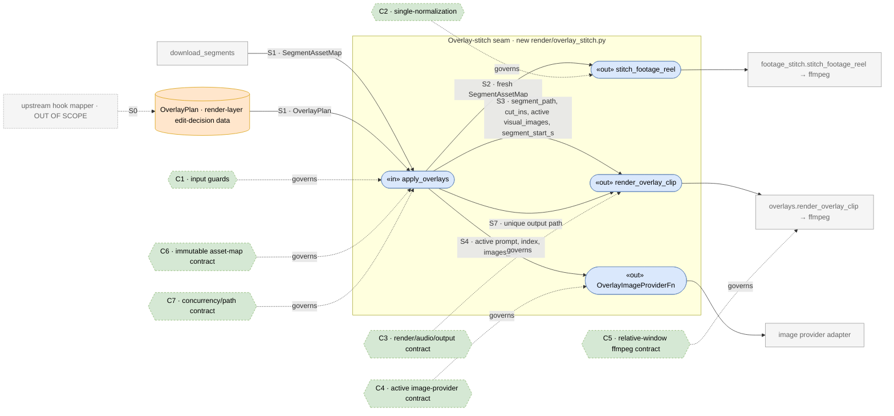
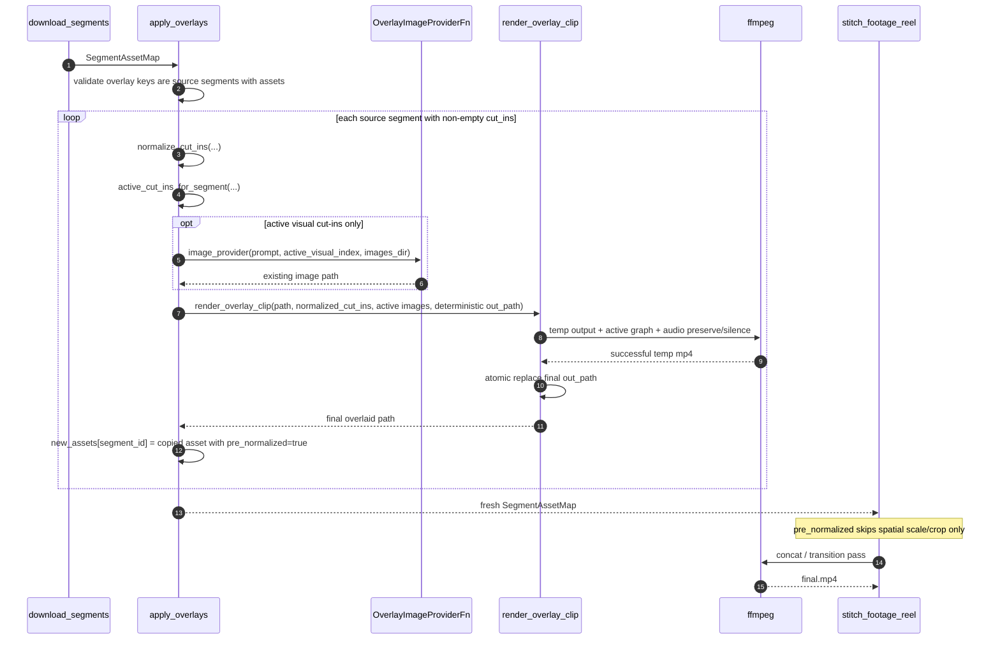
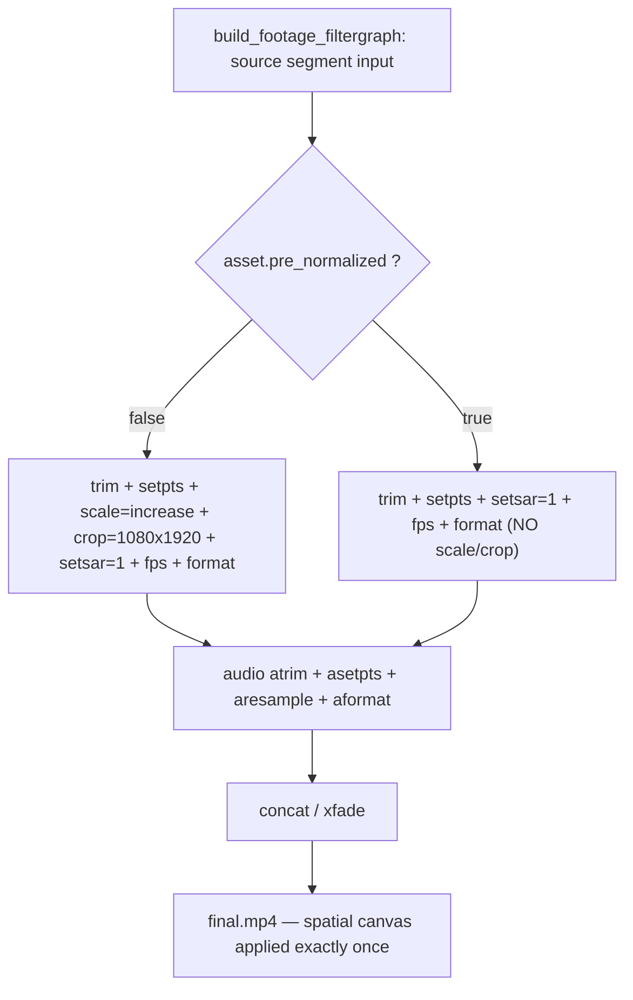

# TDD Plan — Cut-in overlay ➜ footage-stitch worker seam

## Implementation status — 2026-07-15 (implemented, all green)

Implemented via Red→Green→Refactor. 76 targeted tests pass; full suite 707 passed
(1 pre-existing unrelated failure: `test_provider_config.py` DEFAULT_MODEL drift).

- [x] Data model — `DownloadedSegment.pre_normalized: bool = False` (+ model tests)
- [x] B4 — pre-normalized stitch fragment skips spatial scale/crop (`_source_video_fragment`)
- [x] `active_cut_ins_for_segment()` extracted + reused in `build_overlay_filtergraph`
- [x] B2/B3/B5 — `apply_overlays()` swap+mark, active-window images, inactive-still-renders
- [x] B1/B6/B7 — identity, guards/failure/immutability, bounded concurrency + unique paths
- [x] `render_overlay_clip` — audio preserve/silence, temp→atomic publish, cleanup, cancel-drain
- [x] B8 — real-ffmpeg closure (fail-closed); **red-at-seam observed** (connector disabled → red)

New/changed: `render/overlay_stitch.py` (new), `render/overlays.py`, `render/footage_stitch.py`,
`dsl/models.py`, `tests/dsl/test_overlay_stitch{,_integration}.py`, `test_models.py`,
`test_overlays.py`, `test_footage_stitch_graph.py`.

## Goal (one behavior)

Library/worker-level behavior: given a `FootageReel`, a `SegmentAssetMap`, and an
already planned `OverlayPlan`, render source-footage cut-ins into the affected
source segments and then let `stitch_footage_reel()` produce a final mp4 where:

- every zoom/visual cut-in appears at the correct **source-time** window;
- each output segment keeps an audio stream compatible with the stitcher;
- the 1080×1920 canvas is spatially normalized exactly once;
- failed, timed-out, or cancelled overlay work leaves no published partial files;
- the caller's input `SegmentAssetMap` is never mutated.

This slice mounts the render-library / worker seam only. It does **not** change
`CompileResult`, add the transcript-hook mapper, or expose a new web target /
allowlist entry. A caller that already has `FootageReel + OverlayPlan` can use
this seam to produce a stitched mp4; product reachability is a separate slice.

Today `render_overlay_clip()` and `CutInOverlay` exist but are unmounted
(`render_overlay_clip` has no production callers). This plan builds the missing
consumer between segment download and footage stitch.

## Review issues fixed in this revision

| Review issue | Plan amendment |
|---|---|
| Visual image count/order conflicted with active-window filtering | Add `active_cut_ins_for_segment()` and derive image prompts from that same active list. Provider calls are one per **active** visual cut-in, not one per total visual cut-in. |
| Overlay outputs could lack audio | `render_overlay_clip()` must preserve source audio or synthesize stereo silence so the stitcher can always consume `[input_idx:a]`. |
| Failure cleanup and cancellation were not owned | `render_overlay_clip()` owns temp output, atomic publish, temp cleanup on failure/cancel, and ffmpeg kill/drain on `BaseException`; `apply_overlays()` cancels and awaits sibling tasks. |
| Concurrent output paths and map mutation were underspecified | `apply_overlays()` returns a new mapping, never mutates the input, and writes deterministic per-run/per-segment outputs under `out_dir/overlays/<run_id>/`. |
| Single-normalization proof was too weak | Tests must assert both pure filtergraph strings and the success-path stitch graph after `apply_overlays()`; pre-normalized clips skip only spatial `scale/crop`, while keeping trim, PTS, SAR, FPS, pixel format, and audio normalization. |

## The seam (where it lives)

```
upstream mapper (OUT OF SCOPE) ──▶ OverlayPlan

FootageReel
   │
download_segments(reel, out_dir, fetch) ──▶ SegmentAssetMap        # footage_stitch.py:88
   │
   ▼
apply_overlays(                                                   # NEW: render/overlay_stitch.py
    reel,
    segment_assets,
    overlay_plan,
    out_dir,
    run_id,
    image_provider=OverlayImageProviderFn,
    concurrency=None,
) ──▶ new SegmentAssetMap
   │     per source segment with non-empty cut-ins:
   │       active_cut_ins_for_segment(...)
   │       image_provider(prompt, active_visual_index, images_dir)
   │       render_overlay_clip(asset.path, normalized_cut_ins, active_visual_images,
   │                           out_path=out_dir/overlays/<run_id>/<segment_id>.mp4,
   │                           segment_start_s=asset.source_start_s)
   │       return asset.model_copy(update={"path": overlaid, "pre_normalized": True})
   │
   ▼
stitch_footage_reel(reel, overlaid_assets, out_dir, run_id) ──▶ final.mp4
```

`apply_overlays()` is inserted between `download_segments()` and
`stitch_footage_reel()` — the gap named by `overlays.py`'s dormant-module note
and the sibling `dsl-hooks-target` spec. The overlay plan is a render-layer input;
the DSL compiler result remains `CompileResult(status, plan, diagnostics)`.

## Design decisions (grounded in the SOTA research and review)

| Decision | Choice | Why / source |
|---|---|---|
| **Edit-decision as data, separate from render** | `OverlayPlan = Mapping[str, list[CutInOverlay]]` lives in `render/overlay_stitch.py`. It is a render-layer alias plus explicit `apply_overlays()` guards, not a DSL schema change. | Mature tools separate edit-decision data from ffmpeg execution: auto-editor v3 JSON, Shotstack JSON, OpenTimelineIO, ffmpeg-python DAG. No `CompileResult` change in this slice. |
| **Effects are a list per segment** | `list[CutInOverlay]` per segment; zoom and visual can co-occur. Empty lists are identity. | editly `layers[]` and OTIO `effects: list[Effect]` handle composition without fake tracks. |
| **Active-window ownership** | `active_cut_ins_for_segment(cut_ins, segment_start_s, segment_duration_s)` is the single helper used by both `build_overlay_filtergraph()` and `apply_overlays()` prompt generation. | Prevents mismatch between provider calls and `OverlayFilterGraph.visual_input_count`. |
| **Normalize the canvas exactly once** | `render_overlay_clip()` spatially normalizes touched segments; returned assets are marked `pre_normalized=True`; `build_footage_filtergraph()` skips only spatial `scale/crop` for those assets. | Avoids double-resample quality loss from stacking `overlays.py` normalization and `footage_stitch.py` normalization. |
| **Pre-normalized stitch fragment** | For `pre_normalized=True`, the stitcher still emits `trim`, `setpts`, `setsar=1`, `fps=FPS`, `format=yuv420p`; it skips `scale=...force_original_aspect_ratio` and `crop=...` only. Audio still emits `atrim`, `asetpts`, `aresample`, and `aformat`. | Keeps timing, SAR, FPS, pixel-format, and audio assumptions explicit while avoiding a second spatial resize/crop. |
| **Source-time coordinate contract** | `segment_start_s = asset.source_start_s`; `CutInOverlay.at_s/until_s` are absolute source seconds; `_relative_window()` clamps to segment-local time. | Matches `DownloadedSegment.source_start_s` and the existing overlay renderer contract. |
| **Visual image provider shape** | `apply_overlays()` accepts an async path-returning `OverlayImageProviderFn`, not the raw production provider object. A small adapter wraps `OpenRouterProvider` by calling `generate_first_frame(provider, prompt, idx, images_dir, ...)`. | Keeps unit tests simple and matches the current production image-generation shape. Sync work must be wrapped by the caller with `asyncio.to_thread`; `apply_overlays()` does not run sync provider work on the event loop. |
| **Overlay output audio** | `render_overlay_clip()` preserves source audio when present; if absent, it synthesizes stereo silence at the stitcher's sample rate. | `build_footage_filtergraph()` always consumes `[input_idx:a]` for source segments. |
| **Failure/cancellation cleanup** | `render_overlay_clip()` writes to a unique temp path, atomically replaces the final path only after ffmpeg succeeds, unlinks the temp path on any exception, and kills/drains ffmpeg on timeout or cancellation. | Mirrors the stitcher's partial-output cleanup discipline and prevents orphan subprocesses. |
| **Input mapping is immutable** | `apply_overlays()` returns a fresh `dict[str, DownloadedSegment]`; it never writes into the caller's mapping and never reuses the source asset path for overlay output. | Partial success cannot corrupt caller-owned state. |
| **Bounded concurrency** | `OVERLAY_STITCH_CONCURRENCY_DEFAULT = 4`; `REEL_AF_OVERLAY_STITCH_CONCURRENCY` overrides it; an explicit `concurrency=` argument wins. | Follows the existing bounded-render pattern in `render/stitch.py` while naming the bound. |
| **Overlays vs transitions stay distinct** | Cut-ins live within a segment; transitions live between segments on `FootageReel.transitions`. Do not fold them together. | OTIO and Shotstack model these as different constructs with different validity rules. |

## Data-model and API changes

1. `DownloadedSegment` (`src/reel_af/dsl/models.py`) gains
   `pre_normalized: bool = False`. This is additive and preserves existing
   construction. Add model tests for default false, serialization, and strict
   `extra="forbid"` behavior.
2. New `src/reel_af/render/overlay_stitch.py` exports:
   - `OverlayPlan = Mapping[str, list[CutInOverlay | Mapping[str, Any]]]`
   - `OverlayImageProviderFn = Callable[[str, int, Path], Awaitable[Path]]`
   - `OVERLAY_STITCH_CONCURRENCY_DEFAULT = 4`
   - `overlay_stitch_concurrency() -> int`
   - `apply_overlays(...) -> dict[str, DownloadedSegment]`
   - optional adapter `openrouter_overlay_image_provider(provider, *, content_mode="general", model=None)`
3. `CutInOverlay` stays in `render.overlays`. Do not move it into the DSL layer.
4. `CompileResult` is unchanged. The upstream hook mapper that produces
   `OverlayPlan` remains out of scope.
5. `render.overlays` gains `active_cut_ins_for_segment(...)` and reuses it inside
   `build_overlay_filtergraph()` so prompt derivation and graph input counts share
   one active-window rule.

## System diagrams

### D1 · Interface & contract boundary map

Ports of the new `overlay_stitch` seam, the data/interfaces that cross each
boundary `S1..S7`, and the contracts `C1..C7` that govern them.



### D2 · Representative flow (per-segment overlay, then stitch)



### D3 · Single-normalization decision



## Grammar (interfaces & contracts)

EBNF for the data crossing the seam, the port signatures, and the per-boundary
contracts. Cross-linked to `D1`'s `S*` / `C*` IDs.

```ebnf
(* G1 · vocabulary *)
OverlayPlan        = { segment_id "↦" CutInList } ;              (* render-layer Mapping *)
CutInList          = "[" [ CutIn { "," CutIn } ] "]" ;
CutIn              = ZoomCutIn | VisualCutIn ;
ZoomCutIn          = "CutInOverlay" "(" "type=zoom" "," Window [ "," "zoom_focus=" Focus ] [ "," "line=" text ] ")" ;
VisualCutIn        = "CutInOverlay" "(" "type=visual" "," Window "," "image_prompt=" text_nonempty [ "," "line=" text ] ")" ;
Window             = "at_s=" sec_ge0 "," "until_s=" sec_gt0 ;    (* absolute source seconds *)
Focus              = "center" | "upper" | "lower" | "left" | "right" ;  (* unknown => center *)
SegmentAsset       = "DownloadedSegment" "{" segment_id "," path "," source_start_s "," source_end_s "," pre_normalized "}" ;
SegmentAssetMap    = { segment_id "↦" SegmentAsset } ;
pre_normalized     = "true" | "false" ;                          (* default false *)
ActiveCutInList    = active_cut_ins_for_segment(CutInList, segment_start_s, segment_duration_s) ;
VisualImages       = "[" { path } "]" ;                           (* len = active visual count *)

(* G2 · interface signatures *)
IN1_apply_overlays =
    "apply_overlays" "(" FootageReel "," SegmentAssetMap "," OverlayPlan "," out_dir "," run_id
    ";" "image_provider=" OverlayImageProviderFn [ "," "concurrency=" positive_int ] ")"
    "->async" SegmentAssetMap ;

OUT1_render_overlay_clip =
    "render_overlay_clip" "(" segment_path "," CutInList "," VisualImages "," out_path
    ";" "segment_start_s=" sec_ge0 [ "," "segment_duration_s=" sec_gt0 ] ")"
    "->async" path ;

OUT2_overlay_image_provider =
    OverlayImageProviderFn = "(" prompt "," active_visual_index "," images_dir ")" "->async" path ;

OUT3_stitch_footage_reel =
    "stitch_footage_reel" "(" FootageReel "," SegmentAssetMap "," out_dir "," run_id ")"
    "->async" path ;

(* G3 · contracts *)
S0 = upstream seam (hook mapper -> OverlayPlan)
     out_of_scope_for_this_plan ;

C1 = governs S1 input guards
     requires  every OverlayPlan key is a source segment id present in FootageReel
     requires  every OverlayPlan key is present in SegmentAssetMap
     rejects   black/fallback segment ids, unknown ids, and invalid CutIn payloads
     permits   empty CutInList as identity/no render
     ensures   CutInList values are normalized with normalize_cut_ins before use ;

C2 = governs S2 single-normalization
     invariant overlaid assets have pre_normalized = true
     ensures   build_footage_filtergraph emits no spatial scale/crop for pre_normalized inputs
     ensures   pre_normalized inputs still emit trim, setpts, setsar=1, fps, format
     ensures   source audio still emits atrim, asetpts, aresample, aformat
     verifies  success-path stitch graph/command after apply_overlays, not only final pixels ;

C3 = governs S3 render/audio/output contract
     requires  segment_start_s = asset.source_start_s
     requires  ActiveCutInList is derived using the same segment_start_s and segment_duration_s as build_overlay_filtergraph
     requires  |visual_images| = count(VisualCutIn in ActiveCutInList)
     requires  visual_images ordered by visual_prompts(ActiveCutInList)
     ensures   returned path is 1080x1920, duration-compatible with input segment, and has an audio stream
     ensures   source audio is preserved when present; stereo silence is synthesized when absent
     ensures   temp output is atomically published only after ffmpeg success
     ensures   final output is not created or modified before success
     onFailure temp output is unlinked and any pre-existing final output is left untouched ;

C4 = governs S4 active image-provider contract
     requires  provider is an async path-returning OverlayImageProviderFn adapter
     requires  one provider call per active visual CutIn, in active visual order
     requires  every provider-returned image path exists before render_overlay_clip runs
     onFailure OverlayError (or provider exception) propagates and sibling overlay jobs are cancelled/awaited ;

C5 = governs S5 relative-window ffmpeg contract
     invariant every rendered overlay window is clamped into [0, segment_duration]
     invariant enable='between(t,start,end)' uses segment-relative seconds
     ensures   inactive cut-ins produce no overlay stage and consume no visual images
     onFailure ffmpeg nonzero => OverlayError; timeout/cancel => process killed and drained ;

C6 = governs immutable asset-map behavior
     ensures   apply_overlays returns a fresh mapping
     ensures   caller-owned SegmentAssetMap is not mutated
     ensures   already-processed source assets are not corrupted on later failure ;

C7 = governs concurrency and paths
     invariant output path = out_dir / "overlays" / safe_run_id / safe_segment_id + ".mp4"
     invariant output path is distinct from source asset.path
     invariant temp path is unique per render attempt and lives beside the final path
     invariant concurrent renders are bounded by explicit concurrency or overlay_stitch_concurrency()
     invariant overlay_stitch_concurrency() uses REEL_AF_OVERLAY_STITCH_CONCURRENCY or default 4 ;
```

**Contract → behavior cross-reference.**
C1→B1/B5, C2→B4/B8, C3→B2/B3/B6/B8, C4→B3/B6/B7,
C5→B5/B6/B8, C6→B1/B2/B6, C7→B6/B7.

## Files touched

- **new** `src/reel_af/render/overlay_stitch.py`
  - `OverlayPlan`, `OverlayImageProviderFn`, `overlay_stitch_concurrency()`
  - `apply_overlays()` async orchestrator with input guards, immutable result map,
    deterministic output paths, active-window prompt generation, and bounded concurrency.
- **modify** `src/reel_af/render/overlays.py`
  - add `active_cut_ins_for_segment(...)` and reuse it in `build_overlay_filtergraph()`;
  - make `render_overlay_clip()` write temp output then atomically publish;
  - unlink temp output on render validation failure, ffmpeg nonzero, timeout, or
    cancellation, while leaving any pre-existing final output untouched until a
    successful atomic replace;
  - make `_run_ffmpeg()` kill/drain on `BaseException`, not only timeout;
  - preserve source audio or synthesize stereo silence when the input has no audio.
- **modify** `src/reel_af/render/footage_stitch.py`
  - extract a source-video filter-fragment helper before branching;
  - branch on `asset.pre_normalized`;
  - for pre-normalized assets, skip only spatial `scale/crop` while retaining
    `trim,setpts,setsar=1,fps,format`;
  - keep audio filter behavior unchanged.
- **modify** `src/reel_af/dsl/models.py`
  - add `DownloadedSegment.pre_normalized: bool = False`.
- **modify** `tests/dsl/test_models.py`
  - cover `pre_normalized` default false, serialization, and strict extra handling.
- **new** `tests/dsl/test_overlay_stitch.py`
  - unit tests with mocked provider and mocked ffmpeg.
- **new** `tests/dsl/test_overlay_stitch_integration.py`
  - real-ffmpeg closure tests.
- **modify as needed** existing overlay/stitch graph tests
  - pin active-window helper and pre-normalized filtergraph behavior.

## Behaviors → tests (Given / When / Then, Red → Green → Refactor)

Each behavior starts as a failing test, then gets the smallest implementation
that makes the contract pass.

### B1 — Empty plan and empty cut-in lists are identity

- **Given** a reel, a `SegmentAssetMap`, `{}`, and `{"s1": []}` as separate cases.
- **When** `apply_overlays(reel, assets, overlay_plan, out_dir, run_id, image_provider=...)`.
- **Then** it returns a fresh mapping equal to the input mapping; no provider call,
  no `render_overlay_clip()` call, no `pre_normalized` flips, and the input mapping
  object is unchanged.

### B2 — Zoom cut-in swaps one asset and marks it pre-normalized

- **Given** named constants:
  - `SOURCE_START_S = 10.0`
  - `CUTIN_OFFSET_S = 1.0`
  - `CUTIN_DURATION_S = 2.0`
  - `AT_S = SOURCE_START_S + CUTIN_OFFSET_S`
  - `UNTIL_S = AT_S + CUTIN_DURATION_S`
- **And** segment `s1` has `[CutInOverlay(type="zoom", at_s=AT_S, until_s=UNTIL_S)]`.
- **When** `apply_overlays()` runs with `render_overlay_clip()` mocked to create a stub file.
- **Then** the renderer is called with `segment_path=asset.path`,
  `segment_start_s=asset.source_start_s`, and `visual_images=[]`.
- **And** the result mapping is new; `result["s1"].path` is the deterministic overlaid
  path; `result["s1"].pre_normalized is True`; other segment assets are value-equal
  to the originals; the original `assets` mapping is unchanged.

### B3 — Visual cut-in images are generated only for active visual windows

- **Given** three visual cut-ins on `s1`:
  - one entirely before the segment window;
  - one active later in source time;
  - one active earlier in source time.
- **When** `apply_overlays()` runs with an async provider spy.
- **Then** `active_cut_ins_for_segment()` drops the out-of-window visual cut-in.
- **And** the provider is called exactly once per active visual cut-in, sorted by
  `normalize_cut_ins()` / `visual_prompts(active_cut_ins)` order.
- **And** `visual_images` handed to `render_overlay_clip()` has length equal to
  `build_overlay_filtergraph(full_cut_in_list, segment_start_s=asset.source_start_s,
  segment_duration_s=segment_duration_s).visual_input_count`.

### B4 — Double-normalization guard is proved before and after `apply_overlays()`

- **Given** a `pre_normalized=True` asset.
- **When** `build_footage_filtergraph(reel, assets)` builds the stitch graph.
- **Then** that input's video fragment contains `trim`, `setpts`, `setsar=1`,
  `fps=30`, and `format=yuv420p`, and contains no
  `scale=1080:1920:force_original_aspect_ratio=increase` or `crop=1080:1920`.
- **And** the symmetric `pre_normalized=False` case still contains the existing
  spatial normalization line.
- **And** a success-path unit test runs `apply_overlays()` with a mocked overlay
  output, then builds the stitch graph from the returned mapping and asserts the
  same no-second-scale/no-second-crop property.

### B5 — Non-empty but fully inactive cut-in list still renders for normalization ownership

- **Given** a source segment with a non-empty cut-in list whose windows all clamp
  outside `[source_start_s, source_end_s]`, including one visual cut-in.
- **When** `apply_overlays()` runs.
- **Then** no provider calls are made because there are no active visual cut-ins.
- **And** `render_overlay_clip()` is still called once with the normalized full
  cut-in list and `visual_images=[]`.
- **And** the resulting asset is marked `pre_normalized=True`.
- **And** the graph has no overlay stage for inactive cut-ins.

Rationale: `{}` and empty lists mean "no overlay work"; a non-empty list means
the planner selected this source segment for overlay processing. Even if all
windows clamp away, the overlay renderer owns normalization for that selected
segment, which keeps the downstream stitch graph simple and auditable.

### B6 — Error propagation, timeout, cancellation, and cleanup

- **Given** separate failing cases:
  - provider raises;
  - provider returns a missing path;
  - `render_overlay_clip()` validation fails;
  - ffmpeg exits nonzero;
  - ffmpeg times out;
  - the overlay task is cancelled while ffmpeg is running.
- **When** `apply_overlays()` or `render_overlay_clip()` hits the failure.
- **Then** the original exception type or `OverlayError` propagates; no error is
  swallowed.
- **And** temp paths are absent after the failure, and no final output is created
  or modified unless ffmpeg completed successfully.
- **And** the caller's original `SegmentAssetMap` is unchanged.
- **And** sibling overlay tasks are cancelled and awaited before `apply_overlays()`
  returns/raises.
- **And** `_run_ffmpeg()` kills and drains the subprocess on timeout and cancellation.

### B7 — Async bounded concurrency and unique paths

- **Given** `N` source segments with non-empty cut-in lists and a provider/renderer
  spy that records concurrent entries.
- **When** `apply_overlays(..., concurrency=2)` runs.
- **Then** max observed concurrency is `<= 2`.
- **And** `overlay_stitch_concurrency()` returns:
  - `4` by default;
  - the positive integer from `REEL_AF_OVERLAY_STITCH_CONCURRENCY`;
  - `4` again for invalid or non-positive env values.
- **And** every segment writes a distinct final output path under
  `out_dir/overlays/<safe_run_id>/`, with no path equal to any source asset path.
- **And** the result mapping is complete and keyed exactly like the input mapping.

### B8 — Real-ffmpeg closure, fail-closed

- **Given** a tiny synthetic reel with:
  - non-uniform asymmetric source footage so zoom is visually detectable;
  - one segment with audio and one source segment without audio;
  - one zoom cut-in and one visual cut-in in non-overlapping windows;
  - a visual PNG fixture generated locally, not by the network provider.
- **When** `download(stub) → apply_overlays() → stitch_footage_reel()` runs.
- **Then** `ffmpeg`/`ffprobe` absence fails the test with `pytest.fail`, matching
  `tests/test_finish_closure.py` fail-closed behavior.
- **And** `ffprobe` confirms expected duration and an audio stream on the final mp4.
- **And** region mean/variance checks show:
  - zoom window differs from the same region outside the zoom window;
  - visual overlay window differs from the base footage region;
  - non-overlapping windows do not mask each other's assertions.
- **And** the success-path stitch graph from the overlaid assets skips spatial
  `scale/crop` for `pre_normalized=True` inputs.

## Test/build commands

```bash
# unit/model tests
pytest tests/dsl/test_models.py tests/dsl/test_overlay_stitch.py -q

# real ffmpeg closure; fail-closed if ffmpeg/ffprobe are absent
pytest tests/dsl/test_overlay_stitch_integration.py -q

# regression: existing overlay and footage-stitch behavior
pytest tests/dsl/test_overlays.py tests/dsl/test_footage_stitch_graph.py tests/dsl/test_footage_stitch_integration.py -q
```

## Implementation notes

- Prefer flat guard clauses in `apply_overlays()`:
  unknown overlay id, non-source segment id, missing asset, invalid cut-in payload,
  output path collision, missing provider image.
- Use a small source-video filter helper in `footage_stitch.py` before adding the
  `pre_normalized` branch; the current inline fragment is already long.
- Use safe path components for `run_id` and `segment_id`. If no existing helper is
  shared, keep a private helper in `overlay_stitch.py` and unit-test it through
  output path behavior rather than exposing it.
- `render_overlay_clip()` should own media-output cleanup because any future caller
  needs the same safety. `apply_overlays()` owns sibling-task cancellation because
  it creates the concurrent work set.
- Do not export `OverlayPlan` from `reel_af.dsl.__init__`; this is not a DSL model.

## Non-blocking choices

1. **Zoom motion**: keep static crop-zoom (`overlays.py`) for this slice. Animated
   `zoompan` is a future tuning change.
2. **`CutInOverlay.enabled`**: defer. Add an OTIO-style suppress flag only when the
   upstream mapper needs traceable-but-disabled overlays.

## Non-goals

- Transcript-hook → `OverlayPlan` mapper.
- `CompileResult` schema changes.
- Mounting a `reel_dsl_hooks_to_reels` web target / allowlist entry.
- Migrating to a frame-generator or rawvideo-pipe render architecture.
