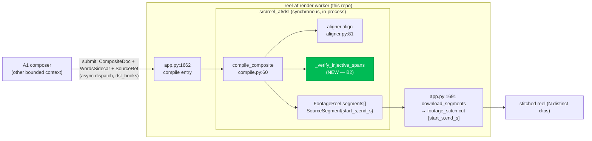
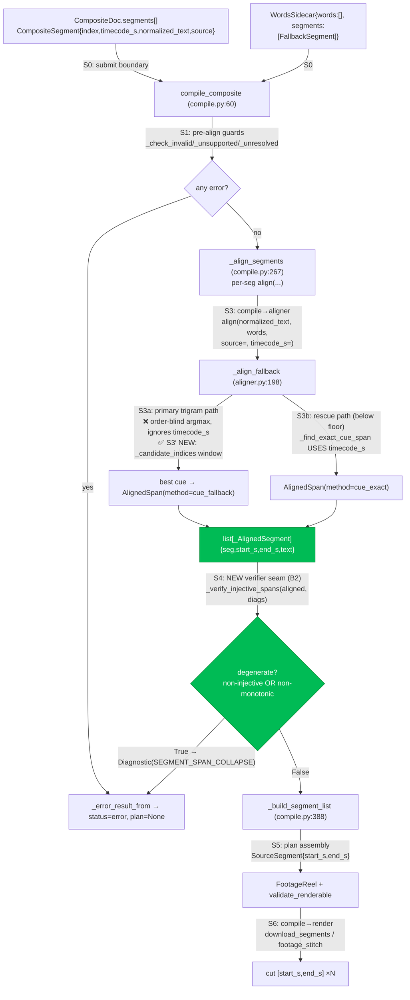

# reel-af Aligner Timecode-Anchor + Injectivity Verifier — TDD Implementation Plan

**Fixes `bd ate` (P1): "one clip repeated" — 23 distinct composite segments render as a single clip looped.**

## Overview

reel-af's DSL compile stage re-aligns each composite segment's *text* against the source
caption sidecar at compile time. When the sidecar has `words: []` (caption fast-path via
`youtube-transcript-api`), alignment falls to `_align_fallback`, whose **primary trigram
path performs a global, order-blind `argmax` that ignores the segment's known
`timecode_s`**. When several segments share a common/degenerate phrase, every one resolves
to the *same* globally-best cue → identical `[start_s, end_s]` → the renderer cuts the same
span N times → **one clip repeated**.

This is the SOTA-named **double-alignment** anti-pattern (see research doc), and it diverges
from the original DSL v2 design (`plans/2026-07-03-composite-transcript-dsl-v2-grammar.md`
§6: "resolve each segment to a source range via LCS → emit `ComposedPlan` → renderer
consumes it"). This plan is the **immediate hotfix (step ①)** from the agreed sequence — it
does **not** perform the compile/render architectural split (step ②) or the stitch hardening
(step ③); those are filed as separate beads.

The fix is two surgical, behavior-preserving changes plus a fail-closed guard:

1. **Anchor** `_align_fallback` to `timecode_s` — restrict the trigram search to cues within
   a bounded time window of the segment's timecode (Sakoe-Chiba-band / `min_window_size`
   idea). A temporally-distant identical phrase can no longer win.
2. **Verify** after alignment — a compile-stage injectivity + monotonicity check: *N distinct
   composite segments must yield N distinct, non-decreasing spans*; on violation **fail
   closed** with a typed diagnostic (never forward a degenerate plan to render).
3. **Regression** — a metamorphic test on the real defect shape (distinct timecodes +
   duplicate phrase, `words: []`) asserting N distinct increasing spans.

## Current State Analysis

### Key Discoveries

**The collapse chain (verified in source):**
- `src/reel_af/dsl/compile.py:275` — `_align_segments` re-aligns each segment:
  `align(seg.normalized_text, words, source=seg.source, timecode_s=seg.timecode_s)`. The
  compiled span comes from the aligner result, **not** from A1's (verified-correct)
  composite timecode.
- `src/reel_af/dsl/aligner.py:208-225` — `_align_fallback` primary path: `for i, seg in
  enumerate(segments)` → `_trigram_cosine(query_norm, seg_norm)` → keeps single best
  `best_idx` via strict `q > best_quality` (first-seen wins ties). **`timecode_s` is never
  referenced in this block.** Returns `AlignedSpan(..., fallback_segment_range=(best_idx,
  best_idx), method="cue_fallback")`.
- `src/reel_af/dsl/aligner.py:227-247` — rescue path only fires when the trigram scan is
  *below floor*; it calls `_find_exact_cue_span` which *does* use `timecode_s` (nearest by
  midpoint). Empty-trigram short fillers (`"uh"`) are handled here (commit `c96fc7c`).
- `src/reel_af/dsl/compile.py:285` — builds `_AlignedSegment(seg, result.start_s,
  result.end_s, seg.normalized_text)`; identical spans propagate unchanged.
- `src/reel_af/dsl/compile.py:388-394` — `_build_segment_list` emits
  `SourceSegment(start_s=a.start_s, end_s=a.end_s, ...)`; these become the fetch/cut span.
- `src/reel_af/render/footage_stitch.py:147-153` — `SegmentFetchRequest(start_s=…,
  end_s=…)`; the renderer cuts exactly `[start_s, end_s]`, so identical spans → identical
  clips. The render stage is a faithful consumer — **the defect is entirely upstream, in
  alignment.**

**No cross-segment guard exists.** Between `_align_segments` (compile.py:267) and
`FootageReel` construction (compile.py:110) / `validate_renderable` (models.py:523), the only
checks are *pairwise/local* (neighbor clamping in `_apply_extends`; adjacent-pair xfade
bounds). Nothing asserts the whole span set is injective or ordered — so "all clips
identical" is representable and renders.

**Types (all in `src/reel_af/dsl/models.py`):**
- `MATCH_QUALITY_FLOOR: float = 0.85` — `models.py:20`.
- `FallbackSegment` — `models.py:100-105`: `text: str`, `start_s: float (ge=0)`,
  `end_s: float (gt=0)`.
- `WordsSidecar` — `models.py:108-142`: `words: list[DslWord]`, `segments:
  list[FallbackSegment]`; `_validate_sidecar` enforces `segments` monotonic non-decreasing by
  `start_s` (so tests build in-order cues).
- `AlignedSpan` — `models.py:148-157`: `start_s`, `end_s`, `quality (0..1)`, `word_range`,
  `fallback_segment_range`, `method: Literal["exact","fuzzy","cue_fallback","cue_exact"]`.
- `Diagnostic` — `models.py:193-200`: `code: DiagnosticCode`, `message`, `severity:
  Literal["warning","error"]`, `source`, `context: dict`.
- `DiagnosticCode` — `models.py:175-190`: a **closed `Literal[...]` registry** (not an enum).
  A new code (`"SEGMENT_SPAN_COLLAPSE"`) MUST be added here or `Diagnostic(...)` construction
  raises.
- `CompositeSegment` — `src/reel_af/dsl/composite.py:32-40`: `index`, `timecode_s`,
  `raw_text`, `normalized_text`, `source`.

**Compile orchestration** — `compile.py:85-135`: align → (abort if None) → `_apply_extends`
→ `_build_segment_list` → `_apply_joins` → `_build_transitions` → `FootageReel` →
`validate_renderable`. Fail-closed helper: `_error_result_from(diagnostics)` (compile.py:143)
returns `CompileResult(status="error", plan=None, diagnostics=…)`.

**Existing tests / conventions:**
- pytest via uv; canonical: `uv run --extra dev python -m pytest tests/dsl -q`
  (single file: append the path; single test: `::name`). Config `pyproject.toml:53-58`,
  CI `.github/workflows/ci.yml:31`.
- Fallback-path tests: `tests/dsl/test_aligner_exact_fallback.py`,
  `tests/dsl/test_aligner_fuzzy.py`. Helper pattern:
  `WordsSidecar(words=[], segments=[FallbackSegment(text=t, start_s=s, end_s=e), …])`,
  then `align(text, sidecar, timecode_s=…)`.
- Compile tests: `tests/dsl/test_compile*.py`; build `CompositeDoc` via
  `read_composite(text, source_path=…)`, load words via `load_words(path)` or a
  `WordsSidecar`. Fixtures in `tests/dsl/fixtures/` (`v1_supported.ts.md`,
  `source.words.json`, `a1_composite.ts.md`).
- **`hypothesis>=6.156.1` is a dependency** (`pyproject.toml:75`) and already used in
  `tests/dsl/test_aligner.py` — property tests are idiomatic here.
- Lint: `ruff` (`uv run --extra dev ruff check tests/`). **No typecheck gate** (no
  mypy/pyright) — do not add typecheck success criteria.
- No checked-in fixture for run id `20260716T215417Z-wpcknuug3nm-0e8b39`; the established
  pattern is a **synthetic A1-shaped fixture** (which this plan uses).

## Desired End State

`compile_composite` maps distinct composite segments to distinct source spans even on the
`words: []` caption path, and **refuses** (status `error`, typed diagnostic) rather than
emitting a collapsed plan. Verified by:

### Observable Behaviors
- **B1**: Given a `words: []` sidecar whose duplicated phrase appears in several
  time-separated cues, and composite segments carrying that phrase at distinct `timecode_s`,
  when aligned, then each segment resolves to the cue nearest *its own* timecode (distinct
  `fallback_segment_range`), not one shared global-best cue.
- **B2**: Given aligned segments whose spans are not all distinct (or not non-decreasing),
  when compiled, then compile returns `status="error"` with a `SEGMENT_SPAN_COLLAPSE`
  diagnostic and `plan is None` — never a renderable degenerate reel.
- **B3** (metamorphic regression, the `bd ate` shape): Given N distinct timecoded composite
  lines over a duplicate-phrase `words: []` source, when compiled end-to-end, then the plan
  has N `SourceSegment`s with distinct, strictly-increasing `start_s`.

## What We're NOT Doing

- **Step ② (separate bead):** the server-side compile/render split — extracting a distinct
  compile stage that owns a validated `ComposedPlan` and a render stage that never
  re-aligns. This hotfix keeps alignment inside the render worker.
- **Step ③ (separate bead):** stitch hardening (three-phase normalize → transition-only →
  concat-demuxer `-c copy`) to replace the O(N²) pairwise fold.
- **Full monotonic one-to-one assignment** (Needleman-Wunsch/LCS/DTW over cues with a global
  cost matrix). The window anchor + fail-closed verifier remove the defect; the optimal
  assignment algorithm belongs to step ②.
- **A1-side changes** — the A1↔reel-af submit contract is unchanged; A1 keeps supplying
  correct `timecode_s` anchors. No A1 filler-cue folding here.
- **The word-path aligner** (`_align_words`) — untouched; already order-aware via
  `_find_exact_run`. Only the caption/segments fallback is changed.

## Testing Strategy

- **Framework**: pytest (+ hypothesis for properties). Run: `uv run --extra dev python -m
  pytest tests/dsl -q`.
- **Unit**: B1 (`_align_fallback`/`align` directly), B2 (`_verify_injective_spans` directly).
- **Integration-of-compile** (still synchronous, in-process): B3 via `compile_composite` over
  a synthetic A1-shaped fixture.
- **Property**: B2 no-false-positive (any strictly-increasing distinct span list → OK) and
  detect-collapse (a duplicated span → error).
- **Setup/mocking**: none — pure functions over in-memory `WordsSidecar` / `CompositeDoc`.
  Backward compat: window logic is **gated on `timecode_s is not None`**, so all existing
  fallback tests (which mostly omit `timecode_s`) stay green.

## Workflow Closure

The compile pipeline is **synchronous and in-process** (`src/reel_af/dsl/`), invoked directly
by the render path at `app.py:1662`. The fix touches only the `dsl` module; it adds **no
async edge and no new registration**.

### Production Operation Chain
`A1 dispatch (dsl_hooks) -> app.py:1662 compile_composite(doc, words, source) -> _align_segments (aligner) -> _verify_injective_spans -> _build_segment_list -> FootageReel.segments[SourceSegment{start_s,end_s}] -> app.py:1691 download_segments -> footage_stitch cut [start_s,end_s] -> stitched reel`

### Closure Test: "distinct composite segments compile to distinct source spans"   [LEAF]
- **Classification**: LEAF — SOURCE (`CompositeDoc` + `WordsSidecar`) and OBSERVABLE (the
  `CompileResult.plan.segments` spans) are in the **same module**, reached **synchronously**
  with **no registration boundary**. A unit/compile test is sufficient and authoritative for
  the span-collapse defect; there is no async or cross-process edge *within this slice*.
- **SOURCE (seed only)**: a synthetic composite `.ts.md` (distinct timecodes) + a `words: []`
  `WordsSidecar` with duplicated, time-separated cues.
- **TRIGGER (start)**: `compile_composite(...)` (`compile.py`, the outermost compile
  entrypoint) — B3 drives the whole compile, crossing the aligner + new verifier seams.
- **DRIVERS**: none required — span is fully synchronous.
- **OBSERVE (assert via)**: `res.plan.segments[i].start_s/end_s` (the production plan
  artifact the renderer consumes), not any aligner internal.
- **FORBIDDEN SPAN**: the test seeds/mocks nothing between `compile_composite` and the plan —
  it calls the real aligner + verifier + segment builder.
- **RED-AT-SEAM proof**: with Behavior 1 reverted (window removed), B3 goes red — the
  duplicate phrase collapses all spans to one, and the "distinct increasing spans" assertion
  fails. With Behavior 2 present but Behavior 1 reverted, compile instead returns
  `status="error"` (verifier fires) — also failing B3's `status=="ok"` assertion. Either way
  the seam is proven.
- **DRIVABILITY**: store seam N/A (pure in-memory inputs); no clock needed (synchronous).
- **EXECUTION**: runs in the standard `pytest tests/dsl` job with no external infra; if it
  cannot run it FAILS (never skips to green).

### System-level integration closure (out of automated scope — tracked on the bead)
The full user-visible observable ("the rendered reel shows 23 distinct clips") crosses the
**async dispatch → agent → render** boundary and is **BLOCKING at the system level**. It is
closed **manually** by SunnyMoose's Path-A live re-run of the known-good artifacts after
deploy (agent-mail thread; run id family `…-wpcknuug3nm-pathA`). This plan does not automate
that edge (it belongs to step ②'s `ComposedPlan` artifact + a harnessed E2E); the bead
records it as the acceptance gate for closing `bd ate`.

---

## Behavior 1: Anchor `_align_fallback` to the segment `timecode_s`

### Test Specification
**Given**: `WordsSidecar(words=[], segments=[...])` where the phrase `"you know what I mean"`
appears in three time-separated cues (≈413s, ≈433s, ≈453s), plus distractor cues.
**When**: `align("you know what I mean", sidecar, timecode_s=T)` is called once per segment
timecode `T ∈ {413, 433, 453}`.
**Then**: each call returns `method="cue_fallback"` with `fallback_segment_range` pointing at
the cue nearest `T` — three **distinct** ranges, not one shared cue.

**Edge Cases**:
- `timecode_s=None` → unchanged global behavior (backward compat; existing tests must pass).
- Segment whose timecode has **no cue within the window** → snap to the temporally-nearest
  cue (still returns a span; verifier remains the safety net).
- Empty-trigram short filler (`"uh"`) → still routes to the exact-cue rescue (window applies
  only to the primary trigram path; rescue unchanged).
- Window boundary: two duplicate cues, one inside and one outside the window → only the
  inside one is a candidate.

**Property (hypothesis)**: for a sidecar of K identical-text cues whose spans are pairwise
separated by more than `FALLBACK_TIMECODE_WINDOW_S` (so each cue's midpoint lies inside only
that cue's window), `align(text, sidecar, timecode_s=cue_k.midpoint)` returns
`fallback_segment_range == (k, k)` for every `k` — i.e. injective over window-separated
duplicates. (Restated to reference **span separation vs the window**, not center spacing: the
B1 fixture cues — spans 412–415 / 432–435 / 452–455 — are separated by ~17s > the 12s window,
so isolation holds at the window alone. The `_beats` proximity tie-break only decides cues that
co-occur inside a single window.)

**Files touched**: `src/reel_af/dsl/aligner.py` (edit `_align_fallback`, add
`_candidate_indices` helper + `FALLBACK_TIMECODE_WINDOW_S` constant),
`tests/dsl/test_aligner_timecode_anchor.py` (new).

### TDD Cycle

#### 🔴 Red
**File**: `tests/dsl/test_aligner_timecode_anchor.py`
```python
from reel_af.dsl.aligner import align
from reel_af.dsl.models import FallbackSegment, WordsSidecar

PHRASE = "you know what I mean"

def _dup_sidecar() -> WordsSidecar:
    # same phrase in three time-separated cues + distractors (monotonic by start_s)
    return WordsSidecar(words=[], segments=[
        FallbackSegment(text="intro clip one",  start_s=400.0, end_s=406.0),
        FallbackSegment(text=PHRASE,            start_s=412.0, end_s=415.0),  # cue 1
        FallbackSegment(text="middle filler",   start_s=428.0, end_s=431.0),
        FallbackSegment(text=PHRASE,            start_s=432.0, end_s=435.0),  # cue 3
        FallbackSegment(text="later bridge",    start_s=448.0, end_s=451.0),
        FallbackSegment(text=PHRASE,            start_s=452.0, end_s=455.0),  # cue 5
    ])

def test_duplicate_phrase_resolves_to_nearest_cue_by_timecode():
    side = _dup_sidecar()
    r1 = align(PHRASE, side, timecode_s=413.0)
    r2 = align(PHRASE, side, timecode_s=433.0)
    r3 = align(PHRASE, side, timecode_s=453.0)
    for r in (r1, r2, r3):
        assert r.kind == "aligned" and r.method == "cue_fallback"
    ranges = {r1.fallback_segment_range, r2.fallback_segment_range, r3.fallback_segment_range}
    assert ranges == {(1, 1), (3, 3), (5, 5)}          # distinct — no collapse
    assert (r1.start_s, r2.start_s, r3.start_s) == (412.0, 432.0, 452.0)

def test_timecode_none_keeps_global_argmax():
    # backward-compat: without an anchor, first best-scoring cue wins (old behavior)
    side = _dup_sidecar()
    r = align(PHRASE, side)                              # timecode_s=None
    assert r.kind == "aligned" and r.fallback_segment_range == (1, 1)
```
Run (expect FAIL — all three collapse to `(1,1)`):
`uv run --extra dev python -m pytest tests/dsl/test_aligner_timecode_anchor.py -q`

#### 🟢 Green
**File**: `src/reel_af/dsl/aligner.py`
```python
# module constant (externalized tunable — one jump to change the anchor width)
FALLBACK_TIMECODE_WINDOW_S = 12.0  # half-window around timecode_s for cue candidacy


def _candidate_indices(
    segments: list[FallbackSegment], timecode_s: float | None
) -> list[int]:
    """Cue indices eligible for trigram matching.

    With a timecode anchor, restrict to cues whose span is within
    ``FALLBACK_TIMECODE_WINDOW_S`` of ``timecode_s`` — a distant identical phrase
    can never win (Sakoe-Chiba-band idea). If nothing falls in the window, snap to
    the single temporally-nearest cue. Without an anchor, all cues are eligible
    (unchanged global behavior).
    """
    if timecode_s is None:
        return list(range(len(segments)))
    window = [
        i for i, seg in enumerate(segments)
        if seg.start_s - FALLBACK_TIMECODE_WINDOW_S <= timecode_s <= seg.end_s + FALLBACK_TIMECODE_WINDOW_S
    ]
    if window:
        return window
    if not segments:
        return []
    nearest = min(
        range(len(segments)),
        key=lambda i: abs((segments[i].start_s + segments[i].end_s) / 2 - timecode_s),
    )
    return [nearest]
```
Then rewrite the primary loop of `_align_fallback` (aligner.py:205-215) to iterate
candidates and break ties by proximity to `timecode_s`:
```python
    best_quality = 0.0
    best_idx: int | None = None
    for i in _candidate_indices(segments, timecode_s):
        seg_norm = _normalize_words(segments[i].text)
        if not seg_norm:
            continue
        q = _trigram_cosine(query_norm, seg_norm)
        if _beats(q, i, best_quality, best_idx, segments, timecode_s):
            best_quality, best_idx = q, i
```
where `_beats(...)` returns `q > best` OR (`q == best` and cue `i` is temporally nearer
`timecode_s`). The floor gate and the returned `AlignedSpan(...)` (lines 217-225) are
unchanged; the rescue path (227-247) is untouched.

Run (expect PASS).

#### 🔵 Refactor
- [x] **No duplication**: extracted `_midpoint(start_s, end_s)`; `_time_distance` and
      `_find_exact_cue_span._distance` both use it (single source of the midpoint math).
- [x] **Reveals intent**: `_candidate_indices` / `_beats_fallback` name the two decisions
      (which cues are eligible; which eligible cue wins).
- [x] **Complexity down**: loop body is one predicate call (`_beats_fallback`), no inline tie logic.
- [x] **No shallow wrappers**: helpers carry real logic (windowing, tie-break).
- [x] **Fits patterns**: mirrors `_is_better_fuzzy_span` tie-break + `_find_exact_cue_span._distance`.

### Success Criteria
**Automated:**
- [x] Red: import error / collapse — feature absent (observed).
- [x] Green: `test_aligner_timecode_anchor.py` passes (3 tests incl. hypothesis property).
- [x] No regressions: full `tests/dsl` green (252 passed).
- [x] Lint: `ruff check tests/` — all checks passed.
- [x] No new duplication: midpoint math exists once (`_midpoint`).

**Manual:**
- [ ] `FALLBACK_TIMECODE_WINDOW_S` (=12.0) is validated against **real A1 caption-cue spacing**
      and documented. It is the load-bearing tunable for injectivity: the window must be smaller
      than the minimum gap between two cues that carry the *same* phrase, else isolation degrades
      to the `_beats` proximity tie-break. Record the A1 cue spacing it was checked against.

---

## Behavior 2: Compile-stage injectivity + monotonicity verifier (fail closed)

### Test Specification
**Given**: a list of `_AlignedSegment` whose `(start_s, end_s)` spans are (a) all distinct and
non-decreasing, or (b) contain a duplicate, or (c) out of order.
**When**: `_verify_injective_spans(aligned, diagnostics)` runs.
**Then**: (a) → returns `False`, no diagnostic; (b)/(c) → returns `True` and appends a single
`Diagnostic(code="SEGMENT_SPAN_COLLAPSE", severity="error", context={"kind": …})`.
And end-to-end: a collapsing compile returns `status="error"`, `plan is None`.

**Edge Cases**: single segment (trivially OK); empty list (OK); adjacent segments with
touching-but-distinct spans (OK — injectivity is on identity, not overlap).

**Property (hypothesis)**: for any strictly-increasing sequence of distinct starts (distinct
spans), the verifier returns `False` (**no false positives**); injecting a duplicate of any
element makes it return `True`.

**Files touched**: `src/reel_af/dsl/models.py` (add `"SEGMENT_SPAN_COLLAPSE"` to
`DiagnosticCode`), `src/reel_af/dsl/compile.py` (add `_verify_injective_spans`, call it after
`_align_segments`), `tests/dsl/test_compile_injectivity.py` (new).

### TDD Cycle

#### 🔴 Red
**File**: `tests/dsl/test_compile_injectivity.py`
```python
from reel_af.dsl.compile import _AlignedSegment, _verify_injective_spans
from reel_af.dsl.models import Diagnostic

class _Seg:  # minimal stand-in for CompositeSegment (index/timecode_s/source used in msgs)
    def __init__(self, index, timecode_s):
        self.index, self.timecode_s, self.source = index, timecode_s, None

def _aligned(spans):
    return [_AlignedSegment(_Seg(i, s), s, e, "t") for i, (s, e) in enumerate(spans)]

def test_distinct_increasing_spans_pass():
    diags: list[Diagnostic] = []
    assert _verify_injective_spans(_aligned([(1.0, 2.0), (3.0, 4.0), (5.0, 6.0)]), diags) is False
    assert diags == []

def test_identical_spans_flagged_and_fail_closed():
    diags: list[Diagnostic] = []
    assert _verify_injective_spans(_aligned([(1.0, 2.0), (1.0, 2.0), (1.0, 2.0)]), diags) is True
    assert [d.code for d in diags] == ["SEGMENT_SPAN_COLLAPSE"]
    assert diags[0].severity == "error" and diags[0].context.get("kind") == "injectivity"

def test_non_monotonic_starts_flagged():
    diags: list[Diagnostic] = []
    assert _verify_injective_spans(_aligned([(5.0, 6.0), (1.0, 2.0)]), diags) is True
    assert diags[0].context.get("kind") == "monotonicity"
```
Plus an end-to-end fail-closed test in the same file using `compile_composite` over a
synthetic collapsing fixture (see Behavior 3's fixture, asserting `status=="error"` when the
window is disabled — used here to prove the guard, not the fix).

Run (expect FAIL — `_verify_injective_spans` and the code literal don't exist yet).

#### 🟢 Green
**File**: `src/reel_af/dsl/models.py` — extend the literal (models.py:175-190):
```python
DiagnosticCode = Literal[
    ...,
    "CANDIDATE_NOT_FOUND",
    "SEGMENT_SPAN_COLLAPSE",   # N segments must yield N distinct, ordered spans
]
```
**File**: `src/reel_af/dsl/compile.py` — add the verifier and call it after align:
```python
def _verify_injective_spans(
    aligned: list["_AlignedSegment"], diagnostics: list[Diagnostic]
) -> bool:
    """SOTA degenerate-plan guard: distinct composite segments must map to
    distinct, non-decreasing source spans. A duplicate span means the aligner
    collapsed several segments onto one cue (the `bd ate` defect); never render it.
    Returns True (and emits a diagnostic) when the plan is degenerate.

    Runs on RAW aligner output, BEFORE `_apply_extends`/`_apply_joins`: `_apply_joins`
    legitimately merges adjacent segments (intentional span reduction), so checking
    injectivity downstream of it would raise false positives. Do not move this call
    below `_align_segments`."""
    spans = [(a.start_s, a.end_s) for a in aligned]
    if len(set(spans)) != len(spans):
        idxs = [a.seg.index for a in aligned]
        diagnostics.append(Diagnostic(
            code="SEGMENT_SPAN_COLLAPSE",
            message=f"{len(spans)} segments collapsed to {len(set(spans))} distinct "
                    f"source spans (segments {idxs}); alignment is non-injective",
            severity="error",
            context={"kind": "injectivity"},
        ))
        return True
    for prev, cur in zip(aligned, aligned[1:]):
        if cur.start_s < prev.start_s:
            diagnostics.append(Diagnostic(
                code="SEGMENT_SPAN_COLLAPSE",
                message=f"segment {cur.seg.index} aligns before segment "
                        f"{prev.seg.index} ({cur.start_s} < {prev.start_s})",
                severity="error",
                context={"kind": "monotonicity"},
            ))
            return True
    return False
```
Wire into `compile_composite` immediately after the align abort (compile.py:87):
```python
    aligned = _align_segments(doc, words, source, diagnostics)
    if aligned is None:
        return _error_result_from(diagnostics)
    # Verify raw aligner output BEFORE _apply_extends/_apply_joins — joins legitimately
    # collapse spans, so checking after them would false-positive.
    if _verify_injective_spans(aligned, diagnostics):
        return _error_result_from(diagnostics)
```

Run (expect PASS).

#### 🔵 Refactor
- [x] **No duplication**: extracted the `_collapse(message, kind)` local so code/severity
      live once across the injectivity + monotonicity branches.
- [x] **Reveals intent**: `_verify_injective_spans` reads as the two named invariants.
- [x] **Complexity down**: two linear passes, single guard loop.
- [x] **No shallow wrappers**: real check, not a pass-through.
- [x] **Fits patterns**: matches the `_check_*`/`_error_result_from` abort shape in `compile_composite`.

### Success Criteria
**Automated:**
- [x] Red then Green: `test_compile_injectivity.py` (6 tests, incl. hypothesis + end-to-end fail-closed).
- [x] `Diagnostic(code="SEGMENT_SPAN_COLLAPSE", …)` constructs (literal extended, models.py:189).
- [x] Full suite green: `tests/dsl` 252 passed.
- [x] Lint: `ruff check tests/` — passed.

**Manual:**
- [ ] Confirm no legitimate composite intentionally repeats a source span (fail-closed is the
      safe default; documented on the bead if an exception ever appears).

---

## Behavior 3: Metamorphic regression — the `bd ate` shape compiles to distinct spans

### Test Specification
**Given**: a synthetic A1-shaped composite (`.ts.md`) of 3 lines carrying a duplicated filler
phrase at distinct timecodes (≈413s/433s/453s), and a `words: []` `WordsSidecar` whose same
phrase appears in three time-separated cues (the exact collapse trigger).
**When**: `compile_composite(doc, words, SourceRef(source_url=…))` runs.
**Then**: `res.status in ("ok", "warning")`, `res.plan is not None`, and `res.plan.segments`
has 3 `SourceSegment`s with **distinct, strictly-increasing** `start_s`. (The invariant under
test is the three distinct increasing spans — not the ok/warning distinction — so a benign
compile warning must not fail the assertion.)

**Edge Cases**: the phrase also appearing once *outside* all windows must not be chosen;
duplicate cues whose spans are separated by more than `FALLBACK_TIMECODE_WINDOW_S` guarantee
isolation (the fixture's ~17s span separation vs the 12s window).

**Property**: N distinct timecoded lines (N up to a small bound) ⇒ N distinct increasing
`start_s` in the plan (injectivity + monotonicity metamorphic relations, matching SOTA §3).

**Files touched**: `tests/dsl/fixtures/collapse_repro.ts.md` (new),
`tests/dsl/fixtures/collapse_repro.words.json` (new),
`tests/dsl/test_compile_collapse_regression.py` (new). No production files (this behavior is
covered by B1+B2's implementation; it is the guard that would have caught `bd ate`).

### TDD Cycle

#### 🔴 Red (fails on pre-B1 code — spans collapse)
**File**: `tests/dsl/fixtures/collapse_repro.ts.md`
```
00:06:53.000  you know what I mean
00:07:13.000  you know what I mean
00:07:33.000  you know what I mean
```
**File**: `tests/dsl/fixtures/collapse_repro.words.json` — a `WordsSidecar` with
`words: []` and time-separated cues (≈413/433/453s) each containing the phrase, plus
distractor cues, monotonic by `start_s`.
**File**: `tests/dsl/test_compile_collapse_regression.py`
```python
from pathlib import Path
from reel_af.dsl.compile import compile_composite, load_words
from reel_af.dsl.composite import read_composite
from reel_af.dsl.models import SourceRef, SourceSegment

FIX = Path(__file__).resolve().parent / "fixtures"

def test_bd_ate_distinct_timecodes_yield_distinct_spans():
    doc = read_composite((FIX / "collapse_repro.ts.md").read_text(),
                         source_path=FIX / "collapse_repro.ts.md")
    words = load_words(FIX / "collapse_repro.words.json")
    res = compile_composite(doc, words, SourceRef(source_url="https://example.com/s.mp4"))
    assert res.status in ("ok", "warning") and res.plan is not None
    src = [s for s in res.plan.segments if isinstance(s, SourceSegment)]
    starts = [s.start_s for s in src]
    assert len(src) == 3
    assert len(set((s.start_s, s.end_s) for s in src)) == 3      # injective
    assert starts == sorted(starts) and len(set(starts)) == 3    # strictly increasing
```
Run (expect FAIL on pre-fix code: all three `SourceSegment`s share one span).

#### 🟢 Green
No new production code — B1 (window anchor) makes the three segments resolve to their own
cues; B2 (verifier) guarantees any residual collapse fails closed instead of shipping.
Run (expect PASS).

#### 🔵 Refactor
- [x] Fixtures are minimal and distinct: `collapse_repro.*` (3 distinct phrase cues, non-collapse)
      and `collapse_forced.*` (single cue, genuine collapse for the B2 fail-closed test).
- [x] No duplication with other compile fixtures.

### Success Criteria
**Automated:**
- [x] Red-at-seam proven: with B1 reverted (old argmax, no window) the repro fixture collapses →
      verifier fires `SEGMENT_SPAN_COLLAPSE (injectivity)` → `status=error` (observed via patched run).
- [x] Green after B1+B2: `test_compile_collapse_regression.py` — 3 distinct increasing spans.
- [x] Full suite + ruff green (252 dsl passed; 1038 total, the lone failure is a pre-existing
      env-model config test unrelated to dsl).

**Manual:**
- [ ] After deploy, SunnyMoose re-runs Path A on the known-good artifacts and visually
      confirms the reel shows distinct clips (system-level closure; gates closing `bd ate`).

---

## Integration & E2E Testing

- **Integration (automated, in-process)**: Behavior 3 exercises the whole compile
  (`read_composite` → `compile_composite` → plan), asserting the artifact the renderer
  consumes.
- **E2E (manual, tracked on the bead)**: SunnyMoose dispatches Path A from A1 with the
  known-good artifacts (`…-wpcknuug3nm-pathA` family) to the deployed reel-af agent and
  inspects the rendered reel content (23 distinct clips, ~54s), not merely that a
  `download_url` returns. This crosses the async dispatch/agent boundary and is the
  acceptance gate for `bd ate`.

## Deploy & Coordination

1. Land B1→B2→B3 on `main` (Maceo previously authorized direct commit+push for this line of
   work; confirm still current).
2. reel-af **agent** service auto-deploys from `main`; verify the deployed SHA
   (`env -u SSH_AUTH_SOCK railway ssh --identity-file ~/.ssh/railway_mj --project
   5dcbd074-f4f2-4284-b355-3e332d4538a5 --environment production --service reel-af --
   printenv RAILWAY_GIT_COMMIT_SHA`).
3. Reply to SunnyMoose's msg **2774** (ack) with the deployed SHA and green-light the Path-A
   re-run; on their confirmation, close `bd ate`.

## References
- Defect + fix spec: agent-mail msg **2774** (SunnyMoose) — thread `2771`.
- SOTA research: `A1_workspace-blueprint/.../research/2026-07-17-sota-transcript-dsl-compiler-and-video-restitch.md`
  (§1-3 alignment/double-alignment; §5 the (i)/(ii) decision; §3 verifier/metamorphic tests).
- Original design: `.../plans/2026-07-03-composite-transcript-dsl-v2-grammar.md` (§6 compile
  contract; §8 open items).
- Handoff: `thoughts/searchable/shared/handoffs/general/2026-07-17_08-38-04_a1-reelaf-service-token-e2e-pipeline.md`.
- Pre-implementation review (applied): `plans/2026-07-17-09-30-tdd-reel-af-aligner-timecode-anchor-REVIEW.md`
  — verdict ✅ Ready. MINOR-1 (grammar `SourceRef`→`SourceLocus`), MINOR-2 (B3 `status in
  {ok,warning}`), MINOR-3 (property restated vs span-separation + window-tunable manual gate),
  and the verifier-placement note (before `_apply_joins`) are folded into B1/B2/B3 above.
- Code: `src/reel_af/dsl/aligner.py:198-281`, `src/reel_af/dsl/compile.py:85-135,267-286`,
  `src/reel_af/dsl/models.py:100-200`, `src/reel_af/dsl/composite.py:32-40`,
  `src/reel_af/render/footage_stitch.py:124-158`.

---

## System Map — Seams, Interfaces & Contracts

> Boundary-and-drift view of the compile slice this plan changes. Every arrow that crosses a
> module/stage line is a **seam** with a typed **interface** (the call signature that crosses
> it) and a **contract** (the invariants the two sides agree to hold). Signatures below are
> verified against source (`align` `aligner.py:81`, `_align_fallback` `aligner.py:198`,
> `compile_composite` `compile.py:60`, `_align_segments` `compile.py:267`). Two seams are new
> in this plan: **S3′ (timecode anchor, inside S3)** and **S4 (injectivity verifier)**.

### System context (where the defect lives)



### Compile pipeline — seams S0–S6 (defect + fix annotated)



### Grammar — interfaces (EBNF)

The typed calls crossing each seam. `?` = optional/keyword, `|` = alternation, `{…}` = record.

```ebnf
(* ─ S0  submit boundary: A1 → reel-af (unchanged by this plan) ─ *)
Submit          = CompositeDoc , WordsSidecar , SourceRef ;
CompositeDoc    = "{" , "segments" ":" , CompositeSegment* , "}" ;
CompositeSegment= "{" , "index" ":" Nat , "timecode_s" ":" Float ,
                        "raw_text" ":" Str , "normalized_text" ":" Str ,
                        "source" ":" SourceLocus , "}" ;   (* non-null *)
WordsSidecar    = "{" , "words" ":" DslWord* , "segments" ":" FallbackSegment* , "}" ;
FallbackSegment = "{" , "text" ":" Str , "start_s" ":" Float≥0 , "end_s" ":" Float>0 , "}" ;
SourceRef       = "{" , "source_url" ":" Url , … , "}" ;

(* ─ S3  compile → aligner (public entrypoint, aligner.py:81) ─ *)
align           = "align" "(" text:Str "," words:WordsSidecar
                  [ "," "source=" (obj|null) ] [ "," "timecode_s=" (Float|null) ] ")"
                  "->" ( AlignedSpan | UnmatchedSpan ) ;

(* ─ S3a/S3′  primary fallback path (aligner.py:198) — NEW window helper ─ *)
_align_fallback = "_align_fallback" "(" query_norm:Token* "," raw_text:Str ","
                  segments:FallbackSegment* "," source:(obj|null)
                  [ "," "timecode_s=" (Float|null) ] ")"
                  "->" ( AlignedSpan | UnmatchedSpan | null ) ;
_candidate_indices (* NEW, B1 *)
                = "_candidate_indices" "(" segments:FallbackSegment* ","
                  timecode_s:(Float|null) ")" "->" Nat* ;   (* eligible cue indices *)
FALLBACK_TIMECODE_WINDOW_S = Float ;                         (* externalized tunable, =12.0 *)

AlignedSpan     = "{" , "start_s" ":" Float , "end_s" ":" Float ,
                        "quality" ":" Float[0..1] , "word_range" ":" (Range|null) ,
                        "fallback_segment_range" ":" Range ,
                        "method" ":" ( "exact"|"fuzzy"|"cue_fallback"|"cue_exact" ) , "}" ;
UnmatchedSpan   = "{" , "normalized_text" ":" Str , "best_quality" ":" Float ,
                        "reason" ":" Str , "source" ":" (obj|null) , "}" ;
Range           = "(" Nat "," Nat ")" ;

(* ─ S4  align → verifier (NEW, B2, compile.py) ─ *)
_verify_injective_spans (* NEW *)
                = "_verify_injective_spans" "(" aligned:_AlignedSegment* ","
                  diagnostics:Diagnostic* ")" "->" Bool ;   (* True = degenerate/fail-closed *)
_AlignedSegment = "{" , "seg" ":" CompositeSegment , "start_s" ":" Float ,
                        "end_s" ":" Float , "text" ":" Str , "}" ;

(* ─ Diagnostics registry (models.py:175-190) — closed Literal, MUST extend for the new code ─ *)
Diagnostic      = "{" , "code" ":" DiagnosticCode , "message" ":" Str ,
                        "severity" ":" ("warning"|"error") , "source" ":" (SourceLocus|null) ,
                        "context" ":" Map , "}" ;
DiagnosticCode  = "EMPTY_COMPOSITE" | "UNMATCHED_SEGMENT" | "NON_RENDERABLE_REEL"
                | "CANDIDATE_NOT_FOUND" | … | "SEGMENT_SPAN_COLLAPSE" (* NEW, B2 *) ;

(* ─ S5/S6  plan → render (unchanged) ─ *)
CompileResult   = "{" , "status" ":" ("ok"|"warning"|"error") ,
                        "plan" ":" (FootageReel|null) , "diagnostics" ":" Diagnostic* , "}" ;
SourceSegment   = "{" , "start_s" ":" Float , "end_s" ":" Float , … , "}" ;
```

### Grammar — contracts (invariants crossing each seam)

| Seam | Crosses | Interface | Contract (pre → post / invariant) | Status |
|------|---------|-----------|-----------------------------------|--------|
| **S0** | A1 → reel-af (async dispatch, `dsl_hooks` → `app.py:1662`) | `Submit(doc, words, source)` | **Pre:** `doc.segments` non-empty; every `timecode_s ≥ 0` and *correct* (A1-verified); `words.segments` monotonic non-decreasing by `start_s` (`_validate_sidecar`). **Post:** reel-af owns compilation; A1 makes no further claim on spans. | Unchanged |
| **S1** | entry → pre-align guards | `_check_invalid/_unsupported/_unresolved` | **Inv:** any structural error ⇒ `status="error"`, `plan=None` (fail-closed via `_error_result_from`). | Unchanged |
| **S3** | `_align_segments` → `align` (compile→aligner, per segment) | `align(seg.normalized_text, words, source=seg.source, timecode_s=seg.timecode_s)` | **Pre:** `timecode_s` is the segment's A1 anchor. **Post (today, buggy):** returns *some* `AlignedSpan`; **`timecode_s` is dropped on the primary trigram path** → identical phrases collapse to one global-best cue. | **Defect site** |
| **S3′** | inside `_align_fallback`: candidacy filter | `_candidate_indices(segments, timecode_s)` | **NEW Post (B1):** when `timecode_s ≠ None`, only cues within `±FALLBACK_TIMECODE_WINDOW_S` are eligible; empty window ⇒ snap to single nearest; `timecode_s = None` ⇒ all cues (backward-compatible global behavior). **Inv:** a phrase > window away can never win. | **NEW (B1)** |
| **S3b** | rescue path | `_find_exact_cue_span(query_norm, segments, timecode_s)` | **Inv (existing):** sub-trigram fillers (`"uh"`) disambiguate by nearest `timecode_s`. Untouched. | Unchanged |
| **S4** | `_align_segments` result → verifier → rest of compile | `_verify_injective_spans(aligned, diagnostics)` | **NEW Inv (B2):** `len(set(spans)) == len(spans)` (**injective**) AND starts non-decreasing (**monotonic**). Violation ⇒ append `Diagnostic(code="SEGMENT_SPAN_COLLAPSE", severity="error")` and return `True` ⇒ `compile_composite` fail-closes. **No degenerate plan may cross this seam.** | **NEW (B2)** |
| **S5** | verifier-clean aligned → plan assembly | `_build_segment_list → SourceSegment` | **Inv:** each `_AlignedSegment` → one `SourceSegment{start_s,end_s}`; `FootageReel` passes `validate_renderable`. | Unchanged |
| **S6** | compile → render | `download_segments` / `footage_stitch` cut `[start_s,end_s]` | **Inv:** renderer is a **faithful consumer** — cuts exactly the plan spans; N distinct spans ⇒ N distinct clips. (Renderer holds no correctness responsibility for the defect.) | Unchanged |

### Drift note (why the seam exists)

The original **DSL v2 design** (`2026-07-03-composite-transcript-dsl-v2-grammar.md` §6) specified
"resolve each segment to a source range via LCS → emit `ComposedPlan`." The shipped code
**re-aligns text at compile time** and, on the caption fast-path (`words: []`), does so with an
**order-blind global argmax** — the **double-alignment anti-pattern**. S3′ narrows the aligner's
freedom back toward the intended per-segment locality; S4 makes the *whole-set* injectivity
invariant (implicit in "N segments → N ranges") **explicit and enforced** at the compile boundary,
where none existed (only pairwise/local checks did).

### Unspecced / flagged (could not fully spec here)

- **S0 async transport internals** — `dsl_hooks` dispatch → agent → render is a real cross-process
  boundary but out of this slice's automated scope; its closure is **manual** (SunnyMoose Path-A
  re-run). The full `Submit` wire schema (beyond the fields the compile slice reads) is not
  enumerated here.
- **`_beats` tie-break predicate (B1)** — named in the plan but its exact signature/return is a
  Refactor-step outcome; specced only as "`q > best` OR (`q == best` and cue `i` temporally
  nearer `timecode_s`)".
- **`SourceRef` full shape** — only `source_url` is consumed by this slice; remaining fields
  elided (`…`).
- **`DiagnosticCode` full member list** — only the endpoints relevant here shown; the closed
  `Literal` in `models.py:175-190` is the authority (new code MUST be added there or
  `Diagnostic(...)` raises).
- **`ComposedPlan` artifact** — the step-② target type that would make S5/S6 a persisted,
  never-re-aligned contract; deliberately **not** introduced by this hotfix.
