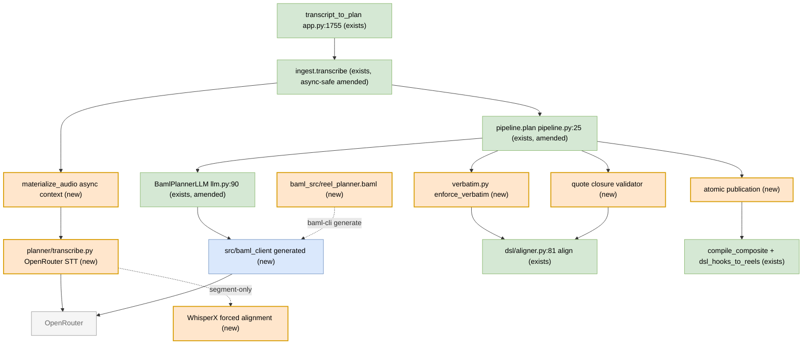

# reel-af A1 Producer - real BAML backend TDD Implementation Plan

## Overview

Build the real creative brain of the A1 producer exactly as the spec (§10-§13) designs it: a
self-contained BAML install inside `silmari-reels-af` whose runtime makes the S1-S3 LLM calls, plus
the spec §11 standalone `/audio/transcriptions` transcription client (S0, non-BAML). The deterministic
layers (serialize/lint/pipeline/aligner) already exist and are green against `FakePlannerLLM`; this
plan fills the LLM boundary and closes the verbatim, alignment, packaging, runtime-config, and
publication contracts that the review found missing.

This supersedes `2026-07-18-tdd-reel-af-planner-llm-backend.md`, which proposed replacing BAML with
`app.ai(schema=)`. Per the principal: BAML is the intended design. It is already the production
default in `pipeline.plan` (`llm = llm or BamlPlannerLLM()`), but generated client code and the real
runtime path were never landed.

## Implementation Preconditions

The implementation worktree used by this plan is
`/home/maceo/ntm_Dev/reel-af-a1-producer-impl/silmari-reels-af` at clean commit `a202a6e`. Before
coding, rerun the anchor check and fail the implementation if any cited file/line reference no longer
matches the current tree:

```bash
git -C /home/maceo/ntm_Dev/reel-af-a1-producer-impl/silmari-reels-af rev-parse --short HEAD
git -C /home/maceo/ntm_Dev/reel-af-a1-producer-impl/silmari-reels-af status --short
```

The governing spec `specs/reels-planner.a1-producer.spec.md` must be committed in the implementation
branch or durably pinned by checksum in the implementation PR before Behavior 2 starts. If the spec is
still untracked, stop and land or pin it first; otherwise later agents cannot reproduce the BAML and
retention-contract decisions.

## Review Remediation Ledger

The 2026-07-18 review found twelve critical issue groups and several warnings. This amended plan
addresses them as follows:

| Review issue | Plan fix |
|---|---|
| Stale commit anchor and unpinned spec | Front matter now pins `a202a6e`; implementation precondition requires clean anchor/spec pin. |
| Seam A request contract drift | Seam A now matches `transcript_to_plan(source_url, register, target_duration_bounds_s, out_dir, *, llm, transcribe, artifact_writer)` and requires browser-deliverable URLs. |
| Register/bounds/results/errors were prose | Behaviors 1, 11, and 16 add strict `DurationBounds`, `PlanSuccess`, `PlanFailure`, `PlannerDiagnostic`, register validation, and one `effective_bounds` owner. |
| BAML generated-model bridge would fail | Behavior 3 introduces `_bridge_payload()`/`_validate_baml()` and tests with actual generated BAML Pydantic models, not dictionaries. |
| `repair_hint` was an incomplete port change | Behaviors 6 and 10 update `PlannerLLM`, all doubles, `BamlPlannerLLM`, BAML source, generated client, and tests with keyword-only `repair_hint`. |
| Runtime model/temperature had no carrier | Behaviors 4-6 and 11 build one BAML `ClientRegistry` from `PlannerConfig` and pass it to every phase. |
| Async ASR could not fit synchronous ingest | Behaviors 14-15 define async source materialization and make ingest awaitable-safe with caption -> remote -> local order. |
| URL-to-audio materialization had no owner | Behavior 14 owns download/extract/tempdir/chunk cleanup through an async context manager. |
| Forced alignment was not implementation-ready | Behavior 14 selects WhisperX alignment in an isolated subprocess and requires audio-grounded accuracy/resource tests. |
| Quote/candidate/occurrence closure was missing | Behaviors 1, 7, 9, and 10 add `PlannerCandidate`, candidate ids, occurrence indexes, and deterministic quote-closure validators. |
| No-timecode prompt contradicted cut-in fields | Behavior 1 changes planner cut-ins to relative beat intent and derives absolute `CutInSpec` windows after alignment. |
| ASR DTO/provider/retry/config were underspecified | Behaviors 11, 13, and 14 add production ASR defaults, provider DTO normalization, per-provider capabilities, bounded retries, `Retry-After`, size/chunk policy, and `httpx`. |
| BAML client was not packaged | Behavior 2 generates `src/baml_client`, adds clean-wheel import and Docker smoke checks, and records generated diffs. |
| Consumer closure test was not real | Behavior 12 reads `CompositeDoc`, `WordsSidecar`, `SourceRef`, compiles with `compile_composite`, then calls `dsl_hooks_to_reels` with injected media dependencies. |
| Partial publication/errors were possible | Behavior 16 stages the triple in a temp run directory, validates, atomically publishes, and maps sanitized typed failures. |
| CodeCleanup hygiene gaps | Behavior 9 uses flat accepted/rejected flow; Behaviors 11, 13, and 14 keep tunables in one config owner and materialize state before fallback guards. |

## Decisions Locked

- BAML remains the runtime LLM boundary. `client<llm> PlannerLLM { provider openrouter }` calls
  `await b.MineCandidates`, `await b.StrategizeReel`, and `await b.ArrangeReel`; the plan does not
  switch to `b.parse.*` or `app.ai(schema=)`.
- The generated BAML package is emitted under `src/baml_client/`, not the repository root, so
  setuptools package discovery (`where = ["src"]`) includes it in clean wheels and Docker installs.
- Default model is `anthropic/claude-sonnet-5`, config-overridable at runtime through BAML
  `ClientRegistry`. The compile-time BAML client keeps the same default only as a fallback.
- S0 transcription is in scope: `src/reel_af/planner/transcribe.py` owns OpenRouter
  `/audio/transcriptions`, ASR fallback, provider DTO normalization, and forced alignment. BAML does
  not perform transcription.
- `HookType` becomes the spec §12 eight in both Pydantic and BAML. `XfadeEffect` remains equal to the
  DSL literal set from `src/reel_af/dsl/models.py`.
- Planner LLM outputs never provide authoritative timecodes. Candidate approximate offsets are
  optional hints only. Cut-ins are relative to their containing beat and become absolute only after
  deterministic beat alignment.
- Every shipped quote is closed deterministically: candidate quotes, hook quotes, beat quotes,
  loop-final quotes, strategy-to-blueprint template/target/CTA fields, candidate ids, and repeated
  occurrences all pass local validators before artifact publication.

## Current State Analysis

Verified on disk at `/home/maceo/ntm_Dev/reel-af-a1-producer-impl/silmari-reels-af` commit
`a202a6e`:

- `src/reel_af/app.py:1755-1800` exposes `transcript_to_plan(source_url, register="educational",
  target_duration_bounds_s=None, out_dir=None, *, llm=None, transcribe=None, artifact_writer=None)`.
  It rejects when `_is_browser_deliverable_url(source_url)` is false, then calls
  `planner.ingest.transcribe`, awaits an awaitable whole-transcriber result, and maps uncaught
  exceptions to `dsl_artifact_unavailable` with raw detail. The plan must keep public `out_dir`,
  remove non-existent public `transcript`/`template` inputs, validate `register`/bounds at the
  boundary, and sanitize failure mapping.
- `src/reel_af/planner/pipeline.py:25-82` owns the serial order `mine -> strategize -> arrange`.
  It bounds repair attempts by `cfg.max_repair_passes + 1`, writes nothing before beat resolution and
  error-level lint success, but currently calls `arrange` with identical inputs on retry and writes
  the final triple non-atomically.
- `src/reel_af/planner/llm.py:11-28` defines async `PlannerLLM`. `BamlPlannerLLM` lazily imports
  `baml_client.async_client.b`, calls the three phase functions, and then validates generated values
  directly with handwritten models. That fails for foreign Pydantic models unless the generated value
  is dumped first.
- `src/reel_af/planner/models.py:11-135` has `extra="forbid"` planner models and local validators.
  `HookType` currently has six members. `CutIn` currently has absolute `at_s`/`until_s`, which
  contradicts the no-LLM-timecode rule.
- `src/reel_af/planner/config.py:29-59` loads `src/reel_af/render/config/planner.json`. The JSON
  currently has `model="openrouter/deepseek/deepseek-v4-pro"` and `remote_asr_chain=[]`; it lacks
  `llm_temperature`, timeout/budget fields, input limits, a real ASR chain, and one default
  `{min_s,max_s}` bounds owner.
- `src/reel_af/planner/ingest.py:237-259` is synchronous, tries timed captions first, then local
  `whisper-ctranslate2` through `run_whisper`. It cannot install an async nested runner by simply
  passing an async `run_whisper`; the async boundary must wrap the whole transcriber.
- `src/reel_af/dsl/aligner.py:81-166` returns `AlignedSpan | UnmatchedSpan` with
  `MATCH_QUALITY_FLOOR=0.85` from `src/reel_af/dsl/models.py:20`. A planner `verbatim_floor` below
  0.85 cannot lower the real aligner floor and must be rejected or clamped.
- `src/reel_af/dsl/compile.py:60-67` requires `compile_composite(CompositeDoc, WordsSidecar,
  SourceRef, *, relevant_dir=None, context=None)`. Tests that pass raw text or directory-like paths do
  not prove consumer closure.

## Desired End State

`transcript_to_plan(source_url, register="educational")` with no injected `llm` validates the public
request, transcribes S0 into a non-empty per-word `WordsSidecar`, calls the real BAML runtime for
S1-S3 through OpenRouter, validates generated BAML objects through the handwritten Pydantic models,
enforces every quote and candidate occurrence against the real aligner, deterministically repairs or
fails below-floor quotes, serializes only after all invariants pass, atomically publishes
`composite.ts.md`, `hook-plan.json`, and `transcript.words.json`, then returns a typed success with
refs consumable by `reel-af.reel_dsl_hooks_to_reels`.

All external failures return typed, sanitized, retryability-aware failures. No user-facing result
contains raw secrets, provider request bodies, or unsanitized exception strings.

## Non-Goals

- Do not replace BAML with `app.ai(schema=)`.
- Do not share SWE-AF's generated BAML client or parser-only bridge.
- Do not build trending audio, sibling cut-in rendering, completion-event gating, multi-reel batching,
  or a register classifier.
- Do not rely on LLM-provided absolute timecodes for shipping artifacts.

## Testing Strategy

- Main deterministic suite: `uv run --extra dev python -m pytest tests/planner -q`.
- Generated-client checks: `uv run --extra dev python -m pytest tests/planner/test_baml_client.py tests/planner/test_type_bridge.py -q`.
- Live gates use true conditional xfail, not skip, when `OPENROUTER_API_KEY` is absent. Add a
  `--require-openrouter` pytest option that turns missing-key xfails into failures in strict CI.
- Key-gated subset: `pytest tests/planner/test_llm_real.py tests/planner/test_e2e_real.py tests/planner/test_transcribe_real.py -q`.
- Clean packaging: build a wheel from a clean checkout, install it into a temp venv, import
  `baml_client.async_client`, and run a Docker smoke command that imports both `reel_af` and
  `baml_client`.
- Real-aligner rule: verbatim, repair, and ASR-chain tests use the real `align()`; they never mock the
  aligner.

## Core Contracts

### Request, Bounds, Result, and Error Models

Add strict models in `src/reel_af/planner/contracts.py` and use them at `app.py` and `pipeline.py`:

```python
class DurationBounds(PlannerModel):
    min_s: float = Field(ge=1)
    max_s: float = Field(gt=1)

    @model_validator(mode="after")
    def _ordered(self) -> "DurationBounds":
        if not math.isfinite(self.min_s) or not math.isfinite(self.max_s):
            raise ValueError("duration bounds must be finite")
        if self.min_s >= self.max_s:
            raise ValueError("min_s must be less than max_s")
        return self

class PlannerDiagnostic(PlannerModel):
    code: str
    message: str
    severity: Literal["info", "warning", "error"] = "error"
    retryable: bool = False
    provider: str | None = None
    generation_id: str | None = None
    details: dict[str, Any] = Field(default_factory=dict)

class PlanSuccess(PlannerModel):
    composite_ref: str
    words_ref: str
    hook_ref: str

class PlanFailure(PlannerModel):
    error: Literal[
        "invalid_source_url",
        "invalid_register",
        "invalid_duration_bounds",
        "configuration_invalid",
        "asr_auth_failed",
        "asr_payment_required",
        "asr_rate_limited",
        "asr_timeout",
        "asr_chain_exhausted",
        "asr_input_too_large",
        "baml_validation_failed",
        "baml_timeout",
        "planner_empty_candidate_set",
        "planner_unmatched_segment",
        "planner_quote_integrity_failed",
        "retention_lint_failed",
        "publication_failed",
        "dsl_artifact_unavailable",
    ]
    diagnostics: list[PlannerDiagnostic] = Field(default_factory=list)
```

The app boundary validates `register` against `Register`, normalizes one `effective_bounds:
DurationBounds`, and passes the typed value to BAML and serialization. Hook-plan v1 still persists
`{"min": ..., "max": ...}`; translation from `min_s/max_s` to `min/max` happens only in
`serialize.py`.

### Candidate Identity and Quote Occurrence

`MineCandidates` returns raw quote candidates. After mining, `enforce_verbatim` converts them into
`PlannerCandidate` values that carry deterministic identity:

```python
class PlannerCandidate(PlannerModel):
    candidate_id: str                 # assigned locally, e.g. c001
    quote: str
    occurrence_index: int = Field(ge=0)
    word_range: tuple[int, int]
    start_s: float
    end_s: float
    quality: float
    source: CandidateSpan

class VerbatimRejection(PlannerModel):
    candidate: CandidateSpan
    alignment: AlignedSpan | UnmatchedSpan
    reason: str
```

`StrategizeReel` and `ArrangeReel` receive `PlannerCandidate[]`, not unanchored `CandidateSpan[]`.
`Hook`, `Beat`, and `LoopPlan` echo `candidate_id` and `occurrence_index`. A deterministic
`validate_quote_closure()` pass rejects any hook, beat, loop, or cut-in reference that:

- references a missing candidate id;
- changes the candidate occurrence unexpectedly;
- emits a quote that is not equal to or a contiguous substring of the referenced candidate;
- aligns outside the referenced candidate word range;
- changes template, target duration, engagement primary, CTA hardness, or CTA placements between
  strategy and blueprint without a typed local rule.

Duplicate transcript phrases are resolved by `occurrence_index` plus `word_range`, never by "first
exact match" alone.

### Cut-In Intent

Planner models stop asking the LLM for absolute cut-in timecodes. `Beat.cutin` carries relative intent:

```python
class CutIn(PlannerModel):
    type: CutInKind
    offset_s: float = Field(default=0.0, ge=0)
    dur_s: float = Field(gt=0)
    line: str | None = None
    image_prompt: str | None = None
    zoom_focus: str = "center"
```

`serialize.py` derives `CutInSpec.at_s`/`until_s` from the resolved containing beat:
`at_s = beat.start_s + offset_s`; `until_s = min(beat.end_s, at_s + dur_s)`. If the derived window is
empty or outside the beat, serialization returns `planner_quote_integrity_failed` before publication.

### Runtime Configuration Owner

`src/reel_af/render/config/planner.json` is the single owner for planner tunables:

```json
{
  "model": "anthropic/claude-sonnet-5",
  "llm_temperature": 0.4,
  "llm_connect_timeout_s": 10.0,
  "llm_request_timeout_s": 60.0,
  "llm_total_timeout_s": 180.0,
  "default_register": "educational",
  "bounds_default": {"min_s": 10.0, "max_s": 180.0},
  "max_repair_passes": 1,
  "verbatim_floor": 0.85,
  "max_transcript_chars": 120000,
  "max_candidates": 80,
  "max_beats": 16,
  "max_repair_hint_chars": 2000,
  "max_audio_bytes": 25000000,
  "max_audio_duration_s": 1800.0,
  "asr_chunk_duration_s": 600.0,
  "asr_connect_timeout_s": 10.0,
  "asr_request_timeout_s": 65.0,
  "asr_total_timeout_s": 240.0,
  "remote_asr_chain": [
    {
      "model": "openai/whisper-large-v3",
      "word_ts": "native",
      "response_format": "verbose_json",
      "request_word_timestamps": true
    },
    {
      "model": "google/chirp-3",
      "word_ts": "verify",
      "response_format": "json",
      "request_word_timestamps": false
    },
    {
      "model": "nvidia/parakeet-tdt-0.6b-v2",
      "word_ts": "forced",
      "response_format": "json",
      "request_word_timestamps": false
    },
    {
      "model": "openai/gpt-4o-mini-transcribe",
      "word_ts": "forced",
      "response_format": "json",
      "request_word_timestamps": false
    }
  ]
}
```

`PlannerConfig` rejects `verbatim_floor < MATCH_QUALITY_FLOOR`, non-finite bounds, empty ASR chains
unless `allow_local_only_asr=true`, and any timeout/budget value <= 0. Externally owned wire strings
(`WordsSidecar.schema_version="1"`, hook-plan v1 keys, provider endpoint paths) remain protocol
constants, not product config.

## Authored BAML Source

Behavior 2 creates this BAML source and Behavior 3 keeps it in parity with handwritten Pydantic
models. Generated values are not trusted until the bridge validates them.

```baml
// -- baml_src/generators.baml ------------------------------------------------
generator target {
  output_type "python/pydantic"
  output_dir "../src"             // emits src/baml_client/, packaged by setuptools
  version "0.222.0"               // MUST equal installed baml-py
  default_client_mode async       // BAML 0.222.0 accepts this unquoted
}

// -- baml_src/reel_planner.baml ---------------------------------------------
client<llm> PlannerLLM {
  provider openrouter
  retry_policy PlannerRetry
  options {
    model "anthropic/claude-sonnet-5"
    temperature 0.4
    api_key env.OPENROUTER_API_KEY
  }
}

retry_policy PlannerRetry {
  max_retries 2
  strategy { type exponential_backoff }
}

enum Template       { hook_context_value_payoff_cta problem_agitate_solve before_after_bridge myth_bust listicle storytime }
enum HookType       { curiosity_gap bold_claim direct_callout result_first question pain_point number pattern_interrupt }
enum BeatRole       { hook context value payoff cta }
enum InterruptKind  { trans join black }
enum EngagementKind { send save share comment follow none }
enum CutInKind      { zoom visual }
enum CtaHardness    { soft medium hard none }
enum XfadeEffect    { dissolve smoothleft smoothright smoothup smoothdown hblur circleopen radial pixelize fadeblack fadewhite fade none }

class CandidateSpan {
  quote string
  approx_start_s float?
  approx_end_s float?
  value_score float
  emotion string?
  is_claim bool?
  payoff_worthy bool?
}

class PlannerCandidate {
  candidate_id string
  quote string
  occurrence_index int
  word_range int[]
  start_s float
  end_s float
  quality float
  value_score float
  emotion string?
  is_claim bool?
  payoff_worthy bool?
}

class Hook {
  type HookType
  banner_line string
  span_quote string
  candidate_id string
  occurrence_index int
}

class Interrupt {
  kind InterruptKind
  effect XfadeEffect?
  dur_s float?
}

class CutIn {
  type CutInKind
  offset_s float
  dur_s float
  line string?
  image_prompt string?
  zoom_focus string?
}

class Engagement {
  kind EngagementKind
  line string?
  primary bool?
}

class Beat {
  role BeatRole
  span_quote string
  candidate_id string
  occurrence_index int
  max_len_s float
  cutin CutIn?
  interrupt_out Interrupt?
  engagement Engagement?
}

class LoopPlan {
  strategy string
  final_span_quote string
  candidate_id string
  occurrence_index int
}

class CtaPlan {
  hardness CtaHardness
  placements string[]?
}

class DurationBounds {
  min_s float
  max_s float
}

class ReelStrategy {
  template Template
  target_duration_s float
  hook Hook
  engagement_primary EngagementKind
  cta CtaPlan
}

class ReelBlueprint {
  template Template
  target_duration_s float
  hook Hook
  beats Beat[]
  loop LoopPlan
  engagement_primary EngagementKind
  cta CtaPlan
}

template_string RetentionRules() #"
  {{ _.role("system") }}
  You edit an EXISTING recording into one short vertical reel. You may ONLY SELECT and ORDER spans
  of the transcript. You NEVER invent footage and you NEVER provide absolute timecodes.
  Every quote (candidate.quote, hook.span_quote, beat.span_quote, loop.final_span_quote) MUST be a
  VERBATIM substring of one provided candidate and MUST preserve candidate_id plus occurrence_index.
  Cut-ins are relative beat intent only: offset_s and dur_s within the containing beat.
  Rules: R1 hook resolves <=3.5s; R2 no beat >5s without a change (3s entertainment / 8-10s B2B by
  register); R3 pace escalates toward payoff; R4 no dead air; R6 one template, hook promise matches
  payoff; R8 final span echoes the hook candidate for a loop; R9 exactly ONE specific share cue; R11
  NEVER emit engagement bait ("comment YES", "tag 5", "like if"); R12 <=1 primary CTA.
  {{ ctx.output_format }}
"#

function MineCandidates(transcript_text: string, register: string) -> CandidateSpan[] {
  client PlannerLLM
  prompt #"
    {{ RetentionRules() }}
    {{ _.role("user") }}
    Register: {{ register }}
    Mine quotable high-value spans. Quote VERBATIM. approx_start_s/approx_end_s are optional hints,
    never authoritative timecodes. Score value 0-1; flag claims and payoff-worthy spans.
    --- TRANSCRIPT ---
    {{ transcript_text }}
    ---
  "#
}

function StrategizeReel(
  transcript_text: string,
  candidates: PlannerCandidate[],
  bounds: DurationBounds
) -> ReelStrategy {
  client PlannerLLM
  prompt #"
    {{ RetentionRules() }}
    {{ _.role("user") }}
    Choose ONE template, target length within [{{ bounds.min_s }}, {{ bounds.max_s }}]s, a hook
    referencing exactly one candidate_id/occurrence_index, ONE primary engagement lever, and a CTA
    plan. Preserve candidate identity.
    Candidates: {{ candidates }}
    Transcript: {{ transcript_text }}
  "#
}

function ArrangeReel(
  candidates: PlannerCandidate[],
  strategy: ReelStrategy,
  repair_hint: string?
) -> ReelBlueprint {
  client PlannerLLM
  prompt #"
    {{ RetentionRules() }}
    {{ _.role("user") }}
    Arrange candidates into an ordered beat list per the strategy. Each beat carries role,
    candidate_id, occurrence_index, VERBATIM span_quote, max_len_s, and at most one interrupt_out.
    If repair_hint is present, repair those exact failed quotes without changing unrelated strategy.
    Strategy: {{ strategy }}
    Repair hint: {{ repair_hint }}
    Candidates: {{ candidates }}
  "#
}

test MineBasic {
  functions [MineCandidates]
  args {
    transcript_text "They don't reason. They pattern-match at a scale that feels like reasoning."
    register "educational"
  }
  @@assert(nonempty, {{ this|length > 0 }})
}
```

## Behaviors

Suggested order: B0 -> B1 -> B2 -> B8 spike -> B3-B7 -> B9-B11 -> B13-B15 -> B10 -> B12 -> B16.

### Behavior 0: anchor, spec pin, and plan preflight [BLOCKING]

Given the reviewed implementation baseline is `a202a6e`, when implementation starts, then the agent
verifies the clean worktree anchor, confirms the governing spec is committed or checksum-pinned, and
reruns line-reference discovery for every cited file.

Red:

```bash
test "$(git rev-parse --short HEAD)" = "a202a6e"
test -z "$(git status --short)"
test -f specs/reels-planner.a1-producer.spec.md
```

Green:

- Update stale anchors before touching code.
- If the spec is untracked, land it or pin its checksum in the implementation branch.

Success criteria: no implementation starts from a dirty or unknown baseline.

### Behavior 1: planner models, enum parity, cut-in intent, and quote identity [BLOCKING]

Given `planner/models.py` currently lacks quote identity and has absolute cut-in time fields, when the
models are revised, then:

- `HookType` is exactly the spec eight.
- `XfadeEffect` parity is equal to the DSL literal set, not a subset.
- `CandidateSpan` keeps optional approximate offsets as non-authoritative hints.
- `PlannerCandidate`, `VerbatimRejection`, `DurationBounds`, `PlanSuccess`, `PlanFailure`, and
  `PlannerDiagnostic` exist.
- `Hook`, `Beat`, and `LoopPlan` include `candidate_id` and `occurrence_index`.
- `CutIn` uses relative `offset_s`/`dur_s`; `serialize.py` derives absolute `CutInSpec` windows after
  resolving the containing beat.

Red tests in `tests/planner/test_models.py` and `tests/planner/test_contracts.py`:

```python
def test_hooktype_has_spec_eight():
    assert set(HookType.__args__) == {
        "curiosity_gap", "bold_claim", "direct_callout", "result_first",
        "question", "pain_point", "number", "pattern_interrupt",
    }

def test_xfade_parity_equals_dsl_literal():
    from typing import get_args
    from reel_af.dsl.models import XfadeEffect as DslXfade
    from reel_af.planner.models import PlannerXfadeEffect
    assert set(get_args(PlannerXfadeEffect)) == set(get_args(DslXfade))

def test_duration_bounds_reject_invalid_values():
    with pytest.raises(ValidationError):
        DurationBounds(min_s=30, max_s=10)
    with pytest.raises(ValidationError):
        DurationBounds(min_s=float("nan"), max_s=30)

def test_cut_in_is_relative_not_absolute():
    cut = CutIn(type="zoom", offset_s=0.5, dur_s=1.0)
    assert not hasattr(cut, "at_s")
    assert not hasattr(cut, "until_s")
```

Green:

- Update Pydantic models and model validators.
- Keep persisted `WordsSidecar.schema_version="1"` and hook-plan v1 keys stable.
- Add a migration note proving no persisted raw `ReelBlueprint` caller relies on removed
  `CutIn.at_s`/`until_s` or old `HookType` values.

Success criteria: `pytest tests/planner/test_models.py tests/planner/test_contracts.py -q` green.

### Behavior 2: self-contained BAML install, generation, packaging, and drift checks [BLOCKING]

Given `baml_client` does not import today and root-level generation would not be packaged, when BAML
is added, then generated code lives under `src/baml_client/`, is committed, imports from a clean wheel,
and stays in sync with `baml_src`.

Files touched: `pyproject.toml`, `uv.lock`, `baml_src/*.baml`, `src/baml_client/**`, `tests/planner/test_baml_client.py`,
`Makefile`, and Docker/package smoke checks.

Red tests:

```python
def test_baml_client_exposes_planner_functions():
    from baml_client.async_client import b
    for fn in ("MineCandidates", "StrategizeReel", "ArrangeReel"):
        assert hasattr(b, fn)

def test_clean_wheel_imports_generated_client(tmp_path):
    # Build wheel, install into a temp venv, then run:
    # python -c "from baml_client.async_client import b; assert b.MineCandidates"
    ...

def test_baml_generate_has_no_diff():
    # Copy repo to tmp, run `.venv/bin/baml-cli generate`, assert git diff --exit-code.
    ...
```

Green:

- Add `baml-py==0.222.0`, `httpx`, and packaging/build test dependencies as needed; update
  `uv.lock`.
- Generate from repo root with `output_dir "../src"`.
- Confirm `git check-ignore src/baml_client` exits non-zero.
- Add `make baml` and a Docker smoke command importing `reel_af` and `baml_client`.

Success criteria: clean-wheel import, Docker import, generated-diff, and BAML function exposure tests
all pass.

### Behavior 3: generated BAML models bridge through dumped payloads [BLOCKING]

Given generated BAML values are Pydantic models from a different class hierarchy, when
`BamlPlannerLLM` receives generated objects, then handwritten models validate `model_dump()` payloads,
not the foreign model instances.

Red tests in `tests/planner/test_type_bridge.py`:

```python
from baml_client.types import CandidateSpan as BCandidate
from reel_af.planner.llm import _bridge_payload, _validate_baml
from reel_af.planner.models import CandidateSpan

def test_bridge_dumps_generated_baml_model_before_validation():
    generated = BCandidate(quote="hello world", value_score=0.9)
    got = _validate_baml(CandidateSpan, generated)
    assert got.quote == "hello world"

def test_bridge_excludes_none_so_pydantic_defaults_apply():
    generated = BCandidate(quote="hello world", value_score=0.9, emotion=None)
    payload = _bridge_payload(generated)
    assert "emotion" not in payload
```

Green:

- Add `_bridge_payload(value) -> dict` that uses `model_dump(mode="json", exclude_none=True)` for
  generated Pydantic values and passes dicts through only for tests that explicitly model the wire
  shape.
- Add `_validate_baml(Model, value)` and use it in `mine`, `strategize`, and `arrange`.
- Field-level parity tests cover required/default/null semantics for candidate flags, interrupt
  duration/effect, `zoom_focus`, engagement `primary`, and CTA placements.
- Generated adapter tests must instantiate actual `baml_client.types` classes or a distinct Pydantic
  model, never plain dictionaries as the only production proof.

Success criteria: `pytest tests/planner/test_type_bridge.py -q` green.

### Behavior 4: `BamlPlannerLLM.mine` uses lazy BAML import and runtime `ClientRegistry` [LEAF]

Given the adapter is constructed with `PlannerConfig`, when `mine` runs, then it awaits
`b.MineCandidates(transcript, register, baml_options={"client_registry": registry})`, validates
generated objects through `_validate_baml`, and enforces transcript and candidate count limits.

Red test:

```python
async def test_mine_passes_client_registry_and_validates_generated(monkeypatch, cfg):
    rec = RecordingBaml()
    patch_baml(monkeypatch, rec)
    out = await BamlPlannerLLM(cfg=cfg).mine("verbatim words", "educational")
    assert rec.calls[0].name == "MineCandidates"
    assert rec.calls[0].baml_options["client_registry"].primary == "planner_runtime"
    assert out[0].quote == "verbatim words"
```

Green:

- Build one private `_client_registry(cfg)` using BAML `ClientRegistry.add_llm_client(name="planner_runtime",
  provider="openrouter", options={model, api_key, temperature, timeouts/tracing metadata})`, then
  `set_primary("planner_runtime")`.
- Do not store API keys in diagnostics or logs.
- Keep the import patchable by importing the module once in a helper instead of duplicating imports in
  every method.

Success criteria: no-network mine test asserts registry, model, temperature, API key source, timeout
fields, and generated-object validation.

### Behavior 5: `strategize` receives anchored candidates and effective bounds [LEAF]

Given candidate identity is assigned after mining, when `strategize` runs, then it receives
`PlannerCandidate[]` with ids, occurrence indexes, word ranges, and one validated `DurationBounds`.
An empty bounds dict never reaches BAML.

Red test:

```python
async def test_strategize_sends_anchored_candidates_and_effective_bounds(monkeypatch, planner_candidate, cfg):
    rec = RecordingBaml()
    patch_baml(monkeypatch, rec)
    out = await BamlPlannerLLM(cfg=cfg).strategize("t", [planner_candidate], DurationBounds(min_s=15, max_s=30))
    assert rec.calls[0].args[1][0]["candidate_id"] == planner_candidate.candidate_id
    assert rec.calls[0].args[2] == {"min_s": 15.0, "max_s": 30.0}
    assert 15.0 <= out.target_duration_s <= 30.0
```

Green:

- Change the protocol signature to accept `DurationBounds`, not `Mapping[str, float] | None`.
- Compute `effective_bounds` at the app/pipeline boundary and use it for BAML and hook-plan
  serialization.
- Validate strategy target duration within bounds locally after BAML returns.

Success criteria: `pytest tests/planner/test_llm.py -k strategize -q` green and no `{}` bounds path.

### Behavior 6: `arrange` carries keyword-only `repair_hint` across every owner [BLOCKING]

Given repair must be deterministic, when `arrange` is called on retry, then the exact failed quote,
reason, candidate id, occurrence, and nearby words arrive as a keyword-only `repair_hint`.

Red tests:

```python
async def test_arrange_signature_requires_keyword_repair_hint(monkeypatch, planner_candidate, strategy):
    rec = RecordingBaml()
    patch_baml(monkeypatch, rec)
    await BamlPlannerLLM().arrange([planner_candidate], strategy, repair_hint="fix candidate c001")
    assert rec.calls[0].args[2] == "fix candidate c001"

async def test_fake_llm_records_repair_hint(fake_llm):
    await fake_llm.arrange([], strategy, repair_hint="failed quote")
    assert fake_llm.calls[-1] == ("arrange", "failed quote")
```

Green:

- Update `PlannerLLM`, `FakePlannerLLM`, `NeverPlannerLLM`, local test doubles, `BamlPlannerLLM`,
  BAML `ArrangeReel`, and generated client.
- Test signatures exactly; avoid `arrange(self, *_)` because it hides drift.
- Reject `strategy is None` before calling BAML with a typed configuration/programming error.

Success criteria: `pytest tests/planner/test_llm.py -k arrange -q` green and mypy/ruff do not find
stale call sites.

### Behavior 7: prompts encode retention, quote closure, and no-authoritative-timecodes [LEAF]

Given prompt text is load-bearing but not trusted, when BAML prompts are authored, then static tests
prove they contain the retention frame, candidate identity rule, no absolute timecode rule, R11 bait
ban, and repair-hint instruction. Deterministic validators remain the source of truth.

Red tests:

```python
def test_retention_frame_contains_load_bearing_rules():
    src = Path("baml_src/reel_planner.baml").read_text()
    for clause in ("VERBATIM", "candidate_id", "occurrence_index", "NEVER provide absolute timecodes",
                   "Cut-ins are relative", "NEVER emit engagement bait", "{{ ctx.output_format }}"):
        assert clause in src
```

Green:

- Add `RetentionRules()`, `MineBasic`, and static prompt tests.
- Add `StrategizeBasic` and `ArrangeBasic` BAML tests once generated types compile.

Success criteria: prompt tests and `baml-cli test` for basic blocks pass.

### Behavior 8: early live BAML/OpenRouter spike [BLOCKING, key-gated]

Given BAML runtime invocation is the main unknown, when `OPENROUTER_API_KEY` is present, then real
`MineCandidates` reaches OpenRouter, returns generated typed values, and at least one quote aligns
against the fixture words. When the key is absent, the test is a true xfail unless
`--require-openrouter` is set.

Red test:

```python
pytestmark = requires_openrouter("real BAML mine")

async def test_real_mine_returns_verbatim_alignable_spans():
    text, words = load_fixture("wPcKNuUG3NM")
    cands = await BamlPlannerLLM().mine(text, "educational")
    assert cands
    assert any(getattr(align(c.quote, words), "quality", 0.0) >= MATCH_QUALITY_FLOOR for c in cands)
```

Green:

- Add `tests/planner/conftest.py::requires_openrouter(reason)` implementing conditional xfail and
  strict `--require-openrouter`.
- Record live model/provider facts and resolved `X-Generation-Id` in a sanitized fixture/runbook.
- If BAML's OpenRouter provider requires an option/header quirk, isolate it in `_client_registry()`.

Success criteria: live mine passes with key; missing key is xfail by default and failure under strict
mode.

### Behavior 9: post-mine verbatim validator returns typed kept/rejected sets [BLOCKING]

Given mined candidates may paraphrase, when `enforce_verbatim(candidates, words, floor=cfg.verbatim_floor)`
runs, then it returns anchored `PlannerCandidate[]` and typed `VerbatimRejection[]`. If no candidates
remain, `plan()` returns `planner_empty_candidate_set` and never calls `strategize`.

Red test:

```python
def test_verbatim_kept_paraphrase_rejected_with_alignment_result():
    kept, dropped = enforce_verbatim([cand("they don't reason"), cand("they do not think")], WORDS, floor=0.85)
    assert [c.quote for c in kept] == ["they don't reason"]
    assert dropped[0].candidate.quote == "they do not think"
    assert dropped[0].alignment.reason == "below_floor"

async def test_empty_candidate_set_fails_typed_before_strategize(tmp_path):
    res = await plan("https://x", words=WORDS, out_dir=tmp_path, llm=OnlyParaphrases())
    assert res["error"] == "planner_empty_candidate_set"
```

Green implementation must stay flat:

```python
for candidate in candidates:
    result = align(candidate.quote, words)
    accepted = isinstance(result, AlignedSpan) and result.quality >= floor
    if not accepted:
        dropped.append(VerbatimRejection(candidate=candidate, alignment=result, reason=_reason(result)))
        continue
    kept.append(_anchored_candidate(candidate, result, occurrence_index=_occurrence(candidate, result)))
```

Green:

- Reject `floor < MATCH_QUALITY_FLOOR` in config; higher floors are allowed.
- The dropped list is homogeneous `VerbatimRejection[]`, even when alignment returned an `AlignedSpan`
  below a higher configured floor.
- Update existing successful doubles to return at least one alignable candidate.

Success criteria: `pytest tests/planner/test_verbatim.py tests/planner/test_pipeline.py -q` green;
aligner never mocked.

### Behavior 10: quote closure and feedback-dependent augmented repair [BLOCKING]

Given a blueprint can carry invented hook/beat/loop text even if candidates were valid, when
`plan()` receives a blueprint, then `validate_quote_closure()` checks hook, every beat, loop final
quote, candidate identity, strategy-to-blueprint invariants, and derived cut-in windows before
serialization. Failed closure produces a repair hint; attempt two succeeds only if the stub receives
the expected diagnostic.

Red tests:

```python
async def test_repair_succeeds_only_when_hint_contains_failed_quote_and_nearby_words(tmp_path):
    llm = FeedbackSensitiveLLM()
    res = await plan("https://x", words=WORDS, out_dir=tmp_path, llm=llm, cfg=cfg(max_repair_passes=1))
    assert "error" not in res
    assert llm.repair_hints == ["candidate c001 below_floor: 'paraphrase' near 'verbatim words'"]

async def test_invented_hook_fails_or_repairs_before_publication(tmp_path):
    llm = InventedHookLLM()
    res = await plan("https://x", words=WORDS, out_dir=tmp_path, llm=llm, cfg=cfg(max_repair_passes=0))
    assert res["error"] == "planner_quote_integrity_failed"
    assert not (tmp_path / "composite.ts.md").exists()
```

Green:

- Build `PlannerDiagnostic` values from failed alignments and closure violations.
- Pass `repair_hint` to `arrange(..., repair_hint=hint)` on retries.
- Bound attempts by `cfg.max_repair_passes + 1`.
- Preserve first-success behavior and error precedence with tests before refactoring.

Success criteria: repair tests prove the second call depends on the expected hint, and no artifacts
are written on never-good failures.

### Behavior 11: config, ClientRegistry inputs, bounds, budgets, and ASR defaults [BLOCKING]

Given tunables currently have multiple owners or no owner, when config changes land, then
`src/reel_af/render/config/planner.json` and `PlannerConfig` own runtime model, temperature, bounds,
thresholds, retries, timeout budgets, input limits, and ASR chain defaults.

Red tests:

```python
def test_config_contains_runtime_llm_and_bounds():
    cfg = load_planner_config()
    assert cfg.model == "anthropic/claude-sonnet-5"
    assert cfg.bounds_default.min_s < cfg.bounds_default.max_s
    assert cfg.verbatim_floor >= MATCH_QUALITY_FLOOR

def test_config_populates_remote_asr_chain():
    cfg = load_planner_config()
    assert [e.word_ts for e in cfg.remote_asr_chain] == ["native", "verify", "forced", "forced"]
```

Green:

- Add typed `AsrEntry` capability fields: `response_format`, `request_word_timestamps`,
  retry policy, and provider capability notes.
- Add input bounds for transcript chars, candidates, beats, repair hint, audio bytes, audio duration,
  chunk duration, and all timeouts.
- `BamlPlannerLLM` takes `cfg` and uses `_client_registry(cfg)` for all phases.
- `pipeline.plan` computes `effective_bounds = request_bounds or cfg.bounds_default` once.

Success criteria: config tests pass and `rg "0.85|deepseek|claude-sonnet" src/reel_af/planner` finds
only config/default declarations or tests.

### Behavior 12: real end-to-end compiler and consumer closure [BLOCKING, key-gated]

Given the prior closure test did not call the real consumer, when the live LLM path produces a triple,
then the test reads the generated files, parses `CompositeDoc`, loads `WordsSidecar`, constructs
`SourceRef`, calls `compile_composite`, and then calls `dsl_hooks_to_reels` with injected media
dependencies.

Red test:

```python
pytestmark = requires_openrouter("real transcript to plan")

async def test_real_transcript_to_plan_compiles_and_consumes(tmp_path, fake_transcribe, dsl_consumer_di):
    res = await transcript_to_plan(
        "https://youtu.be/wPcKNuUG3NM",
        register="educational",
        out_dir=str(tmp_path),
        transcribe=fake_transcribe,
    )
    assert "error" not in res

    doc = read_composite(Path(res["composite_ref"]))
    words = load_words(Path(res["words_ref"]))
    source = SourceRef(url="https://youtu.be/wPcKNuUG3NM")
    compiled = compile_composite(doc, words, source, context=CompileContext(workflow="dsl_hooks"))
    assert compiled.status == "ok"

    rendered = await dsl_hooks_to_reels(
        composite_ref=res["composite_ref"],
        words_ref=res["words_ref"],
        hook_ref=res["hook_ref"],
        **dsl_consumer_di,
    )
    assert "error" not in rendered
```

Green:

- Reuse the injected media/dependency pattern from `tests/planner/test_pipeline.py:120-166`.
- Assert all emitted quotes align with `quality >= cfg.verbatim_floor`.
- Strict `--require-openrouter` mode fails if the key is unavailable.

Success criteria: with key set, the full path compiles and consumer invocation returns no
`dsl_compile_failed`, `dsl_cutin_invalid`, or `dsl_render_failed`.

### Behavior 13: S0 OpenRouter transcription client with provider DTOs [BLOCKING]

Given OpenRouter transcription responses use provider wire DTOs, when `transcribe_audio()` receives a
response, then it normalizes top-level `text`, `words[].word -> DslWord.w`, word timings, and segment
fallbacks before constructing `WordsSidecar`.

Files touched: `src/reel_af/planner/transcribe.py`, `pyproject.toml`, `uv.lock`,
`tests/planner/test_transcribe.py`.

Red tests:

```python
async def test_posts_multipart_and_normalizes_provider_words(tmp_audio):
    def handler(request: httpx.Request) -> httpx.Response:
        assert request.url.path == "/api/v1/audio/transcriptions"
        assert request.headers["Authorization"].startswith("Bearer ")
        body = request.content
        assert b'response_format' in body
        assert b'timestamp_granularities[]' in body
        return httpx.Response(200, json={
            "text": "hello world",
            "words": [{"word": "hello", "start": 0.0, "end": 0.4},
                      {"word": "world", "start": 0.4, "end": 0.9}],
        })

    sc = await transcribe_audio(tmp_audio, entry=native_entry(), transport=httpx.MockTransport(handler))
    assert [w.w for w in sc.words] == ["hello", "world"]
```

Green:

- Use `httpx.AsyncClient` and `httpx.MockTransport` in tests.
- Do not request `verbose_json` or word timestamps for entries whose capability says unsupported.
- Retry transient network, 408, 429, and 5xx failures only; do not blindly retry 400/401/402/404.
- Honor `Retry-After`; capture sanitized `X-Generation-Id`; redact Authorization and file payloads.
- Require non-empty word timings for native success.

Success criteria: no-network transcription tests cover endpoint, Bearer auth, multipart fields,
status-aware retry, DTO normalization, redaction, and terminal failure mapping.

### Behavior 14: ASR chain, async source materialization, chunking, and forced alignment [BLOCKING]

Given ingest receives URLs but OpenRouter receives local audio files, when remote ASR is attempted,
then `materialize_audio(source_url)` downloads/extracts audio into a temp context, enforces byte and
duration limits, chunks long audio, rebases timestamps, merges chunks, and cleans up on success,
failure, or cancellation.

Forced alignment selection:

- Use WhisperX alignment as the first forced-align engine.
- Run it behind a small process boundary (`asyncio.create_subprocess_exec`) so cancellation and
  resource limits are explicit.
- Cache downloaded alignment models under a configurable cache dir; record model/version in
  diagnostics.
- Timeout each forced-align attempt with `cfg.asr_request_timeout_s`.
- If WhisperX is unavailable in local/dev environments, forced entries fail with a typed
  `asr_forced_alignment_unavailable` diagnostic and the chain advances or exhausts.

Red tests:

```python
async def test_materialize_audio_cleans_up_on_cancellation(tmp_path):
    async with materialize_audio("https://youtu.be/x", tmp_root=tmp_path) as audio:
        assert audio.path.exists()
        raise asyncio.CancelledError()
    assert not any(tmp_path.iterdir())

async def test_chain_order_caption_remote_local(monkeypatch):
    order = []
    transcriber = build_transcriber(caption=lambda _: order.append("caption") or None,
                                    remote=lambda _: order.append("remote") or _raise_transient(),
                                    local=lambda _: order.append("local") or WORDS)
    await transcriber("https://youtu.be/x")
    assert order == ["caption", "remote", "local"]

async def test_forced_alignment_uses_real_audio_fixture(tiny_audio, transcript_text):
    sc = await force_align_words(tiny_audio, transcript_text, engine="whisperx")
    assert align("hello world", sc).quality >= MATCH_QUALITY_FLOOR
```

Green:

- `transcribe_chain()` short-circuits first success and preserves error precedence.
- Native and verify entries probe actual word timings; verify retries once without unsupported
  options before falling back to forced alignment.
- Long audio splits on duration boundaries, rebases word timestamps by chunk offset, and preserves
  sentence context in the ASR request.
- Guard order is explicit: materialize state, check limits, call provider, normalize, validate,
  decide fallback.

Success criteria: `pytest tests/planner/test_transcribe_chain.py -q` green; a live or fixture-backed
forced-align test proves real audio boundaries, not uniformly invented timestamps.

### Behavior 15: wire transcription into ingest with async-safe caption -> remote -> local order [BLOCKING]

Given `ingest.transcribe()` is synchronous today, when the remote transcriber becomes production
default, then the whole public transcriber can be awaitable and the nested local `run_whisper` seam
remains synchronous only for local fallback.

Red tests:

```python
async def test_default_ingest_transcriber_can_be_awaited(monkeypatch):
    monkeypatch.setattr("reel_af.planner.ingest._default_remote_transcriber", async_remote_words)
    words = await maybe_await(ingest.transcribe("https://youtu.be/x", run_whisper=None))
    assert words.words

def test_sync_local_fallback_still_supported(monkeypatch):
    words = ingest.transcribe("local.mp4", run_whisper=lambda _: local_whisper_payload())
    assert words.words
```

Green:

- Keep caption extraction first.
- On no captions: remote chain handles URL materialization and provider calls.
- On retryable remote exhaustion or local-only config: local Whisper fallback is allowed.
- Auth/payment/permanent provider failures do not silently fall back unless config explicitly allows
  local fallback for that class.

Success criteria: unit tests prove caption short-circuit, remote success, retryable remote-to-local
fallback, terminal remote failure, and local fallback.

### Behavior 16: typed failure mapping and atomic triple publication [BLOCKING]

Given `_write_triple` writes three final paths sequentially today, when publication occurs, then the
triple is staged, validated, and atomically moved into an immutable run directory only after every
artifact exists and every invariant passes.

Red tests:

```python
async def test_partial_write_failure_leaves_no_final_triple(tmp_path, monkeypatch):
    monkeypatch.setattr(Path, "write_text", fail_on_second_write)
    res = await plan("https://x", words=WORDS, out_dir=tmp_path, llm=GoodLLM())
    assert res["error"] == "publication_failed"
    assert not (tmp_path / "composite.ts.md").exists()
    assert not (tmp_path / "hook-plan.json").exists()
    assert not (tmp_path / "transcript.words.json").exists()

async def test_reasoner_maps_exceptions_to_sanitized_failures():
    res = await transcript_to_plan("https://example.com/video.mp4", transcribe=raises_secret_error)
    assert res["error"] == "dsl_artifact_unavailable"
    assert "OPENROUTER_API_KEY" not in json.dumps(res)
```

Green:

- Write to `out_dir/.staging/<run_id>/`, fsync or close all files, validate JSON and composite parse,
  then `replace()`/rename into `out_dir/<run_id>/` or the existing requested final filenames
  atomically as a set.
- Return `PlanSuccess` only after all refs exist.
- Map ASR auth/payment/rate-limit/timeout, BAML validation, cancellation, empty candidates,
  chain exhaustion, forced-align failure, lint failure, publication failure, and consumer-facing
  artifact errors to sanitized `PlanFailure`.
- Preserve cancellation propagation; do not swallow `asyncio.CancelledError` as a normal failure.

Success criteria: publication tests, error-mapping tests, and existing pipeline tests pass.

## Integration and Quality Gates

Run these before marking the implementation complete:

```bash
uv run --extra dev python -m pytest tests/planner -q
uv run --extra dev python -m pytest tests/planner/test_baml_client.py tests/planner/test_type_bridge.py -q
uv run --extra dev python -m pytest tests/planner/test_llm_real.py tests/planner/test_e2e_real.py tests/planner/test_transcribe_real.py -q --require-openrouter
uv run --extra dev ruff check src/reel_af/planner tests/planner
uv build --wheel
```

If code changed but live keys are unavailable locally, run the deterministic gates and report the
key-gated tests as xfailed locally; CI or the implementing maintainer must run the strict
`--require-openrouter` job before merge.

## System Map and Seam Contracts

### Component Diagram



### Seam A - app reasoner request

```ebnf
Register    = "entertainment" | "educational" | "b2b" ;
Bounds      = "{" "min_s" ":" finite_float "," "max_s" ":" finite_float "}" ;
PlanRequest = source_url , register , [ Bounds ] , [ out_dir ] ;
PlanResult  = PlanSuccess | PlanFailure ;
```

- Pre: `source_url` must be browser-deliverable (`_is_browser_deliverable_url(source_url)` true);
  `register` and bounds validate before transcription.
- Post: success has exactly one reel triple; failure is typed and sanitized.
- Invariant: `llm=None` means real `BamlPlannerLLM` with config-sourced registry.

### Seam B - S0 OpenRouter transcription

```ebnf
AsrEntry    = model , word_ts , response_format , request_word_timestamps , retry_policy ;
ProviderDTO = text , [ words(word,start,end) ] , [ segments(text,start,end) ] ;
Transcript  = WordsSidecar(schema_version="1", words=DslWord[]) ;
```

- Pre: audio exists locally, size/duration within config limits, provider capability supports the
  requested multipart fields.
- Post: native success has non-empty word timings; segment-only output is forced-aligned or rejected.
- Invariant: `DslWord.w` is normalized from provider `word`; wire DTOs never leak into domain models.

### Seam C - BAML functions

```ebnf
MineCandidates(transcript_text, register) -> CandidateSpan[]
StrategizeReel(transcript_text, PlannerCandidate[], DurationBounds) -> ReelStrategy
ArrangeReel(PlannerCandidate[], ReelStrategy, repair_hint?) -> ReelBlueprint
```

- Pre: `ClientRegistry` primary client is built from `PlannerConfig`.
- Post: generated values are dumped and handwritten Pydantic models validate them.
- Invariant: BAML source may guide quote identity, but local validators enforce it.

### Seam D - verbatim and quote closure

```ebnf
CandidateSpan -> enforce_verbatim -> PlannerCandidate | VerbatimRejection
ReelBlueprint -> validate_quote_closure -> ok | PlannerDiagnostic[]
```

- Pre: `WordsSidecar.words` non-empty.
- Post: every accepted quote has `quality >= cfg.verbatim_floor` and a stable occurrence.
- Invariant: tests use the real aligner; duplicate phrases use occurrence plus word range.

### Seam E - repair loop

```ebnf
RepairPass = arrange(candidates, strategy, repair_hint?)
Termination = success | attempts >= cfg.max_repair_passes + 1
```

- Pre: repair hint is built from deterministic diagnostics.
- Post: never-good returns typed failure and publishes no files.
- Invariant: counter mutation, diagnostics, logging, and fallback decisions stay outside control
  expressions.

### Seam F - publication and consumer closure

```ebnf
A1Triple = composite.ts.md , hook-plan.json , transcript.words.json
Consumer = compile_composite(CompositeDoc, WordsSidecar, SourceRef) -> dsl_hooks_to_reels
```

- Pre: composite parses, hook-plan JSON parses, words validate, quote closure passed.
- Post: `PlanSuccess` refs all exist; consumer closure has no compile/render/cut-in error.
- Invariant: final paths are not visible until the complete triple is staged and validated.

## Traceability

| Seam | Behaviors |
|---|---|
| Anchor/spec | 0 |
| App request/result/errors | 1, 11, 16 |
| BAML source/client/package | 2, 3, 4, 5, 6, 7, 8 |
| Candidate/quote identity | 1, 7, 9, 10 |
| Runtime config/bounds | 4, 5, 11 |
| S0 HTTP/materialization/fallback | 11, 13, 14, 15 |
| Repair loop | 6, 10 |
| Publication/consumer closure | 12, 16 |

## References

- Spec: `specs/reels-planner.a1-producer.spec.md` §6, §10, §11, §12, §13.
- Plan review applied: `thoughts/searchable/shared/plans/2026-07-18-17-21-tdd-reel-af-planner-baml-backend-REVIEW.md`.
- Current anchors at `a202a6e`: `src/reel_af/app.py:1755`, `src/reel_af/planner/pipeline.py:25`,
  `src/reel_af/planner/llm.py:11,90`, `src/reel_af/planner/models.py:11-135`,
  `src/reel_af/planner/config.py:29-59`, `src/reel_af/planner/ingest.py:237`,
  `src/reel_af/planner/serialize.py:130`, `src/reel_af/dsl/aligner.py:81`,
  `src/reel_af/dsl/models.py:20,91-171`, `src/reel_af/dsl/compile.py:60`.
- BAML reference: local `SWE-AF/baml_src/*`, `baml-py 0.222.0`, generated client committed in source.
- OpenRouter facts checked by the review on 2026-07-18: dedicated transcription endpoint,
  multipart input, OpenAI-compatible `verbose_json` + word timestamps, 25 MB multipart limit,
  approximately 60-second upstream processing timeout, `anthropic/claude-sonnet-5`, and the planned
  ASR model slugs. Recheck provider capability drift in Behavior 8/13 fixtures before merge.
