# TDD Plan: DSL Reordered Source Segments Plus AF-e1x

## Goal

Allow a reel-af composite DSL document to present source clips out of chronological source order
while preserving three contracts:

1. Distinct composite lines must not collapse to the same aligner span.
2. No emitted `SourceSegment` may replay a source-time interval already used by another emitted
   `SourceSegment` from the same source.
3. Crossfades remain renderable between adjacent composite segments.

This folds bead `AF-e1x` into the DSL source-interval work. AF-e1x's acceptance remains: reel duration
tracks intended composite coverage, no source-time overlap/double-play at seams, and content remains
correct.

## Non-Goals

- Do not change the renderer/stitcher transition model. Transitions stay strictly between composite
  adjacent indexes `(i, i + 1)`.
- Do not allow duplicate aligned spans. Exact span injectivity remains fail-closed.
- Do not permit source-time overlap as a creative effect. A source moment cannot appear twice in the
  same compiled reel.
- Do not make tests depend on the ephemeral `/tmp/.../scratchpad/e2e_out` live repro. Use committed
  fixtures modeled on that shape.

## Design Decision

Replace chronology as a raw aligner invariant with an order-independent source interval policy:

- `_verify_injective_spans()` keeps only exact duplicate span rejection.
- The AF-e1x clamp becomes source-time sorted normalization. It mutates aligned intervals but preserves
  composite order in the `aligned` list.
- A final verifier checks all emitted `SourceSegment`s, grouped by `source_url` and sorted by
  `(start_s, end_s, segment_id)`, for positive overlap.
- Extends and joins must respect source-time interval neighbors, not just composite neighbors.
- Join markers belong to their original DSL boundary. `_apply_joins()` must evaluate only the marked
  boundary, maintain a boundary map as segments are inserted or merged, and return remapped transition
  markers for the post-join segment list.
- Transition building and `FootageReel` validation remain composite-order based.

Prefer a new diagnostic code, `SOURCE_TIME_OVERLAP`, for final interval replay failures. Keep
`SEGMENT_SPAN_COLLAPSE` for exact duplicate aligner spans only.

Use one named compiler tolerance, `SOURCE_INTERVAL_EPSILON_S = 1e-6`, for source-time adjacency and
overlap checks. Equality at a boundary, and drift within this tolerance, is valid tiling. A positive
overlap is `left_end > right_start + SOURCE_INTERVAL_EPSILON_S`. Name diagnostic context keys once,
including `source_url`, `left_segment_id`, `right_segment_id`, `left_index`, `right_index`, and
`overlap_s`, and reuse those names in helper output and assertions.

## Target Files

- `src/reel_af/dsl/compile.py`
- `src/reel_af/dsl/models.py` if adding `SOURCE_TIME_OVERLAP` to `DiagnosticCode`
- `tests/dsl/test_compile_injectivity.py`
- `tests/dsl/test_compile_clamp_contiguous.py`
- `tests/dsl/test_compile_collapse_regression.py`
- `tests/dsl/test_compile_reordered_segments.py` (new)
- `tests/dsl/test_footage_stitch_graph.py`
- `tests/dsl/fixtures/reordered_segments.ts.md` (new)
- `tests/dsl/fixtures/reordered_segments.words.json` (new)

## Behavior 1: Distinct Reordered Raw Spans Pass

**Given** three aligned composite segments with distinct source spans ordered as
`[(20, 24), (10, 14), (30, 34)]` in composite order.

**When** the raw aligner guard runs.

**Then** no diagnostic is emitted and the guard returns `False`.

**Red**

- Change `tests/dsl/test_compile_injectivity.py::test_non_monotonic_starts_flagged` into
  `test_distinct_reordered_spans_pass`.
- Assert `_verify_injective_spans(_aligned([(20, 24), (10, 14), (30, 34)]), diags) is False`.
- Assert `diags == []`.
- Current HEAD fails because `context.kind == "monotonicity"` is emitted.

**Green**

- Remove the monotonicity loop from `_verify_injective_spans()`.
- Update the docstring to say "distinct source spans" instead of "distinct, non-decreasing source
  spans".

**Refactor**

- Consider renaming to `_verify_distinct_aligned_spans()` only if references stay simple. If the rename
  creates churn, leave the function name and narrow its docstring.

## Behavior 2: Exact Duplicate Spans Still Fail Closed

**Given** distinct composite segments whose aligner result is the same exact `(start_s, end_s)`.

**When** the raw aligner guard runs, or `compile_composite()` reaches that guard.

**Then** compilation fails with `SEGMENT_SPAN_COLLAPSE` and `context.kind == "injectivity"`.

**Red**

- Keep `tests/dsl/test_compile_injectivity.py::test_identical_spans_flagged_and_fail_closed`.
- Keep `tests/dsl/test_compile_injectivity.py::test_end_to_end_fail_closed_on_genuine_collapse`.
- Update `tests/dsl/test_compile_collapse_regression.py` to assert distinct spans without asserting
  sorted starts.

**Green**

- No extra implementation should be needed beyond Behavior 1 if exact duplicate detection stays intact.

**Refactor**

- Make the diagnostic message explicit that this is duplicate-span collapse, not chronological
  ordering.

## Behavior 3: AF-e1x Clamp Is Source-Time Order Independent

**Given** aligned segments in narrative composite order where caption cues overrun the next source-time
start, for example `[(20, 28), (10, 18), (18, 23)]`.

**When** source interval normalization runs.

**Then** the original composite order is preserved, but the source-time intervals become non-overlapping:
`[(20, 28), (10, 18), (18, 20)]` in composite order.

**Red**

- Extend `tests/dsl/test_compile_clamp_contiguous.py` with
  `test_reordered_overrun_clamped_by_source_time_not_composite_order`.
- Call the replacement helper directly on `_AlignedSegment` objects.
- Assert the returned/mutated list remains in original order and no sorted-by-source interval overlaps.
- Current `_clamp_contiguous_spans()` fails because it only compares adjacent composite pairs.

**Green**

- Replace `_clamp_contiguous_spans(aligned)` with
  `_normalize_source_intervals(aligned, source.source_url, diagnostics) -> bool`.
- The helper is single-source for aligned data because `_AlignedSegment` currently has no `source_url`;
  pass the active `SourceRef.source_url` for diagnostics and adapter output instead of adding a field.
- Internally sort aligned objects by `(start_s, end_s, seg.index)` for that source key.
- For each source-time neighbor pair, compute named booleans such as
  `overruns_next = cur.end_s > nxt.start_s + SOURCE_INTERVAL_EPSILON_S` and
  `can_clamp_without_inversion = nxt.start_s > cur.start_s + SOURCE_INTERVAL_EPSILON_S`; when both are
  true, mutate `cur.end_s = nxt.start_s` in a standalone statement.
- Return `True` only when an error diagnostic was emitted and `compile_composite()` must immediately
  return `_error_result_from(diagnostics)`. Return `False` when compilation may continue.
- If normalization leaves any interval with `end_s <= start_s + SOURCE_INTERVAL_EPSILON_S`, emit
  `SOURCE_TIME_OVERLAP` with the source URL and segment id/index context, then return `True`.

**Refactor**

- Use two small adapters, `_aligned_source_intervals(aligned, source_url)` and
  `_segment_source_intervals(segments)`, feeding a shared pure interval scanner. Avoid a polymorphic
  `_source_intervals(aligned_or_segments)` with nested type branches.

## Behavior 4: Remaining Source-Time Overlap Fails Closed

**Given** emitted source segments from the same `source_url` whose final intervals overlap after
normalization, extension, insertion, or join handling.

**When** the compiler validates final output source intervals.

**Then** compilation fails before transition building/rendering with `SOURCE_TIME_OVERLAP`.

**Red**

- Add `tests/dsl/test_compile_reordered_segments.py::test_final_source_overlap_is_rejected_order_independently`.
- Build a direct helper unit test for final `SourceSegment`s such as composite order
  `[(30, 35), (10, 20), (18, 25)]`; sorted source order has overlap `18 < 20`.
- Assert diagnostic context includes enough data to debug: `source_url`, left/right segment ids or
  indexes, and overlap seconds.

**Green**

- Add `SOURCE_TIME_OVERLAP` to `DiagnosticCode` in `src/reel_af/dsl/models.py`.
- Add `_verify_no_source_interval_overlap(segments, diagnostics) -> bool`, where `True` means an error
  diagnostic was emitted and compilation must fail closed.
- Call it after `_apply_joins()` and before `_build_transitions()`.
- Ignore `BlackSegment`s; group `SourceSegment`s by `source_url`.
- Use `SOURCE_INTERVAL_EPSILON_S` for the positive-overlap predicate:
  `has_positive_overlap = left.end_s > right.start_s + SOURCE_INTERVAL_EPSILON_S`.
- Emit `SOURCE_TIME_OVERLAP` with the named context keys from the design decision section. Compute
  `overlap_s` as `max(0.0, left.end_s - right.start_s)` for diagnostics only.

**Refactor**

- Use one pure interval comparison helper for aligned and final `SourceSegment` paths after adapting
  each input shape to a common interval record.
- Do not put cross-segment overlap logic inside `FootageReel`; this is a compile policy tied to DSL
  source usage, while `FootageReel` remains a render schema.

## Behavior 5: Extends Respect Source-Time Neighbors

**Given** a reordered composite where a tail or head extend sits next to a clip in composite order that
is not its nearest source-time neighbor.

**When** `_apply_extends()` computes clamp bounds.

**Then** the extend is bounded by the nearest source-time interval or rejected by the final overlap
guard; it must not grow into another source clip just because the source-time neighbor is elsewhere in
composite order.

**Red**

- Add `tests/dsl/test_compile_reordered_segments.py::test_extend_uses_source_time_neighbor_bounds`.
- Use a fixture where composite order is `[middle, earlier, later]` and an extend on `earlier` would
  incorrectly clamp against `later` or `middle` under composite-neighbor logic.
- Assert the compiled span does not overlap the nearest source-time neighbor.

**Green**

- Before applying extends, compute immutable nearest previous/next source-time neighbor bounds from
  the pre-extend aligned set.
- For `tail`, use the next source-time neighbor's `start_s` as `clamp_max`.
- For `head`, use the previous source-time neighbor's `end_s` as `clamp_min`.
- Apply all extend markers against those immutable bounds, then run `_normalize_source_intervals()` and
  the final overlap guard as the downstream backstops.
- Keep existing snap behavior (`sentence_boundaries`/`word_boundaries`) unchanged.

**Refactor**

- Keep the boundary computation separate from snapping. `_apply_extends()` should read as
  "resolve marker, compute target, compute source-time clamp, snap".

## Behavior 6: Joins Do Not Bridge Reordered Source Clips

**Given** a `[join]` marker between adjacent composite source segments whose source-time order is
reversed or overlapping.

**When** `_apply_joins()` evaluates the join.

**Then** the join is evaluated only at the marked DSL boundary and is refused instead of creating a
min/max span that includes unintended source content.

**Red**

- Add `tests/dsl/test_compile_reordered_segments.py::test_join_refuses_reordered_source_time_pair`.
- Construct two adjacent `SourceSegment`s in composite order `[(30, 35), (10, 15)]` with a join marker.
- Assert compilation returns `JOIN_REFUSED` or `SOURCE_TIME_OVERLAP`; prefer `JOIN_REFUSED` for this
  marker-specific case.
- Add `tests/dsl/test_compile_reordered_segments.py::test_join_targets_marked_boundary_only`.
- Use at least three source segments with composite boundaries `0|1` and `1|2`; make boundary `0|1`
  mergeable but unmarked, put `[join]` only on boundary `1|2`, and assert boundary `0|1` is not merged
  or even considered as the marker target.
- Add a successful-join transition remap assertion in the same test module: put a transition marker on
  a boundary that survives after a marked join, compile, and assert the resulting
  `(before_index, after_index)` pair names the post-join adjacent boundary rather than a stale
  pre-join index.

**Green**

- Change `_apply_joins()` to target joins by the marker's original `before_segment_index`. It must not
  scan from the start of `joined` and merge the first acceptable adjacent same-source pair.
- Have `_build_segment_list()` produce enough original-boundary metadata to map each DSL boundary to
  the corresponding current output boundary after insertions. A small private boundary-map structure
  is sufficient; do not infer the target pair by source URL or first mergeable adjacency.
- Change `_apply_joins()` to accept transition markers and return a private result such as
  `_JoinResult(segments, trans_markers)` or an equivalent tuple. After a successful merge, rebuild or
  remap transition markers so `_build_transitions()` receives post-join segment indexes.
- Change `_should_merge()` so same-source joins require `right.start_s >= left.end_s` before gap
  evaluation.
- If `right.start_s < left.end_s`, append `JOIN_REFUSED` with context explaining non-forward
  source-time order.
- Do not allow `[join force]` to create an out-of-order same-source min/max range. For same-source
  joins, `force` may override the gap limit only after the forward-order check has passed; it does not
  override source-time policy. Force can keep its existing behavior only for intentionally supported
  non-source-time cases.

**Refactor**

- Rename local `gap` to `source_gap_s` and compute it only after the forward-order check.
- Keep boundary-map updates as named steps after each merge. Avoid hiding segment removal, map
  compaction, and marker remapping inside one nested conditional.

## Behavior 7: Reordered Composite Transitions Stay Adjacent And Renderable

**Given** a committed reordered composite fixture modeled on the live repro, with transitions between
the narrative-adjacent lines:

```text
00:06:01.842  ...
[trans dissolve 0.4]
00:19:01.528  ...
[trans smoothleft 0.35]
00:16:10.964  ...
```

**When** `compile_composite()` runs against the fixture words sidecar.

**Then** the compile result is `ok` or `warning`, the plan has adjacent transition indexes, every
transition duration is less than the adjacent composite segment durations when required, and
`validate_renderable()` accepts the reel.

**Red**

- Add `tests/dsl/test_compile_reordered_segments.py::test_reordered_composite_with_crossfades_compiles`.
- Assert current HEAD fails with `SEGMENT_SPAN_COLLAPSE`/`monotonicity`.
- Assert the green state preserves transition order by checking `[(t.before_index, t.after_index)]`
  equals `[(0, 1), (1, 2), ...]`.

**Green**

- This should pass after Behaviors 1-6 unless transition durations are too long after interval
  normalization. If a clamp shortens a segment below the transition duration, keep the existing
  `INVALID_TRANSITION` fail-closed behavior.

**Refactor**

- Extract test helpers for `source_segments(reel)` and `assert_transition_indexes_adjacent(reel)`.

## Behavior 8: Closure Through Real Stitch Planning

**Given** the same reordered compiled `FootageReel`.

**When** the test builds a minimal `DownloadedSegment` asset map and calls the real
`plan_pairwise_stitch()` or `build_footage_filtergraph()`.

**Then** the stitch plan/filtergraph is derived successfully, trims source segments by their absolute
source intervals, folds transitions in composite order, and emits xfade/acrossfade for transition
markers.

**Red**

- Add `tests/dsl/test_compile_reordered_segments.py::test_reordered_composite_closes_through_real_stitch_plan`.
- Use helpers equivalent to
  `thoughts/searchable/shared/research/2026-07-19-09-48-AF-e1x-dsl-reordered-segments.closure-adapter.py`.
- Assert:
  - no source-time overlaps when intervals are sorted by source time;
  - at least one `fold_step.effect` is an xfade effect such as `dissolve`;
  - `build_footage_filtergraph()` or the existing `_fold_cmd()` test seam emits both
    `xfade=transition=...` and `acrossfade` text for a transition with audio fade enabled;
  - `plan.total_duration_s == pytest.approx(reel.duration_s)`;
  - the norm steps include out-of-source-order trim starts while preserving composite order.

**Green**

- No renderer changes expected. If this fails after compiler changes, treat it as evidence that
  compiler-emitted intervals or transition durations are wrong, not as a reason to loosen stitcher
  validation.

**Refactor**

- Keep the no-overlap assertion helper local to DSL tests unless another test module needs it.

## Suggested Test Commands

Focused red/green loop:

```bash
uv run --extra dev python -m pytest \
  tests/dsl/test_compile_injectivity.py \
  tests/dsl/test_compile_clamp_contiguous.py \
  tests/dsl/test_compile_reordered_segments.py \
  tests/dsl/test_footage_stitch_graph.py \
  -q
```

Full DSL gate:

```bash
uv run --extra dev python -m pytest tests/dsl -q
```

## Completion Checklist

- [x] Reordered, non-overlapping source spans compile.
- [x] Exact duplicate aligner spans still fail as `SEGMENT_SPAN_COLLAPSE`.
- [x] AF-e1x cue overruns are clamped by source-time order, not composite order.
- [x] Final emitted source segments have no positive interval overlap per source.
- [x] Extends and joins cannot introduce double-play or source-range bridging.
- [x] Join markers target only their original DSL boundary, and transition markers are remapped after
  successful joins.
- [x] Crossfade transitions remain adjacent and duration-valid.
- [x] Closure test compiles a reordered composite and observes real stitch filtergraph xfade/acrossfade
  output.
- [x] Bead `AF-e1x` notes reference the implementation outcome once the plan is built.

## System Map & Seam Contracts

This map treats source chronology and composite chronology as different projections of the same reel.
The compiler may sort source intervals internally to prevent replay, but the public `FootageReel`
contract and the stitcher keep composite order.

### Component Diagram

```mermaid
flowchart LR
    doc[CompositeDoc<br/>segments + markers]
    words[WordsSidecar<br/>word/cue timebase]
    source[SourceRef<br/>source_url]
    align[_align_segments]
    rawguard[_verify_injective_spans<br/>duplicate-span guard only]
    extends[_apply_extends<br/>source-time neighbor bounds]
    normalize[_normalize_source_intervals<br/>generalized AF-e1x clamp]
    build[_build_segment_list<br/>segments + original boundary map]
    joins[_apply_joins<br/>marked-boundary joins + marker remap]
    overlap[_verify_no_source_interval_overlap<br/>SOURCE_TIME_OVERLAP]
    transitions[_build_transitions<br/>adjacency + duration budget]
    reel[FootageReel<br/>schema/render contract]
    renderable[validate_renderable]
    stitch[footage_stitch<br/>plan_pairwise_stitch/build_footage_filtergraph]
    output[NormSteps + FoldSteps<br/>or ffmpeg filtergraph]
    diag[Diagnostics<br/>fail closed]

    doc --> align
    words --> align
    source --> align
    align --> rawguard
    rawguard -->|distinct spans| extends
    rawguard -->|duplicate exact span| diag
    extends --> normalize
    normalize --> build
    normalize -->|non-positive interval| diag
    build --> joins
    joins -->|post-join segments| overlap
    joins -->|remapped transition markers| transitions
    joins -->|bad reordered join| diag
    overlap -->|no same-source overlap| transitions
    overlap -->|positive overlap| diag
    transitions -->|adjacent, budget-valid| reel
    transitions -->|invalid xfade| diag
    reel --> renderable
    renderable --> stitch
    stitch --> output
```



### Sequence Diagram

```mermaid
sequenceDiagram
    participant C as compile_composite
    participant A as aligner
    participant I as _verify_injective_spans
    participant N as source interval normalization
    participant J as _apply_joins
    participant G as _verify_no_source_interval_overlap
    participant T as _build_transitions
    participant R as FootageReel/validate_renderable
    participant S as footage_stitch

    C->>A: CompositeSegment[] + WordsSidecar + SourceRef
    A-->>C: _AlignedSegment[] in composite order
    C->>I: raw aligned spans
    alt exact duplicate span
        I-->>C: SEGMENT_SPAN_COLLAPSE(kind=injectivity)
        C-->>C: return error
    else distinct spans, any source order
        I-->>C: ok
    end
    C->>N: aligned spans after extends
    N-->>C: same list order, source-time-trimmed intervals
    C->>J: segments + original boundary map + transition markers
    alt join targets reordered or non-forward source pair
        J-->>C: JOIN_REFUSED
        C-->>C: return error
    else joins applied at marked boundaries only
        J-->>C: post-join segments + remapped transition markers
    end
    C->>G: emitted SourceSegment[] after inserts/joins
    alt same-source positive overlap
        G-->>C: SOURCE_TIME_OVERLAP
        C-->>C: return error before transitions/rendering
    else no overlap
        G-->>C: ok
    end
    C->>T: composite-order segments + remapped transition markers
    alt non-adjacent or over-budget crossfade
        T-->>C: INVALID_TRANSITION
        C-->>C: return error
    else adjacent and duration-valid
        T-->>C: Transition[]
    end
    C->>R: FootageReel
    R-->>C: renderable reel
    C->>S: FootageReel + SegmentAssetMap
    S-->>C: trims by absolute source time; folds transitions by composite order
```

### Data-Flow Diagram

```mermaid
flowchart TB
    input[(Composite DSL + transcript words)]
    aligned[Aligned composite stream<br/>index order: 0, 1, 2, ...]
    sourceSort[Source-time projection per source_url<br/>sort by start_s, end_s, segment id]
    normalized[Normalized aligned stream<br/>same composite indexes, trimmed end_s]
    boundaryMap[Original boundary map<br/>DSL boundary to output pair]
    finalSegs[Final segment stream<br/>SourceSegment + BlackSegment]
    remappedMarkers[Remapped transition markers<br/>post-join output indexes]
    finalSourceSort[Final source-time projection<br/>ignore BlackSegment]
    transitionStream[Transition stream<br/>indexes (i, i + 1)]
    reel[(FootageReel)]
    normSteps[NormSteps<br/>trim_start_s from absolute source intervals]
    foldSteps[FoldSteps<br/>composite-order xfade/concat/fade]

    input --> aligned
    aligned --> sourceSort
    sourceSort --> normalized
    normalized --> boundaryMap
    boundaryMap --> finalSegs
    boundaryMap --> remappedMarkers
    finalSegs --> finalSourceSort
    finalSourceSort -->|reject positive overlap| finalSegs
    finalSegs --> transitionStream
    remappedMarkers --> transitionStream
    transitionStream --> reel
    reel --> normSteps
    reel --> foldSteps
    normSteps --> foldSteps
```

### EBNF Conventions

The grammars below describe the shape crossing each seam. Predicates in square brackets are semantic
contracts that tests must assert; they are not parser syntax.

```ebnf
number         = finite_float ;
seconds        = number , [where seconds >= 0] ;
positive_secs  = number , [where positive_secs > 0] ;
source_interval_epsilon_s = 0.000001 ;
index          = integer , [where index >= 0] ;
identifier     = non_empty_string ;
source_url     = non_empty_string ;
text           = string ;
source_span    = "(" , seconds , "," , seconds , ")" ,
                 [where start_s < end_s] ;
```

### Seam 1: Aligner -> `_verify_injective_spans`

The raw aligner seam protects against collapse, not narrative chronology. Reordered starts are legal
as long as distinct composite segments do not map to the same exact raw source span.

```ebnf
aligner_output      = aligned_segment , { aligned_segment } ;
aligned_segment     = "aligned" , "(" ,
                      "composite_index=" , index , "," ,
                      "segment_id=" , identifier , "," ,
                      "source_url=" , source_url , "," ,
                      "start_s=" , seconds , "," ,
                      "end_s=" , seconds , "," ,
                      "text=" , text ,
                      ")" ,
                      [where start_s < end_s] ;

raw_guard_result    = "ok" | duplicate_span_error ;
duplicate_span_error =
                      "SEGMENT_SPAN_COLLAPSE" , "(" ,
                      "kind=injectivity" , "," ,
                      "duplicate_span=" , source_span , "," ,
                      "segment_ids=" , identifier , { "," , identifier } ,
                      ")" ;

raw_guard_contract  = aligner_output ,
                      [where no two aligned_segment values share the same
                       (source_url, start_s, end_s)] ;
chronology_contract = [not present at this seam] ;
```

Implementation consequence: remove the monotonicity branch from `_verify_injective_spans()`. Keep
`SEGMENT_SPAN_COLLAPSE` only for exact duplicate raw spans and keep it fail-closed before extends,
joins, and transition construction.

### Seam 2: Source-Time Interval Normalization

The generalized AF-e1x clamp uses a source-time projection to trim cue overruns, then returns to the
original composite-order list. It must not reorder emitted narrative segments.

```ebnf
normalization_input  = aligned_segment , { aligned_segment } ;
source_group         = "source_group" , "(" ,
                       "source_url=" , source_url , "," ,
                       source_interval , { "," , source_interval } ,
                       ")" ,
                       [where source_url is supplied by SourceRef for the current single-source
                        compile path] ,
                       [where intervals are sorted by (start_s, end_s, composite_index)] ;
source_interval      = "interval" , "(" ,
                       "composite_index=" , index , "," ,
                       "segment_id=" , identifier , "," ,
                       "start_s=" , seconds , "," ,
                       "end_s=" , seconds ,
                       ")" ;
normalized_output    = aligned_segment , { aligned_segment } ,
                       [where output composite_index order equals input order] ,
                       [where each output start_s < end_s] ;
normalization_result = "ok_continue_false" | "error_emitted_true" ;
clamp_rule           = "if" , left.end_s > right.start_s + source_interval_epsilon_s ,
                       "and" , right.start_s > left.start_s + source_interval_epsilon_s ,
                       "then" , left.end_s = right.start_s ;
normalization_error  = "SOURCE_TIME_OVERLAP" | "NON_RENDERABLE_REEL" ,
                       [where normalization would make
                        end_s <= start_s + source_interval_epsilon_s] ;
```

The source-time projection is internal. The returned `aligned` stream must keep the same length,
segment ids, and composite index order it had before normalization. `_AlignedSegment` does not carry
`source_url`; the single active `SourceRef.source_url` is passed into the adapter for diagnostics and
future grouping.

### Seam 3: Final `SOURCE_TIME_OVERLAP` Guard

This guard runs after segment construction, relevant/file inserts, and joins, and before transition
building. It is the fail-closed backstop for any source replay introduced after raw alignment.

```ebnf
final_segments       = final_segment , { final_segment } ;
final_segment        = source_segment | black_segment ;
source_segment       = "SourceSegment" , "(" ,
                       "segment_id=" , identifier , "," ,
                       "source_url=" , source_url , "," ,
                       "start_s=" , seconds , "," ,
                       "end_s=" , seconds , "," ,
                       "text=" , text ,
                       ")" ,
                       [where start_s < end_s] ;
black_segment        = "BlackSegment" , "(" ,
                       "duration_s=" , positive_secs ,
                       ")" ;
overlap_scan_group   = source_segment , { source_segment } ,
                       [where all source_url values match] ,
                       [where sorted by (start_s, end_s, segment_id)] ;
overlap_ok           = overlap_scan_group ,
                       [where for every adjacent left/right:
                        left.end_s <= right.start_s + source_interval_epsilon_s] ;
overlap_error        = "SOURCE_TIME_OVERLAP" , "(" ,
                       "source_url=" , source_url , "," ,
                       "left_segment_id=" , identifier , "," ,
                       "right_segment_id=" , identifier , "," ,
                       "left_index=" , index , "," ,
                       "right_index=" , index , "," ,
                       "overlap_s=" , positive_secs ,
                       ")" ;
```

`BlackSegment`s are ignored by the source-time overlap scan. Equality at a boundary, and tiny drift
within `SOURCE_INTERVAL_EPSILON_S`, is valid tiling; positive overlap beyond the tolerance is a
compiler error, not a stitcher warning.

### Seam 4: Join Boundary Targeting + Marker Remap

Join and transition markers are authored against DSL segment boundaries. Inserts and joins may change
output segment indexes, so marker ownership must be carried by an explicit boundary map rather than by
scanning for the first mergeable source pair.

```ebnf
join_input           = final_segments_before_join , join_marker_map ,
                       transition_marker_map , original_boundary_map ;
join_marker_map      = { join_binding } ;
join_binding         = "join_boundary" , "(" ,
                       "original_before_index=" , index , "," ,
                       join_marker ,
                       ")" ;
original_boundary_map =
                       { "boundary" , "(" ,
                         "original_before_index=" , index , "," ,
                         "left_output_index=" , index , "," ,
                         "right_output_index=" , index ,
                         ")" } ;
join_marker          = "Join" , "(" ,
                       "mode=" , ( "default" | "confirmed" | "force" ) ,
                       ")" ;
join_result          = "join_result" , "(" ,
                       "segments=" , final_segments , "," ,
                       "transition_marker_map=" , transition_marker_map ,
                       ")" ;
join_target_contract = join_input ,
                       [where each join evaluates only the pair named by
                        original_boundary_map[original_before_index]] ,
                       [where unmarked mergeable boundaries are not merged] ;
join_forward_contract =
                       source_segment , source_segment ,
                       [where same-source joins require right.start_s >= left.end_s
                        before gap or force handling] ;
transition_remap_contract =
                       join_result ,
                       [where every surviving transition marker points to a valid
                        post-join output boundary] ;
join_refused_error   = "JOIN_REFUSED" , "(" ,
                       "original_before_index=" , index , "," ,
                       "reason=non_forward_source_time" ,
                       ")" ;
```

`[join force]` may override the same-source gap limit only after `join_forward_contract` passes. It
must not authorize an out-of-order same-source min/max range. If a successful join removes a segment,
transition markers are rebuilt or remapped before `_build_transitions()` runs.

### Seam 5: Transition Adjacency + Crossfade Duration Budget

Transitions are a composite-order contract. They never express source chronology and should not be
sorted by source time.

```ebnf
transition_input     = final_segments , transition_marker_map ;
transition_marker_map =
                       { "boundary" , "(" , "before_index=" , index , "," , trans_marker , ")" } ;
trans_marker         = "Trans" , "(" ,
                       "effect=" , xfade_effect , "," ,
                       "duration_s=" , seconds , "," ,
                       "audio=" , ( "fade" | "cut" ) ,
                       ")" ;
transition_output    = transition , { transition } ;
transition           = "Transition" , "(" ,
                       "before_index=" , index , "," ,
                       "after_index=" , index , "," ,
                       "effect=" , xfade_effect , "," ,
                       "duration_s=" , seconds , "," ,
                       "audio_fade=" , boolean ,
                       ")" ;
xfade_effect         = "dissolve" | "smoothleft" | "smoothright" | "smoothup" |
                       "smoothdown" | "hblur" | "circleopen" | "radial" |
                       "pixelize" | "fadeblack" | "fadewhite" | "fade" | "none" ;

adjacency_contract   = transition_output ,
                       [where len(transitions) = max(0, len(final_segments) - 1)] ,
                       [where transition[i].before_index = i] ,
                       [where transition[i].after_index = i + 1] ;
duration_budget      = transition ,
                       [where effect = "none" implies duration_s = 0] ,
                       [where non-color xfade implies
                        0 < duration_s < min(duration(left), duration(right))] ,
                       [where fade/fadeblack/fadewhite implies
                        duration_s <= min(duration(left), duration(right))] ;
invalid_transition   = "INVALID_TRANSITION" , "(" ,
                       "boundary_index=" , index , "," ,
                       "duration_s=" , seconds ,
                       ")" ;
```

If source-time normalization shortens a segment below a requested crossfade duration, the compiler must
keep the existing `INVALID_TRANSITION` fail-closed behavior.

### Seam 6: Stitcher Source-Time Trim + Composite-Order Fold

The stitcher consumes the already validated `FootageReel`. It derives source trims from absolute
source intervals, while transition folds follow segment indexes in composite order.

```ebnf
stitch_input         = footage_reel , segment_asset_map ;
footage_reel         = "FootageReel" , "(" ,
                       "source_url=" , source_url , "," ,
                       "segments=" , final_segments , "," ,
                       "transitions=" , transition_output , "," ,
                       "duration_s=" , positive_secs ,
                       ")" ;
segment_asset_map    = { identifier , "=>" , downloaded_segment } ;
downloaded_segment   = "DownloadedSegment" , "(" ,
                       "path=" , non_empty_string , "," ,
                       "source_start_s=" , seconds , "," ,
                       "source_end_s=" , seconds ,
                       ")" ;
norm_step            = "NormStep" , "(" ,
                       "idx=" , index , "," ,
                       "kind=" , ( "source" | "black" ) , "," ,
                       "trim_start_s=" , seconds , "," ,
                       "trim_end_s=" , seconds , "," ,
                       "duration_s=" , positive_secs ,
                       ")" ;
fold_step            = "FoldStep" , "(" ,
                       "next_idx=" , index , "," ,
                       "effect=" , xfade_effect , "," ,
                       "transition_duration_s=" , seconds , "," ,
                       "current_duration_s=" , positive_secs , "," ,
                       "result_duration_s=" , positive_secs ,
                       ")" ;
stitch_output        = norm_step , { norm_step } , fold_step , { fold_step } ;

trim_contract        = source_segment , downloaded_segment , norm_step ,
                       [where trim_start_s =
                        max(0, source_segment.start_s - downloaded_segment.source_start_s)] ,
                       [where trim_end_s = trim_start_s + duration(source_segment)] ;
fold_contract        = transition_output , fold_step ,
                       [where fold_step.next_idx = transition.after_index] ,
                       [where folds are evaluated for after_index 1..n-1 in composite order] ;
duration_contract    = stitch_output ,
                       [where total_duration_s approximately equals footage_reel.duration_s] ;
```

The stitcher must not impose source-time monotonicity. Its closure test should prove the `NormStep`
trim starts can move backward in source time while `FoldStep.next_idx` still increases in composite
order.
