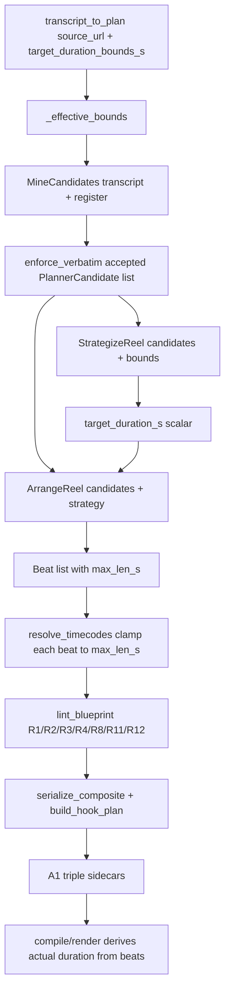
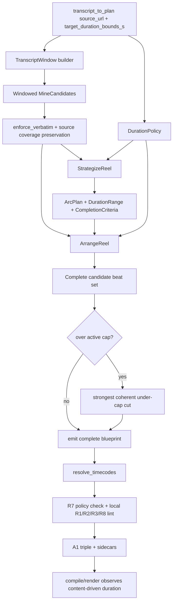
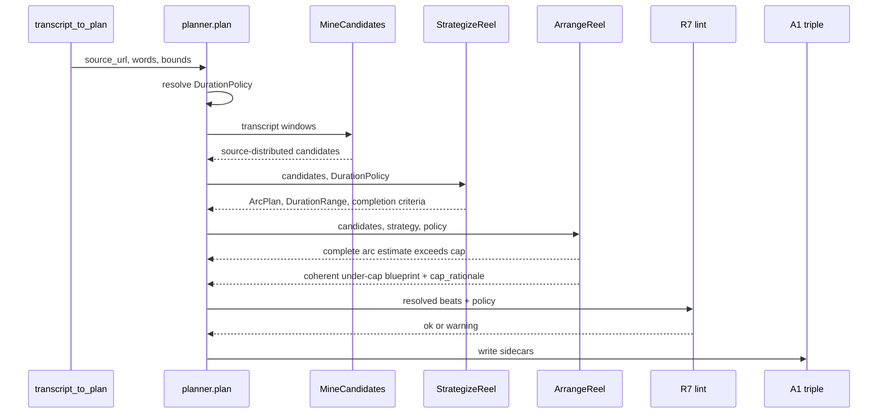

# System Map: AF-ezg Content-Driven Length

Date: 2026-07-19
Worker: CyanCompass
Related plan: `thoughts/searchable/shared/plans/2026-07-19-reel-af-content-driven-length.md`
Related research: `thoughts/searchable/shared/research/2026-07-19-reel-af-content-driven-length-research.md`

## Current Length Dataflow



Current behavior:

- Bounds constrain only `strategy.target_duration_s`.
- Arrange is not required to match `target_duration_s`.
- Resolved duration is the sum of arranged/clamped beats and transitions.
- R1/R2/R3/R8 are local warning rules.
- R11 is the hard retention lint gate.
- 180s is a default planner policy, while DSL hard render cap is 900s.

## Target Content-Driven Dataflow



Target behavior:

- Duration policy is resolved once.
- Mine provides enough source-distributed material for a complete arc.
- Strategize owns the definition of completion.
- Arrange selects required beats until completion, not until a scalar runtime.
- The cap is applied after completeness is known.
- If cap pressure exists, arrange chooses a coherent under-cap cut and records omissions.

## Length Lever to Behavior Map

| Lever | Current behavior | Target behavior |
|---|---|---|
| Spec R7 | Short-form default band, `15-30s / 30-60s`. | Content-driven complete arc, default 180s cap, overridable by `target_duration_bounds_s.max_s > 180`. |
| `target_duration_bounds_s` | Produces hard local bounds for strategize scalar target. | Duration policy input; max above 180 overrides cap, lower/upper preferences do not force padding/truncation. |
| `target_duration_s` | Scalar strategy/blueprint field; not used to fit output. | Removed from LLM decision contract; replaced by `DurationRange` and `DurationPolicy`. |
| `max_candidates` | Upper adapter guard only. | Global safety cap after windowed source coverage preservation. |
| `max_beats` | Configured but unused. | Active upper guard for pathological output, not a desired count. |
| Mine prompt | High-value candidates for "a short reel"; no coverage contract. | Windowed/whole-source candidate mining with high-value filter and source diversity. |
| Strategize prompt | Pick shortest tight band, 18-55s. | Pick intended arc, completion criteria, duration latitude, and cap rationale. |
| Arrange prompt | Five-role shape plus short examples; no target-fill rule. | Include all required beats to complete arc, then cap by coherent cut. |
| R1 | Hook warning if above 3.5s. | Same local rule. |
| R2 | Beat warning if above register cadence without change. | Same local rule, scaled to more beats. |
| R3 | Back-half monotone-ish tightening warning. | Local/group tightening toward payoff; not a total-length limiter. |
| R8 | Final span echo warning. | Same local ending rule. |
| R11 | Hard bait error. | Same hard gate. |
| DSL `MAX_REEL_DURATION_S` | Hard render cap 900s. | Unchanged; planner policy stays stricter by default. |

## Interface Grammar

Planner reasoner input:

```text
TranscriptToPlanInput =
  source_url,
  register?,
  target_duration_bounds_s?,
  out_dir? ;

DurationBounds =
  "{", ("min_s" | "min"), float, (","), ("max_s" | "max"), float, "}" ;
```

Resolved duration policy:

```text
DurationPolicy =
  soft_cap_s: 180.0,
  effective_cap_s: (target_duration_bounds_s.max_s if max_s > 180 else 180.0),
  advisory_min_s: optional float,
  advisory_max_s: optional float,
  cap_overridden: bool ;
```

Strategy contract:

```text
ReelStrategy =
  template_,
  duration_range_s,
  duration_policy,
  arc,
  hook,
  engagement_primary,
  cta,
  rationale ;

ArcPlan =
  promise,
  thread,
  completion_criteria[],
  required_candidate_ids[],
  optional_candidate_ids?,
  excluded_candidate_ids? ;
```

Blueprint contract:

```text
ReelBlueprint =
  template_,
  duration_range_s,
  duration_policy,
  arc,
  hook,
  beats[],
  loop,
  engagement_primary,
  cta,
  completion_rationale,
  cap_rationale?,
  omitted_candidate_ids?,
  rationale? ;
```

R7 diagnostic:

```text
R7Diagnostic =
  rule: "R7",
  severity: "warning" | "error",
  total_duration_s,
  effective_cap_s,
  cap_overridden,
  advisory_min_s?,
  advisory_max_s?,
  message,
  repair_hint? ;
```

## Boundary Map

| Boundary | Existing evidence | Target contract |
|---|---|---|
| Public reasoner to planner | `src/reel_af/app.py:1748-1792` | Preserve existing `target_duration_bounds_s` input, but reinterpret it as duration policy. |
| Config to runtime | `src/reel_af/render/config/planner.json:11-20`, `src/reel_af/planner/config.py:47-82` | Add typed R7/window config fields; config and schema must change together because extras are forbidden. |
| Pipeline to mine | `src/reel_af/planner/pipeline.py:51-56`, `src/reel_af/planner/llm.py:229-239` | Pass transcript windows or windowed text blocks; keep verbatim enforcement after BAML. |
| Mine to accepted candidates | `src/reel_af/planner/verbatim.py:45-84` | Preserve alignment floor while retaining source diversity after filtering. |
| Pipeline to strategize | `src/reel_af/planner/pipeline.py:63`, `src/reel_af/planner/llm.py:241-258` | Pass `DurationPolicy`; validate arc/range, not scalar target fit. |
| Strategize to arrange | `src/reel_af/planner/llm.py:260-276` | Arrange receives `ArcPlan`, completion criteria, duration policy, and candidate list. |
| Arrange to serializer | `src/reel_af/planner/serialize.py:58-167` | Serializer still writes selected beats; policy check happens before writing. |
| Planner to consumer | `src/reel_af/planner/pipeline.py:141-179` | Sidecars include strategy/blueprint/candidates so eval can verify coverage and completion. |

## Sequence: Over-Cap Arc



## Drift Watchpoints

- Generated BAML clients must be regenerated after source BAML edits.
- Eval readers need to understand `duration_range_s`, `duration_policy`, and `arc`.
- Any temporary compatibility `target_duration_s` field must not be used by arrange as a hard target.
- R3 tests must not accidentally encode strict monotonic duration across dozens of beats.
- Prompt examples must include long-form arcs; otherwise the model can stay short even if types change.
