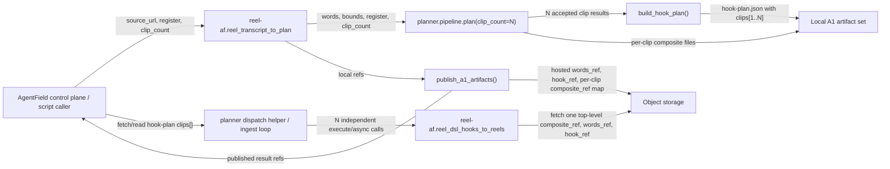
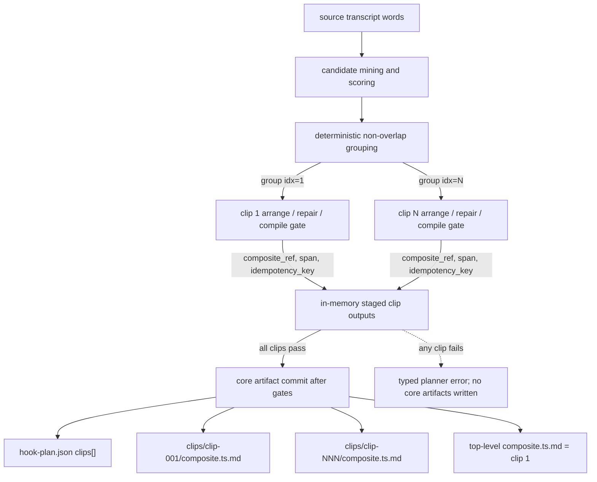
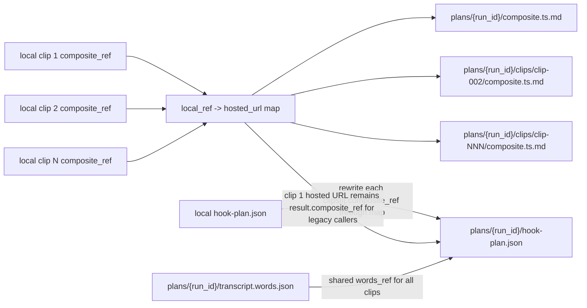
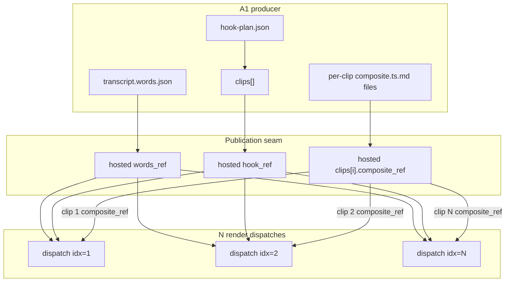

# AF-7nu A1 Multi-Clip Planning - TDD Implementation Plan

## Overview

Build A1 planner fan-out so one source transcript can produce `N` planned clips in
`hook-plan.json clips[]`. Each clip is independently renderable by a separate
`reel-af.reel_dsl_hooks_to_reels` dispatch with that clip's `idx`.

The renderer stays single-reel-per-dispatch. Do not change `dsl_hooks_to_reels()` to
return multiple videos. Its existing downstream contract is `_load_hook_clip(hook_ref,
clip_idx)` selecting one hook clip (`src/reel_af/app.py:1589`) and then rendering one
result (`src/reel_af/app.py:1599-1745`).

## Current State Analysis

The ground-truth handoff documents the split: `transcript_to_plan` writes artifacts
only, `dsl_hooks_to_reels` consumes `source_url`, `composite_ref`, `words_ref`,
`hook_ref`, and `clip_idx`, and object storage is the handoff seam.

Key current facts:

- `build_hook_plan()` currently accepts one hook/span and returns `clips` with exactly
  one entry (`src/reel_af/planner/serialize.py:170-229`).
- The immutable idempotency key hashes `source_url`, `idx`, `start_s`, `end_s`, and
  `composite_ref` (`src/reel_af/planner/serialize.py:368-379`).
- `plan()` currently runs one strategize/arrange/repair path, serializes one
  `composite.ts.md`, runs the real DSL compile gate once, and writes one core triple
  (`src/reel_af/planner/pipeline.py:68-238`, `src/reel_af/planner/pipeline.py:260-302`).
- The compile gate already uses the real renderer compiler with
  `delivery_required=True` (`src/reel_af/planner/pipeline.py:202-217`,
  `src/reel_af/planner/pipeline.py:620-630`).
- `publish_a1_artifacts()` currently uploads one top-level `composite.ts.md` and
  rewrites every clip's `composite_ref` to that one URL (`src/reel_af/storage.py:179-249`).
  That would collapse distinct multi-clip composites unless extended.
- `dsl_hooks_to_reels()` resolves the top-level `composite_ref` argument before reading
  the selected hook clip (`src/reel_af/app.py:1651-1656`). Therefore `clip_idx` does
  not choose the composite. The caller must pass `composite_ref=clip["composite_ref"]`
  for the selected clip.
- The web DSL-hooks submit path already canonicalizes one `clip_idx` and dispatches
  one CP call (`web/reel_jobs.py:452-487`, `web/server.py:376-415`), but there is no
  production fan-out caller that reads planner `clips[]` and dispatches them all.

## Desired End State

Given a source URL and a requested `clip_count=N`, A1 produces:

- one `transcript.words.json` shared by all clips;
- one `hook-plan.json` whose `clips[]` contains exactly `N` clips;
- one per-clip composite file, referenced by that clip's `composite_ref`;
- distinct, non-overlapping source spans for each clip;
- unique `idx` values starting at `1`;
- unique immutable `idempotency_key` values produced at planning time and never
  recomputed by publication;
- one render dispatch per clip, each targeting `reel-af.reel_dsl_hooks_to_reels` with
  `clip_idx=clip["idx"]` and top-level `composite_ref=clip["composite_ref"]`.

Default behavior remains backward-compatible: with no explicit `clip_count`, the
planner emits one clip and existing single-clip tests keep their current shape.

### Observable Behaviors

- Given `clip_count=1`, when the A1 planner runs, then it emits the same single-clip
  artifact contract that existing callers and tests expect.
- Given `clip_count=N`, when the A1 planner succeeds, then `hook-plan.json clips[]`
  contains exactly `N` entries with sequential `idx`, non-overlapping source spans,
  per-clip `composite_ref`, and immutable `idempotency_key`.
- Given any clip candidate whose composite fails the real DSL compile gate, when the
  planner exhausts repair for that clip, then planning fails before any partial core
  artifacts are written.
- Given a bucket-backed multi-clip result, when `publish_a1_artifacts()` publishes the
  handoff, then each clip composite is uploaded and rewritten independently, and
  idempotency keys are byte-preserved.
- Given a published hook plan with `N` clips, when orchestration dispatches render work,
  then it makes `N` separate `reel-af.reel_dsl_hooks_to_reels` calls, each with that
  clip's own top-level `composite_ref`, shared `words_ref`/`hook_ref`, and `clip_idx`.

## Locked Decisions

- Add a backward-compatible `clip_count: int = 1` public input to
  `transcript_to_plan()` and an equivalent keyword on `planner.pipeline.plan()`.
- Use one multi-clip `hook-plan.json`, not a render-side batch API.
- Each clip owns a separate composite artifact. A shared composite would render the
  same whole timeline repeatedly because the renderer does not filter the composite by
  `clip_idx`.
- Keep `result["composite_ref"]` as the first clip's composite ref for legacy
  single-clip callers. Multi-clip orchestration must use `clips[*].composite_ref` from
  the hook plan.
- In bucket mode, upload every distinct clip composite and rewrite each clip to its
  own published URL. Do not rewrite all clips to the same composite URL.
- If requested `N` clips cannot be produced with non-overlapping, render-compile-clean
  spans, fail the planner without writing partial core artifacts.
- The all-or-nothing guarantee covers planner gate failures before core artifacts are
  committed: invalid `clip_count`, insufficient non-overlapping spans, arrange/repair
  failure, coherence/lint failure, or real compile failure. OS-level filesystem write
  atomicity after the commit step is out of scope for this implementation slice.
- Keep render changes to regression coverage only.

## Non-Goals

- No multi-video return contract from `dsl_hooks_to_reels()`.
- No renderer-side batching, composite filtering, or clip fan-out.
- No UI exposure of the hidden DSL-hooks target.
- No change to `compile_composite()` semantics.
- No recomputing idempotency keys during object-storage publication.
- No CP event aggregation for the set of rendered clips.
- No new guarantee that an arbitrary filesystem write error leaves no partially
  created file after the planner has passed every pre-write gate.

## File-Level Change Plan

| File | Planned change |
|---|---|
| `src/reel_af/planner/serialize.py` | Add a small `HookClipInput`/`PlannedHookClip` value object or equivalent dict helper. Extend `build_hook_plan()` so it can accept multiple clip specs while preserving the current single-span call path. Validate unique `idx`, resolved spans, non-empty per-clip `composite_ref`, non-overlapping source spans, and immutable idempotency-key generation per clip. |
| `src/reel_af/planner/pipeline.py` | Add `clip_count=1`. Split accepted candidates into deterministic, non-overlapping clip groups; run strategize/arrange/coherence/lint/compile for each clip; write per-clip composites; build one multi-clip hook plan; return no partial artifacts on any pre-write planner gate failure. |
| `src/reel_af/storage.py` | Extend `publish_a1_artifacts()` to discover every distinct `clips[*].composite_ref`, upload each local composite, and rewrite each clip to its matching hosted URL while preserving `idempotency_key`. Keep the current one-composite behavior for single-clip plans. |
| `src/reel_af/app.py` | Add `clip_count` to `transcript_to_plan()` and pass it into `plan()`. Keep source URL validation, writer precedence, async writer support, and exception-to-`dsl_artifact_unavailable` mapping unchanged. |
| `src/reel_af/planner/dispatch.py` | Add a pure helper that builds one `DslHookDispatch` item per hook-plan clip. Each item contains metadata plus raw `cp_input`; caller wrappers, not the helper, own the outer `{"input": cp_input}` control-plane envelope. Add a small hook-plan loader/fetch seam for local and HTTPS refs. Optionally add an injected dispatcher wrapper around that helper for callers that want to enqueue all clips. |
| `scripts/ingest_source.py` | Update the existing deployed A1 driver from one `--clip-idx` stage-2 dispatch to a clip enumeration loop: after `transcript_to_plan`, load/fetch `hook-plan.json` through the dispatch loader, build per-clip render inputs with the planner dispatch helper, and dispatch/poll one render execution per clip. Keep the script's existing `dispatch(cp_input)` wrapper responsible for exactly one `{"input": cp_input}` HTTP JSON envelope, and keep single-clip mode backward-compatible. |
| `tests/planner/test_serialize.py` | Add multi-clip hook-plan unit tests and invalid overlap/duplicate-index red tests. |
| `tests/planner/test_pipeline.py` | Add multi-clip pipeline success, direct invalid `plan(..., clip_count=...)` validation, compile-gate failure, no-partial-artifacts, and real-consumer `clip_idx=2` regression tests. |
| `tests/planner/test_reasoner.py` | Add `transcript_to_plan(..., clip_count=2)` pass-through and publication tests. |
| `tests/planner/test_dispatch.py` | Add pure dispatch-input, hook-plan loader/fetch, exactly-one-envelope, and injected-dispatcher loop tests proving one render call per clip. |
| `tests/test_ingest_source.py` or `tests/planner/test_dispatch.py` | Add coverage that the current script-level caller dispatches/polls N stage-2 executions when the stage-1 hook plan has N clips, records the actual HTTP JSON bodies, and proves each body has exactly one `input` layer without sending a batched render payload. |
| `tests/test_storage.py` | Add bucket publication coverage for multiple clip composites. |

## Testing Strategy

Primary command requested by BrownFox:

```bash
uv run --extra dev python -m pytest tests/planner -q
```

Additional targeted commands because publication and render-regression seams sit
outside `tests/planner/`:

```bash
uv run --extra dev python -m pytest tests/test_storage.py tests/test_dsl_hooks_worker_closure.py -q
uv run --extra dev python -m pytest tests/web/test_dsl_hooks_submit.py tests/web/test_orphaned_dispatch.py -q
```

Run the full suite only after the targeted Red-Green-Refactor cycles are green.

Manual review checks:

- Inspect the produced `hook-plan.json` and verify every `clips[*].composite_ref`
  points at a clip-specific composite, not a shared whole-source composite.
- Inspect the generated dispatch bodies and verify there is no batched render input
  such as `clips`, `clip_indices`, or a multi-video return expectation.
- Confirm no change asks `dsl_hooks_to_reels()` to render more than one video per call.

## Behavior 1: Serializer Emits Multiple Hook Clips

**Given** two resolved clip spans with distinct composite refs and non-overlapping
source intervals, **when** the hook plan is built, **then** `clips[]` contains two
consumer-shaped entries with stable `idx`, distinct `start_s/end_s`, distinct
`composite_ref`, target `reel-af.reel_dsl_hooks_to_reels`, and unique idempotency keys.

Red:

- Add `tests/planner/test_serialize.py::test_hook_plan_emits_multiple_clips_with_stable_indices_and_refs`.
- Reuse the local `_words()` and `_bp()` fixture style from
  `tests/planner/test_serialize.py:19-68`.
- Assert `plan["clips"]` has `[1, 2]`, distinct spans, distinct refs, and each clip
  validates the existing consumer-read field set from `tests/planner/test_serialize.py:167-178`.
- Assert calling the helper twice with identical inputs yields identical
  idempotency keys.
- Assert changing only clip 2's `composite_ref` changes only clip 2's key.

Green:

- Keep the current `build_hook_plan(... span=resolved[0], ...)` call working by
  normalizing it into a one-item clip-spec list.
- Add a multi-clip path that maps each clip spec to the existing clip payload shape.
- Reuse `_idempotency_key()` unchanged.

Refactor:

- Extract small helpers for `_clip_payload()` and `_clip_source_span()` only after the
  red test passes.
- Keep `_first_resolved_span()` for legacy callers until all call sites move to the
  normalized clip-spec path.

Success criteria:

- Red: the new multi-clip serializer test fails because `build_hook_plan()` can only
  return one clip today.
- Green: the new test and existing `test_hook_plan_matches_consumer_shape` pass.
- Refactor: the single-clip public call remains source-compatible.

## Behavior 2: Serializer Rejects Ambiguous Clip Sets

**Given** duplicate indexes, non-sequential indexes, overlapping spans, unresolved
spans, or a clip without a composite ref, **when** the hook plan is built, **then** it
raises before returning a partial plan.

Red:

- Add parametrized tests in `tests/planner/test_serialize.py` for:
  - duplicate `idx`;
  - `clip1.end_s > clip2.start_s`;
  - unresolved `ResolvedBeat`;
  - empty `composite_ref`;
  - `idx < 1`;
  - index gaps such as `[1, 3]` and `[2, 3]`.

Green:

- Add validation before constructing the returned dict.
- Require the accepted `idx` set to be exactly `1..N`; reject positive but
  non-sequential indexes before returning a hook-plan dict.
- Sort/validate spans by `start_s` for overlap, but preserve the caller's explicit
  `idx` order in `clips[]` after validation.

Refactor:

- Keep the error type as `ValueError`; do not introduce public planner error codes
  until the pipeline maps these failures.

Success criteria:

- Red: at least one invalid multi-clip set currently returns a plan or fails for the
  wrong reason.
- Green: every invalid set fails before a plan dict is returned.
- Refactor: validation helpers are pure and have no file I/O.

## Behavior 3: Pipeline Produces N Per-Clip Composites

**Given** `clip_count=2` and a fake planner LLM capable of arranging two independent
clip blueprints, **when** `plan()` runs, **then** it writes one hook plan with two
clips and two distinct per-clip composite files.

Red:

- Add `tests/planner/test_pipeline.py::test_plan_writes_multi_clip_hook_plan_and_composite_artifacts`.
- Extend the existing `_FakePlannerLLM` pattern from `tests/planner/test_pipeline.py:60-113`
  so `strategize`/`arrange` can be called once per clip group.
- Seed accepted candidates in separate source windows using the existing
  window-diversity helpers around `tests/planner/test_pipeline.py:269-327`.
- Call `plan(SRC, words=_seed_words(), ..., clip_count=2, out_dir=tmp_path)`.
- Assert:
  - `res["clip_count"] == 2`;
  - `hook-plan.json` has two clips;
  - `clips[0]["composite_ref"] != clips[1]["composite_ref"]`;
  - both composite files exist and compile independently through `compile_composite`;
  - source spans are non-overlapping.

Green:

- Add `clip_count` to `plan()`, defaulting to `1`.
- Introduce deterministic candidate grouping for multi-clip planning:
  - sort accepted candidates by source window and score;
  - choose up to `clip_count` seed groups with non-overlapping source windows;
  - pass only the group's candidates plus contextual candidates into that clip's
    strategize/arrange loop.
- Reuse the existing single-clip arrange/repair/coherence/lint/compile sequence for
  each group.
- Write composites as `clips/clip-001/composite.ts.md`,
  `clips/clip-002/composite.ts.md`, etc.; keep top-level `composite.ts.md` as clip 1
  for legacy compatibility.

Refactor:

- Extract a private `_plan_one_clip(...)` from the existing loop after the first
  multi-clip test passes.
- Keep the current single-clip sidecar JSON shape when `clip_count == 1`. For
  `clip_count > 1`, write diagnostic sidecars as clip-indexed containers:
  `{"schema_version": "1", "clips": [{"idx": 1, ...}, ...]}`.

Success criteria:

- Red: `plan(..., clip_count=2)` is unsupported and/or writes only one composite.
- Green: two clip composites and one two-entry `hook-plan.json` are written only after
  both clips pass planner gates.
- Refactor: `clip_count=1` test output remains byte-shape compatible except for
  intentionally added optional metadata such as `clip_count`.

## Behavior 4: Per-Clip Compile Gate Is All-Or-Nothing

**Given** clip 1 compiles and clip 2 fails the real DSL compile gate, **when**
`plan(..., clip_count=2)` runs, **then** the planner returns
`planner_render_compile_failed` and writes no partial core artifacts.

Red:

- Add `tests/planner/test_pipeline.py::test_multi_clip_compile_failure_writes_no_partial_core_artifacts`.
- Use one good fake blueprint and one blueprint with an intentionally unrenderable
  composite marker/span arrangement.
- Assert the result error is `planner_render_compile_failed`.
- Assert `hook-plan.json`, top-level `composite.ts.md`, and per-clip composite files
  are absent.

Green:

- Stage all per-clip composites and hook-plan data in memory until every clip passes
  resolve, coherence, retention lint, and `_compile_render_composite()`.
- Only then call `_write_triple()` or its multi-clip successor.

Refactor:

- Keep repair budgets bounded per clip. Do not let one failing clip consume unbounded
  retries or silently reduce `clip_count`.

Success criteria:

- Red: a later bad clip can be masked by the first good clip, or partial artifacts are
  visible after failure.
- Green: `planner_render_compile_failed` is returned and no core triple exists.
- Refactor: compile diagnostics retain renderer codes such as `JOIN_REFUSED`.

## Behavior 5: Insufficient Non-Overlapping Clips Fails Closed

**Given** `clip_count=2` but the accepted candidate pool can only produce one
non-overlapping renderable clip, **when** the planner runs, **then** it returns a typed
planner failure and writes no partial artifacts.

Red:

- Add `tests/planner/test_pipeline.py::test_multi_clip_requires_requested_non_overlapping_clip_count`.
- Seed candidates whose resolved source spans overlap, or only one viable source
  window.
- Assert a new error code such as `planner_multi_clip_insufficient_spans`.

Green:

- Add `PLANNER_MULTI_CLIP_INSUFFICIENT_SPANS`.
- Validate the number of candidate groups before any LLM arrange calls where possible.
- Revalidate final resolved clip spans after arrange, because the LLM can trim or
  choose overlapping spans inside a non-overlapping candidate group.

Refactor:

- Put grouping and final span validation in private pure helpers with unit coverage
  if the pipeline test becomes too broad.

Success criteria:

- Red: overlapping candidates can satisfy `clip_count=2`, or the planner silently emits
  fewer clips than requested.
- Green: insufficient span diversity returns `planner_multi_clip_insufficient_spans`
  and writes no partial artifacts.
- Refactor: error diagnostics identify which requested clip index could not be filled.

## Behavior 6: Object Storage Publishes Distinct Clip Composites

**Given** a multi-clip planner result with local per-clip composite refs, **when**
`publish_a1_artifacts()` runs with `REEL_BUCKET_NAME` configured, **then** each clip's
composite is uploaded and rewritten to its own hosted URL, and every idempotency key is
unchanged.

Red:

- Add `tests/test_storage.py::test_publish_a1_artifacts_uploads_and_rewrites_multi_clip_composites`.
- Seed `hook-plan.json` with two clips pointing at two local composite files.
- Assert uploads include:
  - `plans/{run_id}/composite.ts.md` for clip 1 compatibility;
  - `plans/{run_id}/clips/clip-002/composite.ts.md` for clip 2;
  - `plans/{run_id}/transcript.words.json`;
  - `plans/{run_id}/hook-plan.json`.
- Assert uploaded hook JSON has two distinct hosted `clips[*].composite_ref` values.
- Assert `clips[*].idempotency_key` values equal the pre-publication values.
- Assert no local temp path appears in returned refs or uploaded hook JSON.

Green:

- Parse the hook plan before uploading the hook.
- Build a local-ref to hosted-URL map for every distinct clip composite.
- Reuse the existing top-level composite upload for the first/top-level ref.
- Upload additional composites under deterministic per-clip keys.
- Rewrite each clip from the map before uploading `hook-plan.json`.

Refactor:

- Keep no-bucket behavior as a shallow-copy no-op.
- Preserve current single-clip storage tests unchanged.

Success criteria:

- Red: current `_hook_body_with_published_composite()` collapses all clip refs to one
  hosted composite URL.
- Green: each hosted clip ref maps back to the corresponding local composite body, and
  all idempotency keys are unchanged.
- Refactor: single-clip publication still uploads the fixed core triple under the
  existing object keys.

## Behavior 7: transcript_to_plan Passes clip_count Through Publication

**Given** `transcript_to_plan(..., clip_count=2)` and a fake planner that returns a
multi-clip local result, **when** the default writer publishes artifacts, **then** the
returned refs are hosted, `clip_count` remains `2`, and the uploaded hook plan preserves
two clips without local paths.

**Given** an invalid public `clip_count`, **when** `transcript_to_plan()` is called,
**then** the reasoner returns a deterministic validation error before transcription,
planning, artifact publication, or the broad artifact-unavailable exception mapping.

**Given** an invalid direct planner `clip_count`, **when** `planner.pipeline.plan()` is
called, **then** it fails deterministically before candidate mining, LLM calls, or core
artifact writes.

Red:

- Add `tests/planner/test_reasoner.py::test_transcript_to_plan_publishes_multi_clip_hook_plan`.
- Follow the publication test pattern at `tests/planner/test_reasoner.py:238-273`.
- Monkeypatch planner `plan()` to assert it received `clip_count=2`.
- Add `tests/planner/test_reasoner.py::test_transcript_to_plan_rejects_invalid_clip_count_before_planning`.
- Parametrize invalid public values: `0`, `-1`, `True`, `False`, `"2"`, `1.5`, and
  `None` if `None` is explicitly passed rather than omitted.
- Assert invalid values return a new validation error such as
  `{"error": "invalid_clip_count", ...}` and do not call the transcriber, planner, or
  artifact writer. This must not be swallowed as `dsl_artifact_unavailable`.
- Add a default test proving omitted `clip_count` passes `1` to the planner.
- Add `tests/planner/test_pipeline.py::test_plan_rejects_invalid_clip_count_before_mining_or_writing`.
- Parametrize the same invalid direct planner values: `0`, `-1`, `True`, `False`,
  `"2"`, `1.5`, and explicit `None`.
- Assert direct invalid values produce the same typed validation contract
  (`invalid_clip_count` or a documented `ValueError` mapped before side effects),
  do not call candidate mining, do not call the planner LLM, and leave no
  `hook-plan.json`, top-level `composite.ts.md`, or per-clip composite files.

Green:

- Add `clip_count` to the reasoner signature with default `1`.
- Validate `clip_count` is an integer >= 1 before calling the transcriber or planner;
  reject `bool` even though `bool` is an `int` subclass in Python.
- Pass the value through to `_plan(...)`.
- Add `clip_count` to `planner.pipeline.plan()` with the same validation helper at
  the top of the function, before candidate mining or any artifact writes.

Refactor:

- Keep invalid `source_url` behavior unchanged.
- Keep injected `artifact_writer` precedence unchanged.
- Put `clip_count` validation in a tiny pure helper so `plan()` can share the same
  contract without duplicating bool/int edge cases.

Success criteria:

- Red: `transcript_to_plan()` cannot accept or forward `clip_count`.
- Green: the fake planner observes `clip_count=2`, and the default writer publishes a
  two-clip hook plan without local paths in bucket mode.
- Green: invalid `clip_count` returns `invalid_clip_count`, and transcribe/planner
  fakes have zero calls.
- Refactor: injected writers continue to receive the local planner result before any
  default publication.
- Green: direct invalid `plan(..., clip_count=bad)` has zero mining, LLM, compile, or
  filesystem side effects.

## Behavior 8: Dispatch Helper Emits One Render Input Per Clip

**Given** a published hook plan containing N clips, **when** the orchestration helper
builds DSL-hooks dispatches, **then** it emits N separate dispatch items, one per
clip, each with raw `cp_input` using the selected clip's own `composite_ref` and
`clip_idx`.

The exact helper output is:

```python
DslHookDispatch = {
    "idx": int,
    "idempotency_key": str,
    "target": "reel-af.reel_dsl_hooks_to_reels",
    "cp_input": {
        "source_url": str,
        "composite_ref": clip["composite_ref"],
        "words_ref": str,
        "hook_ref": str,
        "clip_idx": clip["idx"],
    },
}
```

`cp_input` is the raw control-plane input. Existing wrappers such as
`scripts/ingest_source.py::dispatch(cp_input)` and web dispatch code own the outer
HTTP/body envelope and must send exactly `{"input": cp_input}`. The pure helper must
not return the outer `input` envelope, so callers cannot accidentally send
`{"input": {"input": ...}}`.

Red:

- Add `tests/planner/test_dispatch.py::test_build_dsl_hook_dispatch_inputs_uses_each_clip_composite_ref`.
- Seed:
  - `source_url`;
  - hosted `words_ref`;
  - hosted `hook_ref`;
  - hook-plan body with two clips and two hosted `composite_ref` values.
- Assert the returned list is:
  - target `reel-af.reel_dsl_hooks_to_reels` for every item;
  - `DslHookDispatch` per item, with `idx`, clip-specific `idempotency_key`, target,
    and raw `cp_input`;
  - `cp_input` contains only `source_url`, `composite_ref`, `words_ref`, `hook_ref`,
    and `clip_idx`;
  - no top-level `input` key in the helper output, because the wrapper owns that
    envelope;
  - no batched `clips`, `clip_indices`, or multi-video render payload.
- Assert clip 2's top-level dispatch `composite_ref` equals clip 2's hook-plan
  `composite_ref`, not the first clip or result-level `composite_ref`.
- Assert the dispatch item `idempotency_key` equals the selected hook-plan clip's
  immutable planner-generated key. It may be used by the caller as metadata,
  client-request ID, or idempotency header, but it must not be recomputed.
- Add `tests/planner/test_dispatch.py::test_dispatch_wrapper_wraps_cp_input_exactly_once`.
- Record the actual body passed to the injected dispatcher or HTTP adapter and assert
  it is exactly `{"input": dispatch_item["cp_input"]}` with no nested `input`.
- Add loader/fetch seam tests for both local path refs and HTTPS hook refs, using an
  injected `fetch_bytes(url)` so the dispatch module does not hard-code network I/O.

Green:

- Add `src/reel_af/planner/dispatch.py` with a pure helper, for example
  `build_dsl_hook_dispatches(source_url, words_ref, hook_ref, hook_plan)`.
- Validate each clip has `idx >= 1`, `target == HOOKS_TARGET`, and a hosted or `a1://`
  `composite_ref`.
- Add `load_hook_plan_for_dispatch(hook_ref, fetch_bytes=...)` that accepts parsed
  dicts, local files/paths, and HTTPS refs. HTTPS loading must go through the injected
  fetch function for deterministic tests.

Refactor:

- Add an injected dispatcher wrapper only after the pure helper is green:
  `dispatch_dsl_hook_clips(..., dispatch_async)`, which loops over helper output and
  calls `dispatch_async(target, {"input": item["cp_input"]}, metadata=...)` or the
  equivalent local adapter once per clip. The wrapper must pass the planner-generated
  idempotency key as metadata/header/client request id when the selected dispatch seam
  supports it; otherwise the implementation must state that CP dispatch idempotency is
  not provided by this slice and still preserve the key in the summary.
- Reuse the web `_dispatch_one` pattern later if this helper is wired into Flask, but
  do not require a web route for the first implementation slice.

Success criteria:

- Red: there is no planner-side helper that can enumerate clips into render inputs,
  and using result-level `composite_ref` would render the wrong timeline for clip 2.
- Green: every dispatch input uses `clip["composite_ref"]` as top-level
  `cp_input["composite_ref"]`, and every actual CP body has exactly one
  `{"input": ...}` layer.
- Refactor: the helper accepts parsed hook-plan dicts and file-loaded hook plans
  through a small wrapper, with HTTPS fetch injected and without CP side effects.

## Behavior 9: Dispatch Loop Does Not Batch Render Work

**Given** a fake dispatcher and a two-clip hook plan, **when** the dispatch wrapper runs,
**then** the fake dispatcher observes two calls to the same target and no call contains
more than one `clip_idx`.

Red:

- Add `tests/planner/test_dispatch.py::test_dispatch_dsl_hook_clips_calls_renderer_once_per_clip`.
- Use a fake dispatcher that records calls and returns distinct execution IDs.
- Assert two calls, both to `reel-af.reel_dsl_hooks_to_reels`.
- Assert the result is an orchestration summary such as:
  `{"clip_dispatches": [{"idx": 1, "idempotency_key": "...", "execution_id": ...}, ...]}`.
- Add script-level coverage for `scripts/ingest_source.py::run_a1` or a small extracted
  script helper: stage 1 returns a hook plan with two clips, stage 2 dispatch is called
  twice, and each actual HTTP JSON body is exactly
  `{"input": {"source_url": ..., "composite_ref": clip["composite_ref"], "words_ref": ..., "hook_ref": ..., "clip_idx": clip["idx"]}}`.
  Assert there is no `{"input": {"input": ...}}` double envelope.

Green:

- Implement the wrapper as a straightforward loop over the pure dispatch inputs.
- Do not call `dsl_hooks_to_reels()` directly in-process; this helper prepares or
  drives control-plane dispatches.
- Wire `scripts/ingest_source.py` to the helper after the helper test is green. Preserve
  the current single-clip `--clip-idx` behavior as a compatibility mode, but add a
  multi-clip mode that enumerates `hook-plan.json clips[]` loaded through
  `load_hook_plan_for_dispatch()`.

Refactor:

- If partial CP dispatch failure handling is needed, mirror the existing fan-out
  outcome style from `web/server.py:489-520` without changing renderer behavior.

Success criteria:

- Red: no loop exists, or a tempting batch payload is needed to express multi-clip.
- Green: the fake dispatcher records exactly one call per clip and no call contains
  more than one `clip_idx`.
- Refactor: idempotency keys for queued work are clip-specific and do not dedupe all
  clips into one dispatch; if the selected CP adapter cannot consume an idempotency
  key, the summary still records the immutable planner key for each clip.

## Behavior 10: Render Consumer Still Selects One Non-Default Clip

**Given** a hook plan with clip 1 and clip 2, and top-level `composite_ref` points to
clip 2's composite, **when** `dsl_hooks_to_reels(..., clip_idx=2)` runs through fake
render I/O, **then** it returns one success payload with `clip_idx == 2`.

Red:

- Add `tests/planner/test_pipeline.py::test_multi_clip_triple_consumes_requested_clip_idx_through_real_consumer`
  or a focused worker-closure test.
- Reuse the fast fake render pattern from `tests/planner/test_pipeline.py:367-413`.
- Assert `out["clip_idx"] == 2`, `out["target_workflow"] == "dsl_hooks"`, and there
  is a single `download_url`.

Green:

- No render implementation should be required if dispatch passes the correct
  per-clip `composite_ref`.
- If the test fails because fixture data is malformed, fix the fixture or planner
  output, not renderer cardinality.

Refactor:

- Add a missing-clip regression asserting `clip_idx=99` maps to
  `dsl_artifact_unavailable`, preserving `_load_hook_clip()` behavior.

Success criteria:

- Red: the test fails if dispatch passes the wrong top-level composite, proving the
  planner/orchestration contract matters.
- Green: `dsl_hooks_to_reels(..., clip_idx=2)` returns one result with `clip_idx == 2`.
- Refactor: no renderer API shape changes are introduced.

## Implementation Order

1. Serializer multi-clip shape and validation.
2. Pipeline per-clip arrange/compile/write with default `clip_count=1` still green.
3. Storage publication for distinct per-clip composites.
4. `transcript_to_plan` `clip_count` pass-through and publication coverage.
5. Planner dispatch helper and injected loop.
6. Downstream render regression for non-default `clip_idx`.

## Review Checklist

- The plan keeps renderer cardinality single-reel-per-dispatch.
- Every multi-clip dispatch uses `clip["composite_ref"]` as the top-level
  `cp_input["composite_ref"]` before the wrapper adds exactly one `input` envelope.
- No planner code writes partial core artifacts after a later pre-write gate fails.
- Publication does not collapse per-clip composites to one URL.
- Idempotency keys are generated once by the planner and preserved by storage and
  dispatch.
- Default `clip_count=1` preserves existing public behavior.

## Plan Completion Criteria

- `uv run --extra dev python -m pytest tests/planner -q` passes after implementation.
- Targeted storage and dispatch tests listed above pass after implementation.
- `bd show AF-7nu` links to this plan path and remains open for implementation until
  code is merged.
- Agent Mail review confirms no reviewer found a renderer-side multi-video contract in
  the plan.

## System Map Addendum - A1 Multi-Clip Fan-Out

This addendum maps the additive A1 multi-clip design above. It does not change
renderer cardinality: every render dispatch still targets one clip and returns one
video result.

### System Context



### Planner Fan-Out System Diagram



### Object-Storage Publish Data Flow



### Per-Clip Render Dispatch Sequence

```mermaid
sequenceDiagram
    participant Caller as Stage-1 caller / orchestrator
    participant TTP as transcript_to_plan
    participant Plan as planner.plan
    participant Pub as publish_a1_artifacts
    participant Store as Object storage
    participant Dispatch as dispatch helper
    participant CP as AgentField execute/async
    participant Render as dsl_hooks_to_reels

    Caller->>TTP: source_url, register, clip_count=N
    TTP->>Plan: words, source_url, register, clip_count=N
    Plan-->>TTP: local words_ref, hook_ref, composite_ref=clip1, clips[1..N]
    TTP->>Pub: local planner result
    Pub->>Store: upload transcript.words.json
    loop each distinct clips[i].composite_ref
        Pub->>Store: upload clip i composite
    end
    Pub->>Store: upload hook-plan.json with hosted clip refs
    Pub-->>TTP: hosted words_ref, hook_ref, composite_ref=clip1
    TTP-->>Caller: published A1 result
    Caller->>Dispatch: source_url, words_ref, hook_ref, hook-plan clips[]
    loop clip in hook-plan.clips
        Dispatch->>CP: execute/async reel-af.reel_dsl_hooks_to_reels
        Note right of Dispatch: input.composite_ref = clip.composite_ref; input.clip_idx = clip.idx
        CP->>Render: source_url, composite_ref, words_ref, hook_ref, clip_idx
        Render->>Store: fetch top-level composite_ref for this dispatch
        Render->>Store: fetch hook_ref and select metadata by clip_idx
        Render-->>CP: one render result for that clip
    end
```

### Artifact Data-Flow Diagram



### Interface And Contract Grammar

```ebnf
TranscriptToPlanInput =
  "{" source_url, register?, target_duration_bounds_s?, clip_count? "}" ;

clip_count =
  integer where integer >= 1 and type(integer) is not bool ;

PlannerPlanInput =
  "plan(" source_url, words, register?, bounds?, clip_count=integer, out_dir ")" ;

PlannerPlanResult =
  "{" composite_ref=FirstClipCompositeRef,
      words_ref=WordsRef,
      hook_ref=HookPlanRef,
      clip_count=integer,
      sidecar_refs?,
      error? "}" ;

HookPlan =
  "{" schema_version="1",
      workflow="dsl_hooks",
      source_url,
      source_id,
      model,
      duration_bounds_s,
      clips=Clip[1..N] "}" ;

Clip =
  "{" idx=PositiveInteger,
      title,
      idea,
      hook,
      start_s=Seconds,
      end_s=Seconds,
      excerpt,
      composite_ref=ClipCompositeRef,
      target="reel-af.reel_dsl_hooks_to_reels",
      idempotency_key=ImmutableIdempotencyKey,
      cut_ins "}" ;

ClipCompositeRef =
  LocalCompositeRef | A1CompositeRef | HostedCompositeUrl ;

ImmutableIdempotencyKey =
  "a1:" source_id ":" sha1_12(source_url, idx, start_s, end_s, composite_ref)
  ":clip:" idx ;

PublishInput =
  PlannerPlanResult with local composite_ref, words_ref, hook_ref ;

PublishOutput =
  PlannerPlanResult with hosted composite_ref, words_ref, hook_ref
  and HookPlan.clips[*].idempotency_key byte-preserved ;

DslHookDispatch =
  "{" idx=SelectedClip.idx,
      idempotency_key=SelectedClip.idempotency_key,
      target="reel-af.reel_dsl_hooks_to_reels",
      cp_input=RawControlPlaneInput "}" ;

RawControlPlaneInput =
  "{" source_url,
      composite_ref=SelectedClip.composite_ref,
      words_ref,
      hook_ref,
      clip_idx=SelectedClip.idx "}" ;

ControlPlaneDispatchBody =
  "{" input=RawControlPlaneInput "}" ;

ForbiddenRenderBatchInput =
  "{" input: "{" clips | clip_indices | multi_video_return "}" "}" ;

ForbiddenDoubleWrappedInput =
  "{" input: "{" input: RawControlPlaneInput "}" "}" ;
```

### Seam Contracts

| Seam | Crossing | Contract |
|---|---|---|
| Public caller -> `transcript_to_plan` | `source_url`, `register`, optional `clip_count` | Omitted `clip_count` means `1`; explicit invalid values fail before transcription, planning, publication, or artifact-unavailable mapping. |
| `transcript_to_plan` -> `plan()` | `words`, `source_url`, `register`, bounds, `clip_count` | The public `clip_count` value is passed through unchanged after validation. Direct `plan()` callers get the same `clip_count` validation before mining, LLM calls, compile gates, or writes. |
| `plan()` -> per-clip gates | candidate groups by `idx` | Each requested clip has its own arrange/repair/coherence/lint/real-compile gate. A later failure fails the whole plan without writing partial core artifacts. This all-or-nothing claim covers pre-write planner gate failures, not OS-level write errors after the commit step begins. |
| `plan()` -> `hook-plan.json` | `clips[]` | `len(clips) == clip_count`; `idx` values are unique, positive, and sequential; source spans are resolved and non-overlapping. |
| `plan()` -> composite artifacts | top-level and per-clip files | Each clip owns a distinct `composite_ref`; top-level `result["composite_ref"]` remains clip 1 for legacy callers. |
| serializer -> idempotency | `idempotency_key` | Keys are generated at planning time from source URL, clip index, resolved span, and that clip's composite ref; publication and dispatch never recompute them. |
| `publish_a1_artifacts()` -> object storage | local artifact refs | Every distinct `clips[*].composite_ref` is uploaded and rewritten independently; publication must not collapse all clips to one hosted composite URL. |
| hook ref -> dispatch loader | local path, parsed dict, or HTTPS ref | `load_hook_plan_for_dispatch()` returns the parsed hook plan; HTTPS fetching is injected via `fetch_bytes` for deterministic tests. |
| orchestration -> dispatch helper | hosted A1 refs plus parsed hook plan | The helper emits one `DslHookDispatch` per hook-plan clip and no batched render payload. |
| dispatch helper -> control-plane wrapper | `DslHookDispatch.cp_input` | The helper returns raw `cp_input` only. The script/web wrapper owns exactly one `{"input": cp_input}` envelope; tests must reject double wrapping and under-wrapping. |
| dispatch helper -> control plane | `ControlPlaneDispatchBody` | Each call targets `reel-af.reel_dsl_hooks_to_reels`; top-level `input.composite_ref` equals the selected clip's own `composite_ref`; `input.clip_idx` equals that clip's `idx`; the selected clip's immutable `idempotency_key` is passed as dispatch metadata/header/client request id when the adapter supports it, otherwise preserved in the dispatch summary. |
| control plane -> renderer | single reasoner invocation | `dsl_hooks_to_reels()` resolves the provided top-level `composite_ref` before loading the selected hook clip; `clip_idx` selects hook metadata, not a composite. |
| renderer -> result | one clip result | One dispatch returns one reel result with that `clip_idx`; there is no multi-video renderer contract in this design. |
